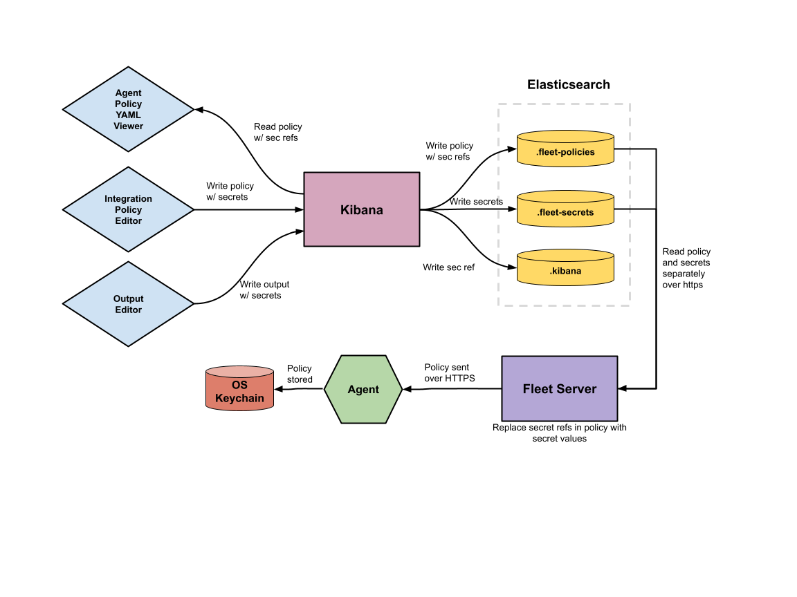

### Secrets

Fleet users often need to provide sensitive information as part of their output and integration config, for example API keys or credentials. Originally these were value were not treated in any special way, but the requirement cae to store these more securely.

## Solution Design

When it came to designing secrets storage, our goals were:

- 1. Kibana System and Fleet users should not be able to read any secrets once they are written for the first time
- 2. A malicious actor who gains authorization access to Kibana or Elasticsearch, or exploits an RCE in Kibana should not be able to read plaintext secret values.
- 3. Secrets in integration policies and outputs should be able to utilize secrets
- 4. When upgrading an integration policy, the policies secrets should be mapped across to the new version without user intervention
- 5. The design will use elastic as the secret store, however it should not prevent new secret stores from being added in the future.


## Architecture



Here is an overview of the integration policy flow:
- 1. A package identifies a field as secret using a new package spec
- 2. On creating an integration policy with a secret field, the secret is sent from the UI in plaintext
- 3. Kibana extracts secrets from the package policy using the package manifest to know which fields are secret
- 4. Kibana stores the secrets in the new `.secrets` system index 
- 5. Kibana stores the policy with references to the secrets instead of the secrets
- 6. Fleet server reads the policy and retrieves the secrets
- 7. The fleet server inserts the secrets into the policy and passes the policy to the agent

### What is a secret reference? 
A secret reference replaces a plain text value, and refers to a record in the .fleet-secrets system index (or other secret store in the future). In the .fleet-secrets system index we only store the value itself.

_example document from the .fleet-secrets index_
```jsonc
{
	"_id": "abcd1234",
	"_source": {
        "value": "abcd12345678",
    }
}
```

Kibana system user only has write and delete privileges for the .fleet-secrets system index. Fleet server user has read access.

The secret reference is then stored in the package policy in a format to let us know it is a secret reference:

_ingest-package-policies saved object in inputs.0.vars for example.._
```jsonc
"password": {
    "type": "password",
    "value": { 
        "isSecretRef": true
        "id": "12345678"
    }
}
```

We then track all secrets contained in a policy at the top level of the package policy saved object, this removes the need for us to ever recurse over a policy to find all the secrets it uses:
_ingest-package-policies saved object at the top level_
```jsonc
 secret_refs: [{
    id: "abcd1234",
    // in the future we may also have
    // encrypted: true
    // source: "elastic"
 }]
```

We then need to have the secret ID in the compiled package policy for the fleet server to replace with the value. For this we have a known scheme to refer to a secret reference. We use “$co.elastic.secret\{\<secret id\>\}” scheme. For example the above secret would then be stored in the compiled package policy as follows:

```jsonc
{
"password": "$co.elastic.secret{abcd1234}",
// or in the case of a secret nested within a field...
"header": "Authorization Basic: $co.elastic.secret{abcd1234}",
}
```

### How does Fleet Server replace the secret references with the secrets? 
Fleet server has read access to the .fleet-secrets index. Upon receiving a new policy update, Fleet Server first retrieves the secrets referenced in the policy, to accommodate this we have a block at the top of the agent policy that lists all secrets used within the policy:
```jsonc
{
 //at the top level of the policy sent to fleet server
 secret_refs: [{
    id: "abcd12345",
    // this is an object so that we can add attributes to the secret in the future, e.g a source or if it is encrypted
 },
 {
    // this may be an integration secret or an output secret
    id: "defg56789"
 }]
}
```

Having gathered the secrets, fleet server then performs templating on the policy replacing the integration or output secret references with the secret value.

### How is Fleet server backwards compatibility handled?

Integration secrets are only supported by Fleet server 8.10.0 or greater, output secrets 8.12.0. 

For integration secrets, when performing CRUD on a package policy, we first check the global settings saved object to see if secrets are enabled, if so then secret storage is used.

If secret storage s not enabled, we check all flee tserver versions, if they meet the minimum spec, then we enable secret storage on the global settings saved object and the check is never performed again. 

For output secrets, we do not perform this check as outputs offer a plain text alternative for all secret fields. Instead we warn the user about the version requirements and let them decide. 
