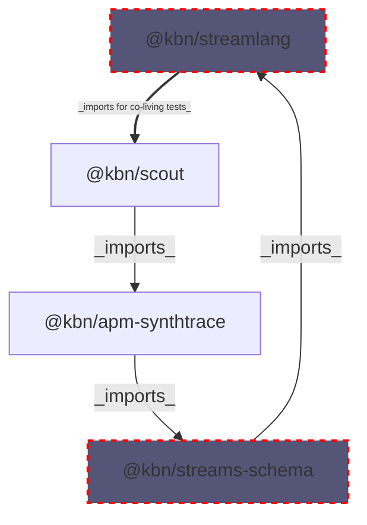

# @kbn/streamlang-tests

Testing platform for the Streamlang DSL (Domain Specific Language) used in Kibana Streams processing. Comprehensive testing is critical for Streamlang DSL transpilation because it validates the nuanced behavioral differences and edge cases between Ingest Pipeline processors and ES|QL queries, ensuring that the same DSL logic produces consistent results across both execution environments while identifying and documenting limitations.

## Purpose

This package serves as an independent testing environment for the `@kbn/streamlang` package. It was created as a separate package to avoid circular dependency issues which could easily arise when tests are co-located with the main Streamlang implementation (given `@kbn-streamlang` is a "shared-common" package imported by streams plugins).

One such circular dependency chain is illustrated below:

**The circular dependency chain:**
1. `@kbn/streamlang` needs `@kbn/scout` for testing
2. `@kbn/scout` imports `@kbn/apm-synthtrace`
3. `@kbn/apm-synthtrace` imports from `@kbn/streams-schema`
4. `@kbn/streams-schema` imports from `@kbn/streamlang` ← **CIRCULAR!**

By isolating the test code into this independent package:
- Eliminates circular dependencies in the build graph
- Allows test code to freely import from any dependencies needed for comprehensive testing
- Enables exporting reusable testing helpers and components for other packages

## Benefits

This separation offers additional opportunities:

1. **Reusable Test Utilities**: Export common testing helpers, fixtures, and mock data that other Streamlang-related packages can use
2. **Comprehensive Test Coverage**: Test complex integration scenarios without worrying about dependency cycles
3. **Independent Versioning**: Test package can evolve independently from the core Streamlang implementation
4. **Clean API Surface**: The main `@kbn/streamlang` package maintains a clean public API without test artifacts

## Running Tests

For detailed instructions on running the Streamlang DSL end-to-end tests, see:

**[Scout API Tests](./scout/api/README.md)** - Contains instructions for running both ESS (Elastic Stack Service) and Serverless test suites.

