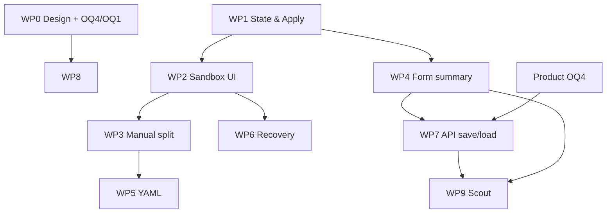

# Unified ES|QL query sandbox — proposed dev scope (clean implementation)

Proposal for engineering breakdown before filing GitHub issues.

| | |
|---|---|
| **Surface** | Compose Discover flyout — create / edit ES|QL rules (Rules v2) |
| **Package** | `@kbn/alerting-v2-rule-form` → `flyout/compose_discover/` |
| **Program** | Rules v2 / RnA |

**POC branch `poc/query-sandbox-unified-editor` is exploration only** — it validated UX and informed the spec. **Do not merge or extend the POC.** Implement against main using [POC spec](./UNIFIED_QUERY_SANDBOX_POC_SPEC.md) and [design issue](./UNIFIED_QUERY_SANDBOX_DESIGN_ISSUE.md) as the source of truth.

---

## What we're building

Users write **one ES|QL pipeline** in a Discover-style **query sandbox** (child flyout). **Apply** is the commit boundary: sandbox draft → wizard form state → heuristic split into **base + alert condition** where applicable.

| Principle | Implication for implementation |
|-----------|-------------------------------|
| One editor first | Default sandbox = single pipeline, not base/alert tabs |
| Apply commits | Sandbox edits are draft until Apply; wizard Next/gating uses committed query |
| Split after Apply | Auto-split runs on Apply; form shows base + alert summary |
| Escape hatches | Manual split tabs + YAML split tabs; opt-in via helper links |
| Safe mode switches | Disable Form/YAML and Alert/Signal toggles while sandbox open (form mode) |

---

## POC learnings (reference only)

Exploration surfaced behaviors to **design in from the start**, not copy-paste from the branch:

| Topic | Takeaway |
|-------|----------|
| Unified editor while typing | Store **standalone** `breach.query` in sandbox while user edits one pipeline — avoids duplicating lines on Enter/re-Apply when form is logically `composed` |
| `no_where` ≠ split failed | Empty **alert segment** with non-empty **base** is valid (`no_where`); split failed = empty **base** |
| No alert condition | Info callout + distinct section copy; do not use success copy (*alert condition identified*) |
| YAML → Form | Preserve composed split + manual-split flag; do not re-run heuristic on toggle |
| Save (OQ4) | UI allows base-only; API/schema must be resolved in mapper or schema work — don't ship UI-only |
| Edit mode (OQ1) | Decide up front how API `Query` maps to sandbox on open |

---

## Proposed work packages

Sized for **clean implementation** on existing Compose Discover code. Adjust with tech lead.

### WP0 — Design & product gates (parallel)

| Input | Owner |
|-------|--------|
| Design issue on `platform-ux-team` | Design |
| Figma: unified, manual split, form states, YAML, recovery | Design |
| **OQ4:** base-only rules allowed on save? | Product + backend |
| **OQ1:** edit-mode sandbox entry | Product + eng |
| **OQ2 / OQ3** | Product (can defer post-v1) |

**Blocks GA-quality UI (WP8), not necessarily WP1–3.**

---

### WP1 — Query state model & Apply contract

**Goal:** Shared foundation for sandbox ↔ wizard without UI beyond minimal wiring.

**Build**

- Sandbox draft vs **committed** query (`queryCommitted`, `isQueryDefined`)
- In-memory rule query shape: `composed` (`base`, `breach.segment`, optional `recovery`) vs `standalone` (`breach.query`)
- **Apply** handler: unified path runs heuristic split → writes committed query to form state → closes sandbox
- Flags: `manualSplitEnabled`, child flyout open/which step
- Pure utilities: join/split pipeline, snapshot for Apply, unified-editor change handler (standalone while typing)
- Reuse or reimplement heuristic split (`STATS` + trailing `WHERE` logic) with explicit result types: `split_succeeded`, `no_where`, `split_failed`, etc.

**Tests:** unit tests for utilities and state transitions (no full flyout yet).

**Acceptance**

- Given a pipeline string, Apply produces expected `base` / `breach.segment` (or standalone draft while editing)
- Gating rules documented and testable: Next requires committed + defined query

**Estimate:** M

---

### WP2 — Query sandbox flyout (unified + signal)

**Goal:** Discover-like child flyout for step 1 (alert) and signal rules.

**Build**

- Nested flyout: title, helper text, time field + date range, **Search**, ES|QL editor, chart + grid, **Apply**
- **Alert — unified:** single editor; helper with link to manual split (WP3)
- **Signal:** single editor; no split helpers ([spec](./UNIFIED_QUERY_SANDBOX_POC_SPEC.md#query-sandbox))
- Create flow: sandbox opens automatically on new alert rule
- Footer: Apply; disable parent Back/Next while open
- Integrate existing query execution / autocomplete hooks in package

**Acceptance**

- User can Search, edit, Apply → returns to form with committed query (split deferred to WP4 summary if same PR, or stub summary)
- Signal path: Apply → committed standalone query

**Depends on:** WP1

**Estimate:** L

---

### WP3 — Manual split mode

**Goal:** Power-user escape hatch without changing default path.

**Build**

- Base / Alert tabs in sandbox when `manualSplitEnabled`
- Helpers: *Separate base and alert* / *Use single editor* ([copy in spec](./UNIFIED_QUERY_SANDBOX_POC_SPEC.md#query-sandbox))
- Confirm when merging manual edits back to unified (if text changed)
- Apply in manual mode: persist split as `composed` without re-heuristic

**Acceptance**

- Round-trip unified → manual → unified without data loss
- Manual Apply → form shows correct base and alert blocks

**Depends on:** WP1, WP2

**Estimate:** M

---

### WP4 — Alert condition form step (summary + callouts)

**Goal:** Step 1 form reflects committed query and split outcome.

**Build**

- `EsqlQuerySummarySection`: read-only base + alert blocks; **Not defined** for empty segments
- Section descriptions per state ([table](./UNIFIED_QUERY_SANDBOX_POC_SPEC.md#alert-condition-step-form))
- Callouts:
  - **No query defined** (empty after Apply) → Next disabled
  - **No alert condition** (`no_where`) → [POC spec §2](./UNIFIED_QUERY_SANDBOX_POC_SPEC.md#2-after-apply--form-summary-step-1)
  - **Split failed** → CTA **Separate base and alert** → opens manual split (WP3)
- **Edit query** reopens sandbox (unified unless manual split was enabled)
- Fix success copy: only when `breach.segment` is non-empty

**Acceptance**

- [QA scenarios 1–4, 5](./UNIFIED_QUERY_SANDBOX_POC_SPEC.md#qa-scenarios) pass manually
- Unit tests per callout trigger conditions

**Depends on:** WP1; best delivered with WP2/WP3

**Estimate:** M

---

### WP5 — YAML mode integration

**Goal:** YAML authors get split sandbox; Form ↔ YAML does not destroy split.

**Build**

- YAML mode: sandbox uses Base / Alert / Recovery tabs; Apply updates YAML text; sandbox **stays open**
- Form/YAML toggle **enabled** in YAML; **disabled** while sandbox open in form mode
- YAML → Form: preserve composed split + `manualSplitEnabled`; set recovery type when recovery segment present ([D5](./UNIFIED_QUERY_SANDBOX_POC_SPEC.md#decisions))
- Do not re-run heuristic when leaving YAML ([OQ2](./UNIFIED_QUERY_SANDBOX_POC_SPEC.md#open-questions) — default: no)

**Acceptance**

- QA scenarios 7–8
- YAML debounce → sandbox stays in sync

**Depends on:** WP1, WP2, WP3

**Estimate:** M

---

### WP6 — Recovery query sandbox

**Goal:** Custom recovery editing with locked base.

**Build**

- Recovery step: open sandbox with read-only base + editable recovery block
- Apply commits recovery segment only
- Helper copy per spec

**Acceptance**

- QA scenario 9
- Recovery segment round-trips in composed query

**Depends on:** WP1, WP2

**Estimate:** S–M

---

### WP7 — API mapping, save & edit load

**Goal:** Create/update/load rules correctly for all query shapes.

**Build**

- `composeFormToCreateRequest` / update / `mapRuleToComposeFormValues`
- **OQ4:** when alert has base-only effective query, persist via chosen strategy:
  - **A.** Emit `standalone` `breach.query` on save, or
  - **B.** Relax composed schema for empty `breach.segment`
- **OQ1:** load existing rule → form summary + sandbox snapshot (unified vs manual split)
- Validation aligned with `@kbn/alerting-v2-schemas`

**Acceptance**

- Create with `STATS` only → save succeeds → reload shows no-alert-condition state
- Composed + standalone rules edit without corrupting query
- Mapper unit tests

**Depends on:** WP1, WP4; product decision OQ4

**Estimate:** M (S if option A only in kibana)

---

### WP8 — Wizard chrome, gating & polish

**Goal:** Spec-compliant flyout shell ([D10, D11](./UNIFIED_QUERY_SANDBOX_POC_SPEC.md#decisions)).

**Build**

- Stepper / YAML badge; Alert ↔ Signal toggle rules
- Details step: name auto-focus, description always visible, optional labels
- Back/Next `color="text"`; Create/Save primary
- No Cancel in footer (existing confirm-on-close pattern)
- a11y: focus management between parent/child flyouts

**Depends on:** WP2+; design sign-off for GA

**Estimate:** S–M

---

### WP9 — Automated tests

**Goal:** Regression safety for clean implementation.

| Layer | Scope |
|-------|--------|
| **Unit** | Heuristic split, Apply/snapshot utils, mapper, callout conditions, state reducer |
| **Scout** | Create alert happy path; `no_where` callout; split failed → manual; YAML → Form |

**Depends on:** WP4, WP7 for meaningful E2E save tests

**Estimate:** M

---

### WP10 — Follow-ups (post-v1 unless required)

| Item | Notes |
|------|--------|
| Telemetry | Apply, split outcome, manual split usage |
| OQ2 | Re-split policy for YAML-only edits |
| OQ3 | `recoveryType` UI vs infer |
| Heuristic improvements | New ES\|QL patterns beyond STATS/WHERE |

---

## Suggested GitHub issues

| # | Title | WP |
|---|--------|-----|
| 0 | [Rules v2] Design: Unified ES\|QL query sandbox | WP0 (platform-ux) |
| 1 | [Rules v2] Query sandbox — state model & Apply contract | WP1 |
| 2 | [Rules v2] Query sandbox flyout — unified editor & signal | WP2 |
| 3 | [Rules v2] Query sandbox — manual base/alert split | WP3 |
| 4 | [Rules v2] Alert condition step — query summary & callouts | WP4 |
| 5 | [Rules v2] Query sandbox — YAML mode integration | WP5 |
| 6 | [Rules v2] Query sandbox — recovery editor | WP6 |
| 7 | [Rules v2] ES\|QL rule query — API map, save & edit load | WP7 |
| 8 | [Rules v2] Compose flyout — wizard chrome & gating | WP8 |
| 9 | [Rules v2] Tests: query sandbox unit + Scout | WP9 |

**Epic (optional):** link 1–9 under Rules v2 compose / RnA milestone.

**PR strategy (for tech lead):** WP1 first; then WP2+WP4 as vertical slice (create alert happy path); WP3, WP5, WP6 incremental; WP7 before calling save flows done; WP9 ongoing.

---

## Sequencing

**Minimum vertical slice (demo):** WP1 + WP2 + WP4 — create alert, Apply, see summary (save may stub until WP7).

**Minimum shippable:** above + WP7 (save/load) + WP3 (split failed path) + unit tests.

**Recommended v1:** WP1–WP8 + WP9; WP10 later.

---

## Out of scope

- Merging or maintaining POC branch code
- Heuristic split algorithm owned by another team (unless shared package extracted)
- Executor / notification pipeline changes
- Rule builder threshold UI (`rule_builder/threshold/`)
- Non–Compose Discover authoring surfaces

---

## References

- [POC spec & decisions](./UNIFIED_QUERY_SANDBOX_POC_SPEC.md) — behavior & copy (not code)
- [Design issue](./UNIFIED_QUERY_SANDBOX_DESIGN_ISSUE.md)
- `@kbn/alerting-v2-schemas` — `rule_data_schema.ts`
- Existing package entry: `compose_discover_flyout.tsx`, `query_sandbox_flyout.tsx` (baseline on main — refactor/replace as needed)

---

## Questions for tech lead

1. **WP7 / OQ4:** Standalone mapper on save (A) vs composed schema change (B)?
2. **WP1:** New state module vs extend `use_compose_discover_state`?
3. **WP2:** Reuse existing `query_sandbox.tsx` / flyout or replace?
4. **WP7 / OQ1:** Edit always opens unified editor, or respect saved `format` + `manualSplitEnabled`?
5. **Vertical slice:** Single team owns WP1–4, or parallel tracks (UI vs mappers)?
6. **Feature flag:** Ship behind Rules v2 flag or new sub-flag?
