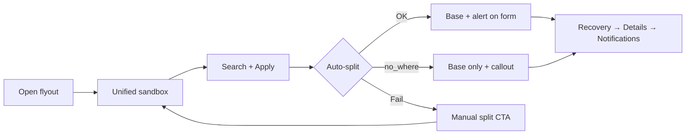
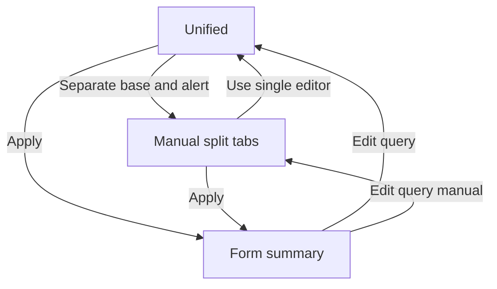
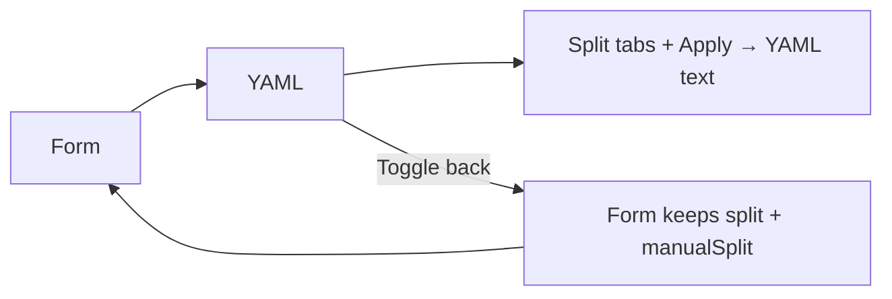

# Unified ES|QL query sandbox — POC spec

**Surface:** Compose Discover flyout (Rules v2 create/edit) · **Package:** `flyout/compose_discover/`  
**POC branch:** `poc/query-sandbox-unified-editor` (exploration only — informs this spec)  
**Design issue:** [UNIFIED_QUERY_SANDBOX_DESIGN_ISSUE.md](./UNIFIED_QUERY_SANDBOX_DESIGN_ISSUE.md) · **Dev scope:** [UNIFIED_QUERY_SANDBOX_DEV_SCOPE.md](./UNIFIED_QUERY_SANDBOX_DEV_SCOPE.md)

Users write **one ES|QL pipeline** in a Discover-style sandbox. **Apply** commits to the wizard and auto-splits into **base + alert condition**. Manual split and YAML are opt-in escape hatches.

---

## Flows

### Create alert rule



### Editor modes



### Form ↔ YAML



---

## 1. Query sandbox (default path)

**What:** Child flyout where users Search, preview results, and **Apply**. Alert rules start here with a **single editor** — not base/alert tabs.

**Layout:** helper → (tabs if split) → time field + range → **Search** → editor → chart + grid → **Apply**

| Mode | Editor | On Apply |
|------|--------|----------|
| Unified (default) | One pipeline | Auto-split → close sandbox |
| Manual split | Base / Alert tabs | Keep split → close |
| YAML | Base / Alert / Recovery tabs | Update YAML · sandbox **stays open** |
| Recovery step | Locked base + recovery block | Close |
| Signal | One pipeline | Close |

**Unified helper:** *We'll automatically identify the base query and alert condition when you apply changes.* → link **Separate base and alert**

**Implementation note:** While typing in the unified editor, store **standalone** `breach.query` (full pipeline) — avoids duplicated lines on Enter/re-Apply.

> **Media**  
>   
> _[Video: re-edit unified — Enter does not duplicate lines](media/06-re-edit-unified.mp4)_

---

## 2. After Apply — form summary (step 1)

**What:** Wizard step **Alert condition** shows read-only **base** and **alert** blocks. Copy and callouts depend on how auto-split resolved.

| Outcome | Section description | Callout | Next |
|---------|---------------------|---------|------|
| **Before Apply** | *Open the editor to write your ES\|QL query* | — · CTA **Open query editor** | Off |
| **Success** | *Search query and alert condition identified* | — | On |
| **No alert condition** (`no_where`) | *Base query defined — no separate alert condition* | **No alert condition** — *Without an alert condition, every row returned by the base query is treated as a breach.* | On¹ |
| **Empty query** | *Define an ES\|QL query in the editor* | **No query defined** | Off |
| **Split failed** | *Review your query or separate it manually* | Info callout + **Separate base and alert** | On |

Empty summary blocks → **Not defined**. Primary action: **Edit query**.

**`no_where` vs split failed**

| | `no_where` | Split failed |
|---|------------|--------------|
| **Base** | Non-empty (full pipeline) | Empty |
| **Alert segment** | Empty | Any |
| **Meaning** | Every result row = breach | Heuristic could not split — user fixes manually |
| **Example** | `FROM flights \| STATS COUNT(*) BY city` | Unsplittable / invalid pipeline |

¹ Save API may reject empty `breach.segment` today — product decision [OQ4](#open-questions).

> **Media**  
>   
>   
> 

---

## 3. Escape hatches — manual split & YAML

**What:** Power users edit base and alert separately, or work in YAML, without changing the default unified path.

**Manual split**

- Open via helper **Separate base and alert** or split-failed CTA
- Tabs: Base · Alert · helper **Use single editor** (confirm if merge would lose edits)
- Apply keeps `composed` shape; set `manualSplitEnabled`

**YAML**

- Alert rules: sandbox always uses split tabs
- Form ↔ YAML toggle **off** while sandbox open in **form** mode; **on** in YAML mode
- **YAML → Form:** preserve split + `manualSplitEnabled` — **do not** re-run heuristic
- YAML debounces to form; sandbox follows live state

> **Media**  
>   
>   
> 

---

## 4. Wizard chrome, recovery & signal

**What:** Parent flyout behavior around the sandbox — steps, gating, recovery editing, signal rules.

**Steps:** Alert condition → Recovery → Details & artifacts → Notifications  
**Chrome:** Stepper hidden in YAML (**YAML MODE** badge) · Footer Back + Next/Create · no Cancel · Details: name auto-focus, description always visible

**Gating**

| Control | Disabled when |
|---------|---------------|
| Alert ↔ Signal | Sandbox open, query not committed/defined, or edit mode |
| Form ↔ YAML | Sandbox open in form mode |
| Back / Next | Sandbox open |
| Next (step 1) | Query not committed or not defined |

**Recovery:** Custom recovery opens sandbox with **locked base** + editable recovery block. Helper: *Define when the alert should recover…*

**Signal:** Single editor only — no split helpers.

> **Media**  
>   
> 

---

## Decisions (POC)

| # | Decision |
|---|----------|
| D1 | Unified editor first; split on form after Apply |
| D2 | Apply = commit boundary (sandbox draft ≠ wizard until Apply) |
| D3 | Split/merge via **helper links**, not title icons |
| D4 | Form/YAML toggle off while sandbox open (form mode) |
| D5 | YAML → Form keeps split; no re-heuristic |
| D6 | Unified typing uses standalone `breach.query` |
| D7 | `no_where` → **No alert condition** callout (not success copy) |
| D8 | Empty query → callout; Next off |
| D9 | Split failed = empty **base** only |
| D10–D11 | Details polish; Back/Next text, Create/Save fill |

---

## Open questions

| ID | Question | POC stance |
|----|----------|------------|
| OQ1 | Edit existing rule — unified or composed sandbox? | TBD |
| OQ2 | Re-split on YAML-only edits? | TBD |
| OQ3 | `recoveryType` UI vs infer from query? | TBD |
| OQ4 | Base-only rules (empty alert segment)? | Yes in UI + callout; save needs API/mapper |

---

## Quick QA

1. `STATS … \| WHERE c > 100` → base + alert  
2. `STATS …` (no WHERE) → no alert condition callout  
3. Empty Apply → no query callout; Next off  
4. Split failed → manual split  
5. Re-edit + Enter → no duplication  
6. YAML ↔ Form → split preserved  

```bash
node scripts/jest x-pack/platform/packages/shared/response-ops/alerting-v2-rule-form/flyout/compose_discover/
```
