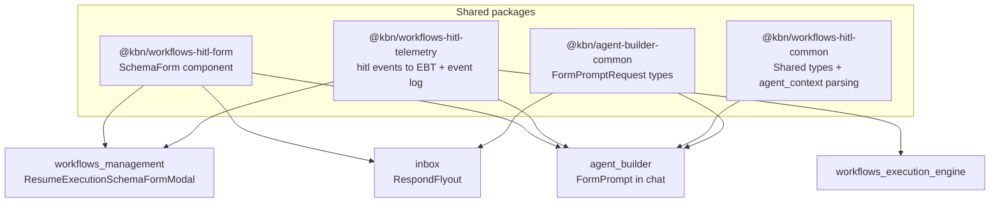
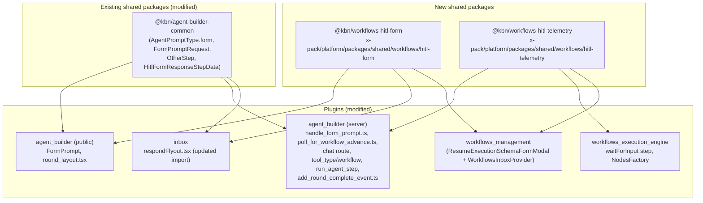
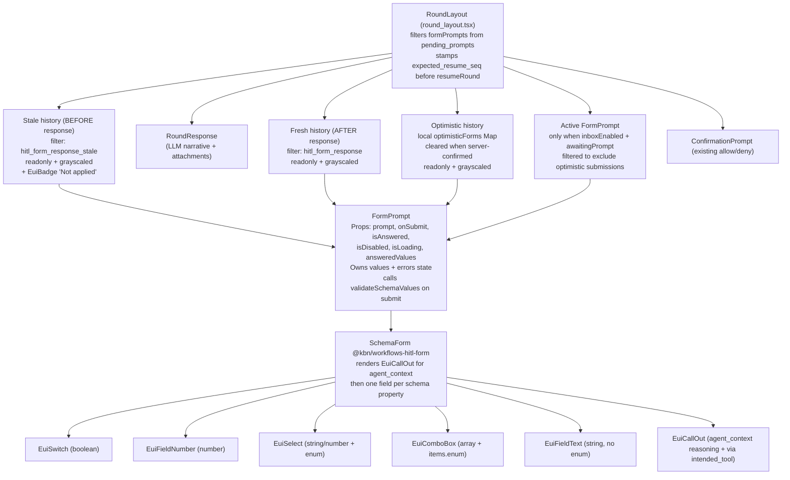
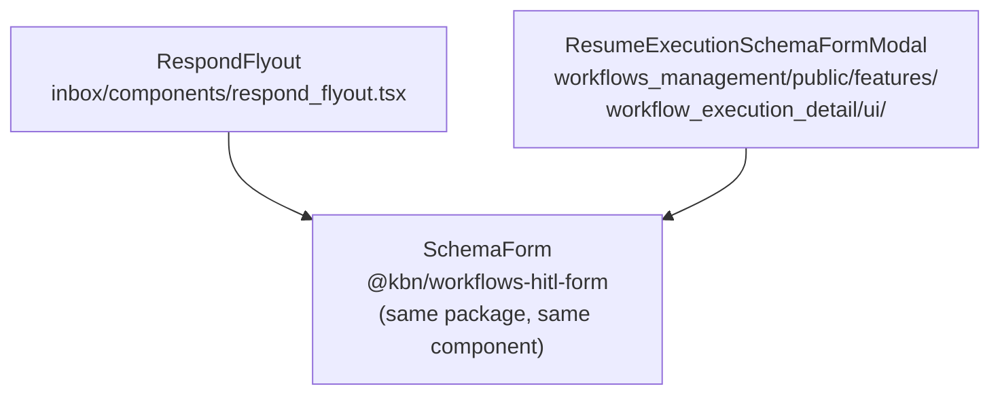

# Human In the Loop (HITL) Rendering: Agent Builder + Workflows + Inbox

This feature implements consistent [Human In the Loop (HITL) schema-driven form rendering](https://github.com/elastic/security-team/issues/16707) in:

- Agent builder
- Workflows
- Inbox

as illustrated by the following screenshot:


_Above: Schema-driven HITL Rendering in Agent Builder_

It implements the scenarios in [Agent Builder ↔ Workflows HITL alignment](https://github.com/elastic/security-team/issues/16711), replacing the existing LLM text based rendering with  with rendered `SchemaForm` controls.

Agent builder, Worklfows, and Inbox share a single `SchemaForm` component (`@kbn/workflows-hitl-form`) and a CAS-protected resume path, so a user can respond to a paused workflow from Agent Builder chat, the Workflows execution view, or the Inbox and get a consistent, race condition safe experience.

The screenshot below illustrates the Workflows Execution View rendering the same schema:


_Above: The Worklfows execution view rendering the same `waitForInput` step_ 

This README is hosted in the `@kbn/workflows-hitl-common` package — the lowest common dependency of the three `hitl-*` packages — because the feature spans Agent Builder, Workflows, and Inbox and is owned by none of them individually. `@kbn/workflows-hitl-common` holds the shared types and `agent_context` parsing the others build on, making it the natural, neutral home for cross-cutting documentation.

1. [Overview](#overview)
   - [Package Overview](#package-overview)
2. [Getting Started](#getting-started)
   - [Enable the Feature](#enable-the-feature)
   - [Seed the HITL Demo Workflows](#seed-the-hitl-demo-workflows)
3. [Architecture](#architecture)
4. [Plugin Changes](#plugin-changes)
   - [Agent Builder Changes](#agent-builder-changes)
   - [Workflows Changes](#workflows-changes)
   - [Inbox Changes](#inbox-changes)
5. [Architecture Deep-Dive](#architecture-deep-dive)
   - [Packages](#packages)
   - [Package Dependency Graph](#package-dependency-graph)
   - [Sequence Numbers & CAS](#sequence-numbers--cas)
   - [Walkthrough: Two-Step Approval Race](#walkthrough-two-step-approval-race)
   - [Data Flow & Sequence Diagrams](#data-flow--sequence-diagrams)
   - [Workflow Execution State Machine](#workflow-execution-state-machine)
   - [Race Conditions & Reconciliation](#race-conditions--reconciliation)
   - [Component Hierarchy](#component-hierarchy)
6. [Debugging](#debugging)
   - [Enabling Debug Logging](#enabling-debug-logging)
7. [Reference](#reference)
   - [Key Type Definitions](#key-type-definitions)
   - [Acceptance Criteria Status](#acceptance-criteria-status)
   - [Feature Flag Boundary](#feature-flag-boundary)
   - [Testing](#testing)
   - [Appendix: Unified Scenario Table (S1–S10)](#appendix-unified-scenario-table-s1s10)
   - [Appendix: Debugging Procedure](#appendix-debugging-procedure)

---

## Overview

Historically, when a workflow tool inside an Agent Builder conversation hit a `waitForInput` step, the agent received LLM-authored prose ("Please reply with approve or reject") — there was no schema-driven form. The HITL integration closes that gap across five dimensions:

| Dimension | What changed |
|---|---|
| **Rendering** | Agent Builder chat, the Workflows execution view, and the Inbox all render the same schema-driven `SchemaForm` controls (`@kbn/workflows-hitl-form`) when a workflow pauses at `WAITING_FOR_INPUT`. In Agent Builder chat, stale submissions are kept visible as readonly "Not applied" entries above the LLM narrative so the chat reads in chronological order. |
| **Concurrency safety** | An Elasticsearch Painless **CAS** (compare-and-swap) on `resume_seq` is the single source of truth for "did this submission win the race?". Every resume call site — chat, Inbox, Workflows execution view, and the Workflows HTTP route — now CAS-protects the resume. The losing submitter gets a typed `WorkflowExecutionStaleResumeError` and a surface-specific stale UX (audit step in chat, 409 in inbox, success toast on execution view). |
| **Turn boundaries** | Every form submission now becomes its own ConversationRound (`sealRound`). The chat-agent run after a submission starts a fresh round, so the LLM narrative reliably lands after stale audit steps and before fresh audit steps — fixing the out-of-order rendering bug. |
| **Propagation** | `ai.agent` workflow steps now propagate `WAITING_FOR_INPUT` upward when the inner agent is awaiting a form prompt (nested HITL chain). |
| **Observability** | `@kbn/workflows-hitl-telemetry` emits `hitl.created` / `hitl.responded` / `hitl.timed_out` to both EBT and the workflow event log. Every state transition is also covered by `[hitl-debug]` debug log markers with cross-plugin trace correlation. |

### Package Overview



| Package | Purpose | Path |
|---|---|---|
| `@kbn/workflows-hitl-common` | Shared types and utilities (`agent_context` parsing, classification helpers) — **hosts this README** | [`hitl-common/`](/x-pack/platform/packages/shared/workflows/hitl-common/) |
| `@kbn/workflows-hitl-form` | `SchemaForm` React component shared across Agent Builder chat, the Workflows execution view, and the Inbox respond flyout | [`hitl-form/`](/x-pack/platform/packages/shared/workflows/hitl-form/) |
| `@kbn/workflows-hitl-telemetry` | Dual-emit telemetry helper (`hitl.created`, `hitl.responded`, `hitl.timed_out`) to EBT and the workflow event log | [`hitl-telemetry/`](/x-pack/platform/packages/shared/workflows/hitl-telemetry/) |

---

## Getting Started

### Enable the Feature

The entire HITL machinery is gated by the Inbox plugin. Add this single line to `kibana.dev.yml` (or `kibana.yml` for other environments):

```yaml
xpack.inbox.enabled: true
```

This flips `inboxEnabled` to `true` across all three plugin surfaces — Agent Builder server, Agent Builder public, and Workflows — via the optional-plugin dependency mechanism. No separate feature flag or UI setting is required.

Start Kibana and Elasticsearch locally (`yarn start --no-base-path`) with this config set before seeding the demos below.

### Seed the HITL Demo Workflows

The three `hitl-demo-*` workflows shown in the Workflows list are local-dev fixtures for exercising the HITL integration end to end. With the Inbox plugin enabled (see [Enable the Feature](#enable-the-feature)) and Kibana + ES running, execute the seed script:

```bash
node --import tsx x-pack/platform/plugins/shared/inbox/scripts/demo/seed_inbox_demo.ts
```

The script [`seed_inbox_demo.ts`](/x-pack/platform/plugins/shared/inbox/scripts/demo/seed_inbox_demo.ts) imports each demo workflow YAML into a running Kibana, triggers a manual run of each (so they pause on `waitForInput`), creates a matching Agent Builder **workflow tool** for each, and associates those tools with the default `elastic-ai-agent` agent. You can then drive any of them from Agent Builder chat.

> **Note.** The seeder imports **all** demo workflows — the six field-type fixtures (`01_string_input.yml` … `06_required_with_defaults.yml`) plus the three HITL fixtures in the table below. This section covers only the three HITL workflows; see the [Inbox demo README](/x-pack/platform/plugins/shared/inbox/scripts/demo/README.md) for the field-type fixtures and an alternative MCP-based seeding path.

For each workflow the seeder creates an Agent Builder **workflow tool whose id is identical to the workflow name** (e.g. workflow `hitl-demo-single-approval` → tool `hitl-demo-single-approval`) and attaches it to `elastic-ai-agent`. Run any workflow from Agent Builder chat with the example prompt in the last column.

| Workflow ID | Scenario(s) tested | Agent Builder tool | Example chat prompt |
|---|---|---|---|
| `hitl-demo-single-approval`<br/>([`07_hitl_single_approval.yml`](/x-pack/platform/plugins/shared/inbox/scripts/demo/workflows/07_hitl_single_approval.yml)) | A single `waitForInput` boolean approval gate. Exercises [Scenario 1 — Agent Builder renders rich forms](https://github.com/elastic/security-team/issues/16711), [Scenario 3 — response from either surface resumes the workflow](https://github.com/elastic/security-team/issues/16711), and [Scenario 5 — agent context in the input request](https://github.com/elastic/security-team/issues/16711). | `hitl-demo-single-approval` | `run the hitl-demo-single-approval workflow` |
| `hitl-demo-two-step-approval`<br/>([`08_hitl_two_step_approval.yml`](/x-pack/platform/plugins/shared/inbox/scripts/demo/workflows/08_hitl_two_step_approval.yml)) | Two sequential `waitForInput` steps — the canonical [two-step approval CAS race](#walkthrough-two-step-approval-race). Exercises [Scenario 3 — cross-surface resume](https://github.com/elastic/security-team/issues/16711) under concurrent submitters (stale-submission classification + CAS concurrency safety). | `hitl-demo-two-step-approval` | `run the hitl-demo-two-step-approval workflow` |
| `hitl-demo-nested-agent`<br/>([`09_hitl_nested_agent.yml`](/x-pack/platform/plugins/shared/inbox/scripts/demo/workflows/09_hitl_nested_agent.yml)) | An `ai.agent` step that instructs the default agent to call the `hitl-demo-single-approval` tool; the inner workflow pauses and exercises [Scenario 4 — nested HITL propagation](https://github.com/elastic/security-team/issues/16711) (`WAITING_FOR_INPUT` propagates upward, reply flows back through the full chain). | `hitl-demo-nested-agent` | `run the hitl-demo-nested-agent workflow` |

---

## Architecture

The integration is fundamentally a **state machine over a partially-ordered log** of CAS-checked `resume_seq` increments and `step_execution_id` transitions. The [Architecture Deep-Dive](#architecture-deep-dive) specifies the race conditions inherent to this machine — including the multi-step HITL case, concurrent submitters across surfaces, the TaskManager async window, and out-of-order rendering — and how each is handled.

---

## Plugin Changes

The HITL integration touches three plugin areas — **Agent Builder**, **Workflows** (`workflows_execution_engine` + `workflows_management`), and **Inbox** — plus four new shared packages (`@kbn/workflows-hitl-form`, `@kbn/workflows-hitl-telemetry`, `@kbn/workflows-hitl-common`, and `@kbn/agent-builder-common`). The three subsections below describe each plugin's responsibilities and walk through the server- and client-side changes in the order they execute at runtime.

All code paths are gated by the `inboxEnabled` feature flag (see [Feature Flag Boundary](#feature-flag-boundary)). With the flag off, behavior is identical to pre-HITL state.

### Agent Builder Changes

**High-level:** Agent Builder is the conversational surface where workflow tools execute as part of an LLM round. Historically, when a workflow tool paused at `waitForInput`, the LLM had to generate prose to prompt the user — there was no interactive form. The HITL integration turns the chat into a full HITL responder: the workflow tool emits a `FormPromptRequest` alongside its tool result, the chat renders a `SchemaForm`, and on submit the server resumes the workflow under CAS protection and polls until the next pause point materializes. The same machinery handles single-step approvals, multi-step approval chains, and the nested case where an outer workflow's `ai.agent` step pauses on an inner workflow.

**Step-by-step — server changes:**

1. **Chat route accepts `form_prompts`** ([`server/routes/chat.ts`](/x-pack/platform/plugins/shared/agent_builder/server/routes/chat.ts)). The `POST /converse` request body schema (extended via `buildFormPromptsRequestSchema`) now allows an optional `form_prompts: [{ execution_id, id, values, expected_resume_seq? }]` array. When `inboxEnabled && payload.form_prompts?.length > 0`, the route logs `chat.resume.received` and invokes `resumeFormPrompts(...)` **before** the LLM graph is executed. The result (`resumedStates`) is threaded into the agent run.
2. **`resumeFormPrompts` orchestrator** ([`runner/utils/resume_form_prompts/`](/x-pack/platform/plugins/shared/agent_builder/server/services/execution/runner/utils/resume_form_prompts/)). For each submitted form, it loads the conversation, and delegates to `handleFormPromptResponse`. Returns one `ResumedFormPromptState` per execution, each carrying `kind` (`'resumed'` or `'stale'`), the `observedExecution`, the `observedStatus`, an optional `reason` (when stale), and a possible `nextFormPrompt`.
3. **`handleFormPromptResponse` — try/catch CAS at the heart of the HITL state machine** ([`runner/utils/handle_form_prompt.ts`](/x-pack/platform/plugins/shared/agent_builder/server/services/execution/runner/utils/handle_form_prompt.ts)). It (a) finds the matching `FormPromptRequest` in `pending_prompts` (early-return stale if absent — R4/S8), (b) stamps `expectedResumeSeq = matchingPrompt.resume_seq + 1`, (c) calls `workflowApi.resumeWorkflowExecution(executionId, spaceId, values, request, { expectedResumeSeq })` — **no pre-check; the engine's CAS is the classifier**, (d) on `WorkflowExecutionStaleResumeError`: calls `pollForWorkflowAdvance`, derives `StaleSubmissionReason` from observed state, appends `hitl_form_response_stale` audit, seals the round when `reason` is `workflow_already_resolved` or `workflow_advanced` (round stays open for `concurrent_resume`), and builds `nextFormPrompt` if the workflow advanced to a new pause, (e) on success: appends `hitl_form_response` audit, **always** seals the round (`sealRound: true`), polls for advance, builds `nextFormPrompt`. Emits `hitl.responded` telemetry with `responseSource: 'chat'`.
4. **`pollForWorkflowAdvance`** ([`runner/utils/poll_for_workflow_advance/`](/x-pack/platform/plugins/shared/agent_builder/server/services/execution/runner/utils/poll_for_workflow_advance/)). Loops `getExecutionState` at 500ms intervals (max 20 attempts = 10s) until `step_execution_id` changes from `previousStepExecutionId`, status becomes terminal, or attempts are exhausted. Closes R1 (TaskManager async race). Returns `null` on timeout (drives R5).
5. **`persistSubmission` + `sealRound`** ([same file](/x-pack/platform/plugins/shared/agent_builder/server/services/execution/runner/utils/handle_form_prompt.ts)). New helper that appends the audit step and (when `sealRound: true`) transitions the round from `awaitingPrompt` to `completed` (or back to `awaitingPrompt` if other prompts remain). This is the architectural lever for "each form submission becomes its own turn boundary" — see [Each form submission becomes its own round](#each-form-submission-becomes-its-own-round). Fixes the chronological-rendering bug where stale audit steps appeared after the LLM response narrative that referenced them.
6. **Workflow tool emits `FormPromptRequest`** ([`tools/tool_types/workflow/tool_type.ts`](/x-pack/platform/plugins/shared/agent_builder/server/services/tools/tool_types/workflow/tool_type.ts)). When `inboxEnabled` and the inner execution returns `WAITING_FOR_INPUT`, the tool returns both `results: [otherResult({ execution })]` and `prompt: FormPromptRequest` (built from `waiting_input.{schema, message, step_execution_id, agent_context}` and `execution.resume_seq`). The runner's `run_tool.ts` propagates this prompt into the round's `pending_prompts`.
7. **`ai.agent` step propagates nested HITL upward** ([`step_types/run_agent_step.ts`](/x-pack/platform/plugins/shared/agent_builder/server/step_types/run_agent_step.ts) + helpers `run_inner_agent`, `build_waiting_for_input_result`, `resume_inner_agent`). On initial run, if the inner agent's round ends in `awaitingPrompt`, the step captures the inner agent's reasoning + intended tool as `agent_context` and returns `{ waitingForInput: { schema, message, agent_context, stepState: { conversationId, innerExecutionId } } }`. The outer engine then transitions to `WAITING_FOR_INPUT`. On resume, the step re-hydrates `stepState`, calls `resumeWorkflowExecution(innerExecutionId, ...)`, then re-runs the inner agent.
8. **`run_chat_agent` recognises sealed form-submission rounds** ([`run_agent/run_chat_agent.ts`](/x-pack/platform/plugins/shared/agent_builder/server/services/execution/run_agent/run_chat_agent.ts)). A round with `status === completed` that contains an `hitl_form_response[_stale]` step is treated identically to an `awaitingPrompt` round for graph resumption (`isFormSubmissionSealedRound` flag). The downstream `addRoundCompleteEvent` then writes the LLM's response into a **new** round, not the sealed one — which is why the stale audit step lands in the prior round (before the response) and fresh audit lands in the prior round (after the response).
9. **`addRoundCompleteEvent` evicts stale prompts and merges next-step prompts** ([`run_agent/utils/add_round_complete_event.ts`](/x-pack/platform/plugins/shared/agent_builder/server/services/execution/run_agent/utils/add_round_complete_event.ts)). Two new behaviours: (a) **evict stale**: any `pending_prompts` entry whose `id` matches a `hitl_form_response_stale.step_execution_id` is filtered out (closes R6 — prevents the stale form re-appearing as an active input alongside the freshly-advanced step, which would have trapped the user in an infinite submit loop); (b) **merge `nextFormPrompt`**: `pendingFormPrompts` from `resumedStates` are merged into the new round's `pending_prompts` (deduplicated by `id`) and `round.status = awaitingPrompt`. Closes R2 (Missing Next-Step Form Emission). Also exposes a deterministic `staleFormFallbackMessage` for the response slot when the LLM produces no narration on the stale path.
10. **`refreshStaleWorkflowExecution`** ([`run_agent/utils/refresh_stale_workflow_execution/`](/x-pack/platform/plugins/shared/agent_builder/server/services/execution/run_agent/utils/refresh_stale_workflow_execution/)). Called by `roundToActions` for every `ToolCallStep`. Rewrites the embedded `WorkflowExecutionState` so the LLM never sees a stale `WAITING_FOR_INPUT` in its tool history. Implements cases I1 (terminal), I2 (advanced to new step), I3 (invariant violation), I-processing (poll timeout — strips `waiting_input`, sets `status='processing'`).
11. **HITL telemetry dual-emit**. Every state transition (created, responded, timed_out) routes through `reportHitlEvent` from `@kbn/workflows-hitl-telemetry`, which emits to both EBT (`analytics.reportEvent`) and the workflow event log.

**Step-by-step — client changes:**

1. **`FormPrompt` component** ([`conversation_rounds/round_prompt/form_prompt.tsx`](/x-pack/platform/plugins/shared/agent_builder/public/application/components/conversations/conversation_rounds/round_prompt/form_prompt.tsx)). React component that renders a `FormPromptRequest` inline in the chat. Owns `values` and `errors` state, calls `validateSchemaValues` before submit, then invokes `onSubmit({ execution_id, id, values })`. Reused (in `isDisabled` + `isAnswered` mode) to render readonly history entries for stale/fresh/optimistic submissions.
2. **`SchemaForm` integration** (from `@kbn/workflows-hitl-form`). Renders one EUI control per JSON schema property (text, number, boolean, enum, multi-select). Displays the `agent_context.reasoning` + `intended_tool` as an `EuiCallOut` above the fields so the user sees why the agent paused.
3. **`RoundLayout` — chronological history rendering** ([`conversation_rounds/round_layout.tsx`](/x-pack/platform/plugins/shared/agent_builder/public/application/components/conversations/conversation_rounds/round_layout.tsx)). The per-round render order is now (top → bottom):
   1. **Input** (`RoundInput`) — uses the placeholder `"[Form data submitted]"` when the message is empty and the round was triggered by a form-only resume turn.
   2. **Thinking** (`RoundThinking`) and **Todos** (`TodosStepDisplay`).
   3. **Stale form history** — `hitl_form_response_stale` audit steps rendered as readonly grayscaled `<FormPrompt isDisabled isAnswered>` with an `EuiBadge color="warning"` "Not applied". Comment in code: "Rendered BEFORE the response: the LLM generated this round's response after seeing the stale audit step, so the narrative naturally references it."
   4. **Response** (`RoundResponse` + `RoundAttachmentReferences`).
   5. **Fresh form history** — `hitl_form_response` audit steps rendered the same readonly grayscaled way. "Rendered AFTER the response: the user submitted these forms after the LLM generated this round's response, so they appear after the narrative."
   6. **Optimistic forms** — submissions the user has clicked Submit on but the server hasn't confirmed yet. Tracked in local `optimisticForms` Map state and cleared once the server-confirmed history entry appears. Also grayscaled.
   7. **Confirmation prompts** (existing allow/deny UX).
   8. **Active form prompts** — only when `inboxEnabled && isAwaitingPrompt`; filtered to exclude any prompt already present in `optimisticForms` so the same form doesn't appear twice.
4. **`expected_resume_seq` stamping** ([`handleFormSubmit` in `round_layout.tsx`](/x-pack/platform/plugins/shared/agent_builder/public/application/components/conversations/conversation_rounds/round_layout.tsx)). Before calling `resumeRound`, the client looks up the matching `FormPromptRequest` in `formPrompts` and stamps `expected_resume_seq = matchedPrompt.resume_seq + 1` onto the `FormPromptResponse`. Missing on legacy prompts (pre-Stage-1); server falls back to unconditional resume.
5. **`useResumeRoundMutation` + `chat_service`** ([`context/streaming/use_resume_round_mutation.ts`](/x-pack/platform/plugins/shared/agent_builder/public/application/context/streaming/use_resume_round_mutation.ts), [`services/chat/chat_service.ts`](/x-pack/platform/plugins/shared/agent_builder/public/services/chat/chat_service.ts)). Sends `form_prompts` (with stamped `expected_resume_seq`) in the streaming `POST /converse` body. After the round completes, the new pending_prompts (which may include step 2's form, after stale-prompt eviction in `addRoundCompleteEvent`) flow back through the stream and `RoundLayout` re-renders.

### Workflows Changes

**High-level:** The Workflows plugins (`workflows_execution_engine` server + `workflows_management` server/public) have three responsibilities: (1) **CAS-protect** every `resumeWorkflowExecution` call site so two simultaneous submissions cannot both advance the workflow; (2) **expose `resume_seq`** as a first-class field on the execution document and through the `getWorkflowExecution` / `getExecutionState` APIs so callers can capture it for the next CAS attempt; (3) **render a schema-driven resume form** in the execution detail view via `ResumeExecutionSchemaFormModal` (when `inboxEnabled` and a JSON schema is present) instead of the legacy code-mirror JSON editor.

**Step-by-step — server changes:**

1. **`WorkflowExecutionStaleResumeError`** ([`@kbn/workflows/common/errors/workflow_execution_stale_resume_error.ts`](/x-pack/platform/packages/shared/kbn-workflows/common/errors/workflow_execution_stale_resume_error.ts)). Error type raised by the engine when a CAS attempt loses. Every resume route handler now catches this specifically and maps it to a 409 (inbox) or stale-audit-step (chat).
2. **`casIncrementResumeSeq` on the repository** ([`repositories/workflow_execution_repository.ts`](/src/platform/plugins/shared/workflows_execution_engine/server/repositories/workflow_execution_repository.ts)). Method that runs a Painless update script: reads `ctx._source.resume_seq`, compares against `params.expected - 1`, writes the new value or sets `ctx.op = 'noop'`. Also validates `spaceId` inside the script to prevent cross-space writes. Returns `{ won: boolean, currentSeq: number }`.
3. **`resumeWorkflow` engine-side enforcement** ([`execution_functions/resume_workflow.ts`](/src/platform/plugins/shared/workflows_execution_engine/server/execution_functions/resume_workflow.ts)). Accepts `expectedResumeSeq`; when present, it calls `casIncrementResumeSeq` before mutating the execution. If `won === false`, throws `WorkflowExecutionStaleResumeError` and the loader skips the resume entirely. Also early-skips when the execution is already in a terminal status.
4. **`waitForInputStep` emits HITL telemetry** ([`step/wait_for_input_step/wait_for_input_step.ts`](/src/platform/plugins/shared/workflows_execution_engine/server/step/wait_for_input_step/wait_for_input_step.ts)). On first enter, emits `hitl.created` and the `[hitl-debug][wf] waitForInput.enter` log marker. On resume, emits the `waitForInput.resume` marker. On abort (workflow-level timeout), emits `hitl.timed_out`. Receives an optional `HitlAnalytics` instance via constructor wiring through `NodesFactory`.
5. **`CustomStepImpl` waitingForInput cycle** ([`step/custom_step_impl.ts`](/src/platform/plugins/shared/workflows_execution_engine/server/step/custom_step_impl.ts) + helpers `apply_step_result`, `enter_waiting_for_input`, `resolve_step_input`, `handle_step_result`). Implements the step `run()` lifecycle to support the pause/resume cycle used by `ai.agent`. On initial run, if the handler returns `waitingForInput`, the step persists `stepState`, sets the step input (schema/message), and calls `tryEnterWaitUntil` to transition the workflow to `WAITING_FOR_INPUT`. On resume run (detected via the `WAITING_FOR_INPUT_STATE_KIND` sentinel in saved state), it calls the handler with `isResuming=true` so it can forward the input to the inner workflow.
6. **`resume_execution` route accepts `expectedResumeSeq`** ([`api/routes/executions/resume_execution.ts`](/src/platform/plugins/shared/workflows_management/server/api/routes/executions/resume_execution.ts)). Route body schema includes an optional `expectedResumeSeq: number`. Forwarded into `workflowsManagementApi.resumeWorkflowExecution`. `route_error_handlers.ts` maps `WorkflowExecutionStaleResumeError` to a 409 with a `stale_resume` reason code.
7. **`getExecutionState` exposes `resume_seq`** ([`@kbn/agent-builder-tools-base/workflows/get_execution_state.ts`](/x-pack/platform/packages/shared/agent-builder/agent-builder-tools-base/workflows/get_execution_state.ts)). Reads and surfaces `resume_seq` from the execution document so callers can build the next CAS guard.
8. **`WorkflowsInboxProvider` CAS-protects inbox resumes** ([`server/inbox/workflows_inbox_provider.ts`](/src/platform/plugins/shared/workflows_management/server/inbox/workflows_inbox_provider.ts)). Before resuming, fetches the execution doc to read `resume_seq`, calls `resumeWorkflowExecution(..., { expectedResumeSeq })`, catches `WorkflowExecutionStaleResumeError` and re-throws as `createInboxActionConflictError` so the inbox HTTP route returns 409. Emits `hitl.responded` with `responseSource: 'inbox'`.

**Step-by-step — client changes:**

1. **`inboxEnabled` exposed on the plugin contract** ([`public/plugin.ts`](/src/platform/plugins/shared/workflows_management/public/plugin.ts), [`public/types.ts`](/src/platform/plugins/shared/workflows_management/public/types.ts)). The `workflowsManagement` start contract exposes `inboxEnabled: boolean`, derived from the agent builder UI setting. Consumers (execution detail UI, tests) gate schema-form rendering on this flag.
2. **`canRenderWithSchemaForm` helper** ([`features/workflow_execution_detail/lib/can_render_with_schema_form.ts`](/src/platform/plugins/shared/workflows_management/public/features/workflow_execution_detail/lib/can_render_with_schema_form.ts)). Inspects the paused step's `waiting_input.schema` and returns whether the new `SchemaForm`-based modal can render it (object schema with supported property types).
3. **`ResumeExecutionSchemaFormModal`** ([`features/workflow_execution_detail/ui/resume_execution_schema_form_modal.tsx`](/src/platform/plugins/shared/workflows_management/public/features/workflow_execution_detail/ui/resume_execution_schema_form_modal.tsx)). Modal that wraps `SchemaForm` from `@kbn/workflows-hitl-form`. Renders enum, boolean, number, text, and multi-select fields with required-field validation and pre-populated defaults from `schema.default`.
4. **`ResumeExecutionButton` chooses the modal** ([`features/workflow_execution_detail/ui/resume_execution_button.tsx`](/src/platform/plugins/shared/workflows_management/public/features/workflow_execution_detail/ui/resume_execution_button.tsx)). When `inboxEnabled && canRenderWithSchemaForm(schema)`, opens `ResumeExecutionSchemaFormModal`; otherwise falls back to the legacy `ResumeExecutionModal`. Accepts an optional `expectedResumeSeq` prop, threads it through `workflowsApi.resumeExecution(executionId, { expectedResumeSeq, input })`, and surfaces a "workflow already advanced" toast on CAS-stale 409 responses.

### Inbox Changes

**High-level:** The Inbox is the catalog of pending HITL actions across the system. Its responsibilities here are narrow: it must (a) use the same `SchemaForm` component as Agent Builder and the Workflows execution view (DRY guarantee from `@kbn/workflows-hitl-form`), (b) surface CAS-stale responses as a clean 409 instead of a 500, and (c) provide seed data for end-to-end demos of the three HITL flavors (single-step approval, two-step approval, nested agent). No state machinery specific to HITL lives in the Inbox plugin — it delegates resume to `WorkflowsInboxProvider`, which handles CAS and telemetry.

**Step-by-step — server changes:**

1. **`respond_to_action` route logs HITL diagnostics** ([`server/routes/actions/respond_to_action.ts`](/x-pack/platform/plugins/shared/inbox/server/routes/actions/respond_to_action.ts)). Has `[hitl-debug][inbox]` debug log markers (`inbox.respond.received`, `inbox.respond.delegate`, `inbox.respond.conflict`) so a multi-actor race can be traced end-to-end across plugins. Returns 409 on conflict — which is now also the path for CAS-stale responses from `WorkflowsInboxProvider`.
2. **Seed scripts for HITL workflows** ([`scripts/demo/seed_inbox_demo.ts`](/x-pack/platform/plugins/shared/inbox/scripts/demo/seed_inbox_demo.ts) + the three new YAML workflows under [`scripts/demo/workflows/`](/x-pack/platform/plugins/shared/inbox/scripts/demo/workflows/)). Provisions `07_hitl_single_approval.yml`, `08_hitl_two_step_approval.yml`, and `09_hitl_nested_agent.yml` so a developer can reproduce the three HITL flavors locally end-to-end without authoring YAML by hand.

**Step-by-step — client changes:**

1. **`RespondFlyout` switches to the shared `SchemaForm`** ([`pages/inbox_actions/components/respond_flyout.tsx`](/x-pack/platform/plugins/shared/inbox/public/pages/inbox_actions/components/respond_flyout.tsx)). The component imports `SchemaForm`, `extractSchemaDefaults`, `validateSchemaValues`, and `InboxJsonSchema` from `@kbn/workflows-hitl-form` (the in-plugin copy was removed). The rendering code is shared with Agent Builder and the Workflows execution view.
2. **`schema_form.tsx` removed** from the inbox plugin (test file imports from `@kbn/workflows-hitl-form`). Single source of truth for the form component.
3. **`use_respond_to_inbox_action` surfaces CAS-stale conflicts** as a user-facing "this action was already responded to" message (using the 409 response from the route). The existing error path handles the CAS-stale error reason via `WorkflowsInboxProvider`'s `createInboxActionConflictError` mapping.

**Cross-surface CAS coverage (summary).** With all three resume call sites now CAS-protected, the matrix is symmetrical:

| Surface | Reads `resume_seq` | Sends `expectedResumeSeq` | On CAS fail (`WorkflowExecutionStaleResumeError`) |
|---|---|---|---|
| Agent Builder chat (chat-form path) | from `FormPromptRequest.resume_seq` (server-stamped) | yes — stamped on `FormPromptResponse.expected_resume_seq` by client | Stale audit step + LLM narrative + `nextFormPrompt` if workflow advanced |
| Inbox | from `getWorkflowExecution(...).resume_seq` | yes — wired in `WorkflowsInboxProvider` | 409 conflict → "this action was already responded to" toast |
| Workflows execution view | client computes `(workflowExecution.resume_seq ?? 0) + 1` | yes — `ResumeExecutionButton` threads `expectedResumeSeq` through | 409 conflict → "Another response was already submitted; the workflow has been updated" success toast |

---

## Architecture Deep-Dive

### Packages

#### `@kbn/workflows-hitl-form`
**Path:** [/x-pack/platform/packages/shared/workflows/hitl-form/](/x-pack/platform/packages/shared/workflows/hitl-form/)

Extracted from the Inbox plugin. Provides the single `SchemaForm` React component used by three consumers: Agent Builder (inline chat `FormPrompt`), the Workflows execution view (`ResumeExecutionSchemaFormModal`), and the Inbox respond flyout.

| Export | Type | Description |
|---|---|---|
| `SchemaForm` | `React.FC<SchemaFormProps>` | Renders JSON Schema subset as EUI controls; shows `EuiCallOut` for `agent_context` |
| `extractSchemaDefaults` | `(schema) => Record<string, unknown>` | Pulls `field.default` values; used to seed form state on open |
| `validateSchemaValues` | `(schema, values) => Record<string, string>` | Synchronous required-field validator; returns `fieldName → errorMessage` map |
| `InboxJsonSchema` | interface | Supported subset: `object` with typed properties |
| `InboxFieldSchema` | interface | `type`, `title`, `description`, `enum`, `default`, `items` |
| `SchemaFormProps` | interface | `schema`, `values`, `onChange`, `disabled`, `errors`, `agent_context` |
| `AgentContext` | interface | `{ reasoning, intended_tool, intended_tool_args }` |

#### `@kbn/workflows-hitl-telemetry`
**Path:** [/x-pack/platform/packages/shared/workflows/hitl-telemetry/](/x-pack/platform/packages/shared/workflows/hitl-telemetry/)

Provides event type constants and a single `reportHitlEvent` helper that performs a **dual emit**: EBT `analytics.reportEvent()` + workflow event log `logger.debug()`. Both are best-effort (one failure does not suppress the other).

| Export | Description |
|---|---|
| `HITL_EVENT_TYPES` | `{ created: 'hitl.created', responded: 'hitl.responded', timedOut: 'hitl.timed_out' }` |
| `ResponseSource` | `'chat' \| 'inbox' \| 'unknown'` |
| `HitlEventContext` | `{ source_app, responseSource, execution_id, workflow_id?, step_execution_id?, response_latency_ms? }` |
| `reportHitlEvent(analytics?, logger?, event, context)` | Emits to EBT and/or logger; both optional |
| `HitlAnalytics` | Minimal interface: `{ reportEvent(type, data): void }` — satisfied by `AnalyticsServiceSetup` |
| `HitlLogger` | Minimal interface: `{ debug(msg, meta?): void }` — satisfied by `IWorkflowEventLogger` and `Logger` |

### Package Dependency Graph



### Sequence Numbers & CAS

A HITL workflow execution is **shared mutable state**: multiple actors (Agent Builder chat tabs, the Inbox, the Workflows execution view, or an external API caller) can all hold a stale form for the same paused step. Without a coordination mechanism, two simultaneous submissions would both call `resumeWorkflowExecution` and the engine would advance the workflow twice — once with each set of values — corrupting the conversation state and producing duplicate side effects.

The HITL integration coordinates concurrent submitters with two cooperating primitives: **sequence numbers** (`resume_seq`) and **compare-and-swap** (CAS) on those sequence numbers in Elasticsearch. Together they form a two-coordinate identifier (`resume_seq` + `step_execution_id`) that makes every state question in the HITL state machine answerable without ambiguity.

#### What is a sequence number?

A **sequence number** is a monotonically-increasing integer attached to the workflow execution document. Each time the execution is successfully resumed, the sequence number increments by exactly 1. Critically, two submissions for the **same** paused step both observe the **same** `resume_seq` value when they read the form — but only one can be the submission that increments it. Sequence numbers therefore act as **proof of priority**: the submission whose `expectedSeq` matches the live value is the first one to arrive at the engine; everyone else is, by definition, stale.

Sequence numbers solve an optimistic-concurrency-control problem: how do you tell whether the state you're acting on is the state that exists right now? By baking the expected sequence number into the write, the engine rejects writes against stale states without needing distributed locks.

#### What is CAS (Compare-And-Swap)?

**Compare-and-swap** is an atomic read-modify-write operation: read a value, compare it to an expected value, and write a new value only if the comparison succeeds — all as a single indivisible step that cannot be interleaved with other writes. It is the standard primitive for lock-free concurrency.

CAS is implemented as an Elasticsearch **update-by-script** (Painless) that the server runs against the workflow execution document. The script reads the current `resume_seq` from `ctx._source`, compares it to `params.expected - 1`, and either writes the new value (CAS won — `result: "updated"`) or sets `ctx.op = 'noop'` (CAS lost — submission was stale). Because the entire script runs inside a single ES document update, no two CAS attempts against the same document can both succeed.

| Property | Why it matters |
|---|---|
| **Atomic** | Two concurrent CAS calls with the same `expectedSeq` cannot both win |
| **Lock-free** | No distributed lock service required; ES is the source of truth |
| **Idempotent** | A losing CAS leaves the document unchanged (clean `noop` response, not an error) |
| **Space-scoped** | Script also validates `ctx._source.spaceId === params.spaceId` to prevent cross-space writes |

When a CAS loses, the engine raises `WorkflowExecutionStaleResumeError`, which every resume call site (chat, inbox, workflows UI) now catches and converts to its surface-specific stale-UX path.

#### `resume_seq`

`resume_seq` is a monotonically-increasing integer stored directly on the workflow execution document in Elasticsearch. It is incremented exactly once per successful resume:

```
casIncrementResumeSeq(executionId, expectedSeq):
  if doc.resume_seq == expectedSeq:
    doc.resume_seq += 1
    return { success: true, newSeq: expectedSeq + 1 }
  else:
    return { success: false, currentSeq: doc.resume_seq }
```

This operation is implemented as an ES Painless script and is **atomic** — two concurrent resumes with the same `expectedSeq` cannot both succeed. The loser receives `WorkflowExecutionStaleResumeError`.

Every `FormPromptRequest` carries the `resume_seq` value at the time the form was created. This value travels with the form through `pending_prompts`, is submitted back to the server as `FormPromptResponse.resume_seq`, and is compared against the live execution document at classification time.

| Question | Answered by |
|---|---|
| "Has anyone else resumed this execution since this form was rendered?" | `submission.resume_seq` vs. `execution.resume_seq` |
| "Has the workflow advanced to a new pause point since we last observed it?" | `previous.step_execution_id` vs. `current.step_execution_id` |
| "Has the engine's task finished materializing the next state?" | Poll `getExecutionState` until `step_execution_id` changes OR status is terminal |

#### `step_execution_id`

`step_execution_id` is a unique identifier assigned by the workflow engine to each `waitForInput` step invocation. It is carried on `WorkflowExecutionState.waiting_input.step_execution_id` and forwarded to `FormPromptRequest.step_execution_id`.

A change in `step_execution_id` (even while `status` remains `WAITING_FOR_INPUT`) signals that the workflow advanced to a **new** pause point. This is the primary signal used by `pollForWorkflowAdvance` to detect that the TaskManager task has finished materializing the next state (R1).

#### Try/catch CAS — classification is the resume itself

Earlier implementations performed a separate `classifyFormSubmission` pre-check that fetched the live execution and compared `submission.step_execution_id` against `execution.waiting_input.step_execution_id` *before* calling `resumeWorkflowExecution`. That pre-check was redundant — the engine's CAS already does the comparison atomically and reports failure as a typed error. The current architecture is simpler and race-free:

```
handleFormPromptResponse:
  1. Find the matching FormPromptRequest in pending_prompts (early-return stale if missing).
  2. Stamp expectedResumeSeq = matchingPrompt.resume_seq + 1.
  3. try {
       resumeWorkflowExecution(executionId, spaceId, values, request, { expectedResumeSeq })
       // CAS won → classify as fresh
     } catch (WorkflowExecutionStaleResumeError) {
       // CAS lost → call pollForWorkflowAdvance to see how the workflow advanced,
       // then derive the stale reason from observedExecution
     }
```

The submission's *type* of staleness (`workflow_already_resolved` vs. `workflow_advanced` vs. `concurrent_resume`) is determined **after** the CAS failure by inspecting `observedExecution.status` and `observedExecution.waiting_input.step_execution_id`. See [Stale reason determination](#stale-reason-determination) below for the exact rules. The "early-return stale" case in step 1 is its own short-circuit (R4/S8): when the prompt is already gone from `pending_prompts`, no resume is attempted at all.

#### Stale reason determination

When `resumeWorkflowExecution` throws `WorkflowExecutionStaleResumeError`, the `catch` block calls `pollForWorkflowAdvance` to get a settled view of where the workflow ended up, then derives the `StaleSubmissionReason` from the observed state:

| Observed state | `StaleSubmissionReason` | `sealRound` |
|---|---|:-:|
| `observedExecution.status !== WAITING_FOR_INPUT` (e.g. `COMPLETED`, `FAILED`, `TIMED_OUT`) | `workflow_already_resolved` | ✅ |
| `observedExecution.status === WAITING_FOR_INPUT` AND `waiting_input.step_execution_id !== submission.step_execution_id` | `workflow_advanced` | ✅ |
| `observedExecution.status === WAITING_FOR_INPUT` AND `waiting_input.step_execution_id === submission.step_execution_id` | `concurrent_resume` | ❌ (round stays in `awaitingPrompt` so the user may retry) |

`sealRound` is the architectural lever (see [Each form submission becomes its own round](#each-form-submission-becomes-its-own-round)). When the workflow has definitively moved on (`workflow_already_resolved` / `workflow_advanced`), we seal the round so the next chat-agent run starts a fresh round and the LLM narrative naturally references the stale audit step. For `concurrent_resume` — the workflow is still paused on the same step (the CAS-winning sibling submission's TaskManager task hasn't run yet) — sealing would be wrong, so the round stays open.

#### Each form submission becomes its own round

A single ConversationRound used to absorb both the form prompt and the LLM's follow-up narrative. That conflated turn boundary made it impossible to render stale audit steps in the right chronological position relative to the LLM's response. The current architecture treats every form submission as a turn boundary:

- **Fresh path:** `sealRound: true` unconditionally. The audit step is appended, the round transitions `awaitingPrompt → completed`, and the next chat-agent run starts a brand-new ConversationRound.
- **Stale path:** `sealRound` is conditional on `reason` (table above).

`run_chat_agent.ts` then recognises a sealed form-submission round (`status === completed` AND has at least one `hitl_form_response[_stale]` step) and reuses the same graph-resumption path as an `awaitingPrompt` round (`isFormSubmissionSealedRound` flag). The downstream `addRoundCompleteEvent` writes the LLM's response into the **new** round, not the sealed one — which is what makes the stale-before-response / fresh-after-response client rendering correct by construction.


### Race Conditions & Reconciliation

The HITL integration involves asynchronous state across three systems: Elasticsearch (execution state), TaskManager (workflow task scheduling), and the Agent Builder conversation (form prompts). The following race conditions are inherent to this architecture. Each is documented with its fix below.

#### R1: TaskManager Async Race

**What happens:** `resumeWorkflowExecution` returns synchronously after writing the resume input to ES. It does **not** wait for the TaskManager task that materializes the next workflow state. If `getExecutionState` is called immediately after resume (as the original code did), it still sees the old `step_execution_id` — the task hasn't run yet.

**Result without fix:** `refreshStaleWorkflowExecution` I3 case fires: `newStepId === currentStepId` after resume. The code logs an "invariant violation" and returns the step unchanged. The LLM re-renders step 1's form.

**Scenarios:** S2 (slow TaskManager — typical), S5/S6 (stale path)

**Fix:** `pollForWorkflowAdvance` in `runner/utils/poll_for_workflow_advance/index.ts`. Called after both the CAS-win and CAS-fail paths. Loops `getExecutionState` at 500ms intervals (up to 20 attempts = 10s) until `step_execution_id` changes or status becomes non-`WAITING_FOR_INPUT`. Returns `null` on exhaustion (feeds R5).

**Flag-OFF behavior:** Not reachable — `handleFormPromptResponse` is never called when `inboxEnabled === false`.

---

#### R2: Missing Next-Step Form Emission

**What happens:** Even when `refreshStaleWorkflowExecution` correctly detects a new `step_execution_id` (I2 case), it only rewrites the `execution` object embedded in the tool result. It does **not** emit a `FormPromptRequest` for the next pause point. The new round's `pending_prompts` is empty → no interactive form widget → LLM generates prose instead.

**Result without fix:** Step 2's form never appears. The agent either generates prose asking for step 2's approval, or does not prompt the user at all.

**Scenarios:** S1 (fast TaskManager), S2 (after successful poll), S5/S6 (stale paths that did advance)

**Fix:**
1. `buildNextFormPrompt` in `handle_form_prompt.ts`: when `pollForWorkflowAdvance` returns an execution with `status=WAITING_FOR_INPUT` and a changed `step_execution_id`, constructs a `FormPromptRequest` from `observedExecution.waiting_input`.
2. `nextFormPrompt` is threaded through `ResumedFormPromptState` → `run_chat_agent.ts` → `addRoundCompleteEvent` as `pendingFormPrompts`.
3. `addRoundCompleteEvent` merges `pendingFormPrompts` into `round.pending_prompts`, deduplicating by `id`, and sets `round.status = awaitingPrompt`.

**Flag-OFF behavior:** Not reachable — same gate as R1.

---

#### R3: Concurrent Resumes

**What happens:** Two actors (e.g., two browser tabs, or agent-builder chat + Workflows UI + Inbox) both hold a form for step 1 and attempt to submit simultaneously. The ES Painless CAS script guarantees only one wins. The loser receives `WorkflowExecutionStaleResumeError`.

**Result without fix:** The CAS-fail path recorded a stale audit step but did not attempt to poll for or emit the next step's form; the LLM narrative also referenced the wrong step.

**Scenarios:** S5 (multi-tab agent-builder submit), S6 (external resume via Workflows UI or Inbox)

**Fix:**
1. Both the CAS-win and CAS-fail paths in `handleFormPromptResponse` now call `pollForWorkflowAdvance` and build `nextFormPrompt` when the observed state shows a new pause.
2. CAS-fail path derives `StaleSubmissionReason` from `observedExecution` — `workflow_already_resolved` (terminal), `workflow_advanced` (new `step_execution_id`), or `concurrent_resume` (same `step_execution_id`; the winning resume's TaskManager task hasn't visibly advanced the doc yet).
3. `sealRound` is `true` for `workflow_already_resolved` / `workflow_advanced` and `false` for `concurrent_resume`.
4. **CAS-protect non-chat call sites too**: the Workflows execution view (`ResumeExecutionButton`), the Workflows resume HTTP route (`resume_execution.ts`), and the Inbox (`WorkflowsInboxProvider`) all now thread `expectedResumeSeq` through and translate `WorkflowExecutionStaleResumeError` into a 409 or a friendly "Another response was already submitted" toast.
5. `observedExecution` is threaded through `HandleFormPromptOutcome` on both the fresh and stale paths so the LLM follow-up always receives the correct step context (was missing before).

**Flag-OFF behavior:** `casIncrementResumeSeq` is only on the inbox-enabled path. When `inboxEnabled === false`, `handleFormPromptResponse` is never called and no CAS occurs.

---

#### R4: Form Prompt Staleness Across Tabs

**What happens:** The same conversation is open in two browser tabs. Tab A submits the form first; this clears the prompt from `pending_prompts` via the audit step. Tab B still holds the rendered form and clicks Submit.

**Result:** Tab B's `POST /converse` arrives with `form_prompts=[{ execution_id, id, values }]`. The early-return check in `handleFormPromptResponse` finds the prompt already absent from `pending_prompts` and returns `{ kind: 'stale' }` immediately, without calling `resumeWorkflowExecution`.

**Scenarios:** S8

**Fix:** This case is handled with an early return in `handleFormPromptResponse`. It is documented here for completeness.

---

#### R5: Poll Timeout

**What happens:** `pollForWorkflowAdvance` exhausts all `maxAttempts` polls without observing a `step_execution_id` change. This can happen when the TaskManager task takes longer than expected (e.g., heavy system load) or is delayed by a queue backlog.

**Result:** `pollForWorkflowAdvance` returns `null`. The workflow's task is still running, but we cannot safely assume the next state.

**Scenarios:** S9

**Fix:** `refreshStaleWorkflowExecution` has a new "I-processing" case. When `observedStatus` is not terminal and not `WAITING_FOR_INPUT` (or when poll returned `null` and the execution had `waiting_input`), it strips `waiting_input` from the embedded execution and replaces `status` with `'processing'`. The LLM sees a `processing` execution → generates "your submission was received; the workflow is still processing — please check back shortly" prose. No `FormPromptRequest` is emitted.

**Flag-OFF behavior:** Not reachable — same gate as R1.

---

#### R6: Stale Form Re-appearance (infinite submit loop)

**What happens:** When a CAS-failed submission produced a `hitl_form_response_stale` audit on the *same* `step_execution_id`, the prior round's `pending_prompts` still contained the original prompt for that step (the new pause is on a different `step_execution_id`). Without intervention, both the now-stale prompt and the freshly-emitted next-step prompt would re-render after the round updated, and any submission of the stale prompt would CAS-fail again — trapping the user in an infinite "submit → fail → re-render the same stale form" loop.

**Result without fix:** The same form stays interactive even after the workflow has advanced. Every submission attempt fails. User sees no progress.

**Scenarios:** Multi-step approvals when User A submits stale (S5/S6) but the prompt for the same `step_execution_id` is still in `pending_prompts`.

**Fix:** `addRoundCompleteEvent` now performs a deterministic eviction pass: any entry in `round.pending_prompts` whose `id` matches the `step_execution_id` of a `hitl_form_response_stale` audit step in `round.steps` is filtered out. Emits the `addRound.evictStale count=N remaining=M` log marker. The freshly-emitted next-step prompt (via `pendingFormPrompts` merge) is the only interactive form left.

**Flag-OFF behavior:** Not reachable — no stale audit steps exist in flag-off mode.

---

#### R7: Out-of-order rendering of stale audit vs. LLM narrative

**What happens:** Before the `sealRound` fix, a stale form submission was appended as an audit step to the same `ConversationRound` that subsequently held the LLM's follow-up narrative. The round's render order interleaved steps and response in source order, so the stale audit step appeared **after** the LLM narrative that referenced it — making the narrative look like it was talking about nothing. Fresh submissions had the inverse problem: the fresh audit step appeared above the LLM narrative that should have been the response to it.

**Result without fix:** Conversation history reads out of order. LLM narrative refers to "the stale submission you just made" before that submission is visible on screen.

**Scenarios:** Every multi-step HITL path — fresh and stale.

**Fix:**
1. **Server: every form submission becomes a turn boundary.** `handleFormPromptResponse` seals the round (`sealRound: true`) on the fresh path, and on the stale path when `reason ∈ { workflow_already_resolved, workflow_advanced }`. The next chat-agent run starts a brand-new `ConversationRound` (recognised via `isFormSubmissionSealedRound` in `run_chat_agent.ts`). The LLM narrative lands in the new round, while the audit step lives in the sealed prior round.
2. **Client: chronological render order in `round_layout.tsx`.** Within a single round, stale audit steps render **before** `RoundResponse` (the LLM saw the stale audit step before generating its response, so the narrative naturally references it); fresh audit steps render **after** `RoundResponse` (the user submitted these forms after the LLM responded). Both are shown as readonly grayscaled `<FormPrompt isDisabled isAnswered>`; stale entries carry an extra `EuiBadge color="warning"` "Not applied". Optimistic submissions (submitted but not yet server-confirmed) render last among the readonly forms.

**Flag-OFF behavior:** Not reachable — no audit steps are produced.

### Component Hierarchy



The four "readonly grayscaled" rendering branches (stale, fresh, optimistic, plus active) all reuse the **same** `<FormPrompt>` component — the only difference is whether `isDisabled + isAnswered` are set and whether the entry is stale (badge) or fresh/optimistic (no badge). This minimises divergence and keeps a single source of truth for field rendering.

**The same `SchemaForm` is used by two additional surfaces:**



---

## Debugging

### Enabling Debug Logging

All HITL diagnostic events are emitted at `logger.debug` level with the prefix `[hitl-debug]`. They are **off by default** and safe to enable in production — zero overhead unless debug logging is explicitly configured.

#### Configuration

Add the following to `kibana.yml` (or `kibana.dev.yml` for local development):

```yaml
logging:
  loggers:
    # Agent Builder server (chat route, HITL state machine, polling)
    - name: plugins.agentBuilder
      level: debug
      appenders: [default]
    # Workflows execution engine (CAS, resume task)
    - name: plugins.workflowsExecutionEngine
      level: debug
      appenders: [default]
    # Workflows management (resume route, inbox provider)
    - name: plugins.workflowsManagement
      level: debug
      appenders: [default]
    # Inbox (respond-to-action route)
    - name: plugins.inbox
      level: debug
      appenders: [default]
```

**Production note:** Debug logging in Kibana is structured JSON (ECS format). Enabling debug on the four namespaces above adds moderate volume during HITL-active workflows.

> **Workflow-event-logger markers.** A subset of `[hitl-debug]` markers (`waitForInput.enter`, `runAgent.*`, `build.waitingForInput`) are emitted through the workflow **event logger** rather than a plain Kibana logger. That logger only mirrored to the Kibana file log when `enableConsoleLogging` was `true` (default `false`) — otherwise it queued the event to the workflow-events ES index, so the markers never reached `/tmp/kibana.log` and the nested path was invisible to file-log grep. This is fixed: `workflow_event_logger.ts` now mirrors any `[hitl-debug]`-prefixed event to the Kibana logger regardless of `enableConsoleLogging`. Enabling `level: debug` on `plugins.workflowsExecutionEngine` is therefore sufficient to see these markers in the file log.

#### Capturing a trace

After reproducing a failure, extract the HITL events from your Kibana log. The commands below use `/tmp/kibana.log` as an example — replace it with your actual log destination (the file path in your `logging.appenders` config; Kibana writes to stdout if no file appender is configured).

```bash
# From the JSON log (recommended; requires jq):
grep -a '\[hitl-debug\]' /tmp/kibana.log \
  | jq -r '.message' \
  | grep -o '\[hitl-debug\].*' \
  > /tmp/hitl-trace.txt

# Raw grep fallback (if jq not available):
grep -ao '\[hitl-debug\][^\n]*' /tmp/kibana.log > /tmp/hitl-trace.txt

# Filter to one execution UUID (copy from first poll.start log or screenshot):
EXEC=<uuid>
grep "exec=${EXEC}" /tmp/hitl-trace.txt
```

---

## Reference

### Key Type Definitions

#### `FormPromptRequest` (server → client, lives in `pending_prompts`)

```typescript
// @kbn/agent-builder-common/agents/prompts.ts
export interface FormPromptRequest {
  agent_context?: {
    intended_tool: string;
    intended_tool_args: Record<string, unknown>;
    reasoning: string;
  };
  execution_id: string;         // identifies which workflow execution to resume
  id: string;                   // typically === step_execution_id; identifies the prompt instance
  message: string;              // human-readable description of what's needed
  resume_seq: number;           // resume_seq snapshot at time the form was created
  schema: Record<string, unknown>; // InboxJsonSchema — drives field rendering
  step_execution_id: string;    // id of the paused waitForInput step execution
  type: AgentPromptType.form;   // discriminant
}
```

#### `FormPromptResponse` (client → server, sent in `POST /converse` body)

```typescript
// @kbn/agent-builder-common/agents/prompts.ts
export interface FormPromptResponse {
  id: string;                       // matches FormPromptRequest.id
  execution_id: string;             // workflow execution to resume
  values: Record<string, unknown>;  // submitted form values (validated client-side)
  expected_resume_seq?: number;     // stamped by client as matchedPrompt.resume_seq + 1;
                                    // server uses for CAS. Optional for legacy clients.
}
```

#### `HandleFormPromptOutcome` (return value of `handleFormPromptResponse`)

```typescript
// runner/utils/handle_form_prompt.ts
export type HandleFormPromptOutcome =
  | {
      kind: 'resumed';                            // CAS won
      nextFormPrompt?: FormPromptRequest;         // step 2's form, if workflow advanced
      observedExecution: WorkflowExecutionState | null;
      observedStatus: string;
    }
  | {
      kind: 'stale';                              // CAS lost OR prompt not in pending_prompts
      reason: StaleSubmissionReason;              // workflow_already_resolved | workflow_advanced | concurrent_resume
      nextFormPrompt?: FormPromptRequest;
      observedExecution: WorkflowExecutionState | null;
      observedStatus: string;
    };
```

#### `ResumedFormPromptState` (carries the per-execution outcome through the request)

```typescript
// runner/utils/resume_form_prompts/index.ts
export interface ResumedFormPromptState {
  execution_id: string;
  kind: 'resumed' | 'stale';
  reason?: StaleSubmissionReason;                // present only when kind === 'stale'
  nextFormPrompt?: FormPromptRequest;
  observedExecution: WorkflowExecutionState | null;
  observedStatus: string;
}
```

#### `pollForWorkflowAdvance` (core polling helper)

```typescript
// runner/utils/poll_for_workflow_advance/index.ts
export const pollForWorkflowAdvance = async ({
  executionId,
  logger,
  maxAttempts,       // default: 20
  pollIntervalMs,    // default: 500ms → 10s total window
  previousStepExecutionId,
  spaceId,
  workflowApi,
}: PollForWorkflowAdvanceParams): Promise<WorkflowExecutionState | null>
```

- Returns immediately when `status !== WAITING_FOR_INPUT` (terminal or processing).
- Returns immediately when `waiting_input.step_execution_id !== previousStepExecutionId` (step changed → S1).
- Returns `null` when execution not found or after `maxAttempts` (S9 timeout).
- All iterations logged with `[hitl-debug]` prefix.

#### `HitlFormResponseStepData` (audit record in conversation)

`HitlFormResponseStepData` is a discriminated union:

```typescript
// @kbn/agent-builder-common/chat/conversation.ts

// Fresh submission — workflow was resumed successfully
export interface HitlFormResponseFreshStepData {
  kind: 'hitl_form_response';
  execution_id: string;
  step_execution_id: string;
  submitted_at: string;           // ISO-8601 timestamp
  values: Record<string, unknown>; // what the user submitted
}

// Stale submission — workflow was already resolved, advanced, or concurrent
export interface HitlFormResponseStaleStepData {
  kind: 'hitl_form_response_stale';
  reason: 'concurrent_resume' | 'workflow_advanced' | 'workflow_already_resolved';
  execution_id: string;
  step_execution_id: string;
  submitted_at: string;
  submitted_values: Record<string, unknown>;
  observed_status: string;        // execution status at classification time
}

export type HitlFormResponseStepData =
  | HitlFormResponseFreshStepData
  | HitlFormResponseStaleStepData;
```

### Acceptance Criteria Status

#### security-team#16711 — AB ↔ Workflows HITL Alignment

| # | Scenario | Status | Notes |
|---|---|:---:|---|
| 1 | **Agent Builder renders rich forms** — When a workflow tool's `waitForInput` step has a JSON schema, AB chat renders `SchemaForm` controls (text, number, boolean, enum, multi-select) | ✅ | `FormPrompt` component + `SchemaForm` from `@kbn/workflows-hitl-form` |
| 2 | **Workflow execution view shows agent waiting state** — Agent step shows `WAITING_FOR_INPUT` with context; user can navigate to AB chat | ⚠️ | Execution view shows "User action is required" callout with "Provide action" button (`ResumeExecutionButton`). When `inboxEnabled && resumeSchema`, clicking opens `ResumeExecutionSchemaFormModal` which renders `SchemaForm` controls (`workflow_execution_detail/ui/`). No link to the AB chat conversation and no `agent_context` display in the execution-view modal. |
| 3 | **Response from either surface resumes the workflow** — Chat or execution view response calls `resumeWorkflowExecution` | ✅ | All three surfaces work: Chat-form path (`handleFormPromptResponse`), Inbox path (`workflows_inbox_provider.ts`), and Workflow Execution View path (`ResumeExecutionButton → workflowsApi.resumeExecution()`). Execution-view path uses `ResumeExecutionSchemaFormModal` for schema-driven input when `inboxEnabled`. |
| 4 | **Nested HITL propagation** — Outer workflow → `ai.agent` step → inner workflow `waitForInput` → `WAITING_FOR_INPUT` propagates up; reply flows back through full chain | ✅ | `run_agent_step.ts` + `custom_step_impl.ts` scope-stack pattern |
| 5 | **Agent context in input request** — Reasoning + intended tool visible in execution view and inbox | ✅ | `agent_context` field on `FormPromptRequest`; `EuiCallOut` in `SchemaForm`; "Why:" clause in inbox row description |
| — | **Telemetry** — `hitl.created` / `hitl.responded` / `hitl.timed_out` with `responseSource` dimension | ✅ | `@kbn/workflows-hitl-telemetry` package, dual-emit to EBT + event log |

#### security-team#16707 — Schema-Driven Form Rendering

| # | Scenario | Status | Notes |
|---|---|:---:|---|
| 1 | **Schema-driven form rendering** — `string`, `number`, `boolean`, `enum` (dropdown), `array of enum` (multi-select) rendered as native EUI controls | ✅ | `SchemaForm` in `@kbn/workflows-hitl-form/src/schema_form.tsx` |
| 2 | **Field metadata displayed** — `title` as label, `description` as help text, `default` pre-populates the control | ✅ | `describedField()` uses `field.title ?? name`; `extractSchemaDefaults()` seeds form state |
| 3 | **Required field validation** — Submission blocked with per-field error messages when required fields are empty | ✅ | `validateSchemaValues()` returns a `Record<string, string>` error map; `SchemaForm` renders `error` prop on `EuiFormRow` |
| 4 | **Schema validation at authoring time** — Workflow YAML schema is validated on save | ❌ | Out of scope for this epic |
| 5 | **Response conforms to schema** — Submitted values validated and available as typed step output downstream | ✅ | Client-side `validateSchemaValues()` guards submission; values passed directly to `resumeWorkflowExecution(executionId, spaceId, values, request)` |
| 6 | **Conditional field visibility** — Fields appear/hide based on other field values | ❌ | Out of scope for this epic |
| 7 | **Pre-populated fields from workflow context** — Fields pre-populated with resolved expression values | ⚠️ | Static `schema.default` values are extracted via `extractSchemaDefaults()`. Dynamic workflow-expression-resolved defaults are **not** implemented. |

### Feature Flag Boundary

All HITL machinery is gated by the `inboxEnabled` feature flag. When `inboxEnabled === false`, no new code paths activate.

| Code path | What `inboxEnabled === false` does |
|---|---|
| `chat.ts` — `resumeFormPrompts` call | Skipped entirely; `resumedStates` is `undefined` throughout the request |
| `handleFormPromptResponse` | Never reached (caller gated by flag) |
| `pollForWorkflowAdvance` | Never reachable (caller never called) |
| `refreshStaleWorkflowExecution` | Never called (`resumedStates` is `undefined` → skipped in `roundToActions`) |
| `addRoundCompleteEvent` — `pendingFormPrompts` merge | Not called with `pendingFormPrompts` (extracton logic in `run_chat_agent.ts` gated by `resumedStates` presence) |
| `FormPrompt` (client) | Never rendered; `formPrompts` array is empty (no `FormPromptRequest` in `pending_prompts`) |

**Justification:** The feature ships behind a flag that defaults OFF. No regression to pre-HITL behavior is possible when the flag is off.

### Testing

| Suite | Command | Coverage |
|---|---|---|
| `@kbn/workflows-hitl-form` | `node scripts/jest x-pack/platform/packages/shared/workflows/hitl-form` | 24 RTL tests — all field types, `extractSchemaDefaults`, `validateSchemaValues`, `agent_context` callout |
| `@kbn/workflows-hitl-telemetry` | `node scripts/jest x-pack/platform/packages/shared/workflows/hitl-telemetry` | `reportHitlEvent` — dual emit, partial analytics/logger, error resilience |
| `@kbn/workflows-hitl-common` | `node scripts/jest x-pack/platform/packages/shared/workflows/hitl-common` | `agent_context` parse/validate (replaces the previous shared `classify_form_submission`) |
| `poll_for_workflow_advance` | `node scripts/jest …/runner/utils/poll_for_workflow_advance` | 7 unit tests — [S3] terminal on first poll, null execution, [S1] fast step change, [S9] timeout, [S2] slow step change, multi-step HITL transient RUNNING, terminal after RUNNING; all with `[hitl-debug]` log assertions |
| `refresh_stale_workflow_execution` | `node scripts/jest …/run_agent/utils/refresh_stale_workflow_execution` | 22 unit tests — I1–I5, I-processing (S9), multi-result; log trace assertions for `refresh.I1`, `refresh.I2`, `refresh.I3`, `refresh.I-processing` |
| `handle_form_prompt` | `node scripts/jest …/runner/utils/handle_form_prompt` | 26 unit tests — CAS-win (fresh), CAS-lose (workflow_already_resolved / workflow_advanced / concurrent_resume), early-return stale (R4/S8), `nextFormPrompt` build on both paths, `sealRound` matrix, `observedExecution` threading, R5/S9 poll-timeout, non-stale error re-throw. Per-test `[hitl-debug]` log assertions. |
| `add_round_complete_event` | `node scripts/jest …/run_agent/utils/add_round_complete_event` | 10 unit tests — stale HITL fallback message, [R2] `pendingFormPrompts` merge/dedup, [R6] `addRound.evictStale` for stale step-id removal, `awaitingPrompt` log marker |
| `resume_form_prompts` | `node scripts/jest …/runner/utils/resume_form_prompts` | 15 unit tests — fresh + stale outcomes, [R2] `nextFormPrompt` propagation, `observedExecution` threading on stale, `resumeForms.start/outcome` log assertions |
| `tool_type/workflow` | `node scripts/jest …/tool_types/workflow` | WAITING_FOR_INPUT → FormPromptRequest construction; agent_context forwarding |
| `run_agent_step` | `node scripts/jest …/step_types/run_agent_step` | Initial run, nested HITL pause, resume path, agent_context extraction (also covers helpers: `run_inner_agent`, `build_waiting_for_input_result`, `resume_inner_agent`, `resume_inner_workflow`) |
| `FormPrompt` (RTL) | `node scripts/jest …/round_prompt/form_prompt` | 12 tests — render, submit, validation block, disabled/answered, answered-value display, [R4] cross-tab staleness UX (isDisabled flip, stale tab cannot re-submit) |
| `RoundLayout` (RTL) | `node scripts/jest …/conversation_rounds/round_layout` | 32 tests — including a new `submitted HITL form history` group (8 tests) that covers [R7] chronological order (stale BEFORE response, fresh AFTER response), `EuiBadge color="warning"` "Not applied" on stale entries, optimistic submission UX (immediate readonly, cleared on server-confirm), inboxEnabled gating |
| `respond_flyout` (RTL) | `node scripts/jest …/inbox_actions/components/respond_flyout` | 8 tests — renders title/message, seeds defaults, blocks empty submit, calls mutateAsync on valid submit, onSuccess/onClose on success, disabled/banner on timeout |
| `ResumeExecutionButton` (RTL) | `node scripts/jest …/workflow_execution_detail/ui/resume_execution_button` | Schema-form modal switchover when `inboxEnabled && canRenderWithSchemaForm(schema)`; 409 → friendly success toast (not error toast) — covers [R3] CAS-stale UX on execution view |
| `ResumeExecutionSchemaFormModal` (RTL) | `node scripts/jest …/workflow_execution_detail/ui/resume_execution_schema_form_modal` | Field rendering, default seeding, submit wiring with `expectedResumeSeq` |
| `WorkflowsInboxProvider` (server) | `node scripts/jest …/server/inbox/workflows_inbox_provider` | CAS wiring (reads `resume_seq`, threads `expectedResumeSeq`), `WorkflowExecutionStaleResumeError` → `InboxActionConflictError`, hitl.responded telemetry emit |
| `resume_execution` route | `node scripts/jest …/server/api/routes/executions/executions` | `expectedResumeSeq` validation + forwarding; 409 mapping for `WorkflowExecutionStaleResumeError` |
| E2E Scout API (split) | `node scripts/scout run-tests …/converse_hitl_chat_form.spec.ts,…/converse_hitl_inbox.spec.ts,…/converse_hitl_nested.spec.ts` | [S1] chat-form path completes, [S5/R3] `workflow_already_resolved` (User B resolves via inbox), [S3] inbox path resumes to completed, [S4] nested propagation, [S6/R3] `workflow_advanced_to_new_prompt` (User B advances; User A stale surfaces step-2 form) |

#### Log-Invariant Coverage

The following `[hitl-debug][ab]` log markers are now machine-checked by Jest assertions:

| Marker | File | Race/Scenario |
|---|---|---|
| `poll.start` | `poll_for_workflow_advance/index.test.ts` | All poll tests |
| `poll.terminal` | `poll_for_workflow_advance/index.test.ts` | S3 |
| `poll.notFound` | `poll_for_workflow_advance/index.test.ts` | execution missing |
| `poll.advanced` | `poll_for_workflow_advance/index.test.ts` | S1, S2 |
| `poll.timeout` | `poll_for_workflow_advance/index.test.ts` | S9 |
| `refresh.I1` | `refresh_stale_workflow_execution/index.test.ts` | S3/S4 terminal |
| `refresh.I2` | `refresh_stale_workflow_execution/index.test.ts` | S1/S2 new step |
| `refresh.I3` | `refresh_stale_workflow_execution/index.test.ts` | invariant violation |
| `refresh.I-processing` | `refresh_stale_workflow_execution/index.test.ts` | S9 |
| `classify.result kind=fresh` | `handle_form_prompt.test.ts` | CAS won (informational marker; no separate pre-classify step) |
| `classify.result kind=stale` | `handle_form_prompt.test.ts` | CAS lost (`workflow_already_resolved`, `workflow_advanced`, `concurrent_resume`) |
| `handleForm.earlyReturn` | `handle_form_prompt.test.ts` | S8 — prompt not in `pending_prompts` |
| `stale.observedExecution` | `handle_form_prompt.test.ts` | R3 — observed state after CAS fail (drives reason derivation) |
| `audit.fresh.append` | `handle_form_prompt.test.ts` | Fresh path — `sealRound: true` |
| `audit.stale.append` | `handle_form_prompt.test.ts` | Stale path — includes `reason=` in the message |
| `nextPrompt.build fromPath=fresh\|stale` | `handle_form_prompt.test.ts` | R2 — emit step 2's form on either path |
| `nextPrompt.skip reason=observedNull\|notWaiting\|sameStep` | `handle_form_prompt.test.ts` | Diagnostics for "no next prompt was built" |
| `cas.attempt` / `cas.success` / `cas.fail` | `workflows_execution_engine/server/plugin.ts` | R3 — engine-side CAS markers |
| `wfMgmt.resume.received` | `workflows_management/server/api/routes/executions/resume_execution.ts` | Entry point for non-chat resumes |
| `inbox.respond.received` / `inbox.respond.delegate` / `inbox.respond.conflict` | `inbox/server/routes/actions/respond_to_action.ts` | End-to-end Inbox respond trace |
| `addRound.start` | `add_round_complete_event.test.ts` | R2 merge |
| `addRound.evictStale count=N remaining=M` | `add_round_complete_event.test.ts` | R6 — prevents infinite submit loop |
| `addRound.merge pre=N post=M dedupedIds=...` | `add_round_complete_event.test.ts` | R2 merge |
| `addRound.awaitingPrompt` | `add_round_complete_event.test.ts` | R2 |
| `runChat.init isFormSubmissionSealedRound=...` | `run_chat_agent.ts` | R7 — sealed form-submission round recognised |
| `runChat.collectPrompts count=N` | `run_chat_agent.ts` | R2 propagation |
| `resumeForms.start` | `resume_form_prompts/index.test.ts` | all |
| `resumeForms.outcome` | `resume_form_prompts/index.test.ts` | S1/S2, R2, S5/R3 |

### Appendix: Unified Scenario Table (S1–S10)

Every distinct outcome when a user submits a HITL form. The `resume_seq` column shows the CAS result; `step_execution_id` column shows what the poll observes.

| # | Scenario | Trigger | CAS result | `step_execution_id` path | `reason` / `sealRound` | Expected UX | Status |
|---|---------|---------|---|---|---|---|---|
| **S1** | CAS wins; task already ran; new pause | Fast TaskManager | won | observed_step ≠ submission_step | fresh / seal=true | Step 2 form appears immediately | ✅ `pollForWorkflowAdvance` returns on first call; `buildNextFormPrompt` + `addRoundCompleteEvent` emit step 2 form |
| **S2** | CAS wins; task not yet run | Slow TaskManager | won | observed_step == submission_step → poll until changes | fresh / seal=true | Step 2 form appears after poll succeeds | ✅ `pollForWorkflowAdvance` loops until `step_execution_id` changes (R1 + R2) |
| **S3** | CAS wins; workflow completed (no more steps) | Single-step HITL | won | status = terminal | fresh / seal=true | Completion prose, no form | ✅ I1 terminal case in `refreshStaleWorkflowExecution`; poll returns immediately |
| **S4** | CAS wins; workflow failed after step 1 | Engine error | won | status = FAILED (terminal) | fresh / seal=true | Error prose | ✅ I1 terminal case |
| **S5** | CAS fails; concurrent agent-builder submit (multi-tab) | Multi-tab race | lost | observed_step ≠ submission_step | `workflow_advanced` / seal=true | Stale audit step + step 2 form | ✅ Stale path polls, emits `nextFormPrompt`, evicts the prior pending_prompt for the stale step (R3 + R6) |
| **S6** | CAS fails; external resume via Workflows UI or Inbox | Cross-surface race | lost | varies (terminal or advanced) | `workflow_already_resolved` or `workflow_advanced` / seal=true | Stale audit step + step 2 form if pending | ✅ All non-chat call sites are CAS-protected; same fix as S5 |
| **S6b** | CAS fails; same `step_execution_id` (sibling resume mid-flight) | TaskManager hasn't run yet | lost | observed_step == submission_step | `concurrent_resume` / seal=false | Stale audit in current round; round stays in `awaitingPrompt`; user may retry once live state is known | ✅ NEW: `sealRound: false` for this reason; client R6 eviction still applies if a sibling stale audit lands |
| **S7** | No `resume_seq` on form prompt (legacy data) | Pre-Stage-1 conversations | n/a | varies | n/a | Unconditional resume, degraded gracefully | ✅ Fallback path — `resume_seq` absence skips CAS |
| **S8** | Form prompt already cleared from `pending_prompts` | Another tab beat us | n/a (early return) | n/a | `concurrent_resume` / seal=true (default) | Returns stale immediately, no resume attempt | ✅ Early return in `handleFormPromptResponse` before any CAS attempt |
| **S9** | Poll timeout: workflow not advanced within window | Very slow TaskManager | won | unchanged after maxAttempts | fresh / seal=true | "Processing, check back" prose; no form | ✅ I-processing case strips `waiting_input`; LLM sees `status='processing'` |
| **S10** | `inboxEnabled === false` | Feature flag OFF | bypass | bypass | n/a | Prod main behavior: LLM prose, no form widget | ✅ By construction: all HITL paths gated by flag; see [Feature Flag Boundary](#feature-flag-boundary) |

#### Stale Reason Derivation (post-CAS-fail)

There is no longer a separate pre-resume classify step. The engine's `casIncrementResumeSeq` Painless script **is** the classifier. When it fails (`won === false`), `handleFormPromptResponse` raises `WorkflowExecutionStaleResumeError` and the catch block derives the user-visible `StaleSubmissionReason` from `observedExecution` (obtained via `pollForWorkflowAdvance` for race-correctness):

**File:** `runner/utils/handle_form_prompt.ts` (`catch (err)` block, lines ~307–392)
**Tests:** `handle_form_prompt.test.ts` (26 tests; each `StaleSubmissionReason` branch covered)

| Observed state | `StaleSubmissionReason` | `sealRound` | UX |
|---|---|:-:|---|
| `observedExecution === null` (poll returned null after CAS-fail) | `concurrent_resume` | ❌ | Stale audit step in current round; round stays in `awaitingPrompt` so the user can retry once the live state is known |
| `observedExecution.status !== WAITING_FOR_INPUT` (terminal: `COMPLETED`, `FAILED`, `TIMED_OUT`) | `workflow_already_resolved` | ✅ | Stale audit step; round sealed; LLM follow-up generates "the workflow has already completed/failed" narrative |
| `observedExecution.status === WAITING_FOR_INPUT` AND `waiting_input.step_execution_id !== submission.step_execution_id` | `workflow_advanced` | ✅ | Stale audit step + `nextFormPrompt` for the new step; round sealed; LLM follow-up references both |
| `observedExecution.status === WAITING_FOR_INPUT` AND `waiting_input.step_execution_id === submission.step_execution_id` | `concurrent_resume` | ❌ | CAS-winning sibling resume has committed but TaskManager hasn't materialized the next state yet; round stays open |

`StaleSubmissionReason` is exported from `@kbn/agent-builder-common`:

```typescript
export type StaleSubmissionReason =
  | 'concurrent_resume'
  | 'workflow_advanced'
  | 'workflow_already_resolved';
```

**Non-stale errors:** If `resumeWorkflowExecution` throws something other than `WorkflowExecutionStaleResumeError`, the error is re-thrown unchanged; the caller surfaces it as a generic round-failure to the user.

#### Post-Resume Rewrite (I1–I3, I-processing)

`refreshStaleWorkflowExecution` is called by `roundToActions` for every `ToolCallStep`. It rewrites the embedded `WorkflowExecutionState` so the LLM never sees a stale `WAITING_FOR_INPUT` in its tool-call history.

**File:** `run_agent/utils/refresh_stale_workflow_execution/index.ts`
**Tests:** `refresh_stale_workflow_execution/index.test.ts` (18 tests)

| ID | Condition | Action |
|---|---|---|
| I1 | `observedStatus ∈ TerminalExecutionStatuses` | Replace `execution` with observed terminal snapshot (strips `waiting_input`) |
| I2 | `observedStatus = WAITING_FOR_INPUT` AND new `step_execution_id ≠` current | Replace `execution` (workflow advanced to next prompt; step 2 form already in `pending_prompts` via R2 fix) |
| I3 | `observedStatus = WAITING_FOR_INPUT` AND new `step_execution_id =` current | Log `error`-level; pass through. Should not be reached after `pollForWorkflowAdvance`; if it does, it means a true timeout occurred before I-processing ran. |
| I4 | Tool result does not contain an embedded `WorkflowExecutionState` | Pass through (not a workflow result) |
| I5 | `execution_id` not present in `resumedStates` | Pass through (no resume happened for this execution in the current request) |
| I-processing | `observedStatus` not terminal, not `WAITING_FOR_INPUT` AND execution had `waiting_input` | Strip `waiting_input`; set `status = observedStatus` (e.g., `'processing'`). Drives S9 UX. |

### Appendix: Debugging Procedure

Use this procedure whenever a multi-step HITL form submission fails to render the next form. Enable debug logging first (see [Enabling Debug Logging](#enabling-debug-logging)), reproduce the failure, then follow the decision tree below.

#### Diagnosis algorithm

Work through each step in order. At each `NO` branch, the answer identifies the broken component.

```
Step A — does `[hitl-debug][ab] chat.resume.received` appear after form submit?
  NO  → bug is upstream of the server (UI hook not sending form_prompts, or streaming
        layer dropped it). Check browser network tab: did POST /converse include
        `form_prompts` in the body? Was `expected_resume_seq` stamped?
  YES → continue

Step B — does `[hitl-debug][ab] handleForm.start` appear?
  NO  → resumeFormPrompts never reached handleFormPromptResponse. Check
        `resumeForms.start` — if that's absent too, form_prompts was empty at the
        server boundary.
  YES → continue

Step C — does `[hitl-debug][ab] handleForm.earlyReturn` appear?
  YES → S8: the prompt was already cleared from pending_prompts by another
        request. No resume attempt was made — expected behaviour.
  NO  → continue

Step D — does `[hitl-debug][ab] resume.workflowApi.return ok=true|false` appear?
  ok=true  → CAS won (fresh). Continue at Step F.
  ok=false reason=WorkflowExecutionStaleResumeError → CAS lost. Continue at Step E (stale).
  no return marker → workflowApi threw a non-CAS error. Check server logs for the stack.

Step E (stale path) — does `[hitl-debug][ab] stale.observedExecution` appear?
  NO  → pollForWorkflowAdvance threw or was skipped (logger missing). Check
        `getExecutionState` errors in the workflows server log.
  YES → check the observed status + stepId. Confirm `audit.stale.append reason=X`
        matches: status terminal → workflow_already_resolved;
        observed stepId differs → workflow_advanced;
        observed stepId matches → concurrent_resume.
        Then go to Step G.

Step F (fresh path) — confirm `[hitl-debug][ab] audit.fresh.append` appears,
  then walk poll.attempt entries (Step G).

Step G — what does the last poll.* event say?
  poll.advanced  → advance detected. Expect `nextPrompt.build fromPath=fresh|stale`.
  poll.terminal  → workflow completed/failed; expect no next form. Check `refresh.I1`.
  poll.timeout   → S9; expect `refresh.I-processing` in roundToActions.refresh.
  poll.notFound  → execution doc disappeared from ES (edge case / cleanup race).

Step H — does `[hitl-debug][ab] nextPrompt.build` appear after poll.advanced?
  NO  → R2 (Missing Next-Step Form Emission). Check `nextPrompt.skip reason=` —
        `observedNull`, `notWaiting`, or `sameStep` explain why nothing was built.
  YES → continue.

Step I — does `[hitl-debug][ab] runChat.collectPrompts count=N` appear?
  count=0 → propagation gap. `pendingFormPrompts` was empty when run_chat_agent ran.
            Check `resumeForms.outcome nextFormPrompt=yes` upstream.
  count>0 → continue.

Step J — does `[hitl-debug][ab] addRound.evictStale count=N` appear (stale path)?
  YES → R6 evict was performed; stale prompts have been removed from pending_prompts.
  Absent on stale path → infinite-submit-loop risk; investigate `add_round_complete_event.ts`.

Step K — does `[hitl-debug][ab] addRound.merge post=N` appear with post >= 1?
  NO  → addRoundCompleteEvent did not see pendingFormPrompts. Verify logger was passed
        and `resumeForms.outcome nextFormPrompt=yes`.
  YES → step 2 form should be in pending_prompts. If the client still shows step 1's
        form, look at round_layout.tsx (active formPrompts vs. optimistic Map).

Step L — does `[hitl-debug][ab] runChat.init isFormSubmissionSealedRound=true` appear
         on the round after a fresh submission?
  NO  → R7: the fresh round was not recognised as a sealed form-submission round; the
        graph resumed from `init` instead of `checkBackgroundWork`. The LLM may
        regenerate from scratch instead of processing the sealed round's tool results.
  YES → sealRound architecture is intact.

Step M — does `[hitl-debug][ab] refresh.I3` appear?
  YES → invariant violation: pollForWorkflowAdvance exited without detecting advance.
        Either poll.timeout fired (Step G) or poll loop exited early. Check poll.attempt
        entries for the max n reached.
```

#### Invariant-violation signatures

| Trace pattern | Broken invariant | Investigation next |
|---|---|---|
| `poll.advanced` fires but **no** `nextPrompt.build` | "every advance builds a next form prompt" | Check `nextPrompt.skip reason=` — likely `sameStep` (stale `previousStepExecutionId`) |
| `nextPrompt.build` fires but `addRound.merge post=0` or missing | "nextFormPrompt propagates through resumedStates → collectPrompts → addRound" | Check `resumeForms.outcome nextFormPrompt=yes` and `runChat.collectPrompts count=` |
| `refresh.I3` fires for an exec that had `poll.start` | "poll prevents I3 by waiting for step change" | Find `poll.timeout` — if present, S9 but I-processing should follow; if absent, poll exited early |
| `chat.resume.received` but **no** `handleForm.start` | "every received form_prompt is handled" | Check `resumeForms.start` — if absent, `form_prompts` array was empty on the server |
| `cas.fail` but **no** `audit.stale.append` | "CAS losers always record a stale audit" | Error in the catch block between `stale.observedExecution` and `persistSubmission` |
| `audit.stale.append` but **no** `addRound.evictStale` on stale path | R6 — "stale audit step's id must be evicted from pending_prompts" | Check `add_round_complete_event.ts` — `staleStepIds` set computation |
| `poll.timeout` but **no** `refresh.I-processing` | "timeout → I-processing strips waiting_input" | Check `roundToActions.refresh` — if absent, step had no embedded execution or refresh was skipped |
| Fresh `audit.fresh.append` but next-round `runChat.init isFormSubmissionSealedRound=false` | R7 — "fresh path always seals the round" | Verify `sealRound: true` passed to `persistSubmission` on the fresh branch; check that the round actually transitioned to `completed` |
| Stale `reason=concurrent_resume` but next-round `runChat.init isFormSubmissionSealedRound=true` | R7 — "concurrent_resume must NOT seal the round" | `concurrent_resume` should leave the round open for retry; check `sealRound` ternary in `handle_form_prompt.ts` |

#### Golden trace for S1 (fast TaskManager — CAS won)

```
[hitl-debug][ab] chat.resume.received count=1 execs=<E>
[hitl-debug][ab] resumeForms.start count=1 execs=<E>
[hitl-debug][ab] handleForm.start exec=<E> seq=(none) stepId=(none)
[hitl-debug][ab] classify.preCheck.state exec=<E> seq=0 stepId=step-1 expectedResumeSeq=1
[hitl-debug][ab] resume.workflowApi.call exec=<E> seq=0 stepId=step-1 expectedResumeSeq=1
[hitl-debug][wf] wfMgmt.resume.received exec=<E> seq=1 stepId=(none)
[hitl-debug][wf] cas.attempt exec=<E> seq=1 stepId=(none) expectedSeq=1
[hitl-debug][wf] cas.success exec=<E> seq=1 stepId=(none) oldSeq=0 newSeq=1
[hitl-debug][wf] resume.engine.start exec=<E> seq=(none) stepId=(none) status=WAITING_FOR_INPUT
[hitl-debug][ab] resume.workflowApi.return exec=<E> seq=0 stepId=step-1 ok=true
[hitl-debug][ab] classify.result exec=<E> seq=0 stepId=step-1 kind=fresh
[hitl-debug][ab] audit.fresh.append exec=<E> seq=0 stepId=step-1   ← sealRound: true
[hitl-debug][wf] waitForInput.enter exec=<E> seq=(none) stepId=step-2 workflowId=<W>   ← TM ran fast
[hitl-debug][ab] poll.start exec=<E> seq=(none) stepId=step-1 maxAttempts=20
[hitl-debug][ab] poll.attempt n=1/20 exec=<E> seq=1 stepId=step-2 status=WAITING_FOR_INPUT
[hitl-debug][ab] poll.advanced exec=<E> seq=1 stepId=step-2 attempt=1
[hitl-debug][ab] nextPrompt.build exec=<E> seq=1 stepId=step-2 fromPath=fresh
[hitl-debug][ab] resumeForms.outcome exec=<E> seq=(none) stepId=(none) kind=resumed nextFormPrompt=yes
[hitl-debug][ab] runChat.collectPrompts count=1 stepIds=step-2
[hitl-debug][ab] runChat.init isFormSubmissionSealedRound=true lastRoundStatus=completed resumedCount=1
[hitl-debug][ab] roundToActions.refresh toolCallId=<C> resumedStatesCount=1
[hitl-debug][ab] refresh.I2 exec=<E> seq=1 oldStepId=step-1 newStepId=step-2
[hitl-debug][ab] addRound.start pendingFormPrompts=1
[hitl-debug][ab] addRound.merge pre=0 post=1 dedupedIds=step-2
[hitl-debug][ab] addRound.awaitingPrompt roundStatus=awaitingPrompt
```

#### Golden trace for S5/R3 (User A submits after User B already CAS-won → `workflow_advanced`)

```
[hitl-debug][ab] chat.resume.received count=1 execs=<E>
[hitl-debug][ab] resumeForms.start count=1 execs=<E>
[hitl-debug][ab] handleForm.start exec=<E> seq=(none) stepId=(none)
[hitl-debug][ab] classify.preCheck.state exec=<E> seq=0 stepId=step-1 expectedResumeSeq=1
[hitl-debug][ab] resume.workflowApi.call exec=<E> seq=0 stepId=step-1 expectedResumeSeq=1
[hitl-debug][wf] wfMgmt.resume.received exec=<E> seq=1 stepId=(none)
[hitl-debug][wf] cas.attempt exec=<E> seq=1 stepId=(none) expectedSeq=1
[hitl-debug][wf] cas.fail exec=<E> seq=1 stepId=(none) expectedSeq=1 currentSeq=1   ← CAS lost
[hitl-debug][ab] resume.workflowApi.return exec=<E> seq=0 stepId=step-1 ok=false reason=WorkflowExecutionStaleResumeError
[hitl-debug][ab] classify.result exec=<E> seq=0 stepId=step-1 kind=stale
[hitl-debug][ab] poll.start exec=<E> seq=(none) stepId=step-1 maxAttempts=20
[hitl-debug][ab] poll.attempt n=1/20 exec=<E> seq=1 stepId=step-2 status=WAITING_FOR_INPUT
[hitl-debug][ab] poll.advanced exec=<E> seq=1 stepId=step-2 attempt=1
[hitl-debug][ab] stale.observedExecution exec=<E> seq=0 stepId=step-2 status=waiting_for_input
[hitl-debug][ab] nextPrompt.build exec=<E> seq=1 stepId=step-2 fromPath=stale
[hitl-debug][ab] audit.stale.append exec=<E> seq=0 stepId=step-1 reason=workflow_advanced   ← sealRound: true
[hitl-debug][ab] resumeForms.outcome exec=<E> kind=stale nextFormPrompt=yes
[hitl-debug][ab] addRound.evictStale count=1 remaining=0     ← R6 evicts the prior round's pending_prompt for step-1
[hitl-debug][ab] addRound.merge pre=0 post=1 dedupedIds=step-2
[hitl-debug][ab] addRound.awaitingPrompt roundStatus=awaitingPrompt
```

#### Golden trace for S2 (slow TaskManager, poll loops)

Same as S1 but `poll.attempt n=1` returns `stepId=step-1` (unchanged), the TM task fires between attempts, and `poll.advanced` appears at `n=K` for some K > 1:

```
[hitl-debug][ab] poll.start exec=<E> seq=(none) stepId=step-1 maxAttempts=20
[hitl-debug][ab] poll.attempt n=1/20 exec=<E> seq=1 stepId=step-1 status=WAITING_FOR_INPUT
[hitl-debug][ab] poll.attempt n=2/20 exec=<E> seq=1 stepId=step-1 status=WAITING_FOR_INPUT
[hitl-debug][wf] waitForInput.enter exec=<E> seq=(none) stepId=step-2 ...  ← TM ran
[hitl-debug][ab] poll.attempt n=3/20 exec=<E> seq=1 stepId=step-2 status=WAITING_FOR_INPUT
[hitl-debug][ab] poll.advanced exec=<E> seq=1 stepId=step-2 attempt=3
...continues as S1...
```

#### Golden trace for S9 (poll timeout)

```
[hitl-debug][ab] poll.start exec=<E> seq=(none) stepId=step-1 maxAttempts=20
[hitl-debug][ab] poll.attempt n=1/20 ... stepId=step-1
... (all 20 attempts show stepId=step-1) ...
[hitl-debug][ab] poll.attempt n=20/20 ... stepId=step-1
[hitl-debug][ab] poll.timeout exec=<E> seq=(none) stepId=step-1 maxAttempts=20
[hitl-debug][ab] nextPrompt.skip ... reason=observedNull
[hitl-debug][ab] resumeForms.outcome ... nextFormPrompt=no
[hitl-debug][ab] roundToActions.refresh toolCallId=<C> ...
[hitl-debug][ab] refresh.I-processing exec=<E> seq=(none) ... (stripping waiting_input)
```
