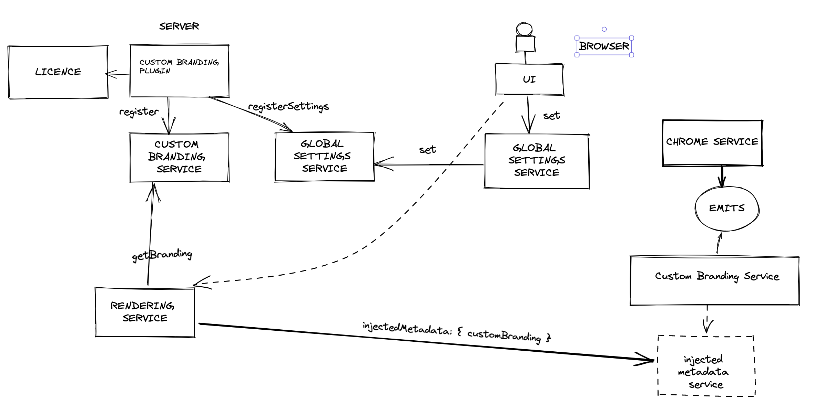

# customBranding
This is a plugin to configure custom branding.
Plugin server-side only. Plugin has three main functions:
1. To check license (custom branding is available for enterprise licenses and above)
2. To register itself with a custom branding service
3. To register UI settings

Properties that can be configured through custom branding are:
1. Custom logo (replaces the default `Elastic` logo in the chrome header and on the login page)
2. Customized text (replaces the `elastic` logo in the the chrome header)
3. Page title
4. Favicons - PNG and SVG

---

## Development

For detailed architectural overview, see image: 

See the [kibana contributing guide](https://github.com/elastic/kibana/blob/main/CONTRIBUTING.md) for instructions setting up your development environment.
