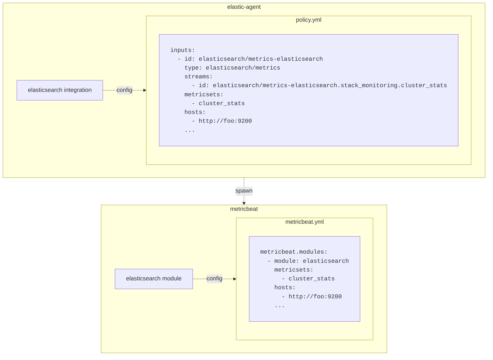
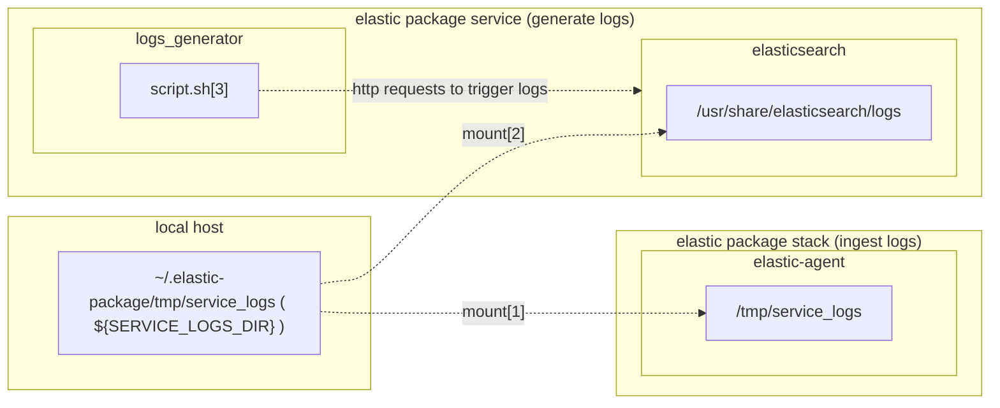

# Stack Monitoring integration packages

The Stack Monitoring packages provide a similar experience as their beats modules counterpart, both for metrics and logs ingestion. Feature wise these two collection modes are used to provide the Stack Monitoring UI the data it needs to power each product views. There is a however a difference in how the data is stored: while standalone beats modules will store all their data in a single data stream, for example `.monitoring-elasticsearch-8-mb`, the integrations will create one data stream for each metricset or filestream, for example `metrics-elasticsearch.stack-monitoring.node-default` for the node metricset. This means the integrations mappings are more specialized because they're split to only define the relevant properties for each metricset but the merged version of an integration data streams should be equivalent to its metricbeat mapping.

## Links
- [Usage dashboard (internal)](https://ela.st/sm-packages-dashboard)

## Working with packages

Make sure you've read the following documents to get up to speed:

**Workflow:**
- [Ecosystem definitions](https://github.com/elastic/integrations/blob/main/docs/definitions.md)
- [elastic-package getting started](https://github.com/elastic/elastic-package#getting-started)
- [Package testing and validation](https://github.com/elastic/integrations/blob/main/docs/testing_and_validation.md)
- [Developer workflow](https://github.com/elastic/integrations/blob/main/docs/developer_workflow_design_build_test_integration.md)

**Related repos:**
- [Integrations](https://github.com/elastic/integrations)
- [Package registry](https://github.com/elastic/package-registry/)
- [Package storage](https://github.com/elastic/package-storage/)
- [Package spec](https://github.com/elastic/package-spec)

### Integration internals

#### Metrics
For metrics collection, the integrations act as a wrapper around the corresponding metricbeat modules. For example, when the `elasticsearch` integration is configured to collect the `cluster_stats` metrics from a given host, the elastic agent will spawn a metricbeat process with the appropriate configuration.

Here's the state of the running processes (configuration have been shortened for clarity):



#### Logs
Similarly, logs collection will spawn a filebeat process. The corresponding filebeat module, if it exists, is not used in this scenario and instead the configuration/ingest pipelines are duplicated in the integration.

### Defining service dependencies

A package can define the services it needs to monitor for development and automated testing purposes, for example the mysql package needs a running database to fetch and validate metrics or logs. While we could use the elasticsearch and kibana services started by `elastic-package stack up` we don't want the stack packages to be special cases and just like mysql, the packages should be responsible of defining their dependencies.

This can be done by creating a `docker-compose` file under the package `_dev/deploy` directory, then running `elastic-package service up -v` in the package folder. An example is the [elasticsearch package](https://github.com/elastic/integrations/tree/main/packages/elasticsearch/_dev/deploy/docker) that starts a service which generates every types of logs with the help of a script executing queries.

**Note** that the container started with `elastic-package service up` will run in its own network and elastic-agent running with `elastic-package stack up` needs to specify the full docker service name to reach it. For example, if you want to collect metrics from the [elasticsearch instance](https://github.com/elastic/integrations/blob/main/packages/elasticsearch/_dev/deploy/docker/docker-compose.yml#L17) started with `elastic-package service up` you can configure elasticsearch integration to reach it at `http://elastic-package-service-elasticsearch-1:9200` (this may vary depending on OS/docker version). Alternatively you can reach the service on localhost via the forwarded port `http://host.docker.internal:9201`.

### Collecting logs

To collect logs elastic-agent needs access to the raw files. Let's see how that works taking `elasticsearch` package as an  example.
The setup requires an elastic-package stack and the development elasticsearch started with elastic-package service. While services will generate logs out of the box (eg server, gc logs), some need to be triggered (eg slowlogs). To generate all log types for our tests we also start a script that sends requests to elasticsearch in order to trigger those.


[1] https://github.com/elastic/elastic-package/blob/main/internal/stack/_static/docker-compose-stack.yml.tmpl

[2] https://github.com/elastic/integrations/blob/main/packages/elasticsearch/_dev/deploy/docker/docker-compose.yml#L39
This is a simplified version as there is some gymnastics involved to work around permissions, but the workflow remains the same

[3] https://github.com/elastic/integrations/blob/main/packages/elasticsearch/_dev/deploy/docker/scripts/generate-logs.sh

A log file written in the elasticsearch container will be available to the local `~/.elastic-package/tmp/service_logs` directory and thus available to the elastic-agent. Now the integration can be configured to point to the elastic-agent's `/tmp/service_logs`, for example elasticsearch's gc logs will be available under `/tmp/service_logs/gc.log`.

## Connecting a local Kibana

You may want to test local Kibana changes against the elastic-package stack, and that's perfectly doable but with some limitations (at the time of writing).

**Note** that when logging to multiple local Kibana instances you'll have to access them through isolated environments, for example firefox containers, private windows or a different browser. Clearing cookies for the domain also works. There seems to be a conflict with cookies where one is unable to pass the login screen of a local Kibana instance when cookies from another local instance are already cached. The symptom is a redirection to the login screen when entering valid credentials.

Once an elastic-package stack is started, update `kibana_system` password on the running elasticsearch:

```bash
curl --insecure -u elastic:changeme -H 'Content-Type: application/json' \
https://localhost:9200/_security/user/kibana_system/_password -d'{"password": "changeme"}'
```

Now configure the local Kibana on a different port so we don't conflict with the one started by elastic-package, and ignore certificate verification:

```yaml
server.port: 5602

elasticsearch.username: kibana_system
elasticsearch.password: changeme
elasticsearch.ignoreVersionMismatch: true
elasticsearch.hosts: ["https://localhost:9200"]
elasticsearch.ssl.verificationMode: none
```

then `yarn start`. A local Kibana running at http://localhost:5602 will talk to the elastic-package system, allowing local changes to Kibana to interact with data ingested by integrations.

Note that the local kibana is not able to interact with the local package-registry when running http, this means we have to do all integration-related interaction on the kibana run by elastic-package (at https://localhost:5601).

To enable ssl we can point the local kibana configuration to the certificates used by elastic-package (under ~/.elastic-package/profiles/{profile}/certs), then start the process with `NODE_EXTRA_CA_CERTS=~/.elastic-package/profiles/{profile}/certs/ca-cert.pem yarn start`.

## Testing strategy

On the package side, we use the testing tools provided by elastic-package for:

- [static validation of the mappings](https://github.com/elastic/elastic-package/blob/main/docs/howto/static_testing.md)
- [ingest pipeline validation](https://github.com/elastic/elastic-package/blob/main/docs/howto/pipeline_testing.md)
- [validation of live data](https://github.com/elastic/elastic-package/blob/main/docs/howto/system_testing.md)

See the [elastic-package-test documentation](https://github.com/elastic/elastic-package#elastic-package-test) for more details.

The system tests spawn a full setup (`elastic-package stack up` + `elastic-package service up`), install the package and attach a policy to a running agent to collect live data. This real-world setup can be leveraged to continuously validate future versions of the stack when they are released. Right now the service dependencies are running on 8.5.0 and the tests validate that this version is supported. The plan is to have an automated job that opens a PR validating that the tests are still successful with the latest released version.

On the Stack Monitoring side, we have an API integration test suite running against packages; see https://github.com/elastic/kibana/tree/main/x-pack/test/monitoring_api_integration#readme

## Troubleshooting

### My elastic-package stack appears to be stuck

If your stack doesn’t start it might be memory or disk starved. A good indicator is the presence of the following log in the elasticsearch container:

  ```json
  {"@timestamp":"2022-06-30T05:55:51.586Z", "log.level": "WARN",   "message":"high disk watermark [90%] exceeded on   [Vo4wyn23ReWufzMT2R9n3g][5b4a83809124][/usr/share/elasticsearch/data]   free: 5.6gb[9.6%], shards will be relocated away from this node;   currently relocating away shards totalling [0] bytes; the node is   expected to continue to exceed the high disk watermark when these   relocations are complete", "ecs.version": "1.2.0","service.  name":"ES_ECS","event.dataset":"elasticsearch.server","process.thread.  name":"elasticsearch[5b4a83809124][masterService#updateTask][T#1]",  "log.logger":"org.elasticsearch.cluster.routing.allocation.  DiskThresholdMonitor","elasticsearch.cluster.  uuid":"wzlK4-GBTymeP6n_Izf6ZA","elasticsearch.node.  id":"Vo4wyn23ReWufzMT2R9n3g","elasticsearch.node.name":"5b4a83809124",  "elasticsearch.cluster.name":"elasticsearch"}
  ```

  Try increasing the Docker environments disk threshold or cleaning the stored data. If no such logs appear, inspect every container logs to find the offending component.

### My package is not showing up in Integrations

- Ensure the [kibana version](https://github.com/elastic/integrations/blob/7ae8b62ffdee2552d6165f1b287cdd03e1edf1db/packages/elasticsearch/manifest.yml#L16) defined in the manifest supports your local kibana version,
- If the package is a prerelease version and you're running a Kibana with version >= v8.6.0, the package is hidden behind a flag that needs to be activated:


### Elastic agent

By default the agent is monitored which means that dedicated filebeat and metricbeat processes collect logs and metrics from the running agent. This data is then available in the respective Kibana applications under `logs-*` and `metrics-*` patterns.
If you need to look at the raw filebeat/metrics logs they are stored under `/usr/share/elastic-agent/state/data/logs/default` in the container.

**Additional resources:**
- [v2 diagram](https://github.com/elastic/elastic-agent-shipper/issues/3)
- [Agent onboarding (internal)](https://ela.st/agent-onboarding-doc)
- [Elastic Agent architecture v2 (internal)](https://ela.st/agent-v2-archicture-doc)