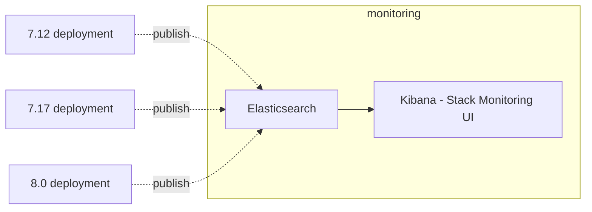

At a very high level, Stack Monitoring is intended to gather and display metrics and logging data for Elastic Stack Components.

A single [monitoring deployment](../reference/terminology.md#monitoring-deployment) can be used to monitor multiple Elastic Stack Components across a range of previous stack versions.

Each monitored deployment can use a different [data collection mode](../reference/data_collection_modes.md) or potentially even multiple different modes within a given deployment.

Additionally, the monitoring deployment can contain [rules](../reference/rules_alerts.md) that alert operators of exceptional conditions in the (monitored) production deployments.

The root stack monitoring page will display a list of clusters if data is found for more than one cluster.

Once a cluster is selected, the monitoring deployment will display a set of cards for each stack component in the cluster.

Clicking on one of the overview cards will navigate to a metrics display for the corresponding stack component.

The logs and metrics displayed here should provide guidance for an operator to resolve any issues that may be present in the monitored deployment.