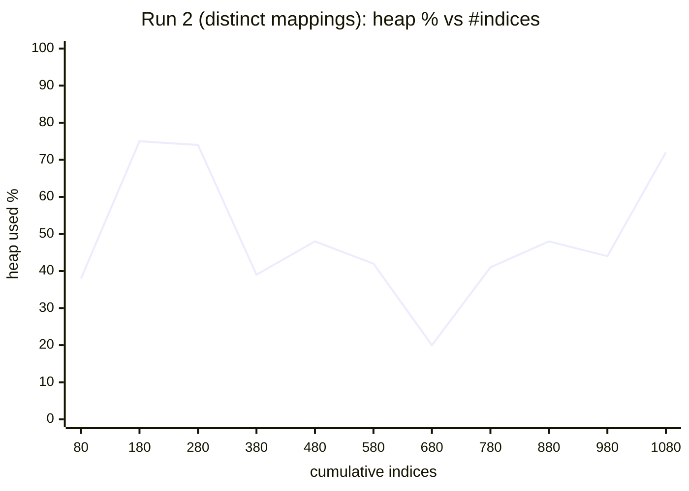
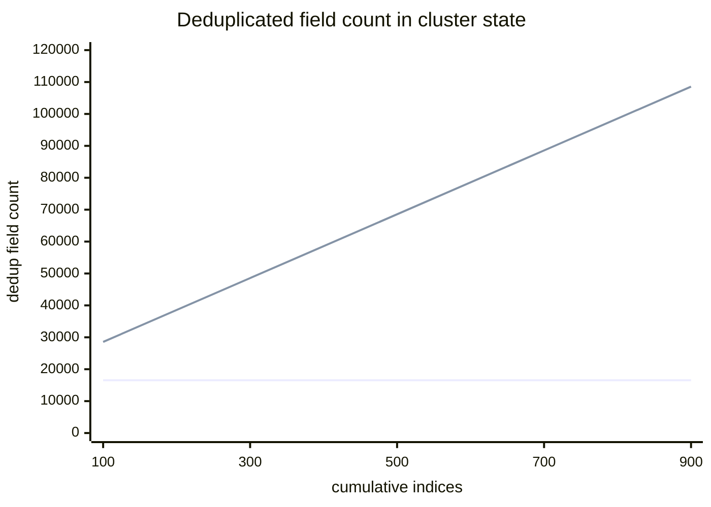

# @kbn/storage-adapter scaling experiment — local results

Experiment for [elastic/kibana-team#3973](https://github.com/elastic/kibana-team/issues/3973)
(epic [#3971](https://github.com/elastic/kibana-team/issues/3971)). Measures the ES
heap / shard / cluster-state cost of creating many `@kbn/storage-adapter` indices,
to inform whether one-index-per-type is a viable long-term model.

> **Bottom line:** on this setup the wall we hit first was **cluster-state update
> latency**, not node-heap OOM. ES deduplicates *identical* mappings in cluster
> state, so many indices of the **same** type (e.g. per-space indices) are cheap;
> many **distinct** types are what grows cluster state and slows every cluster
> operation. The default `cluster.max_shards_per_node` (1000) is a separate hard
> ceiling. See caveats — these numbers are a *lower bound* (near-empty shards, small node).

## Setup

- **Machine:** macOS (aarch64), 10 CPUs, 32 GB RAM.
- **Elasticsearch:** 9.6.0-SNAPSHOT, **single node**, `-Xms2g -Xmx2g` (G1GC),
  trial license, started via `node scripts/es snapshot`.
- **Kibana:** dev from source (`--no-base-path`) with the `storageAdapterHeapLab`
  test plugin loaded.
- **Baseline before any test indices:** ~58–80 indices/shards and ~18–21k mapping
  fields already exist (Kibana system indices, Fleet, security, APM/OTel
  templates, etc.), and the node already sits at **~40–55% heap**. This dev stack
  is heavy; a lean deployment would start much lower.
- `cluster.max_shards_per_node` was raised from the **default 1000** to 20000 to
  let us explore *past* the default ceiling.
- Each test index: 1 primary shard, 0 replicas (single node), `dynamic: strict`,
  and **2 documents** (documents are near-irrelevant to the cost we measure).

## Method

The plugin exposes `POST /internal/storage_adapter_heap_lab/generate`
(`numIndices`, `numFields`, `numDocs`, `uniqueFieldsPerIndex`, …) which builds a
realistic flat mapping (keyword/text/numeric/date/boolean mix) via
`@kbn/storage-adapter` and creates the indices + docs server-side. A driver
script ramps `numIndices` in steps, and between steps samples
`_nodes/stats/jvm` + `_cluster/stats` (heap, shards, indices,
`total_field_count`, `total_deduplicated_field_count`, cluster status),
pausing to let heap stabilize. Raw CSVs: [`results/run1_f100.csv`](results/run1_f100.csv),
[`results/run2_f100_unique.csv`](results/run2_f100_unique.csv).

Two runs, both **100 fields/index**, +100 indices/step:

| Run | Mode | What it models |
|-----|------|----------------|
| 1 | **shared** mapping (all indices identical) | many indices of **one** type (e.g. per-space) |
| 2 | **unique** mapping per index (salted field names) | many **distinct** types / consumers |

Heap is noisy under G1GC, so we record both the **immediate** reading after a
step and a **retained** reading (min over the stabilization window ≈ post-GC live
set).

## Results

### Run 1 — shared mapping (mappings deduplicated)

| step | indices/shards | total fields | **dedup fields** | heap immediate | heap retained (post-GC) |
|-----:|---------------:|-------------:|-----------------:|---------------:|------------------------:|
| base | 59   | 18,676  | 16,456 | 1121 MB (52%) | — |
| 1    | 159  | 28,676  | **16,556** | 1329 MB (61%) | 1329 MB |
| 3    | 359  | 48,676  | **16,556** | 631 MB (29%)  | 631 MB |
| 6    | 659  | 78,676  | **16,556** | 1279 MB (59%) | 1279 MB |
| 9    | 959  | 108,676 | **16,556** | 1706 MB (79%) | 567 MB (26%) |
| 12   | 1,259| 138,676 | **16,556** | 1491 MB (69%) | 1491 MB |
| 15   | 1,559| 168,676 | **16,556** | 1862 MB (86%) | 721 MB (33%) |
| 19   | 1,959| 208,676 | **16,556** | 1607 MB (74%) | 1607 MB |

**Key point:** `total_field_count` grows to 208k, but **deduplicated field count
stays flat at 16,556** — ES stores one shared `MappingMetadata` instance on heap
regardless of how many indices reuse it. Retained heap stays in the
~0.6–1.6 GB band (GC recovers to ~600 MB); creation churn drives the transient
peaks. **No failure through ~1,960 indices/shards.**

### Run 2 — unique mapping per index (no deduplication)

| step | indices/shards | total fields | **dedup fields** | heap immediate | heap retained (post-GC) |
|-----:|---------------:|-------------:|-----------------:|---------------:|------------------------:|
| base | 80   | 20,776  | 18,556  | 830 MB (38%)  | — |
| 1    | 180  | 30,776  | **28,556**  | 1629 MB (75%) | 1629 MB |
| 3    | 380  | 50,776  | **48,556**  | 837 MB (39%)  | 837 MB |
| 5    | 580  | 70,776  | **68,556**  | 906 MB (42%)  | 906 MB |
| 7    | 780  | 90,776  | **88,556**  | 898 MB (41%)  | 488 MB (22%) |
| 9    | 980  | 110,776 | **108,556** | 958 MB (44%)  | 703 MB (32%) |
| **10** | **~1,080** | **120,776** | **118,556** | 1562 MB (72%) | **`fetch failed` (timeout)** |

**Key point:** deduplicated field count now tracks total 1:1 (28k→108k) — distinct
mappings are **not** deduplicated. Yet even at ~108k distinct fields the retained
(post-GC) heap is still only ~450–700 MB. What broke at step 10 (~1,000 indices)
was the **generate request timing out**: creating each new distinct-mapping index
is a cluster-state update, and by ~1,000 indices those updates are slow enough
that the HTTP call drops. **ES did not OOM or crash** — it kept applying the
change (shards reached 1,080), and both ES and Kibana stayed up.

At 1,080 distinct-mapping indices the cluster-state `metadata.indices` payload was
**≈ 8.6 MB** (of which heaplab mappings ≈ 6.9 MB). Cluster state is held on the
heap of every node and re-published/diffed on every change, which is why *update
latency* — not steady-state heap — is the first thing to degrade.

### Heap vs indices (run 2, immediate readings)



### Deduplicated fields: shared vs distinct mappings



Flat line = run 1 (shared mapping, deduplicated). Rising line = run 2 (distinct
mappings, not deduplicated).

## Findings

1. **Shards are cheap in heap here; mappings are the cost — and identical
   mappings are deduplicated.** Many indices of *one* type (the per-space pattern
   used by e.g. Context Engine signals) share a single `MappingMetadata` on heap.
   Adding 1,900 such indices did not meaningfully raise retained heap.
2. **Distinct types are the real multiplier.** Each distinct mapping is stored
   independently and inflates cluster state (~8.6 MB at ~1,000 × 100-field types).
3. **The first wall is cluster-state update latency, not node-heap OOM.** On a
   2 GB single node, index-creation throughput collapsed around ~1,000
   distinct-mapping indices (steps went from ~36 s/100 indices to a timeout),
   while retained heap was still < 1 GB.
4. **The default `cluster.max_shards_per_node` = 1000 is an independent hard
   ceiling.** With Kibana's own ~60 shards, a consumer creating hundreds of
   indices (× spaces) can hit it on a small cluster and index creation then fails
   with `validation_exception`.

## Caveats (important)

- **Lower bound on heap.** Test shards hold 2 docs, so per-shard Lucene/segment
  heap (FSTs, doc values, norms, points) is essentially absent. Production shards
  with real data cost materially more heap per shard than measured here.
- **Small, busy node.** 2 GB heap and a heavy dev stack (~40–55% heap before we
  start) compress the usable range and make heap noisy; absolute MB values are
  environment-specific. The *shape* of the curves is the takeaway, not the
  absolute numbers.
- **Stateful only.** Serverless has different shard/heap economics (object-store
  backed, autoscaling). The serverless arm of #3973 — deploy via
  `ci:project-deploy-elasticsearch` and watch the "memory as returned by ES"
  autoscaling dashboard — is still needed and not covered here.
- **Authz cost, observed but not measured.** `asInternalUser` (`kibana_system`)
  could not create arbitrary indices; new storage-adapter index patterns must be
  granted in the `kibana_system` role. This is a real per-consumer operational
  cost, orthogonal to heap. (The experiment used the current superuser to isolate
  the heap/shard question.)

## Implications for the epic

- One-index-per-type is fine for a **bounded** number of types. The risk scales
  with the number of **distinct mappings** and total **shards**, via cluster-state
  size/update latency and the per-node shard ceiling — surfacing well before node
  heap OOM on a small cluster.
- Per-space fan-out of a *single* type is cheaper than feared on the heap side
  (mapping dedup) but still spends a shard each (shard ceiling + real per-shard
  heap once populated).
- These local results support taking the shared-index-mode idea seriously and
  bringing concrete cluster-state/shard budgets (and serverless specifics) to the
  ES team (#es-distrib), rather than treating heap-per-shard as the binding
  constraint.

## Reproduce

```bash
node scripts/es snapshot                       # terminal 1 (add -Xmx to taste)
node scripts/kibana --dev --no-base-path       # terminal 2
# shared mappings:
NUM_FIELDS=100 STEP_INDICES=100 STEPS=50 OUT=/tmp/run1.csv \
  node x-pack/platform/plugins/private/storage_adapter_heap_lab/scripts/run_experiment.js
# distinct mappings:
NUM_FIELDS=100 STEP_INDICES=100 STEPS=50 UNIQUE_FIELDS=true OUT=/tmp/run2.csv \
  node x-pack/platform/plugins/private/storage_adapter_heap_lab/scripts/run_experiment.js
```
