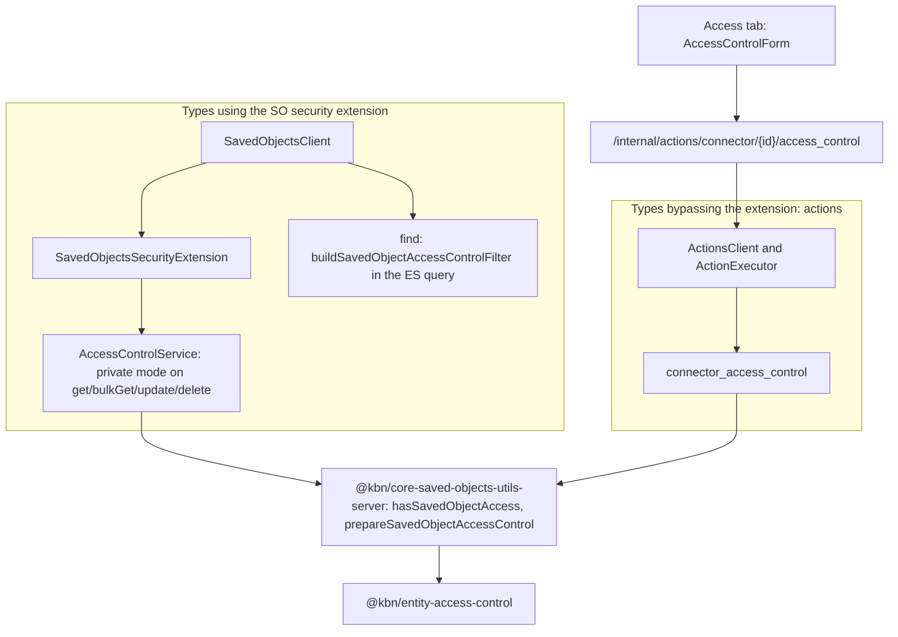

# Per-connector RBAC PoC — saved-object level access control

**Status: proof of concept.** This is a reviewable demo meant to support a design decision, not a
production authorization rollout. See [Not production](#not-production) for the gaps.

## What this adds

A connector can now be **Public** (today's behaviour: anyone with connector privileges in the space
can use it) or **Private** (only its owner and the users it was explicitly shared with). The
capability itself lives in the saved-objects layer, so any saved-object type can opt in; connectors
are the first consumer.

Two concepts:

- **Owner** — the user profile that restricted the object. Views, edits, runs, deletes and shares it.
- **Executor** (connector-specific role) — views and runs the connector, cannot change its
  configuration, secrets or access.

Unlisted users do not see a private connector in lists and get a 404 when they address it directly.

## Prior art and what was reused

| Source | Reused |
| --- | --- |
| Dashboard "only me" ([#221916](https://github.com/elastic/kibana/pull/221916), [#224411](https://github.com/elastic/kibana/pull/224411), [#246602](https://github.com/elastic/kibana/pull/246602)) | The root-level `accessControl` field, `supportsAccessControl` opt-in, and the security-extension enforcement point. Extended, not replaced. |
| Workflows sharing PR [#290269](https://github.com/elastic/kibana/pull/290269) | `@kbn/entity-access-control` (schema, `prepareAccessControl`, `hasEntityAccess`, read-access query) and `@kbn/entity-access-control-ui` (`AccessControlForm`) — cherry-picked as-is. Workflows' ES-index storage and viewer/executor/editor roles were not. |
| Connector ACL demo [talboren/kibana#5](https://github.com/talboren/kibana/pull/5) | The UX shape (Access tab, one `executor` role), the internal route surface, profile resolution, and the enforcement placement in the actions client and executor. Its ACL *storage* (connector SO attributes) and its actions-local policy module were replaced by the core field and core helpers. |
| Agent Builder ACL | Validated the model (`access_mode` + profile-UID entries with roles). Nothing directly reusable — it stores ACLs on ES system-index documents. |
| Object Level Security ([#39259](https://github.com/elastic/kibana/issues/39259), [#82725](https://github.com/elastic/kibana/issues/82725), RFC [#93115](https://github.com/elastic/kibana/pull/93115)) | Same root-field-enforced-by-the-security-wrapper shape. It stalled on ES-side dependencies, not on the Kibana model. |

Not the same thing as [#180908](https://github.com/elastic/kibana/issues/180908), which is
**type-level** connector RBAC (privileges per connector *type*). This PoC is **per instance** and
composes with that: type-level privileges would still be checked first.

## Architecture

### Where the ACL lives

On the existing core root field, extended with a `private` mode and per-user entries:

```ts
accessControl: {
  owner: string;                       // user profile UID
  accessMode: 'default' | 'write_restricted' | 'private';
  entries?: Array<{ type: 'user'; id: string; role: string; added_at: string }>;
}
```

A root field rather than type attributes because it generalizes to every saved-object type, survives
per-type schema churn, stays out of encrypted/AAD attribute sets, and reuses the existing
serializer and import-stripping plumbing. The entry shape matches `@kbn/entity-access-control` so
Agent Builder and Workflows can converge on it later. `accessMode` and `entries.{id,role}` are now
indexed (additive mapping change) so `find` can filter server-side.

### How it layers with existing authorization

Feature privileges and Spaces apply first and unchanged. An ACL never grants a privilege the user
lacks — `private` only *subtracts* access from users who would otherwise have it. `write_restricted`
(the dashboard mode) is untouched.

### Enforcement



Two enforcement paths share one policy implementation:

1. **The security extension** enforces `private` for any type that opts in — reads
   (`get`/`bulkGet`), writes (`update`/`delete`/`changeAccessControl`), and `find` (an owner-or-entry
   filter is appended to the ES query). Nothing else has to be written for a new consumer that uses
   a normal saved-objects client.
2. **Exported helpers** in `@kbn/core-saved-objects-utils-server` (`hasSavedObjectAccess`,
   `prepareSavedObjectAccessControl`, `buildSavedObjectAccessControlFilter`) for consumers that
   bypass the extension. The actions plugin builds its saved-objects client with
   `excludedExtensions: [SECURITY_EXTENSION_ID]` and authorizes through `ActionsAuthorization`, so
   it must call these explicitly. Both paths run the same checks over the same field.

`changeAccessControl` is the new saved-objects client API that writes mode and entries together. It
works without the security extension when an explicit `owner` is provided, which is what lets the
actions plugin use it.

### Gated connector operations

| Operation | Public | Owner | Executor | Unlisted |
| --- | --- | --- | --- | --- |
| `getAll` / `getBulk` (lists) | visible | visible | visible | omitted |
| `get` | allowed | allowed | allowed | 404 |
| `execute` (HTTP and action executor) | allowed | allowed | allowed | 404 |
| `update` | allowed | allowed | 403 | 403 |
| `delete` | allowed | allowed | 403 | 403 |
| `rotateInboundIngress` | allowed | allowed | 403 | 403 |
| `getAxiosInstance` | allowed | allowed | allowed | 404 |
| GET/PUT access control | owner-only | allowed | permissions only | 404 |

`create` is ungated; the first user to restrict a connector becomes its owner, which is what lets
connectors that existed before the type opted in be restricted. A user who cannot read the connector
is denied with 404 on *every* operation, including writes, so that a private connector is never
discoverable; users who can read it get 403 on the operations they lack. Preconfigured and system
connectors are unchanged — they are not saved objects, so they have no access control and no Access
tab.

### Two core fixes the live demo surfaced

- **`create` with `overwrite: true` dropped the access control** of the document it replaced
  whenever the caller bypassed the security extension. The connector update path is an
  overwrite-create, so every rename silently made a private connector public again. `performCreate`
  now preserves the existing document's `accessControl` regardless of the extension, matching what
  `performBulkCreate` already did.
- **The root saved-object validation schema** only allowed `write_restricted` and `default`, so any
  write of a `private` object was rejected. It now accepts `private` and the `entries` array.

Background executions (rules, cases, task-manager retries) resolve a profile from the API key the
task runs under, which is how the executor check applies outside of an interactive request.

### Why owner + Executor

Connectors are a capability to *invoke* something with stored credentials. The interesting
distinction is "can run it" versus "can change what it does and who else can run it" — so one
non-owner role is enough, and every editing capability stays with the owner. Workflows' third role
(editor) has no analogue here: sharing the ability to edit a connector's secrets is effectively
sharing ownership.

## Demo script

Setup: `yarn es snapshot` plus Kibana with security enabled, and three native users in one space,
all holding the same `feature_actions.all` privilege (`owner`, `executor`, `stranger`) — the point
being that the ACL is what separates them, not their privileges.

1. As **owner**: create a Server log connector, open it, go to the **Access** tab. It is Public.
2. Switch visibility to **Private**, search for `executor` in the people picker, add them with the
   **Can run** role, save.
3. As **executor**: the connector is in the list; open it and run it from the **Test** tab; the
   **Access** tab shows only a read-only notice; saving a configuration change is rejected.
4. As **stranger**: the connector is absent from the connector list, and `get`, `_execute`,
   `update`, `delete`, and the access-control routes all return 404.
5. As **owner**: flip back to **Public** and save. All three users see and can run it again.

Observed when this was run against a local stack, with all three users holding identical privileges:

| | list | get | execute | update / delete | manage access |
| --- | --- | --- | --- | --- | --- |
| owner | visible | 200 | 200 | 200 | 204 |
| executor | visible | 200 | 200 | 403 | 403 |
| stranger | absent | 404 | 404 | 404 | 404 |

## Not production

Out of scope for this PoC, in rough order of how much each would matter for a real rollout:

- **Saved-object import/export, copy-to-space, and the Saved Objects management UI** do not
  understand `private`. Export strips `accessControl`, so a private connector round-trips as public.
- **Event log, execution log, and connector-usage aggregations** are not filtered, so a private
  connector's execution history is still visible to users who cannot see the connector.
- **Inbound event processing** (`/api/actions/events/...`) authenticates by ingest token and does not
  consult the ACL.
- **`resolve` / `internalBulkResolve`** are not enforced in the security extension. Connectors do not
  use them, but another consumer would need them covered.
- **No optimistic concurrency on access writes** — two concurrent access changes last-write-wins,
  and there is no 409 surfaced to the UI.
- **No ownership transfer, no force-delete, and no reaping of orphaned objects** when an owner's user
  profile is deleted or disabled. A private connector whose owner is gone can only be recovered by an
  administrator through Elasticsearch.
- **No groups or roles as principals** — entries are user profile UIDs only.
- **Recipient privileges are only checked in the suggest endpoint**, not re-validated on save. This is
  sound (the ACL cannot grant a privilege) but means a listed user who later loses connector
  privileges stays in the entries list.
- **The user picker silently omits ineligible users.** Entries are keyed by user profile UID, and a
  profile only exists once a user has signed in interactively, so a freshly created user is
  invisible until their first login. A user without connector privileges in the space is likewise
  omitted. The picker gives no indication of which of the two applies, or that the user exists at
  all — a real implementation needs to distinguish these cases.
- **The root mapping change needs a migration story** for existing deployments, particularly
  serverless.
- **Agent Builder and Workflows have not been converged** onto this field; the entry shape is
  compatible but the data still lives in their own indices.
- **Audit events** do not yet distinguish an ACL denial from a privilege denial.
