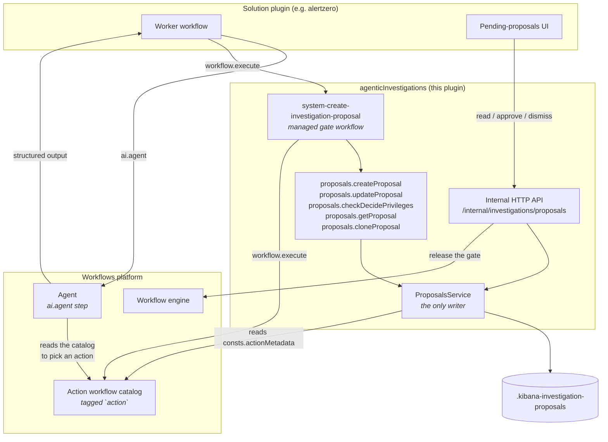
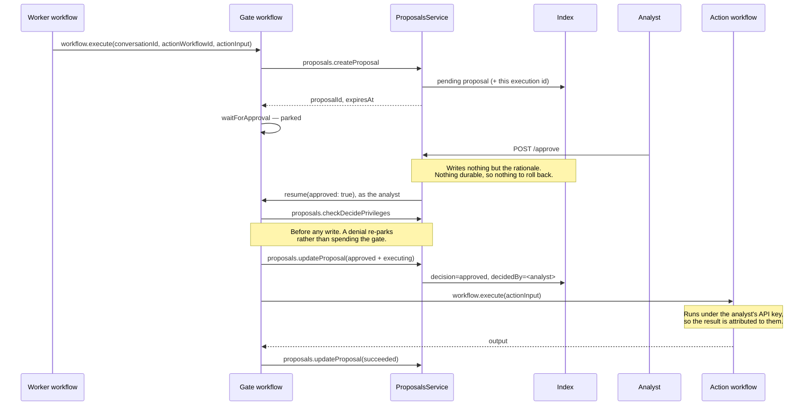

# Agentic investigations

Solution-agnostic base layer for the entities an agent and a human collaborate on. It owns their storage, their API, and their workflow steps, so a Worker in any solution can create them and any solution's UI can act on them.

Today it holds one entity, **proposals**. **Investigations** and **incidents** are next, which is why the plugin is an umbrella rather than one plugin per entity.

Consumed by AlertZero (Security) and intended for Nightshift (Observability). Nothing in this plugin is solution-specific.

## What belongs here, and what does not

This layer owns the record, the decision, and the guarantee that an approved action runs **as the approver**. It does not decide what to propose, when to propose it, or whether autonomy allows skipping the human gate — a Worker does all three.

## Entity directories

Every entity gets the same three homes, and nothing entity-specific lives above them:

```
common/
  constants.ts           umbrella: plugin id, API version, route base, workflow owner id
  index.ts               umbrella barrel, re-exports each entity barrel
  proposals/             constants, schemas, step definitions shared with the browser
server/
  plugin.ts config.ts types.ts
  features.ts            umbrella feature and its privileges
  proposals/             routes, services, step handlers, storage, managed workflows
public/
  plugin.ts index.ts types.ts
  proposals/             browser step definitions for the YAML editor
```

Adding an entity means adding a directory in each of the three, an entity barrel, its privileges in `features.ts`, and a getter on the start contract. It should not require restructuring the umbrella itself.

## Privileges

One Kibana feature, `agenticInvestigations`, shown in the Roles and Spaces pickers as **Proposed Actions** — named for proposals alone because action proposals move to their own plugin in a follow-up. Both privileges are declared inline on the feature:

| Feature privilege | API | UI |
| ----------------- | ------------------------------------ | ------------------------------------ |
| `all`             | `read_proposals`, `manage_proposals` | `showProposals`, `decideProposals`   |
| `read`            | `read_proposals`                     | `showProposals`                      |

So `read` can see the queue but cannot decide it. Because there are no sub-feature privileges to withhold, `minimal_all` and `minimal_read` grant the same as `all` and `read`. The feature carries `minimumLicense: 'enterprise'`.

When a second entity lands and needs to be grantable on its own, its capabilities belong in a sub-feature pulled up through `includeIn` rather than in more inline privileges.

### Three questions, three places

Conflating these is how proposal authorization goes wrong, so each is enforced somewhere different.

| Question | Principal | Enforced by | On refusal |
| --- | --- | --- | --- |
| May this HTTP caller decide? | The request | `requiredPrivileges` on the route | Synchronous `403` — the only place a human can be told |
| May this resumer decide *this* proposal? | The approver, which post-gate is the execution identity | `proposals.checkDecidePrivileges`, **after the gate and before any write** | Returns `false`; the gate workflow re-parks for someone who can |
| May this execution write proposals at all? | The Worker running the step | An assert **inside each writing step** | Fails the step; a Worker without the privilege is a misconfiguration, not something to retry |

**Ordering is load-bearing.** The boolean check must precede every write inside the decision loop. If a write came first and failed instead, the gate would already be claimed and spent, the workflow would fail, and the proposal would strand with no way for a privileged approver to retry.

All checks **fail closed**, including when the `security` plugin is absent entirely: without it there is no principal to evaluate, and a workflow that cannot be attributed must not write. Workflows cannot execute steps without an identity, so an absent principal is a bug rather than a normal path.

**Not in the service.** The service is reached from routes (already gated declaratively), from steps (principal is an execution), and from other plugins through the start contract — in-process and trusted, which is how AlertZero's `ConversationProposalsService` calls `listByWindow`. Request-based authz there would mean threading a request through every call and standing up a second mechanism beside the routes'. The service stays the invariant layer instead: terminal guards, decision immutability, valid-pair enforcement, action-input validation.

**The principal differs by surface, and one of them cannot be checked.** An authenticated resume runs the post-gate steps under a clone of the resumer's API key, so the check evaluates the human. An **external-token resume carries no request**, so the engine wakes the pre-scheduled task under the *workflow runner's* key instead — and that identity necessarily holds `manage_proposals`, because it had to in order to create the proposal. Checking it would therefore authorize every click on a magic link, as the Worker, and record the Worker as the decider.

`hitlExternalResume.enabled` defaults to `true` and `external_resume_service.ts` handles `waitForApproval` explicitly, so this is reachable rather than theoretical. `proposals.checkDecidePrivileges` therefore takes the gate's own `respondedBy` and refuses any principal prefixed `external_resume:` outright, without consulting the privilege service — there is nothing it could usefully ask. The loop re-parks, so an authenticated approver can still decide. Enabling external channels for proposal gates needs the platform to propagate the responder's identity, not just their answer.

## Proposals

### Model

- A **proposal** is a recommendation awaiting a human decision. It lives in `.kibana-investigation-proposals` and points at the conversation it belongs to.
- An **action proposal** additionally references a managed **action workflow** (`actionWorkflowId`) plus its `actionInput`. Approving it runs that workflow.
- A **non-action proposal** carries only its `comment` — instructions the analyst carries out themselves before approving. It is always gated: autonomy governs whether an action may run unattended, and there is no action here to govern, so `autoApprove` is ignored.
- Proposals are immutable once decided, and are never tuned: changing an action means dismissing the proposal and creating a new one.

### Decision and status are two axes

`decision` records what a human concluded; `status` records where the proposal got to. They are separate fields because they answer different questions and settle at different times.

- **`decision: approved | dismissed`** — absent until someone decides, and immutable once set. Groups with `decidedBy` / `decidedAt` / `rationale` / `dismissReason`.
- **`status: pending | executing | succeeded | failed | expired | no_action`** — always defined.

The split exists because a single field could not express both: `status` has to say whether an approved action succeeded, and `decision` has to survive that outcome so the queue knows a human already answered.

Because `pending` is only ever valid while undecided, the two axes give you two distinct reads rather than one:

- **`status: 'pending'`** — undecided *and not yet settled*: "awaiting a human right now". This is what a decision queue filters on.
- **`decision` does not exist** — `status ∈ {pending, expired}`: "no human ever answered", including deadlines that passed unanswered.

Nothing needs the second today, so only the first is exposed as a filter.

Two of the statuses exist to stop other values doing double duty:

- **`expired`** means nobody answered in time, so `dismissed` no longer has to cover both "a human declined" and "the deadline passed".
- **`no_action`** means a human answered and nothing will execute: a dismissal of any kind, or an approval of a proposal carrying no action. It reads as "no action was executed" under both. Without it, both cases would sit at `pending` forever, indistinguishable from awaiting.

The only valid combinations, enforced by `ProposalsService.update`:

| `decision` | `status` | Meaning |
| --- | --- | --- |
| absent | `pending` | Awaiting a human |
| absent | `expired` | The deadline passed unanswered |
| `dismissed` | `no_action` | Declined |
| `approved` | `no_action` | Accepted, but there is nothing to run |
| `approved` | `executing` | The action is running |
| `approved` | `succeeded` / `failed` | The action's outcome |

Note the consequence for an undecided proposal: `expired` is its *only* terminal status, since every execution state requires an approval. A malfunction before anyone decided therefore settles as "no decision was reached" rather than as a failure.

Two independent guards replace what used to be one terminal check: a status cannot *change* once it is `succeeded | failed | expired | no_action`, and a `decision` cannot be overwritten once set. They are independent because the axes settle independently — the decision guard is what refuses a second approver on a proposal that is still `pending` behind the gate.

Re-writing the *same* terminal status is deliberately allowed, so settling stays idempotent. The workflow's failure handler records `failed` on a record the loop may have already failed — if the clone step throws after `record_action_failure` succeeded, say — and refusing that would replace the real error with a conflict about recording it.

**`expired` is persisted but expiry is also computed.** Between the deadline passing and the loop settling the record there is task lag during which it still reads `pending`. The computed `expired` flag on the read model is for the UI; persisted `status: expired` is the durable settlement.

`supersededBy` points at the proposal that replaced this one — written when a failed action is re-offered as a fresh proposal. The queue filters superseded records out so a chain of retries appears once rather than per attempt.

### Architecture



Three boundaries are worth stating outright. `ProposalsService` is the **only** writer of the index — the steps and the routes both go through it, and there is no second path. The solution plugin owns no storage: it contributes a Worker and a UI, and reaches the record only through the HTTP API. And **the gate workflow is the only writer of a decision**: the routes release the gate, and the steps behind it record what was decided.

That last one is the point of the design. Every resume surface — this API, the platform's own resume route, the Inbox, Agent Builder — funnels through the same parked gate, so a check and a write placed behind it cover all of them at once. Writing the decision in the approve route instead would mean only that one route ever recorded it.

The Agent is where the action is chosen. A Worker spawns it with an `ai.agent` step; the agent reads the action catalog to see which actions exist and what each one takes, then returns structured output naming an `actionWorkflowId` and its `actionInput`. Neither this plugin nor the gate workflow decides which action is appropriate.

### Lifecycle



Dismissal follows the same shape down the gate's negative branch, so no action runs, and settles at `dismissed` + `no_action`.

**The decision is asynchronous.** The resume call returns before the post-gate steps run, so the route's response body still describes an undecided proposal. Callers must invalidate and refetch rather than trust it — `useApproveProposal` and `useDismissProposal` both do.

### The decision loop

The gate sits inside a `while` loop, because releasing a gate is not the same thing as deciding. Two cases need the proposal parked again rather than settled: a resumer who cannot decide, and an action that failed and is worth re-offering. Each iteration:

1. **Recompute the remaining time** from the proposal's fixed `expiresAt`, so a failed attempt never extends the deadline. Two `data.set` steps, because Liquid cannot read a variable written by the same step.
2. **Settle and break** if the deadline has passed (`expired`) or the attempt budget is spent.
3. **Park on the gate**, under a step-level `on-failure: continue`, and settle `expired` if it times out. The gate's timeout and the recorded deadline are the same literal, so a gate that times out is always past its deadline and there is nothing left to re-park for. Handling it here rather than letting it reach the workflow-level handler is what makes an unanswered proposal end the run as `completed` with an output, instead of `failed`. This branch has to come before anything reads the gate's answer: a timed-out gate answers blank, which the dismissal branch would otherwise record as a decision nobody made. The key is honoured by the engine but unmodelled by `WaitForApprovalStepSchema` — see "Known limitations" and [#19315](https://github.com/elastic/security-team/issues/19315).
4. **Copy the gate output into variables immediately**, inside the iteration that produced it — `waitForApproval` is not exempt from output eviction, and a step output resolves to its latest execution, so a later iteration that skipped the gate would read this pass's values.
5. **Re-read the clock** and settle `expired` if the deadline passed while parked. The check in step 1 ran before a park that may have lasted days, and only the HTTP routes refuse an expired decision — so without this a resume through the platform resume API or the Inbox would be recorded and run its action past the deadline the analyst was shown.
6. **Check the resumer's privilege**, and `loop.continue` when denied. Nothing has been written at this point.
7. **Record the decision**, together with the status it implies — never on its own, because `approved` + `pending` is not a legal pair, and a decision-only write would leave the record claiming an approval with no outcome.
8. On an action failure, **clone** the proposal, adopt the new id, and loop; the clone inherits the deadline so a chain of retries cannot outlive it. Cloning a proposal that already carries `supersededBy` is refused, because overwriting the pointer would orphan the first clone.

Three invariants the loop depends on:

- **`max-iterations` cannot settle the record.** A `while` is a flow-control step, so the engine excludes it from the workflow-level `on-failure` wrapping, and the error `on-limit: fail` throws reaches no handler at all. The in-loop budget check is what actually writes a terminal status; `on-limit: fail` is an unreachable backstop.
- **No `iteration-timeout`.** It wraps the loop body in a step-timeout zone, which would cut the parked gate short.
- **Never read a loop-body step output after the loop.** Those are evicted on exit. `data.set` variables survive both the loop and a HITL park, which is why everything the loop carries lives in one.

Conditions use a single `and` or a single comparison throughout. Liquid has no operator precedence and no parentheses, so a mixed `and`/`or` expression binds in a way that does not match how it reads.

### Custom steps

| Step | Privilege | On refusal |
| --- | --- | --- |
| `proposals.createProposal` | manage | Fails the step |
| `proposals.updateProposal` | manage | Fails the step |
| `proposals.getProposal` | read | Fails the step |
| `proposals.cloneProposal` | manage | Fails the step |
| `proposals.checkDecidePrivileges` | manage | **Returns `false`** |

Each failure mode gets its own `ExecutionError.type` (`PermissionError`, `ConflictError`, `ExpiredError`, `NotFoundError`, `ValidationError`, `ApiError`), because the type is the only part of an error a workflow can branch on — `ExecutionError` carries just `{ type, message, details? }`, and all three timeout sources already share `TimeoutError`.

`checkDecidePrivileges` is the one step that does not fail on a denial, but it *does* fail on an unexpected error: a privilege service that is down is not a refusal, and a loop that treated it as one would re-park forever.

### How a Worker creates a proposal

Call the gate workflow; do not write proposals directly.

```yaml
- name: propose_action
  type: workflow.execute
  with:
    workflow-id: system-create-investigation-proposal
    inputs:
      conversationId: '{{ steps.investigate.output.conversation_id }}'
      comment: 'Tune the noisy rule that produced this alert'
      actionWorkflowId: '{{ steps.suggest_action.output.structured_output.actionWorkflowId }}'
      actionInput: '${{ steps.suggest_action.output.structured_output.actionInput }}'
      impact: low
      confidence: medium
```

The input contract:

| Input | Required | Notes |
| --- | --- | --- |
| `conversationId` | yes | The conversation the proposal belongs to. |
| `comment` | yes | Markdown explaining what is being proposed. A proposal a human cannot read is not reviewable. |
| `actionWorkflowId` | no | Omit for a proposal the analyst carries out themselves. |
| `actionInput` | no | Passed to the action workflow as its single `actionInput` object. |
| `impact`, `confidence` | no | Snapshotted at creation; used for queue ordering. `impact` overrides the action's own. |
| `category` | no | Overrides the action's own. Pass it for a proposal with no action, or it cannot be grouped and consumers will drop it. |
| `autoApprove` | no | See below. Defaults to `false`, so the gate is fail-closed. |

You get back `proposalId` and `status`.

**The decision deadline is a fixed 72h, not a caller input.** The workflow engine does not template-render a step's `timeout`; it hands the raw string to the duration parser, so `timeout: "{{ inputs.expiresIn }}"` fails at execution time ([#290258](https://github.com/elastic/kibana/issues/290258)). Until that lands, the gate `timeout` and the `expiresIn` recorded on the proposal are the same literal, so the queue and the parked gate cannot disagree about when a decision expires — and a gate that times out is therefore always past the deadline, which is why the loop settles it as `expired` outright. `settings.timeout` is deliberately much larger: the ceiling is a backstop that runs no handler, so it must never fire before the gate. See "Known limitations". The `proposals.createProposal` step still accepts `expiresIn`, so a caller driving that step directly can set its own deadline; only this gate workflow is pinned.

**`autoApprove` is for callers that already resolved autonomy.** This plugin has no autonomy policy of its own; a Worker that has decided the action is permitted without a human passes `autoApprove: true` and the gate is skipped — the proposal is still recorded, and the action still runs. Anything else leaves it unset. It applies only to action proposals: a proposal with no `actionWorkflowId` is always gated regardless of the flag.

**The calling workflow must itself be managed.** An unmanaged parent can neither execute a managed child nor see globally-installed definitions, so a Worker registered outside `@kbn/workflows/managed` cannot reach the gate.

Omitting an optional input is safe. A Liquid template for an absent input still renders — as `''` — so every optional step input is declared with `optionalStepInput`, which treats `''` and `null` as absent. Without it, `actionInput: '${{ inputs.actionInput }}'` on a non-action proposal would fail schema validation before the handler ran.

### Authoring an action workflow

An action workflow is an ordinary managed workflow that:

1. carries the `action` tag, so the catalog can be discovered by tag;
2. declares `consts.actionMetadata` (`name`, `category` — any keyword the owning solution chooses — and optionally `description`, `impact`, `reversible`, `approvalPolicy`) — metadata has to live under `consts`, because unknown top-level YAML keys are stripped by the workflow schema;
3. takes a **single `actionInput` object** as its input, so the generic gate workflow never needs to know an action's parameter names;
4. ends in `workflow.output`, because `workflow.execute` cannot type a child's result.

Rule 3 is the non-obvious one and the easiest to get wrong: the gate passes exactly one key, `actionInput`. An action that declares `name`, `query` and `index` as top-level inputs will receive none of them. Declare them as properties of `actionInput` instead, and mark the ones that define the action's scope `required` — a default that matches everything is a demo shortcut, not a catalog entry.

See `definitions/alertzero/actions/action_create_detection_rule.yaml` for a worked example.

### API

All routes are internal and versioned (`/internal/investigations/proposals`, version `1`):

- `GET /internal/investigations/proposals` — list (filter by `status`, `decision`, `conversationId`, `excludeSuperseded`, `excludeExpired`; paged with `from` and `size`)
- `GET /internal/investigations/proposals/{id}` — read one, with action metadata resolved
- `POST /internal/investigations/proposals/{id}/approve` — release the gate positively
- `POST /internal/investigations/proposals/{id}/dismiss` — annotate the reason, then release the gate negatively

Reads need `read_proposals`; both decisions need `manage_proposals`.

Two routes are deliberately absent. There is **no update route**: `status` is a consequence of deciding and executing, never something a caller sets. And there is **no create route**: a decision is written behind the proposal's gate, so a proposal created without a gate execution could never be decided — approving it would annotate the record and report success while nothing settled it. `proposals.createProposal` is the only way to make one, and the only caller that knows the execution id to stamp.

### Reads share one filter vocabulary

`ProposalFilters` — `status`, `decision`, `conversationId`, `excludeSuperseded`, `excludeExpired` — is translated by a single builder, so a filter cannot come to mean one thing on the HTTP list and another on the in-process one. Two reads consume it:

- **`list()`** applies the filters as a conjunction, then sorts and pages in Elasticsearch.
- **`listByWindow()`** applies the same filters, then unions two sets on top: everything still awaiting at any age, plus everything decided within the last N hours. That union is what the shape *is*, not a flag — "still awaiting" and "decided recently" are unrelated conditions, so neither can be expressed as one more filter. It is capped rather than paged, which is why it has no HTTP route; in-process callers reach it through the start contract.

A decision queue filters on `status: 'pending'`, which is the whole "awaiting" condition. `excludeExpired` is still worth passing alongside it, because it filters on the deadline *date* rather than the status: between the deadline passing and the gate workflow settling the record there is task lag during which it still reads `pending`.

A recently expired proposal *does* reach `listByWindow`, through the decided half: `update` stamps `decidedAt` whenever it settles a proposal, including one nobody decided, so "you missed this" surfaces as activity. It carries no `decision`, though — which is why a consumer must classify on the status. `isAwaitingDecision()` exists for exactly that, and classifying on the decision instead puts an unanswerable proposal back in the open queue.

**The two decision routes are privilege-checked bridges to the gate, not writers.** Each loads the proposal, asserts no decision exists yet, asserts the deadline has not passed, compares the submitted `actionInput` against the record on an approval, and resumes. The workflow behind the gate records the decision.

They do make **one narrow write**, because `waitForApproval` reconstructs its resume payload and discards everything but the boolean:

```214:220:src/platform/plugins/shared/workflows_execution_engine/server/step/wait_for_approval_step/wait_for_approval_step.ts
      transformResumeInput: (input, respondedBy) => {
        const approved = input?.approved;
        return {
          response: { approved: approved === true },
          respondedBy,
        };
      },
```

So `dismissReason` and `rationale` cannot reach the workflow through the gate. `releaseGate` therefore writes **only those two fields**, and only after every refusal has passed — the decided check, the expiry check and the action-input comparison all come first, so a rejected decision leaves the record exactly as it found it. Ordering matters more than it looks: an annotation written ahead of a conflict would leave a dismiss reason on a proposal that was never dismissed, and a later approval would land on top of it. The line is "the route annotates, the workflow decides." A dismissal arriving through the platform's own resume API simply carries no reason, which is fine because both fields are optional.

A resume that fails *after* that point does leave the annotation behind on an undecided proposal. That window cannot be closed without a transaction, and it is the better trade: annotating after the resume would race the workflow's own decision write and lose the reason outright.

The service surface follows from that: `releaseGate()` makes at most that one annotation write, `clone()` re-offers a failed proposal, and `update()` is the workflow's entry point. There is no `approve()`, `dismiss()` or resume-failure rollback — with no decision written before the resume, there is nothing to roll back.

### Invariants worth preserving

- **The decision is written behind the gate, by the workflow.** Every resume surface funnels through the gate, so one write there covers them all; a write in the approve route would only ever cover that route.
- **Nothing durable is written before the resume**, so a failed resume needs no rollback. The sole exception is the dismiss reason, which the gate cannot carry.
- **The privilege check precedes every write in the loop.** A write that failed first would leave the gate spent and the proposal stranded.
- **A settled status cannot move and a decision cannot be overwritten.** Two independent guards, because the two axes settle independently.
- **The gate step is resolved explicitly.** The platform's waiting-step lookup only matches `waitForInput`; for a `waitForApproval` gate it returns nothing and would resume *without* claiming the step or stamping the audit envelope. `resumeGate` finds the step itself and passes `stepExecutionId`.
- **The decision actor is server-derived.** Never accepted from a request body. `createdBy` and `decidedBy` store `{ username, fullName, email, profileUid? }`, the shape Cases established: the profile uid is the stable identity a UI resolves an avatar from, and the names are stored rather than looked up so attribution survives a missing profile. The uid is genuinely often absent — security disabled, a `run-as` proxy, a session without a profile, or an API key whose creator has no activated profile, which is exactly what the resume path runs under.
- **Approval carries the action input the approver was shown**, so an approval that no longer matches the record is refused with a conflict.
- **Action metadata is resolved on read** from the action workflow's `consts.actionMetadata`, never copied onto the proposal, so a catalog change is picked up rather than going stale. `impact` is the exception: it is snapshotted at creation, as `params.impact ?? metadata.impact ?? 'low'`. The caller wins because it knows the situation the proposal came out of, which the action's own metadata cannot; the `low` floor exists because `impactRank` is the queue's primary sort key and must always have a value.
- **`actionInput` is validated at creation**, against the schema the action declares on its manual trigger, so a proposal that could never run never reaches a human. Best-effort: the JSON Schema to zod conversion does not cover every keyword.
- **The queue's order lives in Elasticsearch.** `impact` and `confidence` are keywords, which sort alphabetically, so each is mirrored by a numeric rank written at creation. That is what makes the list pageable rather than capped at one fetch; the ranks are stripped before a proposal leaves the service.
- **`category` is an arbitrary keyword this plugin does not own.** Each solution defines the vocabulary its own actions declare and its own queries group by — AlertZero's set is not NightShift's — so there is no shared enum and no default to fall back on. Resolved as `params.category ?? metadata.category`, the same precedence as `impact` and for the same reason; a caller-supplied value is also the *only* way a proposal carrying no action gets one, since there is no action metadata to read it from. That matters because consumers group the queue by category and drop what has none, so an uncategorised non-action proposal would have nowhere to appear. Nothing sorts on it, and which category leads is a UI decision rather than a stored rank.

## Managed workflows

The plugin calls `registerManagedWorkflowOwner` in `setup()` and passes the same id to `initManagedWorkflowsClient`. Both must equal the `pluginId` on every definition it owns, or `assertPluginRegistration` throws on install.

Registering the owner is not optional. The startup sweep `cleanupUnregisteredOrphans` force-deletes any managed workflow whose `managedBy` is not in the setup-time owner registry, so an unregistered owner gets its own workflows deleted on every boot, racing its installs.

## Index naming

`.kibana-investigation-proposals` is permanent. `.kibana*` is already granted to the `kibana_system` role, so the index needs no Elasticsearch-side system index registration — a dedicated prefix such as `.investigation-proposals` would. `anonymization` ships `.kibana-anonymization-profiles` on the same reasoning. Each entity gets its own index rather than one index discriminated by a type field.

## Testing the gate workflow

Three layers, because no single one reaches the whole thing.

**YAML shape** — `kbn-workflows/managed/definitions/agentic_investigations/proposals/create_investigation_proposal.test.ts` parses the definition and asserts how the loop is wired: that the privilege check precedes every write, that each settle branch breaks, that no condition mixes `and` with `or`. Cheap and fast, but it only sees structure.

**Loop behaviour** — `integration_tests/create_investigation_proposal.test.ts` runs the **shipped YAML through the real execution engine**, with Elasticsearch replaced by a Map and the real `ProposalsService` behind it:

```bash
node scripts/jest_integration --config x-pack/platform/plugins/shared/agentic_investigations/integration_tests/jest.integration.config.js
```

It uses `WorkflowRunFixture` from `@kbn/workflows-execution-engine/test_helpers`, which drives `runWorkflow`/`resumeWorkflow` against mocked repositories — real graph builder, real node implementations, real Liquid, no stack, a few seconds. Custom steps are injected by stubbing `hasStepDefinition` **and** `getStepDefinition` on the extensions mock; stubbing only the getter makes `nodes_factory` skip the branch and read `proposals.createProposal` as a connector.

This is the layer that covers what a shape test cannot see: that the gate re-parks on a *new* step execution so a second answer can be claimed, that a privilege denial writes nothing, that `data.set` variables survive a park and resume, that an action failure clones with an inherited deadline and re-parks, and — the bug class that actually bit during development — that every decision/status pair the workflow writes is one the service accepts.

Keeping the real `ProposalsService` rather than a stub is deliberate: the valid-pair table and the immutability guards are exactly what a workflow gets wrong, so stubbing them out would remove the point.

**Real stack** — Scout API coverage for the HTTP surface is still to come ([#19347](https://github.com/elastic/security-team/issues/19347)): the `403` for a reader, the `409` on a concurrent decision, the asynchronous decision the UI has to refetch for, and the identity assertion that a created rule's `created_by` is the approver. Until then the runbook below covers those by hand.

Deliberately uncovered: the real deadline timing, see "Known limitations".

One blind spot worth knowing about. Both layers read the YAML *raw* — the shape tests with `yaml.parse`, and `WorkflowRunFixture` with `YAML.parseDocument(...).toJSON()` — so neither sees which keys the full `WorkflowSchema` models. That matches how managed workflows install, since `lightweightValidation` does not validate steps either, so the fixture is faithful to production. What it cannot tell you is that a key is unmodelled, and therefore honoured only by that skipped validation. The schema-parity test in `@kbn/workflows` covers exactly that, and names the two keys in this definition which are load-bearing by accident.

## Manual verification

The point of the exercise is the identity behaviour: a rule created by an approved action should be attributed to the **approving analyst**, not to whoever started the Worker. When a workflow parked on `waitForApproval` is resumed through the in-Kibana resume path, the engine schedules a fresh task with an API key granted on the resumer's behalf, and that identity propagates into child workflows.

**Prerequisites** — all four are load-bearing, and the identity behaviour degrades silently without them:

- **This plugin enabled** (`xpack.agenticInvestigations.enabled: true`). It is **off by default**, so without this the routes 404 and AlertZero's proposals panel renders its load error rather than a queue.
- **Security enabled.** With security off no API key is stored, the resume task gets no fake request, and the resume fails outright.
- **Encrypted Saved Objects configured** (`xpack.encryptedSavedObjects.encryptionKey`). Scheduling a task with an API key throws without it.
- **API keys enabled** in Elasticsearch.

**Privileges on the approving user:**

- `all` on **Proposed Actions** — to decide. Worth exercising the negative too: a user with only `read` should get a `403` from the approve route, and a *resume* from the platform's own API by such a user should leave the proposal untouched and the gate parked again rather than failing the workflow.
- Security → **Rules** `all` (`rules-all`) — the rule is created under *their* credentials. Worth exercising deliberately: an approver **without** it should see the proposal reach `approved` + `failed`, and a fresh `pending` clone appear pointing at the same gate execution. That is the retry loop working as designed.
- `workflowsManagement` execute — the resume route rides on `execute` until step-level privileges land ([#19134](https://github.com/elastic/security-team/issues/19134)).

**Steps:**

1. Start Kibana. On start this plugin installs `system-create-investigation-proposal` globally, and `alertzero` installs `system-alertzero-action-create-rule`, `system-alertzero-action-edit-rule`, `system-alertzero-action-enable-rule` and `system-alertzero-action-install-prebuilt-rule`. Confirm all five appear in Workflows management, and that the log contains no `orphan_cleanup` deletion for them.
2. Trigger the gate workflow directly with `conversationId`, `actionWorkflowId: system-alertzero-action-create-rule`, and an `actionInput` carrying an ES|QL create-rule body: `type: esql`, `language: esql`, `name`, `description` and `query`.
3. Confirm the record: `GET .kibana-investigation-proposals/_search` should show `status: pending` with **no `decision` field**, `category: tune`, the `actionWorkflowId`, and a `workflowExecutionId` pointing at a gate execution that is `waiting_for_input`.
4. Approve from the AlertZero app (`/app/alertzero`) — under "Awaiting your decision" on the landing page, or the investigation's Proposals tab.
5. Assert the outcome: the proposal reaches `decision: approved` with `status: succeeded`; a **disabled** rule with that name exists (`security.createRule` always creates rules disabled); **`created_by` on the rule is the approver**, not whoever triggered the gate; and the `waitForApproval` step execution carries `hitl.respondedBy`.
6. Repeat in a non-default space. Space scoping is invisible in `default`: every query filters on `spaceId`, and a missing filter would only show up elsewhere.

**Also worth exercising:**

- **Dismissal with a reason** — reaches `decision: dismissed` with `status: no_action`, records `dismissReason` and `rationale`, creates no rule.
- **A non-action proposal** created with a `comment` and no `actionWorkflowId` — should terminate at `decision: approved` with `status: no_action`, executing nothing.
- **First-actor-wins** — approve from two sessions at once. One `200`, one `409`; the action runs once.
- **The asynchronous decision** — immediately after approving, the route's response body still shows no `decision`. Confirm the UI reflects the decision anyway, which means it refetched rather than trusting the response.
- **An unprivileged resume** — resume the execution through the platform's resume API as a `read`-only user. The proposal should be untouched and the gate parked on a *new* step execution, so a privileged approver can still decide it.
- **The retry loop** — approve as a user without `rules-all`. The first proposal settles at `approved` + `failed`, a clone appears at `pending` sharing the original's `expiresAt` and `workflowExecutionId`, and the original carries `supersededBy`. The queue should show only the clone.

## Known limitations

- **Two steps rely on an `on-failure` their schema does not model** ([#19315](https://github.com/elastic/security-team/issues/19315)). Neither `WaitForApprovalStepSchema` nor `WorkflowExecuteStepSchema` merges `StepWithOnFailureSchema`, unlike the connector-derived schema every custom step gets — so zod drops the key on any path that validates steps against the full schema. The engine honours it on both: a HITL wait fails through the ordinary `failStep` path with a `TimeoutError`, and `handleStepLevelOnFailure` wraps any step declaring the key with no exclusion by type. Both handlers are load-bearing here — the gate's settles an unanswered proposal, the action's keeps a failed action inside the loop to be cloned — and both reach the engine only because managed workflows install under `lightweightValidation`, which does not validate steps. The schema-parity test beside the definition pins exactly these two so a third cannot appear unnoticed, and so the list shrinks when #19315 lands.
- **The deadline is enforced in 72h steps, not continuously.** The gate's `timeout` is not template-rendered ([#290258](https://github.com/elastic/kibana/issues/290258)), so each park waits a fresh `72h` rather than the time left on the deadline. Every iteration settles on the deadline before parking again, so this cannot extend a proposal's life indefinitely — but a proposal re-parked shortly before its deadline waits out a second full `72h` before its gate times out and the loop records `expired`. That is why the workflow ceiling is `168h`: it has to stay above that worst case, because a ceiling timeout runs no handler at all (`EnterWorkflowTimeoutZoneNodeImpl.monitor()` marks the execution `TIMED_OUT` and `catchError` returns early), so anything it catches strands as `pending`. Resolves to a one-line change (`timeout: '{{ variables.remaining_seconds }}s'`) once #290258 lands.
- **A denied resume still spends an attempt.** The loop's budget counts every iteration, including a release by someone who fails the decide check, and the exhaustion write runs as whoever released the gate last — so a user who can resume workflows but not manage proposals can spend the budget and leave the record `pending`. Resolves with #290258 too: once the gate waits only the time left on the deadline, expiry does all the settling and the attempt budget can be a large backstop rather than a terminal one.
- **Deep paging stops at 10,000.** The list pages with `from`/`size` inside Elasticsearch's default result window. Going past that needs `search_after`, which the list does not expose yet.
- **`.kibana-*` index naming** buys us out of a system index registration, at the cost of living in a namespace we do not own.
- **No Scout API coverage yet.** The HTTP surface is covered by Jest only, as `anonymization` shipped.
- **Only one entity so far.** The directory convention is designed for investigations and incidents, but neither exists yet, so the umbrella's seams are unproven.
