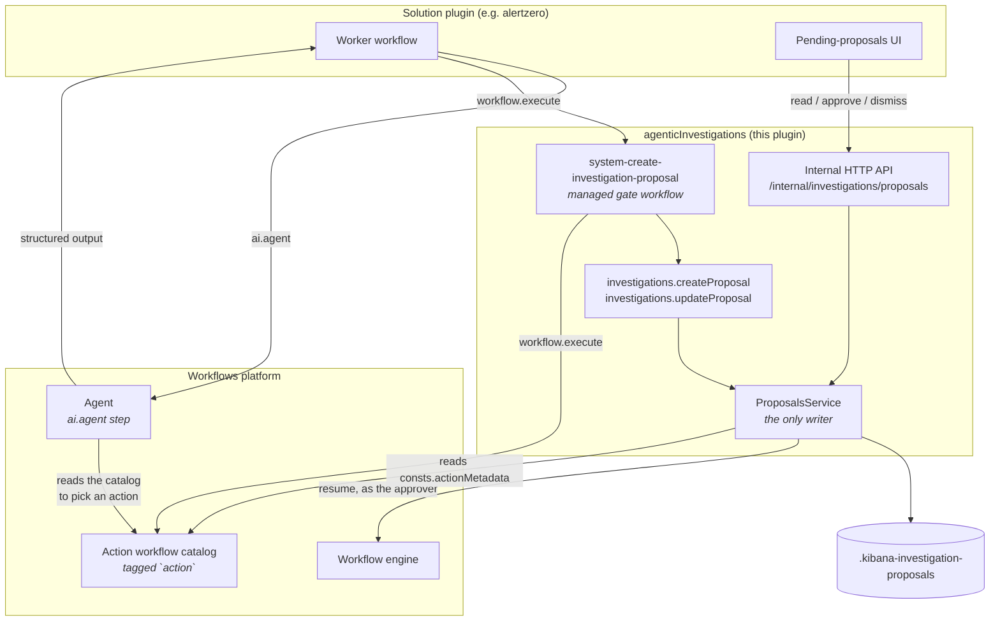
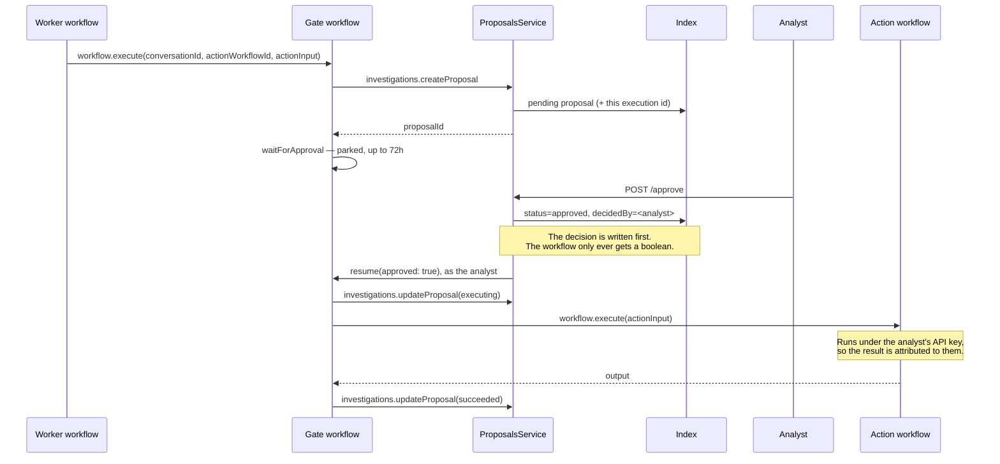

# Agentic investigations

Solution-agnostic base layer for the entities an agent and a human collaborate on. It owns their storage, their API, and their workflow steps, so a Worker in any solution can create them and any solution's UI can act on them.

Today it holds two entities: **proposals** and **incidents**. **Investigations** are next, which is why the plugin is an umbrella rather than one plugin per entity.

Consumed by AlertZero (Security) and intended for Nightshift (Observability). Nothing in this plugin is solution-specific.

## What belongs here, and what does not

This layer owns the record, the decision, and the guarantee that an approved action runs **as the approver**. It does not decide what to propose, when to propose it, or whether autonomy allows skipping the human gate — a Worker does all three.

## Entity directories

Every entity gets the same three homes, and nothing entity-specific lives above them:

```
common/
  constants.ts           umbrella: plugin id, API version, route base, workflow owner id
  index.ts               umbrella barrel, re-exports each entity barrel
  proposals/             constants, schemas, step definitions shared with the browser
server/
  plugin.ts config.ts types.ts
  features.ts            umbrella feature and its privileges
  proposals/             routes, services, step handlers, storage, managed workflows
public/
  plugin.ts index.ts types.ts
  proposals/             browser step definitions for the YAML editor
```

Adding an entity means adding a directory in each of the three, an entity barrel, its privileges in `features.ts`, and a getter on the start contract. It should not require restructuring the umbrella itself.

## Privileges

One Kibana feature, `agenticInvestigations`, shown in the Roles and Spaces pickers as **Proposed Actions** — named for proposals alone because action proposals move to their own plugin in a follow-up. Both privileges are declared inline on the feature:

| Feature privilege | API | UI |
| ----------------- | ------------------------------------ | ------------------------------------ |
| `all`             | `read_proposals`, `manage_proposals` | `showProposals`, `decideProposals`   |
| `read`            | `read_proposals`                     | `showProposals`                      |

So `read` can see the queue but cannot decide it. The feature carries `minimumLicense: 'enterprise'`.

**Note:** `minimal_all` and `minimal_read` are **not** equivalent to `all` and `read`. Incidents landed as a sub-feature (see below), and sub-feature privileges are included in the base privilege levels through `includeIn: 'all'` / `includeIn: 'read'` — but `minimal_all` and `minimal_read` only grant sub-features marked `groupType: 'independent'` when the user holds them explicitly. Any new entity should follow the same pattern: put its capabilities in a sub-feature with `includeIn` rather than in additional inline privileges.

## Proposals

### Model

- A **proposal** is a recommendation awaiting a human decision. It lives in `.kibana-investigation-proposals` and points at the conversation it belongs to.
- An **action proposal** additionally references a managed **action workflow** (`actionWorkflowId`) plus its `actionInput`. Approving it runs that workflow.
- A **non-action proposal** carries only its `comment` — instructions the analyst carries out themselves before approving. It is always gated: autonomy governs whether an action may run unattended, and there is no action here to govern, so `autoApprove` is ignored.
- Proposals are immutable once decided, and are never tuned: changing an action means dismissing the proposal and creating a new one.

### Architecture



Two boundaries are worth stating outright. `ProposalsService` is the **only** writer of the index — the steps and the routes both go through it, and there is no second path. And the solution plugin owns no storage: it contributes a Worker and a UI, and reaches the record only through the HTTP API.

The Agent is where the action is chosen. A Worker spawns it with an `ai.agent` step; the agent reads the action catalog to see which actions exist and what each one takes, then returns structured output naming an `actionWorkflowId` and its `actionInput`. Neither this plugin nor the gate workflow decides which action is appropriate.

### Lifecycle



Dismissal follows the same shape and releases the gate down its negative branch, so no action runs. A gate timeout surfaces as a step failure with an `ExecutionError` of type `TimeoutError`; the workflow-level `on-failure` reads that type and lands the proposal on `dismissed` — a decision that never came, rather than a malfunction — while any other failure becomes `failed`.

### How a Worker creates a proposal

Call the gate workflow; do not write proposals directly.

```yaml
- name: propose_action
  type: workflow.execute
  with:
    workflow-id: system-create-investigation-proposal
    inputs:
      conversationId: '{{ steps.investigate.output.conversation_id }}'
      comment: 'Tune the noisy rule that produced this alert'
      actionWorkflowId: '{{ steps.suggest_action.output.structured_output.actionWorkflowId }}'
      actionInput: '${{ steps.suggest_action.output.structured_output.actionInput }}'
      impact: low
      confidence: medium
```

The input contract:

| Input | Required | Notes |
| --- | --- | --- |
| `conversationId` | yes | The conversation the proposal belongs to. |
| `comment` | yes | Markdown explaining what is being proposed. A proposal a human cannot read is not reviewable. |
| `actionWorkflowId` | no | Omit for a proposal the analyst carries out themselves. |
| `actionInput` | no | Passed to the action workflow as its single `actionInput` object. |
| `impact`, `confidence` | no | Snapshotted at creation; used for queue ordering. |
| `autoApprove` | no | See below. Defaults to `false`, so the gate is fail-closed. |

You get back `proposalId` and `status`.

**The decision deadline is a fixed 72h, not a caller input.** The workflow engine does not template-render a step's `timeout`; it hands the raw string to the duration parser, so `timeout: "{{ inputs.expiresIn }}"` fails at execution time ([#290258](https://github.com/elastic/kibana/issues/290258)). The gate timeout and the `expiresIn` recorded on the proposal are therefore both hardcoded to `72h` and must stay equal — otherwise the deadline the queue shows an analyst is not the one the gate enforces. The `investigations.createProposal` step still accepts `expiresIn`, so a caller driving that step directly can set its own deadline; only this gate workflow is pinned.

**`autoApprove` is for callers that already resolved autonomy.** This plugin has no autonomy policy of its own; a Worker that has decided the action is permitted without a human passes `autoApprove: true` and the gate is skipped — the proposal is still recorded, and the action still runs. Anything else leaves it unset. It applies only to action proposals: a proposal with no `actionWorkflowId` is always gated regardless of the flag.

**The calling workflow must itself be managed.** An unmanaged parent can neither execute a managed child nor see globally-installed definitions, so a Worker registered outside `@kbn/workflows/managed` cannot reach the gate.

Omitting an optional input is safe. A Liquid template for an absent input still renders — as `''` — so every optional step input is declared with `optionalStepInput`, which treats `''` and `null` as absent. Without it, `actionInput: '${{ inputs.actionInput }}'` on a non-action proposal would fail schema validation before the handler ran.

### Authoring an action workflow

An action workflow is an ordinary managed workflow that:

1. carries the `action` tag, so the catalog can be discovered by tag;
2. declares `consts.actionMetadata` (`name`, `category` — any keyword the owning solution chooses — and optionally `description`, `impact`, `reversible`, `approvalPolicy`) — metadata has to live under `consts`, because unknown top-level YAML keys are stripped by the workflow schema;
3. takes a **single `actionInput` object** as its input, so the generic gate workflow never needs to know an action's parameter names;
4. ends in `workflow.output`, because `workflow.execute` cannot type a child's result.

Rule 3 is the non-obvious one and the easiest to get wrong: the gate passes exactly one key, `actionInput`. An action that declares `name`, `query` and `index` as top-level inputs will receive none of them. Declare them as properties of `actionInput` instead, and mark the ones that define the action's scope `required` — a default that matches everything is a demo shortcut, not a catalog entry.

See `definitions/alertzero/actions/action_create_detection_rule.yaml` for a worked example.

### API

All routes are internal and versioned (`/internal/investigations/proposals`, version `1`):

- `POST /internal/investigations/proposals` — create
- `GET /internal/investigations/proposals` — list (filter by `status`, `conversationId`, `excludeExpired`; paged with `from` and `size`)
- `GET /internal/investigations/proposals/{id}` — read one, with action metadata resolved
- `POST /internal/investigations/proposals/{id}/approve` — approve, then release the gate
- `POST /internal/investigations/proposals/{id}/dismiss` — dismiss with a structured reason

Reads need `read_proposals`; both decisions need `manage_proposals`. There is deliberately **no update route** — `status` is a consequence of deciding and executing, never something a caller sets.

### Invariants worth preserving

- **The decision is written before the workflow is resumed.** The gate only ever receives a boolean, so the record is the durable channel for what was decided.
- **The gate step is resolved explicitly.** The platform's waiting-step lookup only matches `waitForInput`; for a `waitForApproval` gate it returns nothing and would resume *without* claiming the step or stamping the audit envelope. `resumeGate` finds the step itself and passes `stepExecutionId`.
- **The decision actor is server-derived.** Never accepted from a request body. `createdBy` and `decidedBy` store `{ username, fullName, email, profileUid? }`, the shape Cases established: the profile uid is the stable identity a UI resolves an avatar from, and the names are stored rather than looked up so attribution survives a missing profile. The uid is genuinely often absent — security disabled, a `run-as` proxy, a session without a profile, or an API key whose creator has no activated profile, which is exactly what the resume path runs under.
- **Approval carries the action input the approver was shown**, so an approval that no longer matches the record is refused with a conflict.
- **Action metadata is resolved on read** from the action workflow's `consts.actionMetadata`, never copied onto the proposal, so a catalog change is picked up rather than going stale. `impact` is the exception: it is intrinsic to the action, so it is snapshotted from the metadata at creation.
- **`actionInput` is validated at creation**, against the schema the action declares on its manual trigger, so a proposal that could never run never reaches a human. Best-effort: the JSON Schema to zod conversion does not cover every keyword.
- **The queue's order lives in Elasticsearch.** `impact` and `confidence` are keywords, which sort alphabetically, so each is mirrored by a numeric rank written at creation. That is what makes the list pageable rather than capped at one fetch; the ranks are stripped before a proposal leaves the service.
- **`category` is an arbitrary keyword this plugin does not own.** Each solution defines the vocabulary its own actions declare and its own queries group by — AlertZero's set is not NightShift's — so there is no shared enum and no default to fall back on. It is absent on a proposal that carries no action. Consumers group and aggregate on it; nothing sorts on it, and which category is displayed first is a UI decision rather than a stored rank.

## Managed workflows

The plugin calls `registerManagedWorkflowOwner` in `setup()` and passes the same id to `initManagedWorkflowsClient`. Both must equal the `pluginId` on every definition it owns, or `assertPluginRegistration` throws on install.

Registering the owner is not optional. The startup sweep `cleanupUnregisteredOrphans` force-deletes any managed workflow whose `managedBy` is not in the setup-time owner registry, so an unregistered owner gets its own workflows deleted on every boot, racing its installs.

## Index naming

`.kibana-investigation-proposals` is permanent. `.kibana*` is already granted to the `kibana_system` role, so the index needs no Elasticsearch-side system index registration — a dedicated prefix such as `.investigation-proposals` would. `anonymization` ships `.kibana-anonymization-profiles` on the same reasoning. Each entity gets its own index rather than one index discriminated by a type field. **Incidents are the documented exception:** they live in Agent Builder's `.chat-conversations` index (a conversation with `template_id: 'incident'`), and this plugin owns no storage for them. The reasons are: (a) Agent Builder's conversation model already provides everything an incident needs — metadata, access control, space scoping, OCC writes; (b) adding an incidents index would duplicate that infrastructure for no benefit; (c) the visibility and collaborator model that agents and investigations already use must apply to incidents for free. Any future entity that fits the conversation model should do the same rather than adding an index by default.

## Manual verification

The point of the exercise is the identity behaviour: a rule created by an approved action should be attributed to the **approving analyst**, not to whoever started the Worker. When a workflow parked on `waitForApproval` is resumed through the in-Kibana resume path, the engine schedules a fresh task with an API key granted on the resumer's behalf, and that identity propagates into child workflows.

**Prerequisites** — all four are load-bearing, and the identity behaviour degrades silently without them:

- **This plugin enabled** (`xpack.agenticInvestigations.enabled: true`). It is **off by default**, so without this the routes 404 and AlertZero's proposals panel renders its load error rather than a queue.
- **Security enabled.** With security off no API key is stored, the resume task gets no fake request, and the resume fails outright.
- **Encrypted Saved Objects configured** (`xpack.encryptedSavedObjects.encryptionKey`). Scheduling a task with an API key throws without it.
- **API keys enabled** in Elasticsearch.

**Privileges on the approving user:**

- `all` on **Proposed Actions** — to decide.
- Security → **Rules** `all` (`rules-all`) — the rule is created under *their* credentials. Worth exercising deliberately: an approver **without** it should see the proposal reach `failed`, not `succeeded`. That failure is the model working as designed.
- `workflowsManagement` execute — the resume route rides on `execute` until step-level privileges land ([#19134](https://github.com/elastic/security-team/issues/19134)).

**Steps:**

1. Start Kibana. On start this plugin installs `system-create-investigation-proposal` globally, and `alertzero` installs `system-alertzero-action-create-rule` and `system-alertzero-action-edit-rule`. Confirm all three appear in Workflows management, and that the log contains no `orphan_cleanup` deletion for them.
2. Trigger the gate workflow directly with `conversationId`, `actionWorkflowId: system-alertzero-action-create-rule`, and an `actionInput` carrying `name`, `description`, `query` and `index`.
3. Confirm the record: `GET .kibana-investigation-proposals/_search` should show `status: pending`, `category: tune`, the `actionWorkflowId`, and a `workflowExecutionId` pointing at a gate execution that is `waiting_for_input`.
4. Approve from the AlertZero app (`/app/alertzero`) — under "Awaiting your decision" on the landing page, or the investigation's Proposals tab.
5. Assert the outcome: the proposal reaches `succeeded`; a **disabled** rule with that name exists (`security.createRule` always creates rules disabled); **`created_by` on the rule is the approver**, not whoever triggered the gate; and the `waitForApproval` step execution carries `hitl.respondedBy`.
6. Repeat in a non-default space. Space scoping is invisible in `default`: every query filters on `spaceId`, and a missing filter would only show up elsewhere.

**Also worth exercising:** dismissal with a reason (reaches `dismissed`, records `dismissReason` and `rationale`, creates no rule); first-actor-wins (approve from two sessions at once — one `200`, one `409`, action runs once); a gate timeout (shorten the gate timeout and let it expire — the workflow-level `on-failure` should move the proposal to `dismissed`, not `failed`); and a non-action proposal created through the API with a `comment` and no `actionWorkflowId`, which should terminate at `approved` without executing anything.

## Known limitations

- **Deep paging stops at 10,000.** The list pages with `from`/`size` inside Elasticsearch's default result window. Going past that needs `search_after`, which the list does not expose yet.
- **`.kibana-*` index naming** buys us out of a system index registration, at the cost of living in a namespace we do not own.
- **No Scout API coverage yet.** The HTTP surface is covered by Jest only, as `anonymization` shipped.
- **Two entities, umbrella seams exercised.** Proposals and incidents both exist. The directory convention holds across both.

## Incidents

### Model

An **incident** is a durable, shareable record that an analyst creates when a collection of investigations warrants formal escalation. Unlike proposals — which live in a bespoke index — incidents live in Agent Builder's `.chat-conversations` index as conversations with `template_id: 'incident'`. That choice buys the full conversation stack: OCC-safe metadata writes, access control, space scoping, and Agent Builder's conversation template validation.

`IncidentsService` is a thin orchestration façade over `agentBuilder.conversations.getScopedClient({ request })`. It owns no Elasticsearch client and no index.

### Privileges

Incidents use an `incidents` sub-feature on the `agenticInvestigations` Kibana feature:

The `incidents` sub-feature uses a `mutually_exclusive` privilege group, so a user receives exactly one of:

| Sub-feature privilege | API | UI |
| --- | --- | --- |
| `incidents_all` (included in `all`) | `read_incidents`, `manage_incidents` | `showIncidents`, `manageIncidents` |
| `incidents_read` (included in `read`) | `read_incidents` | `showIncidents` |

### API

All routes are internal and versioned (`/internal/investigations/incidents`, version `1`):

- `GET /internal/investigations/incidents` — list non-closed incidents the caller can access; needs `read_incidents`
- `POST /internal/investigations/incidents` — create an incident from a linked investigation; needs `manage_incidents`
- `PATCH /internal/investigations/incidents/{id}` — update title or append linked investigations; needs `manage_incidents`

### Create behaviour

`POST` takes `{ linked_investigation_id, visibility, collaborators? }`. The handler:

1. Fetches the investigation through the caller's scoped client — this enforces that the caller can see the investigation they are escalating.
2. Validates that the target is an `investigation` conversation (throws a `400` otherwise).
3. Resolves the incident template's declared fields at runtime via `agentBuilder.conversationTemplates.get('incident')`.
4. Copies the intersection of the investigation's metadata and those declared fields, **excluding `status`** (so the incident opens with `status: 'open'` from the template default) and **excluding `linked_investigations`** (set separately to `[linked_investigation_id]`). This filter is what prevents a `400` from `workflow_execution_id`, which is declared on the investigation template but not on the incident template.
5. Creates the conversation with `templateId: 'incident'` and no explicit `agentId` — the default agent is used, so collaborators can always see the incident regardless of their access to the investigation's agent.

### List behaviour

`GET` accepts optional `page` and `per_page` query parameters (defaults: `page=1`, `per_page=50`; maximum `per_page=50`; `page * per_page` must not exceed `10,000`). It returns:

```json
{
  "pagination": { "total": 42, "page": 1, "per_page": 50 },
  "results": [ /* ConversationWithoutRoundsWithPermissions */ ]
}
```

The filter is **fixed and server-side**: `template_id: "incident" and not metadata.status: "closed"`. A few things to note:

- The filter uses `metadata.status`, not the bare `status` field. The bare `status` maps to the
  conversation-level `ConversationRoundStatus` (`in_progress`/`completed`/…); the incident
  open/closed state lives in the template metadata.
- `not metadata.status: "closed"` keeps documents where the field is absent, so a freshly created
  incident (whose metadata carries `status: "open"` from the template default) always appears.
- Access filtering is inherited from Agent Builder's `buildReadAccessFilter`: a caller sees public
  incidents, their own incidents, and private incidents they are listed in. No access control needs
  to be written in this plugin.
- Results are sorted `updated_at desc` (newest-first) with a `created_at` tiebreaker, which is the
  `client.search()` default when no explicit sort is requested.
- Results include no round data (`_source` is `CONVERSATION_LIST_SOURCE_FIELDS`). The response type
  is `IncidentConversationSummary` (`ConversationWithoutRoundsWithPermissions`), which is distinct
  from `IncidentConversation` (the create/update response that includes rounds).

### MVP limitations

- **Owner-only writes.** `patchMetadata` and `update` in Agent Builder are `access: 'owner'`. This conflicts with the epic requirement that participants can link further investigations. A follow-up is needed to widen the access check in Agent Builder's authorization layer.
- **Last-write-wins on concurrent appends.** The array union for `linked_investigations` is computed in the service (outside the OCC write callback), so two concurrent `PATCH` requests can each read stale state and one link can be silently lost. The fix is to move the union computation into `writeConversation`'s `fields` callback. Accepted for MVP; follow-up filed.
- **List caps at 10,000 results.** Offset pagination cannot go beyond Elasticsearch's default result window. Incidents beyond that threshold are unreachable through this API. `search_after` would be needed for deeper paging.
- **Closed incidents are never returned.** The `status: "closed"` filter is not toggleable. A separate endpoint or a future filter parameter would be needed to retrieve closed incidents.
