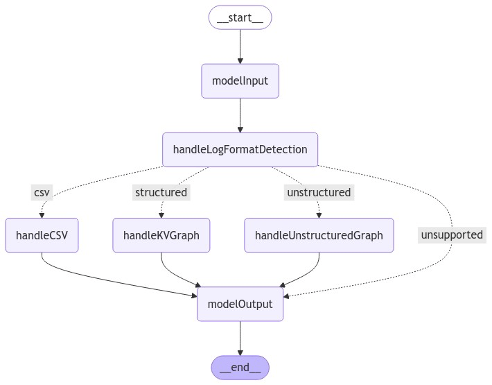
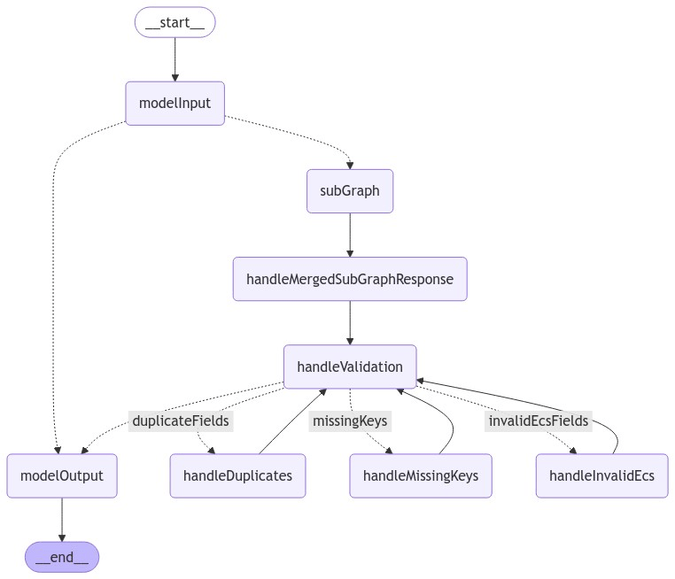
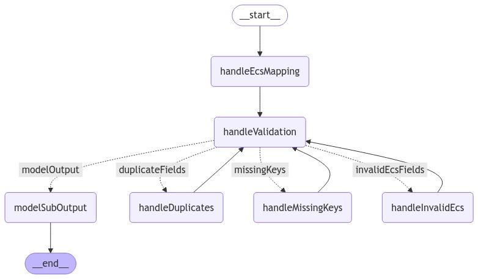
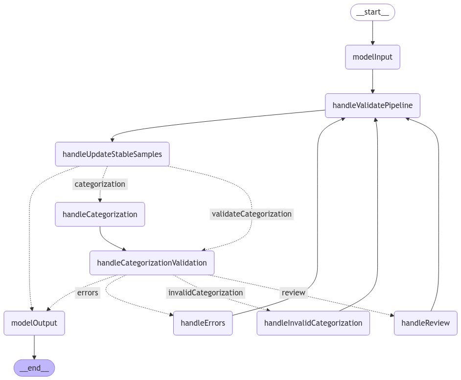
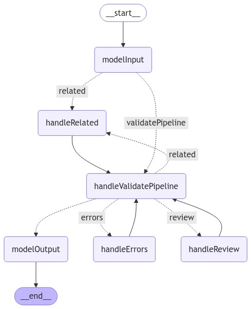

# Automatic Import

## Overview

Team owner: Security Integrations Scalability

This is a new Kibana plugin created to help users with automatically generating integration packages based on provided log samples and relevant information

## Features

Exposes 4 API's that can be consumed by any frontend plugin, which are:

- ECS Mapping API
- Categorization API
- Related Fields API
- Build Integration API
- Optional Test Pipeline API (Used to update pipeline results if the ingest pipeline is changed by a user in the UI).

## Development

### Backend

#### Overview

The backend part of the plugin utilizes langraph extensively to parse the provided log samples and generate the integration package.

One instance of langraph is created that will include one or more `nodes` in which each node represents a step in the integration package generation process.

Each node links to a specific function, usually a `handler` specified in its own file under each graph folder that will be executed when the node is reached.

#### Structure

**Graphs**

The graph components are split into logical parts and are placed in separate folders for each graph under the `./server/graphs` directory.

Each graph folder needs to contains at least one `graph.ts`, which exports a function that returns the compiled graph object.

Each exported graph function is then linked up to one or more API routes.

**Routes**

All routes are defined under `./server/routes` in its own file, and then included in the `./server/routes/register_routes.ts` file.

**Integration Builder**

The integration builder is the last step in the expected API flow (ECS Mapping -> Categorization -> Related Fields -> Integration Builder).
With the provided package and data stream details, an optional logo and a list of sample logs, the API will build out the entire folder structure and files required for the integration package, archive it and return it as a `Buffer`.

**Templates**

Currently the templates are stored as `nunjucks` files as they were converted from `jinja2` templates, which use the exact same format. Longer term this will most likely be switched to the Kibana forked Handlebars templating engine.

The templates are stored in the `./server/templates` directory and are used to generate the integration package files while running the Integration Builder API.

One template (pipeline.yml.njk) is used by the ECS Mapping API to generate the boilerplate ingest pipeline structure we want to use for all generated integrations.

#### Flows

Generated by running `yarn draw-graphs` inside the root of the plugin folder.

**First graph:**
**Log Format Detection:**


**Second graph, main:**
**ECS Main:**


**Second graph, sub:**
**ECS Sub:**


**Third graph:**
**Categorization:**


**Fourth graph:**
**Related:**


## Tests

All mocks/fixtures are placed in the top `./__jest__` directory of the plugin. If many mocks/fixtures are required, try to split them up into separate file(s).

Tests can be run with:

```bash
node scripts/jest x-pack/platform/plugins/shared/automatic_import/ --coverage
```
