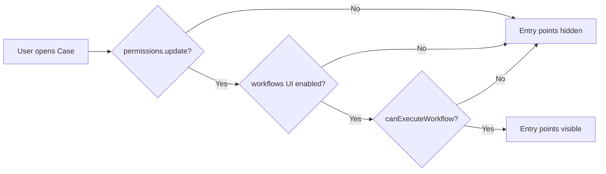

# Run Workflows from Cases — Architecture & Design

**Epic:** [security-team#17213](https://github.com/elastic/security-team/issues/17213)

**Related:** [kibana#199807](https://github.com/elastic/kibana/issues/199807) (observable-level automation)

**Generic context design:** [Context-aware workflow executions](../../../../../../src/platform/plugins/shared/workflows_management/dev_docs/context_aware_workflow_executions.md)

---

## Overview

This change adds three complementary capabilities to the Cases plugin:

| # | Capability | Entry point |
|---|---|---|
| 1 | **Case-level "Run workflow"** | Case detail header (redesign) + case action bar (legacy) |
| 2 | **Observable-level "Run workflow"** | Observable row `⋯` context menu → sub-panel |
| 3 | **Alert-level "Run workflow"** | Alerts tab row or bulk action → sub-panel |
| 4 | **`cases.observablesAdded` auto-trigger** | Fires automatically when observables are added to a case |

Capabilities 2 and 4 share **one event schema**, so a workflow authored for the auto-trigger runs identically when invoked manually from a row — the event payload is byte-identical in both paths.

Manual runs also use the generic workflow execution-context contract. Case-level entry points use `cases.case`; observable and attachment-owned entry points use a specific origin such as `cases.observable` or `cases.alert` with `cases.case` as parent. This supports both exact origin history and one case-wide execution history.

---

## Plugin Layering Constraint

Kibana enforces strict visibility rules between plugin groups. Cases is `platform/shared` and Security Solution is `solutions/security`. A shared plugin **cannot** import from a solution plugin.

The `RunWorkflowPanel` component originally lived in `security_solution`. Moving it to `@kbn/workflows-ui` (`platform/shared`) makes it available to Cases without introducing a layering violation.

```
┌────────────────────────────────────────────────────┐
│                  solutions/security                 │
│  SecuritySolution ──imports── @kbn/workflows-ui ✓  │
└────────────────────────────────────────────────────┘
         ↕  NOT allowed (solution → shared only)
┌────────────────────────────────────────────────────┐
│                  platform/shared                    │
│  Cases ──────────imports── @kbn/workflows-ui ✓     │
│  @kbn/workflows-ui  (RunWorkflowPanel lives here)  │
└────────────────────────────────────────────────────┘
```

All callers — in both `security_solution` and `cases` — import `RunWorkflowPanel`, `RunWorkflowInputsModal`, and `requiresUserSuppliedInputs` **directly from `@kbn/workflows-ui`**. The old local files in `security_solution/timeline_actions/` have been deleted.

Context-specific server behavior is registered through `workflowsExtensions`; `workflows_management` does not import Cases. This is the same dependency-inversion pattern used for custom workflow steps and triggers.

---

## Component Architecture

### New shared package: `@kbn/workflows-ui/RunWorkflowPanel`

```
@kbn/workflows-ui
└── src/components/run_workflow_panel/
    ├── run_workflow_panel.tsx          ← Main component (was in security_solution)
    ├── run_workflow_inputs_modal.tsx   ← Manual-inputs modal
    ├── run_workflow_panel_helpers.ts   ← requiresUserSuppliedInputs()
    ├── translations.ts                ← i18n strings (xpack.workflowsUi.*)
    └── index.ts                       ← Public barrel
```

**Key prop changes from the original:**

| Old | New | Reason |
|---|---|---|
| `sortTriggerType: string` | `sortWorkflow?: (a, b) => number` | Consumers can rank workflows using domain-specific trigger rules |
| *(absent)* | `filterWorkflow?: (workflow) => boolean` | Supports case configuration such as available workflow tags |
| *(absent)* | `executionContext?: WorkflowExecutionContext` | Correlates UI and API runs with the same product entity |
| `useAppToasts()` | `useKibana().services.notifications.toasts` | Remove security_solution-specific hook dependency |

### Case-level entry points

```
Case detail page
├── [redesign]  CaseDetailsAppHeader
│               └── useCaseViewHeader
│                   ├── useRunCaseWorkflow()          ← hook
│                   ├── getMenu() → "Run workflow"    ← menu item
│                   └── <RunCaseWorkflowModal />      ← rendered in fragment
│
└── [legacy]    CaseActionBar / Actions
                ├── useRunCaseWorkflow()
                ├── propertyActions → "Run workflow"
                └── <RunCaseWorkflowModal />
```

`RunCaseWorkflowModal` is a thin `EuiModal` wrapper around `RunWorkflowPanel`:

```tsx
<EuiModal style={{ width: 400 }}>
  <EuiModalHeader>Select workflow</EuiModalHeader>
  <EuiModalBody>
    <RunWorkflowPanel
      inputs={{ event: { caseId, owner } }}
      executionContext={createCaseWorkflowExecutionContext(caseId)}
      sortWorkflow={sortCaseWorkflows}        // all 6 cases.* ids first
      filterWorkflow={filterCaseWorkflows}    // optional case config
    />
  </EuiModalBody>
</EuiModal>
```

### Observable-level entry point

`ObservableActionsPopoverButton` already used `EuiContextMenu` with `panels: EuiContextMenuPanelDescriptor[]`. The `content` field on a panel descriptor accepts arbitrary `ReactNode`, which is exactly how the alert table's `AlertWorkflowsPanel` works.

```
Observable row  →  ⋯ button  →  EuiPopover
                               └── EuiContextMenu
                                   ├── Panel 0 (main)
                                   │   ├── "Run workflow" → panel: RUN_OBSERVABLE_WORKFLOW_PANEL_ID
                                   │   ├── "Edit"
                                   │   └── "Delete"
                                   └── Panel "run-observable-workflow-panel"
                                       └── content: <RunWorkflowPanel
                                               inputs={{ event: { caseId, owner, observables: [row] } }}
                                               executionContext={createObservableWorkflowExecutionContext(row.id, caseId)}
                                               sortWorkflow={sortObservableWorkflows}
                                           />
```

This gives a native slide-in UX — no extra modal — consistent with how alert workflows are surfaced.

### Alert-level entry point

The Security Solution alert attachment owns the alert table shown in a case. It wraps the generic table in an optional `AlertWorkflowExecutionContextProvider` rather than adding Cases behavior to the table itself. When an alert workflow panel renders, the provider combines the selected alert ID with the enclosing case ID:

```ts
{
  type: 'cases.alert',
  id: alertId,
  parent: { type: 'cases.case', id: caseId },
}
```

Alert tables outside Cases have no provider and continue to run without a Cases context. A multi-alert run uses `{ type: 'cases.alerts', id: caseId }` with the case as parent. This identifies the selected collection surface without falsely attributing the run to one alert; the exact alert IDs remain in the workflow inputs. For a single alert, the context handler copies the matching alert index from the processed workflow event into the activity origin. Security Solution supplies one optional `getCases` rendering callback that uses the existing **Show alert details** action when the index is available and **Show table** otherwise. Bulk alert activity always uses **Show table**.

---

## Modular Execution Context

Cases owns one vertical execution-context module; Workflows owns only the generic registry, storage, query, and dispatch contracts.

```text
cases/
├── common/workflows/execution_context/
│   ├── constants.ts
│   ├── context.ts
│   └── index.ts
└── server/workflows/execution_context/
│   ├── definition.ts
│   ├── register.ts
│   └── definition.test.ts
```

The common module is the single source of truth for context types and factories:

```ts
export const CASE_WORKFLOW_EXECUTION_CONTEXT_TYPE = 'cases.case' as const;
export const OBSERVABLE_WORKFLOW_EXECUTION_CONTEXT_TYPE = 'cases.observable' as const;
export const ALERT_WORKFLOW_EXECUTION_CONTEXT_TYPE = 'cases.alert' as const;
export const ALERTS_WORKFLOW_EXECUTION_CONTEXT_TYPE = 'cases.alerts' as const;
export const COMMENT_WORKFLOW_EXECUTION_CONTEXT_TYPE = 'cases.comment' as const;
export const ATTACHMENT_WORKFLOW_EXECUTION_CONTEXT_TYPE = 'cases.attachment' as const;

export const createCaseWorkflowExecutionContext = (
  caseId: string
): WorkflowExecutionContext & {
  type: typeof CASE_WORKFLOW_EXECUTION_CONTEXT_TYPE;
} => ({
  type: CASE_WORKFLOW_EXECUTION_CONTEXT_TYPE,
  id: caseId,
});

export const createObservableWorkflowExecutionContext = (
  observableId: string,
  caseId: string
): WorkflowExecutionContext => ({
  type: OBSERVABLE_WORKFLOW_EXECUTION_CONTEXT_TYPE,
  id: observableId,
  parent: createCaseWorkflowExecutionContext(caseId),
});
```

Cases callers use the matching factory rather than repeating string literals. Alert, comment, and generic attachment factories follow the same primary-plus-parent shape. The server registers the same definition behavior for every supported type:

```ts
for (const type of CASES_WORKFLOW_EXECUTION_CONTEXT_TYPES) {
  workflowsExtensions.registerExecutionContextDefinition(
    createWorkflowExecutionContextDefinition({
      type,
      onExecutionStarted: handleCaseWorkflowExecutionStarted,
    })
  );
}
```

The post-start handler resolves the case from either the primary `cases.case` context or the specific origin's parent, then calls a request-scoped `client.userActions.recordWorkflowExecution()`. The client authorizes case updates, resolves the stored owner, enforces the user-action limit, and persists a standalone user action with `type: 'workflow'` plus the exact origin type and ID. It may also copy minimal display and navigation fields from the processed workflow event: the alert index or the observable `typeKey` and `value`. It does not create an attachment or comment. The activity names the origin type and links the workflow name to the execution in a new tab. Observable details use the configured human-readable type label and value inline.

### Adding another Cases context

A distinct entity receives its own context type when it needs independent execution history:

1. Add a namespaced constant such as `cases.attachment`.
2. Add `createAttachmentWorkflowExecutionContext(attachmentId, caseId)`.
3. Add an optional server definition for attachment-specific follow-up.
4. Register it alongside `cases.case`.
5. Pass it to `RunWorkflowPanel` or the run API.
6. Add focused tests in the new context module.

Cases currently provides `cases.observable`, `cases.alert`, `cases.alerts`, `cases.comment`, and `cases.attachment`. Their `cases.case` parent means one case query still returns every run from within that case.

Other plugins follow the same module shape and register their own namespaced context definitions. A context that needs correlation only may omit `onExecutionStarted` entirely.

---

## Data Flow

### Manual "Run workflow" (both case-level and observable-level)

```
User clicks "Run workflow"
        │
        ▼
useRunCaseWorkflow / inline canRunWorkflow check
  - permissions.update ✓
  - workflowUIEnabled  ✓  (useWorkflowsUIEnabledSetting)
  - canExecuteWorkflow ✓  (useWorkflowsCapabilities → application.capabilities)
        │
        ▼
RunWorkflowPanel renders WorkflowSelector
        │
User selects a workflow and clicks "Run"
        │
        ▼
RunWorkflowPanel.executeWorkflow()
        │
        ├─► POST /api/workflows/workflow/{id}/run
        │       body: {
        │         inputs: { event: { caseId, owner, [observables] } },
        │         executionContext: {
        │           type: 'cases.observable',
        │           id: observableId,
        │           parent: { type: 'cases.case', id: caseId }
        │         }
        │       }
        │
        ├─► Workflows persists the indexed execution context
        ├─► Cases context handler adds origin-aware case activity
        │
        └─► onSuccess: notifications.toasts.addSuccess("Workflow successfully started")
                       navigate to execution (deep link via application.navigateToApp)
```

The browser sends the event payload **inline** — there is no server-side hydration step. Cases follows the **document** flow (`use_run_document_workflow_panel`), not the alert flow (which preprocesses alert data server-side).

Direct API callers send the same `executionContext` and therefore receive the same server-side case activity behavior. The context can be used to list all case executions:

```http
GET /api/workflows/workflow/executions?contextType=cases.case&contextId={caseId}
```

The same endpoint can query one exact origin, for example `contextType=cases.observable&contextId={observableId}`. Parent matching makes the case query include both direct case runs and specific child origins.

If the case activity follow-up fails after the workflow starts, the response retains `workflowExecutionId` and reports a failed follow-up status. Callers must not retry the workflow run solely because the activity write failed.

### Auto-trigger: `cases.observablesAdded`

```
HTTP PUT /cases/{id}/observables   (addObservable)
HTTP POST /cases/{id}/observables  (applyObservablesToCase)
        │
        ▼
server/client/cases/observables.ts
  applyObservablesToCase():
    ├── fetchCurrentObservables()
    ├── processObservables() → dedup by typeKey+value
    ├── if (newObservablesCount <= 0) return;  ← idempotency guard
    ├── saveObservables()
    ├── writeUserAction()
    └── emitObservablesAddedEvent(clientArgs, theCase, newlyAddedObservables)
              │
              ▼
        CasesEventBus.emitObservablesAdded(request, payload)
              │
              ▼
        event_bridge.ts:
          casesEventBus.onObservablesAdded(event =>
            forward('cases.observablesAdded', event.payload, event.request)
          )
              │
              ▼
        workflowsExtensions.getClient(request).emitEvent(...)
              │
              ▼
        Workflows engine evaluates matching triggers
        → executes subscribed workflows
```

**Idempotency guard:** The `if (newObservablesCount <= 0) return` in `applyObservablesToCase` means re-extracting the same observables (e.g. the auto-extract setting running on every case update) fires **no** event — preventing spurious workflow re-runs.

---

## Event Schema: `cases.observablesAdded`

The trigger is the 6th `cases.*` event trigger, added alongside the existing five:

```
cases.caseCreated
cases.caseUpdated
cases.caseStatusUpdated
cases.attachmentsAdded
cases.commentsAdded
cases.observablesAdded   ← NEW
```

Schema (Zod, defined in `common/workflows/triggers/index.ts`):

```ts
const observablesAddedEventSchema = baseCaseEventSchema.extend({
  // baseCaseEventSchema provides: caseId (string), owner (Owner enum)

  observables: z.array(
    z.object({
      id:          z.string(),
      typeKey:     z.string(),   // e.g. "ip", "domain", "hash"
      value:       z.string(),   // the observable value
      description: z.string().nullable().optional(),
    })
  ),
});
```

This schema is shared by **both** the auto-trigger and the manual observable-level run. A workflow step author writes `{{ event.observables[0].value }}` and it resolves identically whether the workflow started automatically or was manually triggered from a row.

---

## RBAC Gating

All three entry points use the same three-part gate:

```
canRunWorkflow = permissions.update        // Cases "update case" privilege
              && workflowUIEnabled         // xpack.workflows.ui.enabled setting
              && canExecuteWorkflow        // workflowsManagement feature: "workflow_execute"
```

`permissions.update` covers observables (there is no separate observable privilege — they ride `Operations.updateCase` plus the Platinum license gate enforced server-side).



---

## Trigger Registration

The client and server each register triggers independently via `workflowsExtensions`.

### Server (synchronous, at plugin start)

```
cases/server/workflows/triggers/index.ts
  registerCaseWorkflowTriggers(workflowsExtensions)
    └── workflowsExtensions.registerTriggerDefinition(
          observablesAddedTriggerCommonDefinition
        )
```

### Client (lazy, on first use)

```
cases/public/workflows/triggers/index.ts
  registerCasesTriggerDefinitions(workflowsExtensions)
    └── workflowsExtensions.registerTriggerDefinition({
          id: 'cases.observablesAdded',
          loadDefinition: () => import('./observables_added'),
        })
```

The lazy pattern avoids loading the trigger icon/description until the workflow selector opens.

---

## Sequence Diagrams

### Manual observable workflow run

```
User                  ObservableActionsPopoverButton   RunWorkflowPanel   WorkflowsAPI
 │                            │                              │                  │
 │──click ⋯─────────────────►│                              │                  │
 │                            │  open EuiContextMenu panel 0│                  │
 │──click "Run workflow"──────│──────────────────────────►panel 1 (RunWorkflowPanel)
 │                            │                              │                  │
 │                            │                              │─useWorkflows()──►│
 │                            │                              │◄────results──────│
 │                            │                              │                  │
 │──select workflow───────────────────────────────────────►setSelectedId        │
 │──click "Run"───────────────────────────────────────────►executeWorkflow()    │
 │                            │                              │──POST /run───────►│
 │                            │                              │◄──executionId─────│
 │◄──success toast────────────────────────────────────────────                  │
 │                            │                              │(onClose → popover closes)
```

### Auto-trigger on observable add

```
Client              Cases Server             EventBus          WorkflowsExtensions
  │                      │                      │                      │
  │──PUT /observables────►│                      │                      │
  │                      │ applyObservablesToCase│                      │
  │                      │  [dedup + idempotency]│                      │
  │                      │──emitObservablesAdded►│                      │
  │                      │                      │──onObservablesAdded──►│
  │                      │                      │                       │──forward('cases.observablesAdded')
  │                      │                      │                       │  → workflow engine evaluates
  │◄──200 OK─────────────│                      │                       │
```

---

## File Map

### New files

```
src/platform/packages/shared/kbn-workflows-ui/src/components/run_workflow_panel/
  ├── run_workflow_panel.tsx           Component (promoted from security_solution)
  ├── run_workflow_panel.test.tsx      19 unit tests
  ├── run_workflow_inputs_modal.tsx    Manual inputs modal
  ├── run_workflow_panel_helpers.ts   requiresUserSuppliedInputs()
  ├── translations.ts                 i18n (xpack.workflowsUi.runWorkflowPanel.*)
  └── index.ts                        Barrel exports

x-pack/platform/plugins/shared/cases/public/components/workflows/
  ├── use_run_case_workflow.tsx        RBAC gate + modal state + inputs
  ├── run_case_workflow_modal.tsx      EuiModal wrapping RunWorkflowPanel
  └── translations.ts                 RUN_WORKFLOW, SELECT_WORKFLOW_TITLE

x-pack/platform/plugins/shared/cases/public/workflows/triggers/
  └── observables_added.ts            Client-side trigger definition (lazy)

x-pack/platform/plugins/shared/cases/server/client/cases/
  └── observables_trigger_utils.ts    emitObservablesAddedEvent() helper

x-pack/platform/plugins/shared/cases/common/workflows/execution_context/
  ├── constants.ts                    Stable case, observable, alert, comment, and attachment types
  ├── context.ts                      Typed primary-plus-parent context factories
  └── index.ts                        Explicit exports

x-pack/platform/plugins/shared/cases/server/workflows/execution_context/
  ├── definition.ts                   Cases post-start handler
  ├── register.ts                     workflowsExtensions registration
  └── definition.test.ts              Authorization + activity tests
```

### Key modified files

```
@kbn/workflows-ui
  src/components/run_workflow_panel/run_workflow_panel.tsx
    • sortWorkflow?: (a, b) => number
    • filterWorkflow?: (workflow) => boolean
    • executionContext?: WorkflowExecutionContext
    • notifications.toasts instead of useAppToasts  (deps cleanup)
  tsconfig.json → added @kbn/react-kibana-mount

cases/common/workflows/triggers/index.ts
    • ObservablesAddedTriggerId = 'cases.observablesAdded'
    • observablesAddedEventSchema (Zod)
    • observablesAddedTriggerCommonDefinition

cases/server/events/
    event_bus.ts       → emitObservablesAdded(), onObservablesAdded()
    types.ts           → ObservablesAddedEventPayload

cases/server/workflows/triggers/
    index.ts           → register observablesAddedTriggerCommonDefinition
    event_bridge.ts    → bridge casesEventBus → workflowsExtensions

cases/server/client/cases/observables.ts
    → emit after successful add/apply, inside idempotency guard

cases/public/components/observables/observable_actions_popover_button.tsx
    → canRunWorkflow gate + workflowInputs memo + EuiContextMenu sub-panel

cases/public/components/cases_redesign/.../hooks/use_case_view_header.tsx
    → useRunCaseWorkflow + runWorkflowModal JSX

cases/public/components/cases_redesign/.../utils/header_menu.ts
    → "Run workflow" item at order 150

cases/public/components/case_action_bar/actions.tsx
    → useRunCaseWorkflow + RunCaseWorkflowModal

security_solution/.../timeline_actions/
    run_workflow_panel.tsx           → DELETED (import from @kbn/workflows-ui directly)
    run_workflow_inputs_modal.tsx    → DELETED (import from @kbn/workflows-ui directly)
    run_workflow_panel_helpers.ts   → DELETED (import from @kbn/workflows-ui directly)
    use_run_alert_workflow_panel.tsx → sortWorkflow/filterWorkflow, imports RunWorkflowPanel from @kbn/workflows-ui
    use_run_document_workflow_panel.tsx → sortWorkflow/filterWorkflow, imports RunWorkflowPanel from @kbn/workflows-ui
```

---

## Test Architecture

Tests were split to respect package boundaries:

```
kbn-workflows-ui/.../run_workflow_panel.test.tsx   [NEW — 19 tests]
  ↑ Owns: render, execute, mutate, toasts, manual inputs, visibility

cases/.../observable_actions_popover_button.test.tsx  [EXTENDED — +4 tests]
  ↑ Owns: canRunWorkflow gating (3 negative cases), sub-panel navigation

cases/.../use_run_case_workflow.test.tsx              [existing — unchanged]
  ↑ Owns: hook return values, RBAC gating for case-level

security_solution/.../run_workflow_panel.test.tsx     [REPLACED — 2 smoke tests]
  ↑ Just confirms re-export is defined (real tests moved to kbn-workflows-ui)

security_solution/.../use_run_alert_workflow_panel.test.tsx  [TRIMMED]
  ↑ Retains: hook return values, RBAC gating, panel rendering smoke test
  ↓ Removed: RunWorkflowPanel behavior tests (now in kbn-workflows-ui)

security_solution/.../use_run_document_workflow_panel.test.tsx  [TRIMMED — same]
```

**Rationale:** Testing `AlertWorkflowsPanel` + `RunWorkflowPanel` internals from `security_solution` required re-implementing the component in the mock factory (fragile). Moving the component tests to `kbn-workflows-ui` lets them mock the package's own internal hooks cleanly.

---

## Pending Work

| Phase | Description | Status |
|---|---|---|
| Phase 4 | Workflow tag filtering case setting (`workflowTags: string[]` in case config) | Implemented |
| Phase 5 | Activity log entry (`workflow` user action type) | Implemented |
| Phase 6 | EBT telemetry (`CASE_WORKFLOW_RUN_TRIGGERED_EVENT_TYPE`) | Not started |
| — | Compute real `schemaHash` for `cases.observablesAdded` in the approval fixture | Needs server run + @elastic/workflows-eng review |
| — | Implement generic indexed `executionContext` + modular context registry | Implemented |

The workflow tag setting is owner- and space-scoped and defaults to `Cases`. Workflows that match
any configured tag are available in the top-level case workflow selector; workflows without a
matching tag are hidden. Tag matching is exact and case-sensitive. An explicitly empty setting
disables tag filtering and shows all workflows.
| — | Register Cases context types and use specific origin factories from manual entry points | Implemented |
