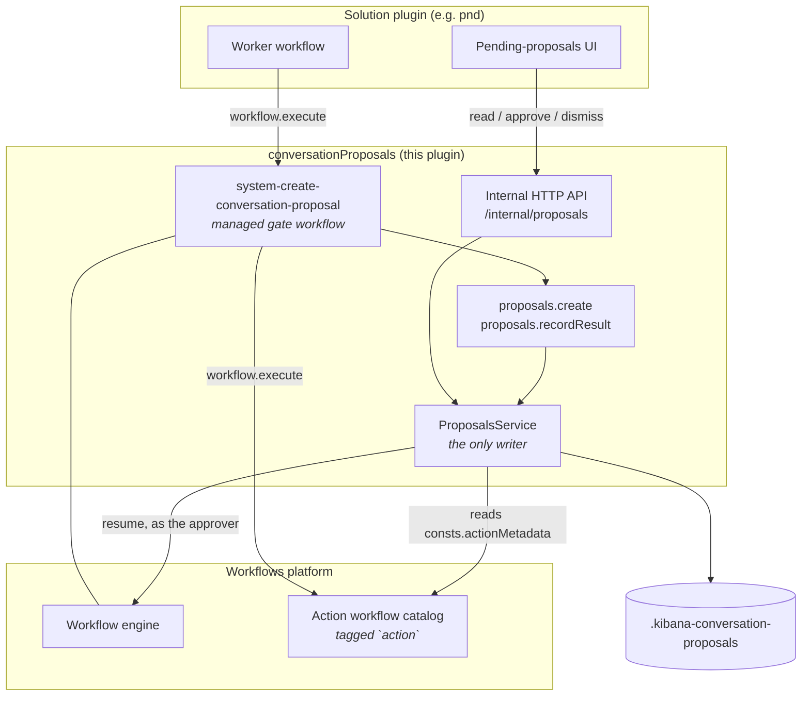
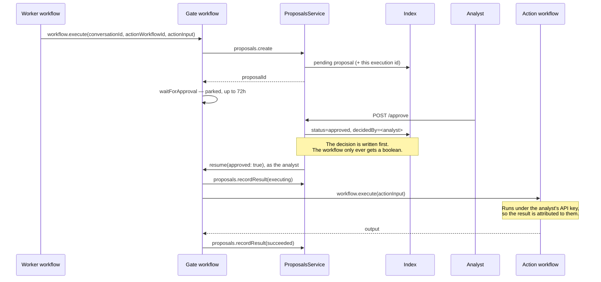

# Conversation proposals

Solution-agnostic storage, API and workflow steps for **proposals**: recommendations a system surfaces to a human, optionally carrying an executable **action**.

This is a base layer. It does not decide what to propose, when to propose it, or whether autonomy allows skipping the gate — a Worker does all three. What it owns is the record, the decision, and the guarantee that an approved action runs **as the approver**.

Consumed by AlertZero (Security) and intended for Nightshift (Observability). Nothing in this plugin is solution-specific.

## Model

- A **proposal** is a recommendation awaiting a human decision. It lives in `.kibana-conversation-proposals` and points at the conversation it belongs to.
- An **action proposal** additionally references a managed **action workflow** (`actionWorkflowId`) plus its `actionInput`. Approving it runs that workflow.
- A **non-action proposal** carries only a `comment` — instructions the analyst carries out themselves before approving.
- Proposals are immutable once decided, and are never tuned: changing an action means dismissing and creating a new proposal, optionally linked through `supersedesProposalId`.

## Architecture



Two boundaries are worth stating outright. `ProposalsService` is the **only** writer of the index — the steps and the routes both go through it, and there is no second path. And the solution plugin owns no storage: it contributes a Worker and a UI, and reaches the record only through the HTTP API.

## Lifecycle



Dismissal follows the same shape and releases the gate down its negative branch, so no action runs. A gate timeout surfaces as a step failure, which the workflow-level `on-failure` turns into `failed` rather than leaving the proposal pending forever.

## How a Worker creates a proposal

Call the gate workflow; do not write proposals directly.

```yaml
- name: propose_action
  type: workflow.execute
  with:
    workflow-id: system-create-conversation-proposal
    inputs:
      conversationId: '{{ steps.investigate.output.conversation_id }}'
      comment: 'Tune the noisy rule that produced this alert'
      actionWorkflowId: system-alertzero-action-create-rule
      actionInput: '${{ steps.investigate.output.rule_fields }}'
      impact: low
      confidence: medium
```

The input contract:

| Input | Required | Notes |
| --- | --- | --- |
| `conversationId` | yes | The conversation the proposal belongs to. |
| `comment` | no | What is being proposed. The only content a non-action proposal carries. |
| `actionWorkflowId` | no | Omit for a proposal the analyst carries out themselves. |
| `actionInput` | no | Passed to the action workflow as its single `actionInput` object. |
| `impact`, `confidence` | no | Snapshotted at creation; used for queue ordering. |
| `targetEntities` | no | Typed references (`host.name:web-01`) the queue's entity filter uses. |
| `expiresAt` | no | ISO 8601 decision deadline, evaluated on read. |
| `autoApprove` | no | See below. Defaults to `false`, so the gate is fail-closed. |

You get back `proposalId` and `status`.

**`autoApprove` is for callers that already resolved autonomy.** This plugin has no autonomy policy of its own; a Worker that has decided the action is permitted without a human passes `autoApprove: true` and the gate is skipped — the proposal is still recorded, and the action still runs. Anything else leaves it unset.

**The calling workflow must itself be managed.** An unmanaged parent can neither execute a managed child nor see globally-installed definitions, so a Worker registered outside `@kbn/workflows/managed` cannot reach the gate.

Omitting an optional input is safe. A Liquid template for an absent input still renders — as `''` — so every optional step input is declared with `optionalStepInput`, which treats `''` and `null` as absent. Without it, `actionInput: '${{ inputs.actionInput }}'` on a non-action proposal would fail schema validation before the handler ran.

## Authoring an action workflow

An action workflow is an ordinary managed workflow that:

1. carries the `action` tag, so the catalog can be discovered by tag;
2. declares `consts.actionMetadata` (`name`, `category`, and optionally `description`, `impact`, `reversible`, `approvalPolicy`) — metadata has to live under `consts`, because unknown top-level YAML keys are stripped by the workflow schema;
3. takes a **single `actionInput` object** as its input, so the generic gate workflow never needs to know an action's parameter names;
4. ends in `workflow.output`, because `workflow.execute` cannot type a child's result.

Rule 3 is the non-obvious one and the easiest to get wrong: the gate passes exactly one key, `actionInput`. An action that declares `name`, `query` and `index` as top-level inputs will receive none of them. Declare them as properties of `actionInput` instead, and mark the ones that define the action's scope `required` — a default that matches everything is a demo shortcut, not a catalog entry.

See `definitions/pnd/action_create_rule.yaml` for a worked example.

## Where things are

| What | Path |
| --- | --- |
| Schemas and constants shared with consumers | `common/` |
| Index mappings | `server/storage/proposals_storage.ts` |
| The only writer of the index | `server/services/proposals_service.ts` |
| Internal HTTP API | `server/routes/register_routes.ts` |
| Workflow step definitions (`proposals.create`, `proposals.recordResult`) | `common/step_types/`, `server/step_types/`, `public/step_types/` |
| The generic gate workflow | `@kbn/workflows/managed` → `definitions/conversation_proposals/` |

## API

All routes are internal and versioned (`/internal/proposals`, version `1`):

- `POST /internal/proposals` — create
- `GET /internal/proposals` — list (filter by `status`, `conversationId`, `targetEntity`)
- `GET /internal/proposals/{id}` — read one, with action metadata resolved
- `POST /internal/proposals/{id}/approve` — approve, then release the gate
- `POST /internal/proposals/{id}/dismiss` — dismiss with a structured reason

Reads need `proposals_read`; both decisions need `proposals_write`. There is deliberately **no update route** — `status` is a consequence of deciding and executing, never something a caller sets.

## Invariants worth preserving

- **The decision is written before the workflow is resumed.** The gate only ever receives a boolean, so the record is the durable channel for what was decided.
- **The gate step is resolved explicitly.** The platform's waiting-step lookup only matches `waitForInput`; for a `waitForApproval` gate it returns nothing and would resume *without* claiming the step or stamping the audit envelope. `resumeGate` finds the step itself and passes `stepExecutionId`.
- **The decision actor is server-derived.** Never accepted from a request body.
- **Approval carries the action input the approver was shown**, so an approval that no longer matches the record is refused with a conflict.
- **Action metadata is resolved on read** from the action workflow's `consts.actionMetadata`, never copied onto the proposal, so a catalog change is picked up rather than going stale.

## Index name

`.kibana-conversation-proposals` is permanent. `.kibana*` is already granted to the `kibana_system` role, so the index needs no Elasticsearch-side system index registration — a dedicated prefix such as `.conversation-proposals` would. `anonymization` ships `.kibana-anonymization-profiles` on the same reasoning.

## Manual verification

The point of the exercise is the identity behaviour: a rule created by an approved action should be attributed to the **approving analyst**, not to whoever started the Worker. When a workflow parked on `waitForApproval` is resumed through the in-Kibana resume path, the engine schedules a fresh task with an API key granted on the resumer's behalf, and that identity propagates into child workflows.

**Prerequisites** — all three are load-bearing, and the identity behaviour degrades silently without them:

- **Security enabled.** With security off no API key is stored, the resume task gets no fake request, and the resume fails outright.
- **Encrypted Saved Objects configured** (`xpack.encryptedSavedObjects.encryptionKey`). Scheduling a task with an API key throws without it.
- **API keys enabled** in Elasticsearch.

**Privileges on the approving user:**

- `proposals_write` (from the **Conversation proposals** feature) — to decide.
- Security → **Rules** `all` (`rules-all`) — the rule is created under *their* credentials. Worth exercising deliberately: an approver **without** it should see the proposal reach `failed`, not `succeeded`. That failure is the model working as designed.
- `workflowsManagement` execute — the resume route rides on `execute` until step-level privileges land ([#19134](https://github.com/elastic/security-team/issues/19134)).

**Steps:**

1. Start Kibana. On start this plugin installs `system-create-conversation-proposal` globally, and `pnd` installs `system-alertzero-action-create-rule`. Confirm both appear in Workflows management.
2. Trigger the gate workflow directly with `conversationId`, `actionWorkflowId: system-alertzero-action-create-rule`, and an `actionInput` carrying `name`, `description`, `query` and `index`.
3. Confirm the record: `GET .kibana-conversation-proposals/_search` should show `status: pending`, `category: tune`, the `actionWorkflowId`, and a `workflowExecutionId` pointing at a gate execution that is `waiting_for_input`.
4. Approve from the AlertZero app (`/app/pnd`) — under "Awaiting your decision" on the landing page, or the investigation's Proposals tab.
5. Assert the outcome: the proposal reaches `succeeded`; a **disabled** rule with that name exists (`security.createRule` always creates rules disabled); **`created_by` on the rule is the approver**, not whoever triggered the gate; and the `waitForApproval` step execution carries `hitl.respondedBy`.
6. Repeat in a non-default space. Space scoping is invisible in `default`: every query filters on `spaceId`, and a missing filter would only show up elsewhere.

**Also worth exercising:** dismissal with a reason (reaches `dismissed`, records `dismissReason` and `rationale`, creates no rule); first-actor-wins (approve from two sessions at once — one `200`, one `409`, action runs once); a gate timeout (shorten the gate timeout and let it expire — the workflow-level `on-failure` should move the proposal to `failed`); and a non-action proposal created through the API with a `comment` and no `actionWorkflowId`, which should terminate at `approved` without executing anything.

## Known limitations

- **List is capped and unpaginated.** `GET /internal/proposals` accepts `size` up to 100 and has no cursor. Fine for a decision queue, wrong for an audit trail.
- **`.kibana-*` index naming** buys us out of a system index registration, at the cost of living in a namespace we do not own.
- **No Scout API coverage yet.** The HTTP surface is covered by Jest only, as `anonymization` shipped.
