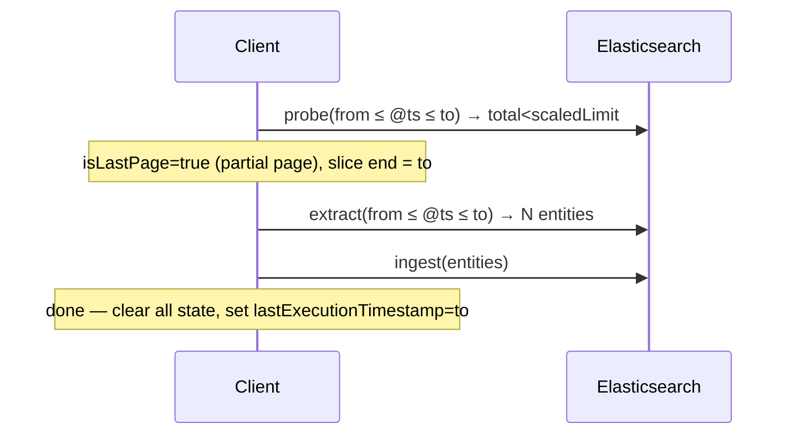
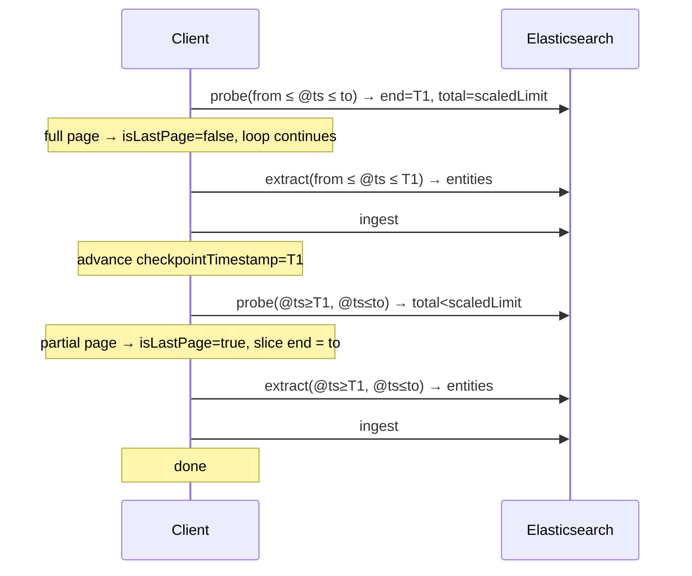
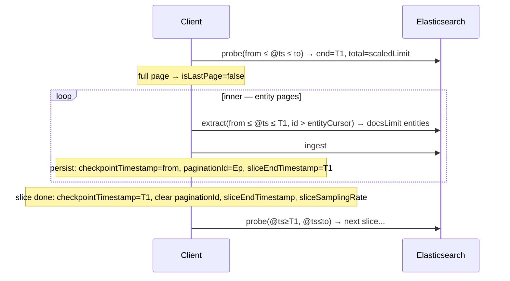
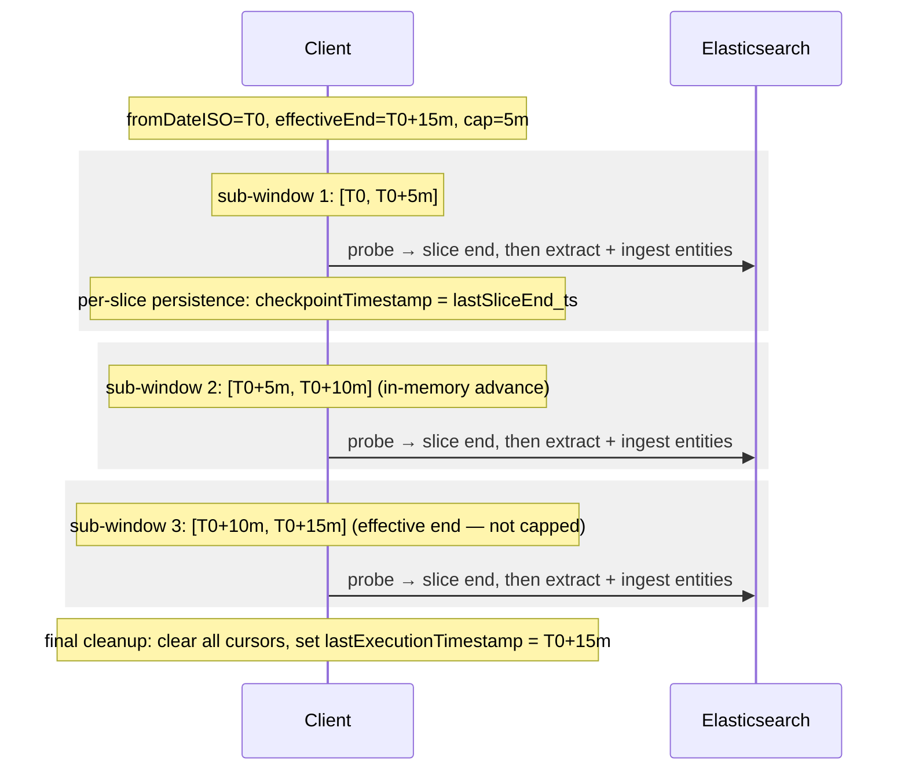
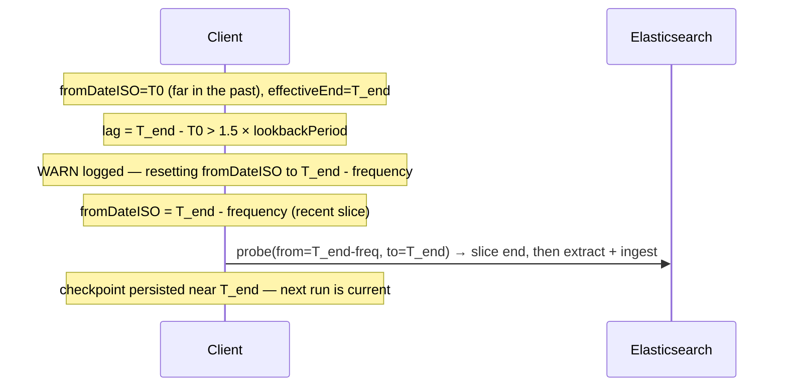
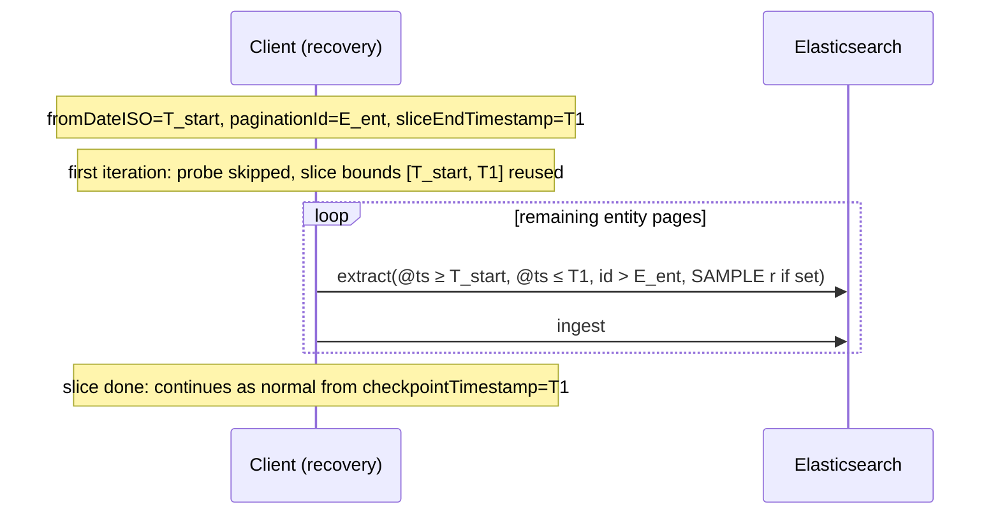
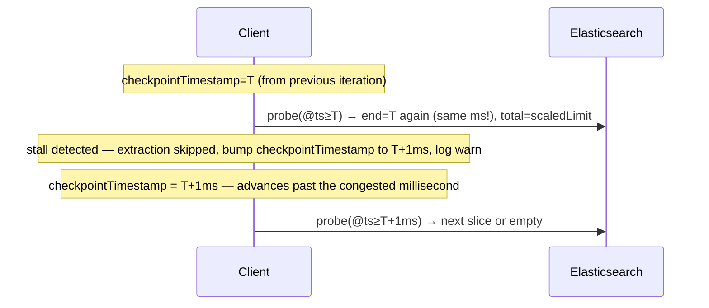
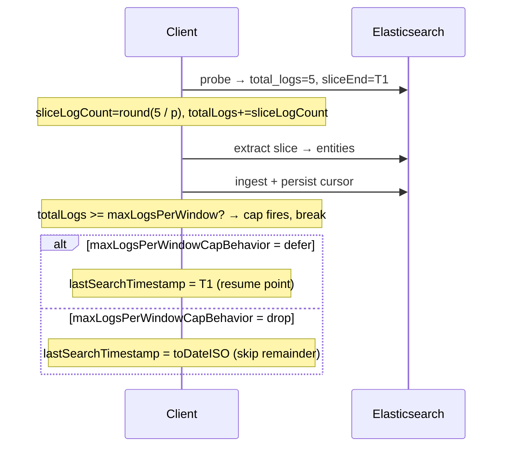

# Logs Extraction Pagination

Three nested loops process raw log documents into aggregated entity rows.

**Window cap outer loop**: When the gap between `fromDateISO` and the effective window end (`now - delay`) exceeds `maxTimeWindowSize + GRACE_PERIOD` (default `15m + 30s`), the run processes the time range as a sequence of capped `[fromSub, toSub]` sub-windows of width `maxTimeWindowSize`, advancing within a single execution until the effective end is reached. Sub-windows are an in-memory iteration concept — the saved-object schema is unaware of them. Crash recovery uses the per-slice persistence emitted by the inner outer-loop (last `checkpointTimestamp` written).  Manual `specificWindow` / `windowOverride` runs bypass capping and run as a single pass.

**Outer loop — log slices**: Each iteration runs a **boundary probe** (`buildLogPaginationCursorProbeEsql`) to locate the inclusive end of the next raw-log slice. The probe samples the logs (`SAMPLE p`), sorts by `@timestamp ASC`, limits to the scaled page size `round(maxLogsPerPage × p)`, then aggregates `MAX(@timestamp)` and `COUNT(*)`. `p` comes from `pickSampleProbability`: `0.1` by default, raised up to `1` (no `SAMPLE` stage) when `maxLogsPerPage` is too small to keep 2500 sampled rows. A page below the scaled limit signals the last slice; a saturated page means more slices may follow. The last slice always ends at `toDateISO`, not at the probe's `MAX(@timestamp)`, so logs the sampled probe missed at the tail are still extracted.

**Inner loop — entity pages**: Each log slice is processed via `buildLogsExtractionEsqlQuery`. Results are paginated by entity id only (`SORT entity.EngineMetadata.UntypedId ASC`, then `WHERE id > paginationId` on later pages), up to `docsLimit` entities per query. The id is derived only from identity fields, so the order does not change when the query samples.

The probe sampling above only finds slice bounds. Extraction itself samples only in the non-priority process, see [Non-priority adaptive sampling](#non-priority-adaptive-sampling).

---

## Cursors

| Cursor | Persisted field | Semantics |
|--------|----------------|-----------|
| **Checkpoint** | `checkpointTimestamp` | Dual-purpose: (1) `fromDateISO` lower bound for the window on recovery; (2) inclusive `@timestamp >=` lower bound fed to the next probe after the first iteration. Set to the slice end after each completed slice. While a slice's entity pages are in flight it stays at the slice start, so a resumed run re-enters the same slice. Cleared to `null` when the full run completes. |
| **Entity cursor** | `paginationId` | Untyped entity ID of the last ingested entity page. Set mid-inner-loop; cleared when the slice completes. |
| **Pinned slice end** | `sliceEndTimestamp` | Inclusive end of the in-flight slice. Set together with `paginationId`; cleared when the slice completes. On resume it replaces the probe, because a sampled probe can return a different end on every run. |
| **Pinned sampling rate** | `sliceSamplingRate` | Extraction sampling rate of the in-flight slice, `null` when the slice was not sampled. Set and cleared together with `sliceEndTimestamp`. On resume it is reused as-is. |

The resume cursor is `paginationId` within the pinned bounds `[checkpointTimestamp, sliceEndTimestamp]`. Each extraction process keeps its own copy of these fields: `logExtractionState` for single and priority, `nonPriorityLogExtractionState` for non-priority.

`checkpointTimestamp` is applied as an inclusive lower bound:
```
@timestamp >= TO_DATETIME(checkpointTimestamp)
```

The base time-window filter also uses `@timestamp >= fromDateISO` (inclusive). After the first outer-loop iteration, `checkpointTimestamp` tightens this bound to the previously completed slice end.

The boundary is inclusive, which means the slice-end document is re-processed on the next iteration. This is safe because all aggregations (`TOP`, `LAST`, `MIN`, `MV_UNION`) are idempotent.

---

## Happy path: single log page, single entity page

All logs fit in one slice; all entities fit in one page.



---

## Happy path: multiple log pages, one entity page each

Logs exceed `maxLogsPerPage`. Each slice produces fewer than `docsLimit` entities.



After each slice, `checkpointTimestamp` advances to the slice end (`@timestamp >= T`). The slice-end doc may be re-processed on the next probe, but aggregations are idempotent so this is safe.

---

## Happy path: multiple log pages, multiple entity pages

Entity count within a slice exceeds `docsLimit`, requiring inner iterations. State is persisted after each entity page in case of interruption.



If the process crashes mid inner-loop, `paginationId` and `sliceEndTimestamp` are set in the saved state. The next run enters recovery (see below).

---

## Lagging environment: multiple sub-windows in one run

When `effectiveWindowEnd - fromDateISO > maxTimeWindowSize + GRACE_PERIOD`, the time range is processed as a sequence of capped sub-windows within a single `extractLogs` run. Each sub-window runs the existing slice/entity loops to completion. Persistence between sub-windows is whatever the inner outer-loop already wrote (per-slice `checkpointTimestamp`); no extra checkpoint round-trip is added.



If the process is aborted between sub-windows, recovery resumes from the last persisted slice end (`checkpointTimestamp` set by the inner outer-loop after the most recently completed slice) — not from a sub-window boundary. The next run re-establishes its own sub-window cap from that resume point.

---

## Lag cutoff circuit breaker

When queries are consistently slow (e.g., large index, high ingest rate, under-sized ES cluster), each run may process less wall-clock data than real-time advances. The engine falls progressively further behind `now - delay`. Sub-window capping bounds per-query cost but does not help catchup — it just slices an ever-growing backlog into fixed-size pieces.

The lag cutoff is a circuit breaker applied **before** the sub-window loop begins. If the computed `fromDateISO` is more than `1.5 × lookbackPeriod` before `effectiveWindowEnd`, the engine is so far behind that it cannot catch up. Rather than continuing to work through stale data, the window start is reset to `effectiveWindowEnd - frequency` — a single, frequency-sized slice of recent data. `frequency` is the merged per-type value, so this is 1m for user and host, 10m for service and 30m for generic by default.

| Condition | Action |
|-----------|--------|
| `lag ≤ 1.5 × lookbackPeriod` | Normal operation; window unchanged. |
| `lag > 1.5 × lookbackPeriod` | `fromDateISO` reset to `effectiveWindowEnd - frequency`; skipped range dropped; WARN logged. |

After the cycle, the checkpoint is persisted at or near the frequency-sized window's end. The next run starts from there, naturally within the real-time window.

The WARN log includes: original `from`, new `from`, `effectiveEnd`, `lagMs`, and `droppedMs` for observability.



**What is dropped**: all data between the original `fromDateISO` and `effectiveWindowEnd - frequency`. This is an explicit trade-off: maintaining real-time coverage is preferred over eventually processing old backlog data that would never catch up anyway.

**Manual override runs are exempt**: `specificWindow` / `windowOverride` calls supply explicit bounds and bypass the cutoff entirely (same as the sub-window cap).

---

## Recovery

A crash mid-entity-page leaves the following state on disk:

| Field | Value | Meaning |
|-------|-------|---------|
| `checkpointTimestamp` | `T_start` | Start of the interrupted slice; becomes `fromDateISO` on the next run |
| `paginationId` | `E_ent` | Untyped ID of the last ingested entity |
| `sliceEndTimestamp` | `T1` | Pinned end of the interrupted slice |
| `sliceSamplingRate` | `r` or `null` | Pinned extraction sampling rate of the interrupted slice |

On the next run `fromDateISO = T_start`. `resolveMidSliceResume` returns the entity cursor, the pinned slice end and the pinned rate.



The probe is skipped on purpose. It samples, so a new probe could return a different slice end. Resuming the id cursor against a different end would lose the logs of already-paged entities between the old and the new end. The resumed slice does not count against this run's `maxLogsPerWindow` budget, since the interrupted run already counted it.

If `paginationId` is set but `sliceEndTimestamp` is not, the cursor is discarded with a `warn` log and the slice is processed again from `checkpointTimestamp`. Upserts are idempotent, so this is safe.

A crash *between* sub-windows is indistinguishable from a crash at a slice boundary: the most recently persisted state is `checkpointTimestamp = lastSliceEnd_ts` (from the inner outer-loop's per-slice `advanceEngineStateAfterLogPageCompletes`). The next run reads that as `fromDateISO` and re-establishes the sub-window cap from there — re-fetching the slice-boundary doc itself, which is harmless under the idempotent aggregations (`TOP`, `LAST`, `MIN`, `MV_UNION`).

---

## Edge cases

### Cap interaction with `specificWindow` / `windowOverride`

When a manual window is supplied (admin-triggered API call), the sub-window cap is bypassed and the supplied bounds are processed in a single pass via the existing slice/entity loops. State is not advanced — the user explicitly picked the bounds, and we do not silently shorten or shift them.

### Timestamp collision at a slice boundary

The log-slice cursor is timestamp-only (`@timestamp >= T`). Documents sharing the same millisecond are processed in undefined order, and the slice boundary is inclusive so the slice-end document is re-processed on the next iteration. Re-processing is safe because all aggregations (`TOP`, `LAST`, `MIN`, `MV_UNION`) are idempotent.

**Timestamp stall detection**: If about `maxLogsPerPage` or more documents share a single millisecond, the sampled probe saturates its scaled limit inside that millisecond. Successive slices would then all end at the same timestamp and the outer loop would make no progress. The client detects this condition (same slice-end timestamp as the previous slice start, saturated page) and bumps the cursor forward by 1ms without running entity extraction, emitting a `warn` log. Documents at the surplus millisecond beyond `maxLogsPerPage` are dropped.



### Full page (`total_logs == scaledLimit`)

`scaledLimit` is `round(maxLogsPerPage × p)`, the probe `LIMIT`. When the probe returns `total_logs == scaledLimit` the slice is marked `isLastPage = false` — a full page means more documents may follow. Only a partial page (`total_logs < scaledLimit`) signals the last slice. Because `total_logs` is `COUNT(*)` computed **after** the `LIMIT`, it never exceeds `scaledLimit`.

A sampled probe can return 0 rows for a window that still has a few logs. So when sampling is active (`p < 1`), an empty probe still runs one final extraction up to `toDateISO`. Only an unsampled empty probe (`p = 1`) stops the loop right away.

---

## Volume cap

Two independent knobs bound how much work a single run does:

| Knob | Purpose |
|------|---------|
| `maxLogsPerPage` | Upper bound on raw log docs in **one slice** (probe `LIMIT` is `round(maxLogsPerPage × p)` sampled rows). Capped at `maxLogsPerWindow` when the cap is enabled. |
| `maxLogsPerWindow` | Upper bound on raw log docs across **the entire run**. 0 = disabled. |

### Why logs, not entities

`maxLogsPerWindow` caps **raw log documents scanned**, not entity rows produced. Entities are aggregated outputs (one entity per unique `entity.id`) and can be far fewer than the logs they summarise. Capping on entities would allow unbounded log scanning, which is what operators want to prevent.

### How the cap is computed

After each probe the slice's log count is derived and accumulated:

```
sliceLogCount = round(probe.total_logs / p)   // estimate of the real slice size
totalLogs    += samplingRate ? ceil(sliceLogCount × samplingRate) : sliceLogCount
                                              // runs across all slices in the window
```

The cap fires **after** the slice's entity pages are ingested and state is persisted:

```
if maxLogsPerWindow > 0 && totalLogs >= maxLogsPerWindow:
    logsCapApplied = true
    break
```

This ensures every slice that starts is fully processed before stopping.



### Across sub-windows (lagging environments)

When the time range is split into sub-windows (see [Lagging environment](#lagging-environment-multiple-sub-windows-in-one-run)), the remaining budget shrinks across sub-windows:

```
remainingCap = maxLogsPerWindow - totalLogsAcrossSubWindows
```

Each sub-window receives `remainingCap` as its own `maxLogsPerWindow`. The cap fires in the first sub-window that exhausts the budget.

### Defer vs drop on cap

| `maxLogsPerWindowCapBehavior` | `lastSearchTimestamp` returned | Next run behaviour |
|---|---|---|
| `defer` | Slice end where cap fired | Resumes from cursor; processes remaining logs |
| `drop` | `toDateISO` (window end) | Cursor advances past uncapped logs; they are skipped |

Default per extraction process (`DEFAULT_CONFIG_BY_MODE` in `domain/config/merge_config.ts`):

| Process | Default | Why |
|---|---|---|
| `single` (dual-process flag off) | `drop` | Code default, unchanged behaviour |
| `priority` | `defer` | No intentional loss of identity records; falls behind under load, then catches up |
| `nonPriority` | `drop` | Best-effort over high volume; stays current |

For non-priority, the volume fields (`maxLogsPerPage`, `maxTimeWindowSize`, `maxLogsPerWindow`, `maxLogsPerWindowCapBehavior`, `docsLimit`) are not read from the store-wide or per-type config. Only `nonPriorityLogExtractionConfig` can set them (`NON_PRIORITY_EXCLUSIVE_FIELDS`).

### Disabling the cap

`maxLogsPerWindow = 0` disables the cap entirely — the per-slice check is skipped and the run processes all logs in the window.

---

## Non-priority adaptive sampling

With the dual-process flag on, the non-priority process of an entity type that supports sampling (today only `user`) adds `| SAMPLE rate` to the extraction query, right after the source filter. Single and priority never sample the extraction query. At `rate = 1` no `SAMPLE` stage is emitted, so the query is the same as without sampling.

The rate is computed per slice in `sampling.ts`, from the probe values the loop already has (no extra queries):

```
estimatedRemaining = sliceLogCount + sliceDensity × (windowEnd - sliceEnd)
remainingBudget    = LOG_EXTRACTION_MAX_LOGS_PER_WINDOW_DEFAULT - scannedLogs
rate               = clamp(remainingBudget / estimatedRemaining, MIN_SAMPLING_RATE, 1)
```

- The budget is the built-in default `maxLogsPerWindow` (`100000`), never the configured one. Changing `maxLogsPerWindow` only moves the hard stop.
- `MIN_SAMPLING_RATE` is `0.1`. At very high volume the budget still runs out and the cap fires as usual.
- A `samplingRate` in `nonPriorityLogExtractionConfig` replaces the computed rate for every slice, whatever the volume.
- The budget counts processed volume (`ceil(sliceLogCount × rate)`), so a fixed budget covers the whole window instead of only its start.
- The rate of an in-flight slice is pinned in `sliceSamplingRate`, see [Recovery](#recovery).
