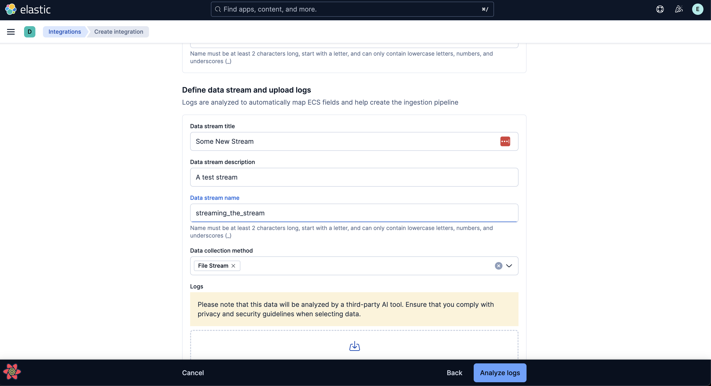

# Custom Integration Setup - Quick Start Guide

This guide covers how to setup a custom integration in Kibana. It covers how to create a connector, where to get example log files, and common troubleshooting.

## Pre-Setup

1. In order to setup a custom integration in Kibana, you will first need to enable a trial license.

   - This can be achieved by passing the ` --license trial` argument to Elasticsearch when running it from the terminal: `yarn es snapshot --license trial`
     **_OR_**
   - You can simply navigate to the licensing in Kibana and enable a trial there to give yourself access to custom integrations.

2. Once this is complete, navigate to the `Integrations` section in Kibana and click on `Create New Integration` in the top right.

3. From here you will need to continue by clicking on `Create Integration` or you may upload a zip folder with the custom integration if you have it. See the docs here for more explanation: [Install Package](https://github.com/elastic/elastic-package/blob/main/docs/howto/install_package.md#kibana--870-1) and [API Docs](https://www.elastic.co/docs/api/doc/kibana/operation/operation-post-fleet-epm-packages).

## Using the custom integration flow

1. For the first step, you will first need to choose what connector you want to use (`Amazon Bedrock`, `Google Gemini`, or `OpenAI`).
   - From here, you can go to each one independently to create your own set of credentials (you will need access from Infosec to access the Elastic projects), or you can use demo credentials provided [in this pastebin](https://p.elstc.co/paste/sWLDW5oG#S3vhqS6dj2x3RUi+vMz82ZU-re9Ia7hYx47yuXEw6zw). _As a note, sometimes the Pastebin doesn't decode the credentials properly, simply re-click the link if its still encoded._
   - As an additional note, some connectors such as GCP require a JSON key, the field currently doesn't accept the file, you will need to open the JSON key and then paste the content into the field in Kibana.
2. Next, give your integration some details, this is how it will be shown in Kibana.
3. For the third step, you will need to define the data stream to fit your needs. If you'd like to use some example datasets, some can be found in the archived Elastic repo [using this link](https://github.com/elastic/examples/tree/master/Common%20Data%20Formats/apache_logs).
   - Upload one of the example log files and fill in the fields to fit your needs. In this example, we used the `apache_logs` file and set the Data collection method to `File Stream` 
4. Finally, click on `Analyze Logs` and wait for it to complete. If it fails, the error popup will explain why. Common issues include: bad api keys, rate limits, or an incorrectly-formatted log file.

_Once complete, you can find the integration in the `Integrations` section of Kibana by searching for it directly._
