# Running a local Fleet Server and enrolling Elastic Agents

This guide assumes Elasticsearch is running from snapshot and Kibana is running from source as detailed in [the README](../README.md#running-fleet-locally-in-stateful-mode). Note that `-E http.host=0.0.0.0` must be passed to `yarn es snapshot`.

As explained in the [Set up a Fleet Server and enroll Elastic Agents](../README.md#set-up-a-fleet-server-and-enroll-elastic-agents) section, is it useful to run Elastic Agents in virtual machines or Docker containers for testing purposes. This guide provides step-by-step instructions for both methods using HTTP (note: you can also mix both and have e.g. a dockerized Fleet Server and agents on VMs). Refer to [Developing Kibana and Fleet Server simultaneously](./developing_kibana_and_fleet_server.md) for details about using HTTPS instead.

## Kibana config

Add the following to your `kibana.dev.yml`. Note that the only differences between VM and container setups are the URLs of the Fleet Server host and Elasticsearch output. If you want to set up a Fleet Server on a VM, you will first need to launch the VM in order to get the IP address.

```yml
# Set the Kibana server address to Fleet Server default host.
server.host: 0.0.0.0

# Use default version resolution to let APIs work without version header
server.versioned.versionResolution: oldest

# Install Fleet Server package.
xpack.fleet.packages:
  - name: fleet_server
    version: latest

# Create an agent policy for Fleet Server.
xpack.fleet.agentPolicies:
  - name: Fleet Server policy
    id: fleet-server-policy
    is_default_fleet_server: true
    # is_managed: true # Useful to mimic cloud environment
    description: Fleet server policy
    namespace: default
    package_policies:
      - name: Fleet Server
        package:
          name: fleet_server
        inputs:
          - type: fleet-server
            keep_enabled: true
            vars:
              - name: host
                value: 0.0.0.0
                frozen: true
              - name: port
                value: 8220
                frozen: true

# Set a default Fleet Server host.
xpack.fleet.fleetServerHosts:
  - id: default-fleet-server
    name: Default Fleet server
    is_default: true
    # host_urls: [https://<the-IP-address-of-your-VM>:8220] # For running a Fleet Server in a VM
    # host_urls: ['https://host.docker.internal:8220'] # For running a Fleet Server Docker container

# Set a default Elasticsearch output.
xpack.fleet.outputs:
  - id: es-default-output
    name: Default output
    type: elasticsearch
    is_default: true
    is_default_monitoring: true
    # hosts: ['http://<your-local-IP>:9200'] # For enrolling agents on VM
    # hosts: ['http://host.docker.internal:9200'] # For enrolling dockerized agents
```

## Using Multipass VMs

[Multipass](https://multipass.run/) is a lightweight virtualization tool for running Ubuntu VMs. Follow the instructions at https://multipass.run/install to install Multipass on your local machine.

Advantages of running Elastic Agents on a VM include:

- More realistic setup.
- Ability to use the `elastic-agent` commands, e.g. `sudo elastic-agent status`, `sudo elastic-agent restart`...
- Agents can be upgraded.
- Elastic Defend can be installed.

To run a Fleet Server and agents on VMs, make sure the default output host defined in your `kibana.dev.yml` uses your local IP address (NB: using `localhost` can cause connection issues). For Mac users using a WiFi connection, the local IP address can be retrieved with:

```sh
ipconfig getifaddr en0
```

The default Fleet Server host can be set once the VM for the Fleet Server is running.

In Fleet UI, these host URLs should be reflected in the Settings page:
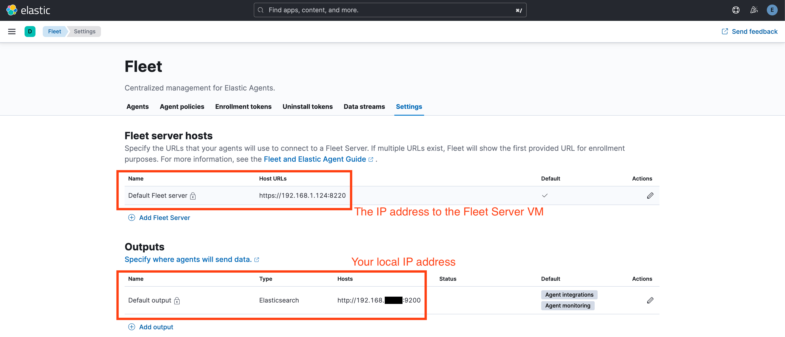

### Running a Fleet Server

1\. Launch a Multipass instance for your Fleet Server:

```sh
multipass launch --name fleet-server --disk 10G --network en0
```

Available options are detailed at https://multipass.run/docs/launch-command.

It is generally recommended to provide additional disk space (default 5G) for running Elastic Agents.

In addition, the `--network` option adds a network interface to the instance, in this case `en0`. This allows the Fleet Server instance to communicate with the enrolled agents via the wifi network interface. You can find out the IP address by running:

```sh
multipass list
```

Example output:

```sh
Name                    State             IPv4             Image
fleet-server            Running           192.168.1.1     Ubuntu 24.04 LTS
                                          192.168.1.100
```

Copy the second IP address into the host URLs of the Fleet Server host in your `kibana.dev.yml`. Wait for Kibana to restart.

2\. Shell into the instance:

```sh
multipass shell fleet-server
```

3\. Open Kibana in a browser and head over to Fleet. Initially, there should be no Fleet Server:
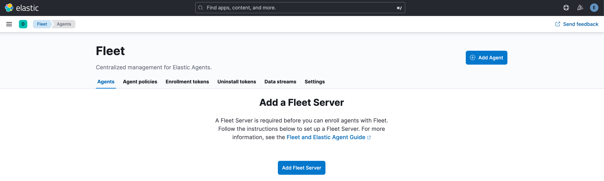

4\. Click "Add Fleet Server". In the flyout, check that the Fleet Server host is correct and click "Continue".
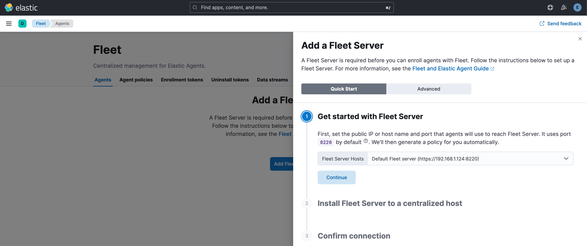
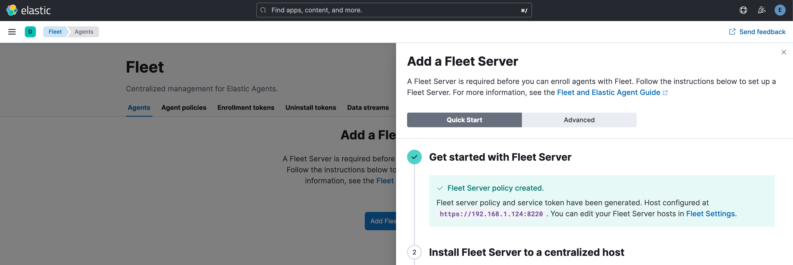

5\. Before copying the install instructions, amend the download URL to suit the desired version and your host architecture:

- Because Multipass only supports the host's architecture, you may need to change `linux-x86_64` to `linux-arm64` (e.g. on M-series Macbooks).
- By default, the proposed version is the latest release. You can explore available versions at https://artifacts-api.elastic.co/v1/versions and then check out `https://artifacts-api.elastic.co/v1/versions/<version>/builds/latest` to find the relevant download URL. An even easier way is to use the API: the following command will output the download URL for the `elastic-agent-8.15.0-SNAPSHOT-linux-arm64.tar.gz` version:
  ```sh
  curl -s https://artifacts-api.elastic.co/v1/versions/8.15-SNAPSHOT/builds/latest | \
    jq '.build.projects."elastic-agent-package".packages."elastic-agent-8.15.0-SNAPSHOT-linux-arm64.tar.gz".url'
  ```

6\. With the modified install URL, copy the install instructions from the flyout and install the agent in the VM (hit Enter to confirm when running `sudo ./elastic-agent install`). After a few seconds the Fleet Server should be connected.
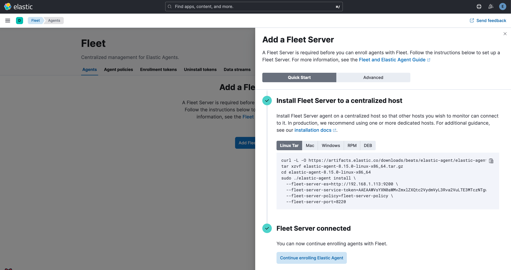

7\. You can click "Continue enrolling agents" to proceed to agent enrolling.

### Enrolling Elastic Agents

1\. In Fleet UI, click "Add agent". Select or create an agent policy which the agent will be assigned to. Leaving "Collect system logs and metrics" checked will install the `system` integration, which is a good way of checking data ingestion. Note that the agent policy will use the default Fleet Server host and default Elasticsearch output defined in your `kibana.dev.yml`.
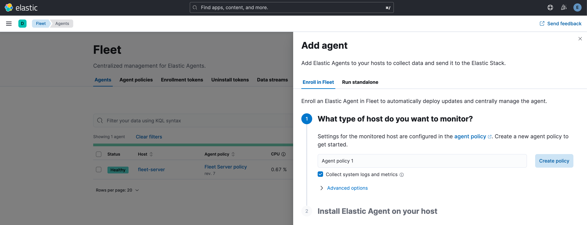

2\. Launch a Multipass instance, e.g.:

```sh
multipass launch --name agent1 --disk 10G
```

3\. Shell into the instance:

```sh
multipass shell agent1
```

4\. Refer to the [Running a Fleet Server](#running-a-fleet-server) section above for modifying the Elastic Agent download URL to suit your architecture and desired version. Install and extract the agent binary as instructed in the flyout.

5\. Run the `sudo ./elastic-agent install` command provided in the instructions, adding the `--insecure` flag as we are connecting to Elasticsearch using HTTP. After a few seconds the UI should confirm that the agent is enrolled and shipping data:
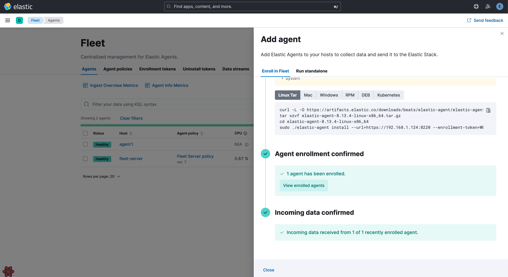

### Gotchas

1\. The system clock within Multipass instances stops when the host computer is suspended (see https://askubuntu.com/questions/1486977/repeated-incorrect-time-in-multipass-clients-with-ubuntu-22-04). This can result in a running Elastic Agent being incorrectly "in the past" after your laptop was asleep for a while. The easiest fix is to restart all Multipass instances, which will reset their clocks:

```sh
multipass restart --all
```

2\. As noted in the enrollment steps above, the architecture of a Multipass VM matches the one of the host. If the agent installation fails, check that the downloaded agent binary has the correct architecture type.

## Using Docker containers

Official documentation: https://www.elastic.co/guide/en/fleet/current/elastic-agent-container.html

The main advantage of running Elastic Agents in a Docker container is a one command setup that can be easily be scripted (see [Using the `run_dockerized_agent.sh` script](#using-the-run_dockerized_agentsh-script) below). There are a few limitations, however, including:

- Agents cannot be upgraded.
- Elastic Defend cannot be installed.

To use dockerized Fleet Server and agents, make sure the default Fleet Server host and default output defined in your `kibana.dev.yml` use `host.docker.internal`.

In Fleet UI, these host URLs should be reflected in the Settings page:
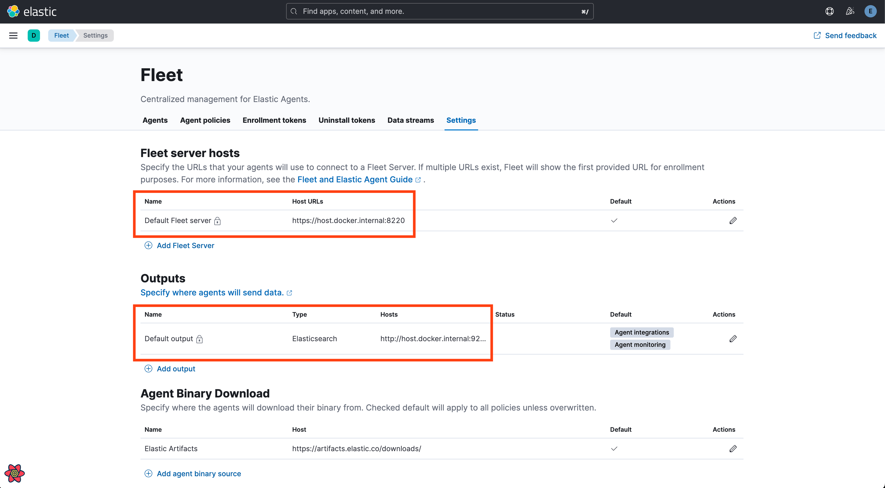

### Running a Fleet Server

With Docker running, launch your Fleet Server with:

```sh
docker run \
  -e ELASTICSEARCH_HOST=http://host.docker.internal:9200 \
  -e KIBANA_HOST=http://host.docker.internal:5601/your-base-path \
  -e KIBANA_USERNAME=elastic \
  -e KIBANA_PASSWORD=changeme \
  -e KIBANA_FLEET_SETUP=1 \
  -e FLEET_INSECURE=1 \
  -e FLEET_SERVER_ENABLE=1 \
  -e FLEET_SERVER_POLICY_ID=fleet-server-policy \
  -p 8220:8220 \
  --rm docker.elastic.co/elastic-agent/elastic-agent:<version>
```

where the version can be e.g. `8.13.3` or `8.15.0-SNAPSHOT`. You can explore the available versions at https://www.docker.elastic.co/r/beats/elastic-agent.

You can also check the list of available environment variables for the `docker run` command in the [elastic-agent source code](https://github.com/elastic/elastic-agent/blob/main/internal/pkg/agent/cmd/container.go#L66-L134).

Note the `-p 8220:8220` port mapping to map the Fleet Server container's port `8220` to your local machine's port `8220` in order for Fleet to communicate with Fleet Server.

Once the container is running, it can be treated as a local process running on `https://localhost:8220` and your Fleet Server should be enrolled in Fleet:
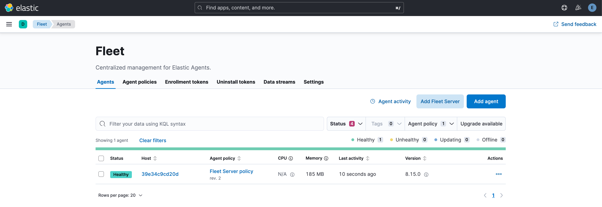

### Enrolling Elastic Agents

1\. In Fleet UI, click "Add agent". In the flyout, select or create an agent policy which the agent will be assigned to. Leaving "Collect system logs and metrics" checked will install the `system` integration, which is a good way of checking data ingestion. Note that the agent policy will use the default Fleet Server host and default Elasticsearch output defined in your `kibana.dev.yml`.
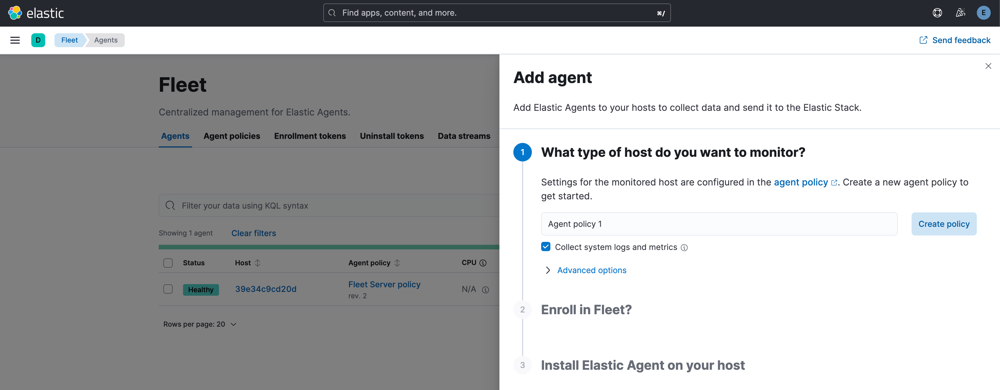

2\. Scroll down to the enrollment CLI steps and copy the enrollment token from the end of the `sudo ./elastic-agent install` command.

3\. Enroll the agent with:

```sh
docker run \
  -e FLEET_URL=https://host.docker.internal:8220 \
  -e FLEET_ENROLL=1 \
  -e FLEET_ENROLLMENT_TOKEN=<enrollment_token> \
  -e FLEET_INSECURE=1 \
  --rm docker.elastic.co/elastic-agent/elastic-agent:<version>
```

After a short moment, the UI should confirm that the agent is enrolled and shipping data:
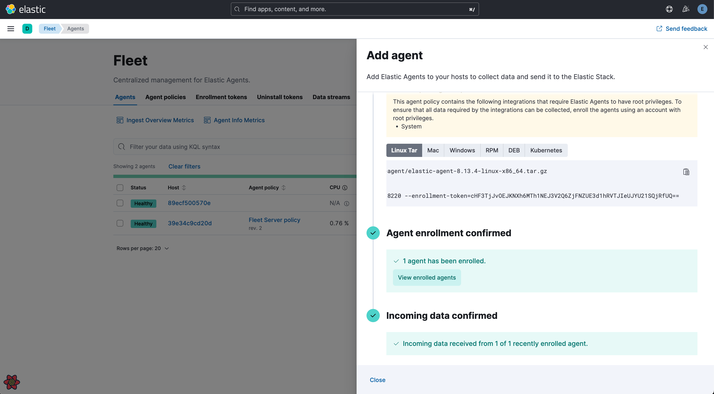

Tip: if the agent enrolls but there is no incoming data, check the host URL of the default output.

### Using the `run_dockerized_agent.sh` script

You can make either running a Fleet Server or enrolling an agent quicker by using the [run_dockerized_agent.sh](./run_dockerized_elastic_agent.sh) script:

- Copy the script place it somewhere convenient.
- Run `chmod +x` on it to make it executable.
- Update the version and the Kibana base path within the script.

Run a Fleet Server with:

```sh
./run_elastic_agent.sh fleet_server
```

And enroll an Elastic Agent with:

```sh
./run agent -e <enrollment token> -v <version> -t <tags>
```

where the version and tags are optional.
