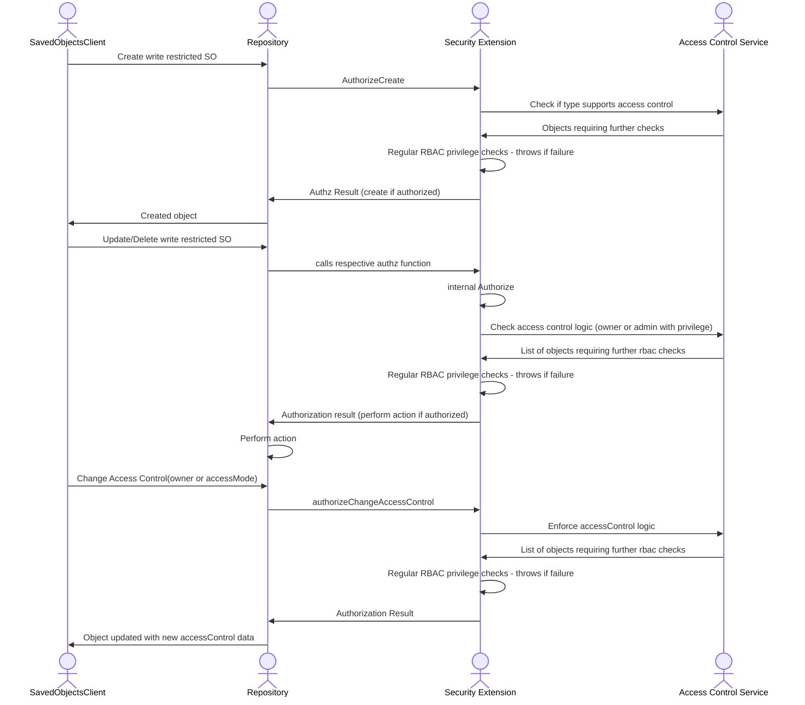

```mermaid
sequenceDiagram
  actor C as SavedObjectsClient
  actor SOR as Repository
  actor SE as Security Extension
  actor ACS as Access Control Service


C->>SOR: Create write restricted SO
SOR->>SE: AuthorizeCreate
SE->>ACS: Check if type supports access control
ACS->>SE: Objects requiring further checks
SE->>SE: Regular RBAC privilege checks - throws if failure
SE->>SOR: Authz Result (create if authorized)
SOR->>C: Created object


C->>SOR: Update/Delete write restricted SO 
SOR->>SE: calls respective authz function
SE->>SE: internal Authorize
SE->>ACS: Check access control logic (owner or admin with privilege)
ACS->>SE: List of objects requiring further rbac checks
SE->>SE: Regular RBAC privilege checks - throws if failure
SE->>SOR: Authorization result (perform action if authorized)
SOR->>SOR: Perform action


C->>SOR: Change Access Control(owner or accessMode)
SOR->>SE: authorizeChangeAccessControl
SE->>ACS: Enforce accessControl logic
ACS->>SE: List of objects requiring further rbac checks
SE->>SE: Regular RBAC privilege checks - throws if failure
SE->>SOR: Authorization Result
SOR->>C: Object updated with new accessControl data
```