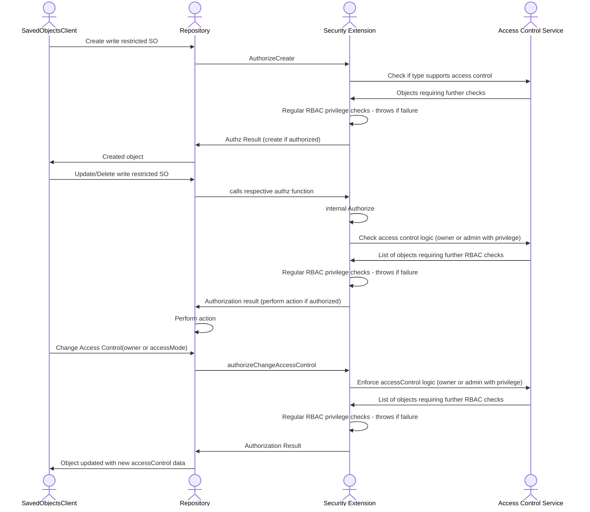

### Access Control Service

In addition to Kibana’s traditional role-based access control (RBAC), certain Saved Object types now support object-level access control permissions. This allows us to enforce ownership, and custom access modes beyond the “all or read” space-level privileges.

The Access Control Service (ACS) is responsible for evaluating these additional rules before allowing create, update, delete, or access‑control‑change operations on write‑restricted Saved Objects.

Here’s how it works in the context of the Saved Objects Repository (SOR) security extension flow:

When the Security Extension intercepts an operation, it delegates to ACS to determine whether the object type supports access control and if object‑level rules should be applied. The rules being:

- Objects need to support access control, which is determined during SO registration.
- An object, when in write_restricted mode, can only be modified by the current owner or the Kibana admin.
- An object, which supports access control, but is in default accessMode can be modified by anyone who has the appropriate space-level privileges.

ACS returns either an empty set (no further checks needed) or a list of objects requiring RBAC verification.

This ensures that access decisions combine both access control rules (ownership, sharing, etc.) and regular RBAC privilege checks before the operation is authorized.

The following sequence diagram shows how ACS is invoked for different scenarios: creation, modification, deletion, and access control changes, and how its results integrate with the overall authorization flow.

