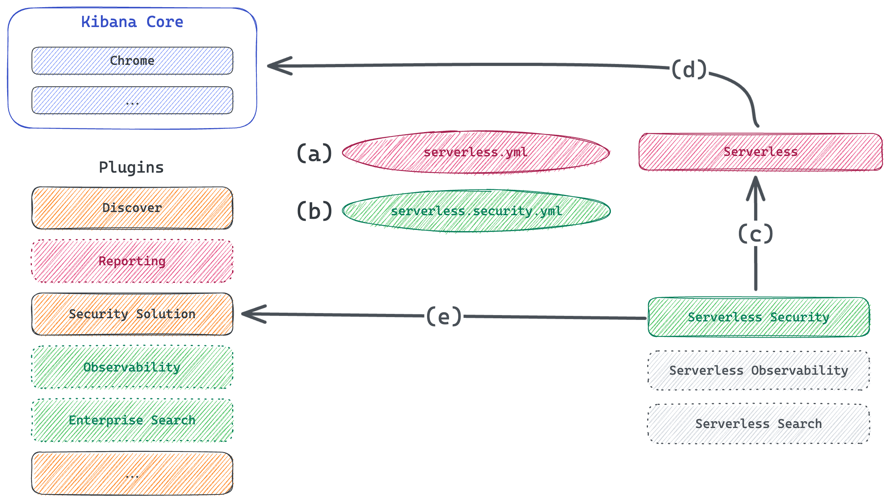

a. `serverless.yml` config enables Serverless plugin, provides settings for *all* projects, (e.g. disabling Reporting).

b. Product-specific `yml` file enables corresponding Project plugin, provides settings for a specific project, (e.g. disabling Observability).

c. Project plugin interacts with Serverless plugin to customize Serverless Kibana.

d. Serverless plugin interacts with Kibana Core to customize Classic Kibana.

e. Project plugin interacts with corresponding Solution plugin to customize the Solution experience for Serverless.

Communication occurs in a *single direction*. While it would be tempting to add a global flag to check if Serverless is enabled, doing so short-circuits the "affecting" model.