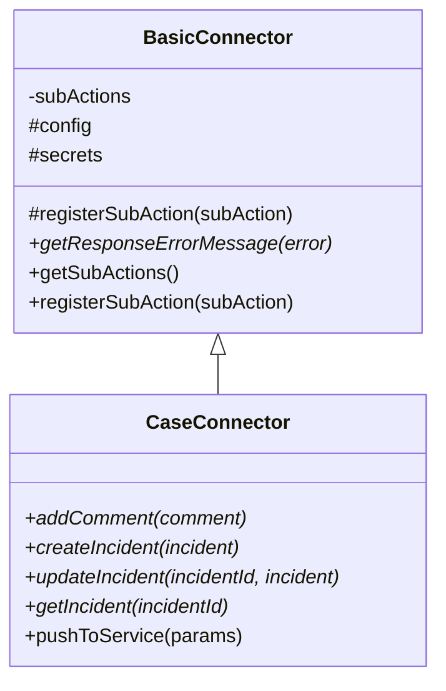
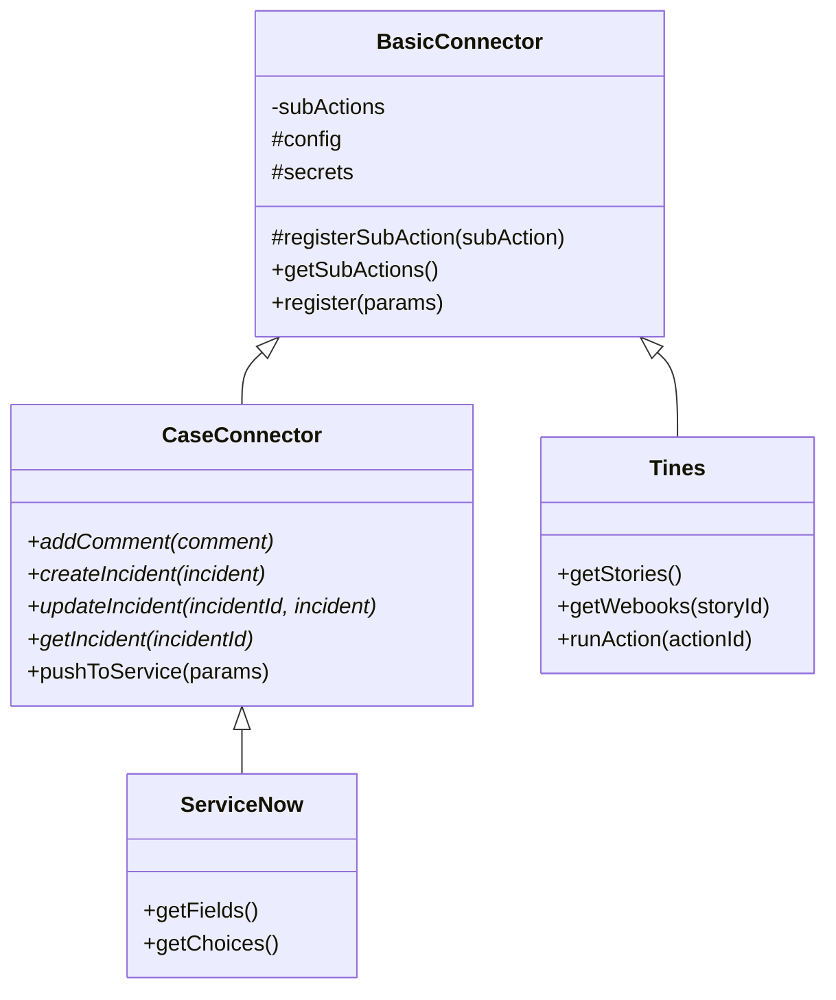

# Sub actions framework

## Summary

The Kibana actions plugin provides a framework to create executable actions that supports sub actions. That means you can execute different flows (sub actions) when you execute an action. The framework provides tools to aid you to focus only on the business logic of your connector. You can:

- Register a sub action and map it to a function of your choice.
- Define a schema for the parameters of your sub action.
- Define a response schema for responses from external services.
- Create connectors that are supported by the Cases management system.

The framework is built on top of the current actions framework and it is not a replacement of it. All practices described on the plugin's main [README](../../README.md#developing-new-action-types) applies for this framework.

## Classes

The framework provides two classes. The `BasicConnector` class and the `CaseConnector` class. When registering your connector you should provide a class that implements the business logic of your connector. The class must extend one of the two classes provided by the framework. The classes provides utility functions to register sub actions and make requests to external services.


If you extend the `BasicConnector`, you should implement the following abstract methods:
- `getResponseErrorMessage(error: AxiosError): string;`


If you extend the `CaseConnector`, you should implement the following abstract methods:

- `getResponseErrorMessage(error: AxiosError): string;`
- `addComment({ incidentId, comment }): Promise<unknown>`
- `createIncident(incident): Promise<ExternalServiceIncidentResponse>`
- `updateIncident({ incidentId, incident }): Promise<ExternalServiceIncidentResponse>`
- `getIncident({ id }): Promise<ExternalServiceIncidentResponse>`

where

```
interface ExternalServiceIncidentResponse {
  id: string;
  title: string;
  url: string;
  pushedDate: string;
}
```

The `CaseConnector` class registers automatically the `pushToService` sub action and implements the corresponding method that is needed by Cases.


### Diagrams



### Examples of extending the classes



## Usage

This guide assumes that you have create a class that extends one of the two classes provided by the framework.

### Register a sub action

To register a sub action use the `registerSubAction` method provided by the framework. It expects the name of the sub action, the name of the method of the class that will be called when the sub action is triggered, and a validation schema for the sub action parameters. Example:

```
this.registerSubAction({ name: 'fields', method: 'getFields', schema: schema.object({ incidentId: schema.string() }) })
```

If you do not want to validate your params pass `null`.

### Request to an external service

To make a request to an external you should use the `request` method provided by the framework. It accepts all [request configuration of axios ](https://github.com/axios/axios#request-config) plus the expected response schema. Example:

```
const res = await this.request({
        auth: this.getBasicAuth(),
        url: 'https://example/com/api/incident/1',
        method: 'get',
        responseSchema: schema.object({ id: schema.string(), name: schema.string() }) },
      });
```

The request method do the following:

- Logs the request URL and method for debugging purposes.
- Asserts the URL.
- Normalizes the URL.
- Ensures that the URL is in the allow list.
- Configures proxies.
- Removes `null` or `undefined` attributes from the data.
- Validates the response.

## Example

```
import { schema, TypeOf } from '@kbn/config-schema';
import { AxiosError } from 'axios';
import { BasicConnector } from './basic';
import { CaseConnector } from './case';
import { ExternalServiceIncidentResponse, ServiceParams } from './types';

export const TestConfigSchema = schema.object({ url: schema.string() });
export const TestSecretsSchema = schema.object({
  username: schema.string(),
  password: schema.string(),
});
export type TestConfig = TypeOf<typeof TestConfigSchema>;
export type TestSecrets = TypeOf<typeof TestSecretsSchema>;

interface ErrorSchema {
  errorMessage: string;
  errorCode: number;
}

export class TestBasicConnector extends BasicConnector<TestConfig, TestSecrets> {
  constructor(params: ServiceParams<TestConfig, TestSecrets>) {
    super(params);
    this.registerSubAction({
      name: 'mySubAction',
      method: 'triggerSubAction',
      schema: schema.object({ id: schema.string() }),
    });
  }

  protected getResponseErrorMessage(error: AxiosError<ErrorSchema>) {
    return `Message: ${error.response?.data.errorMessage}. Code: ${error.response?.data.errorCode}`;
  }

  public async triggerSubAction({ id  }: { id: string; }) {
    const res = await this.request({
      url,
      data,
      headers: { 'X-Test-Header': 'test' },
      responseSchema: schema.object({ status: schema.string() }),
    });

    return res;
  }
}
```

## Example: Case connector

```
import { schema, TypeOf } from '@kbn/config-schema';
import { AxiosError } from 'axios';
import { BasicConnector } from './basic';
import { CaseConnector } from './case';
import { ExternalServiceIncidentResponse, ServiceParams } from './types';

export const TestConfigSchema = schema.object({ url: schema.string() });
export const TestSecretsSchema = schema.object({
  username: schema.string(),
  password: schema.string(),
});
export type TestConfig = TypeOf<typeof TestConfigSchema>;
export type TestSecrets = TypeOf<typeof TestSecretsSchema>;

interface ErrorSchema {
  errorMessage: string;
  errorCode: number;
}

export class TestCaseConnector extends CaseConnector<TestConfig, TestSecrets> {
  constructor(params: ServiceParams<TestConfig, TestSecrets>) {
    super(params);
    this.registerSubAction({
      name: 'categories',
      method: 'getCategories',
      schema: null,
    });
  }

  protected getResponseErrorMessage(error: AxiosError<ErrorSchema>) {
    return `Message: ${error.response?.data.errorMessage}. Code: ${error.response?.data.errorCode}`;
  }

  public async createIncident(incident: {
    incident: Record<string, { title: string; }> 
  }): Promise<ExternalServiceIncidentResponse> {
    const res = await this.request({
      method: 'post',
      url: 'https://example.com/api/incident',
      data: { incident },
      responseSchema: schema.object({ id: schema.string(), title: schema.string() }),
    });

    return {
      id: res.id,
      title: res.title,
      url: 'https://example.com',
      pushedDate: '2022-05-06T09:41:00.401Z',
    };
  }

  public async addComment({
    incidentId,
    comment,
  }: {
    incidentId: string;
    comment: string;
  }): Promise<ExternalServiceIncidentResponse> {
    const res = await this.request({
      url: `https://example.com/api/incident/${incidentId}/comment`,
      data: { comment },
      responseSchema: schema.object({ id: schema.string(), title: schema.string() }),
    });

    return {
      id: res.id,
      title: res.title,
      url: 'https://example.com',
      pushedDate: '2022-05-06T09:41:00.401Z',
    };
  }

  public async updateIncident({
    incidentId,
    incident,
  }: {
    incidentId: string;
    incident: { category: string };
  }): Promise<ExternalServiceIncidentResponse> {
    const res = await this.request({
      method: 'put',
      url: `https://example.com/api/incident/${incidentId}`',
      responseSchema: schema.object({ id: schema.string(), title: schema.string() }),
    });

    return {
      id: res.id,
      title: res.title,
      url: 'https://example.com',
      pushedDate: '2022-05-06T09:41:00.401Z',
    };
  }

  public async getIncident({ id }: { id: string }): Promise<ExternalServiceIncidentResponse> {
    const res = await this.request({
      url: 'https://example.com/api/incident/1',
      responseSchema: schema.object({ id: schema.string(), title: schema.string() }),
    });

    return {
      id: res.id,
      title: res.title,
      url: 'https://example.com',
      pushedDate: '2022-05-06T09:41:00.401Z',
    };
  }

  public async getCategories() {
    const res = await this.request({
      url: 'https://example.com/api/categories',
      responseSchema: schema.object({ categories: schema.array(schema.string()) }),
    });

    return res;
  }
```