# Summary

The case action groups related alerts to cases automatically based on rules and conditions when alerts are detected. Specifically the case action:

1. Allows users to automatically attach alerts to a case.
2. Allows users to group alerts by a field and attach all alerts of each group to a case. Each group will be attached to its own case.
3. Allows users to define a time window specifying when alerts will be attached to an existing case instead of creating a new one based on time.
4. Allows users to configure if they want to reopen the case if it is closed.

# Architecture  

## Terminology

|      |                                   |
| :--- | :-------------------------------- |
| GD   | Grouping definition               |
| RGD  | Rule and grouping definition      |
| RGDP | Rule and grouping definition pair |

## Connector adapter

## High-level flow

The case action groups all alerts based on the grouping field defined by the user. Then the case action for each group does the following:
1. Check if there is a case that already represents the specific group for the specific rule.
2. If not, it will create a new case and attach the alerts to the new case. If there is a case, then it will do the following checks:
   1. Check if the case has already 1K alerts attached to it. If yes it will log a warning and terminate.
   2. Check if the case is older than the defined time window. If yes it will create a new case as described in Step 1.
   3. Check if the case is closed. If it is, it will check if the case should be reopened. If yes the case action will reopen the case and attach the alerts to it. If not it will create a new case and attach the alerts to the new case.

If an alert does not belong to a group it will be attached to a case representing the `unknown` value. Also, if no grouping field is configured by the user, all alerts will be attached to the same case.

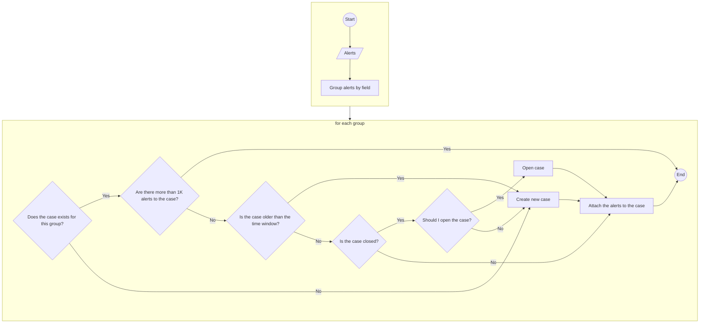

## Grouping

The case action accepts an array of alerts provided by the connector adapter. Duplicate alerts will not be attached to the same case. The case action groups the alerts by the grouping field configured by the user. For example, if the grouping field is `host.name` the case action will group the alerts by the values of the `host.name` field. In this case, the grouping will be done by multiple fields. The grouping is performed in memory by the case action as the number of alerts is expected to be low on average and they are already loaded in memory by the alerting framework.

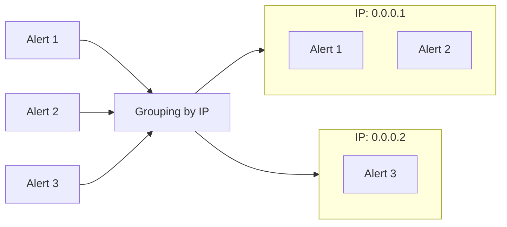

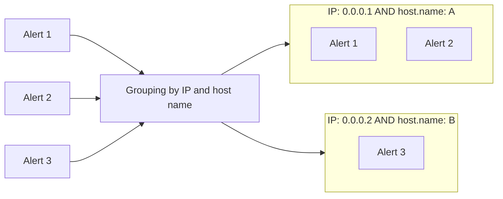

## Case creation

For each rule and each group produced by the grouping step, a case will be created and the alerts of that group will be attached to the new case. In future executions of the rule, new alerts that belong to the same group will be attached to the same case. If an alert cannot be grouped, because the grouping field does not exist in its data, it will be attached to a case that represents the `unknown` value.

To support this, the case action constructs a deterministic deduplication ID which will be set as the case ID. The ID can be constructed on each execution of the case action without the need to persist it and can correctly map alerts of the same group to the case that represents that group. A deduplication ID has two main advantages:

1. The case action can determine, without persisting the case ID, if a case exists for a specific rule and a specific group.
2. If two Kibana nodes or two executions of the same rule try to create the case with the same ID only one node or execution will succeed. See the Race Conditions section for more details.

The deduplication ID will be constructed as 

`sha256(<rule_id>:<space_id>:<owner>:<grouping_definition>:<counter>)`

where

`<rule_id>`: The ID of the rule. Including it in the deduplication ID ensures all cases created are at least rule-specific.
`<space_id>`: The space ID of the rule. Space ID is a required field.
`<owner>`: The owner of the Case. This will be set to the application from which the rule was created from. Owner is a required field.
`<grouping_definition>`: The grouping field and the grouping value. It can be optional to support attaching all alerts of a rule to the same case.
`<counter>`: The total number of cases with the same rule ID and same group definition. See Time Window for more details.

It is not possible for the `<rule_id>` and the `<grouping_definition>` to be undefined at the same time. If the `<grouping_definition>` is not defined by the user then the rule `<rule_id>` will be set automatically by the case action.

Examples of possible deduplication IDs:
`sha256(test_rule_id:default:securitySolution:{"host.ip":"0.0.0.1"}:0)`
`sha256(test_rule_2_id:my_space:observability:{"host.ip":"0.0.0.1","host.name":"A"}:1)`
`sha256(test_rule_2_id:default:securitySolution::0)`
`sha256(:default:host.ip=0.0.0.1:observability:0)`

The case action sorts deterministically the group definition by the field key to avoid having different IDs for the same group definition. For example, `{"host.ip":"0.0.0.1","host.name":"A"}` and `{"host.name":"A","host.ip":"0.0.0.1"}` will produce the same deduplication ID.

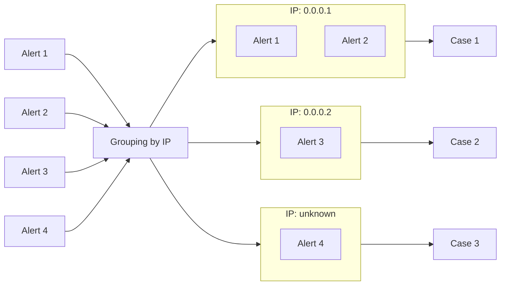

## Time window

Users are able to define a time window. The case action will attach alerts generated within the time window to the same case. For example, if the time window is set to 7 days all the alerts generated within the next 7 days will be assigned to the same case, and on the 8th day, a new case will be created. The time window is defaulted to seven days.

The new case is a continuation of the previous case. It still represents the case of the specific rule and the specific group (RGD).

To be able to support time windows we need the following:
1. Unique deduplication ID for cases with the same rule ID and the same grouping definition (RGD).
2. Be able to detect if the time window has elapsed.

By adding the counter in the deduplication ID we guarantee that the ID will be unique for the same rule ID and group definition. To be able to increase the counter when needed and to detect if the time window has elapsed for the specific RGDP an Oracle [2] is used. The Oracle keeps a map of the current counter and the last date it got updated by the case action for all RGDP. The Oracle satisfies the following properties:

1. For a valid RGDP, it will return the latest case counter.
2. If two executions of the same rule try to increase the counter at the same time only one execution will succeed.
3. If two Kibana nodes try to increase the counter at the same time only one node will succeed.

An entry in the map of the Oracle looks like this:

| Key (saved object ID)                                        | Value (saved object attributes)                             |
| :----------------------------------------------------------- | :---------------------------------------------------------- |
| `sha256(<rule_id>:<space_id>:<owner>:<grouping_definition>)` | `{ counter, createdAt, updatedAt, cases, rules, grouping }` |

The `cases`, `rules`, and `grouping` are needed in case we need to provide correlation statistics between cases and rules. The map is persisted in a dedicated saved object called `cases-oracle`. The SavedObject client is used to create and update the records of the map.

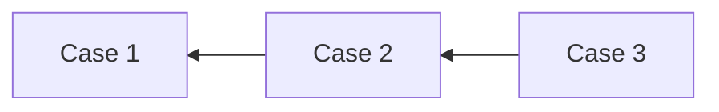

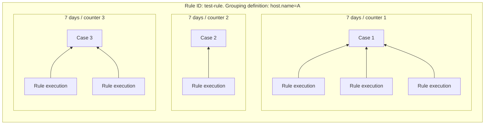

## Usage of the Oracle

The case action deterministically calculates the key of the Oracle mapping based on the rule ID and the GD. Then it executes the following steps:
1. Get the record by key. The record contains the latest counter and the latest date the counter got updated for the specific RGDP. If the record does not exist it will create the record, set the counter to one, and set the `updatedAt` and `createdAt` to the current timestamp.
2. Check if `updatedAt` + `timeWindow` < `now`.
  1. If the expression results to true (i.e. the current time is still within the time window), it will calculate the case ID as described in the Case creation section, and attach the alerts to the existing case.
  2. If the expression results to false (i.e. the current time is not within the time window), it will increase the counter, calculate the case ID as described in the Case creation section using the increased counter, create the case, and attach the alerts to the new case.

If a version conflict occurs in any of the steps, the execution will be rescheduled to run again. See the Race Conditions section for more details.

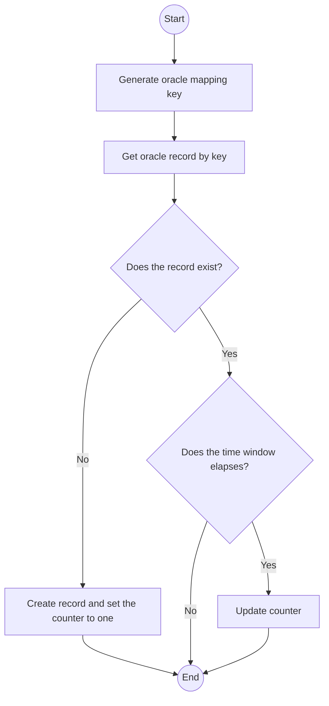

## Race conditions

There are two important operations within the case action: incrementing the counter in the Oracle and the creation of the case. It is possible for these operations to be executed at the same time by two Kibana nodes or by two executions of the same rule at the same time. The first scenario may happen if two rules with the same grouping definition (GD) try to either increase the counter or create the case at the same time. The second scenario may happen if the rule is scheduled to run very often. It is possible for the next run of the rule to happen before the first execution finishes. Although less likely, it may be possible for two different executions of the same rule to try to update the counter or create a new case at the same time especially if the execution time is much bigger than the interval time of the rule.

### Updating the counter

The optimistic concurrency control mechanism [1] of Elasticsearch guarantees that changes are applied in the correct order; an older version of a document does not overwrite a newer version. The case action leverages this property to ensure that the counter stored in the mapping of the Oracle is updated correctly in the scenario of race conditions. Specifically, the case action first gets the counter for the current RGDP. Along with the attributes, the version of the saved object is returned. In the case of the update, the case action provides the version and tries to update the counter. If in the meantime the counter got updated the version of the saved object will be different. As the provided version of the saved object is different from the current one, a conflict error will be thrown.

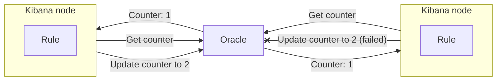

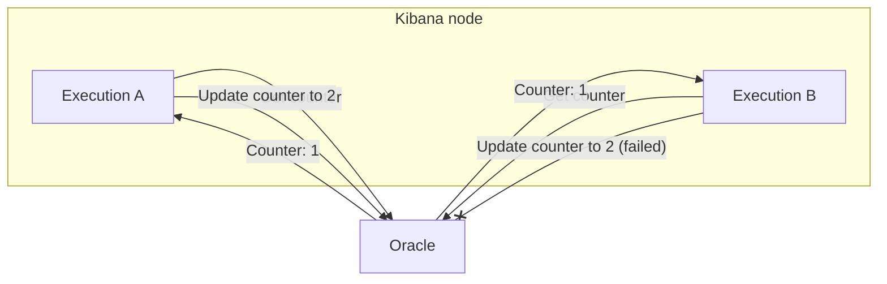

### Creating the case

The ID of the case is computed deterministically based on the rule ID, the group definition, and the counter. If for some reason, two executions of the case action compute the same case ID and try to create the case at the same time one of the two executions will succeed and only one case will be created. This is a guarantee provided by Elasticsearch [4].

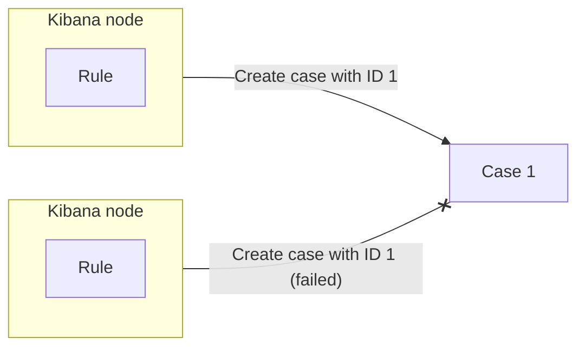

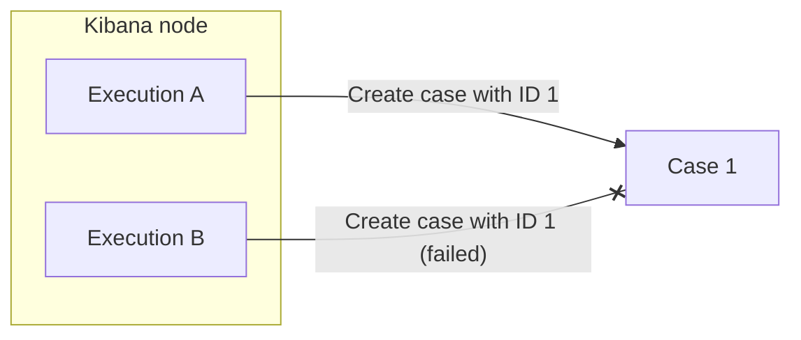

### Retries

To avoid losing alerts in case of conflicts, the failed executions will be retried again. The case action applies a capped exponential back-off mechanism with some randomness for retries [5, 6]. The maximum number of retries is set to ten and the duration between retries is short to avoid timeouts. As the case action is idempotent it is safe to retry the same action multiple times. The retry policy applies to all conflict failures. Specifically:

| Outcome                                            | Reason                                       | Flow of the retried execution                                                                                |
| :------------------------------------------------- | :------------------------------------------- | :----------------------------------------------------------------------------------------------------------- |
| Failure due to conflicts when updating the counter | The counter got updated by another execution | No need to increase the counter as it was increased by the previous execution. The new counter will be used. |
| Failure due to conflicts when creating a case      | The case got created by another execution    | No need to create a new case. Alerts will be attached to the case created by the previous execution.         |

If the case action exhausts all retries then the execution is rescheduled to be executed again at some point in the future by the task manager. This is a feature supported by the alerting framework and will be used by the case action. The maximum number of retries, using the alerting framework, is set to three.

By having a retry policy on conflicts, the possibility of encountering the same race conditions is very low [5, 6]. In the very unlikely scenario [5, 6] where all retries fail, the alerts will be not attached to any case.

## RBAC

Cases are used in the Security Solution, Observability, and Stack. A user having access only to one solution should not be able to create or view cases of another solution. To achieve that, Cases developed its own RBAC. A field called `owner`, in the case SavedObject, indicates the solution to which the case belongs. For example, a case with owner `securitySolution` belongs to Security Solution. A user with no access to Security Solution cannot access cases with owner `securitySolution`. The case action uses the cases’ client to create and update cases and to attach alerts to cases. The case client performs RBAC checks on these operations. 

The case action gets the owner as a configuration parameter. The UI sets the owner based on the application the user is creating the rule from. This means that if a user creates a rule from within the Security Solution the case will be created in Security Solution. Same for the Observability.

## Circuit breakers & Optimizations

The total number of cases that can be created or updated and the total number of records in the mapping of the Oracle is associated with the total number of grouping fields and the total number of unique values per grouping field. For example:

| Grouping fields                 | Total unique values                                 | Total unique values |
| :------------------------------ | :-------------------------------------------------- | :------------------ |
| host.name                       | 2                                                   | 2                   |
| host.name & dest.ip             | 2 for host.name and 3 for dest.ip                   | 6                   |
| host.name & dest.ip & file.hash | 2 for host.name, 3 for dest.ip, and 2 for file.hash | 12                  |

For `n` fields, the total number of cases that can be created is `|S1|*|S2|...|Sn|` where `Sn` is the set containing all unique values of the `n` grouping field [8]. For example, if there are 5 grouping fields with 10 unique values on each one then the total number of cases that will be created are `10^5 = 100.000`, a very high number. To avoid creating too many cases the number of total fields a user can define will be capped to one. With this limit the total number of cases that can be created is `|S1|`. Still, it can lead to a high number of cases if the unique values per grouping field are a lot. To mitigate this the case action a) uses a bulk create case API to create multiple cases at the same time and b) puts a limit on the number of total cases that can be created on an execution. The limit is set to 10 cases and can be configured by users. If more than 10 cases need to be created then the case action will create one case and attach all the alerts to that case. As the size of the mapping of the Oracle is related to the number of grouping fields and grouping values the same mitigations will apply also to it.

## Missing data

It is possible for users to delete an auto-created case or to import partial data. The case action should handle these scenarios gracefully. The following table and the following diagrams show all possible scenarios when either the case is auto-created or the counter is missing or invalid.

| Counter | Case      | Reason                                      | Resolution action                                                   |
| :------ | :-------- | :------------------------------------------ | :------------------------------------------------------------------ |
| Invalid | Found     | Oracle is not imported or deleted           | Set the counter to zero. Start over. Attach the alerts to the case. |
| Valid   | Not found | The case is deleted or not imported         | Create the case using the valid counter.                            |
| Valid   | Found     | System is functioning as expected           | Continue the flow as expected.                                      |
| Invalid | Not found | Oracle and case are not imported or deleted | Set the counter to zero and start over.                             |

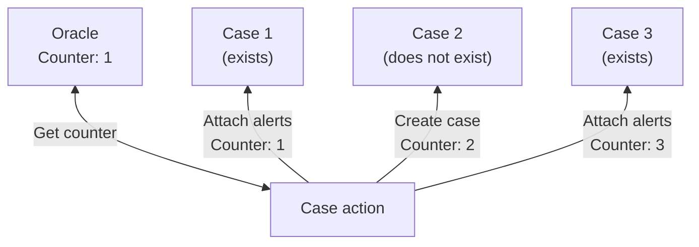

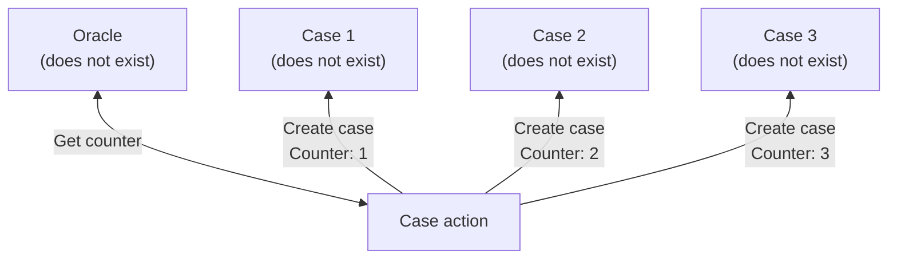

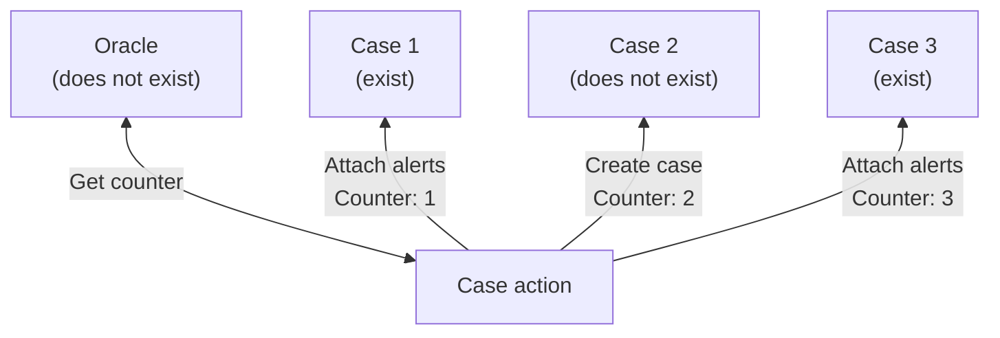

## Case action as a finite state machine

The case action can be modeled as a finite state machine. The following state machine shows all the possible states and transitions of the case action.

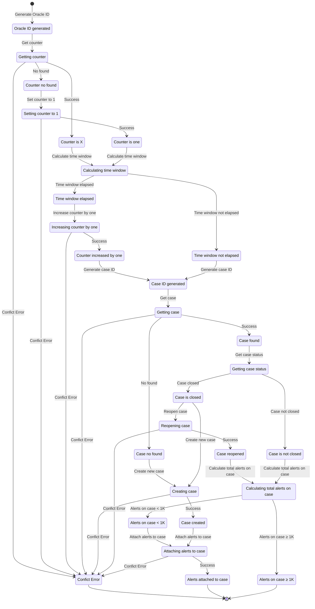

## Error handling

If 409 (Conflict), 429 (Too Many Requests), or 503 (ES Unavailable) occurs the case action will retry the execution as described on the Retries section. For all other errors, the case action will be rescheduled by the task manager. The retry mechanism of the case action and the alerting framework will eliminate most of the transient errors [5, 6]. If after three attempts the execution still fails, the case action will not be rescheduled again, the error will be logged to the event log and no cases will be created.

## References

[1] Elastic. 2023. “Optimistic Concurrency Control”. [URL](https://www.elastic.co/guide/en/elasticsearch/guide/master/optimistic-concurrency-control.html).
[2] Wikipedia. 2023. “Oracle machine”. [URL](https://en.wikipedia.org/wiki/Oracle_machine).
[3] Elastic. 2023. “Update Cases API”. [URL](https://www.elastic.co/guide/en/kibana/master/cases-api-update.html).
[4] Elastic. 2023. “Index API”. [URL](https://www.elastic.co/guide/en/elasticsearch/reference/current/docs-index_.html#operation-type).
[5] Amazon AWS. 2023. “Exponential Backoff And Jitter”. [URL](https://aws.amazon.com/blogs/architecture/exponential-backoff-and-jitter/).
[6] Amazon AWS. 2023. “Failures Happen”. [URL](https://aws.amazon.com/builders-library/timeouts-retries-and-backoff-with-jitter/?did=ba_card&trk=ba_card).
[7] Kibana telemetry. 2023. “Alerting rule metrics”.
[8] Wikipedia. 2023. “Rule of product”. [URL](https://en.wikipedia.org/wiki/Rule_of_product).
[9] Github 2023. “json-stable-stringify”. [URL](https://github.com/ljharb/json-stable-stringify).