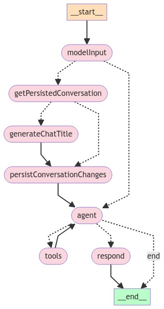
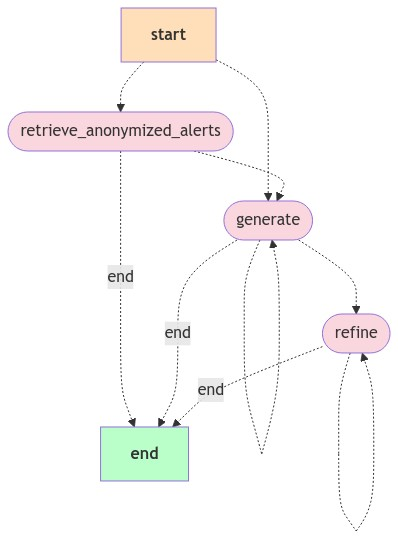

# Elastic AI Assistant

This plugin implements (only) server APIs for the `Elastic AI Assistant`.

This plugin does NOT contain UI components. See `x-pack/packages/kbn-elastic-assistant` for React components.

## Maintainers

Maintained by the Security Solution team

## Graph structure

### Default Assistant graph

### Default Attack discovery graph

## Development

### Generate graph structure

To generate the graph structure, run `yarn draw-graph` from the plugin directory.
The graphs will be generated in the `docs/img` directory of the plugin.

### Testing

To run the tests for this plugin, run `node scripts/jest --watch x-pack/plugins/elastic_assistant/jest.config.js --coverage` from the Kibana root directory.
