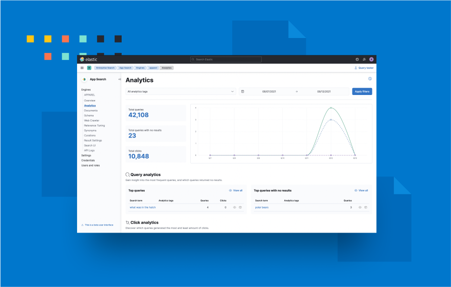
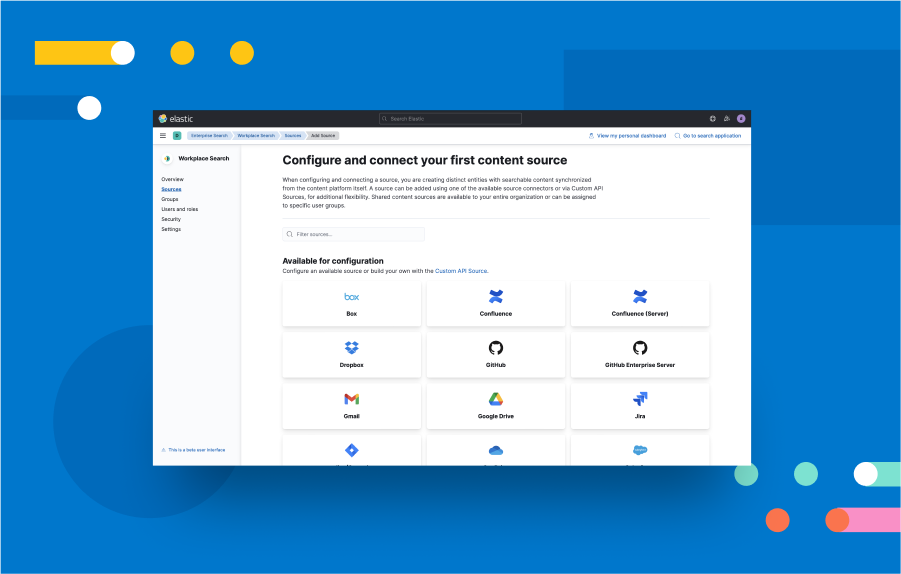

# Enterprise Search

## Overview

This plugin provides Kibana user interfaces for managing the Enterprise Search solution and its products, App Search and Workplace Search.

### App Search



Add rich, relevant search to your apps and websites. https://www.elastic.co/app-search/

### Workplace Search



Unify all your team's content into a personalized search experience. https://www.elastic.co/workplace-search/

## Development

1. When developing locally, Enterprise Search should be running locally alongside Kibana on `localhost:3002`.
2. Update `config/kibana.dev.yml` with `enterpriseSearch.host: 'http://localhost:3002'`

Problems? If you're an Elastic Enterprise Search engineer, please reach out to @elastic/enterprise-search-frontend for questions or our in-depth Getting Started developer guide.

Don't forget to read Kibana's [contributing documentation](https://github.com/elastic/kibana/#building-and-running-kibana-andor-contributing-code) and developer guides for more general info on the Kibana ecosystem.

### Kea

Enterprise Search uses [Kea.js](https://github.com/keajs/kea) to manage our React/Redux state for us. Kea state is handled in our `*Logic` files and exposes [values](https://kea.js.org/docs/guide/concepts#values) and [actions](https://kea.js.org/docs/guide/concepts#actions) for our components to get and set state with.

#### Advanced Kea usage

For the most part, we stick to the functionality described in Kea's [core concepts](https://kea.js.org/docs/guide/concepts). However, in some files, we also take advantage of [props](https://kea.js.org/docs/guide/additional#props) and [events](https://kea.js.org/docs/guide/additional#events), as well as [manually mounting](https://kea.js.org/docs/guide/advanced#mounting-and-unmounting) some shared logic files on plugin init outside of React.

#### Debugging Kea

To debug Kea state in-browser, Kea recommends [Redux Devtools](https://kea.js.org/docs/guide/debugging). To facilitate debugging, we use the [path](https://kea.js.org/docs/guide/debugging/#setting-the-path-manually) key with `snake_case`d paths. The path key should always end with the logic filename (e.g. `['enterprise_search', 'some_logic']`) to make it easy for devs to quickly find/jump to files via IDE tooling.

## Testing

### Unit tests

Documentation: https://www.elastic.co/guide/en/kibana/current/development-tests.html#_unit_testing

Jest tests can be run directly from the `x-pack/plugins/enterprise_search` folder. This also works for any subfolders or subcomponents.

```bash
yarn test:jest
yarn test:jest --watch
```

Unfortunately coverage collection does not work as automatically, and requires using our handy jest.sh script if you want to run tests on a specific file or folder and only get coverage numbers for that file or folder:

```bash
# Running the jest.sh script from the `x-pack/plugins/enterprise_search` folder (vs. kibana root)
# will save you time and allow you to Tab to complete folder dir names
sh jest.sh {YOUR_COMPONENT_DIR}
sh jest.sh public/applications/shared/kibana
sh jest.sh server/routes/app_search
# When testing an individual file, remember to pass the path of the test file, not the source file.
sh jest.sh public/applications/shared/flash_messages/flash_messages_logic.test.ts
```

### E2E tests

We currently have two testing libraries in which we run E2E tests:

- [Cypress](#cypress-tests)
  - Will contain the majority of our happy path E2E testing
- [Kibana's Functional Test Runner (FTR)](#kibana-ftr-tests)
  - Contains basic tests that only run when the Enterprise Search host is not configured
  - It's likely we will not continue to expand these tests, and might even trim some over time (to be replaced by Cypress)

#### Cypress tests

Documentation: https://docs.cypress.io/

Cypress tests can be run directly from the `x-pack/plugins/enterprise_search` folder. You can use our handy cypress.sh script to run specific product test suites:

```bash
# Basic syntax
sh cypress.sh {run|open} {suite}

# Examples
sh cypress.sh run overview   # run Enterprise Search overview tests
sh cypress.sh open overview  # open Enterprise Search overview tests

sh cypress.sh run as         # run App Search tests
sh cypress.sh open as        # open App Search tests

sh cypress.sh run ws         # run Workplace Search tests
sh cypress.sh open ws        # open Workplace Search tests

# Overriding env variables
sh cypress.sh open as --env username=enterprise_search password=123

# Overriding config settings, e.g. changing the base URL to a dev path, or enabling video recording
sh cypress.sh open as --config baseUrl=http://localhost:5601/xyz video=true

# Only run a single specific test file
sh cypress.sh run ws --spec '**/example.spec.ts'

# Opt to run Chrome headlessly
sh cypress.sh run ws --headless
```

There are 3 ways you can spin up the required environments to run our Cypress tests:

1. Running Cypress against local dev environments:
   - Elasticsearch:
     - Start a local instance, or use Kibana's `yarn es snapshot` command (with all configurations/versions required to run Enterprise Search locally)
     - NOTE: We generally recommend a fresh instance (or blowing away your `data/` folder) to reduce false negatives due to custom user data
   - Kibana:
     - You **must** have `csp.strict: false` and `csp.warnLegacyBrowsers: false` set in your `kibana.dev.yml`.
     - You should either start Kibana with `yarn start --no-base-path` or pass `--config baseUrl=http://localhost:5601/xyz` into your Cypress command.
   - Enterprise Search:
     - Nothing extra is required to run Cypress tests, only what is already needed to run Kibana/Enterprise Search locally.
2. Running Cypress against Kibana's functional test server:
   - :information_source: While we won't use the runner, we can still make use of Kibana's functional test server to help us spin up Elasticsearch and Kibana instances.
     - NOTE: We recommend stopping any other local dev processes, to reduce issues with memory/performance
   - From the `x-pack/` project folder, run `node scripts/functional_tests_server --config test/functional_enterprise_search/cypress.config.ts`
   - Kibana:
     - You will need to pass `--config baseUrl=http://localhost:5620` into your Cypress command.
   - Enterprise Search:
     - :warning: TODO: We _currently_ do not have a way of spinning up Enterprise Search from Kibana's FTR - for now, you can use local Enterprise Search (pointed at the FTR's `http://localhost:9220` Elasticsearch host instance)
3. Running Cypress against Enterprise Search dockerized stack scripts
   - :warning: This is for Enterprise Search devs only, as this requires access to our closed source Enterprise Search repo
   - `stack_scripts/start-with-es-native-auth.sh --with-kibana`
   - Note that the tradeoff of an easier one-command start experience is you will not be able to run Cypress tests against any local changes.

##### Debugging

Cypress can either run silently in a headless browser in the command line (`run` or `--headless` mode), which is the default mode used by CI, or opened interactively in an included app and the Chrome browser (`open` or `--headed --no-exit` mode).

For debugging failures locally, we generally recommend using open mode, which allows you to run a single specific test suite, and makes browser dev tools available to you so you can pause and inspect DOM as needed.

> :warning: Although this is more extra caution than a hard-and-fast rule, we generally recommend taking a break and not clicking or continuing to use the app while tests are running. This can eliminate or lower the possibility of hard-to-reproduce/intermittently flaky behavior and timeouts due to user interference.

##### Artifacts

All failed tests will output a screenshot to the `x-pack/plugins/enterprise_search/target/cypress/screenshots` folder. We strongly recommend starting there for debugging failed tests to inspect error messages and UI state at point of failure.

To track what Cypress is doing while running tests, you can pass in `--config video=true` which will output screencaptures to a `videos/` folder for all tests (both successful and failing). This can potentially provide more context leading up to the failure point, if a static screenshot isn't providing enough information.

> :information_source: We have videos turned off in our config to reduce test runtime, especially on CI, but suggest re-enabling it for any deep debugging.

#### Kibana FTR tests

See [our functional test runner README](../../test/functional_enterprise_search).

Our automated accessibility tests can be found in [x-pack/test/accessibility/apps](../../test/accessibility/apps/enterprise_search.ts).
