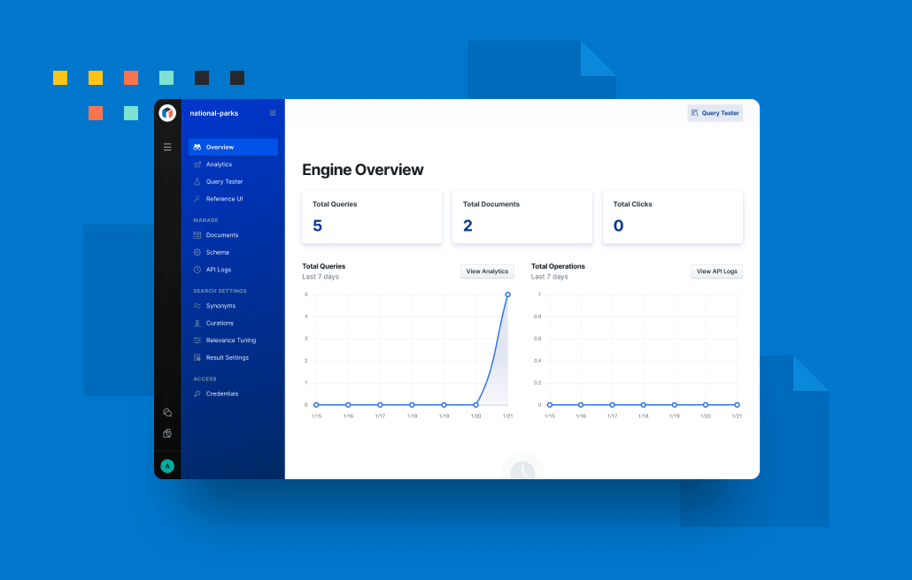
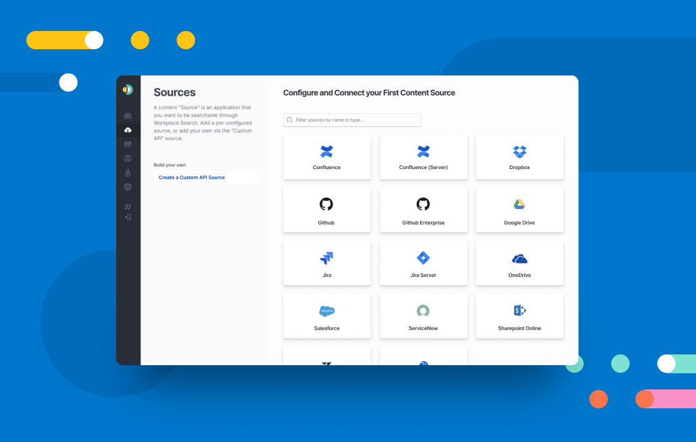

# Enterprise Search

## Overview

This plugin provides beta Kibana user interfaces for managing the Enterprise Search solution and its products, App Search and Workplace Search.

> :warning: The Kibana interface for Enterprise Search is a beta feature. It is subject to change and is not covered by the same level of support as generally available features. This interface will become the sole management panel for Enterprise Search with the 8.0 release. Until then, the standalone Enterprise Search UI remains available and supported.

### App Search



Add rich, relevant search to your apps and websites. https://www.elastic.co/app-search/

### Workplace Search



Unify all your team's content into a personalized search experience. https://www.elastic.co/workplace-search/

## Development

1. When developing locally, Enterprise Search should be running locally alongside Kibana on `localhost:3002`.
2. Update `config/kibana.dev.yml` with `enterpriseSearch.host: 'http://localhost:3002'`

Problems? If you're an Elastic Enterprise Search engineer, please reach out to @elastic/enterprise-search-frontend for questions or our in-depth Getting Started developer guide.

Don't forget to read Kibana's [contributing documentation](https://github.com/elastic/kibana/#building-and-running-kibana-andor-contributing-code) and developer guides for more general info on the Kibana ecosystem.

### Kea

Enterprise Search uses [Kea.js](https://github.com/keajs/kea) to manage our React/Redux state for us. Kea state is handled in our `*Logic` files and exposes [values](https://kea.js.org/docs/guide/concepts#values) and [actions](https://kea.js.org/docs/guide/concepts#actions) for our components to get and set state with.

#### Advanced Kea usage

For the most part, we stick to the functionality described in Kea's [core concepts](https://kea.js.org/docs/guide/concepts). However, in some files, we also take advantage of [props](https://kea.js.org/docs/guide/additional#props) and [events](https://kea.js.org/docs/guide/additional#events), as well as [manually mounting](https://kea.js.org/docs/guide/advanced#mounting-and-unmounting) some shared logic files on plugin init outside of React.

#### Debugging Kea

To debug Kea state in-browser, Kea recommends [Redux Devtools](https://kea.js.org/docs/guide/debugging). To facilitate debugging, we use the [path](https://kea.js.org/docs/guide/debugging/#setting-the-path-manually) key with `snake_case`d paths. The path key should always end with the logic filename (e.g. `['enterprise_search', 'some_logic']`) to make it easy for devs to quickly find/jump to files via IDE tooling.

## Testing

### Unit tests

Documentation: https://www.elastic.co/guide/en/kibana/current/development-tests.html#_unit_testing

Jest tests can be run directly from the `x-pack/plugins/enterprise_search` folder. This also works for any subfolders or subcomponents.

```bash
yarn test:jest
yarn test:jest --watch
```

Unfortunately coverage collection does not work as automatically, and requires using our handy jest.sh script if you want to run tests on a specific file or folder and only get coverage numbers for that file or folder:

```bash
# Running the jest.sh script from the `x-pack/plugins/enterprise_search` folder (vs. kibana root)
# will save you time and allow you to Tab to complete folder dir names
sh jest.sh {YOUR_COMPONENT_DIR}
sh jest.sh public/applications/shared/kibana
sh jest.sh server/routes/app_search
# When testing an individual file, remember to pass the path of the test file, not the source file.
sh jest.sh public/applications/shared/flash_messages/flash_messages_logic.test.ts
```

### E2E tests

See [our functional test runner README](../../test/functional_enterprise_search).
