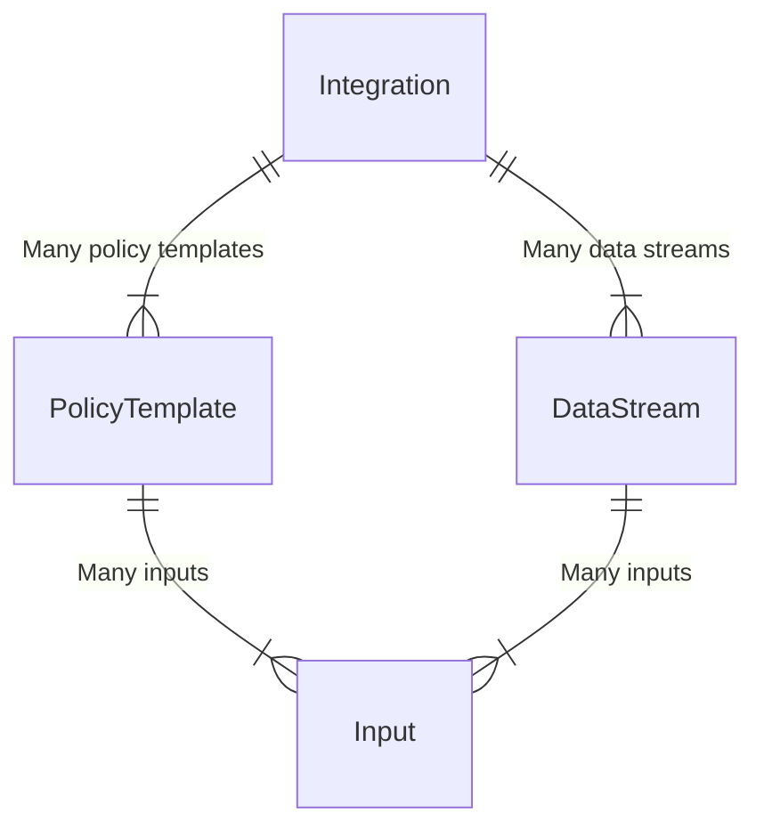

# Overview of Integrations

Elastic Agent integrations are mechanisms for installing assets that provide an opinionated "out of the box" experience for ingesting data from various pieces of software, third party services, and even internal Elastic products. Fleet provides an interface for installing and managing these integrations. Integrations tell Elastic Agent where and how to retrieve data, and how it should be ingested into Elasticsearch.

In terms of what an integration actually _is_, it's a set of mostly YML files in a particular directory structure with particular naming conventions. These conventions are captured in a specification maintained by Elastic called the [package spec](https://github.com/elastic/package-spec/).

This document will detail some of the key files and fields defined by the package spec that we'll commonly deal with in Fleet, and will attempt to provide an informed mental model around integrations. We'll use Fleet's integration policy editor UI to show how integrations' configuration files are translated into the Fleet interface we present to users.

## References

- https://github.com/elastic/package-spec
- https://github.com/elastic/integrations/tree/main/packages

## Top level `manifest.yml`

🔗 [Package spec reference](https://github.com/elastic/package-spec/blob/main/versions/1/integration/manifest.spec.yml)

- Basic metadata for the integration like name, title, version, description, categories, etc
- Kibana compatibility spec
- Screenshots and icon assets

### `policy_templates`

🔗 [Package spec reference](https://github.com/elastic/package-spec/blob/main/versions/1/integration/manifest.spec.yml#L186-L273)

The top level `manifest.yml` file defines a set of `policy_templates` which define a grouping of fields used to configure the integration. These `policy_templates` control what’s rendered in Fleet UI’s “policy editor” when creating or editing integration policies.

Most integrations will only specify a single `policy_template` as they don’t require this level of structure. For integrations that export many “sub-integrations,” however, they rely on defining multiple templates.

For example, Nginx defines only a single `policy_template` - aptly named `nginx`:

```yml
# https://github.com/elastic/integrations/blob/main/packages/nginx/manifest.yml
policy_templates:
  - name: nginx
    title: Nginx logs and metrics
    description: Collect logs and metrics from Nginx instances
    inputs:
    # ...
```

This results in a policy editor UI that looks like this:


In contrast, the AWS integration defines many `policy_templates`, as it allows users to configure policy values for many distinct services like EC2, S3, or RDS. See the `policy_templates` definition for AWS [here](https://github.com/elastic/integrations/blob/main/packages/aws/manifest.yml#L77).

The AWS policy editor has a section for each provided `policy_template` value, e.g.


Each policy template is also exposed as its own distinct integration, and can be installed or managed separately as if it were a first-class integration:


#### `inputs`

🔗 [Package spec reference](https://github.com/elastic/package-spec/blob/main/versions/1/integration/manifest.spec.yml#L221-L261)

Each `policy_template` entry defines a set of `inputs`. An `input` is essentially a named grouping of fields related to a particular type of data to be ingested.

For example, the Nginx integration defines three inputs:

1. `logfile`
2. `httpjson`
3. `nginx/metrics`

These inputs appear in the policy editor UI as separate fieldsets, e.g.


Each input can define a list of `vars` that will allow a user to configure variables via form fields in the Fleet policy editor UI.

For example, on the Nginx integration's `httpjson` input, there are several "input level variables" configure, which are rendered as below:


These input level variables are defined in the Nginx integration [here](https://github.com/elastic/integrations/blob/main/packages/nginx/manifest.yml#L43).

It's important to note that integration also define variables at the data stream level, which we'll get into later in this doc. In the screenshot above, for example, the section beneath the "Settings" section of the `httpjson` input contains data stream variables for the streams configured as part of the `httpjson` input.

## `data_stream` directory

Each integration includes a `data_stream` directory that contains configuration for, well, [data streams](https://www.elastic.co/guide/en/elasticsearch/reference/current/data-streams.html).

Data streams are a construct in Elasticsearch designed for storing "append-only" time series data across multiple backing indices. They give Elastic Agent an easy and performant way to ingest logs and metrics data into Elasticsearch.

Inside of the `data_stream` directory, each data stream is defined as its own directory. For example, the Nginx integration's `data_stream` [directory](https://github.com/elastic/integrations/tree/main/packages/nginx/data_stream) contains three data streams:

1. `access`
2. `error`
3. `substatus`

Elastic Agent data streams conform to a [naming schema](https://www.elastic.co/blog/an-introduction-to-the-elastic-data-stream-naming-scheme) of `{type}-{dataset}-{namespace}`. The `type` of a data stream is either `logs` or `metrics`. The `dataset` of a datastream is controlled in most cases by an interpolation of the integration's `name` field and the directory name containing the data stream's `manifest.yml` file. The `namespace` value is provided by the user for the purpose of grouping or organizing data.

Each data stream directory contains a `manifest.yml` file that controls the configuration for the data stream, as well as Elasticsearch/Kibana assets, configuration for Agent, and more. Generally, though, the `manifest.yml` file is the most critical one in a given data stream directory.

In a data stream's `manifest.yml` file, the integration defines a list of `streams`. Each item in that `streams` list is tied to a single `input`, and defines its own list of `vars` that controls the set of form fields that appear in the policy editor UI.

For example, the Nginx integration's `access` data stream defines an entry in its `streams` list tied to the `logfile` input mentioned above that includes variables like `paths` and `tags`. The variables appear as form fields in the policy editor UI as below:


The "Nginx access logs" fieldset we see in the policy editor UI is defined [here](https://github.com/elastic/integrations/blob/main/packages/nginx/data_stream/access/manifest.yml#L4-L40) in the `data_streams/access/manifest.yml` file within the Nginx integration. It's `input` value is set to `logfile`, so it appears under the "Collect logs from Nginx instances" section in the policy editor. The `title` and `description` values control what appears on the left-hand side to describe the fieldset.

For more information on data streams, see Fleet's dev docs [here](https://github.com/elastic/kibana/blob/main/x-pack/plugins/fleet/dev_docs/data_streams.md).

## Relationship diagram

Reference the following diagram to understand the relationship between the various components of an integration:


