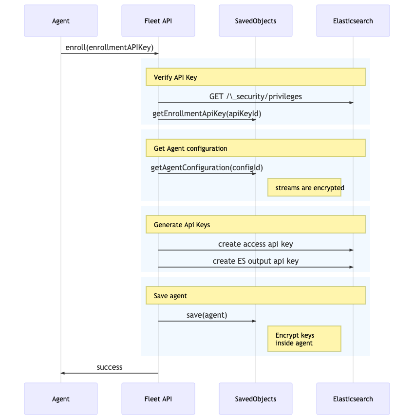
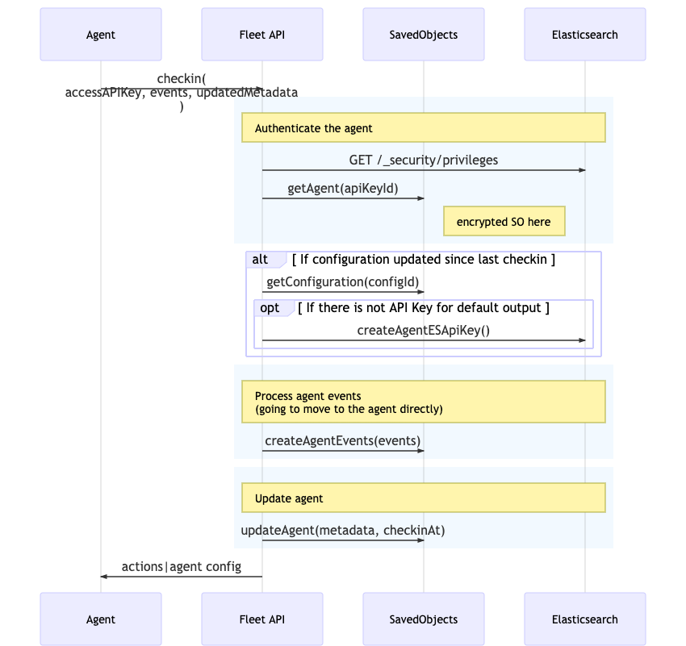

# Fleet <-> Agent Interactions

## Agent enrollment and checkin

Fleet workflow:

- an agent enroll to fleet using an enrollment token.
- Every n seconds agent is polling the checkin API to send events and check for new configuration

### Agent enrollment

An agent must enroll using the REST Api provided by fleet.
When an agent enroll Fleet:

- verify the Enrollment token is a valid ES API key
- retrieve the Saved Object (SO) associated to this api key id (this SO contains the configuration|policy id)
- create an ES ApiKey unique to the agent for accessing kibana during checkin
- create an ES ApiKey per output to send logs and metrics to the output
- Save the new agent in a SO with keys encrypted inside the agent SO object

### Agent checkin

Agent are going to poll the checkin API to send events and check for new configration. To checkin agent are going to use the REST Api provided by fleet.

When an agent checkin fleet:

- verify the access token is a valid ES API key
- retrieve the agent (SO associated to this api key id)
- Insert events SO
- If the Agent configuration has been updated since last checkin
  - generate the agent config
  - Create the missing API key for agent -> ES communication
- Save the new agent (with last checkin date) in a SavedObject with keys encrypted inside the agent

### Agent acknowledgement

This is really similar to the checkin (same auth mecanism) and it's used for agent to acknowlege action received during checkin.

An agent can acknowledge one or multiple actions by calling `POST /api/ingest_manager/fleet/agents/{agentId}/acks`

## Other interactions

### Agent Configuration update

When a configuration is updated, every SO agent running this configuration is updated with a timestamp of the latest config.
