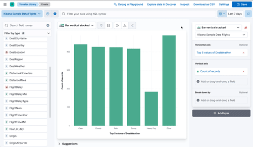

Lens is a visualization editor allowing to quickly and easily configure compelling visualizations to use on dashboards and canvas workpads.

# Lens Embedding

It's possible to embed Lens visualizations in other apps using `EmbeddableComponent` and `navigateToPrefilledEditor`
exposed via contract. For more information check out the example in `x-pack/examples/embedded_lens_example`.

### Embedding guidance

When adding visualizations to a solution page, there are multiple ways to approach this with pros and cons:

* #### **Use a dashboard**
  If the app page you are planning to build strongly resembles a regular dashboard, it might not even be necessary to write code - configuring a dashboard might be a better choice. Portable dasboards make it possible to embed a dashboard into your application, which allows you to offer visualization and filter functionality without writing custom code. If possible this option should be chosen because of the low maintenance and development effort as well as the high flexibility for a user to clone the preset dashboard and start customizing it in various ways.

  Pros:
   * No need to write and maintain custom code
   * "Open in Lens" comes for free
   * Ability for the user to customize/add/remove dashboard panels comes for free
  
  Cons:
   * Limited data processing/visualization options - if the dashboard doesn't support it, it can't be used
* #### **Use Lens embeddable**
  Using the Lens embeddable is an easy way to handle the rendering of charts. It allows you to specify data fetching and presentational properties of the final chart in a declarative way (the "Lens attributes") - everything is handled within the component (including re-fetching data on changing inputs). By using the `navigateToPrefilledEditor` method which takes the same configuration as the embeddable component, adding an "Open in Lens editor" button to your application comes at almost no additional cost. Such a button is always recommended as it allows a user to drill down further and explore the data on their own, using the current chart as a starting point. This approach is already widely deployed and should be the default choice for new visualizations.

  Pros:
   * No need to manage searches and rendering logic on your own
   * "Open in Lens" comes for free
   * Simple extended visualization options - if Lens can't do it, there's also a limited set of overrides to customize the final result
  
  Cons:
   * Each panel does its own data fetching and rendering (can lead to performance problems for high number of embeddables on a single page, e.g. more than 20)
   * Limited data processing options - if the Lens UI doesn't support it, it can't be used


* #### **Using custom data fetching and rendering**
  In case the disadvantages of using the Lens embeddable heavily affect your use case, it sometimes makes sense to roll your own data fetching and rendering by using the underlying APIs of search service and `elastic-charts` directly. This allows a high degree of flexibility when it comes to data processing, efficiently querying data for multiple charts in a single query and adjusting small details in how charts are rendered. In this case, almost always an "Open in Lens" button can still be offered to the user to drill down and further explore the data by generating a Lens configuration which is similar to the displayed visualization given the possibilities of Lens. Keep in mind that for the "Open in Lens" flow, the most important property isn't perfect fidelity of the chart but retaining the mental context of the user when switching so they don't have to start over. It's also possible to mix this approach with Lens embeddables on a single page.  **Note**: In this situation, please let the Visualizations team know what features you are missing / why you chose not to use Lens.

  Pros:
   * Full flexibility in data fetching optimization and chart rendering
  
  Cons:
   * "Open in Lens" requires additional logic
   * Should follow elastic charts api changes

## Getting started

The `EmbeddableComponent` react component is exposed on the Lens plugin contract. In order to use it, 
* Make sure you have a data view created for the data you plan to work with
* Add `lens` to `requiredPlugins` in your plugins `kibana.json`
* In the mount callback of your app, get `lens.EmbeddableComponent` from the start contract and pass it into your apps react tree
* In the place where you want to render a visualization, add the component to the tree:
```tsx
<div>
  // my app
  <EmbeddableComponent
    id=""
    style={{ height: 500 }}
    timeRange={{ from: 'now - 15m', to: 'now' }}
    attributes={attributes}
  />
</div>
```

You can see a working example of this in the `x-pack/examples/embedded_lens_example` directory.

The `attributes` variable contains the configuration for the Lens visualization. The details are explained in the section below. It's difficult to set up this object manually, in order to quickly get to a functioning starting point, start your Kibana server with example plugins via
```
yarn start --run-examples
```

This will add an `Open in Playground` action to the menu bar in the Lens editor. With this option, try to configure the chart configuration directly in the editor, then open it in the playground to see the attributes object to copy. This works for any possible Lens visualization.



## Lens attributes explained

The Lens attributes object contains multiple sections concerned with different aspects of the visualizations.

On a high level there are references, datasource state, visualization state and filters:

### References

References (`references`) are regular saved object references forming a graph of saved objects which depend on each other. For the Lens case, these references can be annotation groups or data views (called `type: "index-pattern"` in code), referencing permanent data views which are used in the current Lens visualization. Often there is just a single data view in use, but it's possible to use multiple data views for multiple layers in a Lens xy chart. The `id` of a reference needs to be the saved object id of the referenced data view (see the "Handling data views" section below). The `name` of the reference is comprised out of multiple parts used to map the data view to the correct layer : `indexpattern-datasource-layer-<id of the layer>`. Even if multiple layers are using the same data view, there has to be one reference per layer (all pointing to the same data view id). References array can be empty in case of adhoc dataviews (see section below).


### Ad-hoc data views

In some cases a globally accessible data view is not desirable:
* You need some special runtime fields which only make sense in the context of that one visualization and you don't want to "pollute" the global data view for all consumers
* It's a "one-off" visualization which is built on data that's not normally used and having a global data view object for it would be weird
* You want to allow a read-only user to work with data and no data view exists yet - the user isn't allowed to create data views but they are allowed to access the data

In these situations ad-hoc data views are useful - these are data views which are stored as part of the Lens visualization itself, so they do not show up in other contexts. In the UI you can create these by opening the data view picker, selecting "Create a data view" and then using the "Use without saving" button.

Ad-hoc data views are part of the Lens attributes stored in `state.adHocDataViews`. Each data view is defined by its JSON-serializable `DataViewSpec` object. If a layer is using an ad hoc data view, the reference goes into the `state.internalReferences` array instead of the external `references` array.

Example:
```json
"state": {
  // ...
  "internalReferences": [
    {
      "type": "index-pattern",
      "id": "adhoc-1",
      "name": "indexpattern-datasource-layer-layer1"
    }
  ],
  "adHocDataViews": {
    "adhoc-1": {
      "id": "adhoc-1",
      "title": "my-pattern*",
      "timeFieldName": "@timestamp",
      "sourceFilters": [],
      "fieldFormats": {},
      "runtimeFieldMap": {},
      "fieldAttrs": {},
      "allowNoIndex": false,
      "name": "My ad-hoc data view"
    }
  }
}
```

### Datasource state

The data source state (`state.datasourceStates.formBased.layers`) contains the configuration state of the data fetching and processing part of Lens. It's not specific to a certain representation (xy, pie, gauge, ...), but instead it defines a data table per layer made out of columns with various properties. This data table is passed over to the visualization state which maps it to various dimensions of the specific visualization. Layer and columns have unique ids which are shared amongst visualization and datasource - it's important to make sure they are always in sync. The keys of the `state.datasourceStates.formBased.layers` object are the layer ids. Lens editor chooses uuids for these, but when programmatically generating Lens attributes, any string can be used for them. The `layers[<layer id>].columns` object is constructed in a similar way (keys represent the column ids). The `operationType` property defines the type of the column, other properties depend on the specific operation. Types for individual parts of the datasource state are provided (check the `lens/public` export, e.g. there's the `MaxIndexPatternColumn` for a column of operation type `max`)

### Visualization state

The visualization state (`state.visualization`) depends on the chosen visualization type (`visualizationType`). Layer ids and accessor properties in this state have to correspond to the layer ids and column ids of the datasource state. Types for individual visualizations are exported as standalone interfaces (e.g. `XYState` or `HeatmapVisualizationState`).

### Filters

Filters and query `state.filters`/`state.query` define the visualization-global filters and query applied to all layers of the visualization. The query is rendered in the top level search bar in the editor while filters are rendered as filter pills. Filters and query state defined this way is used for dashboards and Discover in the same way.

### Callbacks

The `EmbeddableComponent` also takes a set of callbacks to react to user interactions with the embedded Lens visualization to integrate the visualization with the surrounding app: `onLoad`, `onBrushEnd`, `onFilter`, `onTableRowClick`. A common pattern is to keep state in the solution app which is updated within these callbacks - re-rendering the surrounding application will change the Lens attributes passed to the component which will re-render the visualization (including re-fetching data if necessary).

#### Preventing defaults

In some scenarios it can be useful to customize the default behaviour and avoid the default Kibana triggers for a specific action, like add a filter on a bar chart/pie slice click. For this specific requirement the `data` object returned by the `onBrushEnd`, `onFilter`, `onTableRowClick` callbacks has a special `preventDefault()` function that will prevent other registered event triggers to execute:

```tsx
<EmbeddableComponent
  // ...
  onFilter={(data) => {
    // custom behaviour on "filter" event
    ...
    // now prevent to add a filter in Kibana 
    data.preventDefault();
  }}
/>
```

## Handling data views

In most cases it makes sense to have a data view saved object to use the Lens embeddable. Use the data view service to find an existing data view for a given index pattern or create a new one if it doesn't exist yet:
```ts
let dataView = (await dataViews.find('my-pattern-*', 1))[0];
if (!dataView) {
  dataView = await dataViews.createAndSave({
    title: 'my-pattern-*',
    timeFieldName: '@timestamp'
  });
}
const dataViewIdForLens = dataView.id;
```

**Important!** To prevent conflicts, it's important to not re-use ad-hoc data view ids for different specs. If you change the spec in some way, make sure to also change its id. This even applies across multiple embeddables, sessions, etc. Ideally, the id will be globally unique. You can use the `uuid` package to generate a new unique id every time when you are changing the spec in some way. However, make sure to also not change the id on every single render either, as this will have a substantial performance impact.

## Refreshing a Lens embeddable

The Lens embeddable is handling data fetching internally, this means as soon as the props change, it will trigger a new request if necessary. However, in some situations it's necessary to trigger a refresh even if the configuration of the chart doesn't change at all. Refreshing is managed using search sessions is Lens. To trigger a refresh without changing the actual configuration of a Lens embeddable, follow these steps:
* Pull in the contract of the `data` plugin. It contains the session service at `plugins.data.search.session`.
* When loading the app containing a Lens embeddable, start a new session using `session.start`. It returns the current session id - keep it in the state of our app (e.g. a `useState` hook or your redux store)
* Pass the current session id to the Lens embeddable component via the `searchSessionId` property
* When refreshing, simply call `session.start` again and update your state - Lens will discard the existing cache and re-fetch even if the query doesn't change at all
* When unmounting your app, call `session.clear` to end the current session

## Performance considerations

As the Lens embeddable is doing data fetching and processing internally as soon as props are passed to it, it's beneficial to make sure it's not rendered with new props if that's avoidable. Lens is aborting in-flight search requests as soon as the chart configuration changes based on props, but there's still non-trivial work kicked off in multiple parts of the stack. To avoid this, make sure to keep these things in mind:
* Changing the reference of the `attributes` prop will cause the Lens vis to re-initialize from scratch. Try to keep it stable as long as possible, e.g. by using `useMemo` instead of re-constructing it on the fly on every render
* Pass time range and filters in via the dedicated props instead of part of the `attributes` to avoid re-initalization. Changing time range or filters might kick off another search request so it makes sense to keep this stable as well, but this can also be controlled somewhat by the session id (see section above)
* The chart will adjust itself automatically to layout changes, no need to trigger another re-render in this situation


## Getting data tables and requests/responses

The Lens embeddable is handling both data fetching and rendering - all the user has to do is to supply the configuration. However in some cases the resulting values are necessary for other parts of the UI - to access them pass supply an `onLoad` callback prop to the component. It will be called with an `adapters` object which allows you to access the current data tables and requests/responses:

```tsx
<EmbeddableComponent
  // ...
  onLoad={(isLoading, adapters) => {
    if (adapters?.tables) {
      // use the current data table, e.g. putting it into the react state of the consuming application.
    }
  }}
/>
```

## Overrides

The Lens embeddable offers a way to extends the current set of visualization feature provided within the Lens editor, via the `overrides` property, which enables the consumer to override some visualization configurations in the embeddable instance.

```tsx
<EmbeddableComponent
  // ...
  overrides={{
    settings: {legendAction: 'ignore'},
    axisX: {hide: true}
  }}
/>
```

The each override is component-specific and it inherits the prop from its `elastic-charts` definition directly. Callback/handlers are not supported as functions, but the special value `"ignore"` can be provided in order to disable them in the embeddable rendering.
**Note**: overrides are only applied to the local embeddable instance and will disappear when the visualization is open in the Lens editor.

# Lens Development

The following sections are concerned with developing the Lens plugin itself.
## Testing

Run all tests from the `x-pack` root directory

- Unit tests: `yarn test:jest x-pack/plugins/lens`
- Functional tests:
  - Run `node scripts/functional_tests_server`
  - Run `node ../scripts/functional_test_runner.js --config ./test/functional/apps/lens/group1/config.ts`
  - Run `node ../scripts/functional_test_runner.js --config ./test/functional/apps/lens/group2/config.ts`
  - ...
  - Run `node ../scripts/functional_test_runner.js --config ./test/functional/apps/lens/group6/config.ts`
- API Functional tests:
  - Run `node scripts/functional_tests_server`
  - Run `node ../scripts/functional_test_runner.js --config ./test/api_integration/config.ts --grep=Lens`
- Performance journeys:
  - Run `node scripts/functional_tests_server.js --config x-pack/test/performance/journeys_e2e/data_stress_test_lens/config.ts`
  - Run `node scripts/functional_test_runner --config x-pack/test/performance/journeys_e2e/data_stress_test_lens/config.ts`

## Developing tips

Lens state is kept in the Redux Store. To enable redux logger, open Chrome Developer Tools and type in the console: `window.ELASTIC_LENS_LOGGER=true`.

To simulate long running searches, set `data.search.aggs.shardDelay.enabled` in your `kibana.dev.yml` to true and set the dealy via console in the browser (e.g. for a 20 seconds delay): `window.ELASTIC_LENS_DELAY_SECONDS=20`.

## UI Terminology

Lens has a lot of UI elements – to make it easier to refer to them in issues or bugs, this is a hopefully complete list:

* **Top nav** Navigation menu on top of the app (contains Save button)
  * **Query bar** Input to enter KQL or Lucene query below the top nav
  * **Filter bar** Row of filter pills below the query bar
  * **Time picker** Global time range configurator right to the query bar
* **Data panel** Panel to the left showing the field list
  * **Field list** List of fields separated by available and empty fields in the data panel
  * **Index pattern chooser** Select element switching between index patterns
  * **Field filter** Search and dropdown to filter down the field list
  * **Field information popover** Popover showing data distribution; opening when clicking a field in the field list
* **Config panel** Panel to the right showing configuration of the current chart, separated by layers
  * **Layer panel** One of multiple panels in the config panel, holding configuration for separate layers
    * **Dimension trigger** Chart dimension like "X axis", "Break down by" or "Slice by" in the config panel
    * **Dimension container** Container shown when clicking a dimension trigger and contains the dimension settints
    * **Layer settings popover** Popover shown when clicking the button in the top left of a layer panel
* **Workspace panel** Center panel containing the chart preview, title and toolbar
  * **Chart preview** Full-sized rendered chart in the center of the screen
  * **Toolbar** Bar on top of the chart preview, containing the chart switcher to the left with chart specific settings right to it
    * **Chart switch** Select to change the chart type in the top left above the chart preview
    * **Chart settings popover** Popover shown when clicking the "Settings" button above the chart preview
* **Suggestion panel** Panel to the bottom showing previews for suggestions on how to change the current chart


# Inline Editing of a Lens Embeddable

If you have a Lens embeddable in your application and you want to allow inline editing you can do it with 3 ways:
- If you use a portable dashboard, the functionality is built in and you don't need to do anything
- If you don't have a portable dashboard then you can use UI actions to retrieve the inline editing component. For more information check out the example in `x-pack/examples/lens_embeddable_inline_editing_example`.
- The component is also exported from Lens start contract. Check the `EditLensConfigPanelApi`. This is advised to be used only when the 2 above cases can't be used.