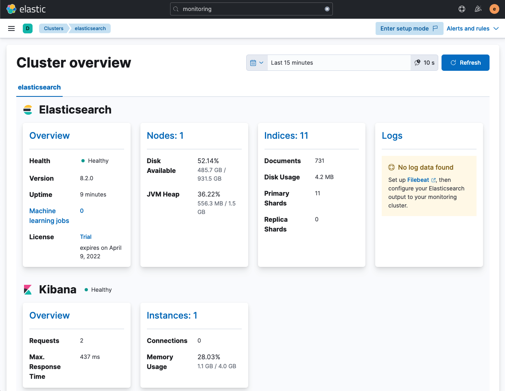

# Basic setups

## Yarn and internal collection

For the simplest Elasticsearch & Kibana stack monitoring setup from a kibana clone, using [internal collection](../reference/terminology.md#internal-collection), first start elasticsearch with monitoring and a local [exporter](../reference/terminology.md#exporter) enabled.

```shell
yarn es snapshot --license trial \
  -E xpack.monitoring.collection.enabled=true \ 
  -E xpack.monitoring.exporters.id0.type=local
```

Then start kibana:

```shell
yarn start
```

Open kibana and navigate to "Stack Monitoring" (sidebar, homepage, or search bar). You should see a page like this.



This is definitely the simplest way to get some data to explore, but internal collection is a deprecated collection mode, so next we'll use metricbeat collection.

## Yarn and metricbeat collection

To setup stack monitoring with [metricbeat collection](../reference/terminology.md#metricbeat-collection), first start elasticsearch with a trial license.

```shell
yarn es snapshot --license trial
```

Next, we'll need to give kibana a fixed base url so metricbeat can query it. So add this to your `kibana.dev.yml` file:

```yml
server.basePath: '/ftw'
```

Then start kibana:

```shell
yarn start
```

Next start metricbeat. Any method of [installing metricbeat](https://www.elastic.co/guide/en/beats/metricbeat/current/metricbeat-installation-configuration.html) works fine. We'll use docker since it is a good common point regardless of your development OS.

```shell
docker run --name metricbeat \
  --pull always --rm \
  --hostname=metricbeat \
  --publish=5066:5066 \
  --volume="$(pwd)/x-pack/plugins/monitoring/dev_docs/reference/metricbeat.yarn.yml:/usr/share/metricbeat/metricbeat.yml:ro" \
  docker.elastic.co/beats/metricbeat:master-SNAPSHOT
```

## Filebeat for logs

Regardless of the metrics collection method, logs will get collected using filebeat.

Similar to metricbeat, any method of [installing filebeat](https://www.elastic.co/guide/en/beats/filebeat/current/filebeat-installation-configuration.html) works fine. We'll use docker again here as a good common point.

```shell
docker run --name filebeat \
  --pull always --rm \
  --hostname=filebeat \
  --publish=5067:5067 \
  --volume="$(pwd)/.es:/es:ro" \
  --volume="$(pwd)/x-pack/plugins/monitoring/dev_docs/reference/filebeat.yarn.yml:/usr/share/filebeat/filebeat.yml:ro" \
  docker.elastic.co/beats/filebeat:master-SNAPSHOT
```

# Complete docker setup

We also maintain an internal docker-compose setup for running a full stack with monitoring enabled for all components. See https://github.com/elastic/observability-dev/tree/main/tools/docker-testing-cluster for more details.

# Running components from source

WIP porting from https://github.com/elastic/observability-dev/blob/main/docs/monitoring/monitoring-simulation-notes.md