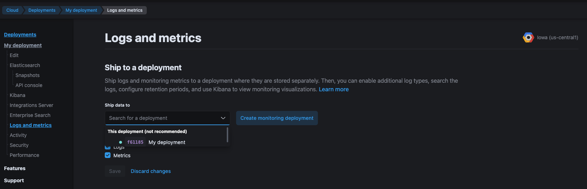

First sign up on https://cloud.elastic.co/ and create a deployment in any convenient region, possibly one close to you.

> **Elasticians**: Please use your work email address when signing up to avoid trial expiration. Also review the (internal) [Cloud First Testing](https://docs.elastic.dev/dev/guides/cloud-first-testing) documentation for additional features available to you.

Once the deployment is created, enable logging and monitoring as covered in the Elasticsearch Service documentation under [Enable logging and monitoring](https://www.elastic.co/guide/en/cloud/current/ec-enable-logging-and-monitoring.html#ec-enable-logging-and-monitoring-steps).

For testing purposes, shipping data to the same deployment you just created is fine.



Once the plan is done you can open Stack Monitoring in the deployment's kibana.

To connect a locally running instance of kibana to the cloud cluster, you'll need to create a user for it. You can do this via the UI, but here's a curl example for copy-pasting.

First, set your endpoint and password as shell variables:

```shell
ELASTICSEARCH_ENDPOINT='<<<elasticsearch endpoint shown on cloud.elastic.co>>>'
ELASTIC_PASSWORD='<<<elastic password displayed during deployment creation>>>'
```

Then create a `kibana_dev` user with the same password. `kibana_system` is already in use by the kibana launched by the elasticsearch service:

```shell
curl -X PUT ${ELASTICSEARCH_ENDPOINT}/_security/user/kibana_dev \
  -H "Content-Type: application/json" \
  -u "elastic:${ELASTIC_PASSWORD}" \
  -d @- <<JSON
    { "password": "${ELASTIC_PASSWORD}", "roles": [ "kibana_system" ] }
JSON
```

Then create a kibana configuration for the deployment:

```shell
cat > config/kibana.cloud.yml <<YAML
elasticsearch.hosts: ${ELASTICSEARCH_ENDPOINT}
elasticsearch.username: kibana_dev
elasticsearch.password: ${ELASTIC_PASSWORD}
elasticsearch.ignoreVersionMismatch: true
monitoring.ui.container.elasticsearch.enabled: true
YAML
```

And start kibana with that config:

```shell
yarn start --config config/kibana.cloud.yml
```

Note that your local kibana will run data migrations and probably render the cloud created kibana unusable after your local kibana starts up.
