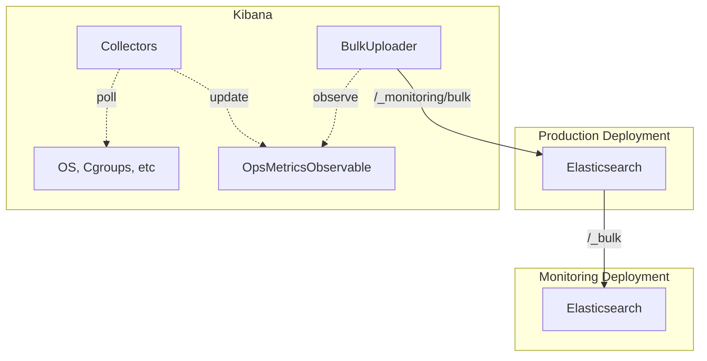
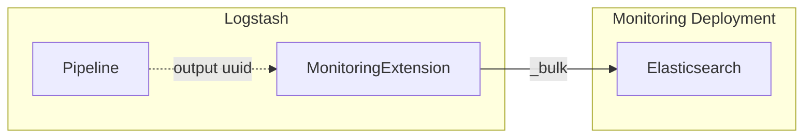
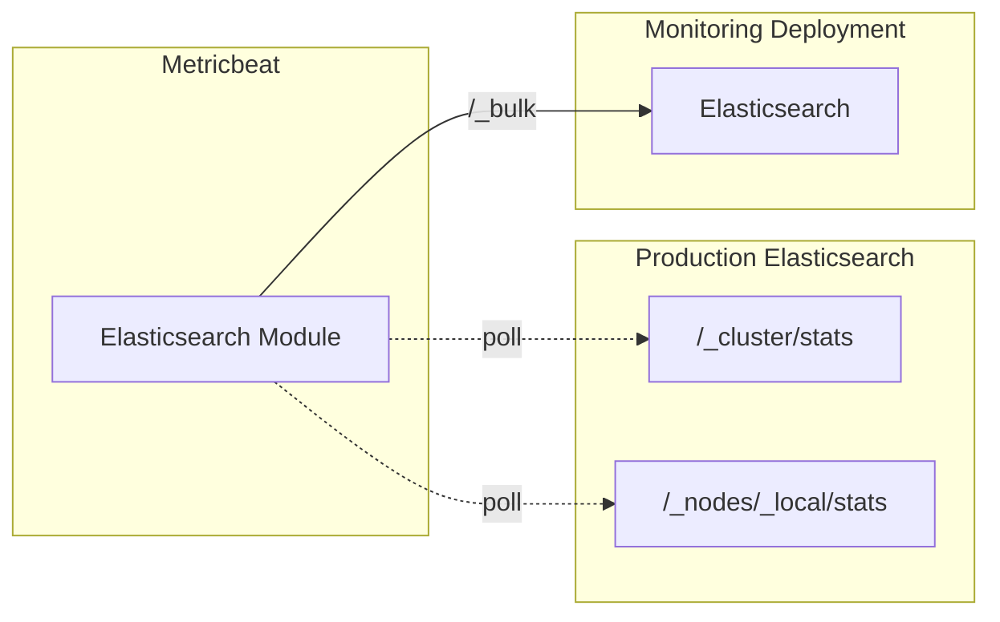
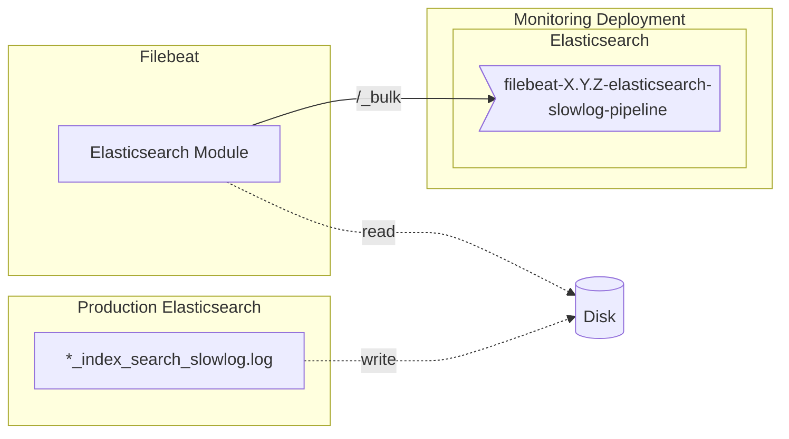
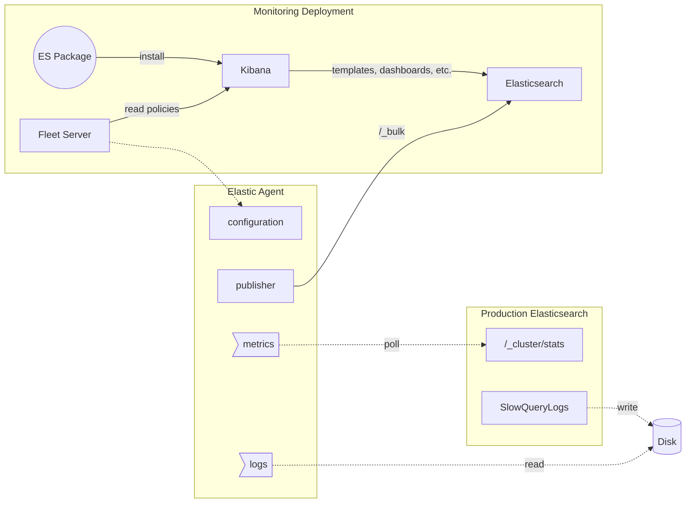

Stack monitoring has three metrics collection modes:

- Previous standard, still supported: [Internal collection](#internal-collection)
- Current standard: [Standalone Metricbeat collection](#standalone-metricbeat-collection)
- Planned future standard: [Package-driven collection](#package-driven-collection)

And two log collection modes:

- Current standard: [Filebeat log collection](#logs-collection-filebeat)
- Planned future standard: [Package-driven collection](#package-driven-collection)

> **Note**: In the following sections "Beats" is used to refer to any stack component based on libbeat because the data collection modes are the same for any process in this group. This notably includes apm-server and fleet server.
 
## Metrics collection

### Internal collection

When using internal collection, each component in your Elastic stack will collect its own data via its own mechanism. In general this is an in-memory structure, but the implementation details vary per component.

On a cycle (typically 10 seconds), each stack component then typically publishes the internally collected metrics to the [production deployment](../reference/terminology.md#production-deployment).

Here's a diagram using kibana as an example. Other stack components have similar collection and publishing mechanisms.

The production cluster receives these metrics on the `/_monitoring/bulk` endpoint in elasticsearch, then forwards them to the [monitoring deployment](../reference/terminology.md#monitoring-deployment) along with its own metrics. Or writes them directly to disk if only using a single deployment.

Alternatively some stack components (logstash & beats) can be configured to send data directly to the [monitoring deployment](../reference/terminology.md#monitoring-deployment) either using a user-provided cluster UUID, or sending the data with no UUID to be associated with the [standalone cluster](../reference/terminology.md#standalone-cluster).

Here's an example from Logstash, which is capable of sending data directly to a monitoring deployment. It will associate the data with the UUID of any elasticsearch clusters found in the pipeline outputs.

### Standalone Metricbeat collection

When using standalone metricbeat collection, each component in your Elastic stack exposes an endpoint for metricbeat to collect metric data.

Each component has a corresponding metricbeat module that will read the endpoint and publish data directly to the [monitoring deployment](../reference/terminology.md#monitoring-deployment).

- [Elasticsearch](https://github.com/elastic/beats/tree/main/metricbeat/module/elasticsearch)
- [Kibana](https://github.com/elastic/beats/tree/main/metricbeat/module/kibana)
- [Logstash](https://github.com/elastic/beats/tree/main/metricbeat/module/logstash)
- [Beats](https://github.com/elastic/beats/tree/main/metricbeat/module/beat)
- [Enterprise Search](https://github.com/elastic/beats/tree/main/x-pack/metricbeat/module/enterprisesearch)

Here's an example using Elasticsearch. All other components implement similar HTTP endpoints and metricbeat modules.

You can monitor many components from a single metricbeat process as is typically done during local development. You can also have a dedicated metricbeat process for each instance in a deployment as is done on ESS.

## Logs collection (Filebeat)

Regardless of the metrics collection mode, logs should always be collected using filebeat. Filebeat ships with a module for some stack components that can be used to collect the logs for that component.

- [Elasticsearch](https://github.com/elastic/beats/tree/main/filebeat/module/elasticsearch)
- [Kibana](https://github.com/elastic/beats/tree/main/filebeat/module/kibana)
- [Logstash](https://github.com/elastic/beats/tree/main/filebeat/module/logstash)
 
Stack Monitoring will read those same logs, as configured by the `monitoring.ui.logs.index` setting.

For example, in the case of the elasticsearch filebeat module reading slow query logs and writing to the corresponding pipeline on Elasticsearch:

Enterprise Search doesn't have a filebeat module, but the logs can be ingested using the configuration found at https://github.com/elastic/ent-search-monitoring/blob/main/filebeat/filebeat.yml 

Beats also doesn't have filebeat module or recommended configuration, but the logs can be ingested using a basic JSON filebeat configuration.

## Unified collection

### Package-driven collection

When using package-driven collection, each component in your Elastic stack is given a corresponding fleet package (also known as "integration").

- [Elasticsearch](https://github.com/elastic/integrations/tree/main/packages/elasticsearch)
- [Kibana](https://github.com/elastic/integrations/tree/main/packages/kibana)
- [Logstash](https://github.com/elastic/integrations/tree/main/packages/logstash)
- Beats (WIP)
- Enterprise Search (WIP)

An operator will install the package via the monitoring deployment's kibana instance (or possible a separate deployment used for fleet management).

The [Elastic agents](https://github.com/elastic/elastic-agent) connected to [Fleet Server](https://github.com/elastic/fleet-server) then use the package configuration to collect metrics and logs from each component according to its requirements. This is likely similar to standalone metricbeat and filebeat and may use the same modules internally.

Over time the exact collection mechanism may change since it's an implementation detail of package-driven collection rather than something a user would have to manually configure.

Here an example using the elasticsearch package to collect logs and metrics from elasticsearch:

