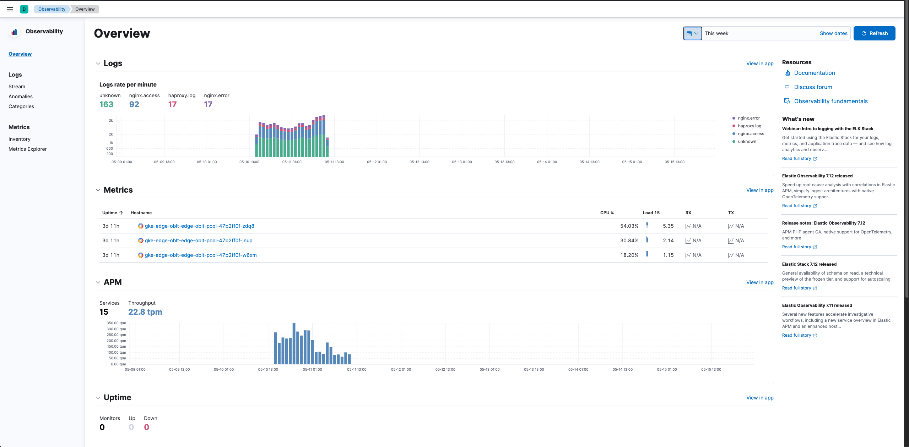

## Overview

Observability solutions can register their navigation structures via the Observability plugin, this ensures that these navigation options display in the Observability page template component. This is a two part process, A) register your navigation structure and B) consume and render the shared page template component. These two elements are documented below.

## Navigation registration

To register a solution's navigation structure you'll first need to ensure your solution has the observability plugin specified as a dependency in your `kibana.json` file, e.g.

```json
"requiredPlugins": [
    "observability"    
],
```

Now within your solution's **public** plugin `setup` lifecycle method you can call the `registerSections` method, this will register your solution's specific navigation structure with the overall Observability navigation registry. E.g.

```typescript
// x-pack/plugins/example_plugin/public/plugin.ts

import { of } from 'rxjs';

export class Plugin implements PluginClass {
  constructor(_context: PluginInitializerContext) {}

  setup(core: CoreSetup, plugins: PluginsSetup) {
    plugins.observability.navigation.registerSections(
      of([
        {
          label: 'A solution section',
          sortKey: 200,
          entries: [
            { label: 'Example Page', app: 'exampleA', path: '/example' },
            { label: 'Another Example Page', app: 'exampleA', path: '/another-example' },
          ],
        },
        {
          label: 'Another solution section',
          sortKey: 300,
          entries: [
            { label: 'Example page', app: 'exampleB', path: '/example' },
          ],
        },
      ])
    );
  }

  start() {}

  stop() {}
}
```

Here `app` would match your solution - e.g. logs, metrics, APM, uptime etc. The registry is fully typed so please refer to the types for specific options.

Observables are used to facilitate changes over time, for example within the lifetime of your application a license type or set of user permissions may change and as such you may wish to change the navigation structure. If your navigation needs are simple you can pass a value and forget about it. **Solutions are expected to handle their own permissions, and what should or should not be displayed at any time**, the Observability plugin will not add and remove items for you.

The Observability navigation registry is now aware of your solution's navigation needs ✅

## Page template component

The shared page template component can be used to actually display and render all of the registered navigation structures within your solution.

The `start` contract of the public Observability plugin exposes a React component, under `navigation.PageTemplate`.

This can be accessed like so:

```
const [coreStart, pluginsStart] = await core.getStartServices();
const ObservabilityPageTemplate = pluginsStart.observability.navigation.PageTemplate;
```

Now that you have access to the component you can render your solution's content using it.

```jsx
 <ObservabilityPageTemplate
    pageHeader={{
        pageTitle: SolutionPageTitle,
        rightSideItems: [
            // Just an example
            <DatePicker
            rangeFrom={relativeTime.start}
            rangeTo={relativeTime.end}
            refreshInterval={refreshInterval}
            refreshPaused={refreshPaused}
            />,
        ],
    }}
    >
    // Render anything you like here, this is just an example.
    <EuiFlexGroup>
        <EuiFlexItem>
            // Content
        </EuiFlexItem>

        <EuiFlexItem>
            // Content
        </EuiFlexItem>
    </EuiFlexGroup>
</ObservabilityPageTemplate>
```

The `<ObservabilityPageTemplate />` component is a wrapper around the `<KibanaPageTemplate />` component (which in turn is a wrapper around the `<EuiPageTemplate>` component). As such the props mostly reflect those available on the wrapped components, again everything is fully typed so please refer to the types for specific options. The `pageSideBar` prop is handled by the component, and will take care of rendering out and managing the items from the registry.

After these two steps we should see something like the following (note the navigation on the left):


