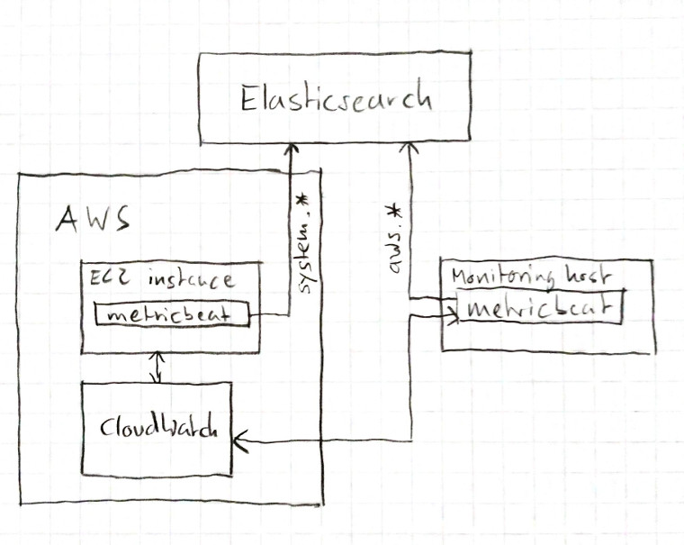

# metricbeat / aws

This guide explains how to set up
* `metricbeat` on a AWS instance to report `system` metrics
* `metricbeat` on your local machine to report `aws` metrics through CloudWatch and the `aws` module

This is helpful to develop and test the following features in the Kibana Metrics UI:
* returning cloud metrics from the `metadata` and `metrics` endpoints
* showing cloud metrics on the node detail page
* showing cloud metrics on the inventory overview page (waffle map and list view)

This guide assumes:
* a linux environment, but mac os x should be very similar
* a running `elasticsearch` instance accessible from an AWS instance to send metrics data to (e.g. on Elastic Cloud)
* the knowledge how to configure and run metricbeat to send data to a remote `elasticsearch` instance
* the knowledge how to create and access linux instances on AWS

The information in this guide was valid on July 15 2019.

## Goal

The purpose of this setup is to have data describing an AWS instance coming from two different sources:
- `metricbeat` running on the instance itself, reporting `system` metrics. The documents sent from this machine will contain cloud metadata enabled by the `add_cloud_metadata` flag.
- Cloud metrics provided by AWS CloudWatch, collected by `metricbeat` running on a different node. The documents sent from this machine will contain cloud metadata added by the `aws` module.



To display cloud metrics together with the system metrics collected on the AWS instance itself, we need to match the documents by looking at the cloud metadata added in both cases.

## AWS instance

- Have or create an AWS account, and log in to the AWS management console.
- Navigate to the EC2 service, and create an instance. For everything in this guide, any of the free-tier instances with a plain linux installation will work fine.
- Log into your new AWS instance, install metricbeat, and configure it to send data to your `elasticsearch` installation or cloud deployment. By default only the `system` module will be activated in `metricbeat`, this is fine. Verify that `add_cloud_metadata` is enabled in `metricbeat.yml`. (See also: https://www.elastic.co/guide/en/beats/metricbeat/current/add-cloud-metadata.html )
- Start `metricbeat`
- Login to Kibana and verify in Discover that the documents from your new AWS instance arrive, and include cloud metadata looking like this:
```
"cloud": {
      "instance": {
        "id": "i-011454f72559c510b"
      },
      "machine": {
        "type": "t2.micro"
      },
      "region": "us-east-2",
      "availability_zone": "us-east-2c",
      "provider": "aws"
    }
```

## AWS IAM User and IAM Policy

In order to connect with Metricbeat's `aws` module to AWS and collect data, we need a user account with the correct access privileges. How to do this is described in https://www.elastic.co/blog/monitoring-aws-ec2-using-metricbeat-and-the-elastic-stack , or follow the steps below.

First, we need an IAM Policy.

- Navigate to the IAM (Identity and Access Management) service in the AWS management console.
- Navigate to the "Policies" section.
- Click "Create Policy".
- Add four permissions to the new policy: `ec2:DescribeInstances`, `ec2:DescribeRegions`, `cloudwatch:GetMetricData`, `cloudwatch:ListMetrics`.
- Give the new policy a name and save it.

Second, we need an IAM User.

- Navigate to the "Users" section in the IAM Service in the AWS management console.
- Click "Add user".
- Give it a name, and choose the access type "Programmatic Access".
- On the "Set permissions" screen, choose "Attach existing policies directly", then find and check your newly created policy from the list.
- Don't do anything in the "tags" step.
- After the user has been created, copy or download the access key ID and the secret access key for the new user, before navigating away from the page (they will only be shown once).

## Monitoring host

How to set up the monitoring host (this can be your laptop or local workstation) is also described in https://www.elastic.co/blog/monitoring-aws-ec2-using-metricbeat-and-the-elastic-stack .

In summary:

- Install `metricbeat` and configure it to send data to your `elasticsearch` instance or cloud deployment.
- Enable the `aws` module with `./metricbeat module enable aws`.
- In `modules.d/aws.yml`, you can disable (comment out) all sections for metricsets other than `ec2`. Also, you don't need to configure the `session_token` if you use `access_key_id` and `secret_access_key`
- (Note: my instance is in region `us-east-2c` according the the AWS console, but I had to configure `us-east-2` in `modules.d/aws.yml`.)
- Start `metricbeat`.
- Log into Kibana and check in Discover that you get documents from your monitoring host with the field `event.dataset` matching `aws.ec2`.


