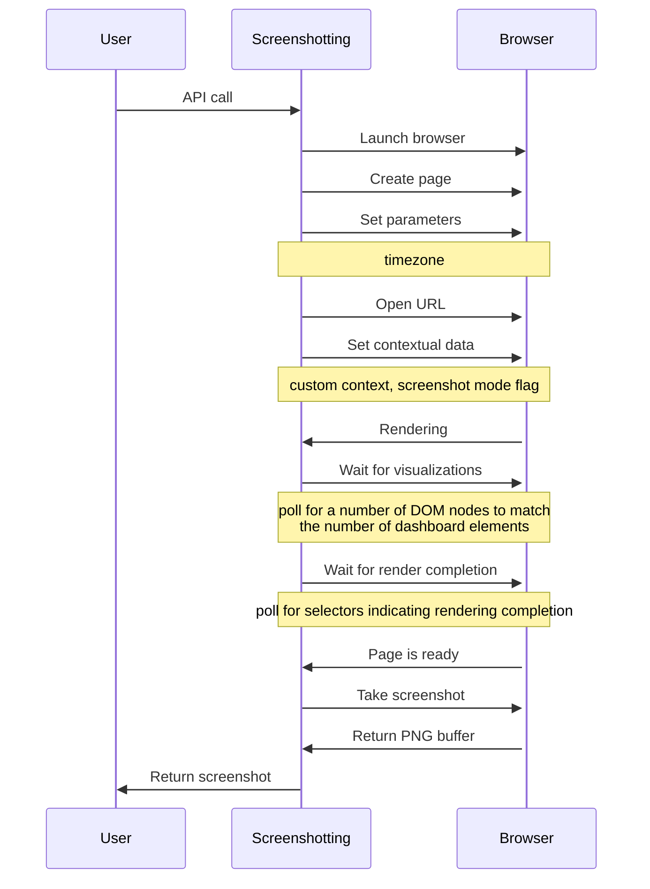

# Kibana Screenshotting

This plugin provides functionality to take screenshots of the Kibana pages.
It uses Chromium and Puppeteer underneath to run the browser in headless mode.

## Capabilities
- Canvas workpads screenshots.
- Dashboards screenshots.
- Expressions screenshots.
- PDF generation.
- Batch screenshotting.

## Usage

### Getting started
After listing the `screenshotting` plugin in your dependencies, the plugin will be intitalized on the setup stage.
The intitalization process downloads (if it is not already present) and verifies the Chromium build.

The start contract exposes a public API to interact with the plugin.
Apart from the actual screenshotting functionality, it also provides a way for self-diagnostics.

Here is an example of how you can take a screenshot of a Kibana URL.

```typescript
import type { CoreSetup, Plugin } from 'src/core/server';
import type { ScreenshottingStart } from 'x-pack/plugins/screenshotting/server';


interface StartDeps {
  screenshotting: ScreenshottingStart;
}

class ExamplePlugin implements Plugin<void, void, void, StartDeps> {
  setup({ http, getStartServices }: CoreSetup<StartDeps>) {
    const router = http.createRouter();

    router.get(
      {
        path: '/api/capture',
        validate: {
          query: schema.object({
            id: schema.string(),
          }),
        },
      },
      async (context, request, response) => {
        const [, { screenshotting }] = await getStartServices();
        const { metrics, results } = await screenshotting
          .getScreenshots({
            request,
            urls: [`http://localhost/app/canvas#/workpad/workpad-${request.query.id}`],
          })
          .toPromise();

        return response.ok({
          body: JSON.stringify({
            metrics,
            image: results[0]?.screenshots[0]?.data.toString('base64'),
            errors: results[0]?.renderErrors,
          } as ScreenshottingExpressionResponse),
        });
      }
    );
  }

  start() {}
}

export function plugin() {
  return new ExamplePlugin();
}
```

### API
Please use automatically generated API reference or generated TypeDoc comments to find the complete documentation.

#### `getScreenshots(options): Observable`
Takes screenshots of multiple pages or an expression and returns an observable with the screenshotting results.

The `options` parameter is an object with parameters of the screenshotting session.
Option | Required | Default | Description
--- | :---: | --- | ---
`browserTimezone` | no | _none_ | The browser timezone that will be emulated in the browser instance. This option should be used to keep timezone on server and client in sync.
`expression` | no | _none_ | An expression to capture screenshot of. Mutually exclusive with the `urls` parameter.
`format` | no | `'png'` | An output format. It can either be PDF or PNG. In case of capturing multiple URLs, all the screenshots will be combined into one document for PDF format. For PNG format, an array of screenshots will be returned.
`headers` | no | _none_ | Custom headers to be sent with each request. The headers will be used for authorization.
`input` | no | `undefined` | The expression input.
`layout` | no | `{}` | Page layout parameters describing characteristics of the capturing screenshot (e.g., dimensions, zoom, etc.).
`request` | no | _none_ | Kibana Request reference to extract headers from.
`timeouts` | no | _none_ | Timeouts for each phase of the screenshot.
`timeouts.loadDelay` | no | `3000` | The amount of time in milliseconds before taking a screenshot when visualizations are not evented. All visualizations that ship with Kibana are evented, so this setting should not have much effect. If you are seeing empty images instead of visualizations, try increasing this value.
`timeouts.openUrl` | no | `60000` | The timeout in milliseconds to allow the Chromium browser to wait for the "Loading…​" screen to dismiss and find the initial data for the page. If the time is exceeded, a screenshot is captured showing the current page, and the result structure contains an error message.
`timeouts.renderComplete` | no | `30000` | The timeout in milliseconds to allow the Chromium browser to wait for all visualizations to fetch and render the data. If the time is exceeded, a screenshot is captured showing the current page, and the result structure contains an error message.
`timeouts.waitForElements` | no | `30000` | The timeout in milliseconds to allow the Chromium browser to wait for all visualization panels to load on the page. If the time is exceeded, a screenshot is captured showing the current page, and the result structure contains an error message.
`urls` | no | `[]` | The list or URL to take screenshots of. Every item can either be a string or a tuple containing a URL and a context. The contextual data can be gathered using the screenshot mode plugin.

#### `diagnose(flags?: string[]): Observable`
Runs browser diagnostics.
The diagnostic implementation launches Chromium and emits the output in the resulting observable.

There is a way to override some Chromium command line arguments using the `flags` parameter.

### Configuration
Option | Default | Description
--- | --- | ---
`xpack.screenshotting.networkPolicy.enabled` | `true` | Capturing a screenshot from a Kibana page involves sending out requests for all the linked web assets. For example, a Markdown visualization can show an image from a remote server. 
`xpack.screenshotting.networkPolicy.rules` | Allow http, https, ws, wss, and data. | A policy is specified as an array of objects that describe what to allow or deny based on a host or protocol. If a host or protocol is not specified, the rule matches any host or protocol.
`xpack.screenshotting.browser.autoDownload` | Depends on the `dist` parameter. | Flag to automatically download chromium distribution.
`xpack.screenshotting.browser.chromium.inspect` | Depends on the `dist` parameter. | Connects to the browser over a pipe instead of a WebSocket. See [puppeteer](https://github.com/puppeteer/puppeteer/blob/main/docs/api.md#puppeteerlaunchoptions) documentation.
`xpack.screenshotting.browser.chromium.disableSandbox` | Defaults to `false` for all operating systems except Debian and Red Hat Linux, which use `true`. | It is recommended that you research the feasibility of enabling unprivileged user namespaces. An exception is if you are running Kibana in Docker because the container runs in a user namespace with the built-in seccomp/bpf filters. For more information, refer to [Chromium sandbox](https://chromium.googlesource.com/chromium/src/+/HEAD/docs/linux/sandboxing.md).
`xpack.screenshotting.browser.chromium.proxy.enabled` | `false` | Enables the proxy for Chromium to use. 
`xpack.screenshotting.browser.chromium.proxy.server` | _none_ | The uri for the proxy server. Providing the username and password for the proxy server via the uri is not supported.
`xpack.screenshotting.browser.chromium.proxy.bypass` | `[]` | An array of hosts that should not go through the proxy server and should use a direct connection instead. Examples of valid entries are "elastic.co", "*.elastic.co", ".elastic.co", ".elastic.co:5601".

## How It Works


## Testing
### Integration
There is an example plugin that demonstrates integration with the screenshotting plugin. That plugin utilizes expression capturing.

### Chromium Downloads
To download all Chromium browsers for all platforms and architectures:

```bash
cd x-pack
npx gulp downloadChromium
```

This command is used to provision CI workspaces so that Chromium does not need to be downloaded for every CI run.
