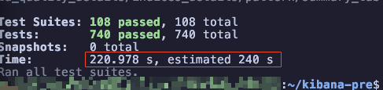
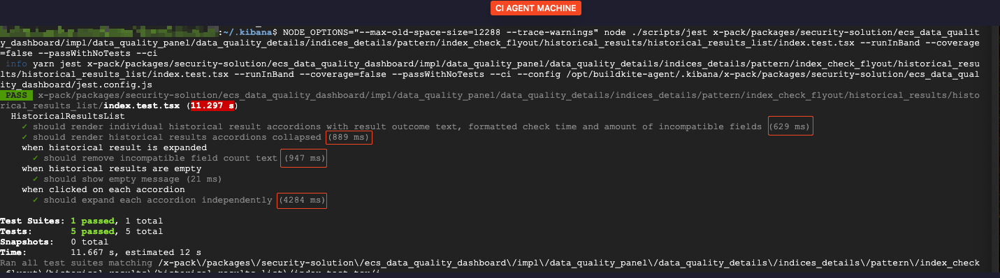
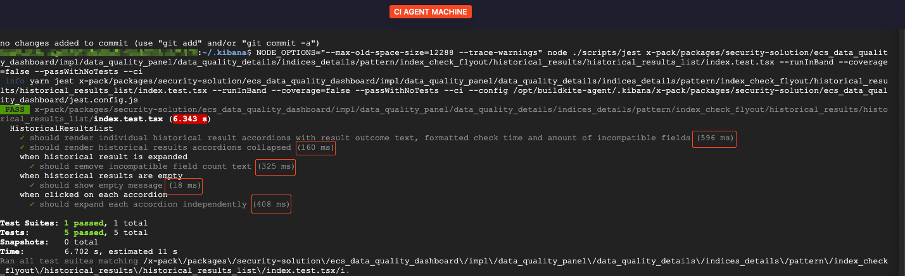
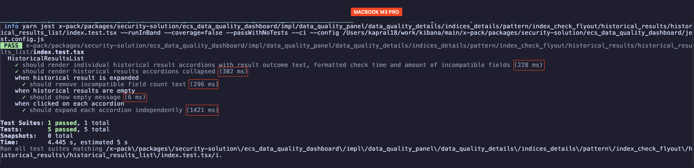
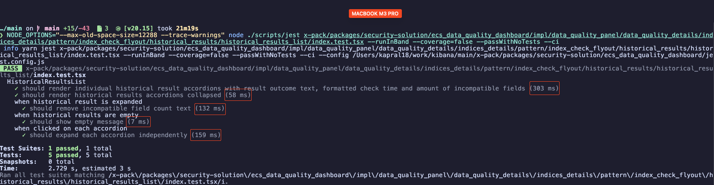
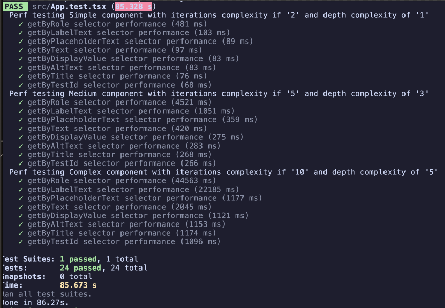
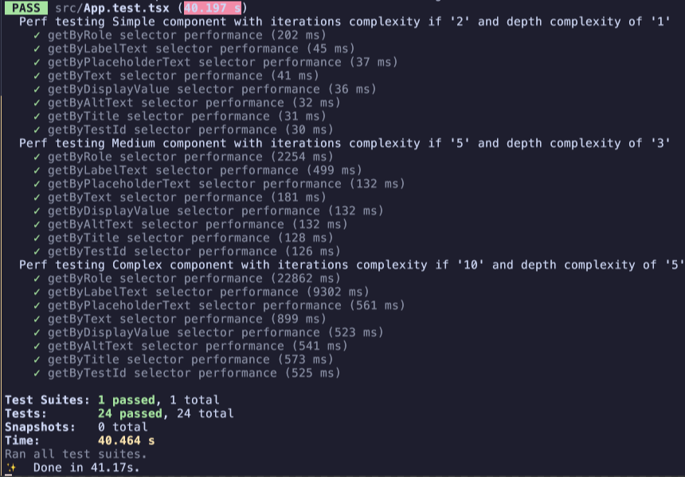

# 0002 - Usage of Slow Accessibility Selectors in Jest RTL Tests

## Context and Problem Statement

### Background

After experiencing flaky jest [tests](https://github.com/elastic/kibana/issues/196216)
in CI/CD pipeline on main branch. We investigated and found that the timing out
tests were failing due to slow execution times primarily affected by usage of
accessibility selectors like `ByRole` and `ByLabelText`.

### Probing PR

A [PR](https://github.com/elastic/kibana/pull/196591) was proposed to address
flakiness in aforementioned tests by replacing accessibility selectors
with `ByTestId` selectors which resulted in a significant improvement
in test execution times for a relatively simple effort/change that we
will expand on further down.

### Pre/Post PR changes test perf comparison

Ecs data quality dashboard tests suite was the offending [test suite](https://github.com/elastic/kibana/issues/196216)
in the original issue that was taking a long time to execute.

Let's use the exact same command to run the test suite on the same ci machine:

```bash
NODE_OPTIONS="--max-old-space-size=12288 --trace-warnings" \
node ./scripts/jest \
--config="x-pack/packages/security-solution/ecs_data_quality_dashboard/jest.config.js" \
--runInBand --coverage=false --passWithNoTests
```

Here is the comparison of test perf results using
the above command on main branch before and after the
[probing PR](#probing-pr) was merged:

#### Before probing PR



#### After probing PR


As you can see a there is a 50s reduction in the test execution time, which is arguably an easy win
considering the simplicity of change.

### Pre/Post PR changes test perf comparison for a single test file

But let's zoom in on a [single test file](https://github.com/elastic/kibana/pull/196591/files#diff-b567388ee5559d16d6afb6c3207b719abad210ae8801bc3ba57a58c6c0377192)
to see the exact cost of using accessibility selectors like `getByRole` and `getByLabelText`.

#### CI/CD Pipeline Agent Machine results

When running the test suite on the CI/CD pipeline agent machine for historical results list test file:

**Before**:



**After**:



#### Local MacBook Pro Machine results

Similar gains were observed when running the test suite on a local MacBook Pro M3 machine that is significantly faster than the CI/CD pipeline agent machine:

**Before**:



**After**:



### Initial Conclusion

As you can see simply replacing `getByRole` and `getByLabelText` with `getByTestId`
was enough to at times reduce the test execution time by an order of magnitude in these
tests.

### Which Selectors to Cut?

Per RTL [priority](https://testing-library.com/docs/queries/about/#priority) this is the preferred order of selectors:

1. **ByRole** (most recommended)
2. **ByLabelText**
3. **ByPlaceholderText**
4. **ByText**
5. **ByDisplayValue**
6. **ByAltText**
7. **ByTitle**
8. **ByTestId**

So the question comes up, which selectors have which impact on test execution times exactly?

And in order to answer that question with some certainty we need to run a more generalized
test suite that covers all the selectors and see how they perform in different testing complexity tiers.

### Selectors Performance Impact

We created [perf repo](https://github.com/elastic/rtl-selectors-perf-test)
to simulate the test suite execution times for each selector. Feel free to
clone the repo and run the tests on your local machine to verify the results.

Here are our results:

**CI/CD Pipeline Agent Machine**



**Local MacBook Pro Machine**



#### Analysis

**ByRole** is by far the slowest selector which is consistently slowest
in all 3 testing tiers (Simple, Medium, Complex). Read more about
how we defined the testing tiers in the [perf repo](https://github.com/elastic/rtl-selectors-perf-test?tab=readme-ov-file#how-we-setup-and-measure)

**ByLabelText** is the second slowest selector that shows itself in the
medium and complex testing tiers.

Both **ByRole** and **ByLabelText** selectors are showing an exponential
increase in execution times as the complexity of the test increases.

All other selectors are showing a quadratic increase in execution times as
the complexity of the test increases. We can highlight **ByText** is a little
bit slower than the rest of the quadratic selectors but is still within the
quadratic range.

### Final Problem Statement

The problem we need to address is: **taking into account the significant performance
impact of certain accessibility selectors on Jest RTL tests, what conclusion should
we draw with regards to further usage of said accessibility selectors?**

## Considered Options

- **Continue Using All Accessibility Selectors without restrictions**
- **Continue Using All accessibility Selectors but enforce scoping of heavy selectors**
- **Disallow Usage of Slow Accessibility Selectors (`ByRole`, `ByLabelText` and potentially `ByText`) in Jest RTL Tests**

## Decision Outcome

TBD

## Discussion of Options

### Option 1: Continue Using All Accessibility Selectors without restrictions

This option would allow us to continue using all accessibility selectors without any restrictions.

| Pros                                                               | Cons                                                                   |
| ------------------------------------------------------------------ | ---------------------------------------------------------------------- |
| adherence to RTL priority and accessibility testing best practices | existing ci rtl tests are already taking 2h to run in CI/CD pipeline   |
| an excuse to get better ci machines :)                             | flaky tests                                                            |
| expressive tests that are easy to read and understand              | need to bump timeouts for overflowing tests                            |
| stable selectors not relying on 3rd party implementation           | every new heavy selector adds has an exponential footprint on ci times |
| no need to refactor existing tests                                 | local execution times are also slow for complex tests                  |

### Option 2: Continue Using All accessibility Selectors but enforce scoping of heavy selectors

This option would allow us to continue using all accessibility selectors by enforcing scoping of heavy selectors.

The idea being that we first use fast selectors like `ByTestId` and `ByText`
to scope down the search area and then use heavy selectors like `ByRole`
and `ByLabelText` to find the element we are looking for.

| Pros                                                                       | Cons                                                                                |
| -------------------------------------------------------------------------- | ----------------------------------------------------------------------------------- |
| partially adheres to RTL priority and accessibility testing best practices | difficult to enforce, high chance of heavy selectors spreading outside safe scope   |
| semi-expressive tests that are relatively easy to read and understand      | because of the above the impact if any is unclear both for ci or local test runs    |
|                                                                            | need to refactor existing tests to use faster selectors to fully actualize CI gains |

### Option 3: Disallow Usage of Slow Accessibility Selectors (`ByRole`, `ByLabelText` and potentially `ByText`) in Jest RTL Tests

This option would disallow usage of slow accessibility selectors in Jest RTL tests like `ByRole`, `ByLabelText` and potentially `ByText`.

| Pros                                                                                        | Cons                                                                                |
| ------------------------------------------------------------------------------------------- | ----------------------------------------------------------------------------------- |
| immediate and clear impact on ci test execution times                                       | need to refactor existing tests to use faster selectors to fully actualize CI gains |
| big impact on local dev machine test execution times                                        | doesn't adhere to RTL best practices                                                |
| EUI team guarantees stability of data-test-subj so stability of tests is compensated        |                                                                                     |
| uniformity of selectors across the codebase (ByTestId by default)                           |                                                                                     |
| no need to bump timeouts for overflowing tests, because most tests will be way below budget |                                                                                     |
| per above, no flaky tests                                                                   |                                                                                     |
