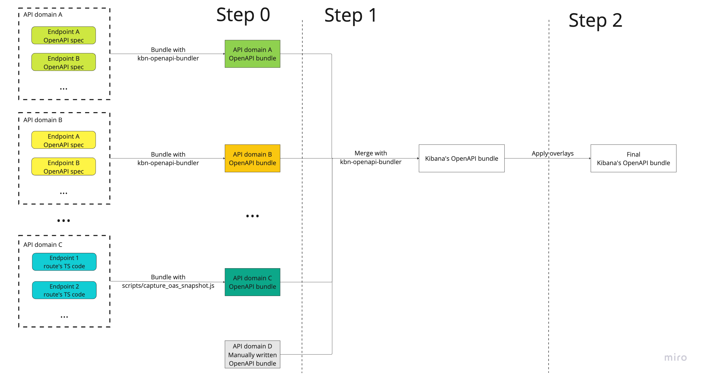

# Security Solution API reference documentation

Documentation about Security Solution OpenAPI bundling workflow and configuration. See [Kibana wide docs](../../../../../oas_docs/README.md) for general information.

## Workflow

Security Solution uses **specification first approach**. It means we define OpenAPI spec files describing individual API endpoints (also known as source OpenAPI specs) at first. After that we use tooling in particular [`kbn-openapi-bundler`](../../../../../packages/kbn-openapi-bundler/README.md) to process source OpenAPI specs to produce domain OpenAPI bundles.

The workflow consists of multiple steps and visualized below

This document describes **step 0** implemented on Security Solution's side.

#### Bundling automation (CI integration)

Bundling Security Solution domain OpenAPI bundles is **Step 0** of the workflow. To keep the domain OpenAPI bundles always up-to-date and in sync with the source OpenAPI specs, the bundling runs as part of the `Checks` step in CI on every PR build and on merge builds. If there are any changes to the source OpenAPI files, these changes get propagated to the domain OpenAPI bundles and CI commits the changes. In that case the build is marked as failed and needs to be restarted.

### API Domains

Security Solution has multiple API domains scattered across Kibana. Currently the following API domains are handled in the workflow:

- Security AI Assistant

  - Bundling script: `x-pack/packages/kbn-elastic-assistant-common/scripts/openapi/bundle.js`
  - Bundles location: `x-pack/packages/kbn-elastic-assistant-common/docs/openapi/{ess|serverless}`

- Security Detections

  - Bundling script: `x-pack/plugins/security_solution/scripts/openapi/bundle_detections.js`
  - Bundles location: `x-pack/plugins/security_solution/docs/openapi/{ess|serverless}`

- Security Endpoint Exceptions

  - Bundling script: `packages/kbn-securitysolution-endpoint-exceptions-common/scripts/openapi_bundle.js`
  - Bundles location: `packages/kbn-securitysolution-endpoint-exceptions-common/docs/openapi/{ess|serverless}`

- Security Endpoint Management

  - Bundling script: `x-pack/plugins/security_solution/scripts/openapi/bundle_endpoint_management.js`
  - Bundles location: `x-pack/plugins/security_solution/docs/openapi/{ess|serverless}`

- Security Endpoint Management

  - Bundling script: `x-pack/plugins/security_solution/scripts/openapi/bundle_entity_analytics.js`
  - Bundles location: `x-pack/plugins/security_solution/docs/openapi/{ess|serverless}`

- Security Security Exceptions

  - Bundling script: `packages/kbn-securitysolution-exceptions-common/scripts/openapi_bundle.js`
  - Bundles location: `packages/kbn-securitysolution-exceptions-common/docs/openapi/{ess|serverless}`

- Security Lists

  - Bundling script: `packages/kbn-securitysolution-lists-common/scripts/openapi_bundle.js`
  - Bundles location: `packages/kbn-securitysolution-lists-common/docs/openapi/{ess|serverless}`

- Security Osquery

  - Bundling script: `x-pack/plugins/osquery/scripts/openapi/bundle.js`
  - Bundles location: `x-pack/plugins/osquery/docs/openapi/{ess|serverless}`

- Security Timeline

  - Bundling script: `x-pack/plugins/security_solution/scripts/openapi/bundle_timeline.js`
  - Bundles location: `x-pack/plugins/security_solution/docs/openapi/{ess|serverless}`
