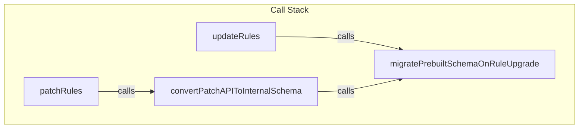
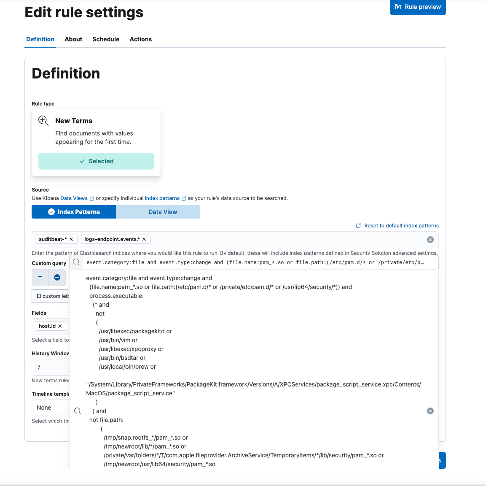

# RFC: Prebuilt Rules Customization

_Status_: Finished Part 1, which includes sections from `Necessary rule schema changes` up until -and including- `Exporting and importing rules`.
 
 Covers:
  - rule schema changes
  - mappings
  - migration strategy and technical implementation
  - exporting and importing rules
  - schema-related changes needed in endpoints

_Pending_:

- Calculation of `isCustomized` field on endpoints that update/patch rules. Encapsulated reusable logic and how to implement it on those endpoints.
- Rework `Changes needed in the UI`
- Additional changes needed to `/upgrade/_review` and `/upgrade/_perform` endpoints
  - `/upgrade/_review`:
    - Concrete conflict solving algorithms for calculating merged versions
    - Update algorithms used for each field
  - `/upgrade/_perform`:
    - Change payload to allow user to select `merge` version of a rule, and send payload with customized values
    - (This is already described in previous RFC! Link to it, the rest is implementation detail)
- Three Way Diff Component:
  - UI
  - Frontend Logic
- Other UI changes: list changes in Rule Editing, Rule Tables, etc

## Table of Contents

-   [Necessary rule schema changes](#necessary-rule-schema-changes)
    -   [`prebuilt` and `immutable` fields](#prebuilt-and-immutable-fields)
        -   [`isCustomized` subfield](#iscustomized-subfield)
        -   [`elasticUpdateDate` subfield](#elasticupdatedate-subfield)
    -   [Changes needed in rule schema](#changes-needed-in-rule-schema)
        -   [API schema](#api-schema)
        -   [Internal rule schema](#internal-rule-schema)
    -   [Deprecating the `immutable` field](#deprecating-the-immutable-field)
-   [Mapping changes](#mapping-changes)
-   [Plan for carrying out migrations of rule SOs](#plan-for-carrying-out-migrations-of-rule-sos)
    -   [Context](#context)
    -   [Migration strategy](#migration-strategy)
        -   [Migration on write](#migration-on-write)
            -   [Rule Management endpoints that should include migration-on-write logic](#rule-management-endpoints-that-should-include-migration-on-write-logic)
        -   [Normalization on read](#normalization-on-read)
            -   [Rule Management endpoints that will perform normalization-on-read](#rule-management-endpoints-that-will-perform-normalization-on-read)
    -   [Technical implementation of migration-on-write](#technical-implementation-of-migration-on-write)
        -   [`migratePrebuiltSchemaOnRuleCreation`](#migrateprebuiltschemaonrulecreation)
            -   [`convertCreateAPIToInternalSchema` and `createRules`](#convertcreateapitointernalschema-and-createrules)
            -   [`duplicateRule`](#duplicaterule)
        -   [`migratePrebuiltSchemaOnRuleUpdate`](#migrateprebuiltschemaonruleupdate)
            -   [`convertPatchAPIToInternalSchema` and `patchRules`](#convertpatchapitointernalschema-and-patchrules)
            -   [`updateRules`](#updaterules)
        -   [`migratePrebuiltSchemaOnRuleBulkEdit`](#migrateprebuiltschemaonrulebulkedit)
-   [Other endpoints and utilities that will need to be adapted to the new schema](#other-endpoints-and-utilities-that-will-need-to-be-adapted-to-the-new-schema)
    -   [Utilities](#utilities)
        -   [KQL filters and the `convertRulesFilterToKQL` method](#kql-filters-and-the-convertrulesfiltertokql-method)
    -   [Rule Management endpoints](#rule-management-endpoints)
    -   [Prebuilt Rules endpoints](#prebuilt-rules-endpoints)
    -   [Rule monitoring endpoints](#rule-monitoring-endpoints)
    -   [Rule Execution Logs](#rule-execution-logs)
-   [Exporting and importing rules](#exporting-and-importing-rules)
    -   [Exporting rules](#exporting-rules)
    -   [Importing rules](#importing-rules)
    -   [Handling the `version` parameter](#handling-the-version-parameter)
-   [Customizing Prebuilt Rules](#customizing-prebuilt-rules)
    -   [Endpoints](#endpoints)
        -   [Changes needed to endpoints](#changes-needed-to-endpoints)
            -   [Update Rule - `PUT /rules`](#update-rule---put-rules)
            -   [Patch Rule - `PATCH /rules`](#patch-rule---patch-rules)
            -   [Bulk Patch Rules - `PATCH /rules/_bulk_update`](#bulk-patch-rules---patch-rules_bulk_update)
            -   [Bulk Update Rules - `PUT /rules/_bulk_update`](#bulk-update-rules---put-rules_bulk_update)
            -   [Bulk Actions - `POST /rules/_bulk_action`](#bulk-actions---post-rules_bulk_action)
        -   [Updating the `customized` field](#updating-the-customized-field)
    -   [In the UI](#in-the-ui)
        -   [Via the Rule Edit Page](#via-the-rule-edit-page)
        -   [Via Bulk Actions](#via-bulk-actions)
        -   [Via the Rules Details Page](#via-the-rules-details-page)
        -   [Via the Shared Exception Lists page](#via-the-shared-exception-lists-page)
        -   [Via the Stack Management \> Rules UI](#via-the-stack-management-rules-ui)
-   [List of things to fix (create tickets)](#list-of-things-to-fix-create-tickets)
    -   [Rule fields](#rule-fields)
-   [Updating Prebuilt Rules](#updating-prebuilt-rules)
    -   [Changes to upgrade `_review` and `_perform` endpoints](#changes-to-upgrade-_review-and-_perform-endpoints)
    -   [Rule field diff algorithms](#rule-field-diff-algorithms)
-   [Changes in UI](#changes-in-ui)
-   [Scenarios for bulk accepting updates](#scenarios-for-bulk-accepting-updates)
-   [Marking rules (and their fields) as customized](#marking-rules-and-their-fields-as-customized)
-   [Other open questions](#other-open-questions)

## Necessary rule schema changes

In order to support the customization of Elastic Prebuilt Rules, we need to modify our rule schema. This involves introducing a new nested `prebuilt` field and deprecating the `immutable` field.

### `prebuilt` and `immutable` fields

The `prebuilt` field will be a top-level object field in our rule schema that will contain subfields with information relating to Elastic Prebuilt rules.

It will be an optional field, which will only be present for Elastic prebuilt rules.

Its existence within a rule object will determine if a rule is a prebuilt rule (and its absence will determine that it is a custom rule).

This means that its presence in a rule object will determine whether the rule is an Elastic Prebuilt Rule that can receive upstream updates via Fleet. This field is intented to replace the currently existing `immutable` field, which is used today for the same purpose, but -as its name indicates- also currently determines if a rule's fields can be modified/customized.

That means that, in the current state, rules with `immutable: false` are rules which are not Elastic Prebuilt Rules, i.e. custom rules, and can be modified. Meanwhile, `immutable: true` rules are Elastic Prebuilt Rules, created by the TRADE team, distributed via the `security_detection_engine` Fleet package, and cannot be modified once installed.

When successfully implemented, the `prebuilt` field should replace the `immutable` field as a flag to mark Elastic prebuilt rules, but with one difference: the `prebuilt` field will determine if the rule is an Elastic Prebuilt Rule or not, but now all rules will be customizable by the user, i.e. independently of the existence (or absence) of `prebuilt`.

Because of this difference in the behaviour of the `prebuilt` and `immutable` fields, we feel that a field called `immutable` will lose its meaning over time and become confusing, especially for consumers of the API who interact directly with the field name. That's why we want to eventually deprecate it and fully replace it with `prebuilt`.

To ensure backward compatibility and avoid breaking changes, we will deprecate the `immutable` field but keep it within the rule schema, asking our users to stop relying on this field in Detection API responses. During the migration period, we want to keep the value of the `immutable` field in sync with the `prebuilt` field: this means that for all rules that have a `immutable` value of `true`, the `prebuilt` rule will always exist. Viceversa, rule with `immutable: false` will not have a `prebuilt` field.

This means, however, that there will be a change in behaviour of the `immutable` field: with the release of the feature, rules with the `immutable: true` value will now be customizable by the user, which is not the current behaviour.

In this first phase, the `prebuilt` will contain two subfields: `isCustomized` and `elasticUpdateDate`.

```ts
// PSEUDOCODE - see complete schema in detail below
{
  prebuilt?: {
    isCustomized: boolean;
    elasticUpdateDate?: Date;
  }
}
```

#### `isCustomized` subfield

The `isCustomized` field will be a boolean field that determines whether a Prebuilt Rule has been customized by the user, i.e. if any of its fields have been modified and diverged from the base version of the rule, which is the version that is installed from the Prebuilt Rules `security_detection_engine` Fleet package.

This means that the `isCustomized` subfield only makes sense and will be used for prebuilt rules, or rules whose `prebuilt` field exists. It is therefor a subfield of the `prebuilt` field.

For prebuilt rules, the `prebuilt.isCustomized` value will be initially set to `false` when a brand new rule is installed, but will be rewritten to `true` if a rule's field is edited and diverges from the value from the base version of the rule.

See section [Calculating the `isCustomized` flag]()

#### `elasticUpdateDate` subfield

The `elasticUpdateDate` will be a field containing a date in ISO 8601 format which describes the last time that an Elastic Prebuilt Detection rule was created and subsequently updated by the TRaDe team, the team responsible for creating detection rules. Its usage is detailed in this ticket.

This field will be optional in both the API schema and the internal rule schema, since this value will not exist for prebuilt rules until a new version of each rule which includes this field in the prebuilt rule asset is published by the TRaDE team, and the user installs it or updates to it.

### Changes needed in rule schema

As detailed further down in the [Plan for carrying out migrations of rule SOs](#plan-for-carrying-out-migrations-of-rule-sos) section, we will be performing incremental migration-on-write on our saved objects to get to our new schemas (see details in linked section).

This means that we need to differentiate between changes to the internal rule schema and the API schema.

#### API schema

**In the API schema** the `prebuilt` field will be optional, as it will exist for Elastic prebuilt rules, but won't for custom rules. The OpenAPI schema will need to be modified so:

_Source: [x-pack/plugins/security_solution/common/api/detection_engine/model/rule_schema/common_attributes.schema.yaml](https://github.com/elastic/kibana/blob/main/x-pack/plugins/security_solution/common/api/detection_engine/model/rule_schema/common_attributes.schema.yaml)_

```yaml
#  [... file continues above...]

# Add deprecation warning to `immutable` field
IsRuleImmutable:
  type: boolean
  description: '[DEPRECATION WARNING - This field is deprecated and will be removed in a future release. Use the prebuilt field to determine if a rule is an Elastic prebuilt rule or a custom rule.] - Determines whether the rule is immutable (i.e. cannot be modified by the user).'

# Add the top-level `prebuilt` object and its subfields `isCustomized` and `elasticUpdateDate`
IsPrebuiltRuleCustomized:
  type: boolean
  description: Determines whether the prebuilt rule has been customized by the user (i.e. any of its fields have been modified and diverge from the base value).

ElasticUpdateDate:
  type: string
  format: date-time
  description: The date and time that the prebuilt rule was last updated by Elastic.

Prebuilt:
  type: object
  description: Property whose existence  determines whether the rule is an Elastic Prebuilt Rule that can receive upstream updates via Fleet. Contains  information relating to prebuilt rules.
  properties:
    isCustomized:
      $ref: '#/components/schemas/IsPrebuiltRuleCustomized'
    elasticUpdateDate:
      $ref: '#/components/schemas/ElasticUpdateDate'
  required:
    - isCustomized
#  [... file continues below ...]
```

_Source: [x-pack/plugins/security_solution/common/api/detection_engine/model/rule_schema/rule_schemas.schema.yaml](https://github.com/elastic/kibana/blob/main/x-pack/plugins/security_solution/common/api/detection_engine/model/rule_schema/rule_schemas.schema.yaml)_

```yaml
#  [... file continues above...]

ResponseFields:
  type: object
  properties:
    id:
      $ref: './common_attributes.schema.yaml#/components/schemas/RuleObjectId'
    rule_id:
      $ref: './common_attributes.schema.yaml#/components/schemas/RuleSignatureId'
    immutable:
      $ref: './common_attributes.schema.yaml#/components/schemas/IsRuleImmutable'
    prebuilt:
      $ref: './common_attributes.schema.yaml#/components/schemas/Prebuilt'
    #  [...  more response fields ...]
  required:
    # notice `prebuilt` is not required
    - id
    - rule_id
    - immutable
    - updated_at
    - updated_by
    - created_at
    - created_by
    - revision
    - related_integrations
    - required_fields
    - setup
#  [... file continues below...]
```

When the OpenAPI code generator is run, this will result in the files:

_Source: [x-pack/plugins/security_solution/common/api/detection_engine/model/rule_schema/common_attributes.gen.ts](https://github.com/elastic/kibana/blob/main/x-pack/plugins/security_solution/common/api/detection_engine/model/rule_schema/common_attributes.gen.ts)_

```ts
//  [... file continues above...]

/**
 * [DEPRECATION WARNING - This field is deprecated and will be removed in a future release. Use the prebuilt field to determine if a rule is an Elastic prebuilt rule or a custom rule.] - Determines whether the rule is immutable (i.e. cannot be modified by the user).
 */
export type IsRuleImmutable = z.infer<typeof IsRuleImmutable>;
export const IsRuleImmutable = z.boolean();

/**
 * Determines whether the prebuilt rule has been customized by the user (i.e. any of its fields have been modified and diverge from the base value).
 */
export type IsPrebuiltRuleCustomized = z.infer<typeof IsPrebuiltRuleCustomized>;
export const IsPrebuiltRuleCustomized = z.boolean();

/**
 * The date and time that the prebuilt rule was last updated by Elastic.
 */
export type ElasticUpdateDate = z.infer<typeof ElasticUpdateDate>;
export const ElasticUpdateDate = z.string().datetime();

/**
 * Property whose existence  determines whether the rule is an Elastic Prebuilt Rule that can receive upstream updates via Fleet. Contains information relating to prebuilt rules.
 */
export type Prebuilt = z.infer<typeof Prebuilt>;
export const Prebuilt = z.object({
  isCustomized: IsPrebuiltRuleCustomized,
  elasticUpdateDate: ElasticUpdateDate.optional(),
});

//  [... file continues below ...]
```

_Source: [x-pack/plugins/security_solution/common/api/detection_engine/model/rule_schema/rule_schemas.gen.ts](https://github.com/elastic/kibana/blob/main/x-pack/plugins/security_solution/common/api/detection_engine/model/rule_schema/rule_schemas.gen.ts)_

```ts
//  [... file continues above ...]

export type ResponseFields = z.infer<typeof ResponseFields>;
export const ResponseFields = z.object({
  id: RuleObjectId,
  rule_id: RuleSignatureId,
  immutable: IsRuleImmutable,
  prebuilt: Prebuilt.optional(),
  // [...]
});

//  [... file continues below ...]
```

We also need to modify the `RuleToImport` schema, since now we will be allowing the importing of both custom rules and prebuilt rules.

Currently, `RuleToImport` optionally accepts the `immutable` param, but rejects validation if its value is set to anything else than `false` - since we don't currently support importing prebuilt rules. We need to update this schema so that it accepts the `immutable` param with both boolean values, and also optionally accepts the new `prebuilt` field:

_Source: [x-pack/plugins/security_solution/common/api/detection_engine/rule_management/import_rules/rule_to_import.ts](https://github.com/elastic/kibana/blob/main/x-pack/plugins/security_solution/common/api/detection_engine/rule_management/import_rules/rule_to_import.ts)_

```ts
// [... file continues above...]
import {
  // [...]
  RuleSignatureId,
  IsRuleImmutable,
  Prebuilt,
} from '../../model/rule_schema';

export type RuleToImport = z.infer<typeof RuleToImport>;
export type RuleToImportInput = z.input<typeof RuleToImport>;
export const RuleToImport = BaseCreateProps.and(TypeSpecificCreateProps).and(
  ResponseFields.partial().extend({
    rule_id: RuleSignatureId,
    immutable: IsRuleImmutable.optional(),
    prebuilt: Prebuilt.optional(),
  })
);
```

#### Internal rule schema

**The internal rule schema** needs to represent that the new `prebuilt` field may not always exist, i.e. for rules yet to be migrated, so `prebuilt` must also be optional.

_Source: [x-pack/plugins/security_solution/server/lib/detection_engine/rule_schema/model/rule_schemas.ts](https://github.com/elastic/kibana/blob/main/x-pack/plugins/security_solution/server/lib/detection_engine/rule_schema/model/rule_schemas.ts)_

```ts
// [... file continues above...]

import {
  // [...]
  Prebuilt,
  // [...]
} from '../../../../../common/api/detection_engine/model/rule_schema';

export type BaseRuleParams = z.infer<typeof BaseRuleParams>;
export const BaseRuleParams = z.object({
  // [...]

  immutable: IsRuleImmutable,
  prebuilt: Prebuilt.optional(),

  // [...]
});
```

In the internal rule schema, there are two additional important reasons why we need to make sure that this values is optional:

- When rules are executed, a call to the method `validateRuleTypeParams` is done, which is a method that validates the passed rule's parameters using the validators defined in `x-pack/plugins/security_solution/server/lib/detection_engine/rule_types`, within each of the rule query types files (for [EQL rules](https://github.com/elastic/kibana/blob/main/x-pack/plugins/security_solution/server/lib/detection_engine/rule_types/eql/create_eql_alert_type.ts#L27), for example). The validation is done based on the internal rule schema `BaseRulesParams` displayed above. Having `prebuilt` as a required fields would cause custom rules to fail on runtime.
- The Rule Client `update` method also calls the `validateRuleTypeParams` to validate the rule's params. Since the Rule Client's `update` method is used in our endpoint handlers, such as and `/rules/patch` and `/_bulk_actions`, these would fail when executed against a payload of custom rule.

Additionally, the `PrebuiltRuleAsset` type needs to be updated to include the new `elasticUpdateDate` date that will be progressively shipped with new versions of rules in the Elastic Prebuilt Rules package:

_Source: [x-pack/plugins/security_solution/server/lib/detection_engine/prebuilt_rules/model/rule_assets/prebuilt_rule_asset.ts](https://github.com/elastic/kibana/blob/main/x-pack/plugins/security_solution/server/lib/detection_engine/prebuilt_rules/model/rule_assets/prebuilt_rule_asset.ts)_

```ts
export const PrebuiltRuleAsset = BaseCreateProps.and(TypeSpecificCreateProps).and(
  z.object({
    rule_id: RuleSignatureId,
    version: RuleVersion,
    related_integrations: RelatedIntegrationArray.optional(),
    required_fields: RequiredFieldArray.optional(),
    setup: SetupGuide.optional(),
    source_updated_at: ElasticUpdateDate.optional(), // new optional field
  })
);
```

### Deprecating the `immutable` field

In order to mark the `immutable` field as deprecated, and making sure that our application and API users are aware that the field has been deprecated and replaced by the `prebuilt` field, we will communicate this change in three ways:

1. via updates to the documentation of all endpoints that return `RuleResponse` types
2. via a deprecation warning in the OpenAPI schema, as detailed above
3. by adding a custom response header in said endpoints.

The `immutable` field will afterwards be actually removed from our API endpoint responses and our application after a deprecation period that should give our users enough time to adapt to this change. The length of this deprecation period can vary, but around 4 months, or roughly two ESS releases, is a good starting point.

Both the docs and the custom response header should communicate that the `immutable` field:

- has been replaced by the `prebuilt` field and users should rely on that new field onwards
- is maintained for backwards compatibility reasons only
- will be removed after a specific date/release

The endpoints should be updated to include a custom response header like so:

```http
Deprecation-Info: immutable field is deprecated and will be removed in version 8.XX (or date). Use prebuilt field instead.
```

## Mapping changes

**Alert (rule objects) mapping**

No changes will be needed for the [mapping of rule saved objects](https://github.com/elastic/kibana/blob/main/x-pack/plugins/alerting/common/saved_objects/rules/mappings.ts) (of type `alert`), since the new fields introduced will be part of the `params` field, which is a `flattened` field.

**Security Rules (prebuilt rule assets) mapping**

No changes will be needed either for the `security-rule` [mapping](https://github.com/elastic/kibana/blob/main/x-pack/plugins/security_solution/server/lib/detection_engine/prebuilt_rules/logic/rule_assets/prebuilt_rule_assets_type.ts), our prebuilt rule assets. We currently have mappings for the `rule_id` and `version` fields, since we perform aggregations and filtering on those in the rule install and upgrade endpoints. No additional fields needs to be mapped in this phase.

## Plan for carrying out migrations of rule SOs

### Context

Historically, migrations to Elasticsearch saved objects were carried out by a procedure in which the changes in the SO were described in a migration operation that would be carried out **during an upgrade to a specific Kibana version**. See `x-pack/plugins/alerting/server/saved_objects/migrations/index.ts` for a list of migrations of SO that take place when a user updates Kibana to a specific version.

However, this mechanism is no longer supported by the Alerting Framework team - which maintained it - and we therefore have to find an alternative strategy. Therefore, we will perform the migration of the saved objects directly in the Detection API's endpoints that interact with them. This means that, instead of all of a user's saved object being migrated in a single operation during a Kibana update, the SO will be migrated when the pertinent endpoints are called. In the next section, we describe which those endpoints are.

Since the migration of rules will be performed as the user calls the pertinent endpoints, the migration of the saved objects will be carried out progressively and incrementally: the SO will be migrated only when a endpoint that handles it is called by the user. We therefore have to assume that, at any given point in time, a user may have a mix of migrated and non-migrated rule saved objects. Consequently, we must continue supporting both versions of SOs.

### Migration strategy

Our migration strategy will consist of two distinct types of migration: a **migration on write** that will update the SO on Elasticsearch, and a **normalization on read**, which will transform legacy rules to the new schema **in memory** on read operation, before returning it as a response from an API endpoint.

#### Migration on write

This type of migration will be in charge of updating saved object fields in Elasticsearch from the legacy form to the new form, and will be performed on all write operations of the rules (see list below). This means that we need to perform this type of migration of rules whenever any endpoint operation that writes/updates a rule saved object is called.

> In Elasticsearch, the type of rule saved objects is called `alert`.

This migration strategy of write/update operations means that a user's data will be migrated incrementally, and that both types of data (non-migrated and migrated saved objects) will coexist for an indeterminate amount of time. Therefore we have to maintain backwards data compatibility for the non-migrated data types.

The migration logic should take place as a first step within the handler logic of all endpoints that carry out write/update endpoint operations, and the endpoint should return the already-migrated rule(s).

##### Rule Management endpoints that should include migration-on-write logic

All of the following endpoints either fetch the rule before updating it, or send the rule's params as part of the body in the request. Therefore, we can apply migraton logic to them -as described below- before saving the rules to Elasticsearch.

- **Update Rule** - `PUT /rules`: used in the UI when updating/modifying a single rule via the Rule Editing page
- **Patch Rule** - `PATCH /rules`: used in the UI for attaching shared exceptions list to rules
- **Bulk Update Rules** - `PUT /rules/_bulk_update`: deprecated and unused by the UI. Might still be used by API users
- **Bulk Patch Rules** - `PATCH /rules/_bulk_update`: deprecated and unused by the UI. Might still be used by API users
- **Import Rules** - `POST /rules/_import`:
  - See section [Importing rules](#importing-rules)
- **Perform Rule Upgrade** - `POST /prebuilt_rules/upgrade/_perform` (Internal): current way of upgrading a prebuilt rule
- **(LEGACY) Install Prebuilt Rules And Timelines** - `PUT /rules/prepackaged`: legacy endpoint for installing prebuilt rules. Also updates existing prebuilt rules package, so these rules should be migrated during update as well.
- **Bulk Actions** - `POST /rules/_bulk_action`:
  This endpoint includes many types of actions, but only the **bulk edit** and the **duplicate** actions should perform a migration on write.

This endpoint also includes a `dry_run` mode that is executed to evaluate preconditions and warn the user before executing the actual request. No migration logic should take place for dry run requests, i.e when `dry_run=true`, since we never write to ES when this parameter is set to `true`.

For the **bulk edit** action, we can take advantage of the `ruleParamsModifier` to carry out the migration, regardless of the type of edit that is being performed. See implementation details in the below [Technical implementation of migration-on-write](#technical-implementation-of-migration-on-write) section.

For the **duplicate** rule action:

Since we will be creating a new rule on ES, we should create it with the new schema. Per definition, all duplicated rules will be `custom` rules. That means that for all rules -including prebuilt rules-, when duplicating, the `prebuilt` field will not be created on the newly created rule.
This action will not perform a migration-on-write of the original rule being duplicated for two reasons:

- would violate the principle of least surprise for the endpoint
- the current implementation of the endpoint does not modify the original rule. This gives us no window of opportunity to migrate the rule and save to ES without adding performance overhead.
- See implementation details below.

All other type of actions should **not** perform migration-on-write:

- Enable
- Disable
- Delete
- Export: see Importing and Exporting Rules section below

#### Normalization on read with `normalizePrebuiltSchemaOnRuleRead`

All endpoints that respond with a rule Saved Object, typed as `RuleResponse`, will also perform **normalization on read**, which will transform legacy rules to the new schema **in memory** on read operation, before returning it as a response from an API endpoint.

This means that the endpoints will always respond with the rules with the new schema, while the actual rule might still be stored with the legacy schema in Elasticsearch, if it still has not been migrated-on-write.

The **normalization on read** will be carried out by a new `normalizePrebuiltSchemaOnRuleRead` normalization function. The `internalRuleToAPIResponse` method, which is used in our endpoints to convert a rule saved object as is stored in Elasticsearch to the `RuleResponse` type which is returned to the client, calls the `commonParamsCamelToSnake` methods to convert rule parameters that are common to all rule types to what's expected in `RuleResponse`. Inside this method, we will use `normalizePrebuiltSchemaOnRuleRead` to calculate the normalized values of `prebuilt` and `immutable`.

_Source: [x-pack/plugins/security_solution/server/lib/detection_engine/rule_management/normalization/rule_converters.ts](https://github.com/elastic/kibana/blob/main/x-pack/plugins/security_solution/server/lib/detection_engine/rule_management/normalization/rule_converters.ts)_

```ts
// [... file continues above...]

export const internalRuleToAPIResponse = (
  rule: SanitizedRule<RuleParams> | ResolvedSanitizedRule<RuleParams>
): RequiredOptional<RuleResponse> => {
  // [... more method implementation details...]
  return {
    name: rule.name,
    tags: rule.tags,

    // [... more object properties ...]

    ...commonParamsCamelToSnake(rule.params), // <--- rule params are converted here
    ...typeSpecificCamelToSnake(rule.params),

    // [... more object properties ...]
  };
};

// [... file continues here...]

export const commonParamsCamelToSnake = (params: BaseRuleParams) => {
  const { immutable, prebuilt } = normalizePrebuiltSchemaOnRuleRead(params);

  return {
    description: params.description,
    risk_score: params.riskScore,

    // [... more object properties ...]

    immutable,
    prebuilt,
  };
};

// [... file continues below...]
```

And the `normalizePrebuiltSchemaOnRuleRead` is defined so:

_Source: x-pack/plugins/security_solution/server/lib/detection_engine/rule_management/normalization/prebuilt_rule_schema_migrations.ts_ (New file)

```ts
interface MigrationResponse {
  immutable: IsRuleImmutable;
  prebuilt?: Prebuilt;
}

const getPrebuiltValueForRuleRead = (ruleParams: BaseRuleParams): Prebuilt | undefined => {
  if (ruleParams.prebuilt) {
    return ruleParams.prebuilt;
  }

  if (ruleParams.immutable) {
    return {
      isCustomized: false,
    };
  }

  return undefined;
};

export const normalizePrebuiltSchemaOnRuleRead = (
  ruleParams: BaseRuleParams
): MigrationResponse => {
  const immutable = Boolean(ruleParams.prebuilt) || ruleParams.immutable;
  const prebuilt = getPrebuiltValueForRuleRead(ruleParams);

  return {
    immutable,
    prebuilt,
  };
};
```

The logic for calculating the `immutable` and `prebuilt` fields for **normalization-on-read**, seen in the code above, is as follows:

- For `immutable`:

  - Check if the `prebuilt` field exists in the rule's parameters, and set `immutable` to `true` if it does.
    - Use case 1: rules that have already been migrated-on-write
  - If it does not exist, set `immutable` to the current value of the params' `immutable` field.
    - Use case 2: rules that have not yet been migrated on write

- For `prebuilt`:
  - If the `prebuilt` field already exists in the internal rule object params, use that value:
    - Use case 1: prebuilt rules that have already been migrated-on-write
  - If it does not exist, check the value `immutable` from the rules param:
    - if it is `true`, create a new `prebuilt` object. This object will only have the `isCustomized` field, set to `false`. The `elasticUpdateDate` date will not be known and must be left undefined.
      - Use case 2: prebuilt rules that have not been yet migrated-on-write
    - otherwise, the field should be `undefined`.
      - Use case 3L: custom rules

##### Rule Management endpoints that will perform normalization-on-read

- All endpoints that also perform migration-on-write, as listed above. All of them use the `internalRuleToAPIResponse` methods to transform the rule before returning the response, so the normalization on read will take place there. For these specific cases, however, the normalization-on-read will take place, but the data stored in ES for each rule should match the response given by the endpoint, i.e. the normalized in-memory value and the stored value of the rule should be the same.
- **Find Rules - `GET /rules/_find`**: transforms rules in response to `RuleResponse` type with the `internalRuleToAPIResponse` method.
- **Read Rule - GET /rules:**: transforms rule in response to `RuleResponse` type with the `internalRuleToAPIResponse` method.
- **Delete Rules - DELETE /rules**: transforms rule in response to `RuleResponse` type with the `internalRuleToAPIResponse` method.
- **Bulk Actions** - `POST /rules/_bulk_action`: all other action types not mentioned in the previous section will perform normalization-on-read before responding:
  - Enable
  - Disable
  - Delete
  - Export: see Importing and Exporting Rules section below
- **Export Rules** - `POST /rules/_export`:
  - this endpoint is unused via the UI, but might still be used via the public API
  - same logic as for `_bulk_action` with the `export` action explained in section [Exporting rules](#exporting-rules) below: only normalization-on-read will be performed before writing to the output `ndjson` file.

### Technical implementation of migration-on-write

The logic for the migration of the rule saved objects, which means the determination of the `immutable` and `prebuilt` fields before writing to ES, will be encapsulated in three helper methods:

- `migratePrebuiltSchemaOnRuleCreation` for rule creation
- `migratePrebuiltSchemaOnRuleUpdate` for rule updates (including patching)
- `migratePrebuiltSchemaOnRuleBulkEdit` for bulk rule updates

These three migrations applied to the handler logic of our endpoints will cover all endpoints and use cases where we want to perform migration-on-write.

Same as the normalization helper, these three helpers will have a return type of:

```ts
interface MigrationResponse {
  immutable: IsRuleImmutable;
  prebuilt?: Prebuilt;
}
```

#### `migratePrebuiltSchemaOnRuleCreation`

This migration method will apply to the following use cases and endpoints:

- Updating a prebuilt rule when there is a rule type change
  - **Perform Rule Upgrade** - `POST /prebuilt_rules/upgrade/_perform` (Internal)
  - **(LEGACY) Install Prebuilt Rules And Timelines** - `PUT /rules/prepackaged`
- Importing a rule/prebuilt rule without overwriting an existing rule
  - **Import Rules** - `POST /rules/_import`
- Duplicating an existing rule
  - **Bulk Actions endpoint** - `POST /rules/_bulk_action` (bulk duplicate action)

Other non-migration scenarios and endpoints to which this helper will apply to are:

- Installing a prebuilt rule:
  - **Perform Rule Installation** - `POST /prebuilt_rules/install/_perform` (Internal)
- Creating a custom rule:
  - **Create Rules** - `POST /rules`
- Bulk creating custom rules:
  - **Bulk Create Rules** - `POST /rules/_bulk_create`

_Source: x-pack/plugins/security_solution/server/lib/detection_engine/rule_management/normalization/prebuilt_rule_schema_migrations.ts_ (New file)

```ts
interface PrebuiltSchemaCreationMigrationProps {
  input: CreateAPIInput;
  isRuleToCreatePrebuilt: boolean;
}

const getPrebuiltValueForRuleCreation = (
  input: CreateAPIInput,
  isRuleToCreatePrebuilt: boolean
): Prebuilt | undefined => {
  if (!isRuleToCreatePrebuilt) {
    return undefined;
  }

  if (input.prebuilt != null) {
    return input.prebuilt;
  }

  return {
    isCustomized: false,
    elasticUpdateDate: input.elasticUpdateDate,
  };
};

export const migratePrebuiltSchemaOnRuleCreation = ({
  input,
  isRuleToCreatePrebuilt,
}: PrebuiltSchemaCreationMigrationProps): MigrationResponse => {
  const immutable = isRuleToCreatePrebuilt;
  const prebuilt = getPrebuiltValueForRuleCreation(input, isRuleToCreatePrebuilt);

  return {
    immutable,
    prebuilt,
  };
};
```

In the code shown above, the `immutable` field is set to a boolean which equals the value of the passed `isRuleToCreatePrebuilt` boolean argument. The value of that argument will be passed as `true` or `false` depending on the use case:

- creating a custom rule: `false`
- installing a prebuilt rule: `true`
- updating a prebuilt rule when there is a rule type change: `true`
- importing a rule: can be `true` or `false` depending on the imported rule

The `prebuilt` field will be set in the following way: (see `getPrebuiltValueForRuleCreation` above)

- set to `undefined` if the `isRuleToCreatePrebuilt` is parameter is `false`. Use case when:
  - creating a custom rule
- if `isRuleToCreatePrebuilt` is passed as `true`:
  - set it to `input.prebuilt` if defined. Use case when:
    - importing a prebuilt rule
    - updating a prebuilt rule with a rule type change
  - set it to a new object with `isCustomized` set to `false` and `elasticUpdateDate` to the passed input, if it exists. Use case when:
    - installing a prebuilt rule from scratch. In this case, `elasticUpdateDate` will come from the `PrebuiltRuleAsset` (or be undefined in historical version of rules).

##### `convertCreateAPIToInternalSchema` and `createRules`

For the first two use cases listed above ("Updating a prebuilt rule when there is a rule type change" and "Importing a rule/prebuilt rule without overwriting an existing rule") the `migratePrebuiltSchemaOnRuleCreation` helper method will be called by the `convertCreateAPIToInternalSchema` rule converter method, which transforms our API schema to the internal rule schema before saving to ES. We need to modify this method in the following way:

_Source: [x-pack/plugins/security_solution/server/lib/detection_engine/rule_management/normalization/rule_converters.ts](https://github.com/elastic/kibana/blob/main/x-pack/plugins/security_solution/server/lib/detection_engine/rule_management/normalization/rule_converters.ts)_

```ts
// [... file continues above ...]

export type CreateAPIInput = RuleCreateProps & {
  related_integrations?: RelatedIntegrationArray;
  required_fields?: RequiredFieldArray;
  setup?: SetupGuide;
  prebuilt?: Prebuilt;
  elasticUpdateDate?: ElasticUpdateDate;
};

// eslint-disable-next-line complexity
export const convertCreateAPIToInternalSchema = (
  input: CreateAPIInput,
  isRuleToCreatePrebuilt = false
): InternalRuleCreate => {
  // [...]

  const { immutable, prebuilt } = migratePrebuiltSchemaOnRuleCreation({
    input,
    isRuleToCreatePrebuilt,
  });

  return {
    name: input.name,
    params: {
      // [... other params ...]
      immutable,
      prebuilt,
      // [... other params ...]
      ...typeSpecificParams,
    },
    actions,
  };
};

// [... file continues below ...]
```

Notice that the type for the `input` has been expaned to include the `prebuilt` field (which can now be passed in the case of importing rules), and the `elasticUpdateDate` (which is needed when installing a prebuilt rule from scratch). Additionally, the new `isRuleToCreatePrebuilt` parameter is passed to the helper, defaulting to `false`.

Finally, the `convertCreateAPIToInternalSchema` helper is called by two different use cases:

1. by the **Preview Rule - POST /detection_engine/rules/preview** endpoint, where no changes are needed.
2. by the `createRules` method, which will be modified in the following way:

_Source: [x-pack/plugins/security_solution/server/lib/detection_engine/rule_management/logic/crud/create_rules.ts](https://github.com/elastic/kibana/blob/main/x-pack/plugins/security_solution/server/lib/detection_engine/rule_management/logic/crud/create_rules.ts)_

```ts
// [... file continues above ...]

export interface CreateRulesOptions<T extends RuleCreateProps = RuleCreateProps> {
  rulesClient: RulesClient;
  params: T;
  id?: string;
  isPrebuilt?: boolean; // renamed from "immutable"
  defaultEnabled?: boolean;
  allowMissingConnectorSecrets?: boolean;
}

// New prop types with extended fields for allowing imports
type RuleCreateAndImportProps = RuleCreateProps & {
  prebuilt?: Prebuilt;
  immutable?: IsRuleImmutable;
};

const getIsRuleToCreatePrebuilt = (
  params: RuleCreateAndImportProps,
  isPrebuilt?: boolean
): boolean => {
  // If createRules is explicitly called with isPrebuilt, use that value.
  // Use case when creating a custom rule or installing/updating a prebuilt rule.
  if (isPrebuilt != null) {
    return isPrebuilt;
  }

  // Otherwise, check the passed prebuilt or immutable params for existence.
  // Use case when importing a rule. Default to false if neither are passed.
  return (Boolean(params.prebuilt) || params.immutable) ?? false;
};

export const createRules = async ({
  rulesClient,
  params,
  id,
  isPrebuilt = false, // renamed from "immutable"
}: CreateRulesOptions<RuleCreateAndImportProps>): Promise<SanitizedRule<RuleParams>> => {
  const isRuleToCreatePrebuilt = getIsRuleToCreatePrebuilt(params, isPrebuilt);
  const internalRule = convertCreateAPIToInternalSchema(
    params,
    isRuleToCreatePrebuilt,
    defaultEnabled
  );
  const rule = await rulesClient.create<RuleParams>({
    // [...]
    data: internalRule,
    // [...]
  });

  return rule;
};
```

Notice in the code above that the new optional `isPrebuilt` parameter, which replaces `immutable`: this can be used when we know with certainity whether the rule we are creating is prebuilt or not. We know this when:

- creating a custom rule: the `isPrebuilt` argument should be `false`
- creating (installing) or updating a prebuilt rule: the `isPrebuilt` argument should be `true`

However, when importing rules, we now don't have certaintiy whether the created rule should be prebuilt or not. In order to determine that, we should use the values passed in the `ndjson` file for the `prebuilt` field, or the `immutable` field, as backwards compatibility fallback.

This logic is encapsulated in the `getIsRuleToCreatePrebuilt` method above.

Notice, as well, that the `params` types have been extended to a new `RuleCreateAndImportProps` type to take in:

- the `prebuilt` property, since when importing a prebuilt rule, this will be the value used for:
  - for determining if a rule that is being imported is prebuilt or not
  - setting the `prebuilt` field when creating the imported prebuilt rule.
- the `immutable` property, to decide whether a rule that is being imported is prebuilt or not (when the rule has not been migrated and has the old schema)

##### `duplicateRule`

The other use case for `migratePrebuiltSchemaOnRuleCreation` is when duplicating a rule via the **Bulk Actions endpoint** (`POST /rules/_bulk_action`) with a bulk duplicate action.

In this case, we will need to modify the `duplicateRule` helper that is used in that endpoint handler and make use of `migratePrebuiltSchemaOnRuleCreation`:

_Source: [x-pack/plugins/security_solution/server/lib/detection_engine/rule_management/logic/actions/duplicate_rule.ts](https://github.com/elastic/kibana/blob/main/x-pack/plugins/security_solution/server/lib/detection_engine/rule_management/logic/actions/duplicate_rule.ts)_

```ts
// [... file continues above ...]
import { migratePrebuiltSchemaOnRuleCreation } from '../../normalization/prebuilt_rule_schema_migrations';
import { internalRuleToAPIResponse } from '../../normalization/rule_converters';

// [...]

export const duplicateRule = async ({ rule }: DuplicateRuleParams): Promise<InternalRuleCreate> => {
  // Generate a new static ruleId
  const ruleId = uuidv4();

  const isRuleToCreatePrebuilt = Boolean(rule.params.prebuilt) || rule.params.immutable;

  // [...]

  // Transform rule from internal to API format to pass
  // it to the migration function with the correct types.
  const ruleResponse = internalRuleToAPIResponse(rule);
  const { immutable, prebuilt } = migratePrebuiltSchemaOnRuleCreation({
    input: ruleResponse,
    isRuleToCreatePrebuilt,
  });

  return {
    name: `${rule.name} [${DUPLICATE_TITLE}]`,
    // [...]
    params: {
      ...rule.params,
      immutable,
      prebuilt,
      // [...]
    },
    // [...]
  };
};
```

Notice in the code above, the `rule` object passed into the `duplicateRule` function is in the internal rule schema format, so we need to use `internalRuleToAPIResponse` to convert it and pass it intoo `migratePrebuiltSchemaOnRuleCreation` in the expected format, in order calculate the values of `immutable` and `prebuilt`.

#### `migratePrebuiltSchemaOnRuleUpdate`

This migration method will apply to the following use cases and endpoints:

- **Rule Update**:
  - Updating a rule via the rule editing page (or directly via API)
    - **Update Rule** - `PUT /rules`
  - Bulk updating rules via API
    - **Bulk Update Rules** - `PUT /rules/_bulk_update`
- **Rule Patch**:
  - Updating a prebuilt rule when there's NO rule type change:
    - **Perform Rule Upgrade** - `POST /prebuilt_rules/upgrade/_perform` (Internal)
    - **(LEGACY) Install Prebuilt Rules And Timelines** - `PUT /rules/prepackaged`
  - Importing a rule/prebuilt rule overwriting an existing rule:
    - **Import Rules** - `POST /rules/_import`

Other non-migration scenarios and endpoints to which this helper will apply to are:

- Managing shared exception lists
  - **Patch Rule** - `PATCH /rules`
- Bulk patching rules (only via API)
  - **Bulk Patch Rules** - `PATCH /rules/_bulk_update` (deprecated)
- Creating rule exceptions
  - **Create Rule Exceptions** - `POST /rules/{id}/exceptions`

_Source: x-pack/plugins/security_solution/server/lib/detection_engine/rule_management/normalization/prebuilt_rule_schema_migrations.ts_ (New file)

```ts
interface PrebuiltSchemaUpdateMigrationProps {
  nextParams?: PatchAPINextParams;
  existingParams: RuleParams;
  isRuleCustomizedDuringUpdate: boolean;
}

const getPrebuiltValueForRuleUpdate = ({
  nextParams,
  existingParams,
  isRuleCustomizedDuringUpdate,
}: PrebuiltSchemaUpdateMigrationProps): Prebuilt | undefined => {
  if (nextParams?.prebuilt) {
    return nextParams?.prebuilt;
  }

  if (existingParams.prebuilt) {
    return {
      ...existingParams.prebuilt,
      isCustomized: existingParams.prebuilt.isCustomized || isRuleCustomizedDuringUpdate,
    };
  }

  if (existingParams.immutable) {
    return {
      isCustomized: isRuleCustomizedDuringUpdate,
    };
  }

  return undefined;
};

export const migratePrebuiltSchemaOnRuleUpdate = ({
  nextParams,
  existingParams,
  isRuleCustomizedDuringUpdate,
}: PrebuiltSchemaUpdateMigrationProps): MigrationResponse => {
  const immutable = (Boolean(existingParams.prebuilt) || existingParams.immutable) ?? false;
  const prebuilt = getPrebuiltValueForRuleUpdate({
    nextParams,
    existingParams,
    isRuleCustomizedDuringUpdate,
  });

  return {
    immutable,
    prebuilt,
  };
};
```

Notice that the `nextParams` argument of the `migratePrebuiltSchemaOnRuleUpdate` is optional: this is because this method can be used for both **patching** rules, where `nextParams` contains data that is needed for the calculation of the `prebuilt` and `immutable` fields, but also for the **updating** rules use case, when only the `existingParams` are necessary to calculate those fields.

The logic for defining the `immutable` and `prebuilt` fields, implemented in the code above, is as follows:

- for `immutable`:

  - if the `prebuilt` field exists in the existing rule, `immutable` should be `true`.
    - Use case 1: updating an already migrated custom or prebuilt rule
    - Use case 2: importing (and overwriting) a rule that has a `prebuilt` field in the `ndjson` file payload
  - otherwise, rely on the value of the existing rule's `immutable` field. Use case:
    - Use case 3: updating a custom or prebuilt rule that hasn't yet been migrated
    - Use case 4: importing (and overwriting) a rule that has a `immutable` field but no `prebuilt` field in the `ndjson` file payload
  - if both are undefined, default to `false`:
    - Use case 5: importing (and overwriting) a rule that has no `prebuilt` or `immutable` fields in the `ndjson` file payload.
  - Notice that for calculating `immutable` we don't rely on `nextParams` because a rule should never change from custom to prebuilt, or viceversa.

- for `prebuilt` - see `getPrebuiltValueForRuleUpdate` method above:

  - take the `prebuilt` field as passed in the `nextParams`, if the object exists:

    - Use case 1: importing (and overwriting) a rule that has a `prebuilt` field in the `ndjson` file payload
    - Use case 2: updating a prebuilt rule with no rule type change (TODO: the prebuilt object has to be built in the `upgradePrebuiltRules` and passed in the next params. Create a function that build it and show changes in this RFC)

  - If that is undefined, take the value from `prebuilt` from the `existingParams`, but with an updated value for `isCustomized`. This value should be true if the existing rule has already that prop as true, or if the rule was customized during the patch procedure (`isRuleCustomizedDuringUpdate` value passed as argument to `migratePrebuiltSchemaOnRuleUpdate`):
    - Use case 3: patching already-migrated rules via API (`prebuilt` already exists in schema)
  - If both `nextParams.prebuilt` and `existingParams.prebuilt` are undefined: check the value for the `immutable` field of the existing rule:
    - if `immutable: true`: create a new `prebuilt` object where `isCustomized` has the value of `isRuleCustomizedDuringUpdate` and `elasticUpdateDate` is undefined:
      - Use case 4: patching a non-migrated prebuilt rule via API
    - if `immutable: false`, `prebuilt` should be undefined.
      - Use case 5: patching a non-migrated custom rule via API

This helper method will be called by two diffent functions:

1. the `convertPatchAPIToInternalSchema` rule converter method, used in the use cases listed as **Rule Patch** at the beggining of this section
2. the `updateRules` method, used in the use cases listed as **Rule Update** at the beggining of this section



##### `convertPatchAPIToInternalSchema` and `patchRules`

We need to modify the `convertPatchAPIToInternalSchema` in the following way:

_Source: [x-pack/plugins/security_solution/server/lib/detection_engine/rule_management/normalization/rule_converters.ts](https://github.com/elastic/kibana/blob/main/x-pack/plugins/security_solution/server/lib/detection_engine/rule_management/normalization/rule_converters.ts)_

```ts
// [... file continues above ...]
export type PatchAPINextParams = PatchRuleRequestBody & {
  related_integrations?: RelatedIntegrationArray;
  required_fields?: RequiredFieldArray;
  setup?: SetupGuide;
  prebuilt?: Prebuilt;
};

export const convertPatchAPIToInternalSchema = (
  nextParams: PatchAPINextParams,
  existingRule: SanitizedRule<RuleParams>,
  isRuleCustomizedDuringUpdate = false
): InternalRuleUpdate => {
  const typeSpecificParams = patchTypeSpecificSnakeToCamel(nextParams, existingRule.params);
  const existingParams = existingRule.params;

  // [...]

  const { immutable, prebuilt } = migratePrebuiltSchemaOnRuleUpdate({
    nextParams,
    existingParams,
    isRuleCustomizedDuringUpdate,
  });

  return {
    name: nextParams.name ?? existingRule.name,
    tags: nextParams.tags ?? existingRule.tags,
    params: {
      // [...]
      immutable,
      prebuilt,
      // [...]
      ...typeSpecificParams,
    },
    // [...]
  };
};
// [... file continues above ...]
```

Notice that the type for the `nextParams` has been expaned to include the `prebuilt` field (which can now be passed in the case of importing rules). Additionally, the new `isRuleToCreatePrebuilt` parameter is passed to the helper, defaulting to `false`.

The `convertPatchAPIToInternalSchema` helper is called only by the `patchRules` method, which will be modified in the following way:

_Source:[x-pack/plugins/security_solution/server/lib/detection_engine/rule_management/logic/crud/patch_rules.ts](https://github.com/elastic/kibana/blob/main/x-pack/plugins/security_solution/server/lib/detection_engine/rule_management/logic/crud/patch_rules.ts)_

```ts
// [... file continues above ...]

import { convertPatchAPIToInternalSchema } from '../../normalization/rule_converters';

export interface PatchRulesOptions {
  rulesClient: RulesClient;
  nextParams: PatchRuleRequestBody & {
    related_integrations?: RelatedIntegrationArray;
    required_fields?: RequiredFieldArray;
    setup?: SetupGuide;
    prebuilt?: Prebuilt; // extend nextParams with `prebuilt` property
  };
  existingRule: RuleAlertType | null | undefined;
  isRuleCustomizedDuringUpdate?: boolean; // pass in new optional boolean
}

export const patchRules = async ({
  rulesClient,
  existingRule,
  nextParams,
  isRuleCustomizedDuringUpdate,
}: // [...]
PatchRulesOptions): Promise<PartialRule<RuleParams> | null> => {
  // [...]

  const patchedRule = convertPatchAPIToInternalSchema(
    nextParams,
    existingRule,
    isRuleCustomizedDuringUpdate
  );

  const update = await rulesClient.update({
    id: existingRule.id,
    data: patchedRule,
    // [...]
  });

  // [...]
};
```

As seen in the snippet above, the type of the arguments of `patchRule` method, `PatchRulesOptions` will need to be updated as well, in order to allow passing the new `prebuilt` field in its `nextParams` property, as well as the `isRuleCustomizedDuringUpdate` boolean.

The method `patchRule` is used in all use cases mentioned at the beggining of this section, so we have covered all of them with the correspondent migration.

##### `updateRules`

The `updateRules` method is used only in the Update and Bulk Update endpoints. It needs to be updated to make use of `migratePrebuiltSchemaOnRuleUpdate`:

_Source: [x-pack/plugins/security_solution/server/lib/detection_engine/rule_management/logic/crud/update_rules.ts](https://github.com/elastic/kibana/blob/main/x-pack/plugins/security_solution/server/lib/detection_engine/rule_management/logic/crud/update_rules.ts)_

```ts
// [... file continues above...]
import { migratePrebuiltSchemaOnRuleUpdate } from '../../normalization/prebuilt_rule_schema_migrations';

export interface UpdateRulesOptions {
  rulesClient: RulesClient;
  existingRule: RuleAlertType | null | undefined;
  ruleUpdate: RuleUpdateProps;
}

export const updateRules = async ({
  rulesClient,
  existingRule,
  ruleUpdate,
}: UpdateRulesOptions): Promise<PartialRule<RuleParams> | null> => {
  // [...]

  // Calculate whether the rule was customized during the update
  // TODO: Explain how this is calculated in all cases where it needs to be, in its own section
  const isRuleCustomizedDuringUpdate = getIsRuleCustomizedDuringUpdate(existingRule, ruleUpdate);

  // Calculate the values of immutable and prebuilt based on the existing params
  // and the isRuleCustomizedDuringUpdate boolean
  const { immutable, prebuilt } = migratePrebuiltSchemaOnRuleUpdate({
    existingParams: existingRule.params,
    isRuleCustomizedDuringUpdate,
  });

  const newInternalRule: InternalRuleUpdate = {
    name: ruleUpdate.name,
    // [...]
    params: {
      // [...]
      immutable,
      prebuilt,
      // [...]
      ...typeSpecificParams,
    },
    // [...]
  };

  const update = await rulesClient.update({
    id: existingRule.id,
    data: newInternalRule,
  });

  // [...]
  return { ...update, enabled };
};
```

#### `migratePrebuiltSchemaOnRuleBulkEdit`

This migration method will apply to the following use case and endpoints:

- Bulk updating rules:
  - Bulk adding or deleting index patterns
  - Bulk adding or deleting tags
  - Updating rule schedules
  - Adding rules actions // _(TODO: Should this define prebuilt.isCustomized? The current rulesClient implementation counts it as a rule modification, but it looks like we shouldn't. Separating this from other types of modification will need some further work on the rulesClient side.)_
    - **Bulk Actions endpoint** - `POST /rules/_bulk_action` (bulk edit action)

In contrast with the other migration methods, we will use the new `migratePrebuiltSchemaOnRuleBulkEdit` within the Alerting Framework's `RuleClient` since we need to migrate the rule's `prebuilt` and `immutable` parameters before the `RuleClient` does the saving of the rule into Elasticsearch.

This however, gives us the advantage that the `RuleClient` already includes logic to calculate if a rule's attributes or parameters have been modified from its initial values, so we can rely on that to calculate the `prebuilt.isCustomized` field during the update.

_Source: x-pack/plugins/security_solution/server/lib/detection_engine/rule_management/normalization/prebuilt_rule_schema_migrations.ts_ (New file)

```ts
import { RuleParams } from '../../../types';

const getPrebuiltValueForRuleBulkEdit = (
  ruleParams: RuleParams,
  isRuleUpdatedDuringBulkUpdate: boolean
) => {
  if (ruleParams?.prebuilt) {
    return {
      ...ruleParams.prebuilt,
      isCustomized: ruleParams.prebuilt.isCustomized || isRuleUpdatedDuringBulkUpdate,
    };
  }

  if (ruleParams.immutable) {
    return {
      isCustomized: isRuleUpdatedDuringBulkUpdate,
    };
  }

  return undefined;
};

export const migratePrebuiltSchemaOnRuleBulkEdit = (
  ruleParams: RuleParams,
  isRuleUpdatedDuringBulkUpdate: boolean
) => {
  const immutable = Boolean(ruleParams.prebuilt) || ruleParams.immutable;
  const prebuilt = getPrebuiltValueForRuleBulkEdit(ruleParams, isRuleUpdatedDuringBulkUpdate);

  ruleParams.prebuilt = prebuilt;
  ruleParams.immutable = immutable;
};
```

Notice that here we are migrating the `ruleParams` in-place; the object is later used to save the updated rules into Elasticsearch.

The `RulesClient` class has a `bulkEdit` method, which is called by our **Bulk Actions endpoint** `POST /rules/_bulk_action`. That method includes complex logic, but we can focus on the `updateRuleAttributesAndParamsInMemory` method, where the rule attributes and parameters are updated before being saved to ES. This function also calculates the booleans `isAttributesUpdateSkipped` and `isParamsUpdateSkipped` which we can leverage to set the `prebuilt.isCustomized` field in our params.

_Source: [x-pack/plugins/alerting/server/application/rule/methods/bulk_edit/bulk_edit_rules.ts](https://github.com/elastic/kibana/blob/main/x-pack/plugins/alerting/server/application/rule/methods/bulk_edit/bulk_edit_rules.ts)_

```ts
export async function bulkEditRules() {
  // calls bulkEditRulesOcc()
}

function bulkEditRulesOcc() {
  // calls updateRuleAttributesAndParamsInMemory()
}
async function updateRuleAttributesAndParamsInMemory<Params extends RuleParams>(
  {
    // [...]
  }
): Promise<void> {
  try {
    // [...]

    const {
      rule: updatedRule,
      // [...]
      isAttributesUpdateSkipped,
    } = await getUpdatedAttributesFromOperations<Params>({
      // [...]
    });

    // [...]

    const { modifiedParams: ruleParams, isParamsUpdateSkipped } = paramsModifier
      ? await paramsModifier(updatedRule.params)
      : {
          modifiedParams: updatedRule.params,
          isParamsUpdateSkipped: true,
        };

    // [...]

    const isRuleUpdated = !(isAttributesUpdateSkipped && isParamsUpdateSkipped);

    // Migrate `ruleParams.prebuilt` and `ruleParams.immutable` in-place
    migratePrebuiltSchemaOnRuleBulkEdit(ruleParams, isRuleUpdated);

    // [...]
  } catch (error) {
    // [...]
  }
}
```

---

## Endpoints and utilities that will need to be adapted to the new schema

### Utilities

#### KQL filters and the `convertRulesFilterToKQL` method

Across our application, both in the frontend and serverside, we use KQL filters to retrieve rules based on whether they are prebuilt rules or not - this means that the current behaviour of these values relies on the `immutable` field being set to either `true` or `false`.

As we have mentioned before, we need to assume that at any point in time, there will be a mixture of rules whose saved object has already been migrated on Elasticsearch and others will not. This means that the retrieval of rules will need to maintain backwards compatibility: in order to determine if a rule is prebuilt, preferentially search for the existence of the `prebuilt` field; if that doesn't exist, fallback to the legacy logic of checking a rule's `immutable` value.

This means that we will need to update the constants and KQL filters that we have hardcoded in our application to reflect the new schema:

_Source: [x-pack/plugins/security_solution/common/detection_engine/rule_management/rule_fields.ts](https://github.com/elastic/kibana/blob/main/x-pack/plugins/security_solution/common/detection_engine/rule_management/rule_fields.ts)_

```ts
// [... file continues above...]

export const PARAMS_IMMUTABLE_FIELD = 'alert.attributes.params.immutable';
export const PARAMS_PREBUILT_FIELD = 'alert.attributes.params.prebuilt'; // new constant
export const PARAMS_PREBUILT_IS_CUSTOMIZED_FIELD = 'alert.attributes.params.prebuilt.isCustomized'; // new constant
```

And we will need to update the `x-pack/plugins/security_solution/common/detection_engine/rule_management/rule_filtering.ts` file, where the `convertRulesFilterToKQL` method is defined. This method is used both in the frontend and in the serverside, and translates rule filter options to KQL filters that Elasticsearch can understand.

Here, we need to update the KQL filters and the logic for fetching Elastic prebuilt and custom rules, relying on `prebuilt` but with fallback to `immutable`:

_Source: [x-pack/plugins/security_solution/common/detection_engine/rule_management/rule_filtering.ts](https://github.com/elastic/kibana/blob/main/x-pack/plugins/security_solution/common/detection_engine/rule_management/rule_filtering.ts)_

```ts
// [... file continues above...]

// KQL does not allow to search for existence of the prebuilt object field by itself, since params is unmapped
// so we need to search for the existence of the isCustomized subfield instead, which is required
export const KQL_FILTER_PREBUILT_RULES = `${PARAMS_PREBUILT_IS_CUSTOMIZED_FIELD}: *`;
export const KQL_FILTER_CUSTOM_RULES = `NOT ${PARAMS_PREBUILT_IS_CUSTOMIZED_FIELD}: *`;
export const KQL_FILTER_IMMUTABLE_RULES = `${PARAMS_IMMUTABLE_FIELD}: true`;
export const KQL_FILTER_MUTABLE_RULES = `${PARAMS_IMMUTABLE_FIELD}: false`;

interface RulesFilterOptions {
  filter: string;
  showCustomRules: boolean;
  showElasticRules: boolean;
  ...
}

export function convertRulesFilterToKQL({
  filter: searchTerm,
  showCustomRules,
  showElasticRules,
  ...
}: Partial<RulesFilterOptions>): string {
  const kql: string[] = [];

  // [... file continues ...]

  if (showCustomRules && showElasticRules) {
    // if both showCustomRules && showElasticRules selected we omit filter, as it includes all existing rules
  } else if (showElasticRules) {
    kql.push(`(${KQL_FILTER_PREBUILT_RULES} OR ${KQL_FILTER_IMMUTABLE_RULES})`);
  } else if (showCustomRules) {
    kql.push(`(${KQL_FILTER_CUSTOM_RULES} OR ${KQL_FILTER_MUTABLE_RULES})`);
  }

  // [... file continues below...]
```

Ntocie that in order to retrieve rules in which the `alert.attributes.params.prebuilt` field exists, we must rely instead on the existence of `alert.attributes.params.prebuilt.isCustomized`. This is so because the `prebuilt` field lives inside the unmapped `params` field, and KQL syntax does not allow searching for the existence of an object like `prebuilt` with the recommended syntax `alert.attributes.params.prebuilt: *`.

But we can use the `prebuilt` field's `isCustomized` subfield instead, which will always exist within the object (it is required) and replace the KQL filter for `alert.attributes.params.prebuilt.isCustomized: *`.

### Rule Management endpoints

- **Create Rules** - `POST /rules` and **Bulk Create Rules** - `POST /rules/_bulk_create`:

Currently, we don't support the `immutable` field in any of the endpoints' request parameters (except for the Import endpoint). We shouldn't support the `prebuilt` field either, because this value should be controlled by the app on the server side, and not by users.

This is so because we will never want users to be able to create their own prebuilt rules, only install them, import them, and customize them. Also, a prebuilt rule should always be able to be compared to a `security-rule` asset distributed by Fleet, and receive updates from it, which would not be possible if a user creates its own prebuilt rules.

Specifically, these two endpoints should be able to create only custom rules which means their `params` will look like:

```ts
// [PSEUDOCODE]
{
  immutable: false,
  // prebuilt should not be in the created rule object,
  // since this endpoint should only create custom rules
}
```

Both endpoints used the already discussed `createRules` method to create rules. The only changes needed for both are explicitly passing the new `isPrebuilt` argument as `false`:

_Source: [x-pack/plugins/security_solution/server/lib/detection_engine/rule_management/api/rules/create_rule/route.ts](https://github.com/elastic/kibana/blob/main/x-pack/plugins/security_solution/server/lib/detection_engine/rule_management/api/rules/create_rule/route.ts)_

```ts
// [... file continues above ...]

export const createRuleRoute = (
  router: SecuritySolutionPluginRouter,
  ml: SetupPlugins['ml']
): void => {
  router.versioned
    .post({
      access: 'public',
      path: DETECTION_ENGINE_RULES_URL,
      // [...]
    })
    .addVersion(
      {
        // [...]
      },
      async (context, request, response): Promise<IKibanaResponse<CreateRuleResponse>> => {
        // [...]
        try {
           // [...]

          const createdRule = await createRules({
            rulesClient,
            params: request.body,
            isPrebuilt: false, // <-------- explicitly pass isPrebuilt: false
          });


// [... file continues below ...]
```

_Source: [x-pack/plugins/security_solution/server/lib/detection_engine/rule_management/api/rules/bulk_create_rules/route.ts](https://github.com/elastic/kibana/blob/main/x-pack/plugins/security_solution/server/lib/detection_engine/rule_management/api/rules/bulk_create_rules/route.ts)_

```ts
export const bulkCreateRulesRoute = (
  router: SecuritySolutionPluginRouter,
  // [...]
) => {
  router.versioned
    .post({
      access: 'public',
      path: DETECTION_ENGINE_RULES_BULK_CREATE,
      // [...]
    })
    .addVersion(
      {
        // [...]
      },
      async (context, request, response): Promise<IKibanaResponse<BulkCrudRulesResponse>> => {
        // [...]
        const createdRule = await createRules({
          rulesClient,
          params: payloadRule,
          isPrebuilt: false, // <-------- explicitly pass isPrebuilt: false
        });
```

- **Rule Management Filters** - `GET /rules/_rule_management_filters` (Internal):

This endpoint currently depends on rules `alert.attributes.params.immutable` to fetch number of custom rules and number of prebuilt rules. We need to adapt its logic to rely on new `alert.attributes.params.prebuilt` field, with fallback to the original, for backwards compatibility.

Specifically, the endpoint handler uses the [`findRules` utility](https://github.com/elastic/kibana/blob/main/x-pack/plugins/security_solution/server/lib/detection_engine/rule_management/logic/search/find_rules.ts) to fetch rules based on their `immutable` param.

This needs to be changed so that we rely on the `prebuilt` param, but fallback to `immutable` if that parameter doesn't exist - i.e., in the case of non-migrated-on-write rules. We need to modify the KQL queries in a similar way to the already described:

_Source: [x-pack/plugins/security_solution/server/lib/detection_engine/rule_management/api/rules/filters/route.ts](https://github.com/elastic/kibana/blob/main/x-pack/plugins/security_solution/server/lib/detection_engine/rule_management/api/rules/filters/route.ts)_

```ts
// [... file continues above ...]

async function fetchRulesCount(rulesClient: RulesClient): Promise<RulesCount> {
  const [prebuiltRules, customRules] = await Promise.all([
    findRules({
      ...DEFAULT_FIND_RULES_COUNT_PARAMS,
      rulesClient,
      filter: `${KQL_FILTER_PREBUILT_RULES} OR ${KQL_FILTER_IMMUTABLE_RULES}`,
    }),
    findRules({
      ...DEFAULT_FIND_RULES_COUNT_PARAMS,
      rulesClient,
      filter: `${KQL_FILTER_CUSTOM_RULES} OR ${KQL_FILTER_MUTABLE_RULES}`,
    }),
  ]);

  return {
    prebuilt: prebuiltRules.total,
    custom: customRules.total,
  };
}
// [... file continues below ...]
```

The constants `KQL_FILTER_PREBUILT_RULES`, `KQL_FILTER_IMMUTABLE_RULES`,`KQL_FILTER_CUSTOM_RULES` and `KQL_FILTER_MUTABLE_RULES` are imported from `x-pack/plugins/security_solution/common/detection_engine/rule_management/rule_filtering.ts`.

- **Coverage Overview** - `/rules_coverage_overview` (Internal): This endpoint is called to retrieve the data that populates the MITRE Coverage Overview table, and currently depends on the `immutable` field to fetch the user's installed rules.

Similarly to what was described in the previous endpoint, we should update the logic so that we rely on the `prebuilt` param, but fallback to `immutable` if that parameter doesn't exist - i.e., in the case of non-migrated-on-write rules.

This endpoint handler also uses the [`findRules` utility](https://github.com/elastic/kibana/blob/main/x-pack/plugins/security_solution/server/lib/detection_engine/rule_management/logic/search/find_rules.ts) to fetch rules, but the KQL filter that is passed to that utility is created by the reusable [`convertRulesFilterToKQL` utility function](https://github.com/elastic/kibana/blob/main/x-pack/plugins/security_solution/common/detection_engine/rule_management/rule_filtering.ts):

_Source: [x-pack/plugins/security_solution/server/lib/detection_engine/rule_management/api/rules/coverage_overview/handle_coverage_overview_request.ts](https://github.com/elastic/kibana/blob/main/x-pack/plugins/security_solution/server/lib/detection_engine/rule_management/api/rules/coverage_overview/handle_coverage_overview_request.ts)_

```ts
// [... file continues above...]

export async function handleCoverageOverviewRequest({
  params: { filter },
  deps: { rulesClient },
}: HandleCoverageOverviewRequestArgs): Promise<CoverageOverviewResponse> {
  const activitySet = new Set(filter?.activity);
  const kqlFilter = convertRulesFilterToKQL({
    filter: filter?.search_term,
    showCustomRules: filter?.source?.includes(CoverageOverviewRuleSource.Custom) ?? false,
    showElasticRules: filter?.source?.includes(CoverageOverviewRuleSource.Prebuilt) ?? false,
    enabled: getIsEnabledFilter(activitySet),
  });

  const rules = await findRules({
    rulesClient,
    filter: kqlFilter,
    fields: ['name', 'enabled', 'params.threat'],
    page: 1,
    perPage: 10000,
    sortField: undefined,
    sortOrder: undefined,
  });

  // [... file continues below...]
```

We therefore need to modify the `convertRulesFilterToKQL` utility logic as was described in the section above: [KQL filters and the `convertRulesFilterToKQL` method](#kql-filters-and-the-convertrulesfiltertokql-method)

### Prebuilt Rules endpoints

- [**(LEGACY) Get Prebuilt Rules and Timeline Status** - `/rules/prepackaged/_status`](https://github.com/elastic/kibana/blob/main/x-pack/plugins/security_solution/server/lib/detection_engine/prebuilt_rules/api/get_prebuilt_rules_and_timelines_status/get_prebuilt_rules_and_timelines_status_route.ts)

This currently depends on rules `alert.attributes.params.immutable` to fetch the number of custom rules and number of prebuilt rules. We need to adapt this filters to rely on new `alert.attributes.params.prebuilt` field, with fallback to the original, for backwards compatibility:

_Source: [x-pack/plugins/security_solution/server/lib/detection_engine/prebuilt_rules/api/get_prebuilt_rules_and_timelines_status/get_prebuilt_rules_and_timelines_status_route.ts](https://github.com/elastic/kibana/blob/main/x-pack/plugins/security_solution/server/lib/detection_engine/prebuilt_rules/api/get_prebuilt_rules_and_timelines_status/get_prebuilt_rules_and_timelines_status_route.ts)_

```ts
// [... file continues above...]

export const getPrebuiltRulesAndTimelinesStatusRoute = (
  router: SecuritySolutionPluginRouter,
  security: SetupPlugins['security']
) => {
  router.versioned
    .get({
      access: 'public',
      path: PREBUILT_RULES_STATUS_URL,
      // [...]
    })
    .addVersion(
      {
        version: '2023-10-31',
        validate: false,
      },
      async (context, request, response) => {

          // [...]

          const customRules = await findRules({
            rulesClient,
            perPage: 1,
            page: 1,
            sortField: 'enabled',
            sortOrder: 'desc',
            filter: `${KQL_FILTER_PREBUILT_RULES} OR ${KQL_FILTER_IMMUTABLE_RULES}`,
            fields: undefined,
          });

          const installedPrebuiltRules = rulesToMap(
            await getExistingPrepackagedRules({ rulesClient }) // needs modifying as well
          );

// [... file continues below...]
```

As explained above, this endpoint fetches the installed prebuilt rules, as well, using the `getExistingPrepackagedRules` reusable utility. This function needs to be modified as well:

_Source: [x-pack/plugins/security_solution/server/lib/detection_engine/rule_management/logic/search/get_existing_prepackaged_rules.ts](https://github.com/elastic/kibana/blob/main/x-pack/plugins/security_solution/server/lib/detection_engine/rule_management/logic/search/get_existing_prepackaged_rules.ts)_

```ts
[... file continues above...]

export const getExistingPrepackagedRules = async ({
  rulesClient,
}: {
  rulesClient: RulesClient;
}): Promise<RuleAlertType[]> => {
  return getRules({
    rulesClient,
    filter: `${KQL_FILTER_PREBUILT_RULES} OR ${KQL_FILTER_IMMUTABLE_RULES}`,
  });
};
```

- [**Get Prebuilt Rules Status** - `GET /prebuilt_rules/status` (Internal)](https://github.com/elastic/kibana/blob/test-serverless-env-test-deployment/x-pack/plugins/security_solution/server/lib/detection_engine/prebuilt_rules/api/get_prebuilt_rules_status/get_prebuilt_rules_status_route.ts)

Uses `IPrebuiltRuleObjectsClient` to retrieve instances of prebuilt rules according to the `immutable` field. The Prebuilt Rule Objects client fetches prebuilt rules using the `getExistingPrepackagedRules` function mentioned above, so modifying it as described above will suffice:
_Source: [x-pack/plugins/security_solution/server/lib/detection_engine/prebuilt_rules/logic/rule_objects/prebuilt_rule_objects_client.ts](https://github.com/elastic/kibana/blob/main/x-pack/plugins/security_solution/server/lib/detection_engine/prebuilt_rules/logic/rule_objects/prebuilt_rule_objects_client.ts)_

```ts
// [... file continues above...]

export const createPrebuiltRuleObjectsClient = (
  rulesClient: RulesClient
): IPrebuiltRuleObjectsClient => {
  return {
    fetchAllInstalledRules: (): Promise<RuleResponse[]> => {
      return withSecuritySpan('IPrebuiltRuleObjectsClient.fetchInstalledRules', async () => {
        const rulesData = await getExistingPrepackagedRules({ rulesClient });
        const rules = rulesData.map((rule) => internalRuleToAPIResponse(rule));
        return rules;
      });
    },

// [... file continues below...]
```

- [**(LEGACY) Install Prebuilt Rules And Timelines** - `PUT /rules/prepackaged`](https://github.com/elastic/kibana/blob/main/x-pack/plugins/security_solution/server/lib/detection_engine/prebuilt_rules/api/install_prebuilt_rules_and_timelines/install_prebuilt_rules_and_timelines_route.ts)

This endpoint fetches the installed prebuilt rules using the `getExistingPrepackagedRules` reusable utility, as well:

_Source: [x-pack/plugins/security_solution/server/lib/detection_engine/prebuilt_rules/api/install_prebuilt_rules_and_timelines/install_prebuilt_rules_and_timelines_route.ts](https://github.com/elastic/kibana/blob/main/x-pack/plugins/security_solution/server/lib/detection_engine/prebuilt_rules/api/install_prebuilt_rules_and_timelines/install_prebuilt_rules_and_timelines_route.ts)_

```ts
// [... file continues above...]

export const installPrebuiltRulesAndTimelinesRoute = (router: SecuritySolutionPluginRouter) => {
  router.versioned
    .put({
      path: PREBUILT_RULES_URL,
      // [...]
    })
    .addVersion(
      // [...]
      async (context, _, response) => {
        const siemResponse = buildSiemResponse(response);

        try {
          const rulesClient = (await context.alerting).getRulesClient();

          const validated = await createPrepackagedRules(/* [...] */)

      // [...]


export const createPrepackagedRules = async (
  // [...]
  ): Promise<InstallPrebuiltRulesAndTimelinesResponse | null> => {
  // [...]

  const installedPrebuiltRules = rulesToMap(await getExistingPrepackagedRules({ rulesClient }));

// [... file continues below ...]
```

Therefore, modifying the `getExistingPrepackagedRules` function as described above will suffice.

- **Installation and Upgrade `_review` and `_perform` endpoints:**

All four endpoints use the Prebuilt Rule Saved Objects client (`IPrebuiltRuleObjectsClient`) to retrieve instances of prebuilt rules according to the `immutable` field. This needs to be modified as described in the **Get Prebuilt Rules Status** - `GET /prebuilt_rules/status` section above.

Additionally:

- [**Review Rule Installation** - `POST /prebuilt_rules/installation/_review` (Internal)](https://github.com/elastic/kibana/blob/main/x-pack/plugins/security_solution/server/lib/detection_engine/prebuilt_rules/api/review_rule_installation/review_rule_installation_route.ts)

This endpoint uses the `convertPrebuiltRuleAssetToRuleResponse` method, which takes in a prebuilt rule asset and converts it to an object of type `RuleResponse`. This method has to be modified so that new prebuilt rules objects are returned by the endpoint with a `prebuilt` object and a legacy `immutable` value of `true`.

_Source: [x-pack/plugins/security_solution/server/lib/detection_engine/rule_management/normalization/rule_converters.ts](https://github.com/elastic/kibana/blob/main/x-pack/plugins/security_solution/server/lib/detection_engine/rule_management/normalization/rule_converters.ts)_

```ts
// [... file continues above ...]

export const convertPrebuiltRuleAssetToRuleResponse = (
  prebuiltRuleAsset: PrebuiltRuleAsset
): RuleResponse => {
  const prebuiltRuleAssetDefaults = {
    enabled: false,
    // [... other prebuilt rule asset defaults ...]
  };

  const ruleResponseSpecificFields = {
    id: uuidv4(),
    // [... other prebuilt rule fields ...]
    immutable: true,
    prebuilt: {
      isCustomized: false,
      elasticUpdateDate: prebuiltRuleAsset.elasticUpdateDate,
    },
    revision: 1,
  };

  return RuleResponse.parse({
    ...prebuiltRuleAssetDefaults,
    ...prebuiltRuleAsset,
    ...ruleResponseSpecificFields,
  });
};
```

- [**Perform Rule Installation** - `POST /prebuilt_rules/installation/_install` (Internal)](https://github.com/elastic/kibana/blob/main/x-pack/plugins/security_solution/server/lib/detection_engine/prebuilt_rules/api/perform_rule_installation/perform_rule_installation_route.ts)

To install a new prebuilt rule, this endpoint uses the [`createPrebuiltRules` method](https://github.com/elastic/kibana/blob/main/x-pack/plugins/security_solution/server/lib/detection_engine/prebuilt_rules/logic/rule_objects/create_prebuilt_rules.ts), which in turn calls the [`createRules` method](https://github.com/elastic/kibana/blob/main/x-pack/plugins/security_solution/server/lib/detection_engine/rule_management/logic/crud/create_rules.ts).

So when calling `createRules` within `createPrebuiltRules`, we need to explictly pass in the `isPrebuilt` property set to `true`:

_Source: [x-pack/plugins/security_solution/server/lib/detection_engine/prebuilt_rules/logic/rule_objects/create_prebuilt_rules.ts](https://github.com/elastic/kibana/blob/main/x-pack/plugins/security_solution/server/lib/detection_engine/prebuilt_rules/logic/rule_objects/create_prebuilt_rules.ts)_

```ts
// [... file continues above ...]

export const createPrebuiltRules = (rulesClient: RulesClient, rules: PrebuiltRuleAsset[]) =>
  withSecuritySpan('createPrebuiltRules', async () => {
    const result = await initPromisePool({
      concurrency: MAX_RULES_TO_UPDATE_IN_PARALLEL,
      items: rules,
      executor: async (rule) => {
        return createRules({
          rulesClient,
          params: rule,
          isPrebuilt: true, // renamed from "immutable"
          defaultEnabled: false,
        });
      },
    });

    return result;
  });
```

- [**Review Rule Upgrade** - `POST /prebuilt_rules/upgrade/_review` (Internal)](https://github.com/elastic/kibana/blob/main/x-pack/plugins/security_solution/server/lib/detection_engine/prebuilt_rules/api/review_rule_upgrade/review_rule_upgrade_route.ts)

This endpoint uses the `convertPrebuiltRuleAssetToRuleResponse` method to get a `RuleResponse`-type object from a target version of a rule provided from upstream. This method needs to be modified as described in the section that details the changes needed for the **Review Rule Installation** - `POST /prebuilt_rules/installation/_review`.

An additional change will be needed within the route handler, when calculating the `targetRule` that is returned in the response. Since the `prebuilt` rule field is calculated by the `convertPrebuiltRuleAssetToRuleResponse` method, the `prebuilt.isCustomized` field would always be set to `false`, even when updating rules that have been previously customized. Therefore, the `prebuilt` field needs to be overwritten to take as its value for `prebuilt.isCustomized` the current value that is set in the currently installed rule, or default to false it that value doesn't yet exist:

_Source: [x-pack/plugins/security_solution/server/lib/detection_engine/prebuilt_rules/api/review_rule_upgrade/review_rule_upgrade_route.ts](https://github.com/elastic/kibana/blob/main/x-pack/plugins/security_solution/server/lib/detection_engine/prebuilt_rules/api/review_rule_upgrade/review_rule_upgrade_route.ts)_

```ts
// [... file continues above ...]

const calculateRuleInfos = (results: CalculateRuleDiffResult[]): RuleUpgradeInfoForReview[] => {
  return results.map((result) => {
    const { ruleDiff, ruleVersions } = result;
    const installedCurrentVersion = ruleVersions.input.current;
    const targetVersion = ruleVersions.input.target;

    // [... file continues ...]

    const targetRule: RuleResponse = {
      ...convertPrebuiltRuleAssetToRuleResponse(targetVersion),
      // Overwrite the prebuilt object returned from convertPrebuiltRuleAssetToRuleResponse
      // to account for the currently installed rule's value of `isCustomized`.
      prebuilt: {
        isCustomized: installedCurrentVersion.prebuilt?.isCustomized ?? false,
        elasticUpdateDate: targetVersion.elasticUpdateDate,
      },
      // [... other props ...]
    };

    return {
      // [... other props ...]
      current_rule: installedCurrentVersion,
      target_rule: targetRule,
      diff: {
        /* [...] */
      },
    };
  });
};
```

This endpoint will need further changes, which will be detailed further down, and are out of the scope of Saved Object, migration and rule schema updates.

- [**Perform Rule Upgrade** - `POST /prebuilt_rules/upgrade/_perform` (Internal)](https://github.com/elastic/kibana/blob/main/x-pack/plugins/security_solution/server/lib/detection_engine/prebuilt_rules/api/perform_rule_upgrade/perform_rule_upgrade_route.ts)

This endpoint will require major changes to add the capability of letting users selecting a custom version of the rule with custom values for rule fields. This will be explained further below in the "Changes to upgrade `_review` and `_perform` endpoints" section.

The calculation of the value for the `prebuilt.isCustomized` field for the updated rule will depend on that logic as well, so its calculation will be explained in that section.

However, once that value is calculated by the endpoint handler logic, we will need to pass it to the `upgradePrebuiltRules` method that is used by the handler to actually upgrade the rules. This method either patches existing rules -for the normal case-, or deletes an existing rule and recreates it if the rule underwent a type change during the upgrade (for example, the previous version of the rule had type of `query` and the new version is `eql`).

The changes in the `upgradePrebuiltRules` method need to take into account both paths. In the endpoint logic handler, when calculating if the rule was customized by the user, we will create a boolean called `isRuleCustomizedDuringUpgrade`, that we will pass as an argument to `upgradePrebuiltRules`:

_Source: [x-pack/plugins/security_solution/server/lib/detection_engine/prebuilt_rules/api/perform_rule_upgrade/perform_rule_upgrade_route.ts](https://github.com/elastic/kibana/blob/main/x-pack/plugins/security_solution/server/lib/detection_engine/prebuilt_rules/api/perform_rule_upgrade/perform_rule_upgrade_route.ts)_

```ts
// [... file continues above ...]

export const performRuleUpgradeRoute = (router: SecuritySolutionPluginRouter) => {
  router.versioned
    .post({
      access: 'internal',
      path: PERFORM_RULE_UPGRADE_URL,
      // [...]
    })
    .addVersion(
      {
        // [...]
      },
      async (context, request, response) => {
        // [...]

        try {
          // [...]

          // Endpoint will include logic for calculating which rule version should the current rule be upgraded to,
          // as well as calculating the isRuleCustomizedDuringUpgrade boolean.
          // Details explained further below in this document.

          // Perform the upgrade, but pass in `isRuleCustomizedDuringUpgrade` as an argument
          const { results: updatedRules, errors: installationErrors } = await upgradePrebuiltRules(
            rulesClient,
            targetRules,
            isRuleCustomizedDuringUpgrade
          );
          // [...]

          return response.ok({ body });
        } catch (err) {
          // [...]
        }
      }
    );
};
```

And the `isRuleCustomizedDuringUpgrade` argument , which defaults to `false`, will be used as follows:

_Source: [x-pack/plugins/security_solution/server/lib/detection_engine/prebuilt_rules/logic/rule_objects/upgrade_prebuilt_rules.ts](https://github.com/elastic/kibana/blob/main/x-pack/plugins/security_solution/server/lib/detection_engine/prebuilt_rules/logic/rule_objects/upgrade_prebuilt_rules.ts)_

```ts
// [... file continues above ...]

export const upgradePrebuiltRules = async (
  rulesClient: RulesClient,
  rules: PrebuiltRuleAsset[],
  isRuleCustomizedDuringUpgrade = false
) => {
  // [...]
  return upgradeRule(rulesClient, rule, isRuleCustomizedDuringUpgrade);
  // [...]
}


const upgradeRule = async (
  rulesClient: RulesClient,
  rule: PrebuiltRuleAsset
  isRuleCustomizedDuringUpgrade: boolean
): Promise<SanitizedRule<RuleParams>> => {
  const existingRule = await readRules({
    // [...]
  });

  // [...]

  // Set the value to true if the rule was customized during
  // the current update. Otherwise, take the existing value from
  // the currently installed value. Default to false.
  const isCustomized =
    (isRuleCustomizedDuringUpgrade || existingRule.params.prebuilt?.isCustomized) ?? false;
  const prebuilt = {
    isCustomized,
    elasticUpdateDate: rule.elasticUpdateDate,
  }

  if (rule.type !== existingRule.params.type) {
    await deleteRules({
      ruleId: existingRule.id,
      rulesClient,
    });

    return createRules({
      rulesClient,
      isPrebuilt: true,
      params: {
        ...rule,
        prebuilt,
        // [...]
      },
    });
  } else {
    await patchRules({
      rulesClient,
      existingRule,
      nextParams: {
        ...rule,
        prebuilt,
        // [...]
      },
    });

    // [...]
  }
};
```

### Rule monitoring endpoints

- [**Detection Engine Health: Get Cluster Health** - `GET or POST /detection_engine/health/_cluster` (internal):](https://github.com/elastic/kibana/blob/main/x-pack/plugins/security_solution/server/lib/detection_engine/rule_monitoring/api/detection_engine_health/get_cluster_health/get_cluster_health_route.ts)

This endpoint uses the [Detection Engine Health Client (`IDetectionEngineHealthClient`)](https://github.com/elastic/kibana/blob/main/x-pack/plugins/security_solution/server/lib/detection_engine/rule_monitoring/logic/detection_engine_health/detection_engine_health_client_interface.ts), calling its [`calculateClusterHealth` method](https://github.com/elastic/kibana/blob/main/x-pack/plugins/security_solution/server/lib/detection_engine/rule_monitoring/logic/detection_engine_health/detection_engine_health_client.ts) in the request handler.

The Detection Engine Health client receives as its parameter the [Rule Objects Health client (`IRuleObjectsHealthClient`)](https://github.com/elastic/kibana/blob/main/x-pack/plugins/security_solution/server/lib/detection_engine/rule_monitoring/logic/detection_engine_health/rule_objects/rule_objects_health_client.ts), whose method `calculateClusterHealth` performs an aggregation on rule stats based on different rule attributes and parameters.

This is done in the [`getRuleStatsAggregation` method](https://github.com/elastic/kibana/blob/main/x-pack/plugins/security_solution/server/lib/detection_engine/rule_monitoring/logic/detection_engine_health/rule_objects/aggregations/rule_stats.ts), where an aggration is done over the `immutable` param. This needs to be updated to the new `prebuilt` param, with a fallback to `immutable`:

_Source: x-pack/plugins/security_solution/server/lib/detection_engine/rule_monitoring/logic/detection_engine_health/rule_objects/aggregations/rule_stats.ts(https://github.com/elastic/kibana/blob/main/x-pack/plugins/security_solution/server/lib/detection_engine/rule_monitoring/logic/detection_engine_health/rule_objects/aggregations/rule_stats.ts)_

```ts
// [... file continues above ...]

export const getRuleStatsAggregation = (): Record<
  string,
  estypes.AggregationsAggregationContainer
> => {
  const rulesByEnabled: estypes.AggregationsAggregationContainer = {
    terms: {
      field: 'alert.attributes.enabled',
    },
  };

  return {
    rulesByEnabled,
    rulesByOrigin: {
      terms: {
        // TODO: How to make this aggregation by whether the `prebuilt` field exists and immutable as fallback?
        field: `${PARAMS_PREBUILT_IS_CUSTOMIZED_FIELD} or alert.attributes.params.immutable`,
      },
      aggs: {
        rulesByEnabled,
      },
    },
    // [... other aggrations ...]
    },
  };
};
// [... file continues below ...]
```

- **Detection Engine Health: Get Space Health** - `GET or POST /detection_engine/health/_space` (internal):

In this endpoint, the `getSpaceHealthAggregation` method of the Rule Objects Health client (`IRuleObjectsHealthClient`) is called instead, but it internally calls the same [`getRuleStatsAggregation` method](https://github.com/elastic/kibana/blob/main/x-pack/plugins/security_solution/server/lib/detection_engine/rule_monitoring/logic/detection_engine_health/rule_objects/aggregations/rule_stats.ts) as in the previous endpoint.

Therefore, the update described in the endpoint above would cover this endpoint too.

- **Detection Engine Health: Get Rule Health** - `POST /detection_engine/health/_rule` (internal):

This endpoint does not depend on any of the affected params, i.e. no changes are needed here.

### Rule Execution Logs

Rule execution logging works independently of whether the rules are prebuilt or not, so any changes to the rule schema won't affect these endpoints.

## Exporting and importing rules

**Current behaviour:**

- Custom Rules can be exported and imported
- When trying to import a custom rule, if the request payload doesn't include an `overwrite: true` value, its `rule_id` should not already exist in any of the installed rules. Otherwise the import logic will fail : `rule_id: {rule_id} already exists`. If the request payload includes an `overwrite: true`, the rule will be overwritten.
- Prebuilt Rules cannot be exported
- Prebuilt Rules cannot be imported (if you try to import a rule that has been set the `immutable` field to `true` manually, the import endpoint will reject it as the `immutable` field is expected to be `false`)

**Updated behaviour**

We will now allow the user to export and import both **prebuilt** and **custom rules**.

### Exporting rules

The user will now be able to export both custom and prebuilt rules (including any customizations that might have been performed on its modifiable fields).

The export endpoints (bulk export and bulk action in export mode) will not carry out any migration-on-write logic. Since these endpoints solely read the rules and generate an ndjson file for export purposes, introducing additional writing or patching logic to migrate the rule's schema in Elasticsearch would negatively impact the endpoints' performance and introduce unnecessary overhead.

Instead, we will carry out a normalization-on-read process, as described above, when the rule to be exported is read from ES, and before writing the rule's fields to the `ndjson` file. This means that the rule will actually be exported with the updated schema, thus ensuring backwards compatibility for a subsequent import procedure of this rules, even if they are not yet migrated in ES.

This normalization will take place within the `internalRuleToAPIResponse` method, which internally calls the `normalizePrebuiltSchemaOnRuleRead`, as described in the [Normalization on read](#normalization-on-read) section.

There are two helper functions used for exporting:

- [getExportByObjectIds](https://github.com/elastic/kibana/blob/main/x-pack/plugins/security_solution/server/lib/detection_engine/rule_management/logic/export/get_export_by_object_ids.ts)
- [getExportAll](https://github.com/elastic/kibana/blob/main/x-pack/plugins/security_solution/server/lib/detection_engine/rule_management/logic/export/get_export_all.ts)

The **Export Rules** - `POST /rules/_export` endpoint uses either the first or the second helper depending on the request payload, while **Bulk Actions** - `POST /rules/_bulk_action` uses only `getExportByObjectIds`.

Both of these methods use `internalRuleToAPIResponse` internally to transform rules into our API response schema, so the normalization will come out of the box when executing that transformation.

Also, in order to allow the endpoint to export both custom **and** prebuilt rules, we need to update the logic and remove the checks that we currently do server-side in both of these methods, and which filter out prebuilt rules from the response payload:

- **Bulk Actions** - `POST /rules/_bulk_action` with the **export action**
- **Export Rules** - `POST /rules/_export`

_Source: [x-pack/plugins/security_solution/server/lib/detection_engine/rule_management/logic/export/get_export_by_object_ids.ts](https://github.com/elastic/kibana/blob/main/x-pack/plugins/security_solution/server/lib/detection_engine/rule_management/logic/export/get_export_by_object_ids.ts)_

```ts
// [... file continues above ...]

export const getRulesFromObjects = async (
  rulesClient: RulesClient,
  savedObjectsClient: RuleExecutorServices['savedObjectsClient'],
  objects: Array<{ rule_id: string }>,
  logger: Logger
): Promise<RulesErrors> => {
  const chunkedObjects = chunk(objects, 1024);
  const filter = [...]
  const rules = await findRules({[...]});

  const alertsAndErrors = objects.map(({ rule_id: ruleId }) => {
    const matchingRule = rules.data.find((rule) => rule.params.ruleId === ruleId);
    if (
      matchingRule != null
      && hasValidRuleType(matchingRule)
      // && matchingRule.params.immutable !== true  <--- Check which should be removed
    ) {
      return {
        statusCode: 200,
        rule: transformRuleToExportableFormat(internalRuleToAPIResponse(matchingRule)),
      };
    } else {
      return {
        statusCode: 404,
        missingRuleId: { rule_id: ruleId },
      };
    }
  });

// [... file continues below ...]
```

Notice that the **Bulk Actions** - `POST /rules/_bulk_action` does not perform a **dry run** in order to filter out prebuilt rules when the user runs an **export** action; this is the only check that is performed.

*Source: [x-pack/plugins/security_solution/server/lib/detection_engine/rule_management/logic/export/get_export_all.ts](https://github.com/elastic/kibana/blob/main/x-pack/plugins/security_solution/server/lib/detection_engine/rule_management/logic/export/get_export_all.ts)*
```ts
// [... file continues above ...]
export const getExportAll = async (
  // [...]
): Promise<{
  rulesNdjson: string;
  // [...]
}> => {
  // const ruleAlertTypes = await getNonPackagedRules({ rulesClient }); <---- current code
  const allRules = await getRules({ rulesClient }); // <------ get all rules now
  const rules = transformAlertsToRules(allRules);

// [... file continues below ...]
```

### Importing rules

The user will now be able to import both custom and prebuilt rules (including any customizations that might have been performed on its modifiable fields).

We want to handle the case of importing both migrated and non-migrated rules via an `ndjson` file.

Importing rules with `immutable: false` "should" be the only case for non-migrated rules (since `immutable: true` rules cannot currently be exported), but we should also handle the case of users manually modifying the values of rules in the `ndjson` file.

If a user attempts to import a rule with `immutable: true` and missing `prebuilt` (or viceversa, a `prebuilt` field but no `immutable` field), then the most likely scenario is of a user trying to import Elastic prebuilt rules from a modified `ndjson` file. So we should consider these rules to be prebuilt and attempt to track them to rules in the Fleet package via their `rule_id` and continue to provide updates to them.

Given the requirements described above, the following table shows the behaviour of our endpoint for a combination of `prebuilt` and `immutable` fields in the `ndjson` file that a user attempts to import:

<table>
  <thead>
    <tr>
      <th>Prebuilt</th>
      <th>Immutable</th>
      <th>Results</th>
      <th>Use case</th>
    </tr>
  </thead>
  <tbody>
    <tr>
      <td>
        <pre>{isCustomized: true, ...}</pre>
      </td>
      <td><pre>true</pre></td>
      <td>
        <pre>
          {
            prebuilt: {
              isCustomized: true,
              ...
            },
            immutable: true
          }
        </pre>
      </td>
      <td>User importing an already migrated/normalized exported rule</td>
    </tr>
    <tr>
      <td>
        <pre>undefined</pre>
      </td>
      <td><pre>true</pre></td>
      <td>
        <pre>
          {
            prebuilt: {
              isCustomized: true,
            },
            immutable: true
          }
        </pre>
      </td>
      <td>User importing an prebuilt rule with legacy schema</td>
    </tr>
    <tr>
      <td>
        <pre>undefined</pre>
      </td>
      <td><pre>false</pre></td>
      <td>
        <pre>
          {
            immutable: false
          }
        </pre>
      </td>
      <td>User importing a custom rule with new or legacy schema</td>
    </tr>
    <tr>
      <td>
        <pre>{isCustomized: false, ...}</pre>
      </td>
      <td><pre>false</pre>or<pre>undefined</pre></td>
      <td>
        <pre>
          {
            prebuilt: {
              isCustomized: false,
              ...
            },
            immutable: true
          }
        </pre>
      </td>
      <td>This combination shouldn't be possible, but can happen if user manually modifies an `ndjson` file. The prebuilt field takes precendence over the immutable field and the rule is imported as prebuilt.</td>
    </tr>
    <tr>
      <td>
        <pre>undefined</pre>
      </td>
      <td><pre>undefined</pre></td>
      <td>
        <pre>
          {
            immutable: false
          }
        </pre>
      </td>
      <td>This combination shouldn't be possible, but can happen if user manually modifies an `ndjson` file. The rule is imported as a custom rule.</td>
    </tr>
  </tbody>
</table>


If a user imports a prebuilt rule (where either the `prebuilt` or `immutable` fields are `true`), it will continue to track the rule asset from the `security_detection_engine` package if the `rule_id` matches. This means that a user will be able to update a previously exported prebuilt rule, visualize any diffs on any customized fields, and continue to receive updates on the rule.

With this migration strategy for the import endpoints we can guarantee backwards compatibility for all rules, and don't need to do additional changes to the export endpoints.

The `importRules` helper method that our import endpoint handler use rely on the already discussed `createRules` and the `patchRules` - when a rule is created from scratch (no `rule_id` match), and when a `rule_id` matches and a rule is overwritten, respectively.

Given that, when importing rules, we can be creating a custom rule or a prebuilt rule, we need to calculate and appropiately pass the `isPrebuilt` flag to the `createRules` method. The `importRules` helper thus needs to be modified so:

*Source: [x-pack/plugins/security_solution/server/lib/detection_engine/rule_management/logic/import/import_rules_utils.ts](https://github.com/elastic/kibana/blob/main/x-pack/plugins/security_solution/server/lib/detection_engine/rule_management/logic/import/import_rules_utils.ts)*
```ts
// [... file continues above ...]

export const importRules = async ({
  // [...]
}: {
    // [...]
}) => {
  // [...]

  // Determine if the rule to import is prebuilt based on the payload
  const isPrebuilt = Boolean(parsedRule.prebuilt) || parsedRule.immutable;

  // If the rule is prebuilt, the `version` is required
  if (isPrebuilt && !parsedRule.version) {
    createBulkErrorObject({
      ruleId: parsedRule.rule_id,
      statusCode: 409,
      message: `rule_id: "${parsedRule.rule_id}" is prebuilt but no version was provided`,
    });
  }

  // If no rule_id matched, create a new rule. We need to calculate the isPrebuilt
  // argument to pass it to `createRules` following the logic described above.
  if (rule == null) {

    await createRules({
      rulesClient,
      params: {
        ...parsedRule,
        exceptions_list: [...exceptions],
      },
      isPrebuilt,
      allowMissingConnectorSecrets,
    });
    resolve({
      rule_id: parsedRule.rule_id,
      status_code: 200,
    });
    // If rule_id matches and the overwriteRules flag is true, patch the existing rule.
    // The calculation of the prebuilt and immutable fields will be done by the
    // `migratePrebuiltSchemaOnRuleUpdate` helper based on the payload from the ndjson
  } else if (rule != null && overwriteRules) {
    await patchRules({
      rulesClient,
      existingRule: rule,
      nextParams: {
        ...parsedRule,
        exceptions_list: [...exceptions],
      },
      allowMissingConnectorSecrets,
      shouldIncrementRevision: false,
    });

// [... file continues below ...]
```

### Handling the `version` parameter

In the code above, we made an additional check: if the rule to be imported is a prebuilt rule, then the `version` field will be required as part of the payload as well. Attempting to import a prebuilt rule without it will result in an error and the importing of that rule will be skipped. The `version` is necessary to be able to provide updates to the rule when a new version is available in the Prebuilt Rules package. Without it we don't know if the installed version is newer or older than the update being offered by the package.

Since users will be importing rules via an `ndjson` file, they can potentially modify it as they please. If the `version` field of a prebuilt rule is changed by the user before importing, the update workflow could be broken. The possible scenarios are the following:

**1. The user removes the `version` field from the importing payload:** as mentioned above, we won't be able to start the upgrading flow because we don't have a version number to compare to the version coming from the update. Therefore, we should **reject the import if the `version` is missing**.

**2. The user lowers the `version` field from the importing payload:** for example, a user exports a prebuilt rule with `version: 5`, and, before importing it, modifies it to `version: 4`. This wouldn't represent a problem as a new version of the rule (i.e. `version: 6`) would still trigger the update workflow, and the rule field diffs would still work as expected.

**3. The user increases the `version` field from the importing payload:** or example, a user exports a prebuilt rule with `version: 5`, and before importing it modifies it to `version: 6`. This would mean that when the actual rule with `version: 6` was released, we wouldn't trigger the update workflow, since the version from the target version (the update) needs to be higher than what is currently installed for that to happen. However, the update would eventually be triggered when the next update was released, i.e. when `version: 7` is released, and work as expected.

**4. The user sets the `version` field from the importing payload to a number that does not exist in the Prebuilt Rules package**: this scenario would still depend on whether the `version` that the user modifies the rule to is higher or lower than the version of the update:
  - If it was higher, then we would be back in **scenario 3**, where the update workflow wouldn't trigger.
  - If it was lower, then we would be in **scenario 2**, but with the additional problem that we wouldn't be able to fetch the **base** version of the rule - the unmodified version of the rule as it exists in the Prebuilt Rules package. However, we would still be able to normally display the rule field diffs between the current rule and the target (next version) rule (which is the default behaviour), but not between the base and the target (which is a feature that we want to a add as part of this Milestone).

$\space$
$\space$
$\space$
$\space$

------------------------- end of reviewable part of RFC ------------------------------

$\space$
$\space$
$\space$
$\space$

## Customizing Prebuilt Rules

### Endpoints

With the rule schema updated, we will allow users to **edit their prebuilt rules** in a similar way to how they currently edit/modify their custom rules. A full detail of which fields we will allow the users to edit can be found in the section "Rule fields" below.

Endpoints that users will be able to use to modify rules are:

- **Update Rule** - `PUT /rules`: called by the UI when updating/modifying a single rule via the Rule Details page
- **Patch Rule** - `PATCH /rules`: used for attaching shared exceptions list to rules
- **Bulk Patch Rules** - `PATCH /rules/_bulk_update`: deprecated and unused by the UI (might still be used by public API users)
- **Bulk Update Rules** - `PUT /rules/_bulk_update`: deprecated and unused by the UI (might still be used by public API users)
- **Bulk Actions** - `POST /rules/_bulk_action` - with `edit` action: called when applying bulk actions via the Rules Table

The first four endpoints listed above **currently allow users to modify their Elastic prebuilt rules** as well, in (almost) all of their fields, and no difference is made between updating/patching prebuilt rules and custom rules in the docs. However, none of those four endpoints allow to change a prebuilt rule to a custom rule (or vice-versa) by changing the current `immutable` field (i.e. the field is maintained from the existing rule).

> - **Will we want to allow users to modify (via API) a prebuilt rule to transform it into a Custom Rule, by modifying the `prebuilt` parameter?**
>   - No. We want to keep the current endpoint logic where the `immutable` field for the updated value comes from the existing value of the rule. Allowing that modification would create issues with the corresponding `security_detection_engine` package rule, as it will clash with the modified rule if the `rule_id` is not modified as well. This requirement is therefore not needed anyway since will now offer users the option to customize a prebuilt rule, or alternatively, duplicate a prebuilt rule.

The endpoint **Bulk Actions** - `POST /rules/_bulk_action` does provide validation in the endpoint logic itself: if a user attempts to edit prebuilt rule (`immutable: true`) the endpoint rejects that edit in two ways:

- in `dryRun` mode, with an error: "editing prebuilt rules is not supported".
- in normal mode, with validation that throws the error "Elastic rule can't be edited".

In both cases, the validation checks if the `immutable` param of the rule is `false`, or if the action sent in the payload is setting or adding actions to a rule. If any of those two conditions are true, the validation succeeds and the rule(s) can be edited.

#### Changes needed to endpoints

##### Update Rule - `PUT /rules`

- Addition of rule schema migration logic (described above)
- Calculation of `customized` field
- No other changes needed as endpoint already allows modifying prebuilt rules

##### Patch Rule - `PATCH /rules`

- Addition of rule schema migration logic (described above)
- Calculation of `customized` field
- No other changes needed as endpoint already allows modifying prebuilt rules

##### Bulk Patch Rules - `PATCH /rules/_bulk_update`

- Addition of rule schema migration logic (described above)
- Calculation of `customized` field for each modified rule
- No other changes needed as endpoint already allows modifying prebuilt rules

##### Bulk Update Rules - `PUT /rules/_bulk_update`

- Addition of rule schema migration logic (described above)
- Calculation of `customized` field for each modified rule
- No other changes needed as endpoint already allows modifying prebuilt rules

##### Bulk Actions - `POST /rules/_bulk_action`

- Addition of rule schema migration logic (described above)
- Calculation of `customized` field for each modified rule
- Removal of the check that prevents modifying prebuilt rules. Customization should be possible for both prebuilt and custom rules, and for all bulk editing actions that are currently supported for custom rules.
  - Remove check for whether the rules in the payload have an `immutable` value of `false` OR if the `BulkActionEditTypeEnum` is either `set_rule_actions` or `add_rule_actions`. Bulk editing should be possible for all rules (independently of their values for the `prebuilt` and now legacy `immutable` fields), and for all types of Bulk Action Edit Types:
  ```ts
  export const BulkActionEditType = z.enum([
    'add_tags',
    'delete_tags',
    'set_tags',
    'add_index_patterns',
    'delete_index_patterns',
    'set_index_patterns',
    'set_timeline',
    'add_rule_actions',
    'set_rule_actions',
    'set_schedule',
  ]);
  ```
  - This change will apply to two validations performed when calling this endpoint:
    - when `dryRun` is `true`
    - when `dryRun` is `false` (normal mode)

#### Updating the `customized` field

The `customized` field is initialized to a value of `false` for any new prebuilt rule that is installed, as well as in prebuilt rules that are migrated from the legacy schema.

On a first iteration, the field should be updated to `true` when at least one of its fields is updated to any new value that differs to its current value. This means that we want the update of this field to be one-way: from `false` it can be updated to `true`, but we don't want for the field to be able to be reverted back to `false`.

The reasons for this decision are the following:

- when updating a rule, we don't have the information of what the "base" values for a rule's field are in order to compare them to the updated values. We only have the values for the existing rules as they are stored in the saved object, and the updated values that are sent in the request payload. We can easily compare those two to see if any changes were actually made, and mark the `customized` field as `true` in that case.
- the UX "downside" of this approach is minimal and a very rare corner case: once a user has modified a value, it will very seldom happen that the they will update it an additional time to a value that matches the base version (and thus has no differences to the base version).

On a next phase, we could consider fetching the base version of the rule and actually comparing the updated values to the base values to decide if the rule should be considered `customized` or not. However, we should consider the performance (and complexity) implications that this additional logic could have on the endpoints.

### In the UI

The current behaviour of the app allows to modify a rule's fields in the following ways:

#### Via the Rule Edit Page

The **Rule Edit Page** is currently split into four tabs:

| Tab            | Contains fields                                                                                                                                                                                                                                                                                                                                                                                                                                                                                                                                                                                      |
| -------------- | ---------------------------------------------------------------------------------------------------------------------------------------------------------------------------------------------------------------------------------------------------------------------------------------------------------------------------------------------------------------------------------------------------------------------------------------------------------------------------------------------------------------------------------------------------------------------------------------------------- |
| **Definition** | - Rule type (cannot be changed)<br>- Data Source<br>- Query<br>- Machine Learning job (ML rules only)<br>- Anomaly score threshold (ML rules only)<br>- Group by (threshold rules only)<br>- Count (cardinality) (threshold rules only)<br>- Indicator index patterns (indicator match rules only)<br>- Indicator index query (indicator match rules only)<br>- Indicator mapping (indicator match rules only)<br>- New terms fields (new term rules only)<br>- History window size (new terms rules only)<br>- Alert Suppression (for custom query and threshold rules only)<br>- Timeline Template |
| **About**      | - Name<br>- Description<br>- Severity<br>- Severity override<br>- Risk score<br>- Risk score override<br>- Tags<br>- Reference URLs<br>- False positive examples<br>- MITRE ATT&CK™ threats<br>- Custom highlighted fields<br>- Investigation guide<br>- Author<br>- License<br>- Elastic Endpoint exceptions<br>- Building block<br>- Rule name override<br>- Timestamp override                                                                                                                                                                                                                    |
| **Schedule**   | - Interval<br>- Lookback time                                                                                                                                                                                                                                                                                                                                                                                                                                                                                                                                                                        |
| **Actions**    | - Actions<br>- Response actions (custom query rules only)                                                                                                                                                                                                                                                                                                                                                                                                                                                                                                                                            |

Out of these four tabs, only **Actions** is enabled and accesible when editing a prebuilt rule - since actions (and shared exceptions lists and snoozing) are the only fields that can currently be modified for prebuilt rules from the UI.

All of the fields in the UI, listed above, are currently editable for custom rules, except for rule type, which is read only.

Once done editing the rule, the user clicks on the "Save Changes" button, which calls the **Update Rule** - `PUT /rules` endpoint, passing the payload for the whole rule.

**Expected behaviour for customizing prebuilt rules**

- All four tabs of the Rule Edit page should be enabled, and all the fields within each tab should be editable, as they currently are for custom rules.
- The only field in the UI that should not be customizable is **Rule Type**, that should continue to be read-only.
- **Definition** should be the default open tab when opening the edit rule page for a prebuilt rule (current default is **Actions**)
- Field validation should continue to work as it does for custom rules.
- No fields should return a validation error for the values that come from the `security_detection_engine` package prebuilt rules. This means that a user should be able to successfully save the prebuilt rule with no changes. See **List of things to fix** below.

#### Via Bulk Actions

Custom rules can currently be updated via the Rule Table's **Bulk Actions**, which uses the **Bulk Actions** - `POST /rules/_bulk_action` endpoint.

Apart from enabling/disabling a rule - the only other action that modifies a rule's saved object and is currently possible for prebuilt rules - the user can use bulk actions to:

- Add, delete and overwrite **index patterns**
- Add, delete and overwrite **tags**
- Add and overwrite **rule actions**
- Update the rule's **schedule: interval and lookback time**
- Select a **timeline template** for the rule

As explained above, the UI validates that the five actions listed above are only possible to custom rules by using the `dryRun` mode of the **bulk actions** endpoint. If any of the selected rules in the request payload is a prebuilt rule, a message is displayed to the user informing them that modifying prebuilt rules is not possible, and that rule is removed from the subsequent request that is made in normal mode to actually edit the rule.

**Expected behaviour for customizing prebuilt rules**

The Bulk Actions UI should now be able to edit prebuilt rules.

All bulk actions actions listed above should now be applicable to prebuilt rules (adding and overwriting rule actions is currently possible). This means that the changes in the API for the validation done in `dryRun` mode should not remove the rules from the payload anymore, and the bulk editing of the prebuilt rules will be possible when the subsequent request, in normal mode (`dryRun: false`), is performed.

> The `dryRun` mode request will still be necessary since we perform other checks that can still prevent prebuilt rules from being edited. For example, Machine Learning and ES|QL rules cannot be bulk edited to add or delete index patterns, since they don't have that field in their schema.

#### Via the Rules Details Page

The Rules Details page allows the user to modify the rule in two ways:

- enable/disabling
  - uses `POST /rules/_bulk_action` endpoint with enable/disable action
- setting rule snoozing
  - uses `POST /alerting/rule/{rule_id}/_snooze` endpoint

Both of these actions are already possible for prebuilt rules, **so no changes are necessary here.**

#### Via the Shared Exception Lists page

The Shared Exception Lists page allows a user to create shared exception lists and then attach them to (or remove them from) a user's security rules.

This page calls the **Patch Rule** - `PATCH /rules` endpoint to modify only the `exceptions_list` field of a rule saved object. Since a user can append an exception list to multiple rules via the UI, the endpoint is called multiple times simultaneously, one for each rule that is attached to or removed from.

There is no validation regarding prebuilt rules in the UI for this use case: both the endpoint and the application currently allow the user to attach exceptions lists to both custom and prebuilt rules.

This means that **no changes will be needed in this page.**

#### Via the Stack Management > Rules UI

The Stack Management Rules UI provides a unified view across the Elastic stack, showing not only security rules, but also other types such as observability, ML, etc.

All rules listed here can be modified in the following ways:

- enabling and disabling
- snoozing/unsnoozing or scheduling/unscheduling snooze
- updating their API keys
- deleting them

All of these actions are currently applicable for both prebuilt security rules as well as custom security rules, and they use the Alerting Framework endpoints of:

- `POST /alerting/rules/_bulk_edit`
- `PATCH /alerting/rules/_bulk_delete`

This means that **no changes will be needed in this page.**

## List of things to fix (create tickets)

1. Validation of EQL queries incorrectly fails: valid EQL queries that come with Prebuilt Rules are rejected by the EQL validator when trying to edit a rule. See [link](https://github.com/elastic/kibana/blob/main/x-pack/plugins/security_solution/public/detections/components/rules/step_define_rule/schema.tsx#L186).
2. Custom Query field overflows the viewport and cannot be completely visualized/edited when the query is too long, i.e. occupies too many lines. This is often the case from Prebuilt Rules. The editable field also does not allow scrolling. See example:
   


### Rule fields

- What rule fields will be customizable and for what fields we will disable customization?
- How are we going to handle various fields in the rule upgrade workflow?
- What concrete diff algorithms for what rule fields we will need to write?

## Updating Prebuilt Rules

### Changes to upgrade `_review` and `_perform` endpoints

TODO

### Rule field diff algorithms

TODO

## Changes in UI

TODO

## Scenarios for bulk accepting updates

- At rules table level
  Bulk accept all rule updates that have no conflicting fields at all → This would make the request to update all these rules with no conflicts at all.
  Accept all rule updates for non-customized rules.

- At rule (filed-per-field) level
  Accept all fields that have no conflicting changes, but still requires the user to manually solve fields with conflicts. → Once all fields are solved, the user can make the request to update the rule.
  Accept all fields that are not customized

- User Config
  Create a user config/setting that the user can turn on to accept updates automatically if there are no conflicts.
  Or we should more concretely how we want this setting to behave

## Marking rules (and their fields) as customized

We’d like to know if the rules has been customized in any way (at least 1 field modified from the base version) in order to mark the rule as “customized”

- Use the `customized`
  IDEALLY:
- Know specifically which fields have been customized.
- How the fields have been customized, show their diffs.

- To keep track of how the rule has changed
  - Introduce a new endpoint that calculates the diffs for the required fields. We could have new tab in the Rules Flyout tab that only calls an endpoint when it is opened. This endpoint would calcualte which fields where modified and return the base and current versions for each.
  - **\*\***PROs:**\*\***
    - We don’t need to keep track of which fields were customized in the SO, and no changes to the rule schema are changed.
    - Most of the logic for the endpoint needed is already implemented.
  - **\*\*\*\***CONs:**\*\*\*\***
    - We do not keep in the SO the list of which rules were customized. This stops us from showing, in the Rules Detail page, which fields were customized, at least wihtout making an additional call to the backend, to calculate diffs.
    - We can solve this by making a non-blocking request to the endpoint after the page loads. Alternatively, show it only when the user opens a flyout desgined to show these diffs.

## Other open questions

3. Do we want the `customized` field to revert to `false` if the fields revert to match the base version after diverging?
