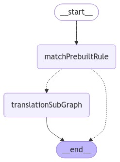

# SIEM Migration Library

## Migration Process

The SIEM migration library defines a set of UI components and services that are used to migrate third party SIEM resources like detection rules and translate them into resources that can be used in the Elastic Security app.

## Graphs:

The below images are generated by running the following command from the security_solution directory:

```bash
yarn graphs:draw
```

Main agent graph:

