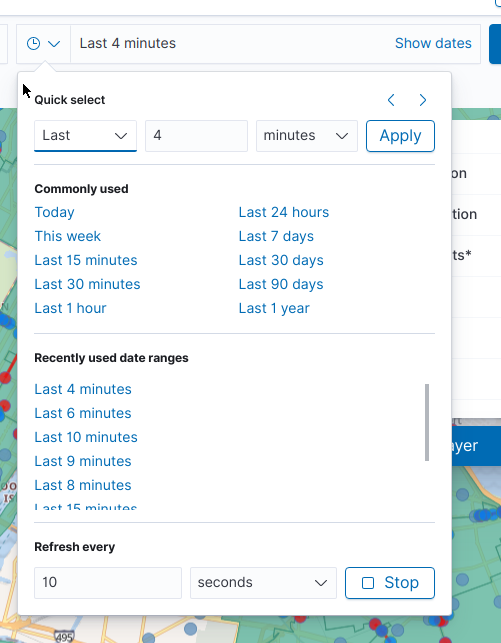
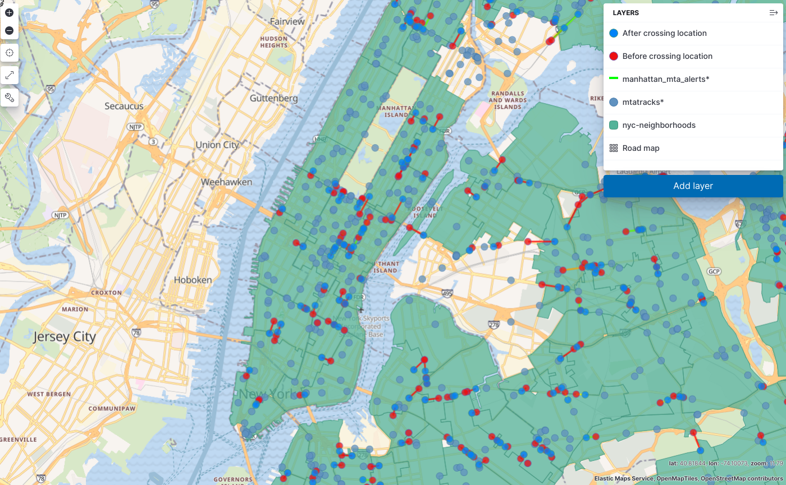

## Instructions for loading & observing data 

There are several steps required to set up geo threshold alerts for testing in a way
that allows you to view triggered alerts as they happen. These instructions outline
how to load test data, but really these steps can be used to load any data for geo
threshold alerts so long as you have the following data:
- An index containing a`geo_point` field and a `date` field. This data is presumed to
be dynamic (updated).
- An index containing `geo_shape` data, such as boundary data, bounding box data, etc.
This data is presumed to be static (not updated). Shape data matching the query is
harvested once when the alert is created and anytime after when alert is re-enabled
after disablement
The ability for threshold alerts to monitor data requires there be somewhat "real time"
data streaming in as indicated by the `date` field. Older locations determined by `date`
are compared with newer locations to determine if a boundary has been crossed in the
current monitoring interval.

### 1. Set experimental flag to enable threshold alerts
- Your `kibana.yml` config file is located in the `config/` dir in the base of your kibana
project. To edit it, open this file in your editor of choice, add the line described in
the next step to the bottom of the file (or really anywhere) and save. For more details
on different config modifications or on how to make production config modifications,
see [the current docs](https://www.elastic.co/guide/en/kibana/current/settings.html)
- Set the following configuration settings in your `config/kibana.yml`:
`xpack.stack_alerts.enableGeoTrackingThresholdAlert: true`

### 2. Run ES/Kibana dev env with ssl enabled
- In two terminals, run the normal commands to launch both elasticsearch and kibana but 
append `--ssl` to the end of each as an arg, i.e.:
  - `yarn es snapshot --ssl  # Runs Elasticsearch`
  - `yarn start --ssl # Runs Kibana`
  
### 3. Get an MTA data api key
- You'll need to obtain an NYC MTA api key, you can request this
  key [here](https://docs.google.com/forms/d/e/1FAIpQLSfGUZA6h4eHd2-ImaK5Q_I5Gb7C3UEP5vYDALyGd7r3h08YKg/viewform?hl=en&formkey=dG9kcGIxRFpSS0NhQWM4UjA0V0VkNGc6MQ#gid=0)

### 4. Get trackable point data (MTA bus data) into elasticsearch
- You'll be using the script: `https://github.com/thomasneirynck/mtatracks` to harvest
live bus data to populate the system. Clone the repo and follow the instructions in
the readme to set up. 
- Using the MTA key you obtained in the previous step, the final command to run
in a local terminal should look something like the following. This script loads large
quantities of data the frequency listed below (20000ms = 20s) or higher:
`node ./load_tracks.js -a <YOUR_API_KEY> -f 20000`

### 5. Open required Kibana tabs
There are 4 separate tabs you'll need for a combination of loading and viewing the
data. Since you'll be jumping between them, it might be easiest to just open them
upfront. Each is preceded by `https://localhost:5601/<your dev env prefix>/app/`:
- Stack Management > Index Patterns: `management/kibana/indexPatterns`
- Stack Management > Alerts & Actions: `management/insightsAndAlerting/triggersActions/alerts`
- Dev tools: `dev_tools#/console`
- Maps: `maps`

### 6. Create a new alert index in dev tools
Execute the following two commands:
- Create index
```
PUT /manhattan_mta_alerts
```
- Create mappings
```
PUT /manhattan_mta_alerts/_mapping
{
  "properties": {
    "CrossingEntityId": {
      "type": "keyword"
    },
    "CrossingTimeOfDetection": {
      "type": "date"
    },
    "CrossingLine": {
      "type": "geo_shape"
    },
    "AfterCrossingPointId": {
      "type": "keyword"
    },
    "AfterCrossingPointLocation": {
      "type": "geo_point"
    },
    "AfterCrossingTime": {
      "type": "date"
    },
    "BeforeCrossingPointId": {
      "type": "keyword"
    },
    "BeforeCrossingPointLocation": {
      "type": "geo_point"
    },
    "BeforeCrossingTime": {
      "type": "date"
    },
    "CurrentBoundaryId": {
      "type": "keyword"
    },
    "CurrentBoundaryName": {
      "type": "keyword"
    },
    "PreviousBoundaryId": {
      "type": "keyword"
    },
    "PreviousBoundaryName": {
      "type": "keyword"
    }
  }
}
```

### 7 Create map to monitor alerts
- Go to the Maps app
- Create a new map
- Using GeoJSON Upload, upload the geojson file located in the folder of the previously 
cloned `mta_tracks` repo: `nyc-neighborhoods.geo.json`. Accept all of the default
settings.
- You may want to click your newly added layer and select "Fit to data" so you can see the
boundaries you've added.
_ When finished uploading and adding the layer, save the map using a name of your
choice.
- Keep the Maps tab open, you'll come back to this

### 8. Create index pattern for generated tracks
- Go to the index pattern tab to create a new index pattern.
- Give it the index name `mtatracks*`
- For `Time field` select `@timestamp`
- Click `Create index pattern`
- Leave this tab open, you'll come back to this


### 9. Create threshold alert
- Go to the Alerts tab and click `Create Alert` > `Tracking threshold`
- Fill the side bar form top to bottom. This _should_ flow somewhat logically. In the top section, set both `Check every` and `Notify every` to `2 seconds`
- Enter a `Delayed evaluation offset` of `1` minute
- The default settings for `Select Entity` will mostly be correct. Select `mta_tracks*`
as the index you'd like to track. Use the defaults populated under
`Select entity` > `INDEX`, update `Select entity` > `BY` to `vehicle_ref`.
- `WHEN ENTITY` can be left as `entered`
- For `Select boundary` > `INDEX`, select `nyc-neighborhoods` and all populated defaults.
- Under `Actions`, create an `Index` action, then create an `Index connector`. When it
prompts you for a name, you can just call it `index connector` . For index name, use the one we 
created earlier in dev tools: `manhattan_mta_alerts`. Accept the provided defaults and save.
- Under `Document to index`, use the following structure:
```
{
    "CrossingEntityId": "{{context.entityId}}",
    "CrossingTimeOfDetection": "{{context.timeOfDetection}}",
    "CrossingLine": "{{context.crossingLine}}",
    "BeforeCrossingPointId": "{{context.fromEntityDocumentId}}",
    "BeforeCrossingPointLocation": "{{context.fromEntityLocation}}",
    "BeforeCrossingTime": "{{context.fromEntityDateTime}}",
    "AfterCrossingPointId": "{{context.toEntityDocumentId}}",
    "AfterCrossingPointLocation": "{{context.toEntityLocation}}",
    "AfterCrossingTime": "{{context.toEntityDateTime}}",
    "CurrentBoundaryId": "{{context.toBoundaryId}}",
    "CurrentBoundaryName": "{{context.toBoundaryName}}",
    "PreviousBoundaryId": "{{context.fromBoundaryId}}",
    "PreviousBoundaryName": "{{context.fromBoundaryName}}"
}
```
- At the bottom right, click `Save`. Your alert should now be created!

### 10. Create another index pattern to track the alerts you're creating
- Go to Index patterns tab and click `Create index pattern`
- Create new index pattern: `manhattan_mta_alerts`
- For `Time field` select `crossingTimeOfDetection`
- Click `Create index pattern`

### 11. Create Map
- The map you create is entirely up to you, minimally you have the following
source data to work with:
    - Original tracks data
    - Generated alert data
    - Boundary data
- Each of these data sources can be added 1 or more times with different layers
  focusing on different aspects of the data worth illustrating
- Minimally here are a few tips for working with live data:
    - Update the time settings to see new crossings and remove old ones, something
    like the following screenshot:
    
    - Consider adding multiple layers for the alerts, minimally add the crossing line
    but also consider adding layers for both the before and after locations. These would
    all come from the same source but be separate layers
    - If you add `mtatracks*`, consider setting the `Top Hits` setting to 1 or a larger
    number if you want to see a trail of where it's been. Just be aware that many busses
    moving around will create a lot of points. You could do multiple layers here where
    small points plot the bus's trail and the larger point covers the most recent location.
    - Consider adding tooltips to layers to better understand what layers you're looking at.


