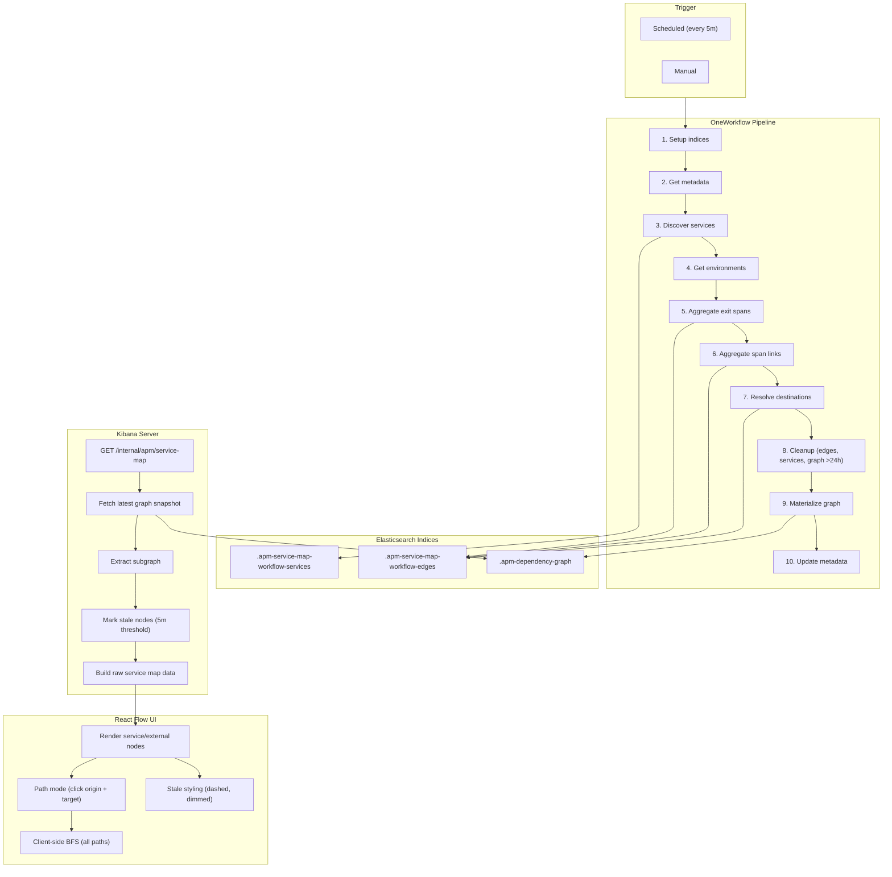

# Precomputed Service Map

## Overview

The precomputed service map uses a OneWorkflow pipeline (every 5 minutes) to aggregate APM span data into a materialized dependency graph. The UI reads the graph in constant time instead of scanning raw spans at query time.

Two resolution strategies are combined:

- **Exit spans**: `span.id` -> `parent.id` (parent-child relationship)
- **Span links**: `span.id` -> `span.links.span_id` (cross-trace messaging)

## Architecture



## Elasticsearch Indices

### `.apm-service-map-workflow-services`

Stores discovered service/environment combinations. Used by the aggregation step to scope processing per service batch.

| Field | Type | Description |
|-------|------|-------------|
| `service_name` | keyword | Service name |
| `service_environment` | keyword | Deployment environment (null for services without one) |
| `service_agent` | keyword | APM agent name |
| `doc_count` | long | Span count in discovery window |
| `discovered_at` | date | When the service was first discovered |
| `last_seen_at` | date | When the service was last seen (refreshed each run) |

### `.apm-service-map-workflow-edges`

Stores aggregated edges between services and external dependencies. Each edge is identified by a deterministic doc ID based on `(edge_type, source_service, environment, agent, destination_resource)`.

| Field | Type | Description |
|-------|------|-------------|
| `source_service` | keyword | Source service name |
| `source_agent` | keyword | Source agent name |
| `source_environment` | keyword | Source environment |
| `destination_resource` | keyword | Raw destination resource |
| `destination_service` | keyword | Resolved destination service (null until resolved) |
| `destination_environment` | keyword | Resolved destination environment |
| `destination_agent` | keyword | Resolved destination agent |
| `span_type` | keyword | Span type (e.g. `external`, `db`) |
| `span_subtype` | keyword | Span subtype (e.g. `http`, `postgresql`) |
| `edge_type` | keyword | `exit_span`, `span_link`, or `span_link_incoming` |
| `span_count` | long | Number of spans aggregated into this edge |
| `sample_spans` | keyword | Array of span IDs for resolution |
| `computed_at` | date | When this edge was computed |
| `last_seen_at` | date | When this edge was last seen |
| `max_span_timestamp` | long | Latest span timestamp |
| `consecutive_misses` | integer | Number of runs where this edge was not seen |

### `.apm-dependency-graph`

Stores the materialized graph as time-series snapshots. Each workflow run creates a new document per environment (auto-generated ID). Retention: 24 hours (~288 snapshots per environment).

The `graph_data` field uses `enabled: false` in the mapping so ES stores it as an opaque blob without indexing overhead.

| Field | Type | Description |
|-------|------|-------------|
| `environment` | keyword | Environment name (empty string for no-environment services) |
| `computed_at` | date | Snapshot timestamp |
| `node_count` | integer | Number of nodes in the graph |
| `connection_count` | integer | Number of connections |
| `graph_data` | object (enabled: false) | Full graph structure (nodes + connections) |

**Graph data structure:**

```json
{
  "environment": "production",
  "computed_at": "2026-02-16T10:00:00Z",
  "node_count": 42,
  "connection_count": 87,
  "graph_data": {
    "nodes": [
      {
        "id": "order-service",
        "type": "service",
        "agent_name": "java",
        "environment": "production",
        "span_type": null,
        "span_subtype": null,
        "last_seen_at": "2026-02-16T09:58:00Z"
      },
      {
        "id": ">postgresql/orders",
        "type": "external",
        "agent_name": null,
        "environment": null,
        "span_type": "db",
        "span_subtype": "postgresql",
        "last_seen_at": "2026-02-16T09:55:00Z"
      }
    ],
    "connections": [
      {
        "source": "order-service",
        "target": "payment-service",
        "edge_type": "exit_span",
        "span_type": "external",
        "span_subtype": "http"
      }
    ]
  }
}
```

**Node types:**

- **Service nodes**: `id` is the service name. Has `agent_name` and `environment`.
- **External nodes**: `id` is prefixed with `>` (e.g., `">postgresql/orders"`). Has `span_type` and `span_subtype`.

## Read Path

The read path serves the `GET /internal/apm/service-map` endpoint. When the precomputed graph is available, it returns the materialized graph instead of running live trace-sampling queries.

| Mode | How it works | Latency |
|------|-------------|---------|
| Specific environment | `_search` with term filter + `sort: computed_at desc` | ~5-10ms |
| All environments | `_search` with `match_all` + `collapse` on `environment` | ~10-20ms |
| Service-focused | Above + in-memory 1-hop traversal | +1-5ms |
| Path between services | Above + BFS shortest-path traversal | +1-5ms |
| Stale detection | `last_seen_at` freshness check per node (5m threshold) | included |

## Resolution Strategy

**Aggregation** (low cardinality):

- Composite aggregation groups by `(source_service, destination_service)`
- Nested terms sub-aggregation on `destination_resource` (high cardinality, scoped per pair)
- Result: ~100-1000 unique edges (not millions of spans)
- Each edge stores sample span IDs for later resolution

**Lookup** (targeted queries):

- Batch query transactions/spans where `parent.id` or `span.id` IN `[sample_span_ids]`
- Maps span IDs to destination service info
- Bulk updates matched edges

**Why it works**: Avoids indexing millions of span IDs. Composite aggregation handles low-cardinality fields efficiently, with high-cardinality fields scoped per service pair.

## Key Optimizations

- Environment-scoped aggregation (reduced cardinality, better isolation)
- Service-batched processing (5 services/batch, 10 concurrent batches)
- Incremental timestamp tracking (avoids re-processing already-seen spans)
- Time-series graph snapshots (24h history for change detection)
- Node-level freshness tracking (edge + service heartbeat signals)

## Workflow YAML

```yaml
name: apm_service_map_precompute
enabled: true
description: Pre-computes service map edges via Kibana API endpoints
tags: [apm, service-map]

triggers:
  - type: manual
  - type: scheduled
    with:
      every: 5m

consts:
  services_index: ".apm-service-map-workflow-services"
  edges_index: ".apm-service-map-workflow-edges"
  graph_index: ".apm-dependency-graph"

steps:

  - name: create_services_index
    type: elasticsearch.indices.create
    with:
      index: "{{ consts.services_index }}"
      settings: { number_of_shards: 1, number_of_replicas: 0 }
      mappings:
        properties:
          service_name: { type: keyword }
          service_environment: { type: keyword }
          service_agent: { type: keyword }
          doc_count: { type: long }
          discovered_at: { type: date }
          last_seen_at: { type: date }
    on-failure: { continue: true }

  - name: create_edges_index
    type: elasticsearch.indices.create
    with:
      index: "{{ consts.edges_index }}"
      settings: { number_of_shards: 1, number_of_replicas: 0 }
      mappings:
        properties:
          source_service: { type: keyword }
          source_agent: { type: keyword }
          source_environment: { type: keyword }
          destination_resource: { type: keyword }
          destination_service: { type: keyword }
          destination_environment: { type: keyword }
          destination_agent: { type: keyword }
          span_type: { type: keyword }
          span_subtype: { type: keyword }
          edge_type: { type: keyword }
          span_count: { type: long }
          sample_spans: { type: keyword }
          computed_at: { type: date }
          last_seen_at: { type: date }
          max_span_timestamp: { type: long }
          consecutive_misses: { type: integer }
    on-failure: { continue: true }

  - name: get_metadata
    type: kibana.request
    with:
      method: POST
      path: "/internal/apm/service-map/workflow/get-metadata"
      headers: { kbn-xsrf: "true" }
    on-failure: { continue: true }

  - name: discover_active_services
    type: kibana.request
    with:
      method: POST
      path: "/internal/apm/service-map/workflow/discover-services"
      headers: { kbn-xsrf: "true" }
      body:
        start: "{{ steps.get_metadata.output.effectiveStart }}"
        end: "{{ steps.get_metadata.output.end }}"
    on-failure: { continue: true }

  - name: get_unique_environments
    type: kibana.request
    with:
      method: POST
      path: "/internal/apm/service-map/workflow/get-environments"
      headers: { kbn-xsrf: "true" }
    on-failure: { continue: true }

  - name: aggregate_exit_spans_by_environment
    type: foreach
    foreach: "{{ steps.get_unique_environments.output.environments }}"
    steps:
      - name: aggregate_exit_spans_for_env
        type: kibana.request
        with:
          method: POST
          path: "/internal/apm/service-map/workflow/aggregate-exit-spans-by-service"
          headers: { kbn-xsrf: "true" }
          body:
            start: "{{ steps.get_metadata.output.effectiveStart }}"
            end: "{{ steps.get_metadata.output.end }}"
            environment: "{{ foreach.item }}"
            servicesPerBatch: 5
            maxConcurrency: 10
        on-failure: { continue: true }

  - name: aggregate_span_links_by_environment
    type: foreach
    foreach: "{{ steps.get_unique_environments.output.environments }}"
    steps:
      - name: aggregate_span_links_for_env
        type: kibana.request
        with:
          method: POST
          path: "/internal/apm/service-map/workflow/aggregate-span-links-by-service"
          headers: { kbn-xsrf: "true" }
          body:
            start: "{{ steps.get_metadata.output.effectiveStart }}"
            end: "{{ steps.get_metadata.output.end }}"
            environment: "{{ foreach.item }}"
            servicesPerBatch: 5
            maxConcurrency: 10
        on-failure: { continue: true }

  - name: resolve_destinations_by_environment
    type: foreach
    foreach: "{{ steps.get_unique_environments.output.environments }}"
    steps:
      - name: resolve_destinations_for_env
        type: kibana.request
        with:
          method: POST
          path: "/internal/apm/service-map/workflow/resolve-destinations"
          headers: { kbn-xsrf: "true" }
          body:
            environment: "{{ foreach.item }}"
        on-failure: { continue: true }

  - name: cleanup
    description: "Removes stale edges (>24h), stale services (>24h), and old graph snapshots (>24h)"
    type: kibana.request
    with:
      method: POST
      path: "/internal/apm/service-map/workflow/cleanup"
      headers: { kbn-xsrf: "true" }
    on-failure: { continue: true }

  - name: create_graph_index
    type: elasticsearch.indices.create
    with:
      index: "{{ consts.graph_index }}"
      settings: { number_of_shards: 1, number_of_replicas: 0 }
      mappings:
        properties:
          environment:       { type: keyword }
          computed_at:       { type: date }
          node_count:        { type: integer }
          connection_count:  { type: integer }
          graph_data:        { type: object, enabled: false }
    on-failure: { continue: true }

  - name: materialize_graph_by_environment
    type: foreach
    foreach: "{{ steps.get_unique_environments.output.environments }}"
    steps:
      - name: materialize_graph
        type: kibana.request
        with:
          method: POST
          path: "/internal/apm/dependency-graph/materialize"
          headers: { kbn-xsrf: "true" }
          body:
            environment: "{{ foreach.item }}"
        on-failure: { continue: true }

  - name: update_metadata
    description: "Advances the cursor ONLY after all steps succeed — prevents data loss on partial failures"
    type: kibana.request
    with:
      method: POST
      path: "/internal/apm/service-map/workflow/update-metadata"
      headers: { kbn-xsrf: "true" }
      body:
        timestamp: "{{ steps.get_metadata.output.end }}"
    on-failure: { continue: true }

```

## API Endpoints

### Write path (used by workflow)

| Endpoint | Description |
|----------|-------------|
| `POST /internal/apm/service-map/workflow/get-metadata` | Returns `last_processed_timestamp`, `effectiveStart`, `end` |
| `POST /internal/apm/service-map/workflow/discover-services` | Discovers active services, stores in services index |
| `POST /internal/apm/service-map/workflow/get-environments` | Returns unique environments from services index |
| `POST /internal/apm/service-map/workflow/aggregate-exit-spans-by-service` | Aggregates exit span edges per environment |
| `POST /internal/apm/service-map/workflow/aggregate-span-links-by-service` | Aggregates span link edges per environment |
| `POST /internal/apm/service-map/workflow/update-metadata` | Updates last processed timestamp |
| `POST /internal/apm/service-map/workflow/resolve-destinations` | Resolves destination services from sample spans |
| `POST /internal/apm/service-map/workflow/cleanup` | Removes stale edges, services, and graph snapshots (>24h) |
| `POST /internal/apm/dependency-graph/materialize` | Materializes graph for an environment |

### Read path (used by UI)

| Endpoint | Description |
|----------|-------------|
| `GET /internal/apm/service-map` | Returns the service map (uses precomputed graph when available) |

## File Structure

```
server/routes/service_map/
  route.ts                          # All API route definitions
  get_service_map.ts                # Main entry point (switches between precomputed and live)
  workflow/
    core/
      types.ts                      # ServiceMapEdge type
      utils.ts                      # Index names, doc ID builder, constants
      chunk_processing.ts           # Time-window chunking, concurrency control
    discovery/
      discover_services.ts          # Service discovery via composite aggregation
      get_environments.ts           # Unique environment extraction
    aggregation/
      aggregation.ts                # Exit span + span link aggregation
      aggregate_by_service.ts       # Service-batched aggregation orchestration
    storage/
      indexing.ts                   # Edge bulk indexing and persistence
      metadata.ts                   # Workflow metadata (timestamps)
      cleanup_service_map_edges.ts  # Unified cleanup (edges, services, graph snapshots)
    resolution/
      resolve_service_map_destinations.ts  # Destination resolution via span lookups
    graph/
      types.ts                      # Graph document types (nodes, connections)
      utils.ts                      # GRAPH_INDEX constant, buildExternalNodeId
      materialize_graph.ts          # Graph construction from edges
      get_precomputed_service_map.ts  # Read path: fetch, filter, convert graph
```
