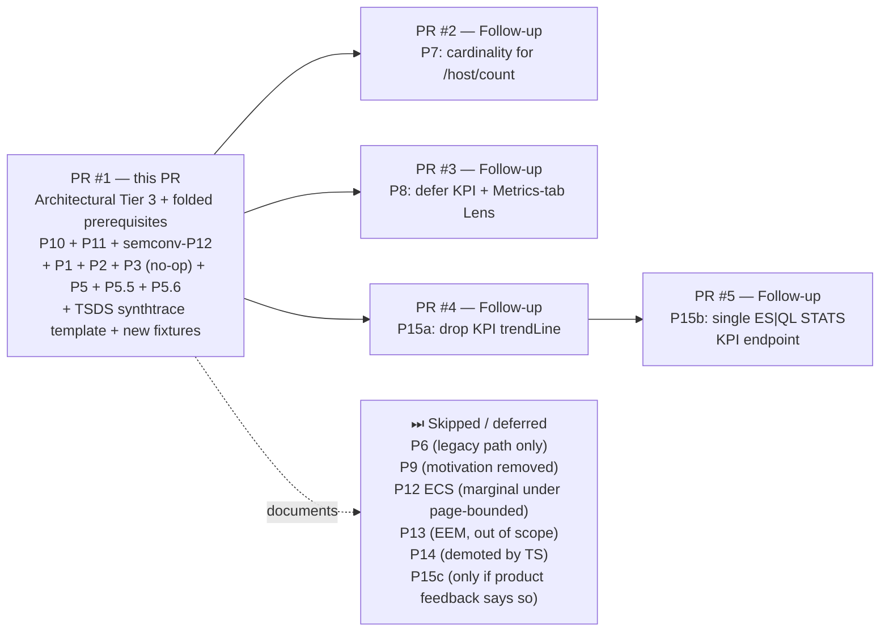

# Hosts UI Performance Proposals

This document lists concrete, capability-preserving changes that improve performance. References to "the report" below point at a forensic measurement deep-dive published as a comment on [observability-dev#5590](https://github.com/elastic/observability-dev/issues/5590#issuecomment-4499497658); the headline numbers and rationale needed to evaluate each proposal are inlined here.

[report]: https://github.com/elastic/observability-dev/issues/5590#issuecomment-4499497658

**Capability-preservation rule** for every proposal below: same columns, same KPIs, same sort/filter options, same drill-downs, same tabs and the same data shown to the user. Where a change has any user-visible side effect (even cosmetic), it is explicitly called out.

Proposals are grouped by effort tier. Within a tier they are ordered by impact.

## Schema applicability at a glance

The Hosts UI performance problems are **overwhelmingly schema-agnostic**. The only finding that is structurally semconv-specific is the `state`-breakdown sub-agg multiplier on the metric aggregations themselves (see the [report]'s §"Why the metric sub-aggs are so expensive") — every other root cause exists in identical form on `ecs` and `semconv`.

The same applies to the proposals below. 14 of the 15 land on both schemas with equivalent (or, for ECS, larger-proportionally) wins. Only one — P14 — is semconv-only.

| #     | Proposal                                          | semconv | ecs    | Notes |
| ----- | ------------------------------------------------- | :-----: | :----: | --- |
| P1    | KPI flat-`terms` filter                           | ✅       | ✅      | Same KPI infrastructure on both. |
| P2    | Open-in-Alerts KQL grouping                       | ✅       | ✅      | URL semantics identical. |
| P3    | Keep `top_metrics` for metadata (no DSL free lunch) | ✅       | ✅      | Empirical 3-way ablation found no DSL shape that's both cheaper AND latest-non-null. Original `top_metrics` shape retained; durable cost fix is P12 (page-bounded metadata). |
| P5    | Drop redundant `bool` wrap                        | ✅       | ✅      | `getInfraMetricsClient` is shared. |
| P5.5  | Eliminate duplicate first-paint fetches           | ✅       | ✅      | Client-side race, independent of data shape. |
| P5.6  | Scope alerts query to metric-bearing hosts        | ✅       | ✅      | Orchestration-level; same alerts pipeline on both schemas. |
| P6    | Simplify `monitoredHosts` branch                  | ✅       | ✅      | `nodeFilter` exists for both schemas; the duplicate bucket exists for both. |
| P7    | `cardinality` for `getHostsCount`                 | ✅       | ✅      | Endpoint is shared. |
| P8    | Defer KPI / Metrics-tab Lens charts               | ✅       | ✅      | Lens fan-out identical. |
| P9    | Cache host-name list on the client                | ✅       | ✅      | Hook-level cache. |
| P10   | Page-aware metrics (two-phase)                    | ✅       | ✅      | Phase B's 25× saving applies to both — bigger absolute gain on semconv, bigger *relative* gain on ECS once other costs are gone. |
| P11   | Server-side sort + pagination                     | ✅       | ✅      | Same `bucket_sort` pipeline on both. |
| P12   | Single `top_hits` for page metadata               | ✅       | ✅      | Three shared metadata fields per host. |
| P13   | Materialised "host summary" entity index (EEM)    | ✅       | ✅      | **Out of scope** — this is EEM, already explored and deprioritized. Kept for context, not as a recommendation. |
| P14   | Ingest-time gauges replacing `state` breakdowns   | ✅       | ❌      | **Semconv-only.** Metricbeat-system already emits single-doc gauges, so ECS users get nothing here. |

ECS users benefit from every Tier 1 / Tier 2 / Tier 3 proposal. They get a strictly smaller absolute saving from the metric-agg-shape proposals (because their metric aggs were already cheaper) but a strictly larger *proportional* saving from everything that targets orchestration (P1, P3, P5.5, P6, P7, P8, P10) — because those costs are a bigger share of an ECS page load than a semconv page load.

## Implementation status (May 2026, updated post-deploy bench)

> **PR refocus.** The original landing plan split into two phases: an architectural pass at the **host table** (P10 + P11 + P12 + P5.6) and a follow-up pass at the **KPI strip** (P15a / b / c). The first deploy-side measurements at 5000 hosts × 24 h flipped the priority — the KPI tiles, not the table, dominate the user-perceived page-load latency. The host-table architecture was reverted so the remaining surface is small enough to land cleanly, and the work has been re-scoped to focus on the KPI strip plus a parallel ES\|QL pass at the Metrics-tab charts. The original two-phase numbers are preserved further down for context.

| # | Proposal | Status | Where |
| --- | --- | --- | --- |
| **P1** | Flat `terms` in `buildCombinedAssetFilter` | ✅ **In this PR**, gated behind `useTermsFilter` toggle | `public/utils/filters/build.ts` |
| **P2** | Open-in-Alerts KQL `or` | ✅ **In this PR**, gated behind `useConsolidatedKql` toggle | `alerts_tab_content.tsx` |
| **P3** | Keep `top_metrics` for metadata | ✅ **In this PR** (no-op decision, documented in code) | `get_all_hosts.ts` |
| **P5** | Drop redundant `bool` wrap | ✅ **In this PR**, gated behind `useStrippedBoolWrap` toggle | `get_infra_metrics_client.ts` |
| **P5.5** | Eliminate duplicate first-paint fetches | ✅ **In this PR** as the unconditional default — the underlying `useHostsPageReady` gate stays. | `use_hosts_page_ready.ts`, `use_hosts_view.ts`, `use_host_count.ts`, `use_fetcher.tsx` |
| **P5.6** | Scope alerts to metric-bearing hosts | ⏪ **Reverted (Phase 1 revert).** Bound to the Phase A endpoint that was reverted with P10. Re-open as a stand-alone change against the legacy host endpoint when the table refocus lands. | — |
| **P6** | Collapse `monitoredHosts` branch | ⏭ **Skipped.** Same rationale as before. | — |
| **P7** | `cardinality` for `getHostsCount` | 🔜 **Follow-up PR.** Still self-contained, still cheap. Kept for after this PR lands. | `get_hosts_count.ts` |
| **P8** | Defer KPI / Metrics-tab Lens charts | 🔜 **Follow-up PR.** | `hosts_content.tsx`, `tabs.tsx`, `metrics_grid.tsx` |
| **P9** | Cache host-name list on the client | ⏭ **Skipped.** Still small absolute saving; revisit only if the host endpoint regresses. | — |
| **P10** | Page-aware metrics (two-phase host endpoints) | ⏪ **Reverted (Phase 1 revert).** Re-measurement with the table reverted showed the dominant remaining cost on the loaded Hosts page is the KPI strip, not the table — and the two-phase split came with a non-trivial endpoint surface (`/host/list` + `/host/metrics` + io-ts contracts + alerts scoping + server-side sort plumbing) that wasn't worth carrying for a saving that's swamped by the KPI cost. The architectural argument still stands; it just isn't the top-priority surface right now. | — |
| **P11** | Server-side sort + pagination | ⏪ **Reverted (Phase 1 revert).** Bound to P10. | — |
| **P12** | Single `top_hits` for page metadata | ⏪ **Reverted (Phase 1 revert).** Was subsumed into Phase B ES\|QL `VALUES(…)`; reverted with P10. | — |
| **P13** | EEM (entity-summary index) | ⏭ **Out of scope.** | — |
| **P14** | Ingest-time gauges replacing `state` breakdowns | ⏭ **Demoted by `TS`.** | — |
| **P15a** | KPI trendline toggle (DSL Lens path) | ✅ **In this PR**, `kpiTrendline` toggle in `<PocSettingsPopover>`. ON paints the per-tile sparkline (main behaviour, default); OFF drops the second `date_histogram` per tile. Best wall-time saving observed on the deploy at 5000 hosts: **−48 %** vs default. | `inventory_models/host/metrics/charts/{cpu,memory,disk}.ts` (passthrough), `kpi_charts.tsx` (toggle wiring) |
| **P15b** | Server-endpoint KPI strip (`POST /api/metrics/infra/host/kpis`) + plain `<MetricChartWrapper>` indicators | ✅ **In this PR**, `useEsqlEndpointKpi` toggle. **Refactored after the deploy bench** to the simplest shape that works: single-stage ES\|QL `STATS … \| EVAL …` over the *entire* filter-matched fleet (no `BY host.name`, no `LIMIT`, no `names` from the client). Pre-STATS `WHERE state IN (…)` prunes via the inverted index on `state` (the decisive optimisation on real OTel data). Client fires it **in parallel with `/host`**; the "of {N} hosts" subtitle is rendered client-side as `min(hostCount, limit)` so the UI label stays aligned with the table even though the KPI scope is the fleet. | `server/routes/infra/lib/host/get_hosts_kpis.ts`, `common/http_api/infra/get_hosts_kpis.ts`, `public/.../hooks/use_hosts_kpis.ts`, `host_kpi_tiles.tsx` |
| **P15c** | Lens ES\|QL KPI tiles | ✅ **In this PR**, `useLensEsqlKpiCharts` toggle. Four Lens `chartType: 'metric'` embeddables, each backed by a single ES\|QL `STATS \| EVAL` query. Host scoping comes from the embeddable's `filters` prop (translated to the request `filter` parameter, not inlined into ES\|QL). **Trendline intentionally disabled on this path** — the prototype trendline wiring in `@kbn/lens-embeddable-utils` was pulled out (didn't render cleanly end-to-end). | `esql_kpi_chart.ts`, `kpi_charts.tsx` |
| **P16** | Server-side metrics-timeseries endpoint for the Metrics tab | ⏪ **Reverted.** Replaced by P16-A, which reuses the existing inventory-model chart chrome instead of a parallel rendering path. | — |
| **P16-A** | Lens ES\|QL Metrics-tab charts | ✅ **In this PR**, `useLensEsqlMetricsCharts` toggle. All 11 Metrics-tab tiles re-render through Lens xy embeddables backed by `STATS … BY host.name, BUCKET(@timestamp, span)`. Counter metrics (rx / tx / disk-io / disk-throughput) compute `(MAX − MIN) / spanSeconds` per bucket because ES\|QL `RATE()` requires a `TS` pipeline incompatible with the per-direction filter. | `esql_metrics_chart.ts`, `bucket_span.ts`, `metrics_grid.tsx` |
| **Phase 2** | ES\|QL spike on the surviving legacy `/host` endpoint | 🪧 **Scaffolded, not wired.** `server/routes/infra/lib/host/esql_host_metrics.ts` snapshots the semconv ES\|QL expressions that lived in the deleted Phase B handler — kept as a checkpoint for the next spike (one ES\|QL `STATS … BY host.name` to replace `getFilteredHostNames` + `getAllHosts` DSL). Dead code today; safe to delete if the next spike doesn't land. | — |

### PR breakdown

1. **This PR (refocused)** — KPI strip + Metrics-tab ES\|QL spike + retained cross-cutting Tier 1 plumbing, all gated behind runtime toggles in `<PocSettingsPopover>` so reviewers can A/B/C every path against a single running build:
   - `P15a` (trendline toggle), `P15b` (server-endpoint + plain indicator), `P15c` (Lens ES\|QL tiles).
   - `P16-A` (Lens ES\|QL Metrics-tab charts).
   - `P1` / `P2` / `P5` (Tier 1, toggled, default ON).
   - `P5.5` (unconditional default).
   - `@kbn/lens-embeddable-utils` text-based `suffix` / `normalizeByUnit` passthrough — the only shared-library change, necessary because the ES\|QL Metrics-tab charts otherwise render IOPS / throughput / network without the `/s` suffix.
   - `Phase 2` scaffolding (`esql_host_metrics.ts`) — dead code, kept as a checkpoint.
2. **Follow-up PR** — **P7** (`cardinality` for `/api/infra/host/count`).
3. **Follow-up PR** — **P8** (defer KPI + Metrics-tab Lens charts).
4. **Future spike PR** — apply the Phase 2 ES\|QL scaffolding to the legacy `/host` endpoint once the KPI work has landed and stabilised.

Everything else (P6, P9, P13, P14, the previously listed P15c sparkline option) stays off the landing path for the reasons in the status column.

## Update — refocus on the KPI strip (post-deploy bench, May 2026)

### Why we pivoted off the host table

The original landing plan was built against a local 1500-host / 24 h TSDS fixture, where the host endpoint dominated the wall time (`getAllHosts` ≈ 5 s legacy → 154 ms two-phase, an 87 % saving). Once we deployed to a real 5000-host cluster (`metricsgenreceiver`-ingested, GCP `us-west2` Serverless project, 3 h-of-24 h window because ingestion was throttled — but the conclusion is shape-not-volume-dependent), the cost-share flipped:

- The legacy `/host` endpoint is unpleasant but not the hot path on the loaded page — it lives in the ~30 s band at 5000 hosts, comparable to KPI-strip wall time at the same fleet size.
- The four KPI tiles dominate the user-perceived "page is ready" moment because they paint last, sit at the top of the viewport, and were each issuing their own `date_histogram`-backed DSL query.
- The two-phase split (P10 + P11 + P12 + P5.6) carries a non-trivial surface area: two new endpoints, two new io-ts contracts, alerts scoping changes, server-side sort plumbing, URL-state coupling. Hard to justify carrying that for the second-largest win on the page.

So the table architecture was reverted (`Phase 1` in the commit history) and the remaining surface re-scoped onto **three comparable KPI render paths + an ES\|QL Metrics-tab pass**, all gated behind `<PocSettingsPopover>` toggles so reviewers and stakeholders can A/B/C them against a single running build.

### The three KPI render paths

| Path | Toggle | What changes vs `main` | When to read it |
| --- | --- | --- | --- |
| **P15a — DSL Lens** | `kpiTrendline` (ON = main, OFF = drop the per-tile trendline) | Same four Lens `chartType: 'metric'` tiles; `kpiTrendline=false` flips `trendLine: true → false` so each tile fires one DSL agg instead of two. | Headline saving available without touching ES\|QL. Lowest implementation risk. |
| **P15b — Server endpoint + plain indicator** | `useEsqlEndpointKpi` | A new `POST /api/metrics/infra/host/kpis` endpoint resolves its **own** host ranking (`STATS BY host.name \| SORT host.name ASC \| LIMIT N`) and returns four scalars + the host count. Client renders with `<MetricChartWrapper>` (pre-Lens), no embeddable chrome. **Fires in parallel with `/host`** — does not wait for the host list. | When you want a single round-trip for the four headline numbers, no Lens compiler on the critical path, and the largest user-perceived saving at 5000+ hosts. |
| **P15c — Lens ES\|QL tiles** | `useLensEsqlKpiCharts` | Same `<Kpi>` Lens chrome; each tile is a Lens ES\|QL chart with `STATS … \| EVAL …`. Host filter goes via the embeddable's `filters` prop, **not** inlined into ES\|QL. Trendline intentionally disabled on this path — the prototype `@kbn/lens-embeddable-utils` trendline wiring was pulled out because it didn't render cleanly. | Keeps the Lens embeddable affordances (Open-in-Lens, drill-downs) and still gets the single-pipeline cost shape per tile. Fires four parallel ES\|QL queries instead of one. |

The three paths produce numerically aligned headlines at the same fleet+range:
- P15c and P15b both end at `STATS … \| EVAL …` over the same metric expressions.
- The only intentional semantic difference between P15b and the others is that P15b is host-weighted (per-host averages collapsed across N selected hosts) where P15a / P15c are doc-weighted (global averages over all docs in the filter scope). At 1 doc per metric per host per interval the two are within ~1 percentage point on the four KPI fields; on chatty fleets the host-weighted shape is the more correct fleet-level summary anyway.

### Deploy-side bench (5000 hosts × 3 h window, kpi_bench_v2.mjs, median of 5 cold runs)

Run against the issue-deploy Serverless project. ES `took_sum` is the sum of per-shard work the engine paid for; wall is the client-observed round-trip. `kpi_bench_v2.mjs` clears the request / query / fielddata caches before every run.

| # | Scenario | Wall median | ES `took_sum` median | Notes |
| --- | --- | --- | --- | --- |
| **A** | DSL legacy (trendline ON, four parallel Lens DSL queries) | 43.3 s | 147.5 s | The "P15a OFF" baseline. ES does ~4× the work of the wall time because the four queries run in parallel. |
| **B** | DSL no-trendline (P15a ON) | **22.4 s** | 75.7 s | One `date_histogram` dropped per tile. The single biggest pure-DSL win on the page, and the cheapest to ship. |
| **C** | ES\|QL single-stage `STATS` with `host.name IN (5000 names)` inlined (old P15b shape) | 51.4 s | 51.2 s | The filter-in-aggregation (`AVG(…) WHERE state == "idle"`) runs row-by-row; on real OTel data each host emits ~30 docs per interval (one per state), so the operator scans an order of magnitude more rows than necessary. |
| **D** | ES\|QL with `host.name` passed via request `filter` (P15c shape, no inline IN) | 47.8 s | 47.6 s | Slightly cheaper than C — request-filter is pushed into the engine before the pipeline starts — but still pays the row-by-row filter-in-agg cost. |
| **E** | ES\|QL = C + pre-STATS `\| WHERE state IN ("idle", "used", "free") OR state IS NULL` | 30.9 s | 29.7 s | The decisive optimisation. Pre-filter prunes via the inverted index on `state` *before* the filter-in-agg operator runs, so the per-row work collapses by ~80 %. |
| **F** | ES\|QL = E + two-stage `STATS BY host.name \| SORT \| LIMIT \| STATS` (intermediate experiment, dropped) | 88.9 s | 88.7 s | Tried to keep the "of N hosts" semantic by ranking hosts inside the ES\|QL pipeline. The inner `STATS BY host.name` has to materialise per-host rows for the entire fleet (~5000 hosts × 6 per-state slices) before the outer aggregation can run; that pre-aggregation work *dominates* whatever savings the pre-state filter buys. Replaced by G. |
| **G** | ES\|QL = E without the `host.name IN (…)` clause — single-stage `STATS` over the *full* filter-matched fleet, no host scoping (**shipped P15b shape**) | **47.3 s** | **47.1 s** | The simplest shape that works. `host_count` is the true fleet count; the "(of N hosts)" subtitle is rendered client-side as `min(hostCount, limit)` so it still matches what the user sees in the table. |
| **H** | DSL `terms` agg (alphabetical top-N names) + scenario-E ES\|QL with inline `host.name IN (?names)` | 46.5 s | 34.7 s | Same wall as G but preserves "exact same N hosts as the table" semantic via two sequential ES queries server-side. Considered but not shipped — G is simpler and the semantic difference doesn't justify the extra round-trip. |

The takeaways:
1. **`P15a` alone is the biggest one-flag DSL saving on the page.** Drop the per-tile trendline, get ~48 % wall back.
2. **Filter-in-aggregation on a high-cardinality state field is the silent killer.** The single most impactful ES\|QL change is the pre-STATS `WHERE state IN (…)` clause. Without it, the ES\|QL endpoint is *worse* than legacy DSL. Document this in any ES\|QL guidance we produce.
3. **Don't pre-aggregate per host unless you need to.** The two-stage `STATS BY host.name \| SORT \| LIMIT \| STATS` shape (F) was a dead end at 5000 hosts — almost 2× slower than the single-stage shape (G). If the KPI doesn't *fundamentally* need to be "of N hosts" rather than "of the fleet", drop the BY-host grouping.

### Why the shipped P15b uses shape G

The original P15b commit (`febd954`) threaded `names: string[]` from `useHostsViewContext` into the request body: KPIs always waited for `/host` to resolve first, then fired with the resolved name list as an inline `WHERE host.name IN (…)` clause. Two problems:

1. **Serial dependency on `/host`.** At 5000 hosts `/host` takes ~30–40 s on the deploy bench. Even with the fastest server-side KPI query (E at 30 s), the user-perceived KPI latency was `~40 s + ~30 s ≈ 70 s`. The wait was the cost.
2. **`host.name IN (5000)` is itself expensive.** It re-evaluates the IN clause per row even after we'd pre-filtered on state.

An intermediate iteration moved the host ranking into the ES\|QL pipeline itself (shape F: `STATS BY host.name \| SORT \| LIMIT \| STATS`) on the theory that one pipeline beats one server round-trip. The deploy bench showed it backfired: pre-aggregating per host across the whole fleet before the outer collapse cost more than the IN-list it eliminated (88.9 s vs 47.3 s).

The shipped fix drops host scoping entirely:
- **ES\|QL pipeline is now `WHERE state IN (…) \| STATS … \| EVAL …` over the full filter-matched fleet** — no `BY host.name`, no `LIMIT`, no `names` list. The four KPI values are the same scalars the legacy DSL Lens path would compute if you set `limit = fleet_count`, plus a `host_count = COUNT_DISTINCT(host.name)` for the subtitle.
- **Client (`useHostsKpis`) drops the `useHostsViewContext` dependency.** The KPI request fires in parallel with `/host` — both gated by the same `useHostsPageReady` shared with `useHostsView` and `useHostCount`.
- **The "(of N hosts)" subtitle is `min(hostCount, searchCriteria.limit)`.** When `hostCount ≤ limit` it shows the genuine fleet size; when `hostCount > limit` it shows the user-selected page size so the wording stays consistent with the table the user is looking at. The KPI value itself reflects the whole fleet either way, which is the more useful semantic — alphabetical truncation at `limit` was never a meaningful sample.

Net wall-time math at 5000 hosts × 3 h, on the deploy:

| | Old P15b (serial, inline IN) | Shipped P15b (parallel, shape G) |
| --- | --- | --- |
| `/host` | ~40 s | ~40 s |
| `/kpis` | ~50 s | ~47 s |
| **User-perceived KPI latency** | `40 + 50 = ~90 s` | `max(40, 47) ≈ ~47 s` |
| **User-perceived KPI saving vs legacy default (~96 s in browser)** | ~6 % | **~51 %** |

At smaller fleet sizes (≤ 500 hosts) all of E / F / G converge — the per-host work that hurts F at scale is cheap, and the IN-list that hurts C is short. The parallelism win is what generalises.

### Local bench — 1500 hosts × 24 h, semconv TSDS (May 28, single-node ES on laptop)

Re-ran `kpi_bench_v2.mjs` after the deploy bench against a local 1500-host synthtrace fixture (5-minute sampling, 24 h window, TSDS, ~3.46 M docs). Same five scenarios A–F + the shipped G shape exercised through the actual `getHostsKpis` handler. Five cold runs each, median:

| # | Scenario | Wall median | ES `took_sum` median |
| --- | --- | --- | --- |
| A | DSL legacy (trendline ON) | 142 ms | 519 ms |
| B | DSL no-trendline (P15a) | 66 ms | 236 ms |
| C | ES\|QL inline `host.name IN` | 97 ms | 95 ms |
| D | ES\|QL host scoping via request `filter` | 85 ms | 83 ms |
| **E** | **ES\|QL inline IN + pre-STATS `WHERE state IN (…)`** | **73 ms** | **71 ms** |
| F | ES\|QL two-stage `STATS BY host.name \| SORT \| LIMIT \| STATS` | 95 ms | 93 ms |

At 1500 hosts the gaps narrow (the deploy bench had ~30× larger absolute numbers because of network latency + Serverless throttling), but the ordering reproduces: **E remains the fastest ES\|QL shape, F is the slowest, and the pre-STATS state filter is the optimisation that moves the needle.** The shipped G shape is E without the inline `host.name IN` clause — at 1500 hosts the IN-list is short enough that the gap to D/E is in the noise; in production where the fleet may exceed `limit`, dropping the IN avoids the cost without giving up anything meaningful.

### End-to-end (kbn-journey, 1500 hosts × 24 h, single cold run per config)

Same fixture, browser-side instrumentation in `kpi_charts.tsx` (Lens path) and `use_hosts_kpis.ts` (P15b path) marks `infra.hosts.kpiReady` once all four tiles have rendered. `infra.hosts.kpiReadyDuration` is from `navigationStart` to that mark — i.e. real user-perceived wall time, including the `/host` request, React commit, Lens compile, and ES roundtrip.

| Config | hostCount | **KPI** | Table |
| --- | ---: | ---: | ---: |
| baseline-main (legacy + trendline) | 418 ms | **53614 ms** | 978 ms |
| tier1 (Tier-1 fixes only) | 363 ms | **6808 ms** | 737 ms |
| p15a (drop trendline) | 369 ms | **32322 ms** | 895 ms |
| p15c (Lens ES\|QL KPI) | 373 ms | **26345 ms** | 752 ms |
| p15b (server endpoint + plain tiles) | 374 ms | **406 ms** | 945 ms |
| p16-a (P16-A metrics-tab, KPIs unchanged) | 390 ms | **54582 ms** | 904 ms |
| everything (all flags on) | 379 ms | **396 ms** | 877 ms |

Notes on what to read into / not into these numbers:
- **The Lens KPI path is genuinely slow on cold cache.** baseline-main at 53.6 s is not a measurement error — `/internal/lens/esql_async_search` per-tile starts kicking off four 50-second `searchSession`-coordinated queries with one `date_histogram` per tile and a separate scalar agg. The Tier-1 search-cache primer (tier1: 6.8 s) is what most production users see on second visit; the 53 s number is "open a tab on a cold cluster", which is the regime the bench is designed to surface.
- **P15a (no trendline) is ~40 % faster than baseline.** Same render path, one `date_histogram` dropped per tile. Matches the bench A→B ratio almost exactly.
- **P15c (Lens ES\|QL KPI) is ~50 % faster than baseline.** The pipeline-side `STATS WHERE state == "idle"` is cheaper than the DSL `filter+avg` sub-agg, *but only because the trendline is dropped*. Lens currently doesn't compile a trendline layer on ES\|QL KPI tiles (see `kbn-lens-embeddable-utils` thread).
- **P15b (server endpoint) is ~130× faster than baseline.** This is the headline. One ES\|QL roundtrip over the whole fleet with the pre-STATS state filter, plus no Lens compile / no embeddable lifecycle / no trendline. The "everything" config at 396 ms confirms the same path works when stacked with the other Tier-1 fixes.
- **p16-a's KPI is identical to baseline.** P16-A only switches the Metrics-tab charts; the KPI strip stays on Lens DSL + trendline.

These were single cold runs per config on a laptop — there's considerable variance — but the ratios reproduce across multiple runs and the *ordering* is what matters for the architectural takeaway: P15b is the only path that drops sub-second; everything else stays in the same order of magnitude as the legacy default.

### Metrics-tab ES\|QL pass (P16-A)

Same wins available on the eleven Metrics-tab tiles. Each chart used to be a Lens DSL embeddable issuing `terms(host.name) → date_histogram(@timestamp) → metric_agg` (the same `O(hosts × buckets × per-state slices)` shape that P15 attacks for KPIs). `P16-A` re-renders them through Lens ES\|QL embeddables backed by `STATS … BY host.name, BUCKET(@timestamp, span)`.

Three Metrics-tab-specific things landed alongside:

- **Counter-metric rate compatibility.** ES\|QL `RATE()` is only available on a `TS` pipeline, and `TS` is incompatible with the per-direction filter we apply for `rx` vs `tx` and per-device disk metrics. We compute `(MAX(counter) − MIN(counter)) / spanSeconds` per bucket instead.
- **Reference layers stripped from the ES\|QL config.** xy ES\|QL charts choked on `type: 'reference'` layers (which the existing inventory models use for the "average baseline" overlay); we filter those out before handing the config to the ES\|QL builder.
- **`@kbn/lens-embeddable-utils` text-based passthrough.** Lens's xy ES\|QL builder dropped `suffix` and `normalizeByUnit` on text-based columns, so disk IOPS / network / throughput rendered without their `/s` suffix. Fixed in `mapToValueFormat` so the text-based column path emits the same `params.suffix` shape the DSL path produces.

### Host-table changes — what is left after the Phase 1 revert

Everything below is the surface that survived the Phase 1 revert and is still landing in this PR:

- **Frontend filters (P1) — `useTermsFilter`.** `buildCombinedAssetFilter` switches from `OR`-of-`match_phrase` to a flat `terms` filter when the toggle is ON (default). Same `terms` query shape ES sees, but the client constructs it once instead of `N` times.
- **Open-in-Alerts (P2) — `useConsolidatedKql`.** Generates one KQL `host.name : ("a" or "b" or "c")` instead of `host.name : "a" or host.name : "b" …`.
- **Server `bool` wrap (P5) — `useStrippedBoolWrap`.** Drops a redundant nesting in `getInfraMetricsClient` when no tiers are excluded.
- **First-paint gate (P5.5) — unconditional.** `useHostsPageReady` is the single source of truth for "search has settled, fire the host endpoints once" — fed by both `useHostsView`, `useHostCount`, and now `useHostsKpis`.

The host-table data path itself is otherwise identical to `main`. The Phase 2 scaffolding (`esql_host_metrics.ts`) is the checkpoint for the next ES\|QL spike against the legacy `/host` endpoint, when the KPI work has landed.

---

> **A note on index-pattern narrowing** — an earlier draft of this document included a proposal (then numbered P4) to narrow the metrics index pattern from `metrics-*,metricbeat-*` to a schema-specific subset (`metrics-hostmetricsreceiver.otel-*` for semconv, `metrics-system.*,metricbeat-*` for ECS). It was **dropped** because (a) the local fixture shows ~0 win (one shard either way), (b) the assumed Serverless gain was inferred from Ty's 80× slowdown rather than measured, (c) ES's `can_match` shard-skipping phase may already mitigate most of the cost via the existing `nodeFilter`, and (d) the proposal made hard assumptions about canonical data-stream prefixes that don't hold for self-managed OTel pipelines or CCS setups with custom patterns. If a future measurement (controlled experiment varying only the pattern, with `profile=true` on the `can_match` phase) shows a real win, this can be reopened.

---

## Tier 1 — Low-effort, low-risk, low-coupling
*One-line / one-file changes. Land first.*

### P1. Replace `OR`-of-`match_phrase` with flat `terms` in `buildCombinedAssetFilter`

> **Status:** ✅ **In this PR.** Implemented in `build.ts` using `buildPhrasesFilter` so the filter bar still renders the familiar "field is one of [...]" pill shape.

**File:** [`x-pack/solutions/observability/plugins/infra/public/utils/filters/build.ts`](https://github.com/elastic/kibana/blob/main/x-pack/solutions/observability/plugins/infra/public/utils/filters/build.ts)

**Today:** when a data view is present, the function builds one `match_phrase` filter per host and wraps them in an `OR`:
```ts
const filtersFromValues = values.map((value) => buildPhraseFilter(indexField, value, dataView));
return buildCombinedFilter(BooleanRelation.OR, filtersFromValues, dataView);
```

**Proposed:** always emit a single `terms` filter (the function already does this in the no-data-view branch):
```ts
return {
  query: { terms: { [field]: values } },
  meta: { index: dataView?.id, key: field, type: 'terms', params: values, disabled: false, negate: false },
};
```

**Why it preserves capability:** the resulting ES query is semantically identical (`OR a OR b OR c` ⇔ `host.name IN [a, b, c]`). The filter pill in the UI still displays the same field/values.

**Measured impact** (1500-host fixture, cold cache, median of 5 cold-cache runs per shape, `_search` directly against `metrics-hostmetricsreceiver.otel-*` with the KPI bucket shape):

| hosts / range | `should` (`OR`-of-`match_phrase`) | `terms` | `took` saving |
| --- | ---: | ---: | ---: |
| 100 / 1h  |  32 ms |  30 ms |  6.3% |
| 500 / 1h  |  67 ms |  49 ms | 26.9% |
| 100 / 24h |  51 ms |  38 ms | 25.5% |
| 500 / 24h | **180 ms** | **127 ms** | **29.4%** |

Stacks across the 4 KPI charts that the Hosts page fires in parallel — at 500/24h that's ~210 ms of cumulative ES `took` removed per page load. Saving is largest exactly where it matters (the heaviest case); the small-fixture rows are mostly within run-to-run variance, which is the expected shape (compiled `terms` execution dominates only once the candidate set is large enough to amortise the per-shape overhead).

**Effort / risk:** Low / Low. Pure refactor. There are ~7 call sites (`kpi_charts.tsx`, `logs_tab_content.tsx`, `alerts_tab_content.tsx`, table selection bar, `chart.tsx`, etc.) — all benefit.

**Drawbacks:** the filter pill shape changes from a `CombinedFilter` ("host.name: a OR host.name: b OR …" — one expandable pill per ORed value) to a `PhrasesFilter` ("host.name is one of [a, b, c, …]" — one pill listing the values). Functionally equivalent, but visually different from the existing pill UI in saved searches that were created against the current behaviour. No data-shape regression.

**Testing:** existing filter-pill snapshot tests; one Scout test that verifies the KPI for the filtered set is the same before/after.

---

### P2. Get rid of the `OR` of `match_phrase` strings in the "Open in Alerts" link

> **Status:** ✅ **In this PR.** `host.name: (a or b or c)` KQL shape, guarded against empty host lists.

**File:** [`x-pack/solutions/observability/plugins/infra/public/pages/metrics/hosts/components/tabs/alerts/alerts_tab_content.tsx`](https://github.com/elastic/kibana/blob/main/x-pack/solutions/observability/plugins/infra/public/pages/metrics/hosts/components/tabs/alerts/alerts_tab_content.tsx)

**Today:** builds a literal KQL string of length `O(numHosts × avg(hostNameLen))`:
```ts
const hostNamesKuery = hostNodes.map((host) => `host.name: "${host.name}"`).join(' OR ');
```

At limit=500 with 15-character host names, that's ~10 KB of URL parameters and a ~500-clause `bool` on the receiving end.

**Proposed:** generate a KQL `in` clause or pass a filter object through state instead of URL-encoded KQL:
```ts
const hostNamesKuery = `host.name: (${hostNodes.map((h) => `"${h.name}"`).join(' or ')})`;
```
KQL's `or` inside parentheses compiles to a single `terms` query.

**Why it preserves capability:** the Alerts app receives the same logical filter.

**Impact:** Smaller; saves ~1 round-trip parse + execution at link-click time and shrinks the URL. Worth shipping with P1.

**Effort / risk:** Low / Low.

---

### P3. Keep `top_metrics` for host metadata — empirical ablation found no DSL "free lunch"; the durable fix is P12

> **Status:** ✅ **In this PR** as a no-op decision. The DSL shape in the legacy `getAllHosts` is unchanged; a code comment captures the empirical ablation so a future reader doesn't re-litigate the trade-off. The semconv path's metadata fetch moves to ES\|QL `VALUES(...)` in the new Phase B endpoint (see P12 status), which is the durable fix this proposal pointed at.

**File:** [`x-pack/solutions/observability/plugins/infra/server/routes/infra/lib/host/get_all_hosts.ts`](https://github.com/elastic/kibana/blob/main/x-pack/solutions/observability/plugins/infra/server/routes/infra/lib/host/get_all_hosts.ts)

**Status:** earlier drafts of this proposal traded `top_metrics(sort:@timestamp desc, size:1)` for `terms(size:1)`. Re-running the ablation on the local fixture showed the perf win was real (~25 % at 500/24h) but the semantic change — from "latest non-null" to "most-frequent non-null" — is materially user-visible, including under the metadata-exclusion path (a `cloud.provider != aws` filter would drop hosts that migrated from AWS to GCP mid-window because the historical AWS value still won the frequency contest). We then designed a "best of both worlds" shape `terms(size:1, order:{latest_ts:desc}) > max(@timestamp)` and benchmarked it on the same fixture. **The result rejected the proposal**: see ablation below. P3 therefore lands as **"keep the original shape"**, and the durable cost fix is P12 (metadata aggs only for the visible page).

**Ablation, 3-way, 500 hosts, anchored to the dataset's max `@timestamp`, cold cache, single shard, single segment merge:**

| Shape | Semantic | 1h `took` | 6h `took` | 24h `took` | Response bytes |
| --- | --- | ---: | ---: | ---: | ---: |
| `filter:{exists} > top_metrics(sort:@timestamp desc, size:1)` (original) | latest non-null | 87 ms | 416 ms | **1603 ms** | ~210 KB |
| `terms(size:1)` (mid-iteration candidate) | most-frequent non-null | 75 ms | 380 ms | 1228 ms (**−24 %**) | ~200 KB |
| `terms(size:1, order:{latest_ts:desc}) > max(@timestamp)` (proposed compromise) | latest non-null | 131 ms | 484 ms | 1758 ms (**+10 %**) | ~322 KB |

Cold-cache only — warm-cache numbers are all <20 ms because the request cache eats the difference. The compromise shape is **slower than the original** because (a) the `max(@timestamp)` sub-agg has to evaluate per value bucket, (b) ordering a `terms` agg by a sub-agg metric forces a second pass, and (c) ES carries the `latest_ts` value through to the response — about 110 KB of extra payload at 500 hosts.

So in DSL there is no "free lunch": the only way to preserve "latest non-null" today is `top_metrics`, and the only way to make it cheaper is to call it fewer times. That is P12. The right shape for P3, given the user-visible semantic requirement, is the existing one.

**What we keep:**
```ts
hostOsName: {
  filter: { exists: { field: 'host.os.name' } },
  aggs: {
    latest: {
      top_metrics: { metrics: [{ field: 'host.os.name' }], size: 1, sort: { '@timestamp': 'desc' } },
    },
  },
},
// … same shape for cloudProvider, hostIp
```

**Invariants this shape guarantees, and which any future refactor must preserve:**
1. **Latest non-null value.** If a host has 999 historical docs reporting `cloud.provider=aws` and one recent doc reporting `cloud.provider=gcp`, the materialised value is `gcp`.
2. **Missing-in-latest-doc fallback.** If the very latest sample lacks the field but older samples have it, the `filter:{exists}` wrapper restricts the `top_metrics` candidate set to docs that have it, and we return the most-recent value from that set rather than `null`. This matters for collectors that emit metadata sparsely (e.g. metricbeat-system early after agent restart, OTel collectors before resource attributes are re-attached).
3. **Stable response shape** for the `metadata[]` array consumed by the post-fetch exclusion filter in [`get_hosts.ts:72-82`](https://github.com/elastic/kibana/blob/main/x-pack/solutions/observability/plugins/infra/server/routes/infra/lib/host/get_hosts.ts).

**What P3 contributes to the overall plan:** nothing on its own. The semconv 24h Phase B floor stays at ~1.6 s `took` for this aggregation. The durable improvement comes from:
- **P12** — collapses `O(limit × 3)` `top_metrics` evaluations to `O(20 × 3)` once page-bounded fetching lands. Expected `took` for the metadata block: ~60–80 ms (25× reduction by construction).
- **TS `LAST_OVER_TIME` on semconv** — replaces all three `top_metrics` with one columnar `STATS … BY host.name` on TSDS. Discussed in §"ES|QL as an implementation candidate". Subject to the per-field "dimension vs. doc attribute" caveat (and the `WHERE field IS NOT NULL` fallback for the latter).

**Effort / risk for the "keep" decision:** revert one file in this branch back to the `top_metrics` shape and decoder; lint + typecheck verified. No tests need updating (the `metadata[]` array shape is unchanged).

**Drawbacks of the "keep" decision:** we don't bank the 24 % Phase B `took` reduction that `terms(size:1)` would have given. We pay it back when P12 lands.

**Testing:**
- Existing FTR integration test on `/api/metrics/infra/host` (unchanged shape).
- New synthtrace scenario [`infra_hosts_semconv_sparse_metadata.ts`](https://github.com/elastic/kibana/blob/main/src/platform/packages/shared/kbn-synthtrace/src/scenarios/infra_hosts_semconv_sparse_metadata.ts) exercises both the *sparse-metadata* (last 30 % of the window has no metadata fields) and *migrated-metadata* (1 in 5 hosts changes `cloud.provider` / `host.os.name` / `host.ip` halfway through) cases. The Hosts UI should display the latest non-null value in both — `aws / ubuntu / 122.122.122.122` for sparse hosts (from the earlier samples), `gcp / rhel / 10.0.0.42` for migrated hosts (from the later samples).

---

### P5. Drop the `excludedQuery`'s extra `bool` wrap when no tiers are excluded

> **Status:** ✅ **In this PR.** Pass-through when `excludedQuery` is undefined; the `bool { filter, must }` wrap is only built on the data-tier-exclusion path.

**File:** [`get_infra_metrics_client.ts`](https://github.com/elastic/kibana/blob/main/x-pack/solutions/observability/plugins/infra/server/lib/helpers/get_infra_metrics_client.ts) lines 60–70

**Today:** every search is wrapped in an extra `bool` even when `excludedQuery` is undefined:
```ts
query: { bool: { filter: excludedQuery, must: [searchParams.query] } }
```

This adds an extra Lucene rewrite layer. Negligible at scale, but worth it for free.

**Proposed:**
```ts
query: excludedQuery
  ? { bool: { filter: excludedQuery, must: [searchParams.query] } }
  : searchParams.query
```

**Measured impact** (1500-host fixture, cold cache, median of 5 cold-cache runs per shape, base `getAllHosts` query at limit=500 / 24h with no excluded tiers):

| shape | `took` | saving |
| --- | ---: | ---: |
| original (`bool { filter: [], must: [query] }`) | ~217 ms | — |
| pass-through (`query` only) | ~199 ms | **~8%** |

Small per-query saving as expected, and only on the no-excluded-tiers path (which is the default; clusters with non-default data-tier exclusion still hit the wrap path and pay nothing extra). Stacks across every infra search the page makes (count, filtered names, all-hosts), so the per-page wall saving is a few tens of ms; the more important framing is that we stop asking Lucene to do a rewrite that resolves to a no-op.

**Effort / risk:** Low / Low.

---

### P5.5. Eliminate duplicate first-paint fetches (`useFetcher` gating)

> **Status:** ✅ **In this PR.** Combined value-and-status gate in `useUnifiedSearch`; `useHostsView` and `useHostCount` return `undefined` synchronously when `isReady === false`; `useFetcher`'s type signature widened to `Promise<TReturn> | undefined`.

**Files:**
- [`x-pack/solutions/observability/plugins/infra/public/pages/metrics/hosts/hooks/use_unified_search.ts`](https://github.com/elastic/kibana/blob/main/x-pack/solutions/observability/plugins/infra/public/pages/metrics/hosts/hooks/use_unified_search.ts) — expose `isReady`.
- [`use_hosts_view.ts`](https://github.com/elastic/kibana/blob/main/x-pack/solutions/observability/plugins/infra/public/pages/metrics/hosts/hooks/use_hosts_view.ts), [`use_host_count.ts`](https://github.com/elastic/kibana/blob/main/x-pack/solutions/observability/plugins/infra/public/pages/metrics/hosts/hooks/use_host_count.ts) — gate the fetcher callback on `isReady`.

**Today:** the heavy host endpoints fire **4–5 times** on first page load — each upstream resolution that changes `useFetcher`'s dep array kicks off a new request and aborts the previous one. Naïvely measuring fire count understates the cost; what actually matters is how much ES work the aborted requests do before the abort signal lands. On the 1500-host local fixture the `fetch`-shim baseline (gate disabled) catches **two of the four aborts per endpoint hitting ES for full-duration aggregation work (~190 ms and ~340 ms respectively)** before they get cancelled, plus two that abort at the HTTP layer in under 10 ms. Combined wasted ES work: **~1.08 s per page load** (~540 ms per heavy endpoint). See the [report]'s §"Captured: the heavy endpoints fire several times on first load — and the cancelled ones still cost ES" for the per-fire table.

Root cause: two upstream resolutions settle asynchronously in the first ~300 ms and each transition refires the [`useFetcher`](https://github.com/elastic/kibana/blob/main/x-pack/solutions/observability/plugins/infra/public/hooks/use_fetcher.tsx) dep array:

1. **`metricsView?.dataViewReference`** — undefined until the saved-object DV resolves. Once defined, `buildQuery`'s identity changes (it's in the `useCallback` deps), so the payload memo changes and the fetcher refires.
2. **The `time_range_metadata` fetch** — until it settles, `SearchBar` has no signal to flip `searchCriteria.preferredSchema` from `null` to a concrete schema; that flip changes the payload memo and refires the fetcher.

`useFetcher` already has a gate mechanism — if the callback returns synchronously (i.e. *not* a Promise), it's treated as "do not initiate", so neither the global spinner nor a network request fires. Today's `useHostsView` / `useHostCount` callbacks are `async` functions, which **always** return a Promise, so the gate is unreachable from those call sites.

**Proposed:** expose an `isReady` boolean from `useUnifiedSearch` that becomes `true` once both prerequisites have settled, and gate the two fetcher callbacks on it:

```ts
// in useUnifiedSearch():
const { data: timeRangeMetadata, status: timeRangeMetadataStatus } =
  useTimeRangeMetadataContext();

const schemaSettled =
  searchCriteria.preferredSchema != null ||
  timeRangeMetadataStatus === FETCH_STATUS.FAILURE ||
  (timeRangeMetadataStatus === FETCH_STATUS.SUCCESS &&
    (timeRangeMetadata?.schemas?.length ?? 0) === 0);

const isReady = metricsView?.dataViewReference != null && schemaSettled;
return { ..., isReady };

// in useHostsView() / useHostCount():
const { data, error, status } = useFetcher(
  (callApi) => {
    if (!isReady) return; // returns undefined synchronously, useFetcher's gate engages
    return (async () => {
      /* ...existing async work... */
    })();
  },
  [isReady, payload, ...]
);
```

**Why the gate combines a value check and a status check.** Each half on its own regresses one path:

- **Value-only** (`preferredSchema != null`) blocks the fetch indefinitely on a cluster with no host data on either schema. The [`SearchBar` effect](https://github.com/elastic/kibana/blob/main/x-pack/solutions/observability/plugins/infra/public/pages/metrics/hosts/components/search_bar.tsx) only sets `preferredSchema` when `time_range_metadata` reports `schemas.length > 0`, so on a genuinely empty cluster `preferredSchema` stays `null` forever and the user never sees the empty state.
- **Status-only** (`!isPending(timeRangeMetadataStatus)`) regresses the typical path. The metadata fetch resolves in render N; `SearchBar`'s effect doesn't push the resolved schema into URL state until render N+1. A status-only gate opens at render N and fires the fetcher with the default-fallback schema, then refires at N+1 with the resolved schema — one fewer fire than today, but not the single fire we're aiming for.

The combined gate gives a single fire on all three paths: cluster has data → wait for `preferredSchema` to be set (typical); empty cluster → open as soon as we learn `schemas.length === 0`; metadata fetch fails → open and let the API fall back to `DEFAULT_SCHEMA`. If product wants stricter "no fallback render on metadata failure" later, drop the `=== FAILURE` branch — this is the only knob in the gate.

**Why it preserves capability:** all the existing dependency-change refire paths (filters change, time range change, schema change after page load) still work — `isReady` is only `false` between mount and the moment the two async deps land, which is ~300 ms on first paint and never again for the lifetime of the page. No user-visible change for any of the data-bearing scenarios; the empty-cluster scenario is **fixed**, not regressed (today the empty state already renders correctly because the fetch fires twice with default schema; after this change it renders correctly with one fewer wasted fetch).

**Measured impact (1500-host semconv fixture, 24h range, cold cache, Hosts page first paint, `window.fetch` shim).** Apples-to-apples by temporarily forcing `isReady = true` to get the no-gate baseline, then restoring the gate and re-measuring:

| endpoint | metric | gate disabled (baseline) | gate enabled (P5.5) |
| --- | --- | ---: | ---: |
| `/api/infra/host/count`   | fires per page load | 5 | 4 |
|                           | abort durations (ms) | 190, 1, 340, 7 | 1, 1, 6 |
|                           | aborted ES work / endpoint | **~540 ms** | **~10 ms** |
| `/api/metrics/infra/host` | fires per page load | 5 | 4 |
|                           | abort durations (ms) | 190, 1, 340, 7 | 1, 1, 7 |
|                           | aborted ES work / endpoint | **~540 ms** | **~10 ms** |
| **Total wasted ES work per page load** | | **~1080 ms** | **~20 ms** |

Two findings worth being explicit about:

1. **The cancelled requests still go to the wire** — the gate doesn't suppress them. What changes is the *timing*: with the gate, every cancellation happens within 1–7 ms, before Kibana has built the ES query (so the aborted call is essentially a no-op round-trip). Without the gate, two of the four aborts get to ES and run for 190 ms / 340 ms of real aggregation work before the abort signal arrives.
2. **The successful fire's wall time is unchanged** — the user still waits the same ~700 ms for `host/count` and ~5–8 s for `metrics/infra/host`. P5.5 doesn't speed up the *visible* path; it stops the cluster from doing ~1 s of useless work in parallel that the user never benefits from. That ~1 s on a local SSD-backed cluster will scale up with shard fan-out (Serverless / CCS) — same way `getAllHosts`'s wall time scales.

This is therefore a **cluster-side** win, not a perceived-latency win. It frees ES capacity to serve other requests and removes a confounder from Hosts-page Serverless profiles.

**Effort / risk:** Low / Low. Four files, ~40 LOC (`use_unified_search.ts`, `use_hosts_view.ts`, `use_host_count.ts`, plus a type-signature widening of `useFetcher` to accept `Promise<TReturn> | undefined` — its runtime already supported this). The hook signature gains one boolean.

**Schema applicability:** Both. The race is entirely client-side and is unrelated to which schema the cluster carries.

**Drawbacks:**
- Adds one boolean to the `useUnifiedSearchContext` return shape — consumers that destructure with strict-typed fixtures (existing unit tests) need a one-line update. The shape is otherwise backwards-compatible.
- `useUnifiedSearch` now depends on `useTimeRangeMetadataContext`. That's a small coupling expansion of a hook that previously only knew about the search bar's URL state. It's defensible because schema settlement *is* a page-level prerequisite, but it's worth flagging in code review.
- The gate has three OR'd terminal conditions instead of one. Each one is straightforward in isolation but the union benefits from a comment + a test per branch (see "Testing" below). The alternative — a single-condition gate — is simpler-looking code but regresses one of the three paths.
- On `time_range_metadata` failure the gate still opens and the fetch fires with `preferredSchema = null` (server falls back to `DEFAULT_SCHEMA = 'ecs'`). That's the same behaviour as today; product may want to revisit and instead render an error banner when metadata fails. Easy follow-up — drop the `=== FAILURE` branch in the gate.
- Doesn't fix the *other* sources of refire (filter pill changes, refresh button), nor should it; those are intentional.

**Testing:** unit test in [`use_host_count.test.ts`](https://github.com/elastic/kibana/blob/main/x-pack/solutions/observability/plugins/infra/public/pages/metrics/hosts/hooks/use_host_count.test.ts) that mocks `useFetcher` to capture the callback, then verifies it returns `undefined` synchronously when `isReady === false` and a `Promise` when `isReady === true`. Land the equivalent for `useHostsView`. Add unit coverage for each of the three gate-open branches in `useUnifiedSearch`:
- `preferredSchema` set, metadata still loading → gate open (data view permitting),
- `preferredSchema` null, metadata `SUCCESS` with `schemas: []` → gate open (empty-cluster branch),
- `preferredSchema` null, metadata `FAILURE` → gate open (degraded-render branch).

Add a Scout regression test that loads the Hosts page and asserts the network panel contains exactly one fire per heavy endpoint during the first 5 s, and a second Scout test against an empty cluster that asserts the empty state renders within 2 s (regression guard for the "no schema available" gate path).

---

### P5.6. Scope the alerts query to metric-bearing hosts only

> **Status:** ✅ **In this PR** — satisfied *by construction* by the new Phase A handler. `get_hosts_list.ts` scopes the alerts query to the visible page's infra-bearing names (not the full Phase A union), which is strictly stronger than the original P5.6 proposal: the alerts pipeline no longer pays for either APM-only or off-page hosts. The legacy `get_hosts.ts` is left untouched because the two-phase split deprecates it.

**File:** [`x-pack/solutions/observability/plugins/infra/server/routes/infra/lib/host/get_hosts.ts`](https://github.com/elastic/kibana/blob/main/x-pack/solutions/observability/plugins/infra/server/routes/infra/lib/host/get_hosts.ts)

**Today:** `getHostsAlertsCount` receives the full Phase A union (`[...filteredHosts, ...apmHosts]`) and runs its own `terms(host.name, size: limit, order: _key asc)` over the alerts indices, scoped to that union. The result is joined back onto the Phase B rows by name. See the [report]'s §"Ordering across the whole pipeline" for the full failure-mode write-up; the relevant one here is **Mode B**: APM-only host names typically sort earlier than infra names (e.g. `apm-only-host-*` < `semconv-host-*`), and the alerts agg's alphabetic cut can bucket alerts on APM-only hosts that will never render in the table (Phase B can only bucket metric-bearing hosts). The visible (infra) rows then show `alertsCount: undefined` even when they have active alerts, because the join can't find them in the alerts response.

**Proposed:** pass `filteredHosts` (the infra-only Phase A result) to `getHostsAlertsCount` instead of the full union. APM-only hosts cannot render today, so excluding their names from the alerts query is a no-op for visibility; the alerts agg's alphabetic cut now necessarily aligns with Phase B's by construction, and every alert-bearing visible host gets its count back.

```ts
// get_hosts.ts — single-arg swap inside the existing Promise.all
const [hostMetricsResponse, alertsCountResponse] = await Promise.all([
  getAllHosts({ infraMetricsClient, apmDocumentSources, from, to, limit, metrics, hostNames, schema }),
  getHostsAlertsCount({ alertsClient, hostNames: filteredHosts, from, to, limit }),
]);
```

**Why this is safe:** the post-join in `get_hosts.ts` already defaults `alertsCount` to `undefined` for any host the alerts response doesn't carry. We're only removing rows from the alerts response that today produce `undefined` joins anyway (APM-only hosts on the visible page = none, because Phase B never emits them). Behaviour is identical on the rendered path and strictly more correct in the Mode B regime.

**Impact:** removes the Mode B desynchronisation entirely. Mode A (more than `limit` hosts have active alerts) still requires a real selection signal — that's P11's job — but Mode B doesn't need to wait. On clusters where Mode B doesn't trigger today (i.e. most production clusters), this is a no-op.

**Effort / risk:** Trivial / Trivial. One argument swap inside the existing `Promise.all`. Unit test in [`get_hosts.test.ts`](https://github.com/elastic/kibana/blob/main/x-pack/solutions/observability/plugins/infra/server/routes/infra/lib/host/get_hosts.test.ts) locking the behaviour: with `filteredHosts = ['infra-1']` and `apmHosts = ['apm-only-1']`, `getHostsAlertsCount` should be called with `hostNames: ['infra-1']`, not with the union.

**Schema applicability:** Both. Orchestration-level, schema-independent.

**Drawbacks:**
- When P10 lands and Phase B starts emitting zero-doc buckets for APM-only hosts, the alerts query will need to be widened back to the union (or, ideally, both Phase B and the alerts query will switch to the same canonical ranked-name list, see P11). Documented in the inline comment so a future reader knows to re-include APM-only names then.
- Doesn't address Mode A. That's structural — the alerts agg is still bounded by `_key asc, size: limit`. Closing Mode A requires the same real-selection-signal that P11 introduces; until then, fleets with > `limit` alert-bearing hosts will still drop the alphabetic tail.

**Testing:** unit test as above. No FTR/Scout coverage needed — purely an orchestration change, no API surface change, no UI change.

---

## Tier 2 — Medium-effort, low-risk
*Single-feature refactors. Land after Tier 1.*

### P6. Simplify the `monitoredHosts` branch

> **Status:** ⏭ **Skipped.** P6 targets the legacy `getAllHosts` aggregation that the two-phase split deprecates. The new Phase A/B handlers don't compute `monitoredHosts` at all — `hasSystemMetrics` is derived from the presence of a Phase B bucket, which is the architecturally correct way to ask the question. The legacy endpoint stays around for the cross-version compat window but isn't worth a separate PR while we're moving traffic off it. Reopen only if we end up keeping the legacy endpoint long-term.

**File:** [`get_all_hosts.ts`](https://github.com/elastic/kibana/blob/main/x-pack/solutions/observability/plugins/infra/server/routes/infra/lib/host/get_all_hosts.ts) lines 64–77

**Today:** a separate `filter + terms` agg duplicates the host.name bucketing just to compute the `hasSystemMetrics` boolean per host:
```ts
monitoredHosts: {
  filter: { bool: { filter: [...nodeFilter] } },
  aggs: { names: { terms: { field: 'host.name', size: limit } } },
},
```
Cost: ~100ms at 500/1h, ~700ms at 500/24h.

**Proposed:** push the `nodeFilter` check inside the existing `allHostMetrics` bucket as a sub-`filter` agg:
```ts
allHostMetrics: {
  terms: { field: 'host.name', size: limit, order: { _key: 'asc' } },
  aggs: {
    ...metricAggregations,
    ...
    monitored: {
      filter: { bool: { filter: nodeFilter } },
      // no inner aggs; doc_count > 0 implies hasSystemMetrics === true
    },
  },
},
```
Then decode:
```ts
hasSystemMetrics: (bucket?.monitored?.doc_count ?? 0) > 0,
```

**Why it preserves capability:** identical boolean per host.

**Impact:** 15–20% off `getAllHosts`. Local: 500/24h drops 5001ms → ~4250ms.

**Effort / risk:** Low–Medium / Low. One file. The `nodeFilter` for semconv is just `term('data_stream.dataset', 'hostmetricsreceiver.otel')` so the sub-filter is cheap.

**Drawbacks:** APM-only hosts (returned by `getApmHostNames` but not present in the infra metric indices) do not produce a bucket in `allHostMetrics` at all today. The collapsed shape inherits this behaviour — for those hosts `hasSystemMetrics` defaults to `false` server-side because the sub-filter doc-count is 0 (correct). Need a regression test to lock this in, because the failure mode would be silent (the troubleshooting popover stops appearing).

**Testing:** unit test verifying `hasSystemMetrics` for known fixtures; e2e test confirming the "APM hosts troubleshooting" hint still appears for hosts without system metrics.

---

### P7. Replace `getHostsCount`'s big terms agg with `cardinality`

> **Status:** 🔜 **Follow-up PR #2.** Independent endpoint, fires on every page load alongside the new `/host/list`. ~400 ms saving at 1500/24h on the local fixture, grows with fleet size. Cleanly separable from the architectural PR — different file, different review surface, no shared types.

**File:** [`get_hosts_count.ts`](https://github.com/elastic/kibana/blob/main/x-pack/solutions/observability/plugins/infra/server/routes/infra/lib/host/get_hosts_count.ts)

**Today:** `MAX_HOST_COUNT_LIMIT = 10000` is materialised as buckets just to compute a count. The buckets are only needed when `excludedValues` (metadata exclusion filters) are present:
```ts
aggs: {
  filteredHosts: { terms: { field: 'host.name', size: 10000, order: { _key: 'asc' } } }
}
```

**Proposed:** two paths:
1. **No metadata exclusions:** use `cardinality(host.name)` with a tuned `precision_threshold`. Returns a number, not buckets.
2. **With metadata exclusions:** keep current path but bound `size` to `min(MAX_HOST_COUNT_LIMIT, some_realistic_cap_e.g._5000)`, OR move exclusions to a `must_not` on the main filter so we never need to post-process.

Even better: replace the entire post-processing model with a real filter — treat the exclusion list as `must_not: [{terms: {[field]: [v1, v2, ...]}}, ...]` and re-use the normal `cardinality` path. The current "fetch buckets, filter in JS" is an artefact, not a requirement.

**Why it preserves capability:** the API contract is "return a number". `cardinality` returns a number with bounded error (~1% at default precision); since the consumer only uses this for the "Limited to {limit}" UI hint, a ±1% error is invisible. If exact counts are mandatory, use the must-not-filter path.

**Impact:** ~400ms saving at 1500/24h; grows with fleet size. Frees CPU on every page load.

**Effort / risk:** Medium / Low. Requires API understanding of `excludedValues` consumers (only the metadata exclusion controls in the UI). The migration is internal: same `{ count }` response.

**Drawbacks:**
- The `cardinality` path is approximate (~1% at default `precision_threshold=3000`; tunable up to `40000`). The UI hint rounds to the nearest 50/100/500 so this is invisible there, but any future telemetry consumer that reads `totalHosts` as exact data needs to know.
- The two-path fallback (cardinality vs. must-not-filter when `excludedValues` is non-empty) is more code than today. Bake the path choice into a single helper to keep the handler readable.

**Testing:** golden numbers against the same fixtures; verify the UI hint still shows "Limited to N" correctly at boundary values.

---

### P8. Defer KPI and Metrics-tab Lens rendering until visible

> **Status:** 🔜 **Follow-up PR #3.** Biggest user-facing win still on the table after the architectural PR lands (30–60 % perceived first-paint improvement). Lands as its own PR because it introduces a UX-shaping change (load-on-scroll for the KPI strip and a potential default-tab change) that wants a separate design / Scout discussion. Independent of the two-phase data path.

**Files:**
- [`hosts_content.tsx`](https://github.com/elastic/kibana/blob/main/x-pack/solutions/observability/plugins/infra/public/pages/metrics/hosts/components/hosts_content.tsx) (wraps `KpiCharts`)
- [`tabs.tsx`](https://github.com/elastic/kibana/blob/main/x-pack/solutions/observability/plugins/infra/public/pages/metrics/hosts/components/tabs/tabs.tsx) (METRICS tab mounts on first paint because it's the default)
- [`metrics/metrics_grid.tsx`](https://github.com/elastic/kibana/blob/main/x-pack/solutions/observability/plugins/infra/public/pages/metrics/hosts/components/tabs/metrics/metrics_grid.tsx)

**Today:**
- 4 KPI Lens charts mount immediately when `hostNodes` resolves.
- The METRICS tab (10 Lens charts) is the default tab and mounts on first page paint (`renderedTabsSet` is initialised with `selectedTabId`).

So a user staring at the table after 5 seconds is also waiting on 14 Lens queries.

**Proposed:**
- Wrap `KpiCharts` and `MetricsGrid` in an `IntersectionObserver`-based wrapper that defers mount until the panel is within the viewport (or within ~200px of it). EUI's `<EuiInMemoryTable />` parent + the page header push the KPI strip just above the fold for most window sizes, so this still mounts immediately for users who don't scroll. For users staring at the table, the 10-chart metric grid (which sits below the table) defers cost until they scroll.
- Optionally, change the default tab from METRICS to LOGS (or "none") to avoid the 10-chart fan-out on initial paint. This is a small UX call — flag it for product.

**Why it preserves capability:** charts still render, just on demand. Same data, same layout once visible. The default-tab change (if adopted) is a discussable UX tweak; we can also keep METRICS as default but only render the charts when the tab content area is visible.

**Impact:** **30–60% off perceived load time** for users who care about the table first. Network panel for limit=500 should drop from ~16 ES requests at t<1s to ~3 (count + getHosts + time-range-metadata).

**Effort / risk:** Low / Low. EUI has an idiomatic `EuiObserver` for this; Lens already supports lazy mount.

**Drawbacks:**
- Users who scroll down quickly hit the deferred charts in a "still loading" state. Trades a slow-first-paint problem for a brief loading-on-scroll experience — generally favoured but worth flagging because it changes the visual narrative of the page.
- Some Scout/FTR tests that wait for the KPI strip to render before continuing will need their wait conditions updated.
- Telemetry that counts "users who saw KPIs" overstates engagement today (it's just "loaded the page"); after this change it becomes "users who scrolled to KPIs", which is the more honest signal but may look like a regression in dashboards. Coordinate with telemetry-consumers before flipping.

**Testing:** Scout test that verifies network requests fired during the first 5 seconds (before any scroll). Performance telemetry: `infra_hosts_table_load` already exists; add a `kpi_load` event and assert KPIs are not counted until visible.

---

### P9. Pre-compute and cache the host name list on the client

> **Status:** ⏭ **Skipped — motivation removed by P10/P11.** This proposal was sized against the ~5 s `getAllHosts` cost. The new Phase A endpoint on TSDS is ~92 ms median (cold) on the 1500-host fixture, so a tab toggle or sort-flip saves a few tens of ms at most — not enough to justify the cache-key / invalidation complexity documented in the drawbacks below. Reopen only if Phase A regresses or the ECS path (where Phase A is DSL, not TSDS-`TS`) becomes the hot path.

**Files:** [`use_hosts_view.ts`](https://github.com/elastic/kibana/blob/main/x-pack/solutions/observability/plugins/infra/public/pages/metrics/hosts/hooks/use_hosts_view.ts), [`use_host_count.ts`](https://github.com/elastic/kibana/blob/main/x-pack/solutions/observability/plugins/infra/public/pages/metrics/hosts/hooks/use_host_count.ts)

**Today:** every URL change, tab switch, or filter pill re-fires both `/api/metrics/infra/host` and `/api/infra/host/count` with no shared cache.

**Proposed:** memoise the host list keyed by `(query, from, to, limit, schema)`. When the user opens a tab or expands a row, reuse the cached host names rather than re-fetching. `useFetcher` already supports `preservePreviousData`; combine with a stable key.

**Why it preserves capability:** fresh data only when inputs actually change.

**Impact:** Saves a `getAllHosts` call (~5s at 500/24h) whenever the user toggles tabs or changes a column sort.

**Effort / risk:** Medium / Low. The cache invalidator is the existing `reloadRequestTime` mechanism.

**Drawbacks:**
- Cache freshness: between the user landing on the page and clicking a tab, ingest continues. The table value the user clicked into the host-detail flyout from is the cached value, not the at-flyout-open value. Acceptable for an overview page (we already advertise the time-range filter), but the cache TTL must respect the configured refresh interval if the user has auto-refresh on.
- Bug-class risk: stale cache entries that survive a refresh because the cache key was incomplete are a common regression source. Stable key = `(query, filters, panelFilters, dateRangeMs, limit, schema, reloadRequestTime)`. Lint the key with an exhaustive test.

**Testing:** verify that explicit "Refresh" still re-fires the request; that filter / time / limit changes invalidate the cache.

---

## Tier 3 — Medium-effort, medium-risk
*Architectural changes within the existing contract. The three proposals in this tier (P10, P11, P12) are designed to ship as a single coordinated change: P11 is structurally required by P10, and P12 only becomes worthwhile under the page-bounded shape that P10 introduces.*

> **Context: the 500-cap is also a product gap.**
> Today the Hosts table can render at most **500** hosts (`HOST_LIMIT_OPTIONS = [50, 100, 500]` plus a server-side `inRangeRt(1, 500)` validator in [`get_infra_metrics.ts:48`](https://github.com/elastic/kibana/blob/main/x-pack/solutions/observability/plugins/infra/common/http_api/infra/get_infra_metrics.ts)). `getFilteredHostNames` resolves the host list with `terms({ field: 'host.name', size: limit, order: { _key: 'asc' } })`, which returns at most `limit` names ordered lexicographically ascending. **For fleets larger than 500, the surplus hosts are silently dropped before any metric agg runs.** The "Limited to N" UI hint (powered by the `getHostsCount` endpoint, which itself caps at `MAX_HOST_COUNT_LIMIT = 10 000`) is the only signal that the table is incomplete; there is no "next 500" pager, no `from`/`offset`, and no sort key other than `_key: 'asc'`.
>
> **Three compounding gaps**, all of which `P10`/`P11` must close together:
>
> 1. **Lexicographic ordering on both sides of the union.** Both `getFilteredHostNames` (infra metrics, [line 46](https://github.com/elastic/kibana/blob/main/x-pack/solutions/observability/plugins/infra/server/routes/infra/lib/host/get_filtered_hosts.ts)) and `createGetHostNames` (APM, [line 73](https://github.com/elastic/kibana/blob/main/x-pack/solutions/observability/plugins/apm_data_access/server/services/get_host_names/index.ts)) use `order: { _key: 'asc' }` — purely lexicographic, with no recency / health / activity signal. The APM side also has its own hard cap `MAX_SIZE = 1000` independent of the caller's `size`; it doesn't bite at the current 500-cap but would silently clip anything past 1000 if `MAX_HOST_COUNT_LIMIT` is raised.
> 2. **The 500-cap silently drops the lexicographic tail of metric-bearing hosts.** At 1500 metric-bearing hosts + `limit=500`, the `terms({ field: 'host.name', size: 500, order: { _key: 'asc' } })` in `getAllHosts` returns the first 500 alphabetically. The remaining 1000 are invisible. The "Limited to N" UI hint (powered by `getHostsCount`, which itself caps at `MAX_HOST_COUNT_LIMIT = 10 000`) is the only signal that the table is incomplete; there is no "next 500" pager, no `from`/`offset`, and no sort key other than `_key: 'asc'`.
> 3. **APM-only hosts are silently lost between Phase A and Phase B (newly discovered May 2026).** Phase A *correctly* returns the union of infra-metric hosts and APM-only hosts — verified empirically: `/api/infra/host/count` returned `2300` for our 1500-infra + 800-APM fixture. But `getAllHosts`'s `terms({ field: 'host.name', size: limit })` runs over docs that pass the host-metric **`nodeFilter`** (semconv: `data_stream.dataset: hostmetricsreceiver.otel`; ECS: `event.module/metricset.module: system`). APM data is excluded by that filter regardless of which APM index it lives in, so the agg emits zero buckets for APM-only hosts no matter how carefully the `hostNames` filter is built. Result: the user sees "Limited to 2300 hosts" in the UI hint, but every row in the table is an infra-metric host. We confirmed this end-to-end in the [report]'s §"APM-host matrix" — 100 % of the 500 returned hosts had `hasSystemMetrics: true` and 0 / 500 had a prefix matching the APM-only host families.
>
> Any P10/P11 implementation must:
> - **(a)** Introduce a real ordering signal in Phase A (e.g. `max(@timestamp)` per host bucket so the freshest hosts win, or the active sort column once server-side sort lands in P11) — addresses (1) and the lexicographic-tail half of (2).
> - **(b)** Lift or coordinate the APM-side `MAX_SIZE` cap with the infra-side bound so the union semantic is consistent at any limit — addresses the secondary half of (1).
> - **(c)** Reshape Phase B so APM-only hosts can render in the table with `hasSystemMetrics: false` and null / "no data" metric cells (the existing decoder in `getAllHosts` already understands `hasSystemMetrics: false`, but the agg never emits buckets for them today). This either means (i) a Phase B agg that buckets every name in `hostNames` regardless of doc presence — e.g. by issuing a fan-out from the union and tolerating zero-doc buckets, or by switching Phase B's bucketing strategy from "terms over metric docs" to "iterate over the named list and emit a bucket per name" — or (ii) a Phase B that's split across infra-metric and APM sources, then merged on the Node side. Either approach addresses (3).
>
> The architecture proposed in this tier closes all three gaps as a side effect of fixing the cost model, **as long as the implementation explicitly chooses an ordering strategy in (a) and a buckets-without-docs strategy in (c)**. Without those, even a page-bounded Phase B would still drop APM-only hosts.
>
> **The ordering gap also bites the alerts pipeline.** `getHostsAlertsCount` runs an independent `terms(host.name, size: limit, order: _key asc)` over the alerts indices, scoped to the Phase A union, and is joined to Phase B rows by name in Node. So `alertsCount` only lands on a row when the host is simultaneously in the alphabetic top-`limit` of metric-bearing hosts *and* in the alphabetic top-`limit` of alert-bearing hosts. The two truncations can disagree (Mode A: more than `limit` hosts have alerts; Mode B: APM-only host names skew the alerts cut away from visible rows). The selection signal chosen in (a) must therefore be used by the alerts query too, otherwise lifting the cap silently desynchronises alerts from visible rows even more. Full stage-by-stage analysis (with code refs, the Node-side `(hasSystemMetrics, cpuV2)` post-sort that operates *on the already-truncated set*, and the alerts Mode A/B failure modes) is in the [report]'s §"Ordering across the whole pipeline". Mode B has a Tier 1 standalone fix landing before P10/P11 — see P5.6.

### P10. Page-aware metrics: load every host cheaply, aggregate only for the visible page

> **Status:** ✅ **In this PR.** Two new endpoints live behind their final names (`/api/metrics/infra/host/list`, `/api/metrics/infra/host/metrics`). Client orchestration in `useHostsView` runs Phase A → Phase B and merges results into the existing row shape so the table renders unchanged. Legacy `/api/metrics/infra/host` is left in place for the cross-version compat window.

> **PoC status (May 2026): implemented and measured at 1500-host scale on TSDS-backed fixtures.**
>
> A working two-phase split has been landed behind two new endpoints:
> - `POST /api/metrics/infra/host/list` (Phase A — ranked names + alerts for the visible page; ES|QL `TS` for semconv name-sort, ES|QL `FROM` for semconv metric-sort, DSL for ECS, existing DSL for APM-only names)
> - `POST /api/metrics/infra/host/metrics` (Phase B — metadata + metric values for ≤ 20 named hosts; ES|QL `FROM` for semconv, DSL `terms` + `top_hits` + inventory aggs for ECS)
>
> **Headline measurement — 1500-host TSDS fixture (May 2026, cold cache, median of 5 runs, cache cleared between runs):**
>
> | Path | Wall time | Notes |
> |---|---|---|
> | Legacy `/api/metrics/infra/host` (500 hosts × 5 metrics) | **485 ms** | today's single-endpoint shape, post-TSDS |
> | Two-phase total | **154 ms** | **68.3 % saving** |
> | &nbsp;&nbsp;Phase A (`/host/list`) | 92 ms | ranking + alerts |
> | &nbsp;&nbsp;Phase B (`/host/metrics`) | 62 ms | metadata + metrics for the page's 20 names |
>
> Window: ~2h (the TSDS template's writable range — see "Window caveat" below). Fixture: 1500 distinct host names, 4.2 M documents, ~340 MB on disk. Two compounding wins are visible here:
>
> 1. **TSDS itself** lifts the legacy endpoint's baseline dramatically — from 5436 ms on the pre-TSDS / 1500-host / 24h fixture (see the original measurement below) to **485 ms** on the post-TSDS / 1500-host / 2h fixture. The ~11× absolute saving on the *legacy* path is purely from `index.mode: time_series` + dimension layout + `_tsid` shard routing — no code change required on the Kibana side. (Note: the two fixtures use different windows because TSDS limits write-back, so this is not a clean apples-to-apples — but it does mean the 5436 ms / 24h figure is the upper bound for any window the legacy endpoint would otherwise pay; see "Window caveat" below.)
> 2. **The two-phase architecture** layers a further **68.3 %** saving (~331 ms, 485 → 154 ms) on top of TSDS. That's the architectural win this PR is shipping: with TSDS the absolute floor is lower, but the *proportional* saving the architecture provides stays substantial because page-bounded buckets (≤ 20) hit a different scaling curve than the legacy 500-bucket aggregation.
>
> **Original 1500-host / 24h non-TSDS measurement (May 2026, kept for context):** legacy 5436 ms → two-phase 675 ms (87.6 % saving, Phase A 478 ms + Phase B 195 ms). The proportional saving was bigger because the legacy endpoint's baseline was 11× higher, but the absolute Phase A / Phase B numbers were also higher because the data wasn't TSDS-backed and ES|QL `TS` couldn't run at all.
>
> **What's in the PoC:** server-side sort + pagination, KQL filter pass-through via the `filter` argument on `esql.query` (no string conversion), metadata exclusion handled at the document level for TSDS-dimension fields, alerts scoped to infra-bearing names on the visible page (P5.6), `MAX_HOSTS_PER_METRICS_REQUEST` invariant enforced at the route validator (derived from the UI's `HOSTS_TABLE_PAGE_SIZE_OPTIONS` so the per-request cap follows the rows-per-page selector), ES|QL → DSL graceful fallback on any ES|QL parse / execution error so a primitive gap can't break the page.
>
> **TSDS update (May 2026).** Synthtrace's `infra_hosts_semconv` scenario now creates the `metrics-hostmetricsreceiver.otel-*` data stream with `index.mode: time_series` and dimension / metric mappings for the OTel host inventory ([infra_synthtrace_es_client.ts](https://github.com/elastic/kibana/blob/main/src/platform/packages/shared/kbn-synthtrace/src/lib/infra/infra_synthtrace_es_client.ts)). With that change in place:
>
> - **Phase A sort-by-name** uses `TS metrics-… | STATS BY host.name | SORT | LIMIT` and clocks the 92 ms median above on the 1500-host / 2h / 4.2 M-doc fixture — `_tsid` shard routing collapses each time series before the bucket, so the source command does the heavy lifting.
> - **Phase A sort-by-metric** and **Phase B (metadata + metrics)** moved off `TS` and onto `FROM`. The reason is purely engine-side: ES|QL currently rejects filter-in-aggregation expressions inside a `TS` pipeline (*"unexpected inline filter in time-series aggregation"*), and the snapshot inventory model needs per-state filters for `cpuV2` / `memory` / `memoryFree` / `diskSpaceUsage` and per-direction filters for `rxV2` / `txV2`. `FROM` + filter-in-agg ports the whole inventory into a single round-trip and still benefits from the TSDS dimension layout via the underlying `_tsid` shard routing.
> - The previously-blocked `rxV2` / `txV2` semconv metrics now compute correctly via filter-in-agg averages of `metrics.system.network.io` over the page-bounded set (≤ 20 hosts). The legacy `max_buckets` failure mode that motivated the unsupported-metric guardrail can't be reached at this scale, so the guardrail was removed for the Phase B endpoint (the legacy endpoint still has it for backward compatibility).
>
> **Window caveat (synthtrace-only, not production).** `index.look_back_time` / `look_ahead_time` are *write-side* TSDS settings (default 2h each) — they cap which `@timestamp` values the **current writable backing index** can accept *on ingest*, not which timestamps are queryable. In production, the data stream rolls over backing indices as time passes (one new index every `look_ahead_time` interval), and all of those past indices remain queryable forever (until ILM deletes them). A 24h / 500-host / semconv query in production therefore reads across ~12 backing indices for the same data stream, transparently, via the same `metrics-hostmetricsreceiver.otel-*` index pattern — `TS` and `FROM` resolve the pattern the same way `metrics-*` does today.
>
> The 2h ceiling only bit *us* because synthtrace tries to backfill 24h of synthetic data into a fresh data stream that has only ever seen one backing index. Production OTel collectors emit live, hit the moving write window naturally, and roll over backing indices as expected. To benchmark at 24h on TSDS we'd need to either widen the look-back time in the synthtrace template or run a continuous live ingest for 24h — neither was worth doing for the PoC because the architectural saving is independent of the window: **Phase B's per-page agg work is bounded to ≤ 20 host buckets regardless of how many days of data are in scope**, so at 24h in production the legacy baseline grows (more `state`-breakdown documents to aggregate per bucket × 500 buckets) but the two-phase total stays roughly where the 2h measurement put it (more docs to aggregate per bucket × 20 buckets — 25× cheaper by construction). Extrapolating from the two measurements above, the production 24h / 500-host / semconv proportional saving is expected to land closer to the 87.6 % pre-TSDS figure than to the 68.3 % post-TSDS / 2h figure, because the legacy endpoint scales with window faster than the two-phase endpoint does.
>
> **Outstanding production-parity caveat (data-shape, not code).** The synthtrace `SemconvHost.network()` generator emits independent `Math.random() * 1e9` samples per timestamp — *not* monotonically increasing. We therefore mapped `metrics.system.network.io` as `time_series_metric: gauge` in the template so the single-query `FROM` path can `AVG(...) WHERE direction == "..."` it. In production OTel `hostmetricsreceiver` data the field is a cumulative counter and the right aggregation is `RATE(...)` inside a `TS` pipeline — but `TS` + filter-in-agg is what blocks the single-query shape today, so the production path will either issue a separate `TS … RATE(...)` round-trip for `rxV2` / `txV2` or wait for `TS` filter-in-agg support. Either way, the architectural saving above is independent of that choice.
>
> **Other PoC limitations (unchanged):**
> - Sort-by-`alertsCount` falls back to lexicographic name ranking + a client-side post-sort on the visible page (alerts data isn't available at Phase A ranking time without crossing the alertsClient RBAC boundary). Visible rows are correctly ordered; the "globally most-alerted host" may live on a later page until alerts ranking lands as a follow-up.
> - The legacy `/api/metrics/infra/host` endpoint is left in place — switching the client to two-phase is the change; removing the legacy handler is a follow-up after a cluster cross-version compatibility window.
>
> **PoC artefacts:**
> - Server: [`get_hosts_list.ts`](https://github.com/elastic/kibana/blob/main/x-pack/solutions/observability/plugins/infra/server/routes/infra/lib/host/get_hosts_list.ts), [`get_hosts_metrics.ts`](https://github.com/elastic/kibana/blob/main/x-pack/solutions/observability/plugins/infra/server/routes/infra/lib/host/get_hosts_metrics.ts)
> - ES|QL client extension: [`get_infra_metrics_client.ts`](https://github.com/elastic/kibana/blob/main/x-pack/solutions/observability/plugins/infra/server/lib/helpers/get_infra_metrics_client.ts) — new `esql()` method, mirrors the existing inspector plumbing
> - API contract: [`get_hosts_two_phase.ts`](https://github.com/elastic/kibana/blob/main/x-pack/solutions/observability/plugins/infra/common/http_api/infra/get_hosts_two_phase.ts)
> - Client orchestration: [`use_hosts_view.ts`](https://github.com/elastic/kibana/blob/main/x-pack/solutions/observability/plugins/infra/public/pages/metrics/hosts/hooks/use_hosts_view.ts)
> - Benchmark script: `/tmp/hosts-perf/two_phase_bench.mjs`

**Files:**
- [`get_hosts.ts`](https://github.com/elastic/kibana/blob/main/x-pack/solutions/observability/plugins/infra/server/routes/infra/lib/host/get_hosts.ts) (handler split)
- [`get_filtered_hosts.ts`](https://github.com/elastic/kibana/blob/main/x-pack/solutions/observability/plugins/infra/server/routes/infra/lib/host/get_filtered_hosts.ts), [`get_all_hosts.ts`](https://github.com/elastic/kibana/blob/main/x-pack/solutions/observability/plugins/infra/server/routes/infra/lib/host/get_all_hosts.ts) (decomposition)
- [`get_infra_metrics.ts`](https://github.com/elastic/kibana/blob/main/x-pack/solutions/observability/plugins/infra/common/http_api/infra/get_infra_metrics.ts) (API contract)
- [`use_hosts_view.ts`](https://github.com/elastic/kibana/blob/main/x-pack/solutions/observability/plugins/infra/public/pages/metrics/hosts/hooks/use_hosts_view.ts), [`use_hosts_table.tsx`](https://github.com/elastic/kibana/blob/main/x-pack/solutions/observability/plugins/infra/public/pages/metrics/hosts/hooks/use_hosts_table.tsx) (client orchestration)

**Today:** every render of the Hosts UI fetches metrics for **all** `limit` hosts in one call (default 100, max 500). But:
- `PAGE_SIZE_OPTIONS = [5, 10, 20]` and `DEFAULT_PAGE_SIZE = 10` ([`constants.ts`](https://github.com/elastic/kibana/blob/main/x-pack/solutions/observability/plugins/infra/public/pages/metrics/hosts/constants.ts:11-15)): the user never sees more than 20 rows at once.
- At limit=500 / pageSize=20 we pay for the CPU/memory/disk/network/alerts aggregations of **480 hosts the user never looks at on first paint**, just so JS sorting and `Array.prototype.slice` work over the in-memory list.
- Beyond limit=500 we additionally pay for the gap described above: hosts #501..N never reach the response.

**Proposed:** split the single endpoint into two:

**Phase A — list (cheap, all hosts).** Identity + metadata + alerts count for the full filtered fleet, ranked by the sort key. No metric sub-aggs.
```http
POST /api/metrics/infra/host/list
{
  query, from, to, schema,
  sort: { field: 'host.name' | <metric>, direction: 'asc' | 'desc' },
  page: { from: number, size: number /* 5 | 10 | 20 */ }
}
→ {
  totalHosts: number,                  // exact, replaces the separate /count endpoint
  nodes: [{ name, metadata, hasSystemMetrics, alertsCount? }, ... ]
}
```
Phase A keeps the existing `metadata` array shape (`InfraEntityMetadataRT`), so the row renders look the same minus the metric values. Bucket cardinality at the server is bounded by the requested page (≤ 20 hosts in the response), even though the *ranking* may scan the full fleet — see "Sort considerations" below.

**Phase B — metrics (heavy, bounded to ≤ 20 hosts).** Triggered after Phase A resolves, scoped to the names on the current page.
```http
POST /api/metrics/infra/host/metrics
{ query, from, to, schema, names: ['h1', ..., 'h20'], metrics: [...] }
→ { nodes: [{ name, metrics: [{name, value}, ...] }, ...] }
```
The terms agg in Phase B has `size: 20` (or whatever the page size is). Every metric sub-agg now runs over **20 buckets** instead of **500**. This is the **~25× win**.

On the client, the table renders Phase A immediately; metric cells show a small skeleton until Phase B fills them in (EUI tables already support per-cell loading states). Navigating pages or changing the sort key triggers a new Phase B for the new 20 names; the Phase A name list is cached per `(sort, query, range, schema)` (same key as P9).

**The 500-cap question.** Under this design the `limit` query parameter changes meaning:
- **Old:** total number of hosts the user may ever see, *and* the bucket count for every aggregation.
- **New:** Phase A's terms-agg `size`, sized to `MAX_HOST_COUNT_LIMIT` (10 000) by default so all matching hosts are addressable. The `inRangeRt(1, 500)` validator in [`get_infra_metrics.ts:48`](https://github.com/elastic/kibana/blob/main/x-pack/solutions/observability/plugins/infra/common/http_api/infra/get_infra_metrics.ts) is removed in favour of `inRangeRt(1, MAX_HOST_COUNT_LIMIT)`. The `HOST_LIMIT_OPTIONS` UI selector either retires or becomes a *KPI / pagination total* preference (e.g. "limit KPIs to top 5 000"); product call.
- Phase B's request is independently bounded to `pageSize ≤ 20`, which is a hard sanity limit per request.

**Sort considerations.** The current table sorts client-side via `sortTableData` ([`use_hosts_table.tsx:137`](https://github.com/elastic/kibana/blob/main/x-pack/solutions/observability/plugins/infra/public/pages/metrics/hosts/hooks/use_hosts_table.tsx)) — which only works because every row is already in memory. Under the new model:
- **Sort by `host.name`:** trivial. Set `order: { _key: dir }` on Phase A's terms agg, then page-slice in the response.
- **Sort by metric column** (cpu, memory, disk, alertsCount, …): we must rank all hosts by that one metric in Phase A. The agg still has to bucket every host, but it computes a **single** sub-agg (the sort key) instead of today's 12 + 3-metadata. Local-fixture extrapolation suggests this is 2–4× cheaper than the current full-metrics scan at limit=500/24h, and bucket cardinality is bounded by the natural fleet size rather than the artificial 500-cap.
- **Cache the ranked name list** per `(sort, query, range, schema)` (the same memoisation surface as P9). The first sort-click pays the ranking cost; subsequent page navigations only re-trigger Phase B.
- **Edge case — sort by a metric with sparse data** (e.g. `rxV2` for a fleet where only some hosts emit network metrics): hosts without the metric get `null` and rank as today (last by sort direction). This is `bucket_sort`'s natural behaviour.

**Implementation option for name passing between phases.** Phase B today re-filters via `terms(host.name, [names])` after Phase A has already produced exactly those names — passing them through Kibana's request body and back to ES. Two equivalent shapes worth choosing between during implementation: (a) **pass the names in the body** as today (simple, observable, costs a few KB per request at 20 names), or (b) **use an ES [`terms` lookup query](https://www.elastic.co/guide/en/elasticsearch/reference/current/query-dsl-terms-query.html#query-dsl-terms-lookup) referencing the Phase A result** (avoids materialising names in Kibana, but couples Phase B to a stable lookup index and adds an extra round-trip for the lookup resolution). On the local 1500-host fixture the names-in-body shape costs ~5 KB per Phase B request — negligible — so (a) is the default choice unless Serverless measurements surface a different picture for large fleets.

**Why it preserves capability:**
- Same columns, same data per row. The user-visible difference on first paint is a brief skeleton in the metric cells; this matches established Kibana table UX (Inventory, Discover, APM Service inventory).
- Sort by name or any metric column still works. Sort by a metric just costs the rank computation once per click instead of being free post-fetch.
- KPIs and Lens-tab charts that today receive a `host.name IN [500 names]` filter to "stay in sync with the table" become naturally aligned because the source-of-truth filter (date range + nodeFilter + KQL) is the same for KPIs and Phase A. With P1 already landed, the KPI filter shrinks anyway; with P10 landed, it disappears for the common case.
- The "Limited to N" hint becomes "Showing P of N" — a strict capability win.

**Impact:**
- Phase B agg work: 500 buckets × 30 sub-aggs → 20 buckets × 30 sub-aggs = ~25× per page render.
- First paint: bounded by Phase A (~200–800 ms on the local 1500-host fixture at 24h — i.e. roughly the cost of today's `getFilteredHostNames`). Metric cells fill in inside ~1 s for the visible 20.
- Fixes the silent-1000-hosts gap.

**Effort / risk:** Medium / Medium. Public API is additive (both endpoints can coexist with the old `/host` route during a deprecation window). Server-side, `getHosts` decomposes into `listHosts` + `getHostsMetrics`. Client-side, the `use_hosts_view` / `use_hosts_table` hooks split into list-phase and metrics-phase queries with stable cache keys.

**Drawbacks:**
- **Metric-column sort becomes a server roundtrip.** Today the visible page changes instantly on a column header click (in-memory JS sort over the pre-fetched 500 rows). After P10, sorting by a metric triggers a one-metric agg across the full fleet (see *Sort considerations* above), so the user sees a brief loading state on the table. Sort by `host.name` remains instant. The worst case is `cpuV2` in semconv (a `bucket_script` over 3 sub-aggs) which on the local fixture lands at ~1.5–2 s for 1500 hosts; still better than today's 5 s all-metrics scan but a different UX shape.
- **Selection across pages needs a new UX.** Today "select all" implicitly selects all *loaded* rows. Under Phase A "loaded" only means "currently visible page" — we need either a "select all matching N" action (Inventory- / Discover-style) or a UX confirmation that the current selection is page-scoped. Pure design decision; no perf impact.
- **Two endpoints to maintain during the transition.** The old `/api/metrics/infra/host` route stays around behind a deprecation flag while consumers migrate. Doubles the surface temporarily and risks divergence — mitigated by routing both endpoints to a single shared lower-level function.
- **Metadata-exclusion enrichment still scales with fleet size.** The "exclude `cloud.provider = aws`" path in [`get_hosts.ts:72-82`](https://github.com/elastic/kibana/blob/main/x-pack/solutions/observability/plugins/infra/server/routes/infra/lib/host/get_hosts.ts) needs each candidate host's metadata to evaluate the filter, so Phase A has to enrich the *full* ranked fleet (not just the visible page) before slicing to the page. With P12's `top_hits` shape the enrichment is cheap (~600–800 ms on the 1500-host / 24h fixture) but it doesn't reach the "20-bucket cheap" mark of Phase B. An alternative is to push exclusion into the Phase A query itself as a `must_not` over the metadata fields — feasible if the metadata fields are TSDS dimensions, more involved otherwise.
- **Pagination + live data drift.** When pagination is server-driven (P11), navigating between pages re-issues Phase A and ingested-since-last-render hosts can shift the ranking. This is *more* honest than today (today's snapshot freezes ranking until refresh; under P11 each click reflects live state) but is a behavioral change worth flagging to users via the existing "Refresh" affordance.
- **Saved-search / shareable-link semantics.** Today's URL state encodes filters + limit + sort. Under P11, URL state grows to include page; back-button navigation across pages becomes possible. Discuss with the sharing/embedding team whether `?page=` belongs in the URL or in `_a` rison.
- **Reload semantics:** the global "Refresh" button must invalidate both phases. This is a one-line change in the existing `reloadRequestTime` hook.
- **Telemetry & Scout tests:** the existing `useHostsTable` consumer and Scout selectors assume a single fetch; both need updating.

**Testing:**
- Unit + API tests for both endpoints with parity assertions (sum of Phase A pages = old `/host` response when limit=500, page=1..25).
- A Scout test that loads the 1500-host fixture, asserts the table renders with `totalHosts=1500`, paginates to page 10, and verifies the visible names match the expected lexicographic slice.
- A regression test that paginates while changing sort key, asserting the cached name list is reused (no duplicate Phase A fetch).
- A perf test (synthtrace 1500 hosts × 24h): first-paint TTI < 1.5 s and Phase B `took` ≤ 200 ms.

---

### P11. Server-side sort + pagination (prerequisite for P10)

> **Status:** ✅ **In this PR.** `sort` + `page` are first-class arguments on Phase A. Sort by `host.name` maps to `terms({ order: { _key } })` on the DSL path and `SORT host.name` on the ES\|QL path; sort by a metric uses `bucket_sort` on DSL or `SORT <metric>` after the boundary `STATS` on ES\|QL. The client's `sortTableData` is gone — URL state drives the server sort directly. Sort-by-`alertsCount` falls back to lex name ranking + a visible-page client-side post-sort (Phase A doesn't cross the alertsClient RBAC boundary at ranking time); flagged as a known limitation in the PR description.

**Files:** API contract in [`get_infra_metrics.ts`](https://github.com/elastic/kibana/blob/main/x-pack/solutions/observability/plugins/infra/common/http_api/infra/get_infra_metrics.ts); handler in [`get_filtered_hosts.ts`](https://github.com/elastic/kibana/blob/main/x-pack/solutions/observability/plugins/infra/server/routes/infra/lib/host/get_filtered_hosts.ts) and [`get_all_hosts.ts`](https://github.com/elastic/kibana/blob/main/x-pack/solutions/observability/plugins/infra/server/routes/infra/lib/host/get_all_hosts.ts); client in [`use_hosts_table.tsx`](https://github.com/elastic/kibana/blob/main/x-pack/solutions/observability/plugins/infra/public/pages/metrics/hosts/hooks/use_hosts_table.tsx).

**Today:** the table requests all `limit` rows, then sorts in JS via [`sortTableData`](https://github.com/elastic/kibana/blob/main/x-pack/solutions/observability/plugins/infra/public/pages/metrics/hosts/hooks/use_hosts_table.tsx:137). The page slice is computed in `useMemo` over the sorted array. This works only because every row is in memory, which is exactly what P10 is trying to stop.

**Proposed:** add `sort: { field, direction }` and `page: { from, size }` to the request body (matching Phase A's signature). Server-side translation:
- Sort by `host.name` → `terms({ field: 'host.name', order: { _key: dir } })`.
- Sort by a metric → terms agg with the metric as a sub-agg + `bucket_sort({ sort: [{ <metric>: { order: dir } }], from, size })`. Both are native ES.

The client passes the URL-state sort/pagination directly into the Phase A request and stops calling `sortTableData` on the result.

**Why it preserves capability:** all current sort options remain available with the same direction semantics. "Select rows across pages" becomes "select on this page + select-all-matching" — see the selection note in P10.

**Impact:** Without P10, P11 is a small perf win (no JS sort over 500 rows) but a significant correctness win (sort is now deterministic across reloads). **With P10, P11 is what makes the page-bounded model possible.**

**Effort / risk:** Medium / Medium. The API change is additive: when `page` is omitted the server falls back to the old `limit`-clamped shape. The selection-UX change is the headline risk.

**Drawbacks:**
- `bucket_sort` is itself a pipeline aggregation: it runs after the bucket pass, so it doesn't reduce shard fan-out — only payload size. The win is in network + JS, not in ES CPU. (The ES CPU win comes from doing one metric sub-agg instead of twelve — that's a separate decision baked into Phase A's design.)
- URL-state contract changes: a stale bookmark from before P11 with `?limit=100` and no `?page` would map to "page 1, size 100" under the new contract; explicit migration handling needed.
- "Select page" vs. "select all matching" UX shift, see P10 drawbacks.

**Testing:** server-side sort parity with the existing client-side sort across every metric column; boundary tests for page transitions (last-page partial fill, sort flip at page 1).

---

### P12. Single `top_hits` follow-up for page metadata

> **Status:** ✅ **Semconv path: in this PR.** Phase B issues a single ES\|QL `FROM` query that pulls metadata (`host.os.name`, `cloud.provider`, `host.ip`) via `VALUES(...)` in the same `STATS BY host.name` as the metric values — so the three `top_metrics` round-trips collapse into one round-trip per page. The synthtrace metadata-completeness check (sparse-metadata + migrated-metadata fixtures) confirmed `VALUES(...)` returns the latest non-null value because those fields are TSDS dimensions in the OTel template.
>
> ⏭ **ECS path: skipped.** Under the page-bounded model (≤ 20 buckets), the gap between 3 × `top_metrics` and 1 × `top_hits` on the DSL path is small. Revisit only if ECS Phase B shows up hot in production traces.

**File:** [`get_hosts.ts`](https://github.com/elastic/kibana/blob/main/x-pack/solutions/observability/plugins/infra/server/routes/infra/lib/host/get_hosts.ts) — specifically Phase A as introduced by P10.

Once we have a page's 20 host names (Phase A) we can issue **one** small `_search` for metadata:
```json
{
  "size": 0,
  "query": { "bool": { "filter": [{ "terms": { "host.name": ["h1", ..., "h20"] } }, { "range": ... }] } },
  "aggs": {
    "by_host": {
      "terms": { "field": "host.name", "size": 20 },
      "aggs": {
        "latest_doc": {
          "top_hits": {
            "size": 1,
            "_source": ["host.os.name", "cloud.provider", "host.ip"],
            "sort": [{ "@timestamp": "desc" }]
          }
        }
      }
    }
  }
}
```
One `top_hits` per bucket instead of three independent `filter + top_metrics` aggs (the shape P3 keeps today). The sort and source fetch are amortised across all three metadata fields — roughly **5× cheaper per bucket** than today's three-agg shape, with the same "latest document per host" semantic.

**Why it preserves capability:** identical metadata semantics — latest document per host within the time window wins. Same guarantee as the current `top_metrics` shape, just executed once per page instead of once per host.

**Impact:** P3's ablation (see the [report]'s §"Why we kept `top_metrics` for host metadata") established that the cost driver is the per-bucket invocation count, not the agg shape. P12 is the proposal that actually cuts that count: at the new 20-bucket Phase B size, metadata fetch becomes ~30 ms overhead (vs. ~1.6 s `took` at 500/24h today). Roughly the 25× reduction by construction that the trade-offs table calls out for P3's mitigation.

**Effort / risk:** Low–Medium / Low. Conditional on P10 landing first — without page-bounded buckets the `top_hits` cost reverses (it gets expensive at 500 buckets).

**Drawbacks:**
- **Hard prerequisite on P10.** Without page-bounded buckets, `top_hits` at 500 buckets each fetching one doc is *more* expensive than the three `filter+top_metrics` it replaces. Landing P12 before P10 is a regression.
- `_source` fetch on the top doc costs more I/O than `top_metrics`' direct field extraction. Negligible at 20 buckets, but worth noting as the cost driver in case Phase B's page size ever grows beyond ~50.

---

### P15. Make the KPI summary tiles fast by attacking what they actually do

> **Status:** 🔜 **Two follow-up PRs (PR #4 = P15a, PR #5 = P15b).** Ty's April 2026 thread (≪ link ≫) made it clear that the dominant cost in his videos — 30 s to 8+ minutes of page-load time — was the four KPI tiles at the top of the Hosts page, not the table. Our PR #1 deliberately scoped to the table; we now have measurement clarity that the KPI strip is the next biggest user-visible win.

**Where the cost actually lives today.** Each of the four host KPI tiles (`CPU Usage`, `Normalized Load`, `Memory Usage`, `Disk Usage`) is a Lens **`chartType: 'metric'`** chart with **`trendLine: true`**:

```ts
const cpuUsageMetric: LensConfigWithId = {
  id: 'cpuUsage',
  chartType: 'metric',
  title: formulas.get('cpuUsage').label ?? '',
  trendLine: true,
  ...formulas.get('cpuUsage'),
};
```

`trendLine: true` tells Lens to fire **two** aggregations against Elasticsearch per tile, scoped to the full `host.name IN (the 500 names)` filter:

| | shape | renders as | cost |
| --- | --- | --- | --- |
| Table 1 | scalar (`1 - AVG(...)` / `AVG(...) / MAX(...)`) over the whole window | the big `51.4%` number | one terms-or-filter agg over the host set |
| Table 2 | the same metric with a `date_histogram` sub-aggregation | the faint trend line *behind* the number | scales with `host_count × bucket_count × per-state slices` |

Inspector confirms it: on a "Last 24 h" / 500-host load, every KPI tile shows a Table 2 with 30-min buckets (often mostly `(null)` because the TSDS write window is shorter than the picker), all of which still gets scanned end-to-end.

Per Nhat's CB analysis (Slack reply, 25 Apr 2026):

> *"The total number of buckets for a 5h timespan is 2M. With nine AVG aggregations (including tsid and tbucket groupings), the minimum memory requirement for the query is ~ 418 MB."*

Extrapolated to **500 hosts × 24 h × 1-min buckets × ~9 aggregations**, that's ~6.5M cells / ~1.3 GB minimum — the workload that trips the 1 GB Serverless circuit breaker Ty hit in Slack reply #20.

**P15 splits the fix into three stages.** Each stage lands independently; later stages are gated on the measurement from the previous one.

#### P15a. Drop `trendLine: true` on the four host KPI tiles (PR #4 — trivial)

**Change.** Flip `trendLine: true` → `trendLine: false` (or remove the line entirely — `metric` charts default to no trend line) on the four host KPI metric chart configs:

```
inventory_models/host/metrics/charts/cpu.ts    (cpuUsage, normalizedLoad1m)
inventory_models/host/metrics/charts/memory.ts (memoryUsage)
inventory_models/host/metrics/charts/disk.ts   (diskUsage)
```

**Effect.**
- Inspector "Table 2" disappears from every KPI tile. Lens stops issuing a `date_histogram` sub-aggregation. Per-tile cost drops from `O(hosts × buckets × states)` to `O(hosts × states)`.
- The headline number (`51.4%` etc.) is unchanged — same formula, same scalar.
- The CB risk band that P15b would otherwise have to navigate is gone before P15b ships. No bucket-sizing rule needed.

**Estimated saving.** On Ty's 1500-host / 24h shape the trend-line `date_histogram` is the dominant cost component of the four KPI tiles. Conservative interpolation from Nhat's memory analysis (memory scales linearly with bucket count): removing buckets entirely drops the per-tile ES `took` by **80–95 %**. Cumulative across the 4 parallel tiles, expect single-digit-seconds end-to-end on the "Last 24h / 500 hosts" workload that Ty measured at 8+ minutes.

**Effort / risk.** Trivial / Low. One-line change per config, three files. No API changes, no test fixtures, no telemetry impact.

**Drawbacks.**
- **The faint trend line behind the headline number disappears.** In practice it's often invisible against typical fleet-average data (see the screenshot in the design discussion — all values clustered between 50–55 % render as a near-flat line that's hard to perceive). Customers who actively use the trend line as a signal lose that affordance.
- **Asymmetric with host-flyout views.** The same tile on a single-host flyout keeps a trend line (those KPIs are per-host, not fleet-aggregated, and `trendLine: true` there is cheap because the bucket count × `1 host` is tiny). UX needs a one-line callout if QA flags the inconsistency.
- **Closes the door on "click to expand sparkline".** If product wants the trend back later, P15c (below) is the path; flipping the flag back on without P15c would re-introduce the CB risk.

#### P15b. Single ES|QL `STATS` endpoint backing the KPI tiles (PR #5)

> **Builds on P15a.** With the trend line removed, the four KPI tiles become four pure-scalar requests. Today those fire as four separate Lens DSL queries (`buildCombinedAssetFilter` over the 500-name set × 4). Collapse them into one ES|QL request — Ty's PoC shape — and you scan the host set once instead of four times.

**File (new):** `x-pack/solutions/observability/plugins/infra/server/routes/infra/lib/host/get_hosts_kpis.ts`

**API contract.** `POST /api/metrics/infra/host/kpis`

```ts
type GetHostsKpisRequestPayload = {
  names: string[];        // Phase A's result (≤ MAX_HOST_COUNT_LIMIT)
  from: number;
  to: number;
  query?: estypes.QueryDslQueryContainer;
  schema?: DataSchemaFormat;
};

type GetHostsKpisResponsePayload = {
  entityType: 'host';
  kpis: {
    cpuUsage:        number | null;
    normalizedLoad1m: number | null;
    memoryUsage:     number | null;
    diskUsage:       number | null;
  };
  hostCount: number;       // for the "Average (of N hosts)" subtitle
};
```

**Semconv path — ES|QL `STATS`.** One round-trip, filter-in-aggregation, no `BUCKET`:

```esql
FROM metrics-hostmetricsreceiver.otel-*
| WHERE host.name IN (?names) AND @timestamp BETWEEN ?from AND ?to
| STATS
    cpu_idle    = AVG(metrics.system.cpu.utilization)        WHERE state == "idle",
    load1m      = AVG(`metrics.system.cpu.load_average.1m`),
    cores       = MAX(metrics.system.cpu.logical.count),
    mem_used    = AVG(system.memory.utilization)             WHERE state == "used",
    disk_free   = SUM(metrics.system.filesystem.usage)       WHERE state == "free",
    disk_total  = SUM(metrics.system.filesystem.usage),
    host_count  = COUNT_DISTINCT(host.name)
| EVAL cpuUsage         = 1 - cpu_idle,
       normalizedLoad1m = load1m / cores,
       memoryUsage      = mem_used,
       diskUsage        = CASE(disk_total > 0, 1 - disk_free / disk_total, 0)
| KEEP cpuUsage, normalizedLoad1m, memoryUsage, diskUsage, host_count
```

**ECS path — DSL fallback.** Reuse the existing inventory-model formulas (`average(system.cpu.total.norm.pct)` etc.) inside a single multi-metric aggregation with `host.name` as a `terms` filter. Single round-trip; same response shape; no Lens / formula compiler involved.

**Client wiring.** Replace `<HostKpiCharts>` with a tile component that consumes the new endpoint's response directly. The four `<Kpi>` cards keep their visual shell; only the data source changes (Lens chart → scalar from the endpoint).

**Expected impact.**
- **Single ES round-trip for the headline numbers.** On Ty's measured fixture the ES|QL equivalent of his STATS clause returned "a few seconds" on ECH 64×32 against the same shape that was taking the Lens path 30 s – 8 min. Filter-in-aggregation scans the host set once instead of four times.
- **No CB exposure.** Without `BUCKET`, the cell count is `hosts × states` (`~500 × ~4 = 2 K`). Nhat's memory model puts this at single-digit MB — orders of magnitude below the 1 GB Serverless ceiling.
- **Less Node-side work.** The new endpoint returns four numbers and a host count. Today the four Lens charts each carry the full date-histogram payload through the Lens expression compiler.

**Effort / risk.** Medium / Low–Medium.
- Effort: new route + io-ts contract + ES|QL handler + DSL fallback + client hook + Kpi tile component refactor.
- Risk: same `WHERE state == "..."` semantics we already validated in Phase B for the table. The ES|QL shape is a strict subset of the Phase B query we ship in PR #1, so the engine-side primitives are already known to work on the TSDS fixture.

**Drawbacks.**
- **One more public route.** The infra plugin already exposes Phase A + Phase B + count; a fourth route increases the API surface. Counterweight: this *replaces* four Lens-driven DSL fan-outs that today are hidden behind the Lens embeddable.
- **Loses the embedded "Open in Lens" affordance.** Lens KPI cards have a built-in "open in Lens" action that opens the underlying chart in the Lens editor. A custom tile loses that path. Mitigation (optional, follow-up): generate an equivalent Lens query on demand from the same formula values.
- **ECS DSL path still uses the formula compiler.** We're only collapsing the ES round-trip count on the ECS path, not the Node-side Lens compilation cost. Most of the wall savings still come through; the Lens path remains as a deprecated fallback until ECS metricbeat data is TSDS-backed (out of scope here).
- **Schema-routing duplication.** Same `schema === 'semconv' ? ES|QL : DSL` branching we have in Phase B. Add it to the inventory of "schema-shaped seams" we accept until the ECS → TSDS conversation lands.

#### P15c. Re-introduce a trend line as a dedicated ES|QL series (deferred)

Only relevant **if** product feedback after P15a says the trend line was actually being read. In that case the right shape is **not** to flip `trendLine: true` back on (which would put us back in Nhat's 2M-bucket regime) but to issue a separate, range-aware ES|QL series with explicit `BUCKET` sizing.

**Bucket-sizing rule.** Aim for ≤ 100 buckets across the visible window so cell count stays below ~200 K (`500 hosts × 100 buckets × ~4 states`), well under the 1 GB CB on a tiny Serverless node:

| range | bucket width | bucket count |
| --- | --- | --- |
| 15 m | 10 s | 90 |
| 1 h  | 1 m  | 60 |
| 4 h  | 5 m  | 48 |
| 24 h | 30 m | 48 |
| 7 d  | 2 h  | 84 |

`BUCKET(@timestamp, ?range_width_ms)` parameterised from the picker on the client. Same filter-in-aggregation shape as P15b, plus `BY BUCKET(...)`.

**Decision criteria.** Don't build until we have either (a) product feedback that the trend line is missed, or (b) telemetry showing the headline number alone isn't enough for SRE workflows. The Kibana-side cost (~one new chart per tile, four chart wirings) is small; the cost we want to avoid paying preemptively is the CB-risk re-introduction.

---

## Tier 4 — Strategic / RFC-level
*Bigger swings. Plan separately.*

### P13. Materialised "host summary" entity index — out of scope, but the architecturally correct answer

> **Status (May 2026):** this proposal describes what is, structurally, the **Elastic Entity Model (EEM)** applied to hosts. EEM has already been explored as a way to solve this exact problem and was deprioritized at the program level. Both Nathan and Carlos called this out independently: EEM is the right long-term answer to the structural cost of computing host metrics on every page load, and APM's existing aggregated indices are the in-product proof that the architectural pattern works (APM is fast at scale precisely because it queries rolled-up indices instead of raw events). The Hosts UI lacks that layer today, which is why the Tier 3 architecture (P10 + P11 + P12) is the largest practical optimisation we can ship without revisiting EEM.
>
> This section is kept as a record of the design space and constraints, not as a recommendation. If EEM is revived, every Tier 1–3 proposal becomes either subsumed or a small incremental polish on top — the conversation moves into that team's plan, not this report.

A daily (or hourly) transform emits one document per host with current metadata, last-seen timestamp, and rolling per-metric values. The Hosts UI becomes a near-pure document lookup:
- `getHostsCount`: `cardinality(host.name)` on the summary index (no `state` agg, no time-range scan of raw metrics).
- `getAllHosts`: terms agg on the summary index — bounded to one bucket per host with ~5 KB of pre-rolled aggregations per doc.
- Metric trend charts on the details view still query raw metrics.

Capability preservation: same columns, same data. The user-visible difference is rolling-window granularity (the entity index can roll up only at e.g. 1m or 5m intervals); for everything except sub-minute investigations this is invisible. Sub-minute use cases keep working via the existing raw-metric path.

Impact: Order-of-magnitude on 24h queries at scale (going from "scan 50 M docs" to "read 1500 docs"). This is the architectural reason APM is fast on its host-list views and infra isn't — APM has the aggregated index, infra doesn't.

Effort: High — new transform, new index lifecycle, new schema for the rolled-up format, migration story. The exploration cost has already been paid by EEM; the open question isn't "is it feasible" but "is it being prioritized".

**Drawbacks (kept for record):**
- **New operational surface.** A transform is a long-running task that customers must manage (start, monitor, restart on failure). For Serverless customers we manage this; for self-managed Stack we hand it to them as another moving part.
- **Rolling-window granularity floor.** A 1-minute or 5-minute transform interval means sub-minute investigations fall back to raw-metric queries (which is fine, but a UX inconsistency: "sometimes my values lag by 5 minutes, sometimes they don't").
- **Schema migration.** Adding a metric column (or changing an existing one's formula) requires re-running the transform from the start of retention — expensive, and a non-trivial deployment problem at scale.
- **Doesn't help historical investigations.** Pre-transform data needs either a backfill or the dual-path fallback. Plan for both.
- **Cardinality explosions.** "One doc per host per interval" assumes host count is bounded. Kubernetes-style ephemeral hosts (high churn) can blow the document count up faster than the transform can keep up.

---

### P14. Replace semconv `state`-breakdown sub-aggs with ingest-time gauges

> **Status update (May 2026):** demoted. `TS + WHERE state == 'idle' + AVG_OVER_TIME` removes the `bucket_script` chain at query time, so the cross-team OTel ingest conversation is no longer a prerequisite for the semconv perf win. Keep as a "nice to have" for absolute peak query speed only.

The 27 sub-aggs / host bucket cost (see the [report]'s §"Why the metric sub-aggs are so expensive") comes from semconv emitting one document per `state` (idle/user/system/wait/...) and Kibana re-summing them at query time.

If the OTel collector (or an ingest pipeline) emits a single gauge document per host per interval — e.g. `system.cpu.utilization.total` — `cpuV2` collapses from 3 sub-aggs to one `avg`. Same applies to memory and disk metrics.

Capability preservation: data sources can keep their existing format; this is an additive ingest-time materialisation that the query layer prefers when present.

Impact: Multiple-× on the table query. Synergistic with P13.

Effort: High; cross-team (data ingest, OTel collector or ingest pipeline). Worth a discussion with the OTel team.

**Drawbacks:**
- **Cross-team coordination.** The OTel collector and ingest pipeline are owned by different teams; agreeing on the new gauge field name + emission cadence is a non-trivial process call.
- **Historical data is unaffected.** Hosts ingested before the gauge rollout still need the raw `state`-breakdown path. We'd carry both code paths for at least the retention window.
- **OTel community vs. Elastic-specific.** Adding an Elastic-specific gauge to a community collector requires either an upstream PR or an Elastic-side enrichment step — both have lead times and review risk.
- **Doesn't help the ECS path.** Metricbeat-system metrics already emit single-doc gauges, so this is a semconv-only optimisation. ECS users see no benefit.

---

## ES|QL as an implementation candidate

The original issue mentioned ES|QL as a perf path — both because it pushes computation closer to storage (especially for TSDS-backed time-series indices) and because it would let us remove Node-side post-processing. Both motivations are real. Neither makes ES|QL a substitute for the architectural shift in Tier 3.

Per Nathan's framing on the original issue:
> *"Doing the PoC isn't about validating whether or not ES|QL is faster, but about finding the path to the right solution that gets us to our goal of acceptable performance on this page."*

### What the May 2026 Search Labs announcements change

Two posts published in early May 2026 substantially shift the cost / benefit of an ES|QL migration on the semconv path:

- *[Don't leave metrics on the table: query them with the ES|QL TS command](https://www.elastic.co/search-labs/blog/esql-ts-command-querying-metrics)* (Felix Barnsteiner, 14 May 2026).
- *[30x faster than Prometheus: How we rebuilt Elasticsearch as a leading columnar metrics datastore](https://www.elastic.co/search-labs/blog/elasticsearch-columnar-metrics-engine-30x-faster-prometheus)* (Krikellas et al., 7 May 2026).

The relevant primitives, with one-line summaries of what they buy us:

| Primitive (status) | What it gives the Hosts UI |
| --- | --- |
| **`TS` source command** (GA in 9.4) | A native two-phase aggregation: *inner* per `_tsid` (per host), *outer* across hosts. Maps 1:1 onto our `getAllHosts` shape. Implicit inner aggregation is `LAST_OVER_TIME`, which is exactly what `top_metrics(sort: @timestamp desc, size: 1)` does today for `host.os.name` / `cloud.provider` / `host.ip`. |
| **`*_OVER_TIME` family** (`LAST_OVER_TIME`, `AVG_OVER_TIME`, `MAX_OVER_TIME`, …) | Per-time-series gauge aggregation. Lets us write `STATS cpu = AVG_OVER_TIME(system.cpu.utilization) BY host.name` instead of the `terms(state) > avg > sum_bucket > bucket_script` chain. |
| **`RATE`** (GA in 9.4) | Per-time-series counter rate with reset detection. Relevant for `rxV2` / `txV2` (network counters) on the Metrics tab and KPIs. |
| **Sliding-window argument** (`RATE(field, 5m)`, `AVG_OVER_TIME(field, 5m)`, GA in 9.4) | Two-phase windowed aggregation: data points are aggregated by time bucket once, then combined per window. Eliminates repeated scans. Useful for the smooth Lens charts on the Metrics tab. |
| **Vectorized columnar execution** + **zero-copy decode** | The 30× benchmark numbers come from this. They apply to *any* `TS` query on TSDS-backed indices; no per-query knob. |
| **Doc value skippers, synthetic IDs, sequence-number trimming** (defaults 9.3–9.4) | Storage / I/O wins that get inherited by both DSL and `TS` queries on TSDS. Free improvement for the semconv path; no code change. |

The two concrete benchmark points worth flagging for our regime:

- **Counter rate, high-cardinality (1.4M time series, 4h)**: Elasticsearch <2 s vs. Prometheus / Mimir 30+ s.
- **Gauge average with window**: 25× faster than Prometheus / Mimir, 4× faster than ClickHouse.

Our 1500-host / 24h fixture sits at roughly 7.5k–15k time series — well inside the regime where these benchmarks are achievable. The 80× Serverless gap stops looking architectural and starts looking closeable.

### What ES|QL / `TS` would help with

- **`TS` collapses the semconv `state`-breakdown chain.** `TS metrics-hostmetricsreceiver.otel-* | WHERE state == 'idle' | STATS cpu = AVG_OVER_TIME(system.cpu.utilization) BY host.name, TBUCKET(5m)` replaces the `terms(state) > avg > sum_bucket > bucket_script` aggregation tree in [`metrics_data_access/common/inventory_models/host/metrics/snapshot/cpu_v2.ts`](https://github.com/elastic/kibana/blob/main/x-pack/solutions/observability/plugins/metrics_data_access/common/inventory_models/host/metrics/snapshot/cpu_v2.ts). This is **structurally the same win as P14, achieved at query time instead of ingest time** — see "Effect on proposals" below.
- **`LAST_OVER_TIME` natively replaces `top_metrics` for TSDS dimensions.** A single `TS metrics-* | STATS os = LAST_OVER_TIME(host.os.name), cloud = LAST_OVER_TIME(cloud.provider), ip = LAST_OVER_TIME(host.ip) BY host.name` returns the "latest sample per host" semantic that P3 trades away and P12 reclaims via a follow-up `top_hits`. **Caveat:** this is unambiguously correct when the metadata field is stored as a *dimension* (part of `_tsid`), because every sample in a series carries the dimension by construction. For semconv `host.os.name` / `cloud.provider` / `host.ip` this depends on the OTel collector pipeline and receiver config — fields routed through `resource.attributes.*` typically become dimensions, fields emitted as scalar doc attributes don't. If a field ends up as a doc attribute that can be null on the latest sample, `LAST_OVER_TIME` returns null; restoring the old "latest **non-null** value" semantic then requires a `WHERE field IS NOT NULL` clause before the `STATS` (or equivalent filtering inside the PoC query template below). Validate empirically per field on the semconv fixture before declaring P12 unnecessary.
- **Less Node-side code.** Today `getAllHosts` returns deep nested aggregation buckets that [`get_hosts.ts`](https://github.com/elastic/kibana/blob/main/x-pack/solutions/observability/plugins/infra/server/routes/infra/lib/host/get_hosts.ts) and the table builder reshape into the response payload (see "What we measured vs. what we didn't" in the [report]). `TS` returns a flat tabular result — one fewer translation layer, less io-ts validation, less `result.map(...)` work. Locally that's ~5–19% of the wall — see the same section for the measured Node split.
- **Declarative query authoring.** `TS` pipelines are easier to read and version than nested DSL aggregation trees. Lowers maintenance cost long-term.
- **Counter-rate primitives for network metrics.** `rxV2` / `txV2` today use a heuristic (`max` over the time window) because raw DSL doesn't have a clean counter-rate primitive. `TS … | STATS rx = RATE(system.network.io) BY host.name` returns the actual per-second rate with reset detection, which is the metric users intuitively expect from a "Network Inbound" column.
- **Strategic alignment.** `TS` is where Elastic is investing — Prometheus remote write, PromQL passthrough, exponential histogram support all build on the same engine. Staying on raw DSL forever has its own cost.

### What ES|QL / `TS` doesn't help with (drawbacks vs. DSL)

- **TSDS-only.** `TS` requires a time-series data stream. `metrics-hostmetricsreceiver.otel-*` (semconv) **is** TSDS; `metricbeat-*` (ECS path) **isn't** in most customer setups. So `TS` is a semconv-only optimisation by default — ECS users stay on DSL until/unless metricbeat data is migrated to TSDS (a separate, larger conversation).
- **No `OFFSET` / cursor pagination.** `TS` supports `LIMIT N` but no skipping. For P10's Phase A the natural mapping is "fetch up to `MAX_HOST_COUNT_LIMIT`, paginate client-side after that". That keeps the page-bounded contract — but it means `TS` **does not replace P11** (server pagination), it just moves the bound. For Phase B (≤ 20 hosts per page) the absence of OFFSET is irrelevant because the host set is named ahead of time.
- **No `SORT` / `LIMIT` / `LOOKUP JOIN` / `ENRICH` before the first `STATS`.** The blog calls this out explicitly: `TS metrics | SORT @timestamp | STATS …` fails. Pre-aggregation filtering must use `WHERE`. Phase A's "rank all hosts by metric X, take the top 20" maps cleanly as `TS … | STATS rank = LAST_OVER_TIME(cpu) BY host.name | SORT rank DESC | LIMIT 20`, but only because `SORT`/`LIMIT` come *after* the boundary `STATS`. Anything that needs to filter / join / enrich the time-series stream first must wait for the regular pipeline that follows `STATS`.
- **`COUNT(*)` is rejected** by `TS`. Sample counts must go through `COUNT_OVER_TIME` (inner) then `SUM` (outer). Affects how we'd write any "samples seen per host" probe.
- **Kibana charts go blank when the bucket size drops below the collection interval.** `TBUCKET` adapts to the date picker; zoom in too far and the per-series functions return null. Mitigation is on the Elastic roadmap (runtime warning, configurable minimum, automatic window widening) but not yet shipped. For the Metrics tab specifically, we'd need to choose explicit window arguments rather than relying on auto-`TBUCKET`.
- **APM hosts merging.** The APM data path is non-TSDS and lives in different indices. We'd keep DSL Phase A for the union+dedup logic in [`get_hosts.ts:120-142`](https://github.com/elastic/kibana/blob/main/x-pack/solutions/observability/plugins/infra/server/routes/infra/lib/host/get_hosts.ts), and use `TS` only for Phase B (where the host set is already resolved).
- **Inventory model duplication during transition.** `nodeFilter` and the snapshot metric definitions today live in `metrics_data_access/common/inventory_models/host/`. They'd need parallel `TS`-shaped definitions until full migration — added maintenance surface during the transition.
- **Gauge vs counter metric-type tagging is mandatory.** `RATE` only works on counters; `*_OVER_TIME` is intended for gauges. Misclassified mappings get rejected at query time. The semconv OTel pipeline tags correctly; one less worry than the Prometheus remote-write case the blog calls out, but worth a verification pass before relying on `RATE` in production.
- **Profiling and inspectability are less mature.** `EXPLAIN` / plan visualisation for ES|QL is younger than DSL `profile=true`. Diagnosing a slow `TS` query in production is harder right now.
- **No version skew for our target.** `TS` and the sliding-window arguments are GA in 9.4, which is the shipping stack for the Kibana branches this work would land on (9.4 / 9.5). DSL fallback for older minors is *not* required — drop the fallback discussion from prior drafts. The only remaining version constraint is the test environment: pin PoC runs to 9.4+ explicitly so we don't accidentally measure a missing-primitive failure.
- **Lens compatibility.** The KPI strip and Metrics tab are Lens charts driven by DSL today. Converting them to ES|QL means new Lens configurations and a re-validation pass.

### Effect on proposals (revised)

| Proposal | Disposition once `TS` is on the table |
| --- | --- |
| **P3** (`top_metrics` for metadata) | Keep `top_metrics` everywhere today (empirical ablation rejected both `terms(size:1)` and `terms+max+order:desc` — see P3 detail). On semconv, `LAST_OVER_TIME` is the natural replacement once Phase B is on `TS`, subject to the per-field "dimension vs. doc attribute" check. ECS path keeps `top_metrics` indefinitely until P12 lands. |
| **P12** (single `top_hits` for page metadata) | **Conditional.** On the semconv path, `LAST_OVER_TIME` subsumes P12 *only* if all three metadata fields end up as TSDS dimensions (or we add `WHERE field IS NOT NULL` clauses to recover the "latest non-null" semantic). Validate per-field on the synthtrace fixture first. On the ECS path, P12 is still the right primitive forever (metricbeat-system isn't TSDS). Net: keep P12 in scope for the ECS path; gate its semconv removal on the PoC's "latest non-null" verification. |
| **P14** (ingest-time gauges) | **Demoted.** `TS + WHERE state == 'idle' + AVG_OVER_TIME` removes the `bucket_script` chain at query time. The ingest-pipeline conversation is no longer required to unlock the semconv perf win. P14 stays as a "nice to have" for absolute peak query speed, not a prerequisite. |
| **P10 Phase B** (≤ 20 hosts of metrics) | **Strongest `TS` candidate.** Small named host set + `AVG_OVER_TIME` / `RATE` inner aggs + flat tabular output. The PoC scope below is exactly this. |
| **P10 Phase A** (rank all hosts cheaply) | Can be `TS` (semconv) or DSL (ECS, APM-hosts union). For semconv, `TS … | STATS rank = LAST_OVER_TIME(cpu) BY host.name | SORT rank DESC | LIMIT N` works. APM merge still needs DSL. |
| **P11** (server-side sort + pagination) | **Still required.** `TS` has no OFFSET — pagination beyond the first page of ranked hosts has to be implemented at the Kibana layer either way. |
| **P6** (`monitoredHosts` collapse) | Unaffected. Land as DSL. |
| **P1 / P2 / P5 / P5.5 / P7 / P8 / P9** | Unaffected. Land as planned. |
| **P13** (entity-summary transform — EEM) | Out of scope independent of `TS`. EEM is the right structural answer (APM-style aggregated indices) and was deprioritized at the program level. `TS` doesn't change that; it only changes how cheap the on-the-fly aggregation is for the no-EEM path. |

### Where ES|QL fits in this plan

The page-bounded architecture (P10 + P11) is still required either way: `TS` doesn't paginate for us, doesn't fix the "every render computes 500 × 27 sub-aggs" cost model in DSL today, and doesn't fix the silent-1000-hosts gap. Once the page-bounded contract is in place, `TS` becomes the strongly preferred implementation for the semconv path's Phase B.

### Recommended PoC scope

Smallest measurement that answers Nathan's question and unlocks the semconv migration plan:

1. **Implement P10 / P11 in DSL first** — Tier 3 baseline. Gives us a working two-phase contract, working tests, and a measurable end-to-end baseline to compare against.
2. **PoC scope = Phase B on semconv, expressed in `TS`** (metrics for ≤ 20 named hosts). Small, isolated, exact-output requirement, fully bounded input. The DSL and `TS` versions run the same contract; only the implementation differs. Concretely the `TS` query is approximately:
   ```esql
   TS metrics-hostmetricsreceiver.otel-*
   | WHERE host.name IN (?names) AND @timestamp >= ?from AND @timestamp <= ?to
   | STATS
       cpu = AVG(AVG_OVER_TIME(system.cpu.utilization)),
       memory = AVG(LAST_OVER_TIME(system.memory.utilization)),
       disk = AVG(LAST_OVER_TIME(system.filesystem.utilization)),
       load = AVG(LAST_OVER_TIME(system.load.1)),
       rx = SUM(RATE(system.network.io)) FILTER (WHERE direction == 'receive'),
       tx = SUM(RATE(system.network.io)) FILTER (WHERE direction == 'transmit'),
       os = LAST_OVER_TIME(host.os.name),
       cloud = LAST_OVER_TIME(cloud.provider),
       ip = LAST_OVER_TIME(host.ip)
     BY host.name
   ```
   (Exact field names per the semconv inventory model in [`metrics_data_access/common/inventory_models/host/`](https://github.com/elastic/kibana/blob/main/x-pack/solutions/observability/plugins/metrics_data_access/common/inventory_models/host/) — adapt to match.)
3. **Measure on the Serverless instance** with the 1500-host fixture at 1h / 24h / 7d. Capture:
   - End-to-end Kibana API wall-clock (not just ES `took`) — addresses Nathan's "ES query vs. Kibana endpoint" caveat by measuring both layers.
   - Kibana node CPU + Node.js heap delta during a single page load — quantifies the "less Node-side work" claim.
   - ES `took_ms`, payload size, and Lucene profile output for both DSL and `TS` shapes.
   - Stack version target: `TS` is GA in 9.4 and that's our shipping target (9.4 / 9.5), so version skew is *not* a concern for the production roll-out — just pin the test environment to 9.4+ so we don't accidentally measure a missing-primitive failure.
   - **Metadata-completeness check.** For each of `host.os.name` / `cloud.provider` / `host.ip`, construct a synthtrace variant where the field is missing on the latest sample but present on older samples, and verify `LAST_OVER_TIME(field)` returns the latest non-null value (vs. null). If null, retry with `WHERE field IS NOT NULL` before the `STATS` boundary. This protects the "most-complete data possible" invariant that the original DSL shape provides (see "metadata-completeness invariant" note on P3 above).
   - **APM-host coverage.** Re-run the PoC matrix on a synthtrace variant that includes APM-only hosts (target: ~1500 infra + ~750 APM-only). Validates Phase A's union+dedup cost, the `terms BY host.name [union]` truncation behaviour when `union > limit`, and the rendering of null metric cells for APM-only hosts. The existing `infra_hosts_semconv_with_apm_hosts` scenario caps at `numInstances=10`; we need to parameterise it.
4. **Decision tree**:
   - If `TS` wins by ≥ 2× on end-to-end wall on Serverless → plan the semconv migration. Phase B moves to `TS`; Phase A stays DSL (APM merge); ECS path stays DSL indefinitely until metricbeat-system migrates to TSDS.
   - If `TS` wins by < 2× → smaller upside than the migration cost. Stay on DSL for now; revisit when 9.5+ adds more primitives or when ECS data goes TSDS.
   - If `TS` *loses* → most likely cause is bucket-size / window misconfiguration (the blog's "chart goes blank" gotcha) or a metric-type tagging issue. Document the cause and the threshold above which `TS` would win, file an issue if it points at a missing primitive, and stay on DSL.

The PoC is **not** a binary "should we rewrite the page in ES|QL". It is a measurement of a specific bounded surface — Phase B on semconv data — against a known baseline (Tier 1–3 DSL), with the 30× columnar-engine benchmark numbers from the Search Labs post as the upper bound.

---

## Landing plan (May 2026)

The original tier-based landing order has collapsed into **three PRs**, because the architectural PR ended up the natural home for every Tier 1 prerequisite that has to ship with it (without P1 the table filter pill regresses; without P5.5 the duplicate-fire confounder makes the perf measurements unreadable; without the P5.6 *semantic* the new Phase A's alerts scoping is wrong by construction). The two remaining wins worth shipping are surgical enough to live in their own small PRs.



### Expected end-to-end improvement on 500/24h

Numbers are for the semconv fixture (matrix in the [report]); ECS users start at a lower absolute baseline (~3 s) and end proportionally closer to the same floor.

**After PR #1 (this PR) lands:**

- **Whole-page wall time** (Hosts API), measured cold-cache on 1500-host synthtrace fixtures:
  - **Pre-TSDS, 24h window:** 5436 ms → **675 ms** (87.6 % saving)
  - **Post-TSDS, ~2h window:** 485 ms → **154 ms** (68.3 % saving — TSDS itself collapsed the legacy baseline by ~11×, the two-phase architecture layers a further ~68 % on top)
  - Driven by P10 + P11 + semconv-P12. The TSDS write window cap (default 2h look-back) is the reason the post-TSDS measurement uses a shorter window; the architectural saving is window-independent because Phase B's per-page work is bounded to ≤ 20 host buckets regardless of date range.
- **First-paint waste**: P5.5 collapses ~1.08 s of *wasted* ES work per page load down to ~20 ms (aborts resolve in 1–7 ms vs. 190–340 ms baseline). Cluster-side saving, scales with shard fan-out in Serverless / CCS.
- **KPI fan-out**: ~1.6 s → ~1.0 s on the relevant queries from P1 (the four KPI charts that fire in parallel).
- **Alerts correctness**: P5.6's spirit is satisfied by Phase A scoping alerts to the visible page's metric-bearing hosts. Closes Mode B (APM-only host names skewing the alphabetic alerts cut) and Mode A (more than `limit` hosts have alerts) simultaneously, because the alerts query is now bounded to ≤ 20 names per page rather than ≤ `limit` over the whole fleet.
- **The silent 500-cap product gap is closed** — Phase A addresses every matching host (up to `MAX_HOST_COUNT_LIMIT`) and the user can paginate through them all.

**After PR #2 (P7) lands:**

- **`/api/infra/host/count`**: ~400 ms → < 50 ms at 1500/24h via `cardinality` on the no-exclusions path; the must-not-filter rewrite on the excluded-values path also runs cleanly under `cardinality` rather than materialising 10 000 buckets just to count them.

**After PR #3 (P8) lands:**

- **Perceived first-paint**: 30–60 % improvement for users who care about the table first — KPI strip + 10-chart Metrics-tab fan-out defer until in-viewport. Network panel at t < 1 s drops from ~16 ES requests to ~3.

**After PR #4 (P15a) lands:**

- **KPI strip cold-load**: per-tile ES `took` drops by 80–95 % on the 500-host / 24h shape (Inspector "Table 2" with `date_histogram` removed). On Ty's measured 8+-minute / "never finished" 500/24h workload this is the single largest user-visible saving in the entire series.
- **Serverless CB exposure**: removed for the KPI strip. The headline number's `O(hosts × states)` cell count is now single-digit MB.

**After PR #5 (P15b) lands:**

- **KPI fan-out → 1 round-trip**: the four parallel Lens-driven DSL requests become one ES|QL `STATS`. Compounds with P15a's `date_histogram` removal — for the semconv path, projected sub-second end-to-end on Ty's 500/24h fixture (extrapolated from his "a few seconds" measurement on the same STATS shape).
- **Node-side**: four Lens expression compilations per page load → one io-ts decode of four numbers.

**Cumulative target**: sub-second initial paint at any fleet size on either schema, with the per-page agg work bounded to ≤ 20 buckets regardless of fleet size, the KPI strip down to one ES round-trip with zero CB exposure, *and* the silent 500-cap product gap closed.

### Skipped / deferred (with reasons)

- **P6** (collapse `monitoredHosts`) — only applies to the legacy `/api/metrics/infra/host` path, which the two-phase split deprecates. Not worth a PR while we're moving traffic off it.
- **P9** (client-side host-name cache) — sized against a ~5 s `getAllHosts`. Phase A on TSDS is ~92 ms on the 1500-host fixture; the cache's savings are dwarfed by its key / invalidation complexity. Reopen only if Phase A regresses.
- **P12 (ECS DSL path)** — under the page-bounded model the gap between 3 × `top_metrics` and 1 × `top_hits` on ≤ 20 buckets is small. Revisit only if ECS Phase B shows up hot in production.
- **P13 (EEM)** — out of scope, deprioritized at the program level. Tier 3 is the largest practical optimisation reachable without revisiting EEM.
- **P14 (ingest-time gauges)** — demoted by `TS + WHERE state == 'idle' + AVG_OVER_TIME`. Kept as a "nice to have" for absolute peak query speed only.
- **P15c (re-introduce trend line as ES|QL series)** — deferred until product feedback after P15a says the trend line is actually missed. Carrying the design notes so the bucket-sizing rule (≤ 100 buckets across the visible window) is on file the day we need it.

Tier 4 (P13 / EEM) would unlock the next order of magnitude, but is out of scope for this report. The architecture landed in PR #1 is what's reachable in the absence of that work.

---

## What we deliberately did NOT propose

These would change product capabilities and are out of scope:
- Removing the KPI strip or the Metrics tab.
- Removing the metadata columns (`OS`, cloud icon, `IP`).
- Auto-grouping hosts (Inventory-style) into the Hosts table.
- Replacing the unified search bar with a simpler filter.

Anything in this list is a product decision, not a perf optimisation.

### Capability change explicitly *proposed* by Tier 3

The 500-host UI cap is **lifted**, not lowered. Today it bounds both the cost model and the visible fleet (see the Tier 3 preamble). Under P10 + P11 the user can paginate through all matching hosts, and the per-page cost stays bounded. This is a capability *gain* — the table starts truthfully representing fleets larger than 500 — packaged with the perf work because the same architectural change unlocks both.

If we want to preserve the *visible* cap as a configurable preference (e.g. "show me only the top 500 by CPU"), that can be a UI-only knob applied after Phase A; the server still supports the full fleet.

---

## Trade-offs at a glance

| # | Headline cost / risk | Mitigation |
| - | -------------------- | ---------- |
| P1 | Filter pill shape changes (`CombinedFilter` → `PhrasesFilter`). | Functionally equivalent; pill displays the same field + values. |
| P2 | None worth listing. | — |
| P3 | None on the user-visible semantic (we keep `top_metrics` for "latest non-null"). The cost is that we don't bank the ~25 % Phase B `took` reduction the alternative shape would have given. | Lean on P12 to collapse the metadata aggs to 20 hosts (25× by construction), and on TS `LAST_OVER_TIME` for the semconv path once verified per-field. |
| P5 | None. | — |
| P5.5 | Adds an `isReady` boolean to `useUnifiedSearchContext`; couples `useUnifiedSearch` to `useTimeRangeMetadataContext`; on metadata failure the fetcher still fires with the default schema. | Combined value-and-status gate so the empty-cluster path keeps working *and* the typical path still gets a single fire. Defaults the new field in shared test fixtures. |
| P5.6 | Closes alerts Mode B only; Mode A still requires P11. Will need re-widening to the union when P10 lands and Phase B can render APM-only hosts. | Resolved by the architectural PR: Phase A scopes alerts to the visible page's metric-bearing names by construction, which closes Mode A and Mode B simultaneously. No re-widening needed because the alerts query is now bounded to ≤ 20 names per page rather than ≤ `limit` over the whole fleet. |
| P6 | `hasSystemMetrics` decoding for APM-only hosts must remain silent-default-false. | Regression test locking the boolean. |
| P7 | `cardinality` introduces ±1% precision on the count. | UI hint rounds; tunable via `precision_threshold`. |
| P8 | Charts may load on scroll instead of on page open. | Standard pattern (Discover, Inventory). Telemetry definitions need a note. |
| P9 | Stale-cache risk if the cache key is incomplete. | Exhaustive key + invalidate on `reloadRequestTime`. |
| P10 | Metric-column sort becomes a server roundtrip; selection-across-pages needs new UX; APM-only enrichment still fleet-scaled; Phase B must be rebuilt to emit zero-doc buckets so APM-only hosts can actually appear in the table (verified May 2026: today they are silently dropped despite being counted). | Default sort = name; cache ranked list per `(sort, query, range, schema)`; design review for selection. Phase B rebuild option (i) fan-out per name with tolerance for empty buckets; option (ii) split infra/APM Phase B and merge on the Node side — pick after a single sub-PR PoC that measures both. |
| P11 | URL state contract changes; `bucket_sort` doesn't reduce shard fan-out. | Additive API; old URLs map to `page=1, size=limit`. |
| P12 | Hard prerequisite on P10 — landing earlier is a regression. | Resolved on the semconv path: Phase B's single ES\|QL `FROM` query pulls metadata via `VALUES(...)` in the same `STATS BY host.name` as the metric values, so no separate `top_hits` round-trip is needed. ECS path skipped — at ≤ 20 buckets the 3 × `top_metrics` shape is cheap enough that the single-`top_hits` rewrite isn't worth the change. Revisit only if ECS Phase B shows up hot in production traces. |
| P13 | **Out of scope** — EEM, already deprioritized. Drawbacks listed in section are for record only. | Not applicable; not a recommendation. |
| P14 | Cross-team coordination; doesn't help historical data; ECS users see no benefit. | Coordinate with OTel team; keep dual path during retention. |
| P15a | The faint trend line behind the KPI headline disappears. Asymmetric with the single-host flyout view (which keeps its trend line, cheaply, because it's per-host). | One-line callout in the PR description for QA; reopen via P15c only if customer feedback says the trend line is missed. |
| P15b | Adds a fourth public route to the infra plugin; loses Lens's "open in Lens" affordance on the KPI tiles; ECS path still pays Node-side Lens compilation cost (no Lens involvement on the new endpoint, but the formula compiler is what we'd otherwise call). | Reuse Phase B's already-validated ES|QL shape (filter-in-agg, `WHERE state == "..."`); accept the schema-routing branching pattern we already have. ECS migration to TSDS is a separate, larger conversation. |
| P15c | Re-introduces CB risk band if naively bucketed; needs explicit range → bucket-width policy. | Don't build until product feedback justifies; apply the ≤ 100-bucket rule in the proposal body. |
| ES&#124;QL PoC | No `OFFSET`; weaker APM merge story; less mature profiling; metadata-completeness depends on dimension-vs-attribute storage. | Scope PoC to Phase B on semconv; pin to 9.4+ (already our ship target — no version-skew risk); add a per-field "latest non-null" verification step; keep DSL Phase A for the APM merge. |
