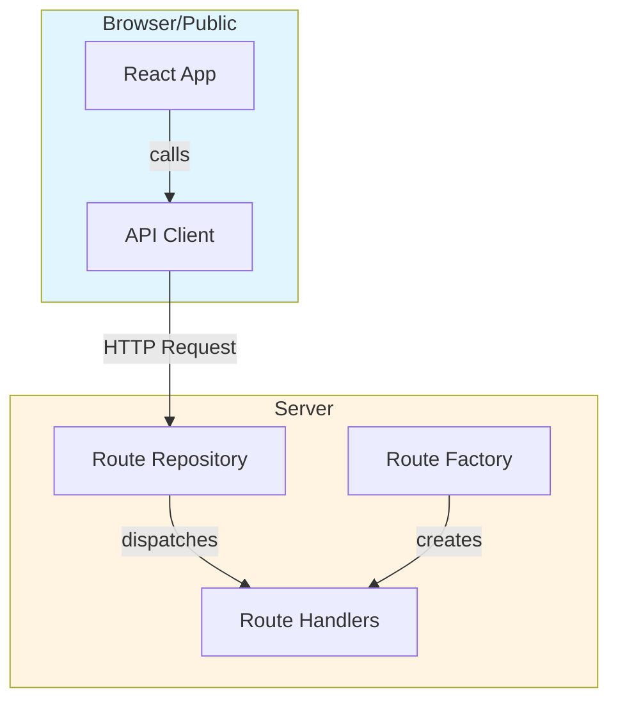

# Kubernetes POC Plugin

A proof of concept plugin for Kubernetes observability in Kibana.

## Features

- Basic Hello World UI
- Server-side API using @kbn/server-route-repository
- Type-safe API client

## Development

Bootstrap the plugin:
```bash
yarn kbn bootstrap
```

Start Kibana:
```bash
yarn start
```

Access the plugin at: http://localhost:5601/app/kubernetesPoc

## Architecture

The plugin follows the standard Observability plugin pattern:



## Testing

After bootstrapping, test the Hello World API:

```bash
# Start Kibana
yarn start

# In browser, navigate to:
# http://localhost:5601/app/kubernetesPoc

# Click "Call Hello World API" button
```

The API endpoint is available at:
```
GET /internal/kubernetes_poc/hello_world
```


