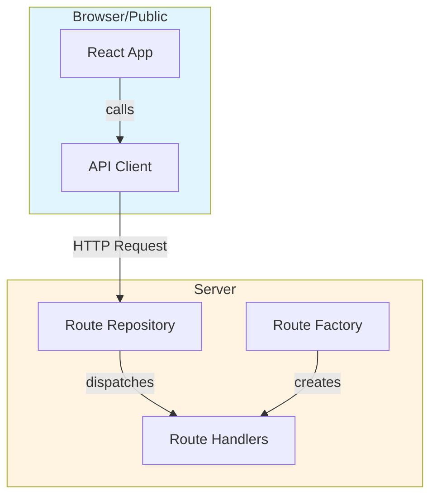

# Kubernetes POC Plugin

A proof of concept plugin for Kubernetes observability in Kibana.

## Features

- Kubernetes Cluster Listing with health status, pod counts, and utilization metrics
- Server-side API using @kbn/server-route-repository
- Type-safe API client
- Lens-powered visualizations with ES|QL queries

## Development

Bootstrap the plugin:
```bash
yarn kbn bootstrap
```

Start Kibana:
```bash
yarn start
```

Access the plugin at: http://localhost:5601/app/kubernetesPoc

## Architecture

The plugin follows the standard Observability plugin pattern:



## API Endpoints

### Cluster Listing
```
GET /internal/kubernetes_poc/cluster_listing
```

Returns a list of all monitored Kubernetes clusters with health status, node counts, pod statuses, and resource utilization.

