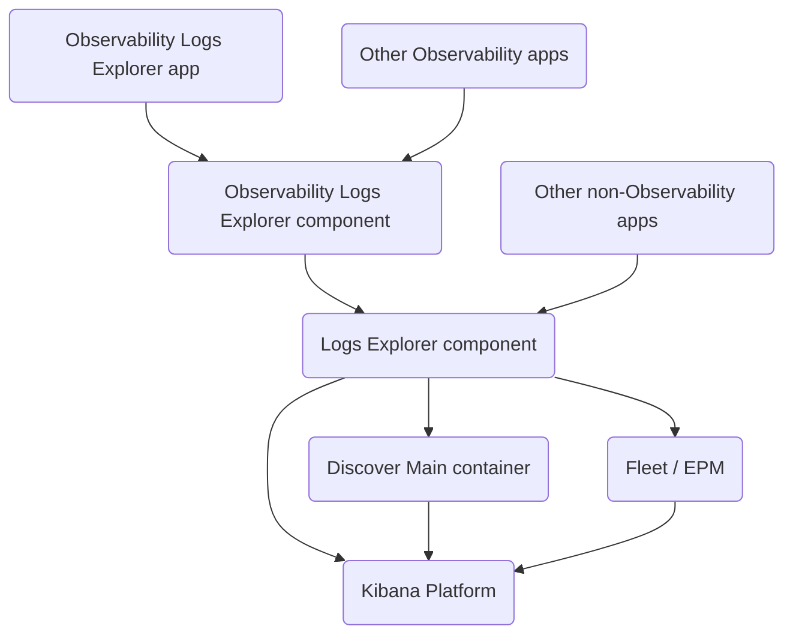

# Logs Explorer

This plugin is home to the `<LogsExplorer />` component and related types. It implements several of the underlying concepts that the [Observability Logs Explorer app](../observability_solution/observability_logs_explorer) builds upon.

## Developing the `<LogsExplorer />` component

⚠ The Logs Explorer is in early stages of development, so the following partly describes the current situation and partly the intended future scenario.

### Dependencies

The goal is for this component to be easy to consume by other Kibana plugins. This means that we should avoid introducing any dependency on plugins that might be consumers. If a situation arises, that would close a cycle in the directed dependency graph, we can take one of two approaches:

- If the newly depended-upon code is not bound to the Kibana plugin life-cycle, it can be factored out into a package that both plugins depend on.
- If it requires integration with the Kibana plugin life-cycle we can invert the direction of the dependency edge by offering a registration API.

We also want to make this plugin available for consumption in deployments without any observability apps. Any observability-specific concepts should therefore be implemented in the `observability_logs_explorer` plugin instead.

While not fully realized yet, the dependency graph would roughly resemble the following:

### API

When designing the API we face two conflicting goals:

- It should be easy to consume by any non-observability app. This means...
  - its API needs to be relatively stable and straightforward.
  - it should not perform any page-wide changes that could interfere with consuming app's page state (such as URL changes).
- It should be extensible so the Observability Logs Explorer can build on top of this.

In its current state the `<LogsExplorer />` achieves neither goal. To resolve the tension in the future we could export two variants with different sets of properties.

### Principles

**State drives the UI**: When the state and side-effects are scattered throughout the react element hierarchy using hooks, it becomes difficult to reason about the overall application state and the order in which transitions and side-effects take place. To avoid that we're aiming for an approach in which a hierarchy of statecharts is started, that encode state, transitions, and side-effects.

**Minimize custom styling**: EUI is a great library of React components that cover 99% of the use cases. For the 1%, in which an EUI component doesn't quite fit the needs, we should try to enhance EUI instead of overriding its styles locally.

## Resources

- [Statecharts overview](https://statecharts.dev/)
- [Statecharts: A Visual Formalism For Complex Systems (original paper)](https://www.wisdom.weizmann.ac.il/~harel/papers/Statecharts.pdf)
- [XState documentation](https://stately.ai/docs/xstate)
- [XState VS Code extension](https://stately.ai/docs/tools/xstate-vscode-extension)
- [`infra` plugin's state machine patterns](../infra/docs/state_machines/README.md)
