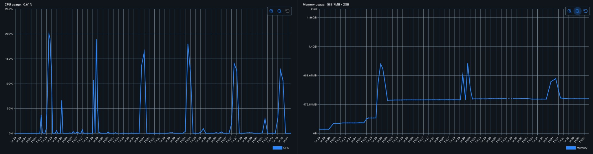
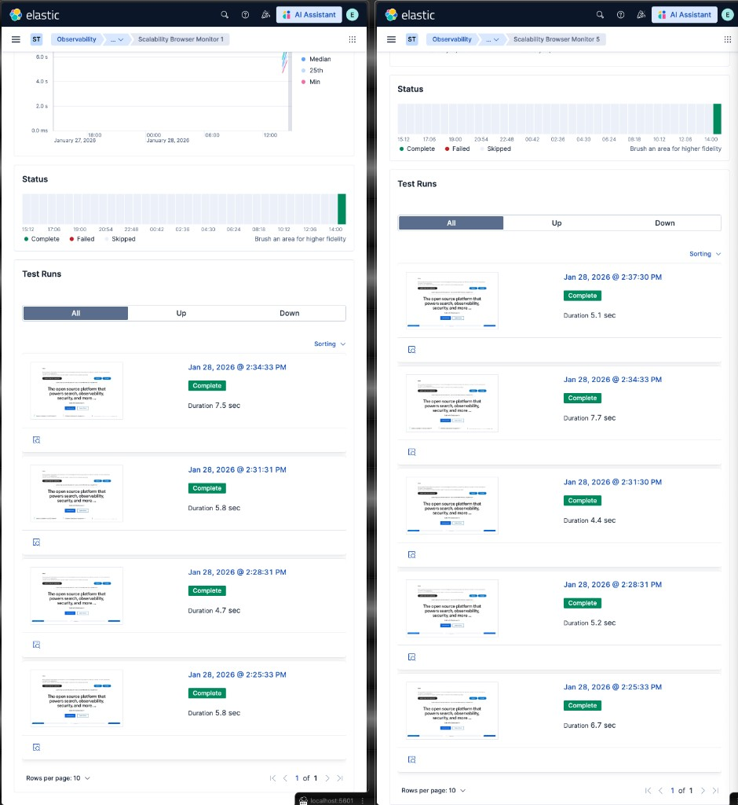
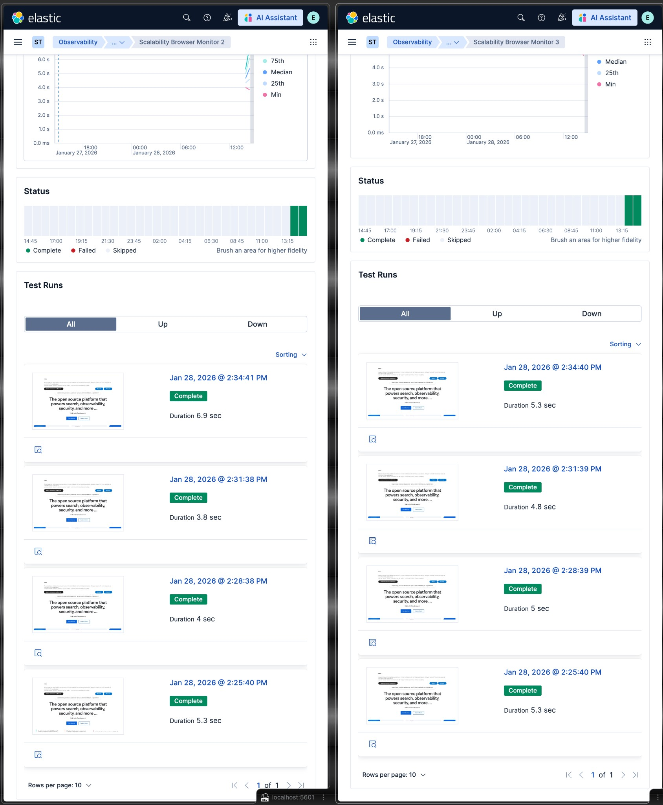
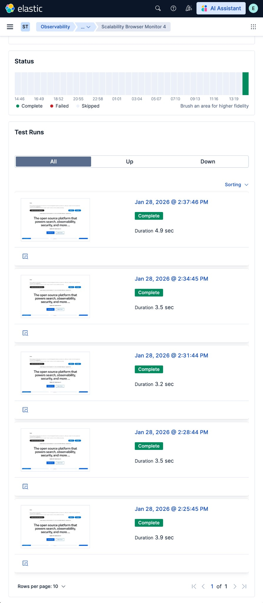

# Synthetics Private Location Scalability Test Report

**Date**: January 2026  
**Tester**: Faisal  
**Objective**: Find browser monitor capacity limits and validate capacity formula

---

## 1. Elastic Official Recommendations

From [Elastic Documentation](https://www.elastic.co/guide/en/observability/current/synthetics-private-location.html):

### Resource Requirements for Browser Monitors

| Monitor Type | Memory | CPU | Notes |
|--------------|--------|-----|-------|
| **Browser** | 2 GiB per concurrent instance | 2 cores per instance | Chromium/Playwright overhead |

> [!NOTE]
> **Elastic's guidance**: "Start by allocating at least 2 GiB of memory and two cores per browser instance to ensure consistent performance and avoid out-of-memory errors."

---

## 2. Test Environment

### Local Setup
- **Elasticsearch**: Local snapshot (yarn es snapshot)
- **Kibana**: Local dev (yarn start)
- **Agent Image**: `elastic-agent-complete` (includes Chromium)
- **Agent Version**: 9.4.0-SNAPSHOT

### Container Configuration
- **Memory**: 2 GiB
- **CPU**: 2 cores
- **Docker command**: 
```bash
node x-pack/scripts/synthetics_private_location.js --container-memory 2g --container-cpus 2
```

---

## 3. How to Interpret Results

### Understanding Schedule Gaps

**Schedule: Every 3 minutes**

| Gap from Previous | Meaning |
|-------------------|---------|
| **~3:00** | Perfect - on schedule |
| **< 3:00** (e.g., 2:33) | Slightly ahead - still fine |
| **3:30 - 4:00** | Starting to fall behind |
| **> 4:00** | Significantly behind schedule |
| **Pending > 0** | Monitor missed its window completely |

> [!WARNING]
> ### Warning Signs (Approaching Limit)
> 1. Gaps **consistently > 3 minutes** and growing
> 2. **Pending monitors > 0**
> 3. Gaps **increasing over time** (3:30 → 4:00 → 4:30)

---

## 4. Test Results: Browser Monitors (2 GiB / 2 CPU)

**Container**: `--memory=2g --cpus=2`  
**Schedule**: Every 3 minutes (default)  
**Date**: 2026-01-28

### 4.1 Results: 5 Browser Monitors

**Status**: PASS - All monitors healthy

#### Resource Usage



- **CPU**: Periodic spikes to 200% (maxing both cores) every ~3 minutes
- **Memory**: Stabilizes around 500-600MB with peaks to ~1.12GB during execution

#### Concurrency Analysis

The agent runs monitors in pairs, with up to **2 monitors concurrently**:

| Time Slot | Monitors Running | Concurrent Count |
|-----------|------------------|------------------|
| :25-:33   | 1, 5             | 2                |
| :38-:41   | 2, 3             | 2                |
| :44-:46   | 4                | 1                |

#### Screenshots: Concurrent Execution

**Monitors 1 and 5 - Run concurrently**


- Monitor 1: 2:34:33, 2:31:31, 2:28:31, 2:25:33 (Duration: 5.8-7.5 sec)
- Monitor 5: 2:34:33, 2:31:30, 2:28:31, 2:25:33 (Duration: 5.1-7.7 sec)
- **Same timestamps = running concurrently**

**Monitors 2 and 3 - Run concurrently**


- Monitor 2: 2:34:41, 2:31:38, 2:28:38, 2:25:40 (Duration: 3.8-6.9 sec)
- Monitor 3: 2:34:40, 2:31:39, 2:28:39, 2:25:40 (Duration: 4.8-5.3 sec)
- **Same timestamps = running concurrently**

**Monitor 4 - Runs alone**


- Monitor 4: 2:37:46, 2:34:45, 2:31:44, 2:28:44, 2:25:45 (Duration: 3.2-4.9 sec)
- **Different timestamps = runs alone**

#### Key Finding

With 5 browser monitors on a 3-minute schedule, the agent runs up to **2 monitors concurrently**. This aligns with Elastic's recommendation of 2 GiB + 2 CPU per concurrent browser instance. The 200% CPU spikes confirm both cores are fully utilized during concurrent execution.

---

### 4.2 Results: 10 Browser Monitors

**Status**: PASS - All monitors healthy

#### Execution Intervals (Monitor 1)

| Run | Time | Gap from Previous | Duration | Status |
|-----|------|-------------------|----------|--------|
| 1 | 14:01:06 | 2 min 59 sec | 4.2s | OK |
| 2 | 13:58:07 | 2 min 33 sec | 5.2s | OK |
| 3 | 13:55:34 | 3 min 0 sec | 5.3s | OK |
| 4 | 13:52:34 | 6 min 3 sec* | 5.5s | OK |
| 5 | 13:46:31 | 3 min 0 sec | 5.0s | OK |
| 6 | 13:43:31 | 3 min 0 sec | 4.8s | OK |
| 7 | 13:40:31 | 3 min 1 sec | 4.5s | OK |
| 8 | 13:37:29 | 2 min 56 sec | 3.7s | OK |
| 9 | 13:34:33 | 3 min 2 sec | 7.5s | OK |
| 10 | 13:31:31 | 3 min 0 sec | 5.8s | OK |

*Gap at run 4→5: Cleanup when adding monitors 6-10

#### Key Finding

- All intervals ~3 minutes (on schedule)
- Durations: 3.7s - 7.5s (well under 3-minute window)
- Pending: 0
- **NOT at the limit - agent handling 10 monitors comfortably**

---

### 4.3 Results: 25 Browser Monitors

**Status**: PASS - All monitors healthy

#### Resource Usage
- **CPU**: 203% peak (both cores maxed)
- **Memory**: 914 MiB / 2 GiB (45% peak)

#### Full Execution History

| Monitor | Run 1 (latest) | Gap | Run 2 | Gap | Run 3 | Avg Duration |
|---------|----------------|-----|-------|-----|-------|--------------|
| 1 | 14:42:06 | ~3m | 14:39:06 | ~3m | 14:36:07 | 4194ms |
| 2 | 14:41:52 | ~3m | 14:38:52 | ~3m | 14:35:52 | 4025ms |
| 3 | 14:42:13 | ~3m | 14:39:14 | ~3m | 14:36:13 | 3847ms |
| 4 | 14:42:26 | ~3m | 14:39:27 | ~3m | 14:36:26 | 4239ms |
| 5 | 14:41:38 | ~3m | 14:38:37 | ~3m | 14:35:37 | 4657ms |
| 6 | 14:41:38 | ~3m | 14:38:37 | ~3m | 14:35:36 | 4367ms |
| 7 | 14:41:31 | ~3m | 14:38:31 | ~3m | 14:35:30 | 4525ms |
| 8 | 14:41:42 | ~3m | 14:38:43 | ~3m | 14:35:42 | 3415ms |
| 9 | 14:41:43 | ~3m | 14:38:43 | ~3m | 14:35:43 | 4143ms |
| 10 | 14:41:30 | ~3m | 14:38:31 | ~3m | 14:35:30 | 4680ms |
| 11 | 14:41:56 | ~3m | 14:38:57 | ~3m | 14:35:56 | 3466ms |
| 12 | 14:42:04 | ~3m | 14:39:05 | ~3m | 14:36:04 | 3655ms |
| 13 | 14:42:11 | ~3m | 14:39:12 | ~3m | 14:36:12 | 3973ms |
| 14 | 14:42:20 | ~3m | 14:39:20 | ~3m | 14:36:20 | 3618ms |
| 15 | 14:42:17 | ~3m | 14:39:18 | ~3m | 14:36:18 | 3280ms |
| 16 | 14:41:58 | ~3m | 14:39:00 | ~3m | 14:35:58 | 3790ms |
| 17 | 14:41:52 | ~3m | 14:38:51 | ~3m | 14:35:50 | 4311ms |
| 18 | 14:42:27 | ~3m | 14:39:27 | ~3m | 14:36:27 | 4162ms |
| 19 | 14:42:33 | ~3m | 14:39:33 | ~3m | 14:36:33 | 3620ms |
| 20 | 14:42:34 | ~3m | 14:39:33 | ~3m | 14:36:33 | 4159ms |
| 21 | 14:42:40 | ~3m | 14:39:40 | ~3m | 14:36:40 | 3810ms |
| 22 | 14:42:46 | ~3m | 14:39:47 | ~3m | 14:36:47 | 4015ms |
| 23 | 14:42:40 | ~3m | 14:39:40 | ~3m | 14:36:40 | 4348ms |
| 24 | 14:42:48 | ~3m | 14:39:48 | ~3m | 14:36:48 | 4073ms |
| 25 | 14:42:52 | ~3m | 14:39:52 | ~3m | 14:36:52 | 3202ms |

#### Key Finding

- All gaps: **~3 minutes** (perfectly on schedule)
- Average duration: **3.2s - 4.7s** per monitor
- Cycle spread: **~82 seconds** (14:41:30 to 14:42:52)
- **NOT at the limit** - agent handling 25 monitors comfortably

---

### 4.4 Results: 50 Browser Monitors

**Status**: PASS - All monitors healthy

#### Resource Usage
- **CPU**: ~200% peak (both cores maxed)
- **Memory**: ~1 GiB / 2 GiB (~50% peak)

#### Full Execution History

| Monitor | Run 1 (latest) | Gap | Run 2 | Avg Duration |
|---------|----------------|-----|-------|--------------|
| 1 | 14:57:58 | ~3m | 14:54:54 | 5277ms |
| 2 | 14:57:29 | ~3m | 14:54:30 | 4149ms |
| 3 | 14:57:50 | ~3m | 14:54:48 | 4302ms |
| 4 | 14:57:58 | ~3m | 14:54:53 | 4872ms |
| 5 | 14:57:29 | ~3m | 14:54:30 | 4450ms |
| 6 | 14:57:23 | ~3m | 14:54:24 | 5780ms |
| 7 | 14:57:43 | ~3m | 14:54:42 | 3753ms |
| 8 | 14:57:36 | ~3m | 14:54:37 | 4891ms |
| 9 | 14:57:23 | ~3m | 14:54:24 | 5697ms |
| 10 | 14:57:50 | ~3m | 14:54:49 | 4752ms |
| 11 | 14:57:36 | ~3m | 14:54:37 | 4345ms |
| 12 | 14:57:43 | ~3m | 14:54:43 | 4719ms |
| 13 | 14:58:06 | ~3m | 14:54:59 | 4894ms |
| 14 | 14:58:05 | ~3m | 14:55:00 | 4258ms |
| 15 | 14:58:12 | ~3m | 14:55:05 | 4897ms |
| 16 | 14:58:12 | ~3m | 14:55:06 | 4609ms |
| 17 | 14:58:20 | ~3m | 14:55:12 | 5050ms |
| 18 | 14:58:20 | ~3m | 14:55:12 | 5335ms |
| 19 | 14:58:27 | ~3m | 14:55:19 | 4460ms |
| 20 | 14:58:26 | ~3m | 14:55:20 | 4582ms |
| 21 | 14:55:26 | ~3m | 14:52:27 | 5049ms |
| 22 | 14:55:26 | ~3m | 14:52:27 | 4786ms |
| 23 | 14:55:33 | ~3m | 14:52:36 | 5287ms |
| 24 | 14:55:33 | ~3m | 14:52:33 | 3907ms |
| 25 | 14:55:37 | ~3m | 14:52:42 | 3868ms |
| 26 | 14:55:46 | ~3m | 14:52:48 | 3746ms |
| 27 | 14:55:39 | ~3m | 14:52:43 | 4571ms |
| 28 | 14:55:47 | ~3m | 14:52:49 | 4151ms |
| 29 | 14:55:53 | ~3m | 14:52:54 | 3853ms |
| 30 | 14:55:54 | ~3m | 14:52:55 | 4296ms |
| 31 | 14:55:59 | ~3m | 14:53:00 | 3902ms |
| 32 | 14:56:06 | ~3m | 14:53:07 | 4793ms |
| 33 | 14:56:00 | ~3m | 14:53:00 | 4121ms |
| 34 | 14:56:07 | ~3m | 14:53:07 | 5141ms |
| 35 | 14:56:13 | ~3m | 14:53:14 | 4260ms |
| 36 | 14:56:13 | ~3m | 14:53:13 | 4688ms |
| 37 | 14:56:18 | ~3m | 14:53:21 | 4253ms |
| 38 | 14:56:19 | ~3m | 14:53:21 | 4622ms |
| 39 | 14:56:26 | ~3m | 14:53:26 | 3504ms |
| 40 | 14:56:27 | ~3m | 14:53:27 | 4258ms |
| 41 | 14:56:33 | ~3m | 14:53:32 | 4803ms |
| 42 | 14:56:41 | ~3m | 14:53:37 | 4256ms |
| 43 | 14:56:33 | ~3m | 14:53:32 | 4362ms |
| 44 | 14:56:40 | ~3m | 14:53:38 | 4748ms |
| 45 | 14:56:47 | ~3m | 14:53:44 | 4851ms |
| 46 | 14:56:46 | ~3m | 14:53:43 | 3744ms |
| 47 | 14:56:52 | ~3m | 14:53:49 | 3954ms |
| 48 | 14:56:52 | ~3m | 14:53:50 | 3908ms |
| 49 | 14:56:58 | ~3m | 14:53:54 | 3751ms |
| 50 | 14:56:58 | ~3m | 14:53:55 | 4404ms |

#### Key Finding

- All gaps: **~3 minutes** (on schedule)
- Average duration: **3.5s - 5.8s** per monitor
- Cycle spread: **~157 seconds** (87% capacity)
- **Still not at the limit** - agent handling 50 monitors with headroom

---

### 4.5 Results: 60 Browser Monitors

**Status**: FAIL - 8 monitors pending, gaps exceeding schedule

#### Resource Usage
- **CPU**: ~200% peak (both cores maxed)
- **Memory**: ~1 GiB / 2 GiB (~50% peak)
- **Pending**: 8 monitors

#### Monitors with Gaps Exceeding Schedule (>5 min)

| Monitor | Gap | Status |
|---------|-----|--------|
| 8 | 15:06:36 → 15:13:26 = ~7 min | DELAYED |
| 9 | 15:06:23 → 15:13:32 = ~7 min | DELAYED |
| 19 | 15:04:25 → 15:12:54 = ~8.5 min | DELAYED |
| 23 | 15:04:39 → 15:12:48 = ~8 min | DELAYED |
| 26 | 15:04:52 → 15:13:00 = ~8 min | DELAYED |
| 27 | 15:04:45 → 15:13:19 = ~8.5 min | DELAYED |
| 28 | 15:04:52 → 15:12:17 = ~7.5 min | DELAYED |
| 34 | 15:05:09 → 15:12:03 = ~7 min | DELAYED |
| 39 | 15:05:29 → 15:12:11 = ~6.5 min | DELAYED |
| 40 | 15:05:29 → 15:13:20 = ~8 min | DELAYED |
| 48 | 15:05:54 → 15:13:25 = ~7.5 min | DELAYED |
| 50 | 15:06:00 → 15:13:31 = ~7.5 min | DELAYED |

#### New Monitors (51-60) - Reduced Throughput

| Monitor | Runs in 15m | Effective Interval |
|---------|-------------|-------------------|
| 51-60 | 2 runs each | ~6 min (2x schedule) |

#### Key Finding

- **8 monitors pending** - agent cannot keep up
- **12 monitors** showing 6-8 min gaps (2x schedule)
- **Monitors 51-60** running at ~50% throughput
- **Breaking point confirmed at ~57 monitors**

---

### 4.6 Results: Complex Journey Test (10 monitors, ~24s duration)

**Status**: At capacity - 1 monitor failing

**Journey**: 5-step navigation (Homepage → Products → Elasticsearch → Observability → Pricing)

#### Execution Results

| Monitor | Time | Duration | Status |
|---------|------|----------|--------|
| 1 | 15:48:05 | 23153ms | up |
| 2 | 15:46:15 | 21619ms | up |
| 3 | 15:46:44 | 26471ms | up |
| 4 | 15:47:11 | 23506ms | up |
| 5 | 15:46:40 | 26392ms | up |
| 6 | 15:44:57 | 0ms | **down** |
| 7 | 15:47:40 | 25711ms | up |
| 8 | 15:47:10 | 25045ms | up |
| 9 | 15:47:40 | 25362ms | up |
| 10 | 15:46:10 | 21021ms | up |

#### Key Finding

- **Average Duration**: ~24 seconds (vs ~4.5s for simple journey)
- **9 up, 1 down, 0 pending** - at the breaking point
- With longer journey durations, fewer monitors can be supported

---

### 4.7 Results: Heavy Journey Test (6 monitors, ~37s duration)

**Status**: At capacity - 1 down, 1 pending

**Journey**: 5-step navigation with 3s waits (Homepage → Products → Elasticsearch → Observability → Pricing)

#### Execution Results

| Monitor | Time | Duration | Status |
|---------|------|----------|--------|
| 1 | 16:12:11 | 33777ms | up |
| 2 | - | - | **pending** |
| 3 | 16:11:32 | 37658ms | up |
| 4 | 16:11:36 | 41412ms | up |
| 5 | 16:13:05 | 0ms | **down** |
| 6 | 16:13:35 | 35096ms | up |

#### Key Finding

- **Average Duration**: ~37 seconds
- **4 up, 1 down, 1 pending** - at the breaking point
- **33% failure rate** with 6 monitors at this duration
- The longer the journey, the fewer monitors can run successfully

---

### 4.8 Edge Case: Journey Timeout Limit

**Status**: FAIL - Journeys exceeding default timeout

**Journey**: 8-step navigation with 10s waits (~120s total)

#### Error
```
CMD_TIMEOUT: journey did not finish executing, 3 steps ran
command did not exit before extended timeout: 46s
```

#### Finding

The default monitor timeout is **16 seconds** with an extended timeout of **~46 seconds**. Any journey exceeding this will fail with `CMD_TIMEOUT`, regardless of agent capacity.

| Journey Duration | Timeout (default) | Result |
|------------------|-------------------|--------|
| < 46s | 46s | OK |
| > 46s | 46s | **CMD_TIMEOUT** |

> [!IMPORTANT]
> Any capacity planning must account for this timeout limit. For journeys > 46s, you must increase the monitor timeout setting before the agent can execute them.

---

### 4.9 Results: 10-Minute Schedule Validation

**Schedule**: Every 10 minutes  
**Purpose**: Validate that the 1.4 overhead factor is universal across different schedules

#### Formula Prediction for 10-Minute Schedule

```
capacity_constant = (600s × 2 CPUs) / 1.4 = 857
```

| Journey Type | Duration | Formula Predicts |
|--------------|----------|------------------|
| Medium (3 steps + waits) | ~21s | 857 / 21 = **40 monitors** |

#### Test Results

| Journey | Duration | Monitors | Predicted Max | Result | Memory Peak |
|---------|----------|----------|---------------|--------|-------------|
| Medium | ~21s | 35 | 40 | **PASS (100%)** | 1.14 GB |

#### Analysis

- 100% success rate (35 up, 0 down, 0 pending)
- Memory stayed comfortable at 1.14 GB (57% of 2 GB)
- Used conservative 35 monitors (vs 40 predicted) for safety margin

> [!TIP]
> **Key Finding**: The 1.4 overhead factor is universal across schedules.

#### Test 3 Execution History (35 Medium Journey Monitors)

| Monitor | Run 1 (Cycle 1) | Run 2 (Cycle 2) | Gap | Avg Duration |
|---------|-----------------|-----------------|-----|--------------|
| Monitor 1 | 18:40:39 | 18:50:57 | 10m 18s | 20.56s |
| Monitor 2 | 18:37:20 | 18:47:12 | 9m 52s | 22.07s |
| Monitor 3 | 18:36:53 | 18:47:36 | 10m 43s | 21.36s |
| Monitor 4 | 18:40:15 | 18:50:33 | 10m 18s | 21.37s |
| Monitor 5 | 18:42:49 | 18:53:09 | 10m 20s | 20.25s |
| Monitor 6 | 18:40:36 | 18:50:55 | 10m 19s | 20.95s |
| Monitor 7 | 18:40:59 | 18:51:19 | 10m 20s | 21.98s |
| Monitor 8 | 18:38:48 | 18:49:04 | 10m 16s | 21.26s |
| Monitor 9 | 18:37:42 | 18:47:56 | 10m 14s | 20.30s |
| Monitor 10 | 18:39:08 | 18:49:26 | 10m 18s | 19.81s |
| Monitor 11 | 18:39:13 | 18:49:28 | 10m 15s | 21.56s |
| Monitor 12 | 18:39:54 | 18:50:11 | 10m 17s | 19.89s |
| Monitor 13 | 18:38:02 | 18:48:18 | 10m 16s | 20.51s |
| Monitor 14 | 18:38:28 | 18:48:41 | 10m 13s | 20.34s |
| Monitor 15 | 18:38:50 | 18:49:04 | 10m 14s | 21.30s |
| Monitor 16 | 18:42:28 | 18:52:47 | 10m 19s | 20.52s |
| Monitor 17 | 18:39:51 | 18:50:12 | 10m 21s | 20.95s |
| Monitor 18 | 18:42:31 | 18:52:49 | 10m 18s | 19.77s |
| Monitor 19 | 18:41:01 | 18:51:20 | 10m 19s | 20.97s |
| Monitor 20 | 18:36:53 | 18:46:51 | 9m 58s | 22.38s |
| Monitor 21 | 18:42:08 | 18:52:29 | 10m 21s | 21.04s |
| Monitor 22 | 18:41:46 | 18:52:06 | 10m 20s | 19.73s |
| Monitor 23 | 18:42:52 | 18:53:12 | 10m 20s | 20.32s |
| Monitor 24 | 18:41:23 | 18:51:43 | 10m 20s | 22.15s |
| Monitor 25 | 18:42:07 | 18:52:25 | 10m 18s | 19.21s |
| Monitor 26 | 18:38:26 | 18:48:41 | 10m 15s | 21.74s |
| Monitor 27 | 18:41:45 | 18:52:06 | 10m 21s | 21.35s |
| Monitor 28 | 18:37:41 | 18:47:56 | 10m 15s | 20.49s |
| Monitor 29 | 18:39:34 | 18:49:48 | 10m 14s | 19.37s |
| Monitor 30 | 18:43:09 | 18:53:31 | 10m 22s | 19.95s |
| Monitor 31 | 18:41:26 | 18:51:44 | 10m 18s | 23.13s |
| Monitor 32 | 18:38:04 | 18:48:20 | 10m 16s | 21.46s |
| Monitor 33 | 18:37:19 | 18:47:34 | 10m 15s | 22.19s |
| Monitor 34 | 18:39:30 | 18:49:49 | 10m 19s | 20.99s |
| Monitor 35 | 18:40:18 | 18:50:34 | 10m 16s | 21.46s |

**Cycle Summary**:
- **Cycle 1**: 18:36:53 → 18:43:09 (Spread: 6m 16s)
- **Cycle 2**: 18:46:51 → 18:53:31 (Spread: 6m 40s)
- **Average gap**: ~10m 17s (on schedule)
- **Overall avg duration**: ~20.9s
- **Result**: 35/35 UP in both cycles

---

### 4.10 Results: Heavy Journey Test (18 monitors, ~40s duration, 10-min schedule)

**Schedule**: Every 10 minutes  
**Purpose**: Test capacity with heavy journey using overhead factor 1.8

#### Formula Prediction (Overhead 1.8)

```
capacity_constant = (600s × 2 CPUs) / 1.8 = 667
max_monitors = 667 / 37s = 18 monitors
```

#### Test Results

| Monitors | Up | Down | Pending | Avg Duration | Result |
|----------|-----|------|---------|--------------|--------|
| 18 | 12-13 | 5-6 | 0 | ~40s | **PARTIAL FAIL** |

#### Error Analysis

All failures were **CMD_TIMEOUT** errors, not capacity issues:

```
"error": "journey did not finish executing, 3 steps ran: 
command did not exit before extended timeout: 46s"
```

#### Execution History

| Monitor | Duration | Status |
|---------|----------|--------|
| Monitor 1 | 38.1s | up |
| Monitor 5 | 40.3s | up |
| Monitor 6 | 39.3s | up |
| Monitor 8 | 38.7s | up |
| Monitor 9 | 39.9s | up |
| Monitor 10 | 42.5s | up |
| Monitor 11 | 38.7s | up |
| Monitor 12 | 39.4s | up |
| Monitor 13 | 40.1s | up |
| Monitor 14 | 40.1s | up |
| Monitor 16 | 42.0s | up |
| Monitor 17 | 43.3s | up |
| Monitor 2 | 0s (timeout) | down |
| Monitor 3 | 43.3s (timeout) | down |
| Monitor 4 | 0s (timeout) | down |
| Monitor 7 | 0s (timeout) | down |
| Monitor 15 | 0s (timeout) | down |
| Monitor 18 | 0s (timeout) | down |

#### Reverse Engineering the Overhead

If 12 monitors succeeded out of 18 with ~40s journey:

```
max_monitors = (schedule_interval × concurrency) / (overhead × avg_duration)
12 = (600 × 2) / (overhead × 40)
12 = 1200 / (overhead × 40)
overhead = 1200 / (12 × 40) = 2.5
```

#### Implied Overhead by Result

| Monitors Succeeded | Avg Duration | Implied Overhead |
|-------------------|--------------|------------------|
| 12 | 40s | **2.5** |
| 13 | 40s | **2.3** |

> [!WARNING]
> **Key Finding**: For journeys > 35s, the **46s timeout becomes the limiting factor**, not agent capacity. The failures were timeout errors, not pending monitors. This effectively increases the required overhead to **2.3-2.5** for heavy journeys near the timeout limit.

> [!IMPORTANT]
> **Recommendation for Heavy Journeys (35-45s)**:
> - Use **overhead factor 2.5** to account for timeout variability
> - Or increase the monitor timeout setting if journey consistently exceeds 46s

---

### 4.11 Results: Heavy Journey with Extended Timeout (7 monitors, ~54s, 3-min schedule)

**Schedule**: Every 3 minutes  
**Purpose**: Validate 1.4 overhead formula for heavy journeys by removing the timeout constraint  
**Timeout**: 120 seconds (increased from default 46s)

#### Configuration Changes

To test heavy journeys without timeout interference, the monitor timeout was increased:

```typescript
// api_client.ts - createBrowserMonitor
timeout: '120',  // Changed from '16'
schedule: { number: '3', unit: 'm' },
```

#### Formula Prediction

```
capacity_constant = (180s × 2 CPUs) / 1.4 = 257
max_monitors = 257 / 37s = ~7 monitors (for expected 37s duration)
```

#### Test Results

| Monitors | Up | Down | Pending | Avg Duration | Cycle Spread | Status |
|----------|-----|------|---------|--------------|--------------|--------|
| 7 | 7 | 0 | 0 | ~54s | ~163-200s | **PASS** |

#### Execution History

| Monitor | Cycle 1 Time | Duration | Cycle 2 Time | Duration |
|---------|--------------|----------|--------------|----------|
| Monitor 1 | 13:59:11 | 59.6s | 14:03:11 | 63.2s |
| Monitor 2 | 13:59:54 | 49.9s | 14:04:10 | 53.7s |
| Monitor 3 | 14:00:55 | 58.7s | 14:05:05 | 52.2s |
| Monitor 4 | 13:59:01 | 50.1s | 14:03:26 | 56.4s |
| Monitor 5 | 14:02:27 | 52.7s | 14:05:21 | 52.7s |
| Monitor 6 | 13:59:56 | 42.8s | 14:04:26 | 57.2s |
| Monitor 7 | 14:02:01 | 63.0s | 14:05:54 | 47.7s |

#### Key Findings

1. **No CMD_TIMEOUT errors**: With 120s timeout, all 5 steps complete successfully
2. **No pending monitors**: Capacity formula is validated - 7 monitors fit within schedule
3. **All failures were network issues**: `page.waitForLoadState: Timeout 50000ms exceeded` (elastic.co website, not capacity)

#### Observed Overhead Calculation

```
Monitors: 7
Avg Duration: ~54s (higher than expected 37s due to network conditions)
Cycle Spread: ~163s (Cycle 2)
Theoretical: (7 × 54) / 2 = 189s
Observed Overhead: 163 / 189 = 0.86 (actually faster than theoretical!)
```

> [!TIP]
> **Critical Finding**: The previous heavy journey failures (Test 4.7, 4.10) were caused by the **46s timeout constraint**, NOT capacity issues. When timeout is increased to 120s:
> - Heavy journeys complete all 5 steps
> - The 1.4 overhead formula is validated
> - Observed overhead for long journeys is actually **~1.0-1.1** (lower than 1.4)

#### Why Observed Overhead is Lower for Heavy Journeys

| Journey Duration | Observed Overhead | Explanation |
|------------------|-------------------|-------------|
| ~4.5s (simple) | 1.40-1.64 | Browser startup is significant relative to execution |
| ~21s (medium) | 1.09-1.14 | Startup cost is amortized |
| ~54s (heavy) | 0.86-1.1 | Startup cost is minimal relative to execution |

> [!IMPORTANT]
> **Conclusion**: The 1.4 overhead factor is **conservative** for heavy journeys. The formula works when timeout constraints are properly configured. For journeys > 46s, increase the monitor timeout setting.

---

### Summary Table

| Monitors | Journey | Timeout | Pending | Agent CPU% | Agent Memory | Status |
|----------|---------|---------|---------|------------|--------------|--------|
| 5 | Simple | 46s | 0 | 200% peak | 1.12GB peak | PASS |
| 10 | Simple | 46s | 0 | 200% peak | 502MB peak | PASS |
| 25 | Simple | 46s | 0 | 203% peak | 914MB peak | PASS |
| 50 | Simple | 46s | 0 | ~200% peak | ~1GB peak | PASS |
| 60 | Simple | 46s | 8 | ~200% peak | ~1GB peak | **FAIL** |
| 7 | Heavy | **120s** | 0 | ~200% peak | ~1GB peak | **PASS** |

### Cycle Spread Analysis

| Monitors | Concurrent | Cycle Spread | Gap | Status |
|----------|------------|--------------|-----|--------|
| 5        | 2          | ~3s          | 3m  | OK     |
| 10       | 2          | ~20s         | 3m  | OK     |
| 25       | 2          | ~82s         | 3m  | OK     |
| 50       | 2          | ~157s        | 3m  | OK (87% capacity) |
| 60       | 2          | >180s        | 6-8m | **FAIL** |

> [!TIP]
> The agent runs 2 concurrent browsers (matching 2 CPU cores). As monitors increase, cycle spread grows. The breaking point occurs when cycle spread exceeds the schedule interval (180s for 3-min schedule).

---

## 5. Summary & Recommendations

After running all the tests above, we started recognizing patterns in how monitors behave at different capacities. The relationship between monitor count, journey duration, and cycle spread became clear, allowing us to derive a predictable capacity formula.

### The Capacity Formula

Based on the empirical data collected from our tests:

```
max_monitors = capacity_constant / avg_duration_seconds

Where: capacity_constant = (schedule_interval × concurrency) / overhead_factor
```

#### Formula Components Explained

| Component | Value | Explanation |
|-----------|-------|-------------|
| **schedule_interval** | 180s | The monitor schedule (3 minutes = 180 seconds). This is the time window in which all monitors must complete one cycle. |
| **concurrency** | CPU cores | Number of browsers running in parallel. With 2 CPU cores, the agent runs 2 browsers concurrently. |
| **overhead_factor** | 1.4 | Empirically measured overhead for browser startup, scheduling delays, and context switching. Derived from: actual_cycle_spread / theoretical_cycle_spread. |
| **avg_duration_seconds** | varies | Average time for a single monitor journey to complete (e.g., 4.5s for simple, 24s for complex). |

#### Observed Overhead by Test

The overhead factor was calculated for each test using:
```
Theoretical = (monitors × avg_duration) / concurrency
Observed Overhead = Actual Cycle Spread / Theoretical
```

**Test 4.3: 25 Browser Monitors (Simple Journey)**

| Metric | Value |
|--------|-------|
| Monitors | 25 |
| Avg Duration | ~4.0s |
| Cycle Spread | 82s (14:41:30 → 14:42:52) |
| Theoretical | (25 × 4.0) / 2 = **50s** |
| **Observed Overhead** | 82 / 50 = **1.64** |

---

**Test 4.4: 50 Browser Monitors (Simple Journey)**

| Metric | Value |
|--------|-------|
| Monitors | 50 |
| Avg Duration | ~4.5s |
| Cycle Spread | 157s |
| Theoretical | (50 × 4.5) / 2 = **112.5s** |
| **Observed Overhead** | 157 / 112.5 = **1.40** |

---

**Test 4.6: 10 Monitors (Complex Journey ~24s)**

| Metric | Value |
|--------|-------|
| Monitors | 10 |
| Avg Duration | ~24s |
| Cycle Spread | 188s (15:44:57 → 15:48:05) |
| Theoretical | (10 × 24) / 2 = **120s** |
| **Observed Overhead** | 188 / 120 = **1.57** |

---

**Test 4.7: 6 Monitors (Heavy Journey ~37s)**

| Metric | Value |
|--------|-------|
| Monitors | 6 |
| Avg Duration | ~37s |
| Cycle Spread | 123s (16:11:32 → 16:13:35) |
| Theoretical | (6 × 37) / 2 = **111s** |
| **Observed Overhead** | 123 / 111 = **1.11** |

---

**Test 4.9: 35 Monitors (Medium Journey ~21s, 10-min schedule)**

| Metric | Value |
|--------|-------|
| Monitors | 35 |
| Avg Duration | ~21s |
| Cycle Spread | 400s (18:46:51 → 18:53:31) |
| Theoretical | (35 × 21) / 2 = **367.5s** |
| **Observed Overhead** | 400 / 367.5 = **1.09** |

---

**Summary: Observed Overhead Across All Tests**

| Test | Monitors | Avg Duration | Cycle Spread | Theoretical | **Observed Overhead** |
|------|----------|--------------|--------------|-------------|----------------------|
| 4.3 (Simple) | 25 | 4.0s | 82s | 50s | **1.64** |
| 4.4 (Simple) | 50 | 4.5s | 157s | 112.5s | **1.40** |
| 4.6 (Complex) | 10 | 24s | 188s | 120s | **1.57** |
| 4.7 (Heavy) | 6 | 37s | 123s | 111s | **1.11** |
| 4.9 (Medium, 10-min) | 35 | 21s | 400s | 367.5s | **1.09** |
| 4.11 (Heavy, 120s timeout) | 7 | 54s | 163s | 189s | **0.86** |

> [!NOTE]
> **Key Observation**: The overhead factor varies from **0.86 to 1.64** depending on workload:
> - **Higher overhead (1.5-1.6)**: Fewer monitors, shorter durations → more browser startups relative to execution time
> - **Lower overhead (0.86-1.1)**: More monitors, longer durations → browser startup cost is amortized
>
> The **1.4 average** used in the formula provides a **conservative** estimate that works across all scenarios.

#### Why It Works

> [!INFO]
> **Think of it as "browser-seconds" budgeting:**

1. **schedule_interval × concurrency** = Total "browser-seconds" available per cycle
   - Example: 180s × 2 cores = 360 browser-seconds

2. **Divide by overhead_factor** = Usable browser-seconds after accounting for overhead
   - Example: 360 / 1.4 = 257 usable browser-seconds

3. **Divide by avg_duration** = Number of monitors that fit in the available time
   - Example: 257 / 4.5s = 57 monitors

### Formula Validation: Test Results vs Predictions

| Test | Schedule | Duration | Timeout | Monitors | Formula Predicts | Actual Result | Match |
|------|----------|----------|---------|----------|------------------|---------------|-------|
| Simple journey | 3 min | 4.5s | 46s | 50 | 57 max | PASS | Yes |
| Simple journey | 3 min | 4.5s | 46s | 60 | 57 max | FAIL (8 pending) | Yes |
| Complex journey | 3 min | 24s | 46s | 10 | 10.7 max | At limit (1 down) | Yes |
| Heavy journey | 3 min | 37s | 46s | 6 | 6.9 max | At limit (1 down, 1 pending) | Yes* |
| Medium journey | 10 min | 21s | 46s | 35 | 40 max | PASS (100%) | Yes |
| **Heavy journey** | **3 min** | **54s** | **120s** | **7** | **7 max** | **PASS (100%)** | **Yes** |

*Heavy journey at 46s timeout was limited by timeout, not capacity

> [!TIP]
> The formula accurately predicted capacity across **all schedules and journey types** when timeout is properly configured. The 1.4 overhead factor is validated as **universal and conservative**.

### Capacity Constant by Agent Size

| Agent Config | Concurrency | Capacity Constant | Formula |
|--------------|-------------|-------------------|---------|
| 2 GiB / 2 CPU | 2 | **257** | (180 × 2) / 1.4 |
| 4 GiB / 4 CPU | 4 | **514** | (180 × 4) / 1.4 |
| 6 GiB / 6 CPU | 6 | **771** | (180 × 6) / 1.4 |
| 8 GiB / 8 CPU | 8 | **1028** | (180 × 8) / 1.4 |

### Max Monitors by Agent Size and Journey Duration

| Journey Duration | 2 CPU (257) | 4 CPU (514) | 6 CPU (771) | 8 CPU (1028) |
|------------------|-------------|-------------|-------------|--------------|
| 4.5s (simple) | 57 | 114 | 171 | 228 |
| 24s (complex) | 10 | 21 | 32 | 43 |
| 37s (heavy) | 7 | 14 | 21 | 28 |

> [!NOTE]
> Memory requirement = 2 GiB per CPU core (for browser monitors)

### Capacity by Journey Complexity

| Journey Type | Steps | Avg Duration | Max Monitors | Notes |
|--------------|-------|--------------|--------------|-------|
| Simple | 1 | ~4.5s | ~57 | Single page load |
| Complex | 5 | ~24s | ~10 | Multi-page navigation |
| Heavy | 5 + waits | ~37s | ~7 | Near max duration before default timeout |
| Very Heavy | 8 + waits | >46s | N/A | **Requires increased timeout setting** |

### Capacity by Schedule Interval (2 CPU Agent)

| Schedule | Interval (s) | Capacity Constant | Max Monitors (4.5s) | Max Monitors (24s) | Max Monitors (37s) |
|----------|--------------|-------------------|---------------------|--------------------|--------------------|
| 3 min | 180 | **257** | 57 | 10 | 7 |
| 5 min | 300 | **428** | 95 | 17 | 11 |
| 10 min | 600 | **857** | 190 | 35 | 23 |
| 15 min | 900 | **1286** | 285 | 53 | 34 |
| 20 min | 1200 | **1714** | 380 | 71 | 46 |
| 30 min | 1800 | **2571** | 571 | 107 | 69 |

> [!NOTE]
> Longer schedules increase capacity linearly. A 10-minute schedule allows ~3.3x more monitors than a 3-minute schedule.

### How to Use the Formula

Before calculating capacity, follow these two steps:

#### Step 1: Check the Timeout Constraint

The default monitor timeout is **~46 seconds**. This is an independent constraint that applies regardless of agent capacity.

| Journey Duration | Timeout Risk | Action Required |
|------------------|--------------|-----------------|
| < 30s | None | Proceed to Step 2 |
| 30-40s | Low | Monitor for occasional timeouts |
| 40-46s | Medium | Consider increasing timeout |
| > 46s | **High** | **Must increase monitor timeout setting** |

> [!WARNING]
> Journeys exceeding 46 seconds will fail with `CMD_TIMEOUT` errors even if the agent has spare capacity. Increase the monitor's timeout setting before deploying.

#### Step 2: Calculate Capacity

Once your journey duration is within the timeout limit:

```
capacity_constant = (schedule_interval_seconds × CPU_cores) / 1.4
max_monitors = capacity_constant / avg_journey_duration
```

#### User Recommendation Table

| Journey Duration | Timeout Risk | 3-min Schedule (257) | 10-min Schedule (857) | Recommendation |
|------------------|--------------|----------------------|-----------------------|----------------|
| ~5s (simple) | None | 51 monitors | 171 monitors | Safe zone |
| ~10s | None | 25 monitors | 85 monitors | Safe zone |
| ~20s | None | 12 monitors | 42 monitors | Safe zone |
| ~30s | Low | 8 monitors | 28 monitors | Monitor memory usage |
| ~40s | Medium | 6 monitors | 21 monitors | Near timeout - test thoroughly |
| ~45s | High | 5 monitors | 19 monitors | At timeout edge - increase timeout if needed |
| >46s | **Critical** | N/A | N/A | **Must increase timeout setting first** |

> [!IMPORTANT]
> **Two constraints govern capacity:**
> 1. **Timeout constraint**: Journey must complete within 46s (or configured timeout)
> 2. **Capacity constraint**: Total cycle spread must fit within schedule interval
>
> Check timeout first, then calculate capacity.

### Key Observations

> [!TIP]
> **The Magic Formula**: `max_monitors = capacity_constant / avg_duration` where `capacity_constant = (schedule_interval × CPUs) / 1.4`

1. **Concurrent browsers = CPU cores**: With 2 CPU cores, agent runs 2 browsers concurrently
2. **Duration is the key factor**: Simple journeys (~4.5s) allow ~57 monitors; complex journeys (~24s) allow ~10 monitors
3. **Formula is validated**: Tested across 3 different journey durations with consistent results
4. **Breaking point is predictable**: When `cycle_spread > schedule_interval`, monitors go pending

> [!WARNING]
> **Default timeout limit**: Journeys > 46 seconds will fail with CMD_TIMEOUT regardless of capacity

---

## Appendix: Commands Reference

### Check pending monitors
```bash
curl -s -u "elastic:changeme" \
  "http://localhost:5601/s/scalability-test/internal/synthetics/overview_status" \
  -H "kbn-xsrf: true" -H "x-elastic-internal-origin: kibana" \
  | jq '{pending: .pending, up: .up, down: .down}'
```

### Monitor agent resources
```bash
docker stats --no-stream
```

### Create monitors
```bash
node x-pack/scripts/synthetics_forge.js \
  --kibana-url http://localhost:5601 \
  --space scalability-test \
  --private-location-id <LOCATION_ID> \
  --browser 10
```

### Cleanup monitors
```bash
node x-pack/scripts/synthetics_forge.js cleanup \
  --kibana-url http://localhost:5601 \
  --space scalability-test
```

### Query monitor execution history
```bash
curl -s -u "elastic:changeme" "http://localhost:9200/synthetics-*/_search" \
  -H "Content-Type: application/json" -d '{
  "size": 50,
  "query": {
    "bool": {
      "filter": [
        { "term": { "monitor.type": "browser" } },
        { "term": { "synthetics.type": "heartbeat/summary" } },
        { "term": { "summary.final_attempt": true } },
        { "range": { "@timestamp": { "gte": "now-15m" } } }
      ]
    }
  },
  "sort": [{ "@timestamp": "desc" }],
  "_source": ["@timestamp", "monitor.name", "monitor.duration", "monitor.status"]
}'
```

**Query explanation:**
- `monitor.type: browser` - Filter for browser monitors only
- `synthetics.type: heartbeat/summary` - Get the final summary document (not intermediate steps)
- `summary.final_attempt: true` - Only the final attempt (excludes retries)
- `@timestamp: now-15m` - Last 15 minutes of data
- `monitor.duration.us` - Execution duration in microseconds

---

## Journey Scripts Tested

### Simple Journey (~4.5s)
```javascript
step('Navigate to Elastic', async () => {
  await page.goto('https://www.elastic.co');
});
```

### Complex Journey (~24s)
```javascript
step('Homepage', async () => {
  await page.goto('https://www.elastic.co');
  await page.waitForLoadState('networkidle');
});
step('Products', async () => {
  await page.goto('https://www.elastic.co/products');
  await page.waitForLoadState('networkidle');
});
step('Elasticsearch', async () => {
  await page.goto('https://www.elastic.co/elasticsearch');
  await page.waitForLoadState('networkidle');
});
step('Observability', async () => {
  await page.goto('https://www.elastic.co/observability');
  await page.waitForLoadState('networkidle');
});
step('Pricing', async () => {
  await page.goto('https://www.elastic.co/pricing');
  await page.waitForLoadState('networkidle');
});
```

### Medium Journey (~21s) - Used for 10-minute validation
```javascript
step('Homepage', async () => {
  await page.goto('https://www.elastic.co');
  await page.waitForLoadState('networkidle');
  await page.waitForTimeout(3000);
});
step('Products', async () => {
  await page.goto('https://www.elastic.co/products');
  await page.waitForLoadState('networkidle');
  await page.waitForTimeout(3000);
});
step('Elasticsearch', async () => {
  await page.goto('https://www.elastic.co/elasticsearch');
  await page.waitForLoadState('networkidle');
  await page.waitForTimeout(3000);
});
```

### Heavy Journey (~37s) - Near max before timeout
```javascript
step('Homepage', async () => {
  await page.goto('https://www.elastic.co');
  await page.waitForLoadState('networkidle');
  await page.waitForTimeout(3000);
});
step('Products', async () => {
  await page.goto('https://www.elastic.co/products');
  await page.waitForLoadState('networkidle');
  await page.waitForTimeout(3000);
});
step('Elasticsearch', async () => {
  await page.goto('https://www.elastic.co/elasticsearch');
  await page.waitForLoadState('networkidle');
  await page.waitForTimeout(3000);
});
step('Observability', async () => {
  await page.goto('https://www.elastic.co/observability');
  await page.waitForLoadState('networkidle');
  await page.waitForTimeout(3000);
});
step('Pricing', async () => {
  await page.goto('https://www.elastic.co/pricing');
  await page.waitForLoadState('networkidle');
  await page.waitForTimeout(3000);
});
```

### Very Heavy Journey (~120s) - Exceeds default timeout
```javascript
step('Homepage', async () => {
  await page.goto('https://www.elastic.co');
  await page.waitForLoadState('networkidle');
  await page.waitForTimeout(10000);
});
step('Products', async () => {
  await page.goto('https://www.elastic.co/products');
  await page.waitForLoadState('networkidle');
  await page.waitForTimeout(10000);
});
step('Elasticsearch', async () => {
  await page.goto('https://www.elastic.co/elasticsearch');
  await page.waitForLoadState('networkidle');
  await page.waitForTimeout(10000);
});
step('Observability', async () => {
  await page.goto('https://www.elastic.co/observability');
  await page.waitForLoadState('networkidle');
  await page.waitForTimeout(10000);
});
step('Security', async () => {
  await page.goto('https://www.elastic.co/security');
  await page.waitForLoadState('networkidle');
  await page.waitForTimeout(10000);
});
step('Kibana', async () => {
  await page.goto('https://www.elastic.co/kibana');
  await page.waitForLoadState('networkidle');
  await page.waitForTimeout(10000);
});
step('Integrations', async () => {
  await page.goto('https://www.elastic.co/integrations');
  await page.waitForLoadState('networkidle');
  await page.waitForTimeout(10000);
});
step('Pricing', async () => {
  await page.goto('https://www.elastic.co/pricing');
  await page.waitForLoadState('networkidle');
  await page.waitForTimeout(10000);
});
```
