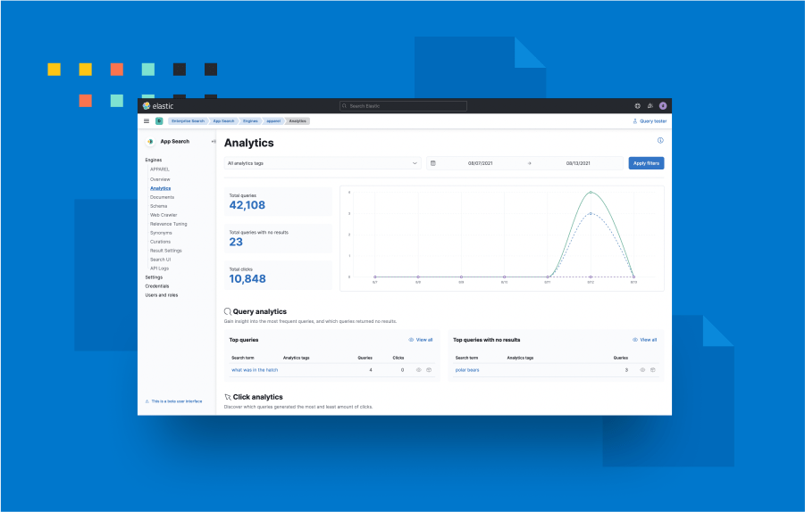
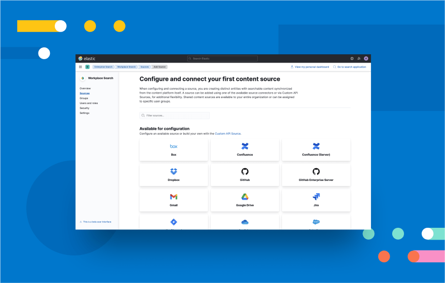

# Enterprise Search

## Overview

This plugin provides Kibana user interfaces for managing the Enterprise Search solution and its products, App Search and Workplace Search.

### App Search



Add rich, relevant search to your apps and websites. https://www.elastic.co/app-search/

### Workplace Search



Unify all your team's content into a personalized search experience. https://www.elastic.co/workplace-search/

## Development

1. When developing locally, Enterprise Search should be running locally alongside Kibana on `localhost:3002`.
2. Update `config/kibana.dev.yml` with `enterpriseSearch.host: 'http://localhost:3002'`

Problems? If you're an Elastic Enterprise Search engineer, please reach out to @elastic/search-kibana for questions or our in-depth Getting Started developer guide.

Don't forget to read Kibana's [contributing documentation](https://github.com/elastic/kibana/#building-and-running-kibana-andor-contributing-code) and developer guides for more general info on the Kibana ecosystem.

### Server development

Kibana runs both a frontend and a backend/middleware server. For server development guidelines, see [SERVER.md](SERVER.md).

### Kea

Enterprise Search uses [Kea.js](https://github.com/keajs/kea) to manage our React/Redux state for us. Kea state is handled in our `*Logic` files and exposes [values](https://v2.keajs.org/docs/guide/concepts#values) and [actions](https://v2.keajs.org/docs/guide/concepts#actions) for our components to get and set state with.

For extended guidelines, please check [KEA.md](KEA.md)

#### Advanced Kea usage

For the most part, we stick to the functionality described in Kea's [core concepts](https://v2.keajs.org/docs/guide/concepts). However, in some files, we also take advantage of [props](https://v2.keajs.org/docs/guide/additional#props) and [events](https://v2.keajs.org/docs/guide/additional#events), as well as [manually mounting](https://v2.keajs.org/docs/guide/advanced#mounting-and-unmounting) some shared logic files on plugin init outside of React.

#### Debugging Kea

To debug Kea state in-browser, Kea recommends [Redux Devtools](https://v2.keajs.org/docs/guide/debugging). To facilitate debugging, we use the [path](https://v2.keajs.org/docs/guide/debugging/#setting-the-path-manually) key with `snake_case`d paths. The path key should always end with the logic filename (e.g. `['enterprise_search', 'some_logic']`) to make it easy for devs to quickly find/jump to files via IDE tooling.

## Testing

### Unit tests

Documentation: https://www.elastic.co/guide/en/kibana/current/development-tests.html#_unit_testing

Jest tests can be run from the root kibana directory, however, since the tests take so long to run you will likely want to apply the appropriate Jest configuration file to test only your changes. For example:

- `x-pack/solutions/search/plugins/enterprise_search/common/jest.config.js`
- `x-pack/solutions/search/plugins/enterprise_search/public/jest.config.js`
- `x-pack/solutions/search/plugins/enterprise_search/server/jest.config.js`

```bash
yarn test:jest --config {YOUR_JEST_CONFIG_FILE}
yarn test:jest --config {YOUR_JEST_CONFIG_FILE} --watch
```

Unfortunately coverage collection does not work as automatically, and requires using our handy jest.sh script if you want to run tests on a specific file or folder and only get coverage numbers for that file or folder:

```bash
# Running the jest.sh script from the `x-pack/solutions/search/plugins/enterprise_search` folder (vs. kibana root)
# will save you time and allow you to Tab to complete folder dir names
sh jest.sh {YOUR_COMPONENT_DIR}
sh jest.sh public/applications/shared/kibana
sh jest.sh server/routes/app_search
# When testing an individual file, remember to pass the path of the test file, not the source file.
sh jest.sh public/applications/shared/flash_messages/flash_messages_logic.test.ts
```

### E2E tests

- [Kibana's Functional Test Runner (FTR)](#kibana-ftr-tests)

#### Kibana FTR tests

FTR configs for stateful search solution are listed in `.buildkite/ftr_search_stateful_configs.yml`, the main set of functional tests for this plugin are in the [x-pack/solutions/search/test/functional_search](../../../../test/functional_search/) suite of tests.

These can be run from the root of the Kibana folder with the following command:

```shell
node scripts/functional_tests --config=x-pack/solutions/search/test/functional_search/config.ts --bail --quiet
```

Or if you are updating the tests it can be easier to run the server first so you can re-run the tests many times:

```shell
node scripts/functional_tests_server --config=x-pack/solutions/search/test/functional_search/config.ts
```

One this commands is finished starting the server you run the tests by opening another terminal and running:

```shell
node scripts/functional_test_runner --config=x-pack/solutions/search/test/functional_search/config.ts
```

These scripts can be used with any FTR config.
