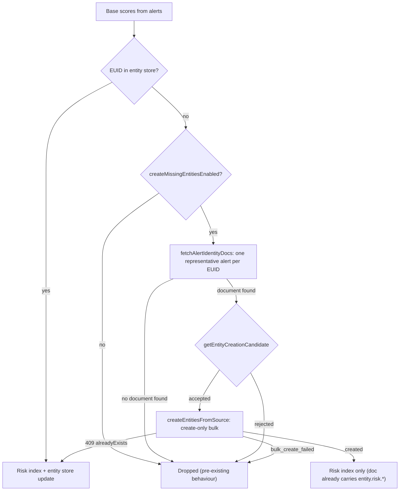

# Risk Score Maintainer

The risk score maintainer (`id: 'risk-score'`) is registered by `security_solution`, not `entity_store`, via `registerRiskScoreMaintainer()`. It scores entities from alerts and **dual-writes** to both the risk score index and the entity store in the same run. Lives under `x-pack/solutions/security/plugins/security_solution/server/lib/entity_analytics/risk_score/maintainer/`.

## Three Gates (don't confuse them)

| Gate | Kind | Controls | Default |
|------|------|----------|---------|
| `entityAnalyticsEntityStoreV2` | Experimental feature (`kibana.dev.yml` / `enableExperimental`) | Whether the maintainer is registered at all, checked in `security_solution`'s `plugin.ts` at setup. Requires Kibana restart. | `true` |
| `securitySolution:entityStoreEnableV2` | UI setting | Runtime `idBasedRiskScoringEnabled` — entity store dual-write (read via `getIsIdBasedRiskScoringEnabled()`) | `true`, `readonly: true` |
| `xpack.securitySolution.entityAnalytics.riskEngine.createMissingEntities` | Kibana config (`config.ts`) | Opt-in for the create-if-missing path only (see below) | `false` |

`createMissingEntities` is ANDed with the UI setting in `loadRunConfiguration` — **both** must be on for creation to occur, so it can be disabled independently without turning off dual-write:

```typescript
const createMissingEntitiesEnabled =
  idBasedRiskScoringEnabled &&
  (entityAnalyticsConfig?.riskEngine?.createMissingEntities ?? false);
```

## Score Sources

- **Entity Store** (`entity.risk.*`, `entity.relationships.resolution.risk.*`) — for score badges, score values, risk levels. Primary source.
- **Risk score index** (`risk-score.risk-score-default`) — for detailed breakdowns (category scores, inputs, modifiers, Lens visualizations). Query with `useRiskScore()` hook + `score_type` filter.

## Create-If-Missing Path

Base scoring discovers EUIDs from alerts (composite agg + ES|QL), which can include identifiers with no canonical entity store record — `host.id` variations, synthetic identifiers, alerts naming an entity the store never saw. By default these scores are **dropped** (as the v1 maintainer did). When `createMissingEntitiesEnabled` is true, each dropped EUID is re-evaluated against a real alert document and created instead.



**Why it can't trust the maintainer's own EUID:** the ES|QL base-scoring query applies only `documentsFilter`, not `postAggFilter`. The user `postAggFilter` short-circuits on `entityIdExistsAfterLookup`, which trivially passes for any synthetic doc that already carries the candidate EUID. So the gate re-derives everything (namespace, identity fields, `event.outcome`) from a real source document instead.

`fetchAlertIdentityDocs` (`maintainer/utils/fetch_alert_identity_docs.ts`) fetches one representative alert `_source` per missing EUID: a `terms` agg on the same `entity_id` Painless runtime mapping used by the composite query, `top_hits` size 1 sorted by `@timestamp` desc. It pulls the **full `_source`**, not a trimmed field list — the namespace derivation reads `event.kind`, `event.category`, `event.type`, `cloud.provider`, and others beyond the identity fields themselves.

## Conservative Entity Creation Gate

`getEntityCreationCandidate(entityType, sourceDoc)` in `entity_store/common/domain/definitions/creatable_from_document.ts`. The per-type rules are **not** hardcoded here — they live on each type's own definition as an optional `creatableFromDocument` field (see `entity_schema.ts`), next to `postAggFilter`. `getEntityCreationCandidate` is a thin, generic evaluator: shared gates apply first, then the definition's own `creatableFromDocument.requires`:

| Check | Rejection reason | Where it's declared | Why |
|-------|-------------------|----------------------|-----|
| Type has no `creatableFromDocument` (currently `generic`) | `entity_type_not_creatable` | Absence in `generic.ts` | Generic's EUID is `entity.id` verbatim with no gates — creating it would be an arbitrary-string minting path. |
| `event.outcome === 'failure'` | `event_outcome_failure` | Evaluator (cross-cutting) | Missing/`unknown` outcome is allowed, keeping ML anomaly alerts (e.g. PAD jobs, which never carry `event.outcome`) eligible. Applied for every creatable type regardless of whether its own `documentsFilter` also encodes it. |
| `user`: namespace must be `local` | `user_not_local_namespace` | `user.ts`, `creatableFromDocument.requires` | Alerts can't legitimately pass the IdP gates (`event.kind` is rewritten to `signal` on alert docs); an accidental non-local create would mint a high-confidence entity with no authoritative IdP evidence, since `entity.confidence` is stamped from the namespace. |
| `user`: needs `user.name` + `host.id` | `no_identity` | Implied by the `local` namespace derivation | Required to derive the medium-confidence, host-scoped EUID. |
| `host`: needs `host.id` | `host_missing_host_id` | `host.ts`, `creatableFromDocument.requires` | Name-only alerts risk minting duplicates of entities already keyed by `host.id`, so they stay lookup-only. |
| `service`: needs `service.name` | `no_identity` | `service.ts` opts in with no extra `requires` | Single-field identity, low duplicate risk — no extra gate beyond identity presence. |
| any type, EUID/identity fields undeterminable | `no_identity` | Evaluator (cross-cutting) | Fallback for any type when derivation fails. |

The `requires` condition is evaluated against the document *after* `fieldEvaluations` and `whenConditionTrueSetFields*` have been applied (via `buildEvaluatedDoc` in `euid/memory.ts`), so it can reference derived fields like `entity.namespace`, not just raw document fields. It can't reuse `postAggFilter` directly: that filter's `entityIdExistsAfterLookup` branch trivially passes for a synthetic doc that already carries the candidate id.

Two more reasons appear in the same counters but are **not** policy rejections:

- `no_alert_document` — no representative alert doc was found for the EUID (`fetchAlertIdentityDocs` came up empty).
- `bulk_create_failed` — the request passed the policy but the bulk create itself failed for a reason other than a 409 conflict (e.g. mapping/validation error).

## Write Path

`crudClient.createEntitiesFromSource(requests: CreateEntityFromSourceRequest[])` in `entity_store/server/domain/crud/crud_client.ts`. Deliberately included on `EntityUpdateClient` (unlike the unrestricted `createEntity`) because every request is policy-gated before anything reaches Elasticsearch:

```typescript
interface CreateEntityFromSourceRequest {
  type: EntityType;
  source: unknown;              // representative alert _source
  createdBy: EntityCreatedBy;   // provenance stamp
  fields?: Record<string, unknown>; // e.g. entity.risk.calculated_score
}

interface CreateEntitiesFromSourceResult {
  created: string[];       // newly created EUIDs
  alreadyExists: string[]; // raced with another creator (e.g. logs extraction)
  rejected: Array<{ reason: CreateEntityFromSourceRejectionReason }>;
}
```

- Issues one `create`-only bulk request against the LATEST index with `_id = hashEuid(euid)`, `refresh: false`.
- A document that already exists (e.g. created concurrently by logs extraction) surfaces as a per-item 409 / `version_conflict_engine_exception`, routed to `alreadyExists` — never silently overwritten.
- Does not wait for refresh: nothing later in the same maintainer run reads these documents back from the latest index.

## Score Routing After a Create Attempt

From `scoreBaseEntities` (`maintainer/steps/score_base_entities.ts`):

| Outcome | Risk index | Entity store |
|---------|:-----------:|:------------:|
| Already in store | write | update |
| Created | write | *(skipped — create doc already carries `entity.risk.*`)* |
| Raced (`alreadyExists`) | write | update |
| Rejected / no alert document / bulk failed | dropped | dropped |

## Provenance: `entity.created_by`

New `managedValue` keyword field (`ENTITY_CREATED_BY_FIELD = 'entity.created_by'`), values from `ENTITY_CREATED_BY` (`@kbn/entity-store/common`):

```typescript
export const ENTITY_CREATED_BY = {
  LogsExtraction: 'logs_extraction',
  RiskScoreMaintainer: 'risk_score_maintainer',
} as const;
```

Written once, on create, never overwritten by dual-write updates. Logs extraction stamps it with `COALESCE(entity.created_by, "logs_extraction")` so a maintainer-created entity's stamp survives extraction, and pre-existing entities get backfilled to `logs_extraction` the first time extraction touches them.

## Funnel & Telemetry Semantics

`RunMetrics` (`maintainer/utils/run_metrics_tracker.ts`) splits what used to be one `scoresWritten*` counter per stage into risk-index and entity-store counters (`scoresWrittenRiskIndexBase`/`Resolution`/`ResetToZero` and `scoresWrittenEntityStoreBase`/`Resolution`/`ResetToZero`), plus new `entitiesCreated` / `entitiesCreateRejected`.

The Entity Maintainers framework funnel (`buildRiskScoreEntityMaintainerRunSummary` in `entity_maintainer_run_summary.ts`) for the base stage:

- `scanned` = `scoresCalculatedBase` — all scores calculated from alerts, before the not-in-store filter.
- `droppedNotInStore` = `scoresMissingFromStoreBase` — absent from the store at lookup time, before any create-if-missing attempt. Informational; a superset of `skipped` once creation recovers some of them.
- `skipped` = `scoresDroppedNotInStore` — of the above, never recovered (no representative alert document, policy-rejected, or bulk-create failure).
- `qualified` = `scanned - skipped`.
- `applied` = `scoresWrittenEntityStoreBase + entitiesCreated`.

The legacy risk-score-specific `telemetryReporter` event (`RISK_SCORE_MAINTAINER_STAGE_SUMMARY_EVENT`) keeps its own `phase1_base_scoring` fields, now including `entitiesCreated` and `entitiesCreateRejected`. Both reporters run side by side during migration onto the framework-only path.
