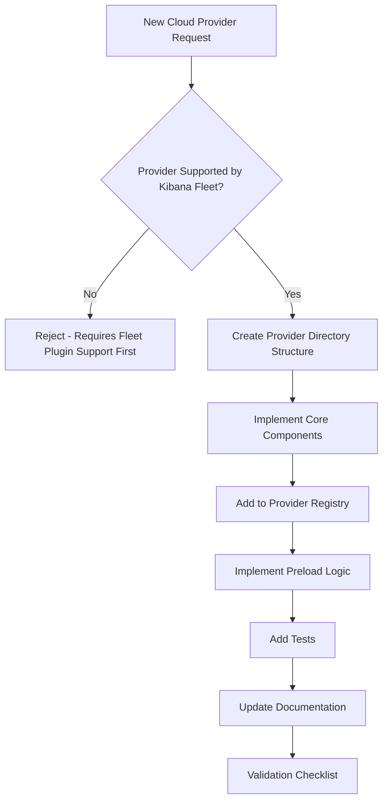
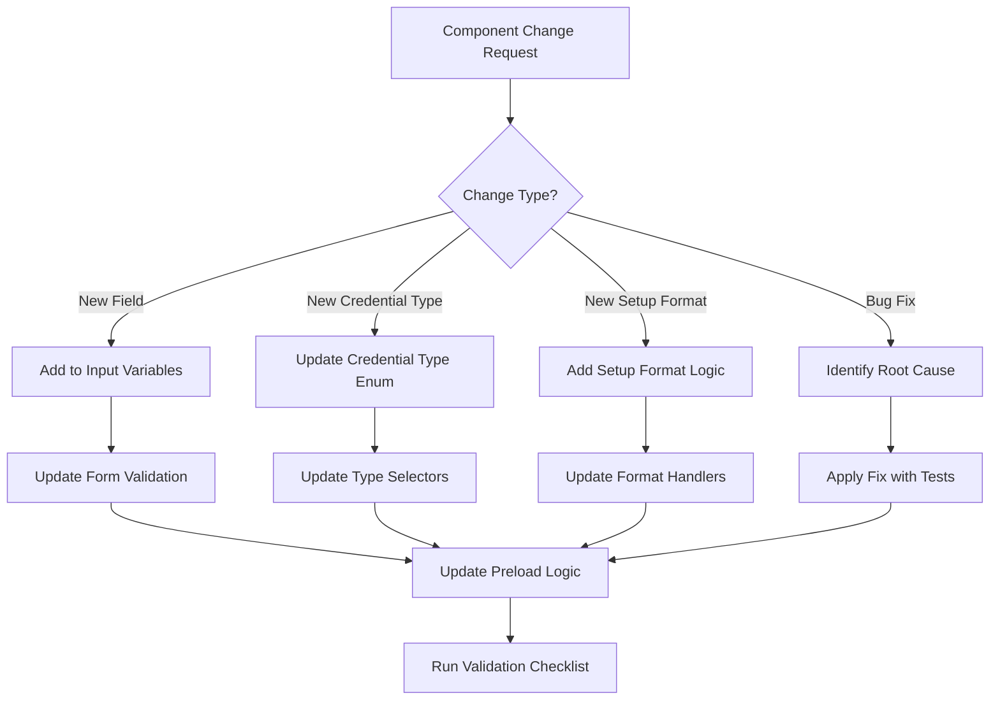
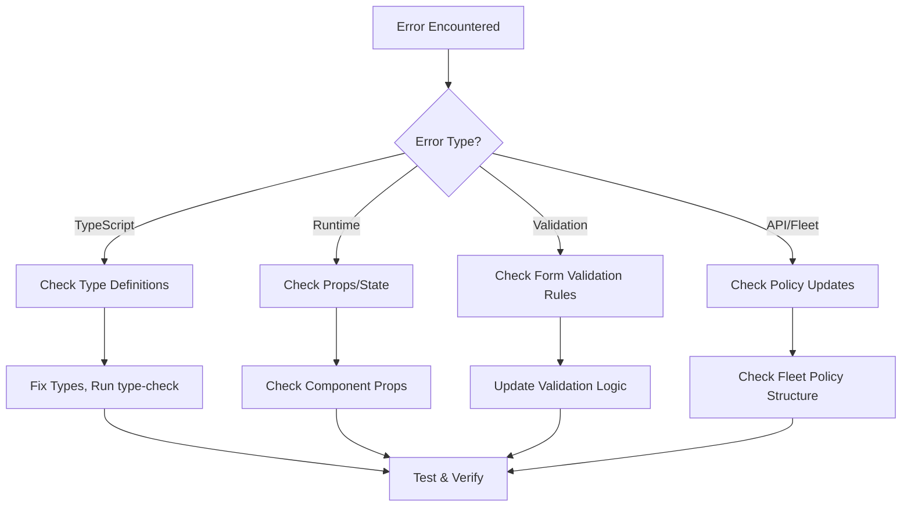

# CloudSetup Agent Guide

This comprehensive guide provides instructions, patterns, and workflows for AI coding agents and developers working with the CloudSetup component system in Kibana's Cloud Security Posture package. It includes decision trees, code generation templates, validation checklists, and troubleshooting workflows optimized for both automated agents and human developers.

## Agent Usage Instructions

### For AI Coding Agents

When working with CloudSetup components, always:

1. **Read this guide first** - Understand the architecture before making changes
2. **Use the decision trees** - Follow structured workflows for consistent results
3. **Apply validation checklists** - Ensure code quality and prevent regressions
4. **Reference code templates** - Use provided patterns for new components
5. **Check troubleshooting guides** - Resolve common issues systematically

### For Human Developers

This guide serves as both documentation and AI agent instructions. Use it to:

- Understand component architecture and relationships
- Follow best practices for new feature development
- Maintain consistency across the codebase
- Onboard new team members efficiently

## Overview

The CloudSetup component system provides a unified interface for configuring cloud security integrations across AWS, GCP, and Azure platforms. It handles credential management, setup formats, account types, and deployment methods.

## AI Agent Development Workflows

### 🤖 Decision Tree: Adding New Cloud Provider Support



**Implementation Steps:**

1. **Create directory**: `/[provider]_credentials_form/`
2. **Core files needed**:
   - `[provider]_credentials_form.tsx` (agent-based)
   - `[provider]_credentials_form_agentless.tsx` (agentless)
   - `[provider]_input_var_fields.tsx`
   - `[provider]_setup_info.tsx`
3. **Add to constants**: Update `constants.ts` with provider-specific values
4. **Implement preload**: Add provider logic to `preloadPolicyWithCloudCredentials()`
5. **Register provider**: Update `CloudSetupProvider` and routing

### 🔧 Decision Tree: Modifying Existing Components



### 🚨 Error Handling Decision Tree



## 📋 Agent Validation Checklists

### ✅ New Component Checklist

- [ ] **File Structure**: Follows naming conventions (`[provider]_[component].tsx`)
- [ ] **TypeScript**: All props and interfaces properly typed (no `any` types)
- [ ] **Imports**: Only necessary imports, properly organized
- [ ] **Props Interface**: Documented with JSDoc comments
- [ ] **Error Handling**: Graceful error states and loading states
- [ ] **Accessibility**: ARIA labels, keyboard navigation support
- [ ] **Testing**: Unit tests for component logic
- [ ] **Documentation**: Updated component guide and usage examples
- [ ] **Preload Integration**: If form component, integrated with preload pattern
- [ ] **Fleet Integration**: Properly updates policy structure

### ✅ Modification Checklist

- [ ] **Backward Compatibility**: Changes don't break existing functionality
- [ ] **Type Safety**: All TypeScript errors resolved
- [ ] **Performance**: No unnecessary re-renders or API calls
- [ ] **Error Boundaries**: Proper error handling implemented
- [ ] **Testing Updated**: Tests reflect new behavior
- [ ] **Documentation Updated**: Changes documented in this guide
- [ ] **Preload Logic**: Updated if policy structure changes
- [ ] **Validation Rules**: Form validation updated if needed

### ✅ Bug Fix Checklist

- [ ] **Root Cause Identified**: Clear understanding of the issue
- [ ] **Minimal Fix**: Changes are minimal and targeted
- [ ] **No Side Effects**: Fix doesn't introduce new issues
- [ ] **Test Coverage**: Bug scenario covered by tests
- [ ] **Edge Cases Handled**: Similar edge cases addressed
- [ ] **Documentation Updated**: Known issues section updated if needed

## 🎯 Agent Code Generation Templates

### New Cloud Provider Form Template

```typescript
// File: [provider]_credentials_form/[provider]_credentials_form.tsx
import React from 'react';
import { EuiForm, EuiFormRow, EuiFieldText } from '@elastic/eui';
import { type NewPackagePolicy } from '@kbn/fleet-plugin/public';
import type { NewPackagePolicyInput, PackageInfo } from '@kbn/fleet-plugin/common';
import { SetupTechnology } from '@kbn/fleet-plugin/public';

import {
  updatePolicyWithInputs,
  preloadPolicyWithCloudCredentials,
  [PROVIDER]_CREDENTIALS_TYPE,
} from '../utils';
import { useCloudSetup } from '../hooks/use_cloud_setup_context';
import type { UpdatePolicy } from '../types';

interface [Provider]FormProps {
  newPolicy: NewPackagePolicy;
  input: NewPackagePolicyInput;
  updatePolicy: UpdatePolicy;
  packageInfo: PackageInfo;
  disabled: boolean;
  isEditPage?: boolean;
  hasInvalidRequiredVars: boolean;
}

export const [Provider]CredentialsForm = ({
  input,
  newPolicy,
  updatePolicy,
  packageInfo,
  disabled,
  hasInvalidRequiredVars,
}: [Provider]FormProps) => {
  const {
    [provider]PolicyType,
    templateName,
    [provider]OrganizationEnabled,
  } = useCloudSetup();

  // Preload policy with default [Provider] credentials to reduce Fleet updates
  preloadPolicyWithCloudCredentials({
    provider: '[provider]',
    input,
    newPolicy,
    updatePolicy,
    policyType: [provider]PolicyType,
    packageInfo,
    templateName: templateName || '',
    setupTechnology: SetupTechnology.AGENT_BASED,
    isCloudConnectorEnabled: false, // Update based on provider support
    organizationEnabled: [provider]OrganizationEnabled,
  });

  // Component implementation...

  return (
    <EuiForm>
      {/* Form fields */}
    </EuiForm>
  );
};
```

### New Preload Provider Logic Template

```typescript
// Add to utils.ts in addProviderSpecificUpdates()
case '[provider]':
  updatedPolicy = add[Provider]TemplateUpdates(
    updatedPolicy,
    packageInfo,
    templateName,
    setupTechnology
  );
  break;

// Add new function:
const add[Provider]TemplateUpdates = (
  policy: NewPackagePolicy,
  packageInfo: PackageInfo,
  templateName: string,
  setupTechnology: SetupTechnology
): NewPackagePolicy => {
  // Only process for agent-based setup if using templates
  if (setupTechnology === SetupTechnology.AGENTLESS) {
    return policy;
  }

  // Get template URL from package if available
  const templateUrl = get[Provider]TemplateDefaultValue(packageInfo, templateName);
  if (!templateUrl) {
    return policy;
  }

  // Set template URL in appropriate policy structure
  return {
    ...policy,
    vars: { // or config, depending on provider structure
      ...policy.vars,
      [provider]_template_url: {
        value: templateUrl,
        type: 'text',
      },
    },
  };
};
```

## 🔍 Agent Troubleshooting Guides

### Common Issues and Solutions

#### Issue: Component Not Rendering

**Symptoms**: Component appears blank or throws runtime errors
**Diagnostic Steps**:

1. Check browser console for errors
2. Verify all required props are passed
3. Check TypeScript compilation errors
4. Validate component registration in parent

**Solutions**:

```typescript
// ✅ Ensure proper prop validation
interface ComponentProps {
  requiredProp: string;
  optionalProp?: boolean;
}

// ✅ Add error boundaries
const ComponentWithErrorBoundary = () => {
  try {
    return <YourComponent {...props} />;
  } catch (error) {
    return <ErrorFallback error={error} />;
  }
};
```

#### Issue: Form Validation Not Working

**Symptoms**: Form allows invalid submissions or shows incorrect validation states
**Diagnostic Steps**:

1. Check validation rules in form component
2. Verify validation functions are called
3. Check Fleet policy validation integration
4. Validate error state management

**Solutions**:

```typescript
// ✅ Proper validation implementation
const validateField = (value: string): string[] => {
  const errors: string[] = [];
  if (!value) errors.push('Field is required');
  if (value.length < 3) errors.push('Minimum 3 characters');
  return errors;
};

// ✅ Integration with hasInvalidRequiredVars
const fieldErrors = validateField(fieldValue);
const isFieldInvalid = fieldErrors.length > 0 || hasInvalidRequiredVars;
```

#### Issue: Policy Updates Not Working

**Symptoms**: Changes don't persist or cause multiple API calls
**Diagnostic Steps**:

1. Check preload function implementation
2. Verify updatePolicy function usage
3. Check policy structure matches Fleet expectations
4. Validate no conflicting useEffect hooks

**Solutions**:

```typescript
// ✅ Use preload pattern for initialization
preloadPolicyWithCloudCredentials({
  provider: 'aws',
  // ... other params
});

// ✅ Use updatePolicy for user interactions only
const handleFieldChange = (field: string, value: string) => {
  updatePolicy({
    updatedPolicy: updatePolicyWithInputs(newPolicy, policyType, {
      [field]: { value, type: 'text' },
    }),
  });
};
```

### Performance Troubleshooting

#### Issue: Slow Form Loading

**Diagnostic Approach**:

1. Check for excessive useEffect hooks
2. Monitor policy update frequency
3. Verify preload efficiency
4. Check for unnecessary re-renders

**Solutions**:

- Consolidate initialization logic in preload
- Remove redundant useEffect hooks
- Use React.memo() for expensive components
- Implement proper dependency arrays

#### Issue: Memory Leaks

**Diagnostic Approach**:

1. Check for uncleaned event listeners
2. Verify useEffect cleanup functions
3. Monitor component mount/unmount cycles
4. Check for retained references

**Solutions**:

- Add cleanup functions to useEffect hooks
- Use AbortController for async operations
- Properly dispose of event listeners
- Avoid closures over large objects

## Core Architecture

### Main Components Hierarchy

```
CloudSetup (Main Container)
├── CloudSetupProvider (Context Provider)
├── ProviderSelector (Cloud Provider Selection)
├── AWS Components
│   ├── AwsCredentialsForm
│   ├── AwsCredentialsFormAgentless
│   ├── AwsAccountTypeSelector
│   ├── AwsCredentialTypeSelector
│   ├── AwsInputVarFields
│   └── AwsSetupInfo
├── GCP Components
│   ├── GcpCredentialsForm
│   ├── GcpCredentialsFormAgentless
│   ├── GcpAccountTypeSelector
│   └── GcpInputVarFields
├── Azure Components
│   ├── AzureCredentialsForm
│   ├── AzureCredentialsFormAgentless
│   ├── AzureAccountTypeSelector
│   ├── AzureCredentialTypeSelector
│   └── AzureInputVarFields
└── Common Components
    ├── ReadDocumentation
    ├── IntegrationSettings
    └── RadioGroup
```

## Core Context System

### CloudSetupProvider

**Location**: `cloud_setup_context.tsx`

Provides global state and configuration for all cloud setup components.

**Props**:

- `packagePolicy: NewPackagePolicy` - Fleet package policy configuration
- `packageInfo: PackageInfo` - Package metadata and version info
- `config: CloudSetupConfig` - Provider-specific configuration
- `uiSettings: IUiSettingsClient` - Kibana UI settings
- `cloud: CloudSetup` - Cloud plugin configuration
- `children: React.ReactNode` - Child components

**Usage**:

```tsx
<CloudSetupProvider
  packagePolicy={policy}
  packageInfo={info}
  config={cloudConfig}
  uiSettings={uiSettings}
  cloud={cloudSetup}
>
  {/* Your components */}
</CloudSetupProvider>
```

### useCloudSetup Hook

**Location**: `hooks/use_cloud_setup_context.tsx`

Hook for accessing cloud setup context throughout the component tree.

**Returns**:

- `awsPolicyType: string` - AWS policy type identifier
- `gcpPolicyType: string` - GCP policy type identifier
- `azurePolicyType: string` - Azure policy type identifier
- `shortName: string` - Integration short name (e.g., "CSPM")
- `templateName: string` - Template name for CloudFormation/ARM
- `awsInputFieldMapping: AwsInputFieldMapping` - Field mappings for AWS forms
- `isAwsCloudConnectorEnabled: boolean` - Cloud connector availability
- Cloud connector templates and configuration

## AWS Components

### AwsCredentialsForm

**Location**: `aws_credentials_form/aws_credentials_form.tsx`

Main AWS credentials configuration component.

**Props**:

- `newPolicy: NewPackagePolicy` - Policy being configured
- `input: NewPackagePolicyInput` - Specific input configuration
- `updatePolicy: UpdatePolicy` - Function to update policy state
- `packageInfo: PackageInfo` - Package information
- `disabled: boolean` - Whether form is disabled
- `hasInvalidRequiredVars: boolean` - Validation state
- `isValid: boolean` - Overall form validity

**Key Features**:

- CloudFormation vs Manual setup selection
- Organization vs Single account support
- Dynamic credential type selection
- Integration with AWS hooks

**Test Selectors**:

- `aws-setup-info` - Setup information section
- `aws-cloudformation-setup-option` - CloudFormation radio button
- `aws-manual-setup-option` - Manual setup radio button
- `aws-credentials-type-selector` - Credential type dropdown
- `externalLink` - Documentation links

### AwsCredentialTypeSelector

**Location**: `aws_credentials_form/aws_credential_type_selector.tsx`

Dropdown for selecting AWS credential types (assume role, direct keys, etc.).

**Props**:

- `type: string` - Currently selected credential type
- `options: Array` - Available credential options
- `onChange: (type: string) => void` - Change handler
- `disabled: boolean` - Disabled state
- `label: string` - Field label

**Supported Types**:

- `assume_role` - IAM role assumption
- `direct_access_keys` - Access key/secret key
- `temporary_keys` - Temporary security credentials
- `shared_credentials` - Shared credentials file
- `cloud_connectors` - Cloud connector integration
- `cloud_formation` - CloudFormation deployment

### AwsAccountTypeSelector

**Location**: `aws_credentials_form/aws_account_type_selector.tsx`

Selector for AWS account deployment type.

**Props**:

- `input: NewPackagePolicyInput` - Input configuration
- `newPolicy: NewPackagePolicy` - Policy configuration
- `updatePolicy: UpdatePolicy` - Update function
- `packageInfo: PackageInfo` - Package info

**Account Types**:

- `single-account` - Single AWS account
- `organization-account` - AWS Organizations management account

### AwsInputVarFields

**Location**: `aws_credentials_form/aws_input_var_fields.tsx`

Dynamic form fields for AWS credential inputs.

**Props**:

- `fields: Array` - Field configuration array
- `packageInfo: PackageInfo` - Package information
- `onChange: (key: string, value: string) => void` - Change handler

**Dynamic Fields** (based on credential type):

- Access Key ID
- Secret Access Key
- Session Token
- Role ARN
- External ID
- Shared Credentials File
- Credential Profile Name

### AwsSetupInfo

**Location**: `aws_credentials_form/aws_setup_info.tsx`

Informational component explaining AWS setup process.

**Props**:

- `info: React.ReactNode` - Informational content to display

## GCP Components

### GcpCredentialsForm

**Location**: `gcp_credentials_form/gcp_credential_form.tsx`

Main GCP credentials configuration component.

**Features**:

- Cloud Shell vs Manual setup
- Service account key management
- Project ID configuration
- Credentials file upload

### GcpAccountTypeSelector

Similar to AWS account type selector but for GCP organizations.

**Account Types**:

- `single-project` - Single GCP project
- `organization-project` - GCP organization

### GcpInputVarFields

Dynamic form fields for GCP-specific inputs:

- Project ID
- Credentials JSON
- Service Account Key File

## Azure Components

### AzureCredentialsForm

**Location**: `azure_credentials_form/azure_credentials_form.tsx`

Main Azure credentials configuration component.

**Features**:

- ARM Template vs Manual setup
- Service principal configuration
- Managed identity support
- Subscription/tenant management

### AzureCredentialTypeSelector

Azure-specific credential type selection.

**Supported Types**:

- `service_principal_with_client_secret`
- `service_principal_with_client_certificate`
- `service_principal_with_client_username_and_password`
- `managed_identity`
- `arm_template`
- `cloud_connectors`

### AzureAccountTypeSelector

Azure account deployment type selector.

**Account Types**:

- `single-subscription` - Single Azure subscription
- `organization-subscription` - Azure organization

## Common Components

### ReadDocumentation

**Location**: `common.tsx`

Reusable component for documentation links.

**Props**:

- `url: string` - Documentation URL

**Features**:

- Opens links in new tab
- Consistent styling
- Accessibility support

**Test Selector**: `externalLink`

### RadioGroup

**Location**: `csp_boxed_radio_group.tsx`

Custom radio button group component.

**Props**:

- `options: CspRadioOption[]` - Radio button options
- `idSelected: string` - Currently selected option
- `onChange: (id: string) => void` - Change handler
- `disabled: boolean` - Disabled state
- `size: 's' | 'm' | 'l'` - Size variant
- `name: string` - Form field name

## Configuration System

### CloudSetupConfig

**Location**: `types.ts`

Main configuration interface for cloud setup.

```typescript
interface CloudSetupConfig {
  policyTemplate: string; // Policy template name
  name: string; // Full integration name
  shortName: string; // Short name (e.g., "CSPM")
  defaultProvider: CloudProviders; // Default cloud provider
  namespaceSupportEnabled?: boolean;
  overviewPath: string; // Overview page path
  getStartedPath: string; // Getting started path
  showCloudTemplates: boolean; // Enable cloud templates
  providers: {
    aws: AwsCloudProviderConfig;
    gcp: GcpCloudProviderConfig;
    azure: AzureProviderConfig;
  };
}
```

### Provider-Specific Configuration

#### AwsCloudProviderConfig

```typescript
interface AwsCloudProviderConfig extends CloudProviderConfig {
  inputFieldMapping?: AwsInputFieldMapping; // Field mappings
}
```

#### CloudProviderConfig

```typescript
interface CloudProviderConfig {
  type: string; // Provider policy type
  enableOrganization?: boolean; // Organization support
  getStartedPath: string; // Documentation path
  enabled?: boolean; // Provider enabled
  cloudConnectorEnabledVersion?: string; // Min version for connectors
}
```

## Constants Reference

### Setup Formats

```typescript
// AWS
AWS_SETUP_FORMAT = {
  CLOUD_FORMATION: 'cloud_formation',
  MANUAL: 'manual',
};

// Azure
AZURE_SETUP_FORMAT = {
  ARM_TEMPLATE: 'arm_template',
  MANUAL: 'manual',
};

// GCP
GCP_SETUP_ACCESS = {
  CLOUD_SHELL: 'google_cloud_shell',
  MANUAL: 'manual',
};
```

### Credential Types

```typescript
// AWS
AWS_CREDENTIALS_TYPE = {
  CLOUD_CONNECTORS: 'cloud_connectors',
  ASSUME_ROLE: 'assume_role',
  DIRECT_ACCESS_KEYS: 'direct_access_keys',
  TEMPORARY_KEYS: 'temporary_keys',
  SHARED_CREDENTIALS: 'shared_credentials',
  CLOUD_FORMATION: 'cloud_formation',
};

// GCP
GCP_CREDENTIALS_TYPE = {
  CREDENTIALS_FILE: 'credentials-file',
  CREDENTIALS_JSON: 'credentials-json',
  CREDENTIALS_NONE: 'credentials-none',
};

// Azure
AZURE_CREDENTIALS_TYPE = {
  ARM_TEMPLATE: 'arm_template',
  CLOUD_CONNECTORS: 'cloud_connectors',
  SERVICE_PRINCIPAL_WITH_CLIENT_SECRET: 'service_principal_with_client_secret',
  SERVICE_PRINCIPAL_WITH_CLIENT_CERTIFICATE: 'service_principal_with_client_certificate',
  SERVICE_PRINCIPAL_WITH_CLIENT_USERNAME_AND_PASSWORD:
    'service_principal_with_client_username_and_password',
  MANAGED_IDENTITY: 'managed_identity',
};
```

## Testing Guidelines

### Component Testing

- Use `I18nProvider` wrapper for components with internationalization
- Mock hooks using `jest.mock()` for isolated component testing
- Use real implementations where possible for integration testing
- Prefer `screen.getByLabelText()` and `screen.getByRole()` over test IDs

### Common Test Patterns

```typescript
// Setup component with providers
const renderWithProviders = (props: ComponentProps) => {
  return render(
    <I18nProvider>
      <ComponentName {...props} />
    </I18nProvider>
  );
};

// Mock hook returns
mockUseAwsCredentialsForm.mockReturnValue({
  awsCredentialsType: 'direct_access_keys',
  setupFormat: AWS_SETUP_FORMAT.MANUAL,
  // ... other returns
});

// Test user interactions
fireEvent.click(screen.getByRole('radio', { name: 'CloudFormation' }));
expect(mockOnSetupFormatChange).toHaveBeenCalledWith(AWS_SETUP_FORMAT.CLOUD_FORMATION);
```

### Key Test Selectors

- `aws-cloudformation-setup-option` - CloudFormation radio
- `aws-manual-setup-option` - Manual setup radio
- `aws-credentials-type-selector` - Credential type dropdown
- `externalLink` - Documentation links
- `aws-setup-info` - Setup information sections

## Utility Functions

### updatePolicyWithInputs

Updates package policy with new input values.

**Parameters**:

- `policy: NewPackagePolicy` - Current policy
- `policyType: string` - Provider policy type
- `updates: Record<string, any>` - Updates to apply

### getAwsCredentialsType

Extracts current AWS credentials type from input configuration.

### getCloudFormationDefaultValue

Gets CloudFormation template URL from package info.

## Error Handling

### Common Error Scenarios

1. **Missing CloudFormation template**: Show warning message
2. **Invalid credentials**: Highlight validation errors
3. **Network connectivity**: Handle cloud connector failures
4. **Version compatibility**: Check minimum versions for features

### Validation Patterns

- Required field validation
- Format validation (JSON, URLs, etc.)
- Cross-field validation (e.g., role ARN format)
- Version compatibility checks

## Integration Points

### Fleet Plugin Integration

- `NewPackagePolicy` and `NewPackagePolicyInput` types
- `updatePolicy` callback for policy changes
- `PackageInfo` for version and metadata

### Cloud Plugin Integration

- Cloud connector detection
- Multi-cloud deployment support
- Elastic Stack ID resolution

### UI Settings Integration

- Feature flag management
- User preference storage
- Theme and localization

## Development Best Practices

### Component Development

1. **Use TypeScript interfaces** for all props and state
2. **Implement proper error boundaries** for graceful failures
3. **Add comprehensive test coverage** including edge cases
4. **Follow accessibility guidelines** with proper ARIA labels
5. **Use consistent naming conventions** across components

### State Management

1. **Minimize local state** - prefer context for shared data
2. **Use proper dependency arrays** in useEffect hooks
3. **Handle async operations** with proper loading states
4. **Implement optimistic updates** where appropriate

### TypeScript Best Practices - Avoiding `any` Types

#### Why Avoid `any`

Using `any` defeats the purpose of TypeScript by:

- Disabling type checking and losing compile-time safety
- Eliminating IntelliSense and code completion
- Making refactoring dangerous and error-prone
- Hiding potential runtime errors until production

#### Strategies to Replace `any`

##### 1. Use Specific Interface Definitions

```typescript
// ❌ Bad - loses all type safety
const handleChange = (event: any) => {
  setFormData(event.target.value);
};

// ✅ Good - specific event type
const handleChange = (event: React.ChangeEvent<HTMLInputElement>) => {
  setFormData(event.target.value);
};

// ✅ Good - custom interface for complex objects
interface AwsCredentialsFormData {
  accessKeyId: string;
  secretAccessKey: string;
  roleArn?: string;
  externalId?: string;
}

const handleFormSubmit = (formData: AwsCredentialsFormData) => {
  // Type-safe access to properties
  updatePolicy({ 'aws.access_key_id': { value: formData.accessKeyId } });
};
```

##### 2. Use Generic Types for Reusable Components

```typescript
// ❌ Bad - any loses type information
interface RadioGroupProps {
  options: any[];
  onChange: (value: any) => void;
}

// ✅ Good - generic preserves type safety
interface RadioGroupProps<T> {
  options: Array<{
    id: T;
    label: string;
    testId: string;
  }>;
  onChange: (value: T) => void;
  idSelected: T;
}

// Usage with specific types
<RadioGroup<AwsSetupFormat>
  options={setupFormatOptions}
  idSelected={setupFormat}
  onChange={(format) => onSetupFormatChange(format)} // format is typed as AwsSetupFormat
/>;
```

##### 3. Use Union Types for Known Variations

```typescript
// ❌ Bad - any allows invalid values
interface ComponentProps {
  size: any;
  variant: any;
}

// ✅ Good - union types restrict to valid values
interface ComponentProps {
  size: 'small' | 'medium' | 'large';
  variant: 'primary' | 'secondary' | 'danger';
}

// ✅ Use const assertions for better type inference
const AWS_SETUP_FORMATS = {
  CLOUD_FORMATION: 'cloud_formation',
  MANUAL: 'manual',
} as const;

type AwsSetupFormat = (typeof AWS_SETUP_FORMATS)[keyof typeof AWS_SETUP_FORMATS];
```

##### 4. Use `unknown` Instead of `any` for Truly Unknown Data

```typescript
// ❌ Bad - any bypasses all checks
const parseApiResponse = (response: any) => {
  return response.data.items; // No type checking
};

// ✅ Good - unknown forces type checking
const parseApiResponse = (response: unknown): ApiItem[] => {
  if (isApiResponse(response)) {
    return response.data.items; // Type-safe after validation
  }
  throw new Error('Invalid API response format');
};

// Type guard function
const isApiResponse = (obj: unknown): obj is ApiResponse => {
  return (
    typeof obj === 'object' &&
    obj !== null &&
    'data' in obj &&
    typeof (obj as any).data === 'object'
  );
};
```

##### 5. Use Utility Types for Complex Scenarios

```typescript
// ✅ Use Pick to select specific properties
type UpdatePolicyParams = Pick<NewPackagePolicy, 'inputs' | 'name' | 'vars'>;

// ✅ Use Partial for optional updates
type PolicyUpdates = Partial<NewPackagePolicy>;

// ✅ Use Record for key-value mappings
type FieldMappings = Record<string, { value: string; type?: string }>;

// ✅ Use Extract/Exclude for union manipulation
type ManualCredentialTypes = Exclude<AwsCredentialsType, 'cloud_formation'>;
```

##### 6. Proper Event Handler Typing

```typescript
// ❌ Bad - loses event type information
const handleClick = (e: any) => {
  e.preventDefault();
  // No type safety for event properties
};

// ✅ Good - specific event types
const handleClick = (e: React.MouseEvent<HTMLButtonElement>) => {
  e.preventDefault(); // Type-safe event methods
  const target = e.currentTarget; // Typed as HTMLButtonElement
};

const handleFormChange = (e: React.ChangeEvent<HTMLSelectElement>) => {
  const { value, name } = e.target; // Both are typed correctly
  updateFormField(name, value);
};
```

##### 7. Mock Types in Tests

```typescript
// ❌ Bad - any in mocks loses type safety
const mockUpdatePolicy = jest.fn() as any;

// ✅ Good - properly typed mocks
const mockUpdatePolicy = jest.fn<void, [UpdatePolicyParams]>();

// ✅ Use jest.MockedFunction for existing functions
const mockUseAwsCredentialsForm = useAwsCredentialsForm as jest.MockedFunction<
  typeof useAwsCredentialsForm
>;

// ✅ Type mock return values
mockUseAwsCredentialsForm.mockReturnValue({
  awsCredentialsType: 'direct_access_keys' as AwsCredentialsType,
  setupFormat: AWS_SETUP_FORMAT.MANUAL,
  hasCloudFormationTemplate: true,
  onSetupFormatChange: jest.fn(),
  // ... other properly typed properties
});
```

##### 8. Handle External Library Types

```typescript
// ❌ Bad - any for external libraries
const processFleetData = (fleetData: any) => {
  return fleetData.inputs.map((input: any) => input.config);
};

// ✅ Good - import proper types from libraries
import type { NewPackagePolicy, NewPackagePolicyInput } from '@kbn/fleet-plugin/common';

const processFleetData = (policy: NewPackagePolicy): PolicyConfig[] => {
  return policy.inputs.map((input: NewPackagePolicyInput) => input.config);
};

// ✅ Create wrapper types if library types are insufficient
interface EnhancedPackagePolicy extends NewPackagePolicy {
  cloudSetupMetadata?: {
    provider: CloudProviders;
    setupFormat: string;
  };
}
```

#### ESLint Rules to Enforce Type Safety

Add these rules to your ESLint configuration:

```json
{
  "rules": {
    "@typescript-eslint/no-explicit-any": "error",
    "@typescript-eslint/no-unsafe-assignment": "error",
    "@typescript-eslint/no-unsafe-call": "error",
    "@typescript-eslint/no-unsafe-member-access": "error",
    "@typescript-eslint/no-unsafe-return": "error"
  }
}
```

#### Migration Strategy for Existing `any` Types

1. **Identify all `any` usages** with `grep -r ": any" --include="*.ts" --include="*.tsx"`
2. **Start with function parameters and return types** - highest impact
3. **Replace with `unknown` first** if exact type is unclear
4. **Create specific interfaces** for recurring patterns
5. **Add type guards** for runtime validation
6. **Test thoroughly** after each replacement

#### Common Cloud Setup Type Definitions

```typescript
// Use these instead of any for common scenarios
type CloudProvider = 'aws' | 'gcp' | 'azure';
type SetupFormat = 'manual' | 'cloud_formation' | 'arm_template' | 'google_cloud_shell';
type CredentialType = AwsCredentialsType | GcpCredentialsType | AzureCredentialsType;

interface CloudSetupFormProps {
  provider: CloudProvider;
  setupFormat: SetupFormat;
  credentialType: CredentialType;
  onUpdate: (updates: PolicyUpdates) => void;
  disabled: boolean;
}

interface ValidationResult {
  isValid: boolean;
  errors: Array<{
    field: string;
    message: string;
  }>;
}
```

## Preload Pattern and useEffect Optimization

### Problem: Excessive Fleet Policy Updates

The original implementation had multiple useEffect hooks that triggered policy updates during component lifecycle, causing:

- Multiple API calls to Fleet on form initialization
- Performance degradation with complex forms
- Race conditions between different useEffect hooks
- Unnecessary re-renders and policy state churn

### Solution: Consolidated Preload Pattern

Implemented `preloadPolicyWithCloudCredentials()` function that consolidates all initial policy setup into a single update operation.

#### Preload Function Architecture

**Location**: `utils.ts`

```typescript
export const preloadPolicyWithCloudCredentials = ({
  provider,
  input,
  newPolicy,
  updatePolicy,
  policyType,
  packageInfo,
  templateName,
  setupTechnology,
  isCloudConnectorEnabled = false,
  organizationEnabled = false,
}: PreloadParams): void => {
  // Early return if already initialized
  if (existingCredentialsType) return;

  // Get all default values in one operation
  const defaultVars = getInputHiddenVars(...);
  const enhancedVars = { ...defaultVars };

  // Add provider-specific defaults
  addProviderDefaults(provider, enhancedVars, isAgentless);
  addAccountTypeDefaults(provider, input, enhancedVars, organizationEnabled);

  // Add template-specific updates (CloudFormation, ARM, Cloud Shell)
  let updatedPolicy = updatePolicyWithInputs(newPolicy, policyType, enhancedVars);
  updatedPolicy = addProviderSpecificUpdates(provider, updatedPolicy, packageInfo, templateName, setupTechnology);

  // Single policy update with all defaults
  updatePolicy({ updatedPolicy });
};
```

#### Provider-Specific Template Updates

Templates and deployment configurations are handled through dedicated functions:

```typescript
// AWS CloudFormation templates
const addAwsCloudFormationUpdates = (policy, packageInfo, templateName, setupTechnology) => {
  if (setupTechnology === SetupTechnology.AGENTLESS) return policy;
  const templateUrl = getCloudFormationDefaultValue(packageInfo, templateName);
  // Set CloudFormation URL in input config
};

// GCP Cloud Shell URLs
const addGcpCloudShellUpdates = (policy, packageInfo, templateName, setupTechnology) => {
  if (setupTechnology === SetupTechnology.AGENTLESS) return policy;
  const templateUrl = getCloudShellDefaultValue(packageInfo, templateName);
  // Set Cloud Shell URL in policy vars
};

// Azure ARM templates
const addAzureArmTemplateUpdates = (policy, packageInfo, templateName, setupTechnology) => {
  if (setupTechnology === SetupTechnology.AGENTLESS) return policy;
  const templateUrl = getArmTemplateUrlFromPackage(packageInfo, templateName);
  // Set ARM template URL in policy
};
```

#### Implementation in Forms

Each cloud provider form calls preload during initialization:

```typescript
// AWS Form
preloadPolicyWithCloudCredentials({
  provider: 'aws',
  input,
  newPolicy,
  updatePolicy,
  policyType: awsPolicyType,
  packageInfo,
  templateName: templateName || '',
  setupTechnology: SetupTechnology.AGENT_BASED, // or AGENTLESS
  isCloudConnectorEnabled: isAwsCloudConnectorEnabled,
  organizationEnabled: awsOrganizationEnabled,
});

// GCP Form
preloadPolicyWithCloudCredentials({
  provider: 'gcp',
  input,
  newPolicy,
  updatePolicy,
  policyType: gcpPolicyType,
  packageInfo,
  templateName: templateName || '',
  setupTechnology: SetupTechnology.AGENT_BASED,
  isCloudConnectorEnabled: false, // GCP doesn't support cloud connectors yet
  organizationEnabled: gcpOrganizationEnabled,
});

// Azure Form
preloadPolicyWithCloudCredentials({
  provider: 'azure',
  input,
  newPolicy,
  updatePolicy,
  policyType: azurePolicyType,
  packageInfo,
  templateName: templateName || '',
  setupTechnology: SetupTechnology.AGENT_BASED,
  isCloudConnectorEnabled: isAzureCloudConnectorEnabled,
  organizationEnabled: azureOrganizationEnabled,
});
```

### Removed Redundant useEffect Hooks

#### ❌ Removed: GCP Cloud Shell URL useEffect

**Previously in**: `gcp_credential_form.tsx`

```typescript
// REMOVED - This logic is now handled in preload
const useCloudShellUrl = ({ packageInfo, newPolicy, updatePolicy, setupFormat }) => {
  useEffect(() => {
    // Update Cloud Shell URL when setup format changes
    const templateUrl = getCloudShellDefaultValue(packageInfo, templateName);
    updateCloudShellUrl(newPolicy, updatePolicy, templateUrl, gcpPolicyType);
  }, [setupFormat, packageInfo]);
};
```

**Why removed**: Cloud Shell URLs are now set during preload via `addGcpCloudShellUpdates()`, eliminating reactive updates.

#### ✅ Kept: Vulnerability Management CloudFormation

**Location**: `use_load_fleet_extension.ts`

```typescript
// KEPT - Different purpose and structure
const useCloudFormationTemplate = ({ packageInfo, newPolicy, updatePolicy }) => {
  useEffect(() => {
    // Sets CloudFormation template for CLOUDBEAT_VULN_MGMT_AWS inputs
    const templateUrl = getVulnMgmtCloudFormationDefaultValue(packageInfo);
    // Updates input.config (not policy.vars)
  }, [newPolicy, packageInfo]);
};
```

**Why kept**: Serves vulnerability management (different policy structure), operates on `input.config` vs `policy.vars`, and handles `CLOUDBEAT_VULN_MGMT_AWS` specifically.

### Key Benefits Achieved

#### Performance Improvements

- **Reduced API calls**: Single policy update instead of 3-5 separate updates
- **Faster form load**: Eliminated cascading useEffect dependencies
- **Better UX**: No loading states or flicker from multiple updates

#### Code Maintainability

- **Single source of truth**: All initialization logic centralized in preload
- **Easier testing**: Pure functions easier to unit test than useEffect hooks
- **Clear separation**: Initialization vs reactive updates are distinct

#### Architectural Benefits

- **Consistent patterns**: All providers follow same preload approach
- **Extensible design**: Easy to add new providers or configuration options
- **Error handling**: Centralized validation and fallback logic

### Migration Guidelines

#### When to Use Preload vs useEffect

```typescript
// ✅ USE PRELOAD FOR:
// - Initial form setup and default values
// - Template URLs (CloudFormation, ARM, Cloud Shell)
// - Provider-specific configuration
// - Account type defaults
// - Cloud connector initialization

// ✅ USE useEffect FOR:
// - User interaction responses
// - External data fetching
// - Reactive updates based on form state changes
// - Different policy structures (like vulnerability management)
```

#### Refactoring Existing useEffects

1. **Identify initialization useEffects** that run once on mount
2. **Check if logic fits preload pattern** (sets initial policy values)
3. **Extract logic into preload helper functions**
4. **Update form components** to call preload during initialization
5. **Remove redundant useEffect hooks** and unused imports
6. **Test thoroughly** to ensure functionality is preserved

### Testing Strategy

1. **Unit test individual components** with mocked dependencies
2. **Integration test component interactions** with real dependencies
3. **Test accessibility** with screen readers and keyboard navigation
4. **Test error scenarios** and edge cases
5. **Validate internationalization** with different locales
6. **Performance test preload efficiency** vs original useEffect approach

## 🤖 AI Agent Specific Instructions

### Constraints and Limitations

**NEVER do these actions without explicit user permission:**

- Delete existing components or files
- Remove existing functionality or features
- Modify critical interfaces that other components depend on
- Change Fleet policy structure without validation
- Remove security-related validation logic
- Modify authentication or authorization logic

**ALWAYS do these actions when making changes:**

- Run TypeScript type checking after modifications
- Add proper JSDoc comments to new functions/interfaces
- Follow existing naming conventions and file structure
- Use provided validation checklists
- Test changes with provided test patterns
- Update relevant documentation sections

### Code Quality Standards for AI Agents

```typescript
// ✅ GOOD: Explicit types, clear naming, proper error handling
interface CloudProviderFormProps {
  /** The policy being configured by the user */
  newPolicy: NewPackagePolicy;
  /** Input configuration for this specific provider */
  input: NewPackagePolicyInput;
  /** Function to update the policy state */
  updatePolicy: (update: { updatedPolicy: NewPackagePolicy }) => void;
  /** Package metadata and configuration */
  packageInfo: PackageInfo;
  /** Whether the form should be in disabled state */
  disabled: boolean;
  /** Whether this is an edit operation vs new creation */
  isEditPage?: boolean;
  /** Whether there are validation errors on required fields */
  hasInvalidRequiredVars: boolean;
}

// ❌ BAD: any types, unclear naming, no error handling
interface Props {
  data: any;
  callback: (x: any) => void;
  flag: boolean;
}
```

### Decision Framework for AI Agents

When encountering ambiguous requirements, use this priority order:

1. **User Safety**: Ensure changes don't break existing functionality
2. **Security**: Maintain all security validations and constraints
3. **Performance**: Follow preload patterns, avoid excessive API calls
4. **Consistency**: Match existing code patterns and conventions
5. **Maintainability**: Write clear, documented, testable code
6. **User Experience**: Ensure forms remain accessible and intuitive

### Communication Guidelines for AI Agents

When working on CloudSetup components:

**✅ DO communicate:**

- What changes you're making and why
- Any potential risks or impacts identified
- Validation steps you're taking
- Alternative approaches considered
- Dependencies or prerequisites needed

**❌ DON'T assume:**

- User requirements are complete
- Existing code patterns are incorrect
- Performance optimizations are always needed
- Breaking changes are acceptable
- Security requirements are flexible

### Knowledge Boundaries for AI Agents

**Topics you can confidently help with:**

- Component structure and TypeScript interfaces
- Form validation and error handling
- React patterns and performance optimization
- Fleet policy structure and updates
- Testing strategies and implementation
- Code organization and documentation

**Topics requiring human validation:**

- Security and authentication changes
- Fleet plugin integration modifications
- Breaking API changes
- Production deployment considerations
- User experience design decisions
- Business logic and requirements interpretation

### Quality Assurance for AI Agents

Before completing any task, verify:

- [ ] All TypeScript errors resolved (`yarn type:check`)
- [ ] Code follows established patterns in existing components
- [ ] No `any` types introduced (unless absolutely necessary)
- [ ] Error handling properly implemented
- [ ] Documentation updated to reflect changes
- [ ] Validation checklist completed
- [ ] No security validations removed or weakened
- [ ] Performance considerations addressed

This guide provides comprehensive coverage of the CloudSetup component system optimized for both human developers and AI coding agents. When working with these components, always refer to the decision trees, validation checklists, and code templates provided to ensure consistent, high-quality results.
