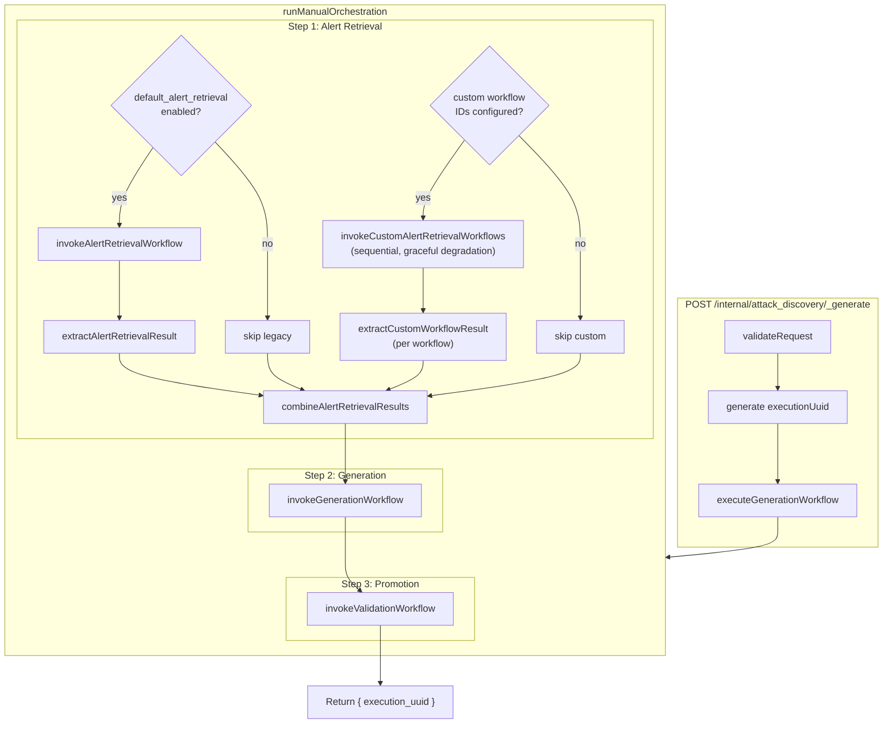
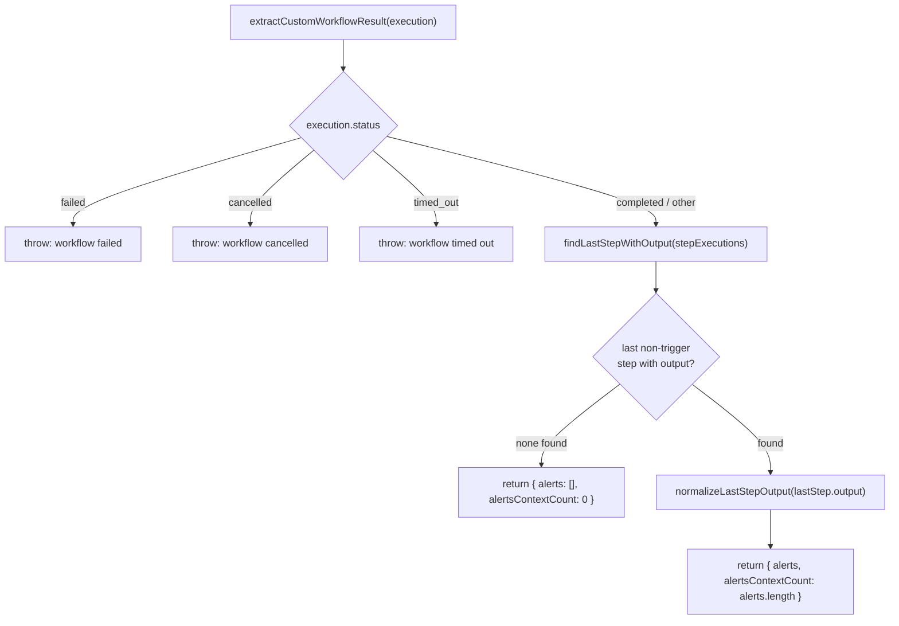
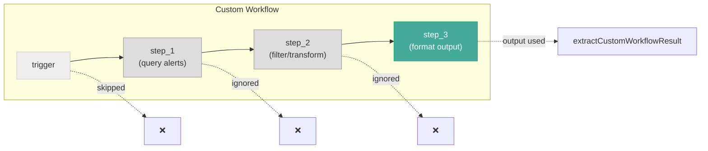
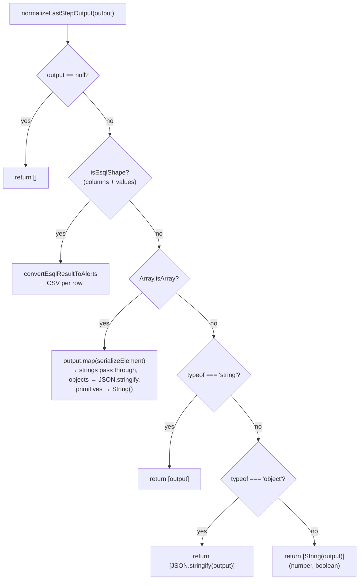
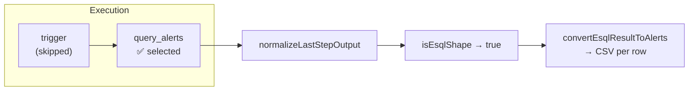

# Alert Retrieval Output Extraction

How custom alert retrieval workflows produce data that Attack Discovery consumes.

---

## Table of Contents

1. [Overview](#overview)
2. [End-to-End Architecture](#end-to-end-architecture)
3. [Extraction Logic](#extraction-logic)
4. [Design Rationale: Why Last-Step-Only](#design-rationale-why-last-step-only)
5. [Normalization Specification](#normalization-specification)
6. [Scenario Examples](#scenario-examples)
7. [Alert Format Reference](#alert-format-reference)
8. [LLM Prompt Assembly](#llm-prompt-assembly)
9. [Creating Alert Retrieval Workflows (YAML)](#creating-alert-retrieval-workflows-yaml)
10. [Agent-Builder Skill Reference](#agent-builder-skill-reference)
11. [Runtime Constraints](#runtime-constraints)

---

## Overview

Attack Discovery supports two sources of alerts:

| Source | Extractor | Output |
|--------|-----------|--------|
| **Legacy** (`attack-discovery.defaultAlertRetrieval` step) | `extractAlertRetrievalResult` | Anonymized alerts with replacements |
| **Custom** (any user-authored workflow) | `extractCustomWorkflowResult` | Raw (non-anonymized) alert strings |

Custom workflows give users full control over _which_ alerts are retrieved and _how_ they are formatted. The extraction system must handle arbitrary workflow shapes because the workflow author decides what steps to include and what the final step produces.

This document focuses on the **custom** path, specifically:

- **Extraction** — selecting which step's output to use (`extract_custom_workflow_result/`)
- **Normalization** — converting that output into `string[]` (`normalize_last_step_output/`)

---

## End-to-End Architecture

The following diagram shows how a request flows through the system, from the API endpoint through alert retrieval (both legacy and custom), combination, orchestration, and promotion.



---

## Extraction Logic

The extraction module (`extract_custom_workflow_result/index.ts`) implements a simple, deterministic algorithm.



### `findLastStepWithOutput`

Iterates `stepExecutions` from the **end** toward the beginning. For each step:

1. **Skip** if `stepId === 'trigger'` (trigger steps carry invocation metadata, not alert data)
2. **Skip** if `output == null`
3. **Return** the first step that passes both checks

If no step qualifies, returns `undefined` (the caller produces an empty result).

### Key properties

| Property | Value |
|----------|-------|
| Deterministic | Yes — same execution always yields the same result |
| Step-type agnostic | The extractor does not check `stepType` — any non-trigger step qualifies |
| Position-based | Only the **last** qualifying step matters; earlier steps are ignored |

---

## Design Rationale: Why Last-Step-Only



**Why only the last step?**

1. **Workflow authors control the pipeline.** A custom workflow may have multiple steps — query, filter, transform, format. The final step represents the author's intended output. Scanning earlier steps would second-guess that intent.

2. **No schema coupling.** The extractor doesn't need to know which step types exist or what their output shapes look like. Any future step type works automatically.

3. **Predictable behavior.** One clear rule ("use the last non-trigger step with output") is easy to reason about, test, and document. The previous multi-strategy scanning approach (searching for ES|QL shapes, then `alerts` arrays, then falling back) was fragile and surprising when workflows had intermediate steps with coincidentally matching shapes.

4. **Trigger exclusion is intentional.** Trigger steps carry invocation context (who triggered the workflow and when), not alert data. Skipping them is always correct.

5. **Null-output steps are skipped.** If the last step ran but produced no output (e.g., a side-effect step that logs or notifies), the extractor walks backward to find the nearest step with actual data. This handles workflows where the final step is a no-output side-effect.

---

## Normalization Specification

The normalizer (`normalize_last_step_output/index.ts`) converts the raw output of the last step into `string[]`. It handles every output shape the workflow engine can produce.



### Normalization rules (ordered by priority)

| # | Input Shape | Detection | Output | Example |
|---|------------|-----------|--------|---------|
| 1 | `null` / `undefined` | `output == null` | `[]` | `null` → `[]` |
| 2 | ES\|QL result | `isEsqlShape(output)` — object with `columns: []` and `values: [][]` | CSV per row via `convertEsqlResultToAlerts` | See [ES\|QL format](#esql-csv-format) |
| 3 | Array | `Array.isArray(output)` | Per-element serialization | `['a', {b:1}]` → `['a', '{"b":1}']` |
| 4 | String | `typeof === 'string'` | Wrapped in array | `'alert'` → `['alert']` |
| 5 | Object | `typeof === 'object'` | JSON-stringified, wrapped in array | `{a:1}` → `['{"a":1}']` |
| 6 | Primitive | number, boolean | `String()`, wrapped in array | `42` → `['42']` |

### `serializeElement` (for array items)

| Element type | Behavior |
|-------------|----------|
| `string` | Pass through unchanged |
| `object` (non-null) | `JSON.stringify(element)` |
| number, boolean, other | `String(element)` |

### ES|QL CSV format

Each row in the ES|QL result becomes a multi-line string:

```
fieldName1,value1a,value1b
fieldName2,value2
fieldName3,value3a,value3b,value3c
```

Rules:

- Field names (keys) are sorted **alphabetically**
- Each line: `fieldName,value1,value2,...`
- Multi-value fields (arrays) have values joined by commas
- `null` / `undefined` values are **omitted** (the entire line is skipped)
- This format matches the legacy `getCsvFromData` output, ensuring the LLM receives a consistent format regardless of retrieval source

---

## Scenario Examples

### Scenario 1: ES|QL query workflow (most common)

A single-step workflow that runs an ES|QL query against the alerts index.

**Workflow steps:**

| Step | stepId | stepType | output |
|------|--------|----------|--------|
| trigger | `trigger` | `trigger` | `{ ... }` |
| query | `query_alerts` | `elasticsearch.esql.query` | `{ columns: [...], values: [...] }` |

**Extraction path:**

1. `findLastStepWithOutput` → skips `trigger`, selects `query_alerts`
2. `normalizeLastStepOutput` → detects ES|QL shape → `convertEsqlResultToAlerts`
3. Result: CSV-formatted alert strings



**Example output (2 alerts):**

```
_id,alert-1
kibana.alert.risk_score,75
kibana.alert.rule.name,Suspicious Process
```

```
_id,alert-2
kibana.alert.risk_score,90
kibana.alert.rule.name,Malware Detected
```

### Scenario 2: Multi-step pipeline (query → transform → format)

A workflow that queries alerts, transforms them, and produces a custom format.

**Workflow steps:**

| Step | stepId | output |
|------|--------|--------|
| trigger | `trigger` | `{ ... }` |
| query | `query_alerts` | `{ columns: [...], values: [...] }` (ES\|QL) |
| transform | `filter_high_risk` | `[{ _id: 'a1', ... }, { _id: 'a2', ... }]` |
| format | `format_output` | `['formatted-alert-1', 'formatted-alert-2']` |

**Extraction path:**

1. `findLastStepWithOutput` → selects `format_output` (last non-trigger step with output)
2. `normalizeLastStepOutput` → detects array → per-element serialization (strings pass through)
3. Result: `['formatted-alert-1', 'formatted-alert-2']`

The earlier ES|QL step and transform step are **ignored** — the workflow author's formatted output is used.

### Scenario 3: Workflow with a no-output final step

A workflow where the last step is a side-effect (e.g., logging) with no output.

**Workflow steps:**

| Step | stepId | output |
|------|--------|--------|
| trigger | `trigger` | `{ ... }` |
| query | `query_alerts` | `['alert-1', 'alert-2']` |
| notify | `send_notification` | `null` |

**Extraction path:**

1. `findLastStepWithOutput` → skips `send_notification` (null output), selects `query_alerts`
2. `normalizeLastStepOutput` → detects array → strings pass through
3. Result: `['alert-1', 'alert-2']`

### Scenario 4: Workflow returning a single object

A workflow whose final step produces a single summary object.

**Workflow steps:**

| Step | stepId | output |
|------|--------|--------|
| trigger | `trigger` | `{ ... }` |
| summarize | `summarize_alerts` | `{ summary: 'Alert data', count: 5 }` |

**Extraction path:**

1. `findLastStepWithOutput` → selects `summarize_alerts`
2. `normalizeLastStepOutput` → detects plain object → `JSON.stringify` → wrap in array
3. Result: `['{"summary":"Alert data","count":5}']`

### Scenario 5: No steps produce output

**Workflow steps:**

| Step | stepId | output |
|------|--------|--------|
| trigger | `trigger` | `{ ... }` |
| query | `query_alerts` | `null` |

**Extraction path:**

1. `findLastStepWithOutput` → no qualifying step found → returns `undefined`
2. Result: `{ alerts: [], alertsContextCount: 0 }`

---

## Alert Format Reference

### Legacy alerts (anonymized)

Produced by `extractAlertRetrievalResult` from the `attack-discovery.defaultAlertRetrieval` step. These are CSV-formatted strings where field values have been replaced with anonymized tokens. A `replacements` map allows de-anonymization later.

```
_id,abc123-anon-token
kibana.alert.risk_score,75
kibana.alert.rule.name,def456-anon-token
```

The `AlertRetrievalResult` includes:

| Field | Type | Description |
|-------|------|-------------|
| `alerts` | `string[]` | Anonymized CSV-formatted alert strings |
| `alertsContextCount` | `number` | Number of alerts |
| `anonymizedAlerts` | `AnonymizedAlert[]` | Full anonymized documents (for graph input) |
| `apiConfig` | `ParsedApiConfig` | Connector configuration |
| `connectorName` | `string` | Display name of the connector |
| `replacements` | `Record<string, string>` | Token → original value map |

### Custom alerts (raw)

Produced by `extractCustomWorkflowResult`. These are raw (non-anonymized) strings in whatever format the normalizer produces.

| Field | Type | Description |
|-------|------|-------------|
| `alerts` | `string[]` | Normalized alert strings |
| `alertsContextCount` | `number` | Number of alerts (`alerts.length`) |
| `workflowId` | `string` | Source workflow ID |
| `workflowRunId` | `string` | Source workflow run ID |

### Combined result

`combineAlertRetrievalResults` merges both sources:

- Alert strings from all sources are **concatenated** into a single `alerts` array
- When only custom results exist (legacy disabled), a synthetic `AlertRetrievalResult` is constructed with empty `anonymizedAlerts` and `replacements`
- The generation step processes both anonymized and raw alert formats transparently

---

## LLM Prompt Assembly

After alert retrieval, the combined alerts are passed to the generation workflow, which invokes graph-based generation. The alerts are converted to `Document[]` via `alertsToDocuments`:

```typescript
const alertsToDocuments = (alerts: string[]): Document[] =>
  alerts.map((alert) => ({ pageContent: alert, metadata: {} }));
```

Each alert string becomes the `pageContent` of a LangChain `Document`. The LLM sees each alert as a block of text — whether it is CSV-formatted (from ES|QL or legacy anonymization) or JSON-stringified (from object outputs) or plain strings.

**Implication for workflow authors:** The format of your final step's output directly determines how the LLM sees each alert. CSV format (from ES|QL queries) is the most common and produces compact, structured text that the LLM can parse effectively.

---

## Creating Alert Retrieval Workflows (YAML)

Custom alert retrieval workflows are authored in Elastic Workflows YAML. The system passes standard inputs to every custom workflow; your workflow can use whichever inputs it needs.

### Available inputs

| Input | Type | Description |
|-------|------|-------------|
| `alerts_index_pattern` | `string` | Index pattern for security alerts (e.g., `.alerts-security.alerts-default`) |
| `size` | `number` | Maximum number of alerts to retrieve (default: `100`) |
| `start` | `string?` | ISO 8601 start time for the alert time range |
| `end` | `string?` | ISO 8601 end time for the alert time range |
| `filter` | `object?` | Additional Elasticsearch query filter |

### Example 1: Simple ES|QL alert retrieval

```yaml
name: My Custom Alert Retrieval
description: Retrieves high-risk alerts using ES|QL
inputs:
  - name: alerts_index_pattern
    type: string
  - name: size
    type: number
  - name: start
    type: string
    required: false
  - name: end
    type: string
    required: false

steps:
  - id: query_alerts
    type: elasticsearch.esql.query
    params:
      query: >
        FROM {{ inputs.alerts_index_pattern }}
        | WHERE kibana.alert.risk_score >= 70
        | SORT kibana.alert.risk_score DESC
        | LIMIT {{ inputs.size }}
```

The ES|QL step produces `{ columns, values }` which the normalizer converts to CSV-formatted alert strings.

### Example 2: ES|QL with time range filtering

```yaml
name: Time-Bounded Alert Retrieval
description: Retrieves alerts within a time range, sorted by risk score
inputs:
  - name: alerts_index_pattern
    type: string
  - name: size
    type: number
  - name: start
    type: string
    required: false
  - name: end
    type: string
    required: false

steps:
  - id: query_alerts
    type: elasticsearch.esql.query
    params:
      query: >
        FROM {{ inputs.alerts_index_pattern }}
        | WHERE @timestamp >= "{{ inputs.start }}"
        | WHERE @timestamp <= "{{ inputs.end }}"
        | WHERE kibana.alert.risk_score >= 50
        | SORT kibana.alert.risk_score DESC
        | LIMIT {{ inputs.size }}
```

### Example 3: Multi-step workflow with transformation

```yaml
name: Alert Retrieval with Enrichment
description: Queries alerts and enriches with host data
inputs:
  - name: alerts_index_pattern
    type: string
  - name: size
    type: number

steps:
  - id: query_alerts
    type: elasticsearch.esql.query
    params:
      query: >
        FROM {{ inputs.alerts_index_pattern }}
        | WHERE kibana.alert.risk_score >= 70
        | SORT kibana.alert.risk_score DESC
        | LIMIT {{ inputs.size }}

  - id: enrich_alerts
    type: transform
    params:
      # Transform step processes the ES|QL output
      # The LAST step's output is what gets extracted
      input: "{{ steps.query_alerts.output }}"
```

**Key principle:** The extraction system always uses the output from the **last non-trigger step**. If your workflow has multiple steps, ensure the final step produces the data you want Attack Discovery to see.

### Tips for workflow authors

1. **ES|QL is the recommended approach** — its `{ columns, values }` output is automatically converted to the same CSV format that the legacy retrieval uses, giving the LLM a consistent, compact representation.

2. **One step is usually enough** — a single ES|QL query step is sufficient for most use cases. Add more steps only if you need post-processing.

3. **If you add post-processing steps**, make sure the final step's output is an array of strings (one per alert). The normalizer handles other shapes, but `string[]` requires no conversion.

4. **Side-effect steps at the end are OK** — if your last step produces `null` output (e.g., a notification step), the extractor walks backward to find the nearest step with data.

5. **The `size` input defaults to 100** — your workflow receives it as an input. Use it in your `LIMIT` clause to respect the user's alert count preference.

---

## Agent-Builder Skill Reference

This section provides a compact reference for agent-builder tools that need to generate or validate custom alert retrieval workflows programmatically.

### Contract summary

| Aspect | Specification |
|--------|--------------|
| **Entry point** | `extractCustomWorkflowResult({ execution, workflowId, workflowRunId })` |
| **Input** | `WorkflowExecutionDto` (from `@kbn/workflows`) |
| **Output** | `CustomWorkflowAlertResult: { alerts: string[], alertsContextCount: number, workflowId, workflowRunId }` |
| **Step selection** | Last non-`trigger` step with non-null `output`, searching from end |
| **Normalization** | `normalizeLastStepOutput(output)` — see [Normalization Specification](#normalization-specification) |
| **Error conditions** | Throws on `failed`, `cancelled`, `timed_out` execution status |
| **Empty result** | Returns `{ alerts: [], alertsContextCount: 0 }` when no step has output |

### Workflow validation requirements

Before a custom workflow is executed, it must pass `validateAlertRetrievalWorkflow`:

- Workflow must exist (non-null)
- Must have a `definition`
- Must be `valid: true`
- Must be `enabled: true`

### Inputs provided to custom workflows

```typescript
{
  alerts_index_pattern: string;  // always provided
  end?: string;                  // ISO 8601, optional
  filter?: object;               // ES query filter, optional
  size: number;                  // default 100
  start?: string;                // ISO 8601, optional
}
```

### Output expectations for optimal results

| Priority | Output Shape | Notes |
|----------|-------------|-------|
| Best | ES\|QL `{ columns, values }` | Automatic CSV conversion, compact, structured |
| Good | `string[]` | Direct pass-through, no conversion overhead |
| Acceptable | `object[]` | JSON-stringified per element |
| Acceptable | Single `string` or `object` | Wrapped in array |
| Edge case | `number`, `boolean` | `String()` conversion |

### Graceful degradation

Custom workflows use graceful degradation at two levels:

1. **Workflow level:** If a custom workflow fails, the error is logged and processing continues with remaining workflows. Only successful workflows contribute alerts.

2. **Source level:** If legacy retrieval fails but custom workflows are configured, the error is logged and custom workflow results are used. If all sources fail, the pipeline throws.

---

## Runtime Constraints

| Constraint | Value | Notes |
|------------|-------|-------|
| Polling interval | 500ms | How often `pollForWorkflowCompletion` checks execution status |
| Maximum wait time | 5 minutes | After this, the polling throws a timeout error |
| Custom workflow execution | Sequential | Workflows in `alert_retrieval_workflow_ids` run one at a time |
| Failure handling | Graceful degradation | Failed custom workflows are skipped; remaining workflows continue |
| Terminal statuses | `failed`, `cancelled`, `timed_out`, `completed` | Execution must reach a terminal status to proceed |
| Default alert count | 100 | `size` defaults to 100 if not specified in the request |
| Trigger step | Always skipped | Steps with `stepId === 'trigger'` are never selected for extraction |
| Null-output steps | Skipped | Steps with `output == null` are skipped during last-step search |

### Event logging

Every custom workflow invocation produces event log entries:

| Event | When |
|-------|------|
| `alert_retrieval_started` | After the workflow run is initiated |
| `alert_retrieval_succeeded` | After successful extraction of results |
| `alert_retrieval_failed` | When the workflow fails at any stage |

Events include `executionUuid`, `workflowId`, `workflowRunId`, and timing information for observability.
